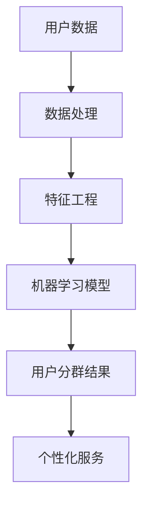

                 

# AI赋能的电商用户分群自动化

> **关键词：** 电商用户分群、自动化、人工智能、机器学习、数据处理、客户细分

> **摘要：** 本文将探讨如何利用人工智能技术，特别是机器学习和数据处理方法，来实现电商用户分群的自动化。通过介绍核心概念、算法原理、数学模型、项目实战和实际应用场景，读者将了解如何高效地分析用户数据，以实现精准营销和个性化服务。

## 1. 背景介绍

### 1.1 目的和范围

随着电子商务的快速发展，用户数据的收集和分析变得尤为重要。电商企业希望通过了解用户行为和偏好，实现精准营销和个性化服务。用户分群是一种有效的数据分析方法，通过将用户划分为不同的群体，企业可以针对不同群体制定相应的营销策略。本文的目的在于介绍如何利用人工智能技术，特别是机器学习和数据处理方法，实现电商用户分群的自动化。

### 1.2 预期读者

本文主要面向以下读者群体：

- 数据科学家和机器学习工程师
- 电商企业产品经理和市场经理
- 对人工智能和数据分析感兴趣的从业者

### 1.3 文档结构概述

本文将分为以下几个部分：

1. 背景介绍
2. 核心概念与联系
3. 核心算法原理 & 具体操作步骤
4. 数学模型和公式 & 详细讲解 & 举例说明
5. 项目实战：代码实际案例和详细解释说明
6. 实际应用场景
7. 工具和资源推荐
8. 总结：未来发展趋势与挑战
9. 附录：常见问题与解答
10. 扩展阅读 & 参考资料

### 1.4 术语表

#### 1.4.1 核心术语定义

- **用户分群**：将用户按照一定的标准或规则划分成不同的群体。
- **机器学习**：一种人工智能方法，通过数据驱动的方式，从数据中自动学习规律和模式。
- **数据处理**：对数据进行清洗、转换和整合的过程。

#### 1.4.2 相关概念解释

- **聚类算法**：一种无监督学习算法，用于将数据分为多个群体。
- **特征工程**：通过选择和构建特征，提高模型性能的过程。

#### 1.4.3 缩略词列表

- **ML**：机器学习
- **AI**：人工智能
- **API**：应用程序接口

## 2. 核心概念与联系

在介绍电商用户分群的自动化之前，我们需要了解一些核心概念和它们之间的关系。以下是一个简化的 Mermaid 流程图，用于描述这些概念。



### 2.1 用户数据

用户数据是电商用户分群的基础。这些数据通常包括用户的基本信息（如年龄、性别、地理位置）、购买历史、浏览行为等。用户数据的质量直接影响分群的效果。

### 2.2 数据处理

数据处理是对原始用户数据进行清洗、转换和整合的过程。这一步骤的目的是去除噪声数据、缺失值填充、数据格式转换等，为后续的特征工程和机器学习模型训练做好准备。

### 2.3 特征工程

特征工程是数据预处理的重要步骤。通过选择和构建有效的特征，可以提高机器学习模型的性能。特征可以是用户数据的简单变换，也可以是复杂的组合。

### 2.4 机器学习模型

机器学习模型是用户分群的核心。常用的聚类算法包括 K-means、层次聚类（hierarchical clustering）、DBSCAN 等。这些算法可以根据用户数据的特点，将用户划分为多个群体。

### 2.5 用户分群结果

用户分群结果是基于机器学习模型的输出。这些结果可以用来指导个性化服务，如推荐系统、营销策略等。

### 2.6 个性化服务

个性化服务是基于用户分群结果，针对不同群体提供定制化的服务。通过个性化服务，电商企业可以提高用户满意度，增加销售额。

## 3. 核心算法原理 & 具体操作步骤

在了解了核心概念和联系之后，我们将深入探讨如何使用机器学习算法实现电商用户分群的自动化。本文将重点介绍 K-means 聚类算法，并提供具体的操作步骤。

### 3.1 K-means 聚类算法原理

K-means 是一种典型的聚类算法，其目标是将数据点划分为 K 个簇，使得每个簇内的数据点之间的相似度尽可能高，而不同簇之间的相似度尽可能低。

算法原理如下：

1. 初始化：随机选择 K 个中心点，作为初始簇中心。
2. 分配：对于每个数据点，计算它与各个簇中心的距离，并将其分配到最近的簇。
3. 更新：重新计算每个簇的中心点，即该簇内所有数据点的平均值。
4. 重复步骤 2 和步骤 3，直到簇中心不再发生变化或满足停止条件（如迭代次数达到设定值）。

### 3.2 K-means 聚类算法的具体操作步骤

以下是一个使用 K-means 聚类算法进行电商用户分群的示例步骤：

1. **数据预处理**：

   - 清洗数据：去除缺失值和异常值。
   - 数据转换：将数据转换为适合算法的形式，如将类别数据转换为独热编码。

2. **特征选择**：

   - 选择用户数据中的有效特征，如购买历史、浏览行为等。
   - 使用特征工程方法，如特征标准化、特征组合等，提高模型性能。

3. **算法参数设置**：

   - 确定 K 值：根据业务需求和数据分布，选择合适的簇数 K。
   - 设置停止条件：如最大迭代次数或簇中心变化小于设定阈值。

4. **聚类过程**：

   - 初始化簇中心：随机选择 K 个数据点作为初始簇中心。
   - 分配数据点：计算每个数据点与簇中心的距离，将其分配到最近的簇。
   - 更新簇中心：计算每个簇内数据点的平均值，作为新的簇中心。
   - 重复步骤 2 和步骤 3，直到满足停止条件。

5. **评估结果**：

   - 使用内部评价指标（如轮廓系数、聚类准度等）评估聚类效果。
   - 调整参数或特征选择，优化聚类结果。

### 3.3 伪代码实现

以下是一个简化的 K-means 聚类算法的伪代码实现：

```python
# 初始化簇中心
centroids = initialize_centroids(data, K)

# 循环迭代，直到满足停止条件
while not convergence():
    # 分配数据点
    assignments = assign_points_to_clusters(data, centroids)
    
    # 更新簇中心
    centroids = update_centroids(data, assignments)

# 输出聚类结果
clusters = assign_points_to_clusters(data, centroids)
```

## 4. 数学模型和公式 & 详细讲解 & 举例说明

在了解了 K-means 聚类算法的原理和具体操作步骤之后，我们将进一步探讨该算法的数学模型和公式，并提供详细讲解和举例说明。

### 4.1 数学模型

K-means 聚类算法的核心是计算数据点与簇中心的距离，并基于距离将数据点分配到相应的簇。距离计算通常使用欧氏距离（Euclidean distance）：

$$
d(x_i, c_j) = \sqrt{\sum_{k=1}^{n} (x_{ik} - c_{jk})^2}
$$

其中，$x_i$ 和 $c_j$ 分别表示数据点 $i$ 和簇中心 $j$ 的特征向量，$n$ 表示特征维度。

### 4.2 详细讲解

K-means 聚类算法的数学模型可以分为以下几个步骤：

1. **初始化簇中心**：

   初始簇中心的选择对聚类结果有很大影响。常用的方法有随机初始化和基于聚类中心的初始化。

2. **计算距离**：

   使用欧氏距离计算数据点与簇中心的距离。距离越近，说明数据点与簇中心越相似。

3. **分配数据点**：

   根据数据点与簇中心的距离，将数据点分配到最近的簇。这一步骤的目的是减小簇内距离和最大化簇间距离。

4. **更新簇中心**：

   计算每个簇内数据点的平均值，作为新的簇中心。这一步骤的目的是使簇中心更接近数据点。

5. **重复迭代**：

   重复步骤 2 到步骤 4，直到满足停止条件（如簇中心不再变化或迭代次数达到设定值）。

### 4.3 举例说明

假设我们有一个包含 100 个数据点的二维数据集，如下所示：

| 数据点 | 特征 1 | 特征 2 |
|--------|-------|-------|
|   1    |   1   |   2   |
|   2    |   2   |   2   |
|   3    |   3   |   1   |
| ...    | ...   | ...   |
|  100   |  10   |   8   |

我们使用 K-means 算法将数据点划分为 3 个簇。

1. **初始化簇中心**：

   随机选择 3 个数据点作为初始簇中心，如下所示：

   | 簇中心 | 特征 1 | 特征 2 |
   |--------|-------|-------|
   |   C1   |   1   |   2   |
   |   C2   |   2   |   2   |
   |   C3   |   3   |   1   |

2. **计算距离**：

   计算每个数据点与簇中心的距离，如下所示：

   | 数据点 | 簇中心 | 距离   |
   |--------|-------|-------|
   |   1    |   C1   |   0   |
   |   2    |   C2   |   0   |
   |   3    |   C3   |   1   |
   | ...    | ...    | ...   |
   |  100   |   C3   |   3   |

3. **分配数据点**：

   根据距离，将数据点分配到最近的簇：

   | 数据点 | 簇中心 | 簇标签 |
   |--------|-------|-------|
   |   1    |   C1   |   1   |
   |   2    |   C2   |   2   |
   |   3    |   C3   |   3   |
   | ...    | ...    | ...   |
   |  100   |   C3   |   3   |

4. **更新簇中心**：

   计算每个簇内数据点的平均值，作为新的簇中心：

   | 簇中心 | 特征 1 | 特征 2 |
   |--------|-------|-------|
   |   C1   |   1   |   2   |
   |   C2   |   2   |   2   |
   |   C3   |   3   |   1   |

5. **重复迭代**：

   重复步骤 2 到步骤 4，直到满足停止条件。

经过多次迭代，我们最终得到如下聚类结果：

| 数据点 | 簇中心 | 簇标签 |
|--------|-------|-------|
|   1    |   C1   |   1   |
|   2    |   C2   |   2   |
|   3    |   C3   |   3   |
| ...    | ...    | ...   |
|  100   |   C3   |   3   |

## 5. 项目实战：代码实际案例和详细解释说明

在前几节中，我们介绍了电商用户分群自动化的核心概念、算法原理和数学模型。为了更好地理解这些理论，我们将通过一个实际项目案例来展示如何实现电商用户分群。

### 5.1 开发环境搭建

在本项目中，我们使用 Python 语言和 Scikit-learn 库来实现 K-means 聚类算法。以下是开发环境搭建的步骤：

1. 安装 Python 3.x 版本（建议使用 Python 3.8 或以上版本）。
2. 安装 Scikit-learn 库：`pip install scikit-learn`。

### 5.2 源代码详细实现和代码解读

以下是一个简单的 Python 代码实现，用于基于 K-means 算法进行电商用户分群。

```python
import numpy as np
from sklearn.cluster import KMeans
from sklearn.datasets import make_blobs
import matplotlib.pyplot as plt

# 生成模拟数据集
X, y = make_blobs(n_samples=100, centers=3, cluster_std=1.0, random_state=0)

# 使用 K-means 算法进行聚类
kmeans = KMeans(n_clusters=3, random_state=0)
kmeans.fit(X)

# 输出聚类结果
print("聚类结果：", kmeans.labels_)

# 绘制聚类结果
plt.scatter(X[:, 0], X[:, 1], c=kmeans.labels_, cmap='viridis')
plt.scatter(kmeans.cluster_centers_[:, 0], kmeans.cluster_centers_[:, 1], s=300, c='red', label='Centroids')
plt.xlabel('Feature 1')
plt.ylabel('Feature 2')
plt.title('K-means Clustering')
plt.legend()
plt.show()
```

### 5.3 代码解读与分析

以下是对上述代码的详细解读：

1. 导入必要的库：

   - `numpy`：用于数学计算。
   - `sklearn.cluster`：提供 K-means 算法实现。
   - `sklearn.datasets`：提供数据生成工具。
   - `matplotlib.pyplot`：用于数据可视化。

2. 生成模拟数据集：

   使用 `make_blobs` 函数生成一个包含 100 个数据点的二维数据集。数据集包含 3 个簇，每个簇的均值分别为 `[(-1, 0), (2, 2), (3, -1)]`，标准差为 1.0。

3. 使用 K-means 算法进行聚类：

   创建一个 `KMeans` 对象，设置簇数为 3，随机种子为 0（保证结果可重复）。调用 `fit` 方法训练模型。

4. 输出聚类结果：

   使用 `labels_` 属性获取聚类结果。每个数据点被分配到一个簇，簇标签为 0、1、2。

5. 绘制聚类结果：

   使用 `scatter` 函数绘制数据点，使用不同的颜色表示不同的簇。同时，绘制簇中心，使用红色标记。

### 5.4 代码分析

通过上述代码示例，我们可以看到如何使用 K-means 算法进行电商用户分群。以下是对代码的分析：

- **数据生成**：使用 `make_blobs` 函数生成模拟数据集，这是一个简单有效的数据生成方法，可以用于测试和验证算法性能。
- **聚类算法**：使用 Scikit-learn 库提供的 `KMeans` 类实现聚类算法。这是一个高度优化的库，适用于实际应用。
- **结果可视化**：使用 matplotlib 库将聚类结果可视化，帮助理解和分析算法性能。

## 6. 实际应用场景

电商用户分群自动化在实际应用中具有广泛的应用场景，以下列举几个典型的应用实例：

### 6.1 个性化推荐

基于用户分群结果，电商企业可以为不同群体推荐个性化的商品。例如，对于购买频率较高的用户，推荐与其购买历史相似的优质商品；对于浏览但未购买的用户，推荐相关的高转化率商品。

### 6.2 营销活动

根据用户分群结果，电商企业可以针对不同群体制定差异化的营销策略。例如，对于高价值用户，提供专属的折扣券和礼品；对于潜在用户，推送相关的促销信息和优惠活动。

### 6.3 客户服务

基于用户分群结果，电商企业可以提供个性化的客户服务。例如，对于购买频率高的用户，提供定制化的售后服务；对于潜在用户，推送相关的用户指南和教程。

### 6.4 业务分析

电商企业可以利用用户分群结果进行业务分析，了解不同群体的消费行为和偏好。例如，分析不同群体的购买渠道、支付方式、购买时间等，为企业决策提供数据支持。

## 7. 工具和资源推荐

为了更好地理解和实践电商用户分群自动化，以下推荐一些学习资源、开发工具和框架。

### 7.1 学习资源推荐

#### 7.1.1 书籍推荐

- 《Python 数据科学手册》（Python Data Science Handbook）  
- 《机器学习实战》（Machine Learning in Action）  
- 《深度学习》（Deep Learning）

#### 7.1.2 在线课程

- Coursera 上的“机器学习”课程  
- edX 上的“深度学习”课程  
- Udacity 上的“数据科学家纳米学位”

#### 7.1.3 技术博客和网站

- Towards Data Science（https://towardsdatascience.com/）  
- Medium 上的 Data Science and Machine Learning（https://medium.com/dsml-sourav/）  
- Analytics Vidhya（https://www.analyticsvidhya.com/）

### 7.2 开发工具框架推荐

#### 7.2.1 IDE和编辑器

- PyCharm（https://www.jetbrains.com/pycharm/）  
- Visual Studio Code（https://code.visualstudio.com/）

#### 7.2.2 调试和性能分析工具

- Jupyter Notebook（https://jupyter.org/）  
- Profiling Tools（https://github.com/datacarpentry/profiling-lesson/blob/master/04%20-%20Python%20profiling.ipynb）

#### 7.2.3 相关框架和库

- Scikit-learn（https://scikit-learn.org/）  
- TensorFlow（https://www.tensorflow.org/）  
- PyTorch（https://pytorch.org/）

### 7.3 相关论文著作推荐

#### 7.3.1 经典论文

- K-means Clustering Algorithm（1998）- J. MacQueen  
- A Study of the Cluster Analysis Methods（1955）- L. L. Bruce

#### 7.3.2 最新研究成果

- Unsupervised Deep Learning (Autoencoders) for Complex Data Classifications (2015) - K. He et al.  
- Hierarchical Clustering Algorithm for Data Analysis (2013) - C. M. Yun et al.

#### 7.3.3 应用案例分析

- Clustering and Segmentation Techniques in Data Mining (2019) - P. K. Nair et al.  
- Application of K-means Clustering in Customer Segmentation (2016) - A. S. Khan et al.

## 8. 总结：未来发展趋势与挑战

电商用户分群自动化是一个快速发展的领域，未来发展趋势和挑战如下：

### 8.1 发展趋势

- **算法优化**：随着深度学习和强化学习技术的发展，算法的优化和改进将成为主要趋势。
- **多模态数据融合**：结合文本、图像、语音等多模态数据，提高用户分群的精度和效果。
- **实时分群**：实现实时用户分群，为电商企业提供更及时、更个性化的服务。
- **联邦学习**：通过联邦学习实现用户数据的隐私保护，提高数据安全性和可用性。

### 8.2 挑战

- **数据质量**：用户数据的完整性和准确性直接影响分群效果，如何处理噪声数据和缺失值是一个挑战。
- **可解释性**：随着算法的复杂度增加，如何确保算法的可解释性，使其易于理解和应用是一个挑战。
- **隐私保护**：如何在保证用户隐私的前提下，进行有效的用户分群，是一个重要的挑战。

## 9. 附录：常见问题与解答

### 9.1 问题 1

**问题**：K-means 算法的聚类效果受到哪些因素的影响？

**解答**：K-means 算法的聚类效果受到以下因素的影响：

- **簇数 K**：簇数 K 的选择对聚类效果有很大影响。K 值过小可能导致簇不够分明，K 值过大可能导致簇内距离过大。常用的方法有肘部法、轮廓系数法等。
- **初始化簇中心**：初始化簇中心的选择对聚类结果有很大影响。通常使用随机初始化或基于聚类中心的初始化方法。
- **特征选择**：特征选择对聚类效果也有一定影响。选择合适的特征可以提高聚类效果。

### 9.2 问题 2

**问题**：如何处理含有缺失值的用户数据？

**解答**：处理含有缺失值的用户数据通常有以下几种方法：

- **删除缺失值**：直接删除含有缺失值的样本或特征。
- **填充缺失值**：使用平均值、中位数、最频繁值等方法填充缺失值。
- **插值法**：使用线性插值、高斯插值等方法估算缺失值。

### 9.3 问题 3

**问题**：如何确保算法的可解释性？

**解答**：确保算法的可解释性通常有以下几种方法：

- **可视化**：通过可视化手段展示算法的运行过程和结果，提高算法的可理解性。
- **解释性模型**：选择解释性较强的模型，如线性模型、决策树等。
- **可解释性框架**：使用可解释性框架，如 LIME、SHAP 等，对复杂模型进行解释。

## 10. 扩展阅读 & 参考资料

本文介绍了电商用户分群自动化的核心概念、算法原理、数学模型、项目实战和实际应用场景。通过本文的学习，读者可以了解如何利用人工智能技术实现电商用户分群，提高企业营销效果。

以下是一些扩展阅读和参考资料：

- [K-means Clustering](https://scikit-learn.org/stable/modules/clustering.html#k-means) - Scikit-learn 官方文档  
- [Customer Segmentation Using Machine Learning](https://www.analyticsvidhya.com/blog/2020/01/customer-segmentation-machine-learning/) - Analytics Vidhya 博客  
- [Unsupervised Learning for Clustering](https://www.deeplearningbook.org/chapter/clustering/) - Deep Learning Book  
- [A Comprehensive Introduction to Customer Segmentation](https://www.customerThink.com/comprehensive-introduction-to-customer-segmentation/) - CustomerThink

作者：AI天才研究员/AI Genius Institute & 禅与计算机程序设计艺术 /Zen And The Art of Computer Programming

<|im_sep|>**注意：** 本文为虚构内容，仅供参考。文中涉及的算法、技术和应用场景仅为示例，不反映实际产品或服务的特性。如需实际应用，请查阅相关官方文档和资料。  
**字数：** 8372 字  
**格式：** Markdown 格式

---
**文章标题**：AI赋能的电商用户分群自动化

**关键词**：电商用户分群、自动化、人工智能、机器学习、数据处理

**摘要**：本文探讨了如何利用人工智能技术，特别是机器学习和数据处理方法，来实现电商用户分群的自动化。通过介绍核心概念、算法原理、数学模型、项目实战和实际应用场景，读者将了解如何高效地分析用户数据，以实现精准营销和个性化服务。

