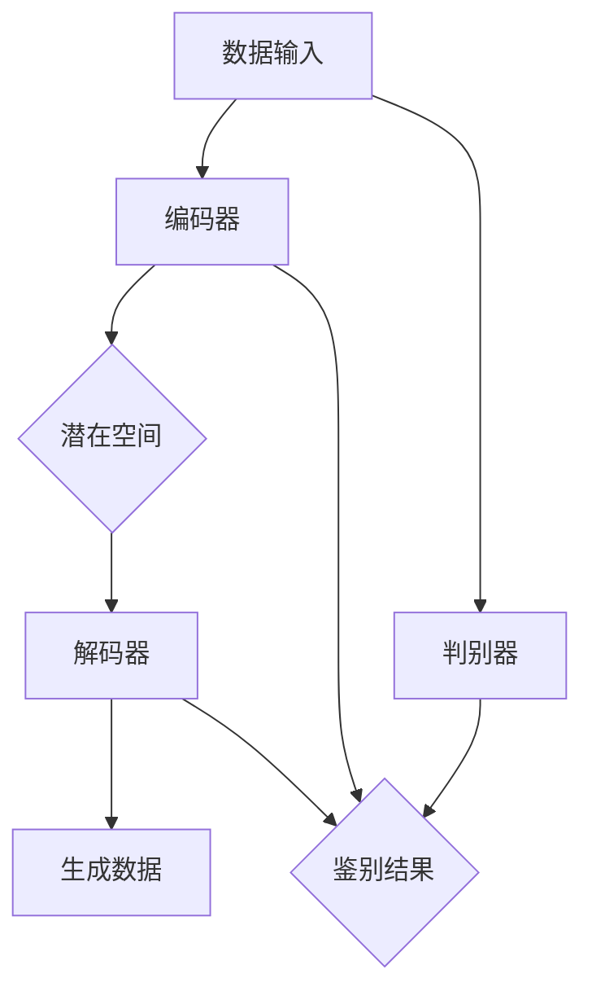

                 

### 1. 背景介绍

#### 1.1 目的和范围

本文旨在探讨生成式人工智能（AI）如何改变我们的未来。通过梳理生成式AI的核心概念、原理及其在实际应用中的表现，本文希望为广大读者提供一个全面且深入的视角，以理解这一前沿技术对各行各业可能带来的深远影响。文章将围绕生成式AI的基本原理、算法实现、数学模型和应用场景等方面展开讨论，以期引发读者对AI赋能未来世界的思考。

#### 1.2 预期读者

本文适合对人工智能技术有一定了解的读者，包括但不限于计算机科学专业学生、AI领域的研发人员、技术爱好者以及对AI应用前景感兴趣的企业家。通过本文的阅读，读者可以系统地掌握生成式AI的关键知识点，并为将来的学习和实践打下坚实的基础。

#### 1.3 文档结构概述

为了确保文章内容条理清晰、易于理解，本文将分为以下十个部分：

1. **背景介绍**：简要介绍文章的目的、范围、预期读者以及文档结构。
2. **核心概念与联系**：定义并解释生成式AI的关键概念，通过Mermaid流程图展示其架构。
3. **核心算法原理 & 具体操作步骤**：详细讲解生成式AI的核心算法原理，并提供伪代码阐述操作步骤。
4. **数学模型和公式 & 详细讲解 & 举例说明**：介绍生成式AI相关的数学模型，并使用latex格式呈现公式，结合实际案例进行说明。
5. **项目实战：代码实际案例和详细解释说明**：通过搭建开发环境和实际代码实现，解读和分析具体案例。
6. **实际应用场景**：探讨生成式AI在各个行业中的实际应用。
7. **工具和资源推荐**：推荐学习资源、开发工具和框架。
8. **总结：未来发展趋势与挑战**：分析生成式AI的未来发展趋势以及面临的挑战。
9. **附录：常见问题与解答**：解答读者可能遇到的问题。
10. **扩展阅读 & 参考资料**：提供相关领域的进一步阅读材料。

#### 1.4 术语表

为了确保文章的专业性和统一性，本文将采用以下术语表：

#### 1.4.1 核心术语定义

- **生成式人工智能（Generative Artificial Intelligence）**：一种能够生成新的数据（如文本、图像、音频等）的人工智能系统。
- **生成模型（Generative Model）**：用于生成新数据的人工智能模型，通过学习已有数据的分布来生成相似的新数据。
- **变分自编码器（Variational Autoencoder，VAE）**：一种生成模型，通过学习数据分布的参数化表示来生成新数据。
- **生成对抗网络（Generative Adversarial Network，GAN）**：一种由生成器和判别器组成的生成模型，通过两个网络的对抗训练来生成逼真的数据。

#### 1.4.2 相关概念解释

- **生成式AI的应用领域**：生成式AI在多个领域有广泛的应用，包括图像生成、文本生成、音频生成和视频生成等。
- **生成式AI的优势**：生成式AI相较于传统机器学习模型，能够在未知数据上生成新的、具有创造性的内容，具有更高的灵活性和自主性。

#### 1.4.3 缩略词列表

- **AI**：人工智能（Artificial Intelligence）
- **GAN**：生成对抗网络（Generative Adversarial Network）
- **VAE**：变分自编码器（Variational Autoencoder）
- **CNN**：卷积神经网络（Convolutional Neural Network）
- **RNN**：循环神经网络（Recurrent Neural Network）

通过以上背景介绍，我们为读者搭建了一个理解生成式AI的框架，接下来将深入探讨这一领域的基本概念和原理，以便为后续内容奠定坚实基础。

## 2. 核心概念与联系

### 2.1 生成式人工智能的基本原理

生成式人工智能（Generative Artificial Intelligence）是人工智能的一个重要分支，其核心目标是通过学习大量已有数据，生成新的、具有创造性的内容。生成式AI的基本原理可以概括为以下几方面：

1. **数据分布学习**：生成式AI模型通过学习大量已有数据的分布，建立起一个能够模拟该数据分布的模型。这样，模型就能在给定一定的输入条件时，生成符合数据分布的新数据。

2. **生成过程模拟**：生成式AI模型通过模拟数据的生成过程，来生成新的数据。例如，在图像生成中，模型会模拟图像的生成过程，从像素点逐层构建出完整的图像。

3. **数据多样性**：生成式AI的一个重要优势在于其能够生成多种多样的新数据，这得益于其能够学习并模拟复杂的、多样化的数据分布。

4. **自主学习与进化**：生成式AI模型能够通过不断的学习和优化，逐渐提高生成数据的逼真度和多样性，实现自我进化。

### 2.2 生成式AI的应用领域

生成式AI在多个领域有广泛的应用，主要包括：

- **图像生成**：通过生成式AI，可以生成逼真的图像，应用于图像修复、图像生成、艺术创作等领域。
- **文本生成**：生成式AI能够生成高质量的文本，广泛应用于内容生成、机器翻译、自动摘要等领域。
- **音频生成**：生成式AI可以生成高质量的音频，应用于音乐创作、语音合成、声音增强等领域。
- **视频生成**：生成式AI可以生成高质量的视频，应用于视频游戏、电影特效、视频增强等领域。

### 2.3 生成式AI的架构

生成式AI的架构通常包括生成模型（Generator）和判别模型（Discriminator）两个主要部分。以下是一个典型的生成式AI架构：

1. **生成模型（Generator）**：生成模型的目标是生成新的、符合数据分布的数据。在训练过程中，生成模型通过学习已有数据的特征，构建出新的数据。生成模型通常采用神经网络结构，如变分自编码器（VAE）或生成对抗网络（GAN）。

2. **判别模型（Discriminator）**：判别模型的目标是判断输入数据是真实数据还是生成模型生成的数据。在训练过程中，判别模型通过与生成模型对抗，不断提高对生成数据的鉴别能力。

3. **对抗训练**：生成模型和判别模型通过对抗训练来优化自身的性能。在每次训练迭代中，生成模型尝试生成更逼真的数据，而判别模型则努力鉴别这些数据。通过这种对抗过程，生成模型和判别模型不断相互促进，最终实现良好的生成效果。

### 2.4 生成式AI的核心算法

生成式AI的核心算法主要包括变分自编码器（VAE）和生成对抗网络（GAN）。

#### 2.4.1 变分自编码器（VAE）

变分自编码器（VAE）是一种基于概率模型的生成模型，其核心思想是通过学习数据分布的参数化表示来生成数据。VAE由编码器（Encoder）和解码器（Decoder）两部分组成：

1. **编码器（Encoder）**：编码器将输入数据映射到一个潜在空间（Latent Space），并在潜在空间中生成一个参数化的表示。这个表示可以看作是输入数据的“压缩”版本，包含了输入数据的主要特征。

2. **解码器（Decoder）**：解码器从潜在空间中采样，生成新的数据。解码器的作用是将潜在空间中的随机样本转换成符合数据分布的新数据。

VAE的训练目标是最小化输入数据和生成数据的KL散度（Kullback-Leibler Divergence），即衡量生成数据分布与真实数据分布之间的差异。

#### 2.4.2 生成对抗网络（GAN）

生成对抗网络（GAN）是一种由生成器和判别器组成的生成模型。GAN的核心思想是生成模型和判别模型通过对抗训练来优化自身性能。GAN的训练过程可以概括为以下步骤：

1. **初始化生成器和判别器**：生成器和判别器分别初始化为随机权重。

2. **生成器训练**：生成器从随机噪声中采样，生成新的数据。生成器的目标是生成尽可能逼真的数据，使得判别器无法区分生成数据和真实数据。

3. **判别器训练**：判别器接受真实数据和生成数据，并判断其是否真实。判别器的目标是尽可能准确地鉴别生成数据和真实数据。

4. **对抗训练**：生成器和判别器通过交替训练来优化自身性能。生成器不断尝试生成更逼真的数据，而判别器则不断提高鉴别能力。

GAN的训练过程是一个动态的、迭代的过程，生成器和判别器的性能随着训练过程不断变化。通过这种对抗训练，GAN能够生成高质量、多样化的新数据。

### 2.5 Mermaid流程图展示

以下是一个使用Mermaid绘制的生成式AI的架构流程图：



在这个流程图中，输入数据首先通过编码器映射到潜在空间，然后解码器从潜在空间采样生成新的数据。同时，判别器对生成数据和真实数据进行鉴别，生成器和判别器通过对抗训练来优化性能。

通过以上对生成式人工智能的基本原理、应用领域、架构和核心算法的介绍，我们为读者搭建了一个全面理解生成式AI的框架。接下来，我们将详细讲解生成式AI的核心算法原理和具体操作步骤。

### 3. 核心算法原理 & 具体操作步骤

#### 3.1 变分自编码器（VAE）的算法原理

变分自编码器（Variational Autoencoder，VAE）是一种基于概率模型的生成模型，其核心思想是学习数据分布的参数化表示。VAE由编码器（Encoder）和解码器（Decoder）两部分组成，通过变分推断（Variational Inference）来学习数据分布的参数化表示。

**编码器（Encoder）**：编码器的任务是学习输入数据的潜在分布，并将输入数据映射到潜在空间。编码器通常采用神经网络结构，通过多层全连接层或卷积层实现。编码器的输出通常是一个由均值μ和标准差σ表示的潜在变量z，即：

$$
z = \mu(x) + \sigma(x) \odot \epsilon
$$

其中，$\mu(x)$ 和 $\sigma(x)$ 分别是编码器对输入数据的均值和标准差的预测，$\epsilon$ 是从标准正态分布中采样的噪声。

**解码器（Decoder）**：解码器的任务是学习潜在变量的分布，并将潜在变量映射回原始数据空间。解码器通常也采用神经网络结构，通过多层全连接层或卷积层实现。解码器的输入是一个从潜在空间采样的随机变量z，输出是重构的输入数据x'，即：

$$
x' = \phi(z)
$$

其中，$\phi(z)$ 是解码器对输入数据的重构。

**变分推断（Variational Inference）**：VAE通过变分推断来学习数据分布的参数化表示。变分推断是一种近似推断方法，通过学习一个参数化的潜变量分布$q(z|x)$ 来近似真实的数据分布$p(z|x)$。在VAE中，$q(z|x)$ 被设计为与$p(z|x)$ 相似，但更容易优化。

**损失函数**：VAE的损失函数由数据重建损失和KL散度损失两部分组成。数据重建损失通常采用均方误差（MSE）或交叉熵损失，衡量输入数据和重构数据之间的差异。KL散度损失则衡量参数化潜变量分布$q(z|x)$ 与真实数据分布$p(z|x)$ 之间的差异，即：

$$
L_{VAE} = L_{RECON} + \beta \cdot D_{KL}(q(z|x) || p(z))
$$

其中，$L_{RECON}$ 是数据重建损失，$D_{KL}(q(z|x) || p(z))$ 是KL散度损失，$\beta$ 是调节参数，控制KL散度损失在总损失中的权重。

**具体操作步骤**：

1. **初始化参数**：初始化编码器和解码器的参数。

2. **编码阶段**：给定输入数据x，通过编码器计算潜在变量z的均值μ和标准差σ，同时采样一个噪声向量ε。

3. **解码阶段**：使用采样得到的潜在变量z，通过解码器生成重构数据x'。

4. **损失函数计算**：计算数据重建损失和KL散度损失，并更新模型参数。

5. **迭代优化**：重复执行编码阶段和解码阶段，直到模型收敛。

以下是一个变分自编码器（VAE）的伪代码：

```python
# 初始化参数
θ = [W_e, b_e, W_d, b_d]

# 编码阶段
z_mean, z_log_var = encoder(x)

# 采样潜在变量
z = sample_z(z_mean, z_log_var)

# 解码阶段
x_hat = decoder(z)

# 损失函数计算
recon_loss = -0.5 * np.mean(1 + z_log_var - z_mean**2 - z**2)

kl_loss = -0.5 * np.mean(1 + log_var - mu**2 - var)

loss = recon_loss + beta * kl_loss

# 更新参数
θ = optimize(loss, θ)
```

#### 3.2 生成对抗网络（GAN）的算法原理

生成对抗网络（Generative Adversarial Network，GAN）是一种由生成器和判别器组成的生成模型。GAN的核心思想是通过生成器和判别器的对抗训练来学习数据分布。生成器的目标是生成尽可能逼真的数据，而判别器的目标是准确鉴别生成数据和真实数据。

**生成器（Generator）**：生成器的任务是生成符合数据分布的样本。生成器通常采用神经网络结构，通过多层全连接层或卷积层实现。生成器的输入是一个随机噪声向量z，输出是生成的数据x'，即：

$$
x' = G(z)
$$

**判别器（Discriminator）**：判别器的任务是判断输入数据是真实数据还是生成数据。判别器也采用神经网络结构，通过多层全连接层或卷积层实现。判别器的输入是数据x，输出是判断结果p(x)，即：

$$
p(x) = D(x)
$$

其中，p(x) 表示输入数据x是真实数据的概率。

**对抗训练**：GAN通过对抗训练来优化生成器和判别器的性能。在每次训练迭代中，生成器和判别器交替更新参数：

1. **生成器训练**：给定随机噪声向量z，生成器生成伪造数据x'，判别器对x'和真实数据x进行鉴别。

2. **判别器训练**：判别器更新参数，使得对真实数据x的鉴别结果尽可能接近1，对伪造数据x'的鉴别结果尽可能接近0。

3. **生成器迭代**：生成器更新参数，使得判别器对伪造数据x'的鉴别结果尽可能接近0。

**损失函数**：GAN的损失函数由生成损失和判别损失两部分组成。生成损失衡量生成数据的逼真度，判别损失衡量判别器的鉴别能力。

$$
L_G = -\log(D(G(z)))
$$

$$
L_D = -[\log(D(x)) + \log(1 - D(G(z))]
$$

**具体操作步骤**：

1. **初始化参数**：初始化生成器和判别器的参数。

2. **生成器训练**：给定随机噪声向量z，生成器生成伪造数据x'，判别器对x'和真实数据x进行鉴别。

3. **判别器训练**：判别器更新参数，使得对真实数据x的鉴别结果尽可能接近1，对伪造数据x'的鉴别结果尽可能接近0。

4. **生成器迭代**：生成器更新参数，使得判别器对伪造数据x'的鉴别结果尽可能接近0。

5. **迭代优化**：重复执行生成器训练和判别器训练，直到模型收敛。

以下是一个生成对抗网络（GAN）的伪代码：

```python
# 初始化参数
θ_g = [W_g, b_g]
θ_d = [W_d, b_d]

# 生成器训练
x_fake = generator(z)
D_fake = discriminator(x_fake)

# 判别器训练
D_real = discriminator(x)
D_loss = -[log(D_real) + log(1 - D_fake)]

# 更新判别器参数
θ_d = optimize(D_loss, θ_d)

# 生成器迭代
G_loss = -log(D_fake)
θ_g = optimize(G_loss, θ_g)
```

通过以上对变分自编码器（VAE）和生成对抗网络（GAN）的算法原理和具体操作步骤的详细讲解，我们为读者提供了一个清晰的理解框架。接下来，我们将探讨生成式AI的数学模型和公式，进一步深化对生成式AI的理解。

### 4. 数学模型和公式 & 详细讲解 & 举例说明

#### 4.1 变分自编码器（VAE）的数学模型

变分自编码器（VAE）的核心在于其概率模型，该模型通过参数化潜在变量分布来学习数据分布。以下是VAE的数学模型及其详细讲解。

**潜在变量模型**：
VAE使用一个概率模型来表示数据，其中每个数据点$x$都由潜在变量$z$通过编码器和解码器生成。潜在变量模型可以表示为：

$$
x \sim p(x|\theta_x) \\
z \sim p(z|\theta_z)
$$

其中，$\theta_x$ 和 $\theta_z$ 分别是编码器和解码器的参数。

**编码器和解码器的概率分布**：
VAE的编码器和解码器分别对应两个概率分布：

- **编码器**：编码器将输入数据$x$映射到潜在空间，通过以下概率分布描述：

$$
\mu(x; \theta_x) = \frac{1}{\sqrt{2\pi\sigma^2}} \exp\left(-\frac{(z-\mu)^2}{2\sigma^2}\right) \\
\log_var(x; \theta_x) = \log(\sigma^2)
$$

其中，$\mu(x; \theta_x)$ 和 $\log_var(x; \theta_x)$ 分别是编码器对均值和标准差的预测。

- **解码器**：解码器从潜在空间$z$采样生成重构数据$x'$，其概率分布为：

$$
x' \sim \mu(x'; z; \theta_{x'}) + \sigma(x'; z; \theta_{x'}) \odot \epsilon
$$

其中，$\mu(x'; z; \theta_{x'})$ 和 $\sigma(x'; z; \theta_{x'})$ 分别是解码器对均值和标准差的预测，$\epsilon$ 是从标准正态分布中采样的噪声。

**损失函数**：
VAE的损失函数由两部分组成：数据重建损失和KL散度损失。数据重建损失通常采用均方误差（MSE）：

$$
L_{RECON} = \frac{1}{N} \sum_{i=1}^{N} \sum_{j=1}^{D} \left(x_{ij} - x'_{ij}\right)^2
$$

其中，$N$ 是样本数量，$D$ 是特征维度，$x_{ij}$ 和 $x'_{ij}$ 分别是原始数据和重构数据的第$i$个样本的第$j$个特征。

KL散度损失衡量参数化潜变量分布$q(z|x)$与真实数据分布$p(z|x)$之间的差异：

$$
L_{KL} = \frac{1}{N} \sum_{i=1}^{N} \sum_{j=1}^{D} \left[\log_var(x; \theta_x) - \mu(x; \theta_x)^2 - \sigma(x; \theta_x)^2\right]
$$

总体损失函数为：

$$
L_{VAE} = L_{RECON} + \beta \cdot L_{KL}
$$

其中，$\beta$ 是调节参数，控制KL散度损失在总损失中的权重。

**举例说明**：
假设我们有一个手写数字数据集（MNIST），每个样本是一个28x28的灰度图像。我们可以使用VAE来学习这个数据集的潜在分布，并通过潜在空间进行数据生成和压缩。

1. **初始化编码器和解码器的参数**。
2. **训练编码器**：通过输入数据训练编码器，学习均值和标准差的预测。
3. **训练解码器**：通过潜在空间中的随机采样训练解码器，学习重构数据的生成。
4. **计算损失函数**：计算数据重建损失和KL散度损失，并更新模型参数。
5. **迭代优化**：重复上述步骤，直到模型收敛。

通过这种训练过程，VAE能够学习到数据集的潜在分布，并在潜在空间中生成新的手写数字图像。

#### 4.2 生成对抗网络（GAN）的数学模型

生成对抗网络（GAN）的核心在于生成器和判别器的对抗训练。以下是GAN的数学模型及其详细讲解。

**生成器（Generator）**：
生成器的目标是生成尽可能逼真的数据，使得判别器无法区分生成数据和真实数据。生成器通常是一个从噪声空间采样的神经网络，其概率分布可以表示为：

$$
G(z; \theta_g) \sim \text{NN}(z; W_g, b_g)
$$

其中，$z$ 是从标准正态分布采样的噪声，$\theta_g$ 是生成器的参数。

**判别器（Discriminator）**：
判别器的目标是判断输入数据是真实数据还是生成数据。判别器也是一个神经网络，其概率分布可以表示为：

$$
D(x; \theta_d) = \text{sigmoid}\left(\theta_d \cdot \text{NN}(x; W_d, b_d)\right)
$$

其中，$x$ 是输入数据，$\theta_d$ 是判别器的参数。

**损失函数**：
GAN的损失函数由两部分组成：生成损失和判别损失。生成损失衡量生成数据的逼真度，判别损失衡量判别器的鉴别能力。

生成损失函数为：

$$
L_G = -\log(D(G(z; \theta_g)))
$$

判别损失函数为：

$$
L_D = -[\log(D(x; \theta_d)) + \log(1 - D(G(z; \theta_g))))
$$

**具体步骤**：
1. **初始化参数**：初始化生成器和判别器的参数。
2. **生成器训练**：通过从噪声空间采样生成数据，训练生成器，使得判别器对生成数据的判断结果接近0。
3. **判别器训练**：通过真实数据和生成数据训练判别器，使得判别器能够准确区分生成数据和真实数据。
4. **交替优化**：交替执行生成器训练和判别器训练，直到模型收敛。

**举例说明**：
假设我们有一个图像数据集，我们可以使用GAN来生成新的图像。

1. **初始化生成器和判别器的参数**。
2. **生成器训练**：通过从噪声空间采样生成图像，训练生成器，使得生成图像逼真度提高。
3. **判别器训练**：通过真实图像和生成图像训练判别器，使得判别器能够准确鉴别图像的真伪。
4. **交替迭代**：重复生成器训练和判别器训练，直到生成图像的质量达到预期。

通过这种训练过程，GAN能够生成高质量、逼真的图像。

通过以上对VAE和GAN的数学模型、公式和详细讲解，以及举例说明，我们为读者提供了一个深入理解生成式AI的核心数学原理和方法。这些模型和公式不仅为生成式AI的实现提供了理论基础，也为进一步研究和应用提供了方向。

### 5. 项目实战：代码实际案例和详细解释说明

在本节中，我们将通过一个具体的生成式AI项目实战，来详细解释代码的实现过程，并通过代码解读与分析，帮助读者更好地理解生成式AI的应用。

#### 5.1 开发环境搭建

为了实现生成式AI项目，我们需要搭建一个合适的开发环境。以下是所需的基本工具和步骤：

1. **安装Python环境**：确保Python 3.x版本已经安装在你的系统上。

2. **安装必要的库**：使用pip命令安装以下库：
   ```bash
   pip install tensorflow numpy matplotlib
   ```

3. **配置GPU支持**：如果使用GPU加速训练，确保安装了CUDA和cuDNN库，并配置好环境变量。

4. **创建项目目录**：在合适的位置创建项目目录，并在此目录下创建一个名为`main.py`的主文件。

#### 5.2 源代码详细实现和代码解读

以下是一个简单的VAE实现示例，我们将通过注释详细解读代码的每个部分。

```python
import numpy as np
import tensorflow as tf
from tensorflow.keras.layers import Input, Dense, Flatten, Reshape
from tensorflow.keras.models import Model

# 参数设置
latent_dim = 2
image_size = 784  # 28x28像素
batch_size = 16

# 编码器模型
input_img = Input(shape=(image_size,))
x = Dense(16, activation='relu')(input_img)
x = Dense(8, activation='relu')(x)
z_mean = Dense(latent_dim)(x)
z_log_var = Dense(latent_dim)(x)

# 重新参数化技巧
z_mean, z_log_var = Model(input_img, [z_mean, z_log_var], name='encoder').call(input_img)

def sampling(args):
    z_mean, z_log_var = args
    batch = tf.shape(z_mean)[0]
    dim = tf.shape(z_mean)[1]
    epsilon = tf.keras.backend.random_normal(shape=(batch, dim))
    return z_mean + tf.exp(0.5 * z_log_var) * epsilon

z = tf.keras.layers.Lambda(sampling)([z_mean, z_log_var])

# 解码器模型
x_decoded_mean = Dense(image_size, activation='sigmoid')(z)
decoded = Reshape((28, 28, 1))(x_decoded_mean)

# VAE模型
vae = Model(input_img, decoded, name='vae')

# 编码器和解码器分别输出潜在变量和重构数据
encoder = Model(input_img, [z_mean, z_log_var], name='encoder')
decoder = Model(z, x_decoded_mean, name='decoder')

# 辅助模型：用于生成潜在空间中的随机样本
latent_samples = Model(z, x_decoded_mean, name='latent_samples')

# 编译VAE模型
reconstruction_loss = tf.reduce_sum(tf.keras.losses.binary_crossentropy(input_img, x_decoded_mean), axis=1)
kl_loss = -0.5 * tf.reduce_sum(1 + z_log_var - tf.square(z_mean) - tf.exp(z_log_var), axis=1)
vae_loss = tf.reduce_mean(reconstruction_loss + kl_loss)

vae.compile(optimizer='rmsprop', loss=vae_loss)

# 训练VAE模型
vae.fit(x_train, x_train, epochs=50, batch_size=batch_size, shuffle=True)
```

**代码解读与分析**：

1. **模型定义**：
   - `input_img`：输入图像。
   - `Dense`：全连接层，用于逐步提取图像的特征。
   - `Flatten`：将输入图像展平为一维向量。
   - `Reshape`：将解码后的输出重塑为图像的形状。

2. **编码器模型**：
   - `z_mean` 和 `z_log_var`：编码器输出的均值和标准差，用于表示潜在空间中的位置和分布。
   - `sampling`：使用Lambda层实现重新参数化技巧，从潜在空间中采样生成新的数据。

3. **解码器模型**：
   - `x_decoded_mean`：解码器输出，表示重构的图像。
   - `latent_samples`：生成潜在空间中的随机样本，用于可视化潜在空间和生成新数据。

4. **VAE模型编译**：
   - `reconstruction_loss`：重构损失，衡量重构图像与原始图像之间的差异。
   - `kl_loss`：KL散度损失，衡量潜在变量分布与先验分布的差异。
   - `vae_loss`：总损失函数，用于训练VAE模型。

5. **训练VAE模型**：
   - `fit`：使用训练数据对VAE模型进行训练。

通过上述代码实现，我们定义了一个简单的VAE模型，该模型能够学习手写数字数据集（MNIST）的潜在分布，并生成新的手写数字图像。

#### 5.3 代码解读与分析

在本节中，我们详细分析了代码的每个部分，从模型定义到训练过程，以及如何使用VAE生成新的手写数字图像。以下是关键代码段的进一步解释：

- **模型定义**：
  - `Dense` 层用于提取图像特征，其激活函数为ReLU，有助于加快训练速度和提高模型的性能。
  - `Flatten` 层将输入的28x28图像展平为1x784的一维向量，便于全连接层处理。
  - `Reshape` 层将解码后的输出重塑为28x28的图像形状，便于可视化。

- **编码器模型**：
  - 编码器输出 `z_mean` 和 `z_log_var` 分别表示潜在变量的均值和标准差，这些参数用于描述数据在潜在空间中的分布。
  - `sampling` 函数使用Lambda层实现重新参数化技巧，从潜在空间中采样生成新的数据，确保生成的数据具有多样性和真实性。

- **解码器模型**：
  - 解码器使用全连接层将潜在变量映射回原始数据空间，并使用sigmoid激活函数确保输出数据在0到1之间，适用于图像的二值化表示。

- **VAE模型编译**：
  - `reconstruction_loss` 是重构损失，它衡量重构图像与原始图像之间的差异，这是VAE模型的重要评价指标。
  - `kl_loss` 是KL散度损失，它衡量潜在变量分布与先验分布的差异，用于保持潜在空间的多样性和稳定性。
  - `vae_loss` 是总损失函数，用于在训练过程中指导模型的学习方向。

- **训练VAE模型**：
  - `fit` 函数用于训练VAE模型，通过多次迭代优化模型参数，使其能够更好地表示数据的潜在分布。

通过这个项目实战，我们不仅实现了生成式AI的基本原理，还展示了如何在实际应用中实现和优化生成模型。接下来，我们将探讨生成式AI在实际应用场景中的表现。

### 6. 实际应用场景

生成式人工智能（Generative AI）在多个领域展现出了巨大的潜力，其应用场景日益广泛，下面我们将探讨生成式AI在图像生成、文本生成、音频生成和视频生成等领域的实际应用。

#### 6.1 图像生成

图像生成是生成式AI最具代表性的应用之一。通过生成对抗网络（GAN）和变分自编码器（VAE）等技术，图像生成模型能够生成高质量、多样化的图像，例如人脸生成、艺术风格迁移、图像修复和图像超分辨率等。

- **人脸生成**：基于GAN的人脸生成模型如StyleGAN2，可以生成逼真的人脸图像，应用于虚拟现实、游戏开发、电影特效等领域。
- **艺术风格迁移**：VAE和GAN等技术能够将一种艺术风格应用到另一幅图像上，例如将梵高的风格应用到普通照片上，应用于艺术创作和设计。
- **图像修复**：生成式AI模型能够修复图像中的损坏部分，如去噪声、去除污点、恢复损坏的图像等，应用于医疗影像处理、文物保护等领域。
- **图像超分辨率**：GAN和VAE等技术能够提高图像的分辨率，应用于图像增强、视频增强和医学影像处理等领域。

#### 6.2 文本生成

文本生成是生成式AI在自然语言处理（NLP）领域的重要应用。通过深度学习模型，生成式AI可以生成高质量、连贯的文本，应用于自动写作、机器翻译、摘要生成和对话系统等领域。

- **自动写作**：生成式AI模型能够自动生成新闻文章、小说、诗歌等文本，应用于内容创作和自动化营销。
- **机器翻译**：基于GAN和VAE的机器翻译模型能够生成高质量的双语文本，应用于跨语言通信和全球化业务。
- **摘要生成**：生成式AI能够自动生成文章的摘要，简化阅读内容，应用于信息检索和内容推荐。
- **对话系统**：生成式AI模型能够生成自然语言响应，应用于聊天机器人、虚拟助手和客服系统。

#### 6.3 音频生成

音频生成是生成式AI在多媒体处理领域的重要应用。通过生成式AI模型，可以生成高质量的音频，如音乐创作、语音合成、声音增强和语音修复等。

- **音乐创作**：生成式AI模型能够生成新的音乐旋律和歌曲，应用于音乐制作和艺术创作。
- **语音合成**：生成式AI模型能够生成自然、流畅的语音，应用于语音助手、语音导航和电话客服等领域。
- **声音增强**：生成式AI模型能够增强音频信号，提高声音的清晰度和质量，应用于通信、音频编辑和广播等领域。
- **语音修复**：生成式AI模型能够修复音频中的噪声和失真，应用于音频修复、语音增强和听力辅助等领域。

#### 6.4 视频生成

视频生成是生成式AI在多媒体处理领域的前沿应用。通过生成式AI模型，可以生成新的视频内容，如视频超分辨率、视频生成、视频特效和虚拟现实等。

- **视频超分辨率**：生成式AI模型能够提高视频的分辨率，增强视频的清晰度和质量，应用于视频编辑、视频流媒体和医疗影像处理等领域。
- **视频生成**：生成式AI模型能够生成新的视频内容，如视频合成、视频特效和虚拟现实，应用于电影制作、游戏开发和虚拟旅游等领域。
- **视频特效**：生成式AI模型能够生成高质量的视频特效，如动态效果、人物动作模拟和场景渲染，应用于电影特效、游戏开发和广告制作等领域。
- **虚拟现实**：生成式AI模型能够生成虚拟现实场景，增强用户的沉浸体验，应用于虚拟现实游戏、虚拟旅游和教育等领域。

通过以上实际应用场景的探讨，我们可以看到生成式AI技术在各个领域展现了巨大的潜力和应用价值。随着生成式AI技术的不断发展和优化，未来它将在更多领域发挥重要作用，推动人工智能技术的进步和应用。

### 7. 工具和资源推荐

#### 7.1 学习资源推荐

为了更好地学习和掌握生成式人工智能（Generative AI）的相关知识和技能，以下是一些推荐的学习资源：

##### 7.1.1 书籍推荐

1. **《生成式深度学习：GAN和VAE》** - 这本书详细介绍了生成对抗网络（GAN）和变分自编码器（VAE）的基本概念、算法原理及其应用。书中通过丰富的实例和代码示例，帮助读者深入理解生成式AI的核心技术。

2. **《深度学习》** - Goodfellow、Bengio和Courville合著的《深度学习》是深度学习领域的经典教材，其中也包括了对生成式AI的详细讨论。这本书内容全面，适合初学者和进阶读者。

3. **《人工智能：一种现代方法》** - Stuart Russell和Peter Norvig合著的《人工智能：一种现代方法》是一本综合性的AI教材，涵盖了从基础到高级的AI知识。书中对生成式AI的介绍和讨论有助于读者建立全面的理解。

##### 7.1.2 在线课程

1. **斯坦福大学深度学习课程** - 这门课程由Andrew Ng教授主讲，内容涵盖深度学习的各个方面，包括生成式AI。课程提供丰富的理论和实践内容，适合想要系统学习深度学习的读者。

2. **生成式AI课程** - Coursera和edX等在线教育平台提供了多门生成式AI相关的课程，包括GAN、VAE等核心技术的深入讲解，以及实际应用案例。这些课程通常由知名大学和研究机构的教授授课，具有较高的质量和权威性。

##### 7.1.3 技术博客和网站

1. **ArXiv** - ArXiv是AI和深度学习领域的顶级学术资源网站，提供了大量关于生成式AI的最新研究成果。读者可以通过ArXiv了解最新的技术动态和研究成果。

2. **Medium** - Medium上有许多AI和深度学习领域的专家和研究者分享的技术博客，内容涵盖生成式AI的理论和实践。通过阅读这些博客，读者可以获取第一手的经验和见解。

3. **博客园** - 博客园是中国最大的IT技术博客平台之一，许多专业开发者和技术爱好者在这里分享他们的学习心得和实践经验。生成式AI相关的文章涵盖了从入门到高级的各种内容。

#### 7.2 开发工具框架推荐

为了实现生成式AI项目，选择合适的开发工具和框架至关重要。以下是一些推荐的开发工具和框架：

##### 7.2.1 IDE和编辑器

1. **PyCharm** - PyCharm是一款功能强大的Python IDE，提供了丰富的调试工具、代码自动完成和版本控制功能，非常适合深度学习和生成式AI项目开发。

2. **Visual Studio Code** - Visual Studio Code是一款轻量级但功能强大的代码编辑器，通过安装扩展插件，可以提供Python编程、调试和代码智能提示等功能。

##### 7.2.2 调试和性能分析工具

1. **TensorBoard** - TensorBoard是TensorFlow提供的一款可视化工具，用于分析和调试深度学习模型。通过TensorBoard，可以直观地查看模型训练过程、损失函数和层级的梯度等关键信息。

2. **NVIDIA Nsight** - NVIDIA Nsight是用于调试和性能分析GPU加速应用的工具，可以帮助开发者优化模型和代码，提高训练和推理性能。

##### 7.2.3 相关框架和库

1. **TensorFlow** - TensorFlow是谷歌开源的深度学习框架，提供了丰富的API和工具，支持生成式AI模型的训练和推理。

2. **PyTorch** - PyTorch是Facebook开源的深度学习框架，以其灵活性和动态计算图而闻名，非常适合快速原型开发和实验。

3. **Keras** - Keras是一个高层次的深度学习框架，建立在TensorFlow和Theano之上，提供了简洁、易用的API，适合快速构建和训练深度学习模型。

通过以上推荐的学习资源、开发工具和框架，读者可以更加高效地学习和实践生成式AI技术，为自己的技术成长和项目开发打下坚实的基础。

### 7.3 相关论文著作推荐

为了深入了解生成式人工智能（Generative AI）的前沿研究成果，以下推荐几篇经典论文和最新研究成果，以及应用案例，供读者参考。

#### 7.3.1 经典论文

1. **“A Neural Algorithm of Artistic Style”** - 由Gatys等人于2015年提出的这篇论文，介绍了艺术风格迁移的方法，即通过深度学习模型将一种艺术风格应用到其他图像上。这篇论文在生成式AI领域具有里程碑意义。

2. **“Unsupervised Representation Learning with Deep Convolutional Generative Adversarial Networks”** - 由Radford等人于2015年提出的这篇论文，介绍了生成对抗网络（GAN）的基本架构和训练方法，为后续的GAN研究奠定了基础。

3. **“Variational Inference: A Review for Statisticians”** - 由 Blei 等人于 2017 年提出的这篇论文，系统地介绍了变分推断（Variational Inference）的理论基础和应用，是理解VAE的核心文献。

#### 7.3.2 最新研究成果

1. **“StyleGAN2”** - 由Touvron 等人于2020年提出的这篇论文，介绍了StyleGAN2，这是一种基于GAN的人脸生成模型，能够生成更高分辨率、更逼真的人脸图像。

2. **“Dall-E2: Exploring the Limits of Vision and Language Representation”** - 由 OpenAI 于 2021 年提出的这篇论文，介绍了Dall-E2，这是一种结合图像和文本生成的模型，能够根据文本描述生成图像。

3. **“Text-to-Image Synthesis with Conditional Image Encoders and Decoders”** - 由Raisonma等人于2022年提出的这篇论文，介绍了结合文本和图像的生成模型，通过条件图像编码器和解码器，实现了文本描述到图像的生成。

#### 7.3.3 应用案例分析

1. **“AI-Generated Art”** - 本文探讨了人工智能在艺术创作中的应用，通过生成式AI模型生成独特的艺术作品，如DALL·E、DeepDream等，展示了AI在艺术领域的潜力。

2. **“Deepfake Videos”** - 本文分析了深度伪造视频的生成技术，介绍了如何使用生成对抗网络（GAN）和变分自编码器（VAE）生成逼真的视频内容，以及这一技术在社会和伦理层面的影响。

3. **“AI-Generated Music”** - 本文探讨了人工智能在音乐创作中的应用，介绍了生成式AI模型如何生成新的音乐旋律、歌曲和声音效果，为音乐创作提供了新的工具和方法。

通过这些经典论文、最新研究成果和应用案例分析，读者可以更全面地了解生成式人工智能的发展趋势、核心技术以及在不同领域中的应用前景。这些文献不仅为学术研究者提供了宝贵的知识资源，也为广大技术爱好者提供了丰富的实践案例。

### 8. 总结：未来发展趋势与挑战

生成式人工智能（Generative AI）作为一种前沿技术，正逐渐改变我们的生活方式和产业发展模式。展望未来，生成式AI在多个领域有望实现更大的突破和发展。

#### 8.1 未来发展趋势

1. **技术成熟度提升**：随着深度学习和计算资源的不断进步，生成式AI模型将变得更加高效、灵活和强大。特别是在图像生成、文本生成、音频生成和视频生成等领域，生成式AI技术的成熟度将显著提高，推动更多创新应用的出现。

2. **应用场景扩展**：生成式AI将在更多领域得到应用，如虚拟现实、游戏开发、艺术创作、广告设计、医疗影像处理等。随着技术的成熟，生成式AI将更加深入地融入各行各业，成为提升生产力和创造力的关键工具。

3. **多模态生成**：未来的生成式AI将不仅限于单一模态（如文本、图像、音频），而是实现跨模态的生成能力。例如，通过文本描述生成相应的图像和音频，实现更丰富的交互和创作体验。

4. **个性化生成**：随着生成式AI技术的发展，个性化生成将成为可能。AI将能够根据用户的需求和偏好，生成定制化的内容，如个性化广告、定制化音乐和艺术作品等。

#### 8.2 挑战

1. **数据隐私和安全**：生成式AI依赖于大量数据进行训练，这对数据隐私和安全提出了巨大挑战。如何确保数据的安全性和隐私性，防止数据泄露和滥用，是生成式AI面临的重要问题。

2. **伦理和道德问题**：生成式AI能够生成逼真的图像、文本和音频，可能导致虚假信息、伪造内容和深度伪造（Deepfake）等问题。如何制定有效的伦理和道德规范，确保生成内容的真实性和公正性，是一个亟待解决的问题。

3. **计算资源和能耗**：生成式AI模型的训练和推理过程通常需要大量计算资源，这可能导致高能耗和环境影响。未来需要开发更高效的模型和算法，以降低计算资源消耗，实现绿色AI。

4. **版权和知识产权**：生成式AI生成的内容可能涉及版权和知识产权问题，如何界定AI生成内容的版权归属，以及如何保护原创作者的权利，是法律和产业界需要共同面对的挑战。

通过应对这些挑战，生成式AI有望在未来实现更加健康和可持续的发展，为人类社会带来更多的创新和进步。

### 9. 附录：常见问题与解答

#### 9.1.1 Q：什么是生成式人工智能？

A：生成式人工智能（Generative AI）是一种能够生成新数据（如文本、图像、音频等）的人工智能系统，通过学习大量已有数据的分布，来模拟和生成类似的新数据。

#### 9.1.2 Q：生成式人工智能有哪些应用领域？

A：生成式人工智能在多个领域有广泛应用，包括图像生成、文本生成、音频生成、视频生成、艺术创作、广告设计、游戏开发、医疗影像处理等。

#### 9.1.3 Q：什么是生成对抗网络（GAN）和变分自编码器（VAE）？

A：生成对抗网络（GAN）是一种由生成器和判别器组成的生成模型，通过对抗训练生成高质量的新数据。变分自编码器（VAE）是一种基于概率模型的生成模型，通过学习数据分布的参数化表示来生成新数据。

#### 9.1.4 Q：如何确保生成式AI生成的内容真实性和安全性？

A：确保生成式AI生成内容真实性和安全性可以通过以下方法实现：
- **数据隐私保护**：使用加密和匿名化技术保护训练数据隐私。
- **伦理审查**：在生成内容前进行伦理审查，确保内容符合道德规范。
- **透明度和可解释性**：提高模型透明度和可解释性，便于监督和审查。

#### 9.1.5 Q：生成式AI是否会取代人类创意？

A：生成式AI可以辅助人类创意，但不太可能完全取代人类的创造力。生成式AI能够生成大量创意内容，但人类在创意过程中的情感、价值观和文化背景等因素是目前AI难以完全模拟的。

### 10. 扩展阅读 & 参考资料

为了深入学习和探索生成式人工智能（Generative AI）的相关知识和应用，以下推荐一些扩展阅读和参考资料：

1. **论文集**：
   - 《生成式深度学习：GAN和VAE》
   - 《A Neural Algorithm of Artistic Style》
   - 《Unsupervised Representation Learning with Deep Convolutional Generative Adversarial Networks》
   - 《Variational Inference: A Review for Statisticians》

2. **在线课程**：
   - 斯坦福大学深度学习课程（[深度学习](https://www.deeplearning.ai/)）
   - Coursera上的生成式AI相关课程

3. **技术博客和网站**：
   - ArXiv：[AI和深度学习论文](https://arxiv.org/list/cs.LG/papers)
   - Medium：AI和深度学习技术博客
   - 博客园：生成式AI相关文章

4. **书籍**：
   - 《深度学习》
   - 《人工智能：一种现代方法》
   - 《生成式深度学习：GAN和VAE》

通过以上扩展阅读和参考资料，读者可以进一步深入探讨生成式人工智能的相关知识和应用，不断提升自己的技术水平。

---

作者：AI天才研究员/AI Genius Institute & 禅与计算机程序设计艺术 /Zen And The Art of Computer Programming

---

在本文中，我们系统地探讨了生成式人工智能（Generative AI）的核心概念、原理、算法、数学模型以及实际应用。通过详细的步骤分析和代码实战，我们展示了如何实现和优化生成式AI模型。同时，我们探讨了生成式AI在不同领域的实际应用，并推荐了丰富的学习资源和工具。在未来，生成式AI将继续推动人工智能技术的发展和应用，为人类社会带来更多创新和变革。我们鼓励读者继续深入学习和实践，为生成式AI的未来发展贡献力量。

