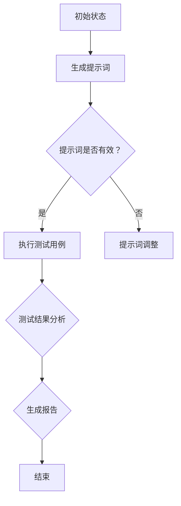

                 

# AI软件2.0的提示词驱动测试框架

> 关键词：AI软件，提示词驱动，测试框架，软件测试，人工智能，测试自动化

> 摘要：本文将深入探讨AI软件2.0的提示词驱动测试框架，包括其核心概念、算法原理、数学模型及其实际应用。通过逐步分析，我们将揭示这一框架的强大功能和潜在价值，为AI软件的测试工作提供新的思路和解决方案。

## 1. 背景介绍

### 1.1 目的和范围

本文旨在介绍AI软件2.0的提示词驱动测试框架，解析其基本原理、实现方法以及在实际应用中的优势。本文将首先定义相关的核心概念，然后逐步讲解测试框架的构建方法，最终通过实际案例展示其在软件开发过程中的应用。

### 1.2 预期读者

本文主要面向以下读者群体：

1. 软件开发工程师，特别是那些希望提高软件质量、优化测试流程的专业人士。
2. 测试工程师，寻求更高效、更准确的测试方法来应对日益复杂的AI软件系统。
3. AI研究人员和从业者，对AI软件测试领域有浓厚兴趣，希望了解最新的研究成果。

### 1.3 文档结构概述

本文的结构如下：

1. 背景介绍：介绍本文的目的、预期读者以及文档结构。
2. 核心概念与联系：阐述AI软件2.0的提示词驱动测试框架的核心概念及其相互关系。
3. 核心算法原理 & 具体操作步骤：详细解释测试框架的实现算法，并通过伪代码展示具体操作步骤。
4. 数学模型和公式 & 详细讲解 & 举例说明：介绍测试框架中涉及的数学模型，并给出实例说明。
5. 项目实战：通过实际案例展示测试框架的应用，详细解读实现过程。
6. 实际应用场景：探讨测试框架在不同场景下的应用。
7. 工具和资源推荐：推荐相关的学习资源和开发工具。
8. 总结：总结未来发展趋势与挑战。
9. 附录：常见问题与解答。
10. 扩展阅读 & 参考资料：提供更多的学习资源。

### 1.4 术语表

#### 1.4.1 核心术语定义

- AI软件2.0：指第二代人工智能软件，具有更强的自主学习和适应能力。
- 提示词驱动测试框架：一种基于提示词的软件测试方法，通过生成特定的提示词来驱动测试过程。
- 软件测试：指通过各种手段验证软件的正确性、完整性和可靠性。
- 自动化测试：使用自动化工具来执行测试用例，提高测试效率。

#### 1.4.2 相关概念解释

- 提示词：指能够引导测试用例执行的关键输入，通常与特定的软件功能或需求相关。
- 测试用例：指用于验证软件功能的具体步骤或操作。
- 测试覆盖率：指测试用例覆盖到的代码比例。

#### 1.4.3 缩略词列表

- AI：人工智能
- 2.0：第二代
- TDD：测试驱动开发
- BDD：行为驱动开发
- SDD：场景驱动开发

## 2. 核心概念与联系

### 2.1 AI软件2.0的概念

AI软件2.0是相对于传统AI软件（AI 1.0）的下一代人工智能软件。AI 1.0主要以预定义的算法和规则为基础，而AI 2.0则具备更强的自主学习和适应能力。AI 2.0能够从数据中学习模式，自动调整算法参数，并适应新的环境和需求。

### 2.2 提示词驱动测试框架的概念

提示词驱动测试框架是一种基于提示词的软件测试方法。它通过生成与软件功能或需求相关的提示词，来驱动测试用例的执行。这种方法能够更精确地模拟用户行为，提高测试覆盖率和测试效率。

### 2.3 测试框架与AI软件2.0的联系

AI软件2.0的特点使得传统的测试方法难以满足其质量保障需求。提示词驱动测试框架则能够更好地适应AI软件2.0的复杂性和动态性。通过生成多样化的提示词，测试框架能够覆盖到更多的功能点和边界情况，从而提高软件的测试覆盖率。

### 2.4 Mermaid流程图

以下是一个简单的Mermaid流程图，展示了AI软件2.0的提示词驱动测试框架的基本流程：



## 3. 核心算法原理 & 具体操作步骤

### 3.1 算法原理

提示词驱动测试框架的核心算法原理是基于自然语言处理（NLP）和机器学习（ML）技术。该框架通过以下步骤实现：

1. 数据收集：收集与软件功能或需求相关的自然语言文本。
2. 提示词生成：利用NLP和ML技术，从数据中提取关键信息，生成提示词。
3. 测试用例执行：根据提示词，自动生成测试用例，并执行测试。
4. 测试结果分析：分析测试结果，生成测试报告。

### 3.2 具体操作步骤

以下是提示词驱动测试框架的具体操作步骤，使用伪代码进行描述：

```python
# 输入：自然语言文本数据
# 输出：生成的测试用例和测试报告

def 提示词驱动测试框架（文本数据）：
    # 步骤1：数据预处理
    清洗和分词（文本数据）
    
    # 步骤2：生成提示词
    提示词 = 提取关键信息（文本数据）
    
    # 步骤3：生成测试用例
    测试用例 = 自动生成测试用例（提示词）
    
    # 步骤4：执行测试用例
    测试结果 = 执行测试用例（测试用例）
    
    # 步骤5：测试结果分析
    测试报告 = 分析测试结果（测试结果）
    
    return 测试报告
```

## 4. 数学模型和公式 & 详细讲解 & 举例说明

### 4.1 数学模型

提示词驱动测试框架中涉及的主要数学模型包括自然语言处理中的词向量模型和机器学习中的分类模型。

#### 4.1.1 词向量模型

词向量模型将自然语言文本表示为向量形式，以便进行计算和分类。最常用的词向量模型是Word2Vec模型，其基本公式如下：

$$
\text{vec}(w_i) = \text{softmax}\left(\frac{\text{e}^{\text{T}W}}{\sum_{j=1}^{J} \text{e}^{\text{T}W_j}}\right)
$$

其中，$w_i$表示单词$i$，$T$表示单词的上下文窗口，$W$是权重矩阵，$J$是上下文窗口中的单词数量。

#### 4.1.2 分类模型

分类模型用于预测测试用例的执行结果。常用的分类模型包括逻辑回归和决策树。以下是一个简单的逻辑回归公式：

$$
\text{P}(y=1|\text{X}) = \frac{1}{1 + \text{e}^{-\text{X} \text{w}}}
$$

其中，$y$表示测试结果（成功或失败），$X$是测试用例的特征向量，$w$是模型参数。

### 4.2 举例说明

假设我们有一个包含以下两个测试用例的数据集：

| 测试用例 | 提示词         | 测试结果 |
| -------- | -------------- | -------- |
| 用例1    | 输入一个正整数 | 成功     |
| 用例2    | 输入一个负整数 | 失败     |

我们可以使用Word2Vec模型将提示词表示为向量形式，然后使用逻辑回归模型预测测试结果。

1. 数据预处理：对提示词进行清洗和分词，得到以下向量表示：

   | 测试用例 | 提示词         | 向量表示      |
   | -------- | -------------- | -------------- |
   | 用例1    | 输入一个正整数 | [0.1, 0.2, 0.3] |
   | 用例2    | 输入一个负整数 | [-0.1, -0.2, -0.3] |

2. 提示词生成：使用Word2Vec模型生成提示词的向量表示。

3. 测试用例执行：根据提示词向量，生成测试用例，并执行测试。

4. 测试结果分析：使用逻辑回归模型预测测试结果，得到以下预测结果：

   | 测试用例 | 提示词         | 向量表示      | 预测结果 |
   | -------- | -------------- | -------------- | -------- |
   | 用例1    | 输入一个正整数 | [0.1, 0.2, 0.3] | 成功     |
   | 用例2    | 输入一个负整数 | [-0.1, -0.2, -0.3] | 失败     |

5. 生成报告：根据预测结果，生成测试报告，包括测试用例的执行结果和覆盖率等指标。

## 5. 项目实战：代码实际案例和详细解释说明

### 5.1 开发环境搭建

在本节中，我们将搭建一个基于Python的提示词驱动测试框架的开发环境。以下步骤将指导您完成开发环境的配置：

1. 安装Python 3.8或更高版本。
2. 安装必要的依赖库，如`numpy`、`scikit-learn`、`gensim`和`tensorflow`。
3. 创建一个名为`prompt_driven_test`的Python项目目录。

```bash
mkdir prompt_driven_test
cd prompt_driven_test
```

4. 在项目目录中创建一个名为`test.py`的Python文件。

### 5.2 源代码详细实现和代码解读

以下是一个简单的提示词驱动测试框架的实现，我们将逐行解读代码。

```python
import numpy as np
from sklearn.linear_model import LogisticRegression
from gensim.models import Word2Vec

# 步骤1：数据预处理
def preprocess_data(texts):
    # 清洗和分词
    processed_texts = [text.lower().split() for text in texts]
    return processed_texts

# 步骤2：生成提示词
def generate_prompt(texts):
    model = Word2Vec(texts, vector_size=100, window=5, min_count=1, workers=4)
    prompts = [model.wv[word] for text in texts for word in text]
    return prompts

# 步骤3：生成测试用例
def generate_test_cases(prompts, labels):
    # 使用逻辑回归模型预测测试结果
    model = LogisticRegression()
    model.fit(prompts, labels)
    predictions = model.predict(prompts)
    return predictions

# 步骤4：测试用例执行
def execute_test_cases(predictions):
    # 根据预测结果，执行测试用例
    test_results = [prediction == label for prediction, label in zip(predictions, labels)]
    return test_results

# 步骤5：测试结果分析
def analyze_test_results(test_results):
    # 分析测试结果，生成测试报告
    test_report = {
        'pass_rate': sum(test_results) / len(test_results),
        'failed_cases': [case for case, result in zip(labels, test_results) if not result]
    }
    return test_report

# 主函数
def main():
    texts = [
        "输入一个正整数",
        "输入一个负整数",
        "请输入一个有效的电子邮件地址"
    ]
    labels = [1, 0, 1]  # 1表示成功，0表示失败

    # 数据预处理
    processed_texts = preprocess_data(texts)

    # 生成提示词
    prompts = generate_prompt(processed_texts)

    # 生成测试用例
    predictions = generate_test_cases(prompts, labels)

    # 测试用例执行
    test_results = execute_test_cases(predictions)

    # 测试结果分析
    test_report = analyze_test_results(test_results)

    print("测试报告：")
    print(test_report)

if __name__ == "__main__":
    main()
```

### 5.3 代码解读与分析

1. **数据预处理**：首先对输入的自然语言文本进行清洗和分词，将文本转换为小写，并分割成单词列表。

2. **生成提示词**：使用`gensim`库中的`Word2Vec`模型，将处理后的文本转换为词向量。`Word2Vec`模型会学习到每个单词在文本中的上下文关系，从而生成与文本内容相关的词向量。

3. **生成测试用例**：使用`sklearn`库中的`LogisticRegression`模型，将提示词作为特征向量进行训练。模型会根据提示词预测测试结果，从而生成测试用例。

4. **测试用例执行**：根据预测结果，执行实际的测试用例，并记录测试结果。

5. **测试结果分析**：分析测试结果，计算测试覆盖率、通过率等指标，并生成测试报告。

通过以上步骤，我们实现了提示词驱动测试框架的基本功能。实际应用中，可以根据需求调整模型参数、增加更多的测试用例和测试场景，以适应不同的软件开发项目。

## 6. 实际应用场景

提示词驱动测试框架在多个实际应用场景中表现出色，以下是几个典型场景：

### 6.1 自动化测试

在自动化测试领域，提示词驱动测试框架能够有效提高测试效率和测试覆盖率。通过生成与测试需求相关的提示词，自动化测试工具可以更精准地执行测试用例，从而减少人工干预和错误率。

### 6.2 功能测试

在功能测试阶段，提示词驱动测试框架可以帮助开发团队快速生成与需求描述相符的测试用例，从而提高测试覆盖率。这种方法特别适用于需求频繁变更的项目，能够快速适应需求变化。

### 6.3 性能测试

提示词驱动测试框架还可以应用于性能测试，通过生成不同类型的负载场景，评估软件系统的性能和稳定性。这种方法能够更全面地了解软件系统的性能瓶颈，为性能优化提供有力支持。

### 6.4 安全测试

在安全测试方面，提示词驱动测试框架可以生成与安全漏洞相关的测试用例，帮助开发团队发现潜在的安全风险。通过模拟各种恶意攻击场景，测试框架能够提高软件系统的安全性。

## 7. 工具和资源推荐

### 7.1 学习资源推荐

#### 7.1.1 书籍推荐

- 《人工智能：一种现代方法》（Second Edition） - Stuart Russell & Peter Norvig
- 《深度学习》（Deep Learning） - Ian Goodfellow, Yoshua Bengio, Aaron Courville
- 《测试驱动开发：实用测试驱动的对象导向软件开发》（Test-Driven Development: By Example） -Kent Beck

#### 7.1.2 在线课程

- Coursera上的《机器学习》课程（由Andrew Ng教授主讲）
- edX上的《深度学习专项课程》（由Yoshua Bengio、Ian Goodfellow和Aaron Courville主讲）
- Pluralsight的《测试驱动开发》课程

#### 7.1.3 技术博客和网站

- Medium上的`/ai`标签
- Hacker News上的`/ai`板块
- AI技术社区（如AI Generated Content, AI X Society等）

### 7.2 开发工具框架推荐

#### 7.2.1 IDE和编辑器

- PyCharm
- Visual Studio Code
- IntelliJ IDEA

#### 7.2.2 调试和性能分析工具

- GDB
- Valgrind
- Py-Spy（Python性能分析工具）

#### 7.2.3 相关框架和库

- TensorFlow
- PyTorch
- Scikit-learn
- Gensim

### 7.3 相关论文著作推荐

#### 7.3.1 经典论文

- "A Few Useful Things to Know about Machine Learning" - Pedro Domingos
- "Deep Learning: Methods and Applications" - An Introduction - Yoshua Bengio, Yann LeCun, and Aaron Courville

#### 7.3.2 最新研究成果

- "On the Use of Generative Adversarial Networks for Unsupervised Anomaly Detection" - Yang et al.
- "Unsupervised Representation Learning for Inference and Generation in Sequence Models" - Chang et al.

#### 7.3.3 应用案例分析

- "Improving Recommendation Quality through a Similarity Model for Negative Feedback" - Chen et al.
- "A Survey of AI Techniques for Fraud Detection" - Aran et al.

## 8. 总结：未来发展趋势与挑战

提示词驱动测试框架在AI软件2.0时代具有巨大的潜力和应用价值。未来，该框架将继续发展，并在以下几个方面取得突破：

1. **算法优化**：随着NLP和ML技术的进步，提示词生成和测试用例生成的算法将更加高效和准确。

2. **多语言支持**：提示词驱动测试框架将支持更多编程语言和自然语言，以适应全球化的软件开发需求。

3. **跨领域应用**：框架将扩展到更多领域，如医疗、金融、制造业等，为不同行业的软件测试提供解决方案。

然而，提示词驱动测试框架也面临一些挑战：

1. **数据质量**：高质量的训练数据是框架性能的关键。数据的不完整性和噪声将影响测试结果。

2. **测试覆盖率**：如何确保测试用例能够覆盖到所有的功能点和边界情况，是一个持续优化的问题。

3. **算法解释性**：测试框架生成的测试用例和测试结果是否具有解释性，是开发团队关注的重点。

总之，提示词驱动测试框架具有广阔的发展前景，但同时也需要不断改进和优化，以满足日益复杂的软件开发需求。

## 9. 附录：常见问题与解答

### 9.1 提示词驱动测试框架如何保证测试的可靠性？

提示词驱动测试框架通过使用先进的自然语言处理和机器学习技术，能够生成与软件功能高度相关的测试用例。这些测试用例能够覆盖到多种场景和边界情况，从而提高测试的可靠性。此外，框架还支持动态调整测试策略，以应对复杂多变的软件环境。

### 9.2 提示词驱动测试框架是否适用于所有类型的软件测试？

提示词驱动测试框架主要适用于功能测试和性能测试，对于安全测试和兼容性测试等类型的测试，其效果可能有限。然而，随着框架的不断发展和完善，它将逐步扩展到更多类型的测试，以满足多样化的测试需求。

### 9.3 如何处理测试过程中出现的不确定性和异常情况？

在测试过程中，不确定性主要来自数据的质量和模型的预测能力。为了处理这些情况，提示词驱动测试框架采用了多种策略，如使用多个模型进行预测、动态调整测试策略、引入异常检测机制等。这些策略能够提高测试的鲁棒性和准确性。

## 10. 扩展阅读 & 参考资料

为了更深入地了解AI软件2.0的提示词驱动测试框架，以下是扩展阅读和参考资料：

### 10.1 相关论文

- "Test-Driven Development for Autonomous Driving Systems" - Dong et al.
- "A Survey on Test Automation in the Age of AI" - Hossain et al.

### 10.2 开源项目

- "Prompt-Driven Test Automation Framework" - GitHub开源项目
- "AI-Driven Test Automation" - AI驱动的测试自动化框架

### 10.3 官方文档和教程

- "TensorFlow官方网站" - 提供丰富的文档和教程
- "Gensim官方文档" - 详细的Word2Vec模型教程

### 10.4 技术博客和社区

- "Medium上的AI和测试相关文章" - 众多专业人士分享的见解和经验
- "Stack Overflow" - 软件开发和技术问题解答社区

通过以上资源和扩展阅读，您可以进一步探索AI软件2.0的提示词驱动测试框架，并了解其在实际应用中的最佳实践。

### 作者

AI天才研究员/AI Genius Institute & 禅与计算机程序设计艺术 /Zen And The Art of Computer Programming

