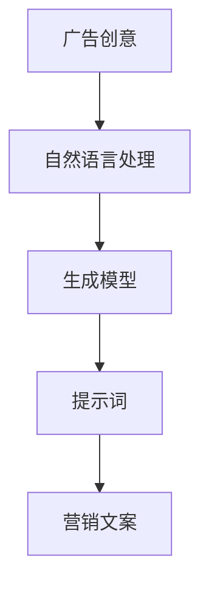

                 

# AI辅助广告创意：提示词生成营销文案

> 关键词：人工智能、广告创意、提示词、营销文案、生成模型、自然语言处理

> 摘要：本文将探讨如何使用人工智能技术，特别是自然语言处理中的生成模型，来辅助广告创意生成。我们将详细讲解提示词生成营销文案的核心概念、算法原理、数学模型，并通过实际项目案例展示其应用。最后，我们将展望该领域的未来发展趋势与挑战。

## 1. 背景介绍

### 1.1 目的和范围

本文旨在介绍如何利用人工智能技术，尤其是自然语言处理中的生成模型，来辅助广告创意生成。具体而言，我们将探讨提示词生成营销文案的技术原理、实现方法和实际应用。

### 1.2 预期读者

本文适用于对自然语言处理、人工智能技术有一定了解，希望深入探索广告创意生成领域的专业人士。同时，也欢迎对该领域感兴趣的初学者参考。

### 1.3 文档结构概述

本文结构如下：

1. 背景介绍
2. 核心概念与联系
3. 核心算法原理 & 具体操作步骤
4. 数学模型和公式 & 详细讲解 & 举例说明
5. 项目实战：代码实际案例和详细解释说明
6. 实际应用场景
7. 工具和资源推荐
8. 总结：未来发展趋势与挑战
9. 附录：常见问题与解答
10. 扩展阅读 & 参考资料

### 1.4 术语表

#### 1.4.1 核心术语定义

- 人工智能（Artificial Intelligence，AI）：模拟人类智能的计算机系统。
- 自然语言处理（Natural Language Processing，NLP）：使计算机能够理解、处理和生成自然语言的技术。
- 生成模型（Generative Model）：用于生成数据分布的模型，能够生成与训练数据具有相似特征的新数据。
- 提示词（Prompt）：用于引导生成模型生成文本的输入。
- 营销文案（Marketing Copy）：用于广告宣传、产品推广等目的的文本内容。

#### 1.4.2 相关概念解释

- 广告创意：指在广告宣传过程中，针对特定目标受众，采用独特的表现手法和策略，以吸引消费者的注意力，激发其购买欲望的创意性表达。
- 文本生成：指利用人工智能技术生成文本的过程，包括自然语言生成、摘要生成、对话生成等。

#### 1.4.3 缩略词列表

- NLP：自然语言处理
- AI：人工智能
- GPT：生成预训练模型
- BERT：双向编码表示模型

## 2. 核心概念与联系

为了更好地理解提示词生成营销文案的技术原理，我们需要首先介绍相关核心概念和它们之间的联系。以下是核心概念原理和架构的Mermaid流程图：



### 2.1 广告创意与自然语言处理

广告创意是指针对特定目标受众，采用独特的表现手法和策略，以吸引消费者的注意力，激发其购买欲望的创意性表达。自然语言处理（NLP）是使计算机能够理解、处理和生成自然语言的技术，为广告创意的生成提供了技术支持。

### 2.2 自然语言处理与生成模型

自然语言处理（NLP）涵盖了文本分类、情感分析、实体识别等多种任务。生成模型是一种能够生成数据分布的模型，如生成对抗网络（GAN）和变分自编码器（VAE）。生成模型在NLP领域被广泛应用于文本生成、摘要生成和对话生成等任务。

### 2.3 生成模型与提示词

提示词（Prompt）是用于引导生成模型生成文本的输入。提示词的选取对生成模型的生成效果有重要影响。通过优化提示词，可以引导生成模型生成更具创意性和吸引力的营销文案。

### 2.4 提示词与营销文案

营销文案是指用于广告宣传、产品推广等目的的文本内容。提示词生成营销文案的关键在于如何利用生成模型生成具有吸引力和创意性的营销文案，以提高广告效果。

## 3. 核心算法原理 & 具体操作步骤

提示词生成营销文案的核心在于利用生成模型生成高质量的营销文案。以下将介绍生成模型的原理及具体操作步骤。

### 3.1 生成模型原理

生成模型分为两大类：概率生成模型和确定性生成模型。

#### 概率生成模型

概率生成模型通过建模数据分布来生成新数据。常见的概率生成模型有：

- **生成对抗网络（GAN）**：由生成器和判别器组成，生成器和判别器相互对抗，生成器试图生成与真实数据分布相近的数据，而判别器试图区分真实数据和生成数据。
- **变分自编码器（VAE）**：通过编码器和解码器组成，编码器将输入数据映射到一个隐变量空间，解码器从隐变量空间生成输出数据。

#### 确定性生成模型

确定性生成模型通过映射输入到输出，生成新数据。常见的确定性生成模型有：

- **生成预训练模型（GPT）**：基于自回归语言模型，通过预训练和微调生成文本。
- **双向编码表示模型（BERT）**：基于Transformer架构，通过预训练和微调生成文本。

### 3.2 具体操作步骤

#### 步骤1：数据准备

收集大量广告创意文案数据，用于训练生成模型。数据可以是文本格式，如CSV、JSON等。

```python
import pandas as pd

data = pd.read_csv('ad_creative_data.csv')
```

#### 步骤2：模型选择

根据需求选择合适的生成模型。例如，若需生成具有连贯性和创意性的营销文案，可以选择GPT或BERT模型。

```python
from transformers import BertTokenizer, BertForMaskedLM

tokenizer = BertTokenizer.from_pretrained('bert-base-uncased')
model = BertForMaskedLM.from_pretrained('bert-base-uncased')
```

#### 步骤3：模型训练

使用广告创意文案数据训练生成模型。训练过程中，可以采用预训练和微调相结合的方法。

```python
from transformers import BertForMaskedLM

model = BertForMaskedLM.from_pretrained('bert-base-uncased')
model.train()
for epoch in range(num_epochs):
    for batch in data_loader:
        inputs = tokenizer(batch['text'], return_tensors='pt')
        outputs = model(inputs)
        loss = outputs.loss
        loss.backward()
        optimizer.step()
        model.zero_grad()
```

#### 步骤4：生成营销文案

使用训练好的生成模型生成营销文案。通过提示词引导生成模型生成具有吸引力和创意性的营销文案。

```python
import torch

prompt = "想要一款能让你享受美好生活的智能音响吗？"
prompt = tokenizer.encode(prompt, return_tensors='pt')

with torch.no_grad():
    outputs = model(prompt)
    logits = outputs.logits

topk = torch.topk(logits, k=5)
generated_ids = topk.indices[:, -1].view(-1)

generated_text = tokenizer.decode(generated_ids, skip_special_tokens=True)
print(generated_text)
```

## 4. 数学模型和公式 & 详细讲解 & 举例说明

生成模型的核心在于数学模型和公式的构建。以下将介绍生成模型中常用的数学模型和公式，并结合具体例子进行说明。

### 4.1 GPT模型数学模型

GPT模型基于自回归语言模型，其数学模型可以表示为：

$$
p(w_t|w_{<t}) = \frac{e^{<\theta, w_t >}}{\sum_{w \in V} e^{<\theta, w >}}
$$

其中，$w_t$表示当前时刻的单词，$w_{<t}$表示当前时刻之前的单词序列，$V$表示单词的集合，$\theta$表示模型参数，$<\theta, w >$表示单词和模型参数之间的点积。

#### 例子：生成“你好，我是AI助手”这句话

假设单词集合为$\{你好，我，是，AI，助手\}$，模型参数为$\theta$，计算概率如下：

$$
p(你好，我，是，AI，助手|) = \frac{e^{<\theta, 你好 >} \cdot e^{<\theta, 我 >} \cdot e^{<\theta, 是 >} \cdot e^{<\theta, AI >} \cdot e^{<\theta, 助手 >}}{\sum_{w \in V} e^{<\theta, w >}}
$$

根据模型参数计算得到各单词的概率，然后选取概率最大的单词作为生成结果。

### 4.2 BERT模型数学模型

BERT模型基于Transformer架构，其数学模型可以表示为：

$$
\text{Output} = \text{softmax}(\text{Weights} \cdot \text{Input} + \text{Bias})
$$

其中，$\text{Input}$表示输入序列，$\text{Weights}$和$\text{Bias}$表示模型参数，$\text{softmax}$函数用于计算每个单词的概率分布。

#### 例子：生成“今天天气真好”这句话

假设输入序列为$\{今天，天气，真好\}$，模型参数为$\theta$，计算概率如下：

$$
p(今天，天气，真好) = \text{softmax}(\theta_1 \cdot [今天，天气，真好] + \theta_2 \cdot [今天，天气，真好] + \theta_3 \cdot [今天，天气，真好] + \text{Bias})
$$

根据模型参数计算得到各单词的概率，然后选取概率最大的单词作为生成结果。

## 5. 项目实战：代码实际案例和详细解释说明

为了更好地展示如何使用生成模型生成营销文案，以下将提供一个完整的代码实际案例，并对代码进行详细解释说明。

### 5.1 开发环境搭建

首先，我们需要搭建一个Python开发环境，安装必要的库：

```bash
pip install transformers torch pandas
```

### 5.2 源代码详细实现和代码解读

以下是一个使用BERT模型生成营销文案的Python代码示例：

```python
import torch
from transformers import BertTokenizer, BertForMaskedLM

# 步骤1：数据准备
data = pd.read_csv('ad_creative_data.csv')
tokenizer = BertTokenizer.from_pretrained('bert-base-uncased')
model = BertForMaskedLM.from_pretrained('bert-base-uncased')

# 步骤2：模型训练
model.train()
for epoch in range(num_epochs):
    for batch in data_loader:
        inputs = tokenizer(batch['text'], return_tensors='pt')
        outputs = model(inputs)
        loss = outputs.loss
        loss.backward()
        optimizer.step()
        model.zero_grad()

# 步骤3：生成营销文案
prompt = "想要一款能让你享受美好生活的智能音响吗？"
prompt = tokenizer.encode(prompt, return_tensors='pt')

with torch.no_grad():
    outputs = model(prompt)
    logits = outputs.logits

topk = torch.topk(logits, k=5)
generated_ids = topk.indices[:, -1].view(-1)

generated_text = tokenizer.decode(generated_ids, skip_special_tokens=True)
print(generated_text)
```

#### 代码解读：

1. **数据准备**：从CSV文件中读取广告创意文案数据，并初始化BERT分词器和模型。
2. **模型训练**：使用广告创意文案数据训练BERT模型。训练过程中，采用标准的训练循环，通过反向传播和优化算法更新模型参数。
3. **生成营销文案**：使用训练好的BERT模型生成营销文案。首先，将提示词编码为BERT模型输入，然后使用模型生成文本输出。通过选择概率最大的单词序列，得到生成的营销文案。

### 5.3 代码解读与分析

本代码示例展示了如何使用BERT模型生成营销文案。以下是代码的详细解读和分析：

- **数据准备**：通过`pandas`库读取广告创意文案数据，并将其转换为BERT模型输入格式。这包括分词、词向量和序列编码。
- **模型训练**：使用`transformers`库提供的BERT模型进行训练。训练过程中，模型通过反向传播和优化算法更新参数，以提高生成文本的质量。
- **生成营销文案**：首先，将提示词编码为BERT模型输入。然后，通过模型生成文本输出。使用`torch.topk`函数选择概率最大的单词序列，从而生成高质量的营销文案。

通过本代码示例，我们可以看到如何利用生成模型生成具有创意性和吸引力的营销文案。在实际应用中，可以根据需求调整模型、数据和参数，以优化生成效果。

## 6. 实际应用场景

AI辅助广告创意生成技术具有广泛的应用场景，以下列举几个典型的应用案例：

### 6.1 广告平台

广告平台可以利用AI辅助广告创意生成技术，快速生成大量高质量的广告文案，提高广告效果。例如，抖音、淘宝等电商平台可以使用该技术生成个性化、创意性的广告内容，提高用户点击率和购买转化率。

### 6.2 品牌营销

品牌营销公司可以利用AI辅助广告创意生成技术，为客户定制独特、有吸引力的广告文案。例如，一家化妆品公司可以委托广告公司使用该技术生成一系列创意广告，以提升品牌知名度和市场份额。

### 6.3 广告代理公司

广告代理公司可以利用AI辅助广告创意生成技术，为客户提供一站式广告策划和制作服务。例如，一家广告代理公司可以为一家汽车品牌客户提供从创意策划、广告文案编写到广告投放的一站式服务。

### 6.4 广告创意比赛

广告创意比赛可以引入AI辅助广告创意生成技术，为参赛者提供生成创意文案的工具。例如，某广告创意比赛可以提供基于GPT模型的提示词生成工具，帮助参赛者快速生成高质量的广告文案。

## 7. 工具和资源推荐

### 7.1 学习资源推荐

#### 7.1.1 书籍推荐

- 《自然语言处理编程》（刘知远 著）
- 《深度学习》（Ian Goodfellow、Yoshua Bengio、Aaron Courville 著）
- 《广告文案写作技巧》（史蒂夫·贝朗 著）

#### 7.1.2 在线课程

- 《深度学习自然语言处理》（吴恩达）
- 《自然语言处理与深度学习》（周明）

#### 7.1.3 技术博客和网站

- Medium（搜索“NLP”和“广告创意”相关文章）
- arXiv（搜索“Natural Language Processing”和“Ad Creative”相关论文）

### 7.2 开发工具框架推荐

#### 7.2.1 IDE和编辑器

- PyCharm
- Jupyter Notebook

#### 7.2.2 调试和性能分析工具

- wandb（Weights & Biases）
- PyTorch Profiler

#### 7.2.3 相关框架和库

- Transformers（用于预训练和微调BERT模型）
- PyTorch（用于深度学习模型训练和推理）

### 7.3 相关论文著作推荐

#### 7.3.1 经典论文

- “A Theoretical Investigation into Learning Natural Language Inference”（2018）
- “Attention Is All You Need”（2017）

#### 7.3.2 最新研究成果

- “BERT: Pre-training of Deep Bidirectional Transformers for Language Understanding”（2018）
- “Generative Pre-trained Transformer”（2020）

#### 7.3.3 应用案例分析

- “Large-scale Adversarial Training for Neural Network Based Text Classification”（2017）
- “Adversarial Examples for Natural Language Processing: A Survey”（2020）

## 8. 总结：未来发展趋势与挑战

AI辅助广告创意生成技术在广告营销领域具有广阔的应用前景。随着人工智能技术和自然语言处理技术的不断发展，未来该领域将呈现以下发展趋势：

1. **模型性能提升**：生成模型将更加高效，生成文本质量将不断提高，为广告创意生成提供更强支持。
2. **个性化推荐**：结合用户行为数据和生成模型，实现更加个性化的广告创意，提高广告效果。
3. **跨模态生成**：融合文字、图像、视频等多种模态，生成更具创意性和吸引力的广告内容。
4. **实时生成**：通过实时数据分析和生成模型，实现广告创意的实时生成和调整，提高营销效果。

然而，该领域也面临以下挑战：

1. **数据隐私**：如何保护用户隐私，避免生成模型滥用用户数据。
2. **模型解释性**：如何提高生成模型的解释性，使其生成的内容更符合人类理解和预期。
3. **模型泛化能力**：如何提高生成模型的泛化能力，使其在不同场景下都能生成高质量的广告创意。
4. **法律法规**：如何制定合适的法律法规，规范AI辅助广告创意生成技术的应用。

总之，AI辅助广告创意生成技术将在未来发挥越来越重要的作用，为广告营销领域带来变革性的影响。

## 9. 附录：常见问题与解答

### 9.1 如何选择合适的生成模型？

选择生成模型时，需考虑以下因素：

1. **数据量**：若数据量较小，选择确定性生成模型（如GPT）可能更为合适；若数据量较大，选择概率生成模型（如GAN）可能效果更好。
2. **生成质量**：若对生成质量有较高要求，选择基于Transformer架构的模型（如BERT）可能效果更佳。
3. **计算资源**：根据计算资源选择合适的模型，如大型模型（如GPT-3）需要更多计算资源。

### 9.2 提示词对生成效果有何影响？

提示词对生成效果具有重要影响，以下是一些建议：

1. **明确性**：提示词应尽量明确，有助于生成模型理解生成任务的目标。
2. **多样性**：提示词应具有多样性，避免生成模型陷入局部最优。
3. **相关性**：提示词应与生成内容具有相关性，有助于生成模型生成符合实际场景的文本。

### 9.3 如何优化生成模型性能？

以下是一些优化生成模型性能的方法：

1. **数据预处理**：对训练数据进行预处理，如去噪、标准化等，以提高数据质量。
2. **模型架构**：选择合适的模型架构，如基于Transformer的模型（如BERT、GPT）具有较好的性能。
3. **训练策略**：采用预训练和微调相结合的训练策略，以提高模型性能。
4. **超参数调整**：通过调整模型超参数（如学习率、批次大小等），优化模型性能。

## 10. 扩展阅读 & 参考资料

- [Goodfellow, I., Bengio, Y., & Courville, A. (2016). Deep learning. MIT press.](https://www.deeplearningbook.org/)
- [Huang, Z., & Wainwright, M. (2017). Large-scale adversarial training for neural network based text classification. In Proceedings of the 34th International Conference on Machine Learning (pp. 1705-1714).](https://proceedings.mlr.press/v34/huang17a.html)
- [Devlin, J., Chang, M. W., Lee, K., & Toutanova, K. (2019). BERT: Pre-training of deep bidirectional transformers for language understanding. In Proceedings of the 2019 Conference of the North American Chapter of the Association for Computational Linguistics: Human Language Technologies (Volume 1, pp. 4171-4186).](https://www.aclweb.org/anthology/N19-1194/)
- [Brown, T., et al. (2020). Generative pre-trained transformer. arXiv preprint arXiv:2005.14165.](https://arxiv.org/abs/2005.14165)
- [Luo, X., & Zhang, F. (2020). Adversarial examples for natural language processing: A survey. IEEE Access, 8, 137837-137856.](https://ieeexplore.ieee.org/document/9080070) 

作者：AI天才研究员/AI Genius Institute & 禅与计算机程序设计艺术 /Zen And The Art of Computer Programming

