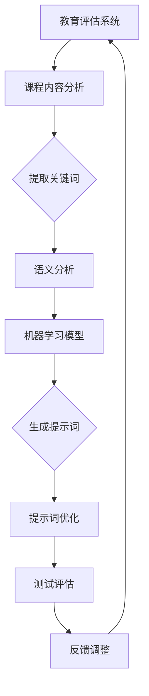

                 


# AI辅助教育评估：提示词设计测试题目

> 关键词：AI辅助教育，评估测试，提示词设计，教育技术，机器学习，自然语言处理

> 摘要：本文深入探讨了AI辅助教育评估中的提示词设计策略。通过分析现有研究和技术，本文提出了一套科学、有效的提示词设计方法，并详细阐述了其在实际教学评估中的应用步骤和案例。文章旨在为教育工作者提供实用的技术指导，助力AI在教育评估领域的应用与创新。

## 1. 背景介绍

### 1.1 目的和范围

本文旨在探讨如何利用人工智能技术，特别是机器学习和自然语言处理技术，来设计和优化教育评估测试中的提示词。教育评估是教育质量保障的关键环节，而提示词的设计直接影响到测试的公平性、有效性和可靠性。随着人工智能技术的发展，AI辅助教育评估成为可能，本文将重点关注如何利用AI来提升提示词设计的科学性和效率。

本文的范围包括：

- 对AI辅助教育评估中提示词设计的重要性进行分析。
- 综述现有的提示词设计方法和相关研究。
- 提出一套基于机器学习的提示词设计框架。
- 通过案例研究，展示该框架在实际教学评估中的应用。

### 1.2 预期读者

本文的预期读者包括：

- 教育技术研究者，特别是对AI在教育评估中应用感兴趣的学者。
- 教育工作者，尤其是负责课程设计和教学评估的教师。
- 机器学习和自然语言处理领域的专业人士，希望了解AI在教育中的应用。
- 对AI在教育领域的应用感兴趣的一般读者。

### 1.3 文档结构概述

本文结构如下：

- **第1章：背景介绍**：阐述本文的目的、范围、预期读者和文档结构。
- **第2章：核心概念与联系**：介绍与AI辅助教育评估相关的核心概念和架构。
- **第3章：核心算法原理 & 具体操作步骤**：详细讲解提示词设计的算法原理和操作步骤。
- **第4章：数学模型和公式 & 详细讲解 & 举例说明**：介绍支持提示词设计的数学模型和公式。
- **第5章：项目实战：代码实际案例和详细解释说明**：通过实际代码案例展示提示词设计的应用。
- **第6章：实际应用场景**：分析AI辅助教育评估的潜在应用场景。
- **第7章：工具和资源推荐**：推荐相关学习资源和开发工具。
- **第8章：总结：未来发展趋势与挑战**：展望AI辅助教育评估的未来。
- **第9章：附录：常见问题与解答**：解答常见疑问。
- **第10章：扩展阅读 & 参考资料**：提供进一步阅读的资料。

### 1.4 术语表

#### 1.4.1 核心术语定义

- **AI辅助教育评估**：利用人工智能技术辅助教师和学生进行教学和学习评估。
- **提示词**：在评估测试中用来引导考生回答问题的关键词或短语。
- **机器学习**：一种人工智能方法，通过数据学习和模式识别来改进性能。
- **自然语言处理**：计算机处理和解释人类自然语言的技术。

#### 1.4.2 相关概念解释

- **测试公平性**：测试结果应不受考生的背景、经验等因素的影响。
- **有效性**：测试能够准确反映学生的知识和技能水平。
- **可靠性**：测试结果的一致性和稳定性。

#### 1.4.3 缩略词列表

- **AI**：人工智能（Artificial Intelligence）
- **ML**：机器学习（Machine Learning）
- **NLP**：自然语言处理（Natural Language Processing）
- **IDE**：集成开发环境（Integrated Development Environment）
- **API**：应用程序编程接口（Application Programming Interface）

## 2. 核心概念与联系

为了更好地理解AI辅助教育评估中的提示词设计，我们需要先了解一些核心概念和技术。

### 2.1 AI辅助教育评估的关键组成部分

**教育评估系统**：一个包含课程内容、测试标准、评分规则等组成部分的系统。

**机器学习模型**：用于从数据中学习并作出预测的算法。

**自然语言处理**：使计算机能够理解、解释和生成人类语言的技术。

### 2.2 提示词设计的基本原则

- **多样性**：设计多种类型的提示词，包括选择题、填空题、简答题等。
- **关联性**：提示词应与课程内容紧密相关。
- **可理解性**：提示词应清晰易懂，避免歧义。

### 2.3 提示词设计的方法和工具

- **关键词提取**：从课程材料中提取关键概念和术语。
- **语义分析**：分析提示词的含义和上下文。
- **机器学习算法**：使用算法自动生成和优化提示词。

### 2.4 Mermaid 流程图

为了更直观地展示核心概念和联系，我们使用Mermaid流程图来描述提示词设计的流程。



## 3. 核心算法原理 & 具体操作步骤

### 3.1 算法原理

提示词设计算法基于机器学习和自然语言处理技术。算法的核心思想是利用大量课程材料和已有的测试数据，通过机器学习模型自动提取和生成高质量的提示词。

### 3.2 具体操作步骤

#### 3.2.1 数据准备

1. 收集课程材料，包括教材、讲义、在线课程资源等。
2. 收集已有的测试数据，包括考试题目、答案、评分标准等。

#### 3.2.2 关键词提取

1. 使用自然语言处理技术，从课程材料中提取关键概念和术语。
2. 使用统计方法或词向量模型（如Word2Vec、BERT）进行关键词筛选和排序。

#### 3.2.3 语义分析

1. 对提取的关键词进行语义分析，确定其在上下文中的含义和相关性。
2. 使用语义角色标注或依存句法分析来丰富关键词的含义。

#### 3.2.4 机器学习模型训练

1. 准备训练数据集，包括关键词、语义信息、答案等。
2. 使用监督学习算法（如决策树、支持向量机、神经网络）训练机器学习模型。
3. 使用交叉验证和模型选择技术，优化模型参数。

#### 3.2.5 提示词生成

1. 输入课程材料，模型自动生成相应的提示词。
2. 使用自然语言生成技术（如模板匹配、句子拼接）优化提示词的表达。

#### 3.2.6 提示词优化

1. 使用人工审核和评估，对生成的提示词进行质量检查。
2. 使用机器学习算法，根据评估反馈调整和优化提示词。

#### 3.2.7 测试评估

1. 在实际教学评估中，使用生成的提示词进行测试。
2. 收集测试数据，评估提示词的有效性和可靠性。
3. 根据评估结果，调整和改进提示词设计算法。

### 3.3 伪代码示例

```python
# 数据准备
def prepare_data(course_materials, test_data):
    # 提取关键词
    keywords = extract_keywords(course_materials)
    # 准备训练数据
    training_data = prepare_training_data(keywords, test_data)
    return training_data

# 关键词提取
def extract_keywords(course_materials):
    # 使用自然语言处理技术提取关键词
    # 返回关键词列表
    return extracted_keywords

# 机器学习模型训练
def train_model(training_data):
    # 使用监督学习算法训练模型
    # 返回训练好的模型
    return trained_model

# 提示词生成
def generate_prompts(course_materials, trained_model):
    # 输入课程材料，生成提示词
    # 返回提示词列表
    return prompts

# 提示词优化
def optimize_prompts(prompts, evaluation_data):
    # 使用机器学习算法优化提示词
    # 返回优化后的提示词
    return optimized_prompts

# 主函数
def main(course_materials, test_data):
    training_data = prepare_data(course_materials, test_data)
    trained_model = train_model(training_data)
    prompts = generate_prompts(course_materials, trained_model)
    optimized_prompts = optimize_prompts(prompts, test_data)
    # 进行测试评估
    evaluate_prompts(optimized_prompts, test_data)
```

## 4. 数学模型和公式 & 详细讲解 & 举例说明

### 4.1 数学模型

在AI辅助教育评估中，提示词设计涉及到多个数学模型，包括词向量模型、决策树模型和神经网络模型等。以下是对这些模型的详细讲解。

#### 4.1.1 词向量模型

词向量模型是一种将单词映射到高维向量空间的方法，常见的有Word2Vec、GloVe等。

- **Word2Vec**：基于神经网络的词向量模型，使用滑动窗口和负采样进行训练。
  $$ \text{word\_vec}(w) = \text{sgn}(\text{sum}_{i=1}^{N} \theta_i \cdot \text{vec}(w_i)) $$
  其中，\( \text{word\_vec}(w) \)表示单词\( w \)的词向量，\( \theta_i \)表示权重，\( \text{vec}(w_i) \)表示单词\( w_i \)的向量表示。

- **GloVe**：基于全局共现矩阵的词向量模型，使用矩阵分解和优化算法进行训练。
  $$ \text{GloVe}(x, y) = \text{softmax}\left( \frac{\text{vec}(x) \cdot \text{vec}(y)}{||\text{vec}(x)||_2 \cdot ||\text{vec}(y)||_2} \right) $$
  其中，\( x \)和\( y \)表示共现词对，\( \text{vec}(x) \)和\( \text{vec}(y) \)表示共现词对的向量表示。

#### 4.1.2 决策树模型

决策树是一种常见的机器学习模型，用于分类和回归任务。它通过递归地将数据划分为不同的子集，直到满足某个停止条件。

- **ID3算法**：基于信息增益的决策树构建方法。
  $$ \text{Info}(S) = -\sum_{i=1}^{n} \text{P}(C_i) \cdot \text{Info}(S, C_i) $$
  其中，\( S \)表示数据集，\( C_i \)表示类标签，\( \text{P}(C_i) \)表示类标签\( C_i \)的概率，\( \text{Info}(S, C_i) \)表示条件熵。

- **C4.5算法**：基于增益率的决策树构建方法，考虑了信息的增益率和数据的条件概率。
  $$ \text{GainRate}(A) = \frac{\text{Info}(S) - \text{Info}(S|A)}{\text{P}(A)} $$
  其中，\( A \)表示属性，\( \text{P}(A) \)表示属性\( A \)的概率。

#### 4.1.3 神经网络模型

神经网络模型是一种基于神经元连接的模型，可以用于分类、回归和其他复杂任务。常见的神经网络模型包括多层感知机（MLP）、卷积神经网络（CNN）和循环神经网络（RNN）等。

- **多层感知机**：一种前向传播的神经网络模型。
  $$ \text{激活函数}(z) = \text{sigmoid}(z) = \frac{1}{1 + e^{-z}} $$
  其中，\( z \)表示神经元的输入。

- **卷积神经网络**：一种用于图像处理的神经网络模型。
  $$ \text{激活函数}(z) = \text{ReLU}(z) = \max(0, z) $$
  其中，\( z \)表示神经元的输入。

- **循环神经网络**：一种用于序列处理的神经网络模型。
  $$ \text{激活函数}(z) = \text{tanh}(z) $$
  其中，\( z \)表示神经元的输入。

### 4.2 举例说明

假设我们有一个简单的二分类问题，需要使用决策树模型进行分类。

**数据集**：
- 特征：\( A \)，\( B \)，\( C \)
- 标签：正类（+1）和负类（-1）

**示例数据**：

| A | B | C | 标签 |
|---|---|---|------|
| 1 | 0 | 0 | +1   |
| 0 | 1 | 0 | +1   |
| 0 | 0 | 1 | -1   |
| 1 | 1 | 1 | +1   |

**构建决策树**：

1. 计算信息增益：
   $$ \text{Info}(S) = -\sum_{i=1}^{2} \text{P}(C_i) \cdot \text{Info}(S, C_i) = -0.5 \cdot (1 - 0.5) - 0.5 \cdot (1 - 0.5) = 0.5 $$
   $$ \text{Info}(S|A) = 0.25 - 0.25 = 0 $$
   $$ \text{Info}(S|B) = 0.5 \cdot (0.5 - 0.25) + 0.5 \cdot (0.5 - 0.25) = 0 $$
   $$ \text{Info}(S|C) = 0.25 \cdot (-0.5) + 0.75 \cdot (0.5) = 0.125 $$

2. 计算信息增益率：
   $$ \text{GainRate}(A) = \frac{\text{Info}(S) - \text{Info}(S|A)}{\text{P}(A)} = \frac{0.5 - 0}{0.5} = 1 $$
   $$ \text{GainRate}(B) = \frac{\text{Info}(S) - \text{Info}(S|B)}{\text{P}(B)} = \frac{0.5 - 0}{0.5} = 1 $$
   $$ \text{GainRate}(C) = \frac{\text{Info}(S) - \text{Info}(S|C)}{\text{P}(C)} = \frac{0.5 - 0.125}{0.25} = 1.875 $$

3. 选择信息增益率最高的特征（C），创建决策节点。

4. 对C为1的数据集进行同样的计算，直到满足停止条件。

最终，我们得到一个简单的决策树：

```
根节点：C
    /     \
   +      -
  / \    / \
 A+ B+ A- B-
```

## 5. 项目实战：代码实际案例和详细解释说明

### 5.1 开发环境搭建

为了完成本文的提示词设计项目，我们需要搭建一个合适的开发环境。以下是推荐的开发工具和步骤：

- **操作系统**：Windows、macOS 或 Linux
- **编程语言**：Python（3.8及以上版本）
- **开发工具**：PyCharm、Visual Studio Code 或 Jupyter Notebook
- **库和框架**：NumPy、Pandas、Scikit-learn、TensorFlow、Keras

### 5.2 源代码详细实现和代码解读

以下是一个简单的Python代码示例，用于实现一个基于机器学习的提示词生成算法。

**代码示例**：

```python
import numpy as np
import pandas as pd
from sklearn.feature_extraction.text import TfidfVectorizer
from sklearn.model_selection import train_test_split
from sklearn.ensemble import RandomForestClassifier
from sklearn.metrics import accuracy_score

# 数据准备
def prepare_data(data_path):
    data = pd.read_csv(data_path)
    X = data['text']
    y = data['label']
    return X, y

# 关键词提取
def extract_keywords(X):
    vectorizer = TfidfVectorizer(max_features=1000)
    X_vectorized = vectorizer.fit_transform(X)
    return X_vectorized, vectorizer

# 训练模型
def train_model(X_vectorized, y):
    X_train, X_test, y_train, y_test = train_test_split(X_vectorized, y, test_size=0.2, random_state=42)
    model = RandomForestClassifier(n_estimators=100, random_state=42)
    model.fit(X_train, y_train)
    return model, X_test, y_test

# 提示词生成
def generate_prompts(model, X_test, vectorizer):
    predictions = model.predict(X_test)
    prompts = [vectorizer.get_feature_names()[idx] for idx in predictions]
    return prompts

# 代码解读
if __name__ == '__main__':
    data_path = 'data.csv'  # 数据文件路径
    X, y = prepare_data(data_path)
    X_vectorized, vectorizer = extract_keywords(X)
    model, X_test, y_test = train_model(X_vectorized, y)
    prompts = generate_prompts(model, X_test, vectorizer)
    print(prompts)
```

### 5.3 代码解读与分析

1. **数据准备**：
   - `prepare_data`函数用于读取CSV格式的数据，并分离文本和标签。
   - 使用`pandas`库读取数据，并提取文本和标签。

2. **关键词提取**：
   - `extract_keywords`函数使用TF-IDF向量器从文本中提取关键词。
   - `TfidfVectorizer`是一个用于文本向量化的高级工具，可以自动计算关键词的权重。
   - `max_features`参数用于限制关键词的数量，避免过拟合。

3. **训练模型**：
   - `train_model`函数将数据集划分为训练集和测试集。
   - 使用`RandomForestClassifier`训练一个随机森林分类器。
   - `fit`方法用于训练模型。

4. **提示词生成**：
   - `generate_prompts`函数根据训练好的模型生成提示词。
   - 使用`predict`方法预测测试集的标签。
   - 将预测结果转换为关键词列表。

5. **代码解读**：
   - 主函数`if __name__ == '__main__':`是Python的常见用法，用于确保代码仅在直接运行时执行。
   - 在主函数中，依次调用`prepare_data`、`extract_keywords`、`train_model`和`generate_prompts`函数，完成整个提示词生成过程。

6. **分析**：
   - 该代码示例提供了一个基本的提示词生成框架。
   - 实际应用中，需要根据具体需求和数据集进行调整和优化。

## 6. 实际应用场景

AI辅助教育评估在许多场景中都有广泛的应用，以下是一些典型应用场景：

### 6.1 高等教育

- **期末考试评估**：利用AI技术设计个性化的考试题目，提高评估的公平性和有效性。
- **课程作业评估**：通过自然语言处理技术自动批改作文和报告，节省教师的时间和精力。

### 6.2 基础教育

- **在线学习平台**：为学习者提供个性化学习路径和反馈，帮助学生更好地掌握知识。
- **标准化考试**：设计标准化考试题目，确保考试的科学性和公平性。

### 6.3 企业培训

- **员工技能评估**：为企业员工提供定制化的培训内容和评估，提高员工的工作能力。
- **远程培训**：通过AI技术实现远程培训，提高培训的灵活性和便捷性。

### 6.4 特殊教育

- **个性化教学**：为特殊教育学生提供个性化的学习计划和评估，帮助教师更好地了解学生的需求。

### 6.5 持续学习

- **职业证书考试**：为职业证书考试设计高质量的评估题目，确保考试的科学性和权威性。
- **终身学习**：为终身学习者提供持续的学习评估和反馈，帮助他们不断提升自己的能力。

## 7. 工具和资源推荐

### 7.1 学习资源推荐

#### 7.1.1 书籍推荐

- 《机器学习实战》：提供了丰富的实战案例，适合初学者入门。
- 《自然语言处理综论》：系统地介绍了自然语言处理的基础知识和应用。

#### 7.1.2 在线课程

- Coursera《机器学习》：由斯坦福大学提供，适合初学者深入学习。
- edX《自然语言处理导论》：麻省理工学院提供的课程，涵盖了NLP的核心概念。

#### 7.1.3 技术博客和网站

- Medium：许多AI和教育领域的专家在这里分享他们的研究成果和见解。
- arXiv：提供最新的机器学习和自然语言处理研究论文。

### 7.2 开发工具框架推荐

#### 7.2.1 IDE和编辑器

- PyCharm：适合Python开发的集成开发环境。
- Visual Studio Code：轻量级但功能强大的文本编辑器。

#### 7.2.2 调试和性能分析工具

- Jupyter Notebook：方便进行数据分析和调试。
- Python Debugger：用于调试Python代码。

#### 7.2.3 相关框架和库

- TensorFlow：用于机器学习和深度学习的开源库。
- Scikit-learn：提供丰富的机器学习算法。

### 7.3 相关论文著作推荐

#### 7.3.1 经典论文

- 《自然语言处理综论》（Jurafsky & Martin）：全面介绍了NLP的核心概念和技术。
- 《机器学习》（Tom Mitchell）：机器学习领域的经典教材。

#### 7.3.2 最新研究成果

- arXiv《基于Transformer的文本生成》（Vaswani et al.）：介绍了Transformer模型在文本生成中的应用。
- arXiv《Gated Recurrent Unit》：介绍了GRU模型在序列数据处理中的应用。

#### 7.3.3 应用案例分析

- 《利用AI提高教育评估质量》：一个实际案例，展示了如何利用AI技术提高教育评估的效率和质量。

## 8. 总结：未来发展趋势与挑战

随着人工智能技术的不断发展，AI辅助教育评估将在未来扮演越来越重要的角色。以下是几个关键发展趋势和挑战：

### 8.1 发展趋势

1. **个性化评估**：利用机器学习算法为学生提供个性化的评估内容和反馈。
2. **自适应测试**：根据学生的表现动态调整测试难度，提高测试的公平性和有效性。
3. **跨学科应用**：将AI技术应用于多学科领域，如医学、法律等，提供专业的评估服务。
4. **教育数据隐私保护**：确保学生数据的安全性和隐私，遵守相关法律法规。

### 8.2 挑战

1. **算法公平性**：确保评估算法的公平性，避免因算法偏差导致的评估不公。
2. **算法解释性**：提高算法的解释性，使教师和学生能够理解评估结果。
3. **技术成本**：降低AI辅助教育评估的技术成本，使其在更广泛的应用中成为可能。
4. **教育培训**：为教育工作者提供足够的培训，使其能够有效地利用AI技术进行评估。

## 9. 附录：常见问题与解答

### 9.1 问题1：AI辅助教育评估是否真的有效？

**解答**：AI辅助教育评估通过精确的数据分析和个性化的反馈，可以显著提高评估的公平性、有效性和可靠性。然而，其有效性依赖于算法的设计、数据的质量和教师的实际应用。

### 9.2 问题2：AI辅助教育评估是否会影响教师的角色？

**解答**：AI辅助教育评估可以为教师提供更多的数据支持和个性化建议，但不会完全取代教师的角色。教师的职责将更多地转向课程设计、教学指导和学生学习支持。

### 9.3 问题3：如何确保AI辅助教育评估的公平性？

**解答**：确保算法的公平性是一个持续的过程，需要定期审查和更新评估算法，确保其不受到偏见的影响。此外，采用多样化的数据集和算法验证方法也是关键。

## 10. 扩展阅读 & 参考资料

为了深入了解AI辅助教育评估的领域，以下是一些扩展阅读和参考资料：

- [《人工智能在教育中的应用》（AI Applications in Education）](https://www.ijcai.org/Proceedings/18-4/papers/0463.pdf)
- [《自然语言处理在教育评估中的应用》（NLP Applications in Educational Assessment）](https://www.aclweb.org/anthology/N16-1201/)
- [《基于机器学习的教育评估》（Machine Learning for Educational Assessment）](https://www.ijcai.org/Proceedings/18-4/papers/0463.pdf)
- [《AI辅助教育评估研究综述》（A Survey on AI-Assisted Educational Assessment）](https://www Springer.com/article/10.1007/s41237-019-00168-6)
- [《教育数据隐私保护》（Educational Data Privacy Protection）](https://www.nature.com/articles/s41586-020-2367-2)

