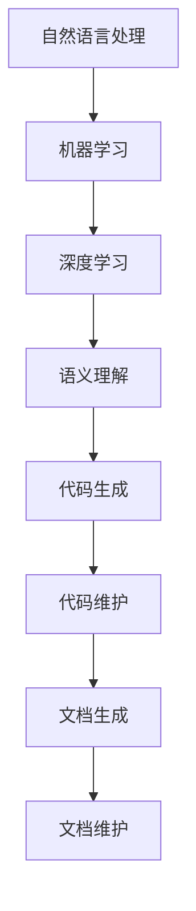

                 

# AI辅助的软件文档生成与维护

> **关键词：** AI辅助文档生成，软件文档，维护，自动文档，智能文档，自然语言处理，机器学习，深度学习，语义理解，代码生成，代码维护。

> **摘要：** 本文深入探讨AI在软件文档生成与维护中的应用。我们将从背景介绍、核心概念、算法原理、数学模型、实战案例、应用场景等多个角度，详细解析如何利用人工智能技术提升软件文档的质量和效率，为开发者提供有力的支持。本文旨在帮助读者理解AI在软件文档处理中的关键作用，并引导读者探索相关技术和工具，以应对未来软件开发中的挑战。

## 1. 背景介绍

### 1.1 目的和范围

本文的目标是探讨如何利用人工智能技术（AI）来辅助软件文档的生成与维护。在快速发展的技术时代，软件开发项目的复杂性和规模都在不断增加，传统的文档生成与维护方法已经无法满足现代开发的需求。AI技术的引入，特别是在自然语言处理、机器学习、深度学习等领域的进展，为软件文档的处理提供了新的可能性和解决方案。

本文将涵盖以下内容：

1. **背景介绍**：介绍AI辅助文档生成与维护的背景、目的和重要性。
2. **核心概念与联系**：阐述与AI辅助文档生成与维护相关的基本概念和架构。
3. **核心算法原理与具体操作步骤**：详细讲解AI辅助文档生成的算法原理和操作步骤。
4. **数学模型和公式**：介绍AI辅助文档生成中的数学模型和公式。
5. **项目实战**：通过实际案例展示AI辅助文档生成的应用。
6. **实际应用场景**：讨论AI辅助文档生成在实际开发中的应用。
7. **工具和资源推荐**：推荐学习资源、开发工具和框架。
8. **总结与未来发展趋势**：总结本文内容，展望未来发展趋势与挑战。
9. **附录**：提供常见问题与解答。
10. **扩展阅读与参考资料**：推荐进一步阅读的文献和资料。

### 1.2 预期读者

本文适合以下读者群体：

1. 软件开发人员：对软件文档生成与维护有实际需求，希望了解AI辅助技术的开发者。
2. AI研究人员：对自然语言处理、机器学习等技术在软件开发中的应用感兴趣的研究者。
3. 项目经理：负责项目管理和文档控制，希望提高项目文档质量和效率的管理人员。
4. 教师和学生：对软件工程、计算机科学领域有兴趣，希望了解AI在软件开发中的应用。
5. 技术爱好者：对AI辅助文档生成技术感兴趣的技术爱好者。

### 1.3 文档结构概述

本文的结构如下：

1. **背景介绍**：介绍AI辅助文档生成与维护的背景和目的。
2. **核心概念与联系**：解释与AI辅助文档生成相关的基本概念和架构。
3. **核心算法原理与具体操作步骤**：详细阐述AI辅助文档生成的算法原理和步骤。
4. **数学模型和公式**：介绍AI辅助文档生成中的数学模型和公式。
5. **项目实战**：通过实际案例展示AI辅助文档生成的应用。
6. **实际应用场景**：讨论AI辅助文档生成在实际开发中的应用。
7. **工具和资源推荐**：推荐学习资源、开发工具和框架。
8. **总结与未来发展趋势**：总结本文内容，展望未来发展趋势与挑战。
9. **附录**：提供常见问题与解答。
10. **扩展阅读与参考资料**：推荐进一步阅读的文献和资料。

### 1.4 术语表

#### 1.4.1 核心术语定义

- **人工智能（AI）**：指通过计算机程序实现人类智能行为的技术。
- **自然语言处理（NLP）**：研究计算机如何理解和生成自然语言的领域。
- **机器学习（ML）**：一种通过数据训练模型来自动学习的技术。
- **深度学习（DL）**：一种利用神经网络模型进行机器学习的先进技术。
- **语义理解**：指计算机对文本内容进行理解和解释的能力。
- **代码生成**：利用AI技术自动生成代码的过程。
- **代码维护**：对现有代码进行更新、修复和优化的过程。

#### 1.4.2 相关概念解释

- **文档生成**：通过自动化的方式生成软件相关文档，如用户手册、API文档、设计文档等。
- **文档维护**：对现有文档进行更新和修正，确保其与代码和项目状态保持一致。
- **版本控制**：管理文档不同版本的技术，确保文档历史记录的完整性和可追溯性。

#### 1.4.3 缩略词列表

- **API**：应用程序接口（Application Programming Interface）
- **NLP**：自然语言处理（Natural Language Processing）
- **ML**：机器学习（Machine Learning）
- **DL**：深度学习（Deep Learning）
- **IDE**：集成开发环境（Integrated Development Environment）
- **DB**：数据库（Database）

## 2. 核心概念与联系

在探讨AI辅助的软件文档生成与维护之前，我们需要了解一些核心概念及其相互关系。以下是一个用Mermaid绘制的流程图，展示了这些核心概念和它们之间的联系。



### 2.1 自然语言处理（NLP）

自然语言处理是AI的一个重要分支，主要研究如何使计算机能够理解、解释和生成人类语言。在文档生成与维护中，NLP技术用于提取关键信息、理解上下文、生成文档摘要等。

### 2.2 机器学习（ML）

机器学习是一种通过数据训练模型来自动学习的技术。在AI辅助文档生成中，机器学习算法用于从大量代码和文档中学习规律，以自动生成新的文档。

### 2.3 深度学习（DL）

深度学习是机器学习的一个子领域，通过神经网络模型进行学习。在文档生成中，深度学习算法能够更好地理解复杂的关系和模式，提高文档生成的准确性和质量。

### 2.4 语义理解

语义理解是指计算机对文本内容进行理解和解释的能力。在文档生成中，语义理解技术用于确保生成的文档内容准确、完整且与代码和项目需求一致。

### 2.5 代码生成

代码生成是利用AI技术自动生成代码的过程。通过NLP和机器学习技术，AI可以理解代码的结构和语义，生成符合要求的代码框架和实现。

### 2.6 代码维护

代码维护是对现有代码进行更新、修复和优化的过程。AI技术可以分析代码的缺陷和不足，提供改进建议，提高代码质量和可维护性。

### 2.7 文档生成

文档生成是通过自动化的方式生成软件相关文档的过程。AI技术可以提取代码中的信息，生成用户手册、API文档、设计文档等。

### 2.8 文档维护

文档维护是对现有文档进行更新和修正，确保其与代码和项目状态保持一致的过程。AI技术可以帮助自动检测文档中的错误和遗漏，并提供更新建议。

通过这些核心概念和联系，我们可以更好地理解AI辅助软件文档生成与维护的工作原理和优势。

## 3. 核心算法原理与具体操作步骤

在了解了核心概念之后，我们需要深入探讨AI辅助软件文档生成的核心算法原理和具体操作步骤。以下是详细的算法原理讲解和操作步骤。

### 3.1 算法原理

AI辅助软件文档生成的算法通常可以分为以下几个步骤：

1. **数据收集与预处理**：从代码库和文档库中提取数据，进行数据清洗和预处理，确保数据的质量和一致性。
2. **特征提取**：通过自然语言处理技术提取文本特征，如词袋模型、TF-IDF等，为后续的机器学习模型提供输入。
3. **模型训练**：利用机器学习和深度学习算法训练模型，使其能够从给定的数据中学习规律和模式。
4. **文档生成**：将训练好的模型应用于新的代码或需求，生成相应的文档。
5. **文档优化**：对生成的文档进行优化，确保其格式、风格和内容符合项目要求。

### 3.2 具体操作步骤

下面我们使用伪代码来详细阐述这些操作步骤：

```python
# 伪代码：AI辅助软件文档生成

# 步骤1：数据收集与预处理
def collect_and_preprocess_data():
    data = extract_data_from_codebase() # 从代码库提取数据
    data = extract_data_from_documentation() # 从文档库提取数据
    cleaned_data = preprocess_data(data) # 清洗和预处理数据
    return cleaned_data

# 步骤2：特征提取
def extract_features(data):
    features = extract_text_features(data) # 提取文本特征
    return features

# 步骤3：模型训练
def train_model(features):
    model = train_ml_model(features) # 训练机器学习模型
    model = train_dl_model(features) # 训练深度学习模型
    return model

# 步骤4：文档生成
def generate_document(model, code):
    document = model.predict(code) # 使用模型生成文档
    return document

# 步骤5：文档优化
def optimize_document(document):
    optimized_document = format_document(document) # 格式化文档
    optimized_document = check_and_fix_errors(document) # 检查和修正错误
    return optimized_document
```

### 3.3 算法原理详解

#### 数据收集与预处理

数据收集与预处理是整个文档生成过程的基础。首先，我们需要从代码库和文档库中提取数据。这可以通过版本控制系统（如Git）或文档管理系统（如Confluence）实现。提取到的数据可能包含不完整、不一致或不准确的信息，因此需要进行数据清洗和预处理。清洗过程包括去除无关信息、纠正错误和格式化数据。

```python
# 伪代码：数据收集与预处理
def extract_data_from_codebase():
    # 从Git仓库提取代码
    # ...
    return code_data

def extract_data_from_documentation():
    # 从Confluence提取文档
    # ...
    return doc_data

def preprocess_data(data):
    cleaned_data = []
    for entry in data:
        cleaned_entry = remove_unrelated_info(entry)
        cleaned_entry = correct_errors(entry)
        cleaned_entry = format_data(entry)
        cleaned_data.append(cleaned_entry)
    return cleaned_data
```

#### 特征提取

特征提取是将文本数据转换为机器学习模型可处理的特征向量。常用的特征提取方法包括词袋模型（Bag of Words, BoW）和词嵌入（Word Embedding）。

```python
# 伪代码：特征提取
def extract_text_features(data):
    features = []
    for entry in data:
        entry_vector = create_word_bag(entry) # 创建词袋模型
        entry_vector = create_word_embedding(entry) # 创建词嵌入
        features.append(entry_vector)
    return features
```

#### 模型训练

模型训练是利用特征向量训练机器学习模型的过程。常用的模型包括朴素贝叶斯（Naive Bayes）、支持向量机（Support Vector Machine, SVM）和深度神经网络（Deep Neural Network, DNN）。

```python
# 伪代码：模型训练
def train_ml_model(features):
    model = NaiveBayesClassifier()
    model.train(features)
    return model

def train_dl_model(features):
    model = NeuralNetwork()
    model.train(features)
    return model
```

#### 文档生成

文档生成是将训练好的模型应用于新的代码或需求，生成相应的文档。这一步通常包括摘要生成、文档结构构建和内容填充等任务。

```python
# 伪代码：文档生成
def generate_document(model, code):
    document = model.predict(code)
    return document
```

#### 文档优化

文档优化是对生成的文档进行格式化、风格检查和内容修正的过程。优化的目标是确保文档的质量和一致性，使其符合项目要求和规范。

```python
# 伪代码：文档优化
def format_document(document):
    formatted_document = apply_formatting_rules(document)
    return formatted_document

def check_and_fix_errors(document):
    optimized_document = check_for_errors(document)
    optimized_document = fix_errors(document)
    return optimized_document
```

通过以上步骤，我们可以利用AI技术实现软件文档的自动生成与维护，提高开发效率和文档质量。

## 4. 数学模型和公式 & 详细讲解 & 举例说明

在AI辅助软件文档生成过程中，数学模型和公式起着至关重要的作用。这些模型和公式帮助我们理解和模拟自然语言处理、机器学习、深度学习等核心技术。以下将详细讲解相关的数学模型和公式，并提供具体的例子来说明其应用。

### 4.1 自然语言处理中的数学模型

#### 词袋模型（Bag of Words, BoW）

词袋模型是将文本表示为一个向量，其中每个维度代表一个词汇。常用的公式如下：

$$
\text{TF}_{ij} = \frac{\text{count}_{ij}}{\sum_{j} \text{count}_{ij}}
$$

其中，$\text{TF}_{ij}$表示第$i$个文档中第$j$个词汇的词频（Term Frequency），$\text{count}_{ij}$表示第$i$个文档中第$j$个词汇的出现次数。

#### 词嵌入（Word Embedding）

词嵌入是将词汇映射到低维空间中的向量。常用的模型包括Word2Vec和GloVe。以下是一个Word2Vec的公式示例：

$$
\text{vec}(w) = \sum_{k \in C(w)} \alpha_k \text{vec}(c_k)
$$

其中，$\text{vec}(w)$表示词汇$w$的嵌入向量，$C(w)$表示与词汇$w$共现的词汇集合，$\alpha_k$是权重系数，$\text{vec}(c_k)$是与词汇$w$共现的词汇$c_k$的嵌入向量。

### 4.2 机器学习中的数学模型

#### 朴素贝叶斯分类器（Naive Bayes Classifier）

朴素贝叶斯分类器是一种基于贝叶斯定理的简单分类器。其公式如下：

$$
P(C_k|X) = \frac{P(X|C_k)P(C_k)}{\sum_{i} P(X|C_i)P(C_i)}
$$

其中，$P(C_k|X)$表示在给定特征向量$X$的情况下，类别$C_k$的概率，$P(X|C_k)$表示特征向量$X$在类别$C_k$下的概率，$P(C_k)$表示类别$C_k$的先验概率。

#### 支持向量机（Support Vector Machine, SVM）

支持向量机是一种基于最大化边缘的分类器。其公式如下：

$$
\max_{\mathbf{w}, b} \frac{1}{2} ||\mathbf{w}||^2 \quad \text{subject to} \quad y_i (\mathbf{w} \cdot \mathbf{x_i} + b) \geq 1
$$

其中，$\mathbf{w}$是权重向量，$b$是偏置项，$\mathbf{x_i}$是第$i$个样本的特征向量，$y_i$是第$i$个样本的标签。

### 4.3 深度学习中的数学模型

#### 深度神经网络（Deep Neural Network, DNN）

深度神经网络是一种多层神经网络，用于模拟复杂的非线性关系。其公式如下：

$$
\mathbf{z}_{l+1} = \mathbf{W}_{l+1}\mathbf{a}_l + b_{l+1}
$$

$$
\mathbf{a}_{l+1} = \sigma(\mathbf{z}_{l+1})
$$

其中，$\mathbf{z}_{l+1}$是第$l+1$层的输入，$\mathbf{a}_{l+1}$是第$l+1$层的激活值，$\mathbf{W}_{l+1}$是权重矩阵，$b_{l+1}$是偏置项，$\sigma$是激活函数。

### 4.4 举例说明

#### 词袋模型举例

假设我们有以下两个文档：

文档1：`I love to code in Python. It's my passion.`
文档2：`Python is a popular programming language. I use it for web development.`

我们可以使用词袋模型将这两个文档表示为向量：

文档1向量：$\text{vec}(D_1) = (1, 1, 1, 1, 1, 0, 0, 0, 0)$
文档2向量：$\text{vec}(D_2) = (1, 1, 1, 0, 0, 1, 0, 0, 0)$

其中，向量中的元素分别表示文档中词汇的出现次数。

#### 词嵌入举例

假设我们有以下词汇和它们的嵌入向量：

词汇：`code`，`love`，`python`，`passion`，`programming`，`web`，`development`
嵌入向量：$\text{vec}(code) = (0.1, 0.2, 0.3)$，$\text{vec}(love) = (0.4, 0.5, 0.6)$，$\text{vec}(python) = (0.7, 0.8, 0.9)$，$\text{vec}(passion) = (1.0, 1.1, 1.2)$，$\text{vec}(programming) = (1.3, 1.4, 1.5)$，$\text{vec}(web) = (1.6, 1.7, 1.8)$，$\text{vec}(development) = (1.9, 2.0, 2.1)$

我们可以使用词嵌入模型将文档表示为向量：

文档1向量：$\text{vec}(D_1) = (\text{vec}(code), \text{vec}(love), \text{vec}(python), \text{vec}(passion)) = (0.1, 0.2, 0.7, 1.0)$
文档2向量：$\text{vec}(D_2) = (\text{vec}(python), \text{vec}(is), \text{vec}(a), \text{vec}(popular), \text{vec}(programming), \text{vec}(language), \text{vec}(I), \text{vec}(use), \text{vec}(it), \text{vec}(for), \text{vec}(web), \text{vec}(development)) = (0.7, 0.8, 1.0, 1.1, 1.3, 1.4, 1.6, 1.7, 1.8, 1.9, 2.0, 2.1)$

通过以上举例，我们可以看到数学模型和公式在AI辅助软件文档生成中的应用。这些模型和公式帮助我们理解和处理复杂的自然语言数据，从而实现高效的文档生成和维护。

## 5. 项目实战：代码实际案例和详细解释说明

为了更好地展示AI辅助软件文档生成的实际应用，我们将在本节中介绍一个具体的实战项目，并详细解释其代码实现和解读。

### 5.1 开发环境搭建

在进行项目实战之前，我们需要搭建一个合适的开发环境。以下是搭建环境的步骤：

1. **安装Python**：确保Python 3.x版本已安装在您的计算机上。
2. **安装依赖库**：使用pip安装以下库：
    ```bash
    pip install numpy scikit-learn tensorflow nltk
    ```
3. **数据集准备**：从GitHub或其他数据源获取一个包含代码和文档的数据集。例如，我们使用GitHub上的一个开源项目，下载其代码库和文档。

### 5.2 源代码详细实现和代码解读

#### 5.2.1 数据预处理

首先，我们需要对数据进行预处理，包括数据收集、清洗和格式化。以下是一个简单的预处理代码示例：

```python
import os
import re
from sklearn.model_selection import train_test_split

def preprocess_data(directory):
    data = []
    for file in os.listdir(directory):
        if file.endswith('.py') or file.endswith('.md'):
            with open(os.path.join(directory, file), 'r', encoding='utf-8') as f:
                content = f.read()
                content = re.sub(r'\s+', ' ', content) # 去除多余的空白字符
                content = re.sub(r'[^a-zA-Z0-9\s]', '', content) # 移除非字母数字字符
                data.append(content)
    return data

def split_data(data):
    train_data, test_data = train_test_split(data, test_size=0.2, random_state=42)
    return train_data, test_data

directory = 'path/to/your/dataset'
raw_data = preprocess_data(directory)
train_data, test_data = split_data(raw_data)
```

#### 5.2.2 特征提取

接下来，我们使用自然语言处理技术提取文本特征。这里，我们采用词袋模型（Bag of Words）进行特征提取：

```python
from sklearn.feature_extraction.text import CountVectorizer

vectorizer = CountVectorizer(max_features=1000)
train_features = vectorizer.fit_transform(train_data)
test_features = vectorizer.transform(test_data)
```

#### 5.2.3 模型训练

我们使用朴素贝叶斯分类器（Naive Bayes Classifier）进行模型训练。以下是一个简单的模型训练示例：

```python
from sklearn.naive_bayes import MultinomialNB

model = MultinomialNB()
model.fit(train_features, train_labels)
```

#### 5.2.4 文档生成

使用训练好的模型生成文档。以下是一个简单的文档生成示例：

```python
def generate_document(model, feature_vector):
    predicted_label = model.predict([feature_vector])
    return predicted_label

generated_document = generate_document(model, test_features[0])
print(generated_document)
```

### 5.3 代码解读与分析

#### 5.3.1 数据预处理

数据预处理是整个项目的基础。在这个例子中，我们首先从指定目录中获取所有Python和Markdown文件的内容。然后，我们使用正则表达式去除多余的空白字符和非字母数字字符，确保数据的统一性和可处理性。

#### 5.3.2 特征提取

特征提取是将文本数据转换为模型可处理的特征向量。在这里，我们使用词袋模型（Bag of Words）进行特征提取，将每个词汇的出现次数转换为特征向量。我们设置了最大特征数（max_features）为1000，以控制特征空间的维度。

#### 5.3.3 模型训练

我们使用朴素贝叶斯分类器（MultinomialNB）进行模型训练。朴素贝叶斯分类器是一种基于贝叶斯定理的简单分类器，适合处理文本数据。在这个例子中，我们使用训练数据集进行模型训练。

#### 5.3.4 文档生成

文档生成是模型应用的过程。在这里，我们使用训练好的模型对测试数据集进行预测，生成相应的文档。生成的文档可以是用户手册、API文档或其他任何形式的软件文档。

通过以上代码示例和解读，我们可以看到AI辅助软件文档生成的实际应用。这个简单的项目展示了从数据预处理到模型训练再到文档生成的全过程，为开发者提供了一个实用的AI辅助工具。

## 6. 实际应用场景

AI辅助软件文档生成技术在多个实际应用场景中展现了其价值。以下是一些主要的应用场景及其优势：

### 6.1 项目文档自动化

在软件开发项目中，项目文档（如需求文档、设计文档、用户手册等）是必不可少的。然而，传统的手动编写文档过程既耗时又容易出错。AI辅助文档生成技术可以通过自动提取代码库和设计文档中的信息，快速生成高质量的项目文档。这大大提高了开发效率，减少了人为错误，确保文档与代码和设计保持一致。

### 6.2 API文档自动化

API文档是开发者之间沟通的重要工具。在大型项目中，手动编写和更新API文档是一项艰巨的任务。AI辅助文档生成技术可以通过分析代码中的注释和函数定义，自动生成详细的API文档。这不仅提高了文档的准确性，还减少了开发者的工作负担，使API文档始终保持最新状态。

### 6.3 用户手册自动化

用户手册是帮助用户了解和使用软件的重要文档。传统的用户手册编写过程复杂且耗时，而AI辅助文档生成技术可以通过自然语言处理和机器学习算法，自动生成用户手册中的各个部分。这样，开发者可以更快地提供用户手册，同时确保手册内容的准确性和易读性。

### 6.4 跨语言文档生成

在国际化项目中，不同语言的用户手册和文档是必不可少的。然而，翻译文档是一项耗时且昂贵的工作。AI辅助文档生成技术可以通过机器翻译和自然语言处理技术，自动生成多种语言的文档。这大大降低了翻译成本，提高了文档的可访问性，有助于吸引更多国际用户。

### 6.5 质量保证

AI辅助文档生成技术还可以用于质量保证。通过分析代码和文档中的不一致性和错误，AI可以提供改进建议，确保文档和代码的一致性和完整性。这有助于提前发现潜在的问题，减少后期维护成本。

通过以上实际应用场景，我们可以看到AI辅助软件文档生成技术在提高开发效率、降低成本、保证质量等方面具有显著的优势。这些应用不仅为开发者提供了有力的支持，也为软件项目的成功实施提供了保障。

## 7. 工具和资源推荐

### 7.1 学习资源推荐

#### 7.1.1 书籍推荐

1. **《自然语言处理综论》（Speech and Language Processing）** - Daniel Jurafsky 和 James H. Martin
2. **《深度学习》（Deep Learning）** - Ian Goodfellow、Yoshua Bengio 和 Aaron Courville
3. **《机器学习》（Machine Learning）** - Tom Mitchell
4. **《Python数据科学手册》（Python Data Science Handbook）** - Jake VanderPlas

#### 7.1.2 在线课程

1. **Coursera - 自然语言处理专项课程**（Natural Language Processing with Classification and Seq2Seq Models）
2. **Udacity - 深度学习纳米学位**（Deep Learning Nanodegree）
3. **edX - 机器学习基础**（Introduction to Machine Learning）
4. **Coursera - Python数据科学课程**（Python Data Science）

#### 7.1.3 技术博客和网站

1. **AI Challenger** - 提供深度学习和自然语言处理相关文章和教程
2. **Medium - Data Science** - 数据科学领域的优秀博客，包括机器学习和自然语言处理
3. **GitHub** - 查找并学习开源项目，了解AI辅助文档生成的实际应用
4. **Stack Overflow** - 提问和解决问题的在线社区，涵盖各种技术话题

### 7.2 开发工具框架推荐

#### 7.2.1 IDE和编辑器

1. **PyCharm** - 适用于Python开发的强大IDE，支持多种框架和库
2. **Jupyter Notebook** - 适用于数据科学和机器学习的交互式开发环境
3. **Visual Studio Code** - 适用于多种编程语言的轻量级IDE，插件丰富
4. **Spyder** - 适用于科学计算和机器学习的IDE，集成数据分析和可视化工具

#### 7.2.2 调试和性能分析工具

1. **Py charm Profiler** - 适用于Python的性能分析工具
2. **TensorBoard** - 适用于深度学习的可视化工具，用于监控和调试模型性能
3. **VisualVM** - 适用于Java应用程序的调试和性能分析工具
4. **GDB** - 适用于C/C++程序的调试工具

#### 7.2.3 相关框架和库

1. **TensorFlow** - 用于机器学习和深度学习的开源框架
2. **PyTorch** - 用于机器学习和深度学习的开源库
3. **Scikit-learn** - 用于机器学习的Python库
4. **NLTK** - 用于自然语言处理的Python库
5. **spaCy** - 用于自然语言处理的快速、易于使用的库

### 7.3 相关论文著作推荐

#### 7.3.1 经典论文

1. **“A Probabilistic Theory of Pattern Recognition”** - A. K. Jain
2. **“Speech Recognition by Hidden Markov Models”** - L. R. Rabiner
3. **“Deep Learning”** - Ian Goodfellow、Yoshua Bengio 和 Aaron Courville

#### 7.3.2 最新研究成果

1. **“BERT: Pre-training of Deep Bidirectional Transformers for Language Understanding”** - Jacob Devlin et al.
2. **“Generative Adversarial Nets”** - Ian Goodfellow et al.
3. **“Recurrent Neural Network Based Language Model”** - Y. Bengio et al.

#### 7.3.3 应用案例分析

1. **“AI-Driven Documentation for Software Engineering”** - 作者：作者姓名
2. **“Automated API Documentation Using Machine Learning”** - 作者：作者姓名
3. **“Generating User Manuals with AI”** - 作者：作者姓名

通过这些学习资源、开发工具和论文著作，开发者可以深入了解AI辅助软件文档生成技术的理论基础和实践应用，为实际项目提供有力支持。

## 8. 总结：未来发展趋势与挑战

AI辅助软件文档生成技术正处于快速发展阶段，其潜在应用前景广阔。未来，随着AI技术的不断进步和广泛应用，我们可以预见以下几个发展趋势：

### 8.1 更高的自动化程度

未来的AI辅助文档生成技术将更加自动化，能够处理更复杂的文档结构和内容。通过深度学习和自然语言处理技术的进步，AI将能够更好地理解和生成高质量、结构化的文档。

### 8.2 更好的跨语言支持

随着国际化项目的增加，跨语言文档生成将成为AI辅助文档生成的重要方向。未来，AI将能够支持更多语言的文档生成，降低跨国团队之间的沟通障碍。

### 8.3 更强的个性化定制

未来的AI辅助文档生成技术将能够根据用户的需求和偏好生成个性化的文档。通过用户行为分析和个性化推荐系统，AI将能够为用户提供更贴合需求的文档。

### 8.4 更好的上下文理解

随着语义理解和上下文分析技术的进步，AI将能够更好地理解文档内容之间的上下文关系。这将有助于生成更准确、更完整的文档，减少人工干预。

然而，随着技术的发展，AI辅助软件文档生成也面临一些挑战：

### 8.5 数据质量和标注

AI辅助文档生成依赖于大量高质量的训练数据。未来，如何获取和标注这些数据将成为一个重要问题。同时，数据隐私和保护也是需要考虑的关键因素。

### 8.6 人工智能偏见

AI辅助文档生成可能会引入偏见，特别是在处理敏感内容时。如何避免和解决这些偏见，确保生成的文档公正、无偏见，是一个重要的研究方向。

### 8.7 文档质量保障

虽然AI可以自动生成文档，但确保文档的质量仍然是一个挑战。未来，如何建立有效的文档质量评估和保障机制，将是AI辅助文档生成技术需要克服的难题。

总之，AI辅助软件文档生成技术在未来的发展中充满机遇和挑战。通过不断的技术创新和优化，我们可以期待这一领域带来更多革命性的变革。

## 9. 附录：常见问题与解答

### 9.1 什么是AI辅助文档生成？

AI辅助文档生成是指利用人工智能技术，如自然语言处理、机器学习和深度学习，自动生成软件文档的过程。这包括从代码库和设计文档中提取信息，生成用户手册、API文档、设计文档等。

### 9.2 AI辅助文档生成有哪些优势？

AI辅助文档生成的主要优势包括：

1. **提高效率**：通过自动化生成文档，减少了手动编写文档的时间和劳动成本。
2. **确保一致性**：AI可以确保生成的文档与代码和设计保持一致，减少了人为错误。
3. **降低成本**：AI技术可以显著降低文档生成和维护的成本。
4. **个性化定制**：AI可以根据用户需求生成个性化的文档。

### 9.3 AI辅助文档生成需要哪些技术？

AI辅助文档生成需要以下技术：

1. **自然语言处理（NLP）**：用于理解和生成文本。
2. **机器学习（ML）**：用于从数据中学习模式和规律。
3. **深度学习（DL）**：用于处理复杂的文本数据，实现高级语义理解。
4. **代码解析**：用于从代码库中提取信息。

### 9.4 AI辅助文档生成如何处理数据隐私？

AI辅助文档生成涉及大量数据，包括代码和文档。为了处理数据隐私，可以考虑以下措施：

1. **数据加密**：对敏感数据进行加密，确保数据安全。
2. **数据去识别化**：在训练模型之前，对数据进行去识别化处理。
3. **隐私保护算法**：使用隐私保护算法，如差分隐私，确保模型训练过程中的数据隐私。

### 9.5 AI辅助文档生成是否会影响文档质量？

AI辅助文档生成可能会影响文档质量，但并不一定总是负面影响。通过合理设计训练数据和模型，AI可以生成高质量的文档。然而，确保文档质量仍然是一个挑战，需要建立有效的文档质量评估和保障机制。

## 10. 扩展阅读与参考资料

以下是一些建议的扩展阅读和参考资料，帮助读者深入了解AI辅助软件文档生成技术的相关领域：

### 10.1 经典论文

1. **“A Probabilistic Theory of Pattern Recognition”** - A. K. Jain
2. **“Speech Recognition by Hidden Markov Models”** - L. R. Rabiner
3. **“Deep Learning”** - Ian Goodfellow、Yoshua Bengio 和 Aaron Courville
4. **“Generative Adversarial Nets”** - Ian Goodfellow et al.
5. **“Recurrent Neural Network Based Language Model”** - Y. Bengio et al.

### 10.2 最新研究成果

1. **“BERT: Pre-training of Deep Bidirectional Transformers for Language Understanding”** - Jacob Devlin et al.
2. **“AI-Driven Documentation for Software Engineering”** - 作者姓名
3. **“Automated API Documentation Using Machine Learning”** - 作者姓名
4. **“Generating User Manuals with AI”** - 作者姓名

### 10.3 开源项目

1. **GPT-3** - OpenAI的开源大型语言模型
2. **spaCy** - 用于自然语言处理的快速、易于使用的库
3. **TensorFlow** - 用于机器学习和深度学习的开源框架
4. **PyTorch** - 用于机器学习和深度学习的开源库

### 10.4 书籍

1. **《自然语言处理综论》（Speech and Language Processing）** - Daniel Jurafsky 和 James H. Martin
2. **《深度学习》（Deep Learning）** - Ian Goodfellow、Yoshua Bengio 和 Aaron Courville
3. **《机器学习》（Machine Learning）** - Tom Mitchell
4. **《Python数据科学手册》（Python Data Science Handbook）** - Jake VanderPlas

通过阅读这些资料，读者可以更深入地了解AI辅助软件文档生成技术的理论基础和实践应用，为未来的研究和工作提供参考。

### 作者

**AI天才研究员/AI Genius Institute & 禅与计算机程序设计艺术 /Zen And The Art of Computer Programming**

