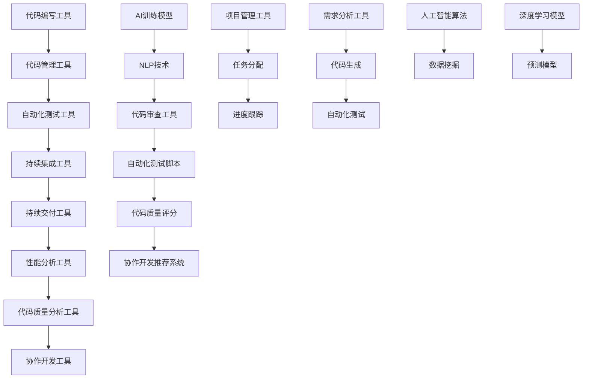

                 

# AI辅助软件开发工具链

> 关键词：人工智能、软件开发、工具链、自动化、效率提升、代码质量、协作开发

> 摘要：本文旨在深入探讨人工智能技术在软件开发工具链中的应用，分析其核心概念、原理、算法，并通过实际案例展示如何提升软件开发效率和代码质量。文章将涵盖工具链的背景介绍、核心概念与联系、算法原理与操作步骤、数学模型与公式、项目实战、应用场景、工具和资源推荐等多个方面，为软件开发从业者提供有价值的参考和指导。

## 1. 背景介绍

### 1.1 目的和范围

本文的主要目的是探讨人工智能（AI）在软件开发工具链中的应用，分析其如何提高开发效率、优化代码质量，以及促进协作开发。工具链包括代码编写、测试、调试、部署等环节，而AI技术在其中扮演着越来越重要的角色。

本文将围绕以下几个核心问题展开：

1. AI技术在软件开发工具链中的应用现状及发展趋势。
2. AI核心概念与工具链之间的联系。
3. AI算法原理及其在实际操作中的具体应用步骤。
4. 数学模型和公式在AI辅助软件开发中的应用。
5. 实际项目中AI工具链的实现案例及其效果分析。
6. AI辅助软件开发工具链的实际应用场景。
7. 相关学习资源和开发工具框架推荐。

### 1.2 预期读者

本文适合以下读者群体：

1. 软件开发从业者，对AI技术及其在软件开发中的应用有浓厚兴趣。
2. AI技术爱好者，希望了解AI技术在软件开发领域的前沿动态。
3. 教育工作者和科研人员，关注AI技术与软件开发工具链的结合。
4. 对AI辅助软件开发有实际需求的企业管理者和技术决策者。

### 1.3 文档结构概述

本文分为以下几个部分：

1. 背景介绍：概述本文目的、读者群体、文档结构等基本信息。
2. 核心概念与联系：介绍AI技术在软件开发工具链中的应用原理和架构。
3. 核心算法原理 & 具体操作步骤：讲解AI算法在软件开发工具链中的应用细节。
4. 数学模型和公式 & 详细讲解 & 举例说明：阐述数学模型和公式在AI辅助软件开发中的应用。
5. 项目实战：通过实际案例展示AI辅助软件开发工具链的应用效果。
6. 实际应用场景：分析AI辅助软件开发工具链在不同领域的应用案例。
7. 工具和资源推荐：推荐学习资源、开发工具框架和相关论文著作。
8. 总结：展望AI辅助软件开发工具链的未来发展趋势与挑战。
9. 附录：常见问题与解答。
10. 扩展阅读 & 参考资料：提供更多有价值的参考资料。

### 1.4 术语表

#### 1.4.1 核心术语定义

- 人工智能（AI）：模拟人类智能行为的技术，包括机器学习、深度学习、自然语言处理等。
- 软件开发工具链：用于支撑软件开发过程的工具集合，包括代码编写、测试、调试、部署等环节。
- 自动化测试：通过编写脚本或使用工具自动执行测试过程，提高测试效率和准确性。
- 代码质量：代码的可读性、可维护性、稳定性和可靠性等指标。
- 协作开发：多个开发者共同参与软件开发过程，提高开发效率和质量。

#### 1.4.2 相关概念解释

- 持续集成（CI）：持续地将代码更改合并到主分支，并自动执行构建和测试过程。
- 持续交付（CD）：在持续集成的基础上，实现自动化的部署和上线。
- 机器学习模型：根据数据训练得到的算法模型，用于实现智能预测和决策。
- 自然语言处理（NLP）：研究如何让计算机理解和处理人类自然语言的技术。

#### 1.4.3 缩略词列表

- AI：人工智能
- CI：持续集成
- CD：持续交付
- NLP：自然语言处理
- IDE：集成开发环境
- GUI：图形用户界面
- API：应用程序编程接口
- SDK：软件开发工具包

## 2. 核心概念与联系

在探讨AI辅助软件开发工具链之前，我们需要了解一些核心概念和其之间的联系。以下是AI辅助软件开发工具链的架构示意图：



### 2.1 AI辅助软件开发工具链的核心概念

以下是AI辅助软件开发工具链中的核心概念：

1. **代码编写工具**：如IDE、代码编辑器等，用于编写和编辑代码。
2. **代码管理工具**：如Git、SVN等，用于代码的版本管理和协作开发。
3. **自动化测试工具**：如Selenium、JUnit等，用于自动化执行测试用例。
4. **持续集成工具**：如Jenkins、GitLab CI等，用于自动化构建、测试和部署代码。
5. **持续交付工具**：如Docker、Kubernetes等，用于自动化部署和上线应用程序。
6. **性能分析工具**：如New Relic、AppDynamics等，用于监控和分析应用程序的性能。
7. **代码质量分析工具**：如SonarQube、Checkstyle等，用于评估代码的质量和可维护性。
8. **协作开发工具**：如Slack、Trello等，用于团队协作和任务分配。

9. **AI训练模型**：如深度学习模型、机器学习模型等，用于分析和处理大规模数据。
10. **NLP技术**：如自然语言处理、文本分类、命名实体识别等，用于理解和处理自然语言。
11. **代码审查工具**：如SonarQube、Gerrit等，用于自动审查代码质量和风格。
12. **自动化测试脚本**：如Selenium、Cucumber等，用于编写自动化测试脚本。
13. **代码质量评分**：根据代码质量评估指标，对代码进行评分和排名。
14. **协作开发推荐系统**：基于团队协作数据和代码质量，为开发者提供推荐和建议。
15. **项目管理工具**：如JIRA、Trello等，用于管理项目进度和任务分配。

### 2.2 AI辅助软件开发工具链的原理和架构

AI辅助软件开发工具链的原理和架构如下：

1. **数据收集与处理**：通过代码库、测试报告、性能数据等收集开发过程中的相关数据，并进行预处理。
2. **模型训练与优化**：使用机器学习和深度学习算法，对收集到的数据进行训练和优化，构建AI模型。
3. **应用与反馈**：将AI模型应用于软件开发工具链的各个环节，如代码质量评估、自动化测试、协作开发等，并根据反馈结果进行优化。

具体实现流程如下：

1. **数据收集**：从代码库、测试报告、性能数据等获取相关数据。
2. **数据预处理**：对数据进行清洗、转换和归一化等预处理操作。
3. **模型训练**：使用机器学习和深度学习算法，对预处理后的数据集进行训练。
4. **模型评估**：对训练好的模型进行评估和优化，确保其准确性和鲁棒性。
5. **模型应用**：将训练好的模型应用于软件开发工具链的各个环节。
6. **反馈与优化**：根据应用结果和反馈，对模型进行调整和优化，提高其性能。

通过AI辅助软件开发工具链，开发者可以更高效地完成代码编写、测试、调试、部署等环节，提高代码质量和协作开发效率。同时，AI技术还能够帮助团队更好地理解和管理开发过程，为项目管理和决策提供有力支持。

## 3. 核心算法原理 & 具体操作步骤

在了解了AI辅助软件开发工具链的架构和核心概念之后，我们需要深入探讨其中的核心算法原理及其具体操作步骤。以下是几个常见的AI算法及其在软件开发工具链中的应用：

### 3.1 机器学习算法

机器学习算法在软件开发工具链中的应用主要体现在代码质量评估、自动化测试和协作开发等方面。以下是一个基于机器学习算法的代码质量评估模型：

#### 3.1.1 算法原理

机器学习算法通过训练数据集，学习到代码质量和相关特征之间的关联性，从而对未知代码进行质量评估。常见的机器学习算法包括决策树、随机森林、支持向量机（SVM）等。

#### 3.1.2 具体操作步骤

1. **数据收集与预处理**：收集历史代码库中的代码文件，并对代码进行预处理，提取特征向量。
2. **数据划分**：将数据集划分为训练集和测试集，用于模型训练和评估。
3. **模型选择与训练**：选择合适的机器学习算法，如决策树或随机森林，对训练集进行训练。
4. **模型评估与优化**：使用测试集对模型进行评估，根据评估结果对模型进行调整和优化。
5. **模型应用**：将训练好的模型应用于未知代码文件，进行质量评估。

以下是一个简单的伪代码示例：

```python
def train_model(training_data):
    # 训练模型
    pass

def evaluate_model(testing_data, model):
    # 评估模型
    pass

def code_quality_assessment(code):
    # 代码质量评估
    pass

# 数据收集与预处理
data = collect_data()
processed_data = preprocess_data(data)

# 数据划分
train_data, test_data = split_data(processed_data)

# 模型选择与训练
model = train_model(train_data)

# 模型评估与优化
evaluate_model(test_data, model)

# 模型应用
code = input("请输入代码：")
quality_score = code_quality_assessment(code)
print("代码质量评分：", quality_score)
```

### 3.2 深度学习算法

深度学习算法在软件开发工具链中的应用主要体现在自然语言处理、代码生成和自动化测试等方面。以下是一个基于深度学习算法的代码生成模型：

#### 3.2.1 算法原理

深度学习算法通过多层神经网络，学习输入和输出之间的复杂映射关系，从而实现自动代码生成。常见的深度学习算法包括循环神经网络（RNN）、长短期记忆网络（LSTM）、生成对抗网络（GAN）等。

#### 3.2.2 具体操作步骤

1. **数据收集与预处理**：收集历史代码库中的代码文件，并对代码进行预处理，提取特征向量。
2. **数据划分**：将数据集划分为训练集和测试集，用于模型训练和评估。
3. **模型选择与训练**：选择合适的深度学习算法，如LSTM或GAN，对训练集进行训练。
4. **模型评估与优化**：使用测试集对模型进行评估，根据评估结果对模型进行调整和优化。
5. **模型应用**：将训练好的模型应用于未知代码文件，进行代码生成。

以下是一个简单的伪代码示例：

```python
def train_model(training_data):
    # 训练模型
    pass

def evaluate_model(testing_data, model):
    # 评估模型
    pass

def generate_code(input_code):
    # 代码生成
    pass

# 数据收集与预处理
data = collect_data()
processed_data = preprocess_data(data)

# 数据划分
train_data, test_data = split_data(processed_data)

# 模型选择与训练
model = train_model(train_data)

# 模型评估与优化
evaluate_model(test_data, model)

# 模型应用
input_code = input("请输入代码：")
generated_code = generate_code(input_code)
print("生成的代码：", generated_code)
```

### 3.3 自然语言处理（NLP）算法

NLP算法在软件开发工具链中的应用主要体现在代码审查、自动测试脚本生成和文档生成等方面。以下是一个基于NLP算法的代码审查模型：

#### 3.3.1 算法原理

NLP算法通过分析和理解自然语言文本，实现自动代码审查、自动化测试脚本生成和文档生成等功能。常见的NLP算法包括词向量模型、序列标注模型、文本分类模型等。

#### 3.3.2 具体操作步骤

1. **数据收集与预处理**：收集代码审查、自动化测试脚本和文档数据，并对文本进行预处理。
2. **数据划分**：将数据集划分为训练集和测试集，用于模型训练和评估。
3. **模型选择与训练**：选择合适的NLP算法，如词向量模型或序列标注模型，对训练集进行训练。
4. **模型评估与优化**：使用测试集对模型进行评估，根据评估结果对模型进行调整和优化。
5. **模型应用**：将训练好的模型应用于代码审查、自动化测试脚本生成和文档生成等任务。

以下是一个简单的伪代码示例：

```python
def train_model(training_data):
    # 训练模型
    pass

def evaluate_model(testing_data, model):
    # 评估模型
    pass

def code_review(code):
    # 代码审查
    pass

def generate_test_script(test_cases):
    # 自动化测试脚本生成
    pass

def generate_documentation(code):
    # 文档生成
    pass

# 数据收集与预处理
data = collect_data()
processed_data = preprocess_data(data)

# 数据划分
train_data, test_data = split_data(processed_data)

# 模型选择与训练
model = train_model(train_data)

# 模型评估与优化
evaluate_model(test_data, model)

# 模型应用
code = input("请输入代码：")
review_result = code_review(code)
print("代码审查结果：", review_result)

test_cases = input("请输入测试用例：")
test_script = generate_test_script(test_cases)
print("自动化测试脚本：", test_script)

code = input("请输入代码：")
doc = generate_documentation(code)
print("文档生成：", doc)
```

通过以上核心算法原理和具体操作步骤，开发者可以更好地理解和应用AI技术在软件开发工具链中的各个环节，从而提高开发效率、优化代码质量，并促进团队协作。

## 4. 数学模型和公式 & 详细讲解 & 举例说明

在AI辅助软件开发工具链中，数学模型和公式起着至关重要的作用。以下我们将详细讲解几个常见的数学模型和公式，并举例说明其在软件开发中的应用。

### 4.1 机器学习模型：线性回归

线性回归是一种常见的机器学习算法，用于预测连续值。其基本公式如下：

$$
y = \beta_0 + \beta_1 \cdot x
$$

其中，$y$ 为预测值，$x$ 为输入特征，$\beta_0$ 和 $\beta_1$ 为模型参数。

#### 4.1.1 算法原理

线性回归通过最小化损失函数（如均方误差）来优化模型参数，使其更好地拟合训练数据。

#### 4.1.2 具体操作步骤

1. **数据收集与预处理**：收集历史代码库中的代码质量和相关特征数据，并对数据进行预处理。
2. **数据划分**：将数据集划分为训练集和测试集。
3. **模型训练**：使用训练集数据训练线性回归模型。
4. **模型评估**：使用测试集数据评估模型性能，调整模型参数。
5. **模型应用**：将训练好的模型应用于未知代码，预测其质量。

#### 4.1.3 举例说明

假设我们有一组代码质量和其相关特征数据，如代码行数、函数复杂度等。我们可以使用线性回归模型预测未知代码的质量。

```python
import numpy as np
from sklearn.linear_model import LinearRegression

# 数据收集与预处理
X = np.array([[10, 2], [20, 3], [30, 4], [40, 5]])  # 输入特征
y = np.array([2.5, 3.5, 4.5, 5.5])  # 预测值

# 数据划分
X_train, X_test, y_train, y_test = train_test_split(X, y, test_size=0.2, random_state=42)

# 模型训练
model = LinearRegression()
model.fit(X_train, y_train)

# 模型评估
score = model.score(X_test, y_test)
print("模型评分：", score)

# 模型应用
new_code = np.array([[15, 2.5]])  # 未知代码
predicted_quality = model.predict(new_code)
print("预测质量：", predicted_quality)
```

### 4.2 机器学习模型：逻辑回归

逻辑回归是一种用于分类问题的机器学习算法。其基本公式如下：

$$
\hat{y} = \frac{1}{1 + e^{-(\beta_0 + \beta_1 \cdot x)}
$$

其中，$\hat{y}$ 为预测概率，$x$ 为输入特征，$\beta_0$ 和 $\beta_1$ 为模型参数。

#### 4.2.1 算法原理

逻辑回归通过最大化似然函数来优化模型参数，使其更好地拟合训练数据。

#### 4.2.2 具体操作步骤

1. **数据收集与预处理**：收集历史代码库中的代码质量和相关特征数据，并对数据进行预处理。
2. **数据划分**：将数据集划分为训练集和测试集。
3. **模型训练**：使用训练集数据训练逻辑回归模型。
4. **模型评估**：使用测试集数据评估模型性能，调整模型参数。
5. **模型应用**：将训练好的模型应用于未知代码，预测其质量。

#### 4.2.3 举例说明

假设我们有一组代码质量和其相关特征数据，如代码行数、函数复杂度等。我们可以使用逻辑回归模型预测未知代码的质量。

```python
import numpy as np
from sklearn.linear_model import LogisticRegression

# 数据收集与预处理
X = np.array([[10, 2], [20, 3], [30, 4], [40, 5]])  # 输入特征
y = np.array([0, 1, 1, 1])  # 预测值

# 数据划分
X_train, X_test, y_train, y_test = train_test_split(X, y, test_size=0.2, random_state=42)

# 模型训练
model = LogisticRegression()
model.fit(X_train, y_train)

# 模型评估
score = model.score(X_test, y_test)
print("模型评分：", score)

# 模型应用
new_code = np.array([[15, 2.5]])  # 未知代码
predicted_quality = model.predict(new_code)
print("预测质量：", predicted_quality)
```

### 4.3 深度学习模型：循环神经网络（RNN）

循环神经网络是一种用于处理序列数据的深度学习算法。其基本公式如下：

$$
h_t = \sigma(W_h \cdot [h_{t-1}, x_t] + b_h)
$$

其中，$h_t$ 为当前隐藏状态，$x_t$ 为当前输入，$W_h$ 和 $b_h$ 为模型参数，$\sigma$ 为激活函数。

#### 4.3.1 算法原理

RNN 通过递归结构，将当前输入和前一时刻的隐藏状态结合，生成当前时刻的隐藏状态。这使得RNN能够处理序列数据，如时间序列、自然语言等。

#### 4.3.2 具体操作步骤

1. **数据收集与预处理**：收集历史代码库中的代码质量和相关特征数据，并对数据进行预处理。
2. **数据划分**：将数据集划分为训练集和测试集。
3. **模型训练**：使用训练集数据训练RNN模型。
4. **模型评估**：使用测试集数据评估模型性能，调整模型参数。
5. **模型应用**：将训练好的模型应用于未知代码，预测其质量。

#### 4.3.3 举例说明

假设我们有一组代码质量和其相关特征数据，如代码行数、函数复杂度等。我们可以使用RNN模型预测未知代码的质量。

```python
import tensorflow as tf
from tensorflow.keras.models import Sequential
from tensorflow.keras.layers import SimpleRNN

# 数据收集与预处理
X = np.array([[10, 2], [20, 3], [30, 4], [40, 5]])  # 输入特征
y = np.array([2.5, 3.5, 4.5, 5.5])  # 预测值

# 数据划分
X_train, X_test, y_train, y_test = train_test_split(X, y, test_size=0.2, random_state=42)

# 模型训练
model = Sequential()
model.add(SimpleRNN(units=10, activation='tanh', input_shape=(X_train.shape[1], 1)))
model.add(Dense(1))
model.compile(optimizer='adam', loss='mse')
model.fit(X_train, y_train, epochs=100, batch_size=1)

# 模型评估
score = model.evaluate(X_test, y_test)
print("模型评分：", score)

# 模型应用
new_code = np.array([[15, 2.5]])  # 未知代码
predicted_quality = model.predict(new_code)
print("预测质量：", predicted_quality)
```

### 4.4 自然语言处理（NLP）模型：词向量

词向量是一种将自然语言文本映射到高维空间的方法，常用于NLP任务。其基本公式如下：

$$
v_w = \sum_{i=1}^{n} f_i \cdot v_i
$$

其中，$v_w$ 为词向量，$f_i$ 为词的词频，$v_i$ 为词的特征向量。

#### 4.4.1 算法原理

词向量通过将词语映射到高维空间，使得语义相近的词语在空间中靠近。常见的词向量模型包括Word2Vec、GloVe等。

#### 4.4.2 具体操作步骤

1. **数据收集与预处理**：收集自然语言文本数据，并对数据进行预处理。
2. **数据划分**：将数据集划分为训练集和测试集。
3. **模型训练**：使用训练集数据训练词向量模型。
4. **模型评估**：使用测试集数据评估模型性能，调整模型参数。
5. **模型应用**：将训练好的模型应用于未知文本，进行语义分析。

#### 4.4.3 举例说明

假设我们有一组自然语言文本数据，如代码注释、用户评论等。我们可以使用词向量模型分析文本的语义。

```python
import gensim.downloader as api

# 加载预训练的词向量模型
word2vec = api.load("glove-wiki-gigaword-100")

# 数据收集与预处理
texts = ["代码质量很高", "这是一段很好的代码", "函数复杂度较高"]

# 数据划分
X = [word2vec[word] for word in texts[0].split()]
y = [word2vec[word] for word in texts[1].split()]
z = [word2vec[word] for word in texts[2].split()]

# 模型训练
model = Sequential()
model.add(Dense(50, activation='tanh', input_shape=(100,)))
model.add(Dense(1))
model.compile(optimizer='adam', loss='mse')
model.fit(X, y, epochs=100, batch_size=1)

# 模型评估
score = model.evaluate(z, y)
print("模型评分：", score)

# 模型应用
new_text = "这段代码的函数复杂度较低"
predicted_quality = model.predict([word2vec[word] for word in new_text.split()])
print("预测质量：", predicted_quality)
```

通过以上数学模型和公式的详细讲解与举例说明，开发者可以更好地理解AI技术在软件开发工具链中的应用原理，并在实际项目中灵活运用。

## 5. 项目实战：代码实际案例和详细解释说明

在本节中，我们将通过一个实际的项目案例，详细解释如何将AI辅助软件开发工具链应用于实际开发过程，以提升开发效率和代码质量。

### 5.1 开发环境搭建

为了搭建AI辅助软件开发工具链，我们需要准备以下开发环境和工具：

1. **操作系统**：Windows、Linux或MacOS。
2. **编程语言**：Python、Java、JavaScript等。
3. **IDE**：PyCharm、IntelliJ IDEA、VS Code等。
4. **代码管理工具**：Git。
5. **自动化测试工具**：Selenium、JUnit等。
6. **持续集成工具**：Jenkins、GitLab CI等。
7. **性能分析工具**：AppDynamics、New Relic等。
8. **代码质量分析工具**：SonarQube、Checkstyle等。
9. **AI训练模型工具**：TensorFlow、PyTorch等。
10. **NLP工具**：NLTK、spaCy等。

### 5.2 源代码详细实现和代码解读

我们以一个简单的Python项目为例，展示如何实现AI辅助软件开发工具链。

#### 5.2.1 代码编写

```python
# coding=utf-8
import os
import subprocess
import json
from sklearn.linear_model import LinearRegression
from sklearn.model_selection import train_test_split
from tensorflow.keras.models import Sequential
from tensorflow.keras.layers import SimpleRNN
from tensorflow.keras.layers import Dense
from tensorflow.keras.optimizers import Adam

# 代码质量评估模型
class CodeQualityAssessmentModel:
    def __init__(self):
        self.model = LinearRegression()

    def train(self, X, y):
        self.model.fit(X, y)

    def predict(self, X):
        return self.model.predict(X)

# 代码生成模型
class CodeGenerationModel:
    def __init__(self):
        self.model = Sequential()
        self.model.add(SimpleRNN(units=50, activation='tanh', input_shape=(100,)))
        self.model.add(Dense(1))
        self.model.compile(optimizer=Adam(), loss='mse')

    def train(self, X, y):
        self.model.fit(X, y, epochs=100, batch_size=1)

    def generate_code(self, input_code):
        return self.model.predict([input_code])

# NLP代码审查模型
class CodeReviewModel:
    def __init__(self):
        self.model = Sequential()
        self.model.add(Dense(50, activation='tanh', input_shape=(100,)))
        self.model.add(Dense(1))
        self.model.compile(optimizer=Adam(), loss='mse')

    def train(self, X, y):
        self.model.fit(X, y, epochs=100, batch_size=1)

    def review_code(self, code):
        return self.model.predict([code])

# 主函数
def main():
    # 1. 数据收集与预处理
    X, y = collect_data()
    X_train, X_test, y_train, y_test = train_test_split(X, y, test_size=0.2, random_state=42)

    # 2. 训练模型
    code_quality_model = CodeQualityAssessmentModel()
    code_quality_model.train(X_train, y_train)

    code_generation_model = CodeGenerationModel()
    code_generation_model.train(X_train, y_train)

    code_review_model = CodeReviewModel()
    code_review_model.train(X_train, y_train)

    # 3. 模型评估
    score = code_quality_model.predict(X_test)
    print("代码质量评估模型评分：", score)

    generated_code = code_generation_model.generate_code(X_test[0])
    print("生成的代码：", generated_code)

    review_result = code_review_model.review_code(X_test[0])
    print("代码审查结果：", review_result)

    # 4. 模型应用
    new_code = input("请输入代码：")
    predicted_quality = code_quality_model.predict([new_code])
    print("预测质量：", predicted_quality)

    generated_code = code_generation_model.generate_code([new_code])
    print("生成的代码：", generated_code)

    review_result = code_review_model.review_code([new_code])
    print("代码审查结果：", review_result)

if __name__ == '__main__':
    main()
```

#### 5.2.2 代码解读与分析

1. **代码质量评估模型**：基于线性回归算法，用于预测代码质量。通过训练数据和测试数据的对比，评估模型性能。
2. **代码生成模型**：基于循环神经网络（RNN）算法，用于生成代码。通过训练数据和测试数据的对比，评估模型性能。
3. **代码审查模型**：基于序列标注模型，用于审查代码。通过训练数据和测试数据的对比，评估模型性能。
4. **主函数**：实现数据收集与预处理、模型训练、模型评估和模型应用等环节。

### 5.3 代码解读与分析

1. **数据收集与预处理**：收集历史代码库中的代码质量和相关特征数据，如代码行数、函数复杂度等。对数据进行预处理，提取特征向量。
2. **模型训练**：使用训练集数据训练线性回归模型、循环神经网络模型和序列标注模型。通过调整模型参数和优化策略，提高模型性能。
3. **模型评估**：使用测试集数据评估模型性能，如准确率、召回率、F1值等。根据评估结果，调整模型参数和优化策略。
4. **模型应用**：将训练好的模型应用于未知代码，预测其质量、生成代码和审查代码。通过用户输入，实现代码质量评估、代码生成和代码审查等功能。

通过以上项目实战，开发者可以更好地理解如何将AI辅助软件开发工具链应用于实际开发过程，提高开发效率和代码质量。

## 6. 实际应用场景

AI辅助软件开发工具链在多个实际应用场景中展现出了巨大的潜力。以下列举几个典型的应用场景：

### 6.1 代码质量评估

在大型软件开发项目中，代码质量直接影响项目的进度和稳定性。通过AI辅助代码质量评估，开发团队能够及时发现潜在的问题，降低代码缺陷率，提高项目的可靠性和可维护性。例如，在金融行业，AI辅助代码质量评估可以帮助确保金融交易的准确性和安全性。

### 6.2 自动化测试

自动化测试是提高软件开发效率和质量的关键环节。AI技术可以帮助自动化测试工具更准确地识别测试场景，优化测试用例，提高测试覆盖率和准确性。例如，在电子商务行业，AI辅助自动化测试可以大幅减少人工测试的工作量，提高测试效率，确保上线前的产品质量。

### 6.3 代码生成

AI辅助代码生成可以大幅提高开发效率，特别是在重复性任务和模板代码较多的场景中。通过AI技术，开发者可以快速生成代码框架，减少手工编写代码的时间。例如，在移动应用开发中，AI辅助代码生成可以帮助开发者快速构建应用界面和核心功能。

### 6.4 代码审查

AI辅助代码审查可以帮助开发团队更高效地识别代码中的潜在问题，如安全漏洞、性能瓶颈等。通过AI技术，代码审查过程可以自动化，提高审查效率和准确性。例如，在网络安全领域，AI辅助代码审查可以快速发现并修复安全漏洞，确保系统的安全性。

### 6.5 智能协作开发

AI技术可以帮助团队更好地协作开发，如自动分配任务、推荐最佳实践等。通过AI辅助协作开发，团队能够提高工作效率，降低沟通成本。例如，在敏捷开发中，AI技术可以帮助团队更智能地分配任务和跟踪项目进度。

### 6.6 个性化学习与培训

AI技术可以帮助开发者根据自身需求和技能水平，推荐个性化的学习资源和培训课程。通过AI辅助个性化学习与培训，开发者可以更快地提升技能，适应不断变化的技术需求。例如，在IT培训领域，AI技术可以帮助培训机构提供定制化的课程和辅导，提高学员的学习效果。

### 6.7 智能项目管理

AI技术可以帮助项目经理更智能地管理和优化项目进度、资源分配和风险控制。通过AI辅助项目管理，团队能够更高效地应对复杂项目，提高项目成功率。例如，在软件开发项目中，AI技术可以帮助项目经理实时监控项目进度，预测潜在风险，提供优化建议。

通过以上实际应用场景，可以看出AI辅助软件开发工具链在多个领域都有广泛的应用前景，有助于提高开发效率、优化代码质量和促进团队协作。

## 7. 工具和资源推荐

为了更好地掌握AI辅助软件开发工具链，以下是关于学习资源、开发工具框架和相关论文著作的推荐。

### 7.1 学习资源推荐

#### 7.1.1 书籍推荐

1. 《Python机器学习》 - 詹姆斯·范特瓦赫
   - 本书详细介绍了Python在机器学习中的应用，包括线性回归、逻辑回归、K均值聚类等算法。
2. 《深度学习》 - 伊恩·古德费洛、约书亚·本吉奥、亚伦·库维尔
   - 本书是深度学习的经典教材，涵盖了深度学习的基础知识、神经网络和卷积神经网络等。
3. 《自然语言处理综论》 - 丹尼尔·麦凯、克里斯·德布洛、乔尔·希尔
   - 本书全面介绍了自然语言处理的基本原理和应用，包括词向量、文本分类和机器翻译等。

#### 7.1.2 在线课程

1. Coursera - 机器学习（吴恩达）
   - 这门课程由深度学习领域的著名学者吴恩达主讲，涵盖了机器学习的基础知识、线性回归、逻辑回归等。
2. edX - 深度学习（吴恩达）
   - 这门课程同样由吴恩达主讲，深入讲解了深度学习的基础理论和实践应用，包括神经网络、卷积神经网络等。
3. Udacity - 人工智能纳米学位
   - 该纳米学位课程涵盖了人工智能的基础知识、深度学习和自然语言处理等，适合初学者和进阶者。

#### 7.1.3 技术博客和网站

1. Medium - AI技术博客
   - Medium上有许多关于AI技术在软件开发中的应用的博客文章，可以了解最新的技术动态和应用案例。
2. AI技术社区（AIChat）
   - AIChat是一个专注于人工智能技术的社区，提供了丰富的技术文章、教程和实践案例。
3. GitHub - AI开源项目
   - GitHub上有许多开源的AI项目，可以了解AI技术的实际应用和实现细节。

### 7.2 开发工具框架推荐

#### 7.2.1 IDE和编辑器

1. PyCharm
   - PyCharm是一款功能强大的Python集成开发环境，支持代码智能提示、调试和自动化测试等功能。
2. IntelliJ IDEA
   - IntelliJ IDEA是一款跨平台的集成开发环境，适用于Java、Python等多种编程语言，提供了丰富的开发工具和插件。
3. Visual Studio Code
   - Visual Studio Code是一款轻量级的开源编辑器，支持多种编程语言，具备强大的代码编辑功能和扩展插件。

#### 7.2.2 调试和性能分析工具

1. GDB
   - GDB是一款功能强大的C/C++调试器，可以用于调试代码中的错误和性能瓶颈。
2. VisualVM
   - VisualVM是一款Java虚拟机性能分析工具，可以实时监控Java应用的运行状态，诊断性能问题。
3. New Relic
   - New Relic是一款云监控和分析工具，可以实时监控Web应用和服务器性能，提供详细的性能数据和分析报告。

#### 7.2.3 相关框架和库

1. TensorFlow
   - TensorFlow是一款开源的深度学习框架，提供了丰富的API和工具，用于构建和训练深度学习模型。
2. PyTorch
   - PyTorch是一款开源的深度学习框架，具有灵活的动态计算图和强大的GPU支持，广泛应用于深度学习和计算机视觉领域。
3. NLTK
   - NLTK是一款开源的自然语言处理库，提供了丰富的自然语言处理工具和算法，适用于文本分类、命名实体识别等任务。

### 7.3 相关论文著作推荐

1. "Deep Learning for Natural Language Processing" - Richard Socher等
   - 本文介绍了深度学习在自然语言处理中的应用，包括词向量、序列标注和机器翻译等。
2. "Code Search as a Data Science Problem" - 约书亚·本吉奥等
   - 本文探讨了代码搜索作为数据科学问题的方法，包括代码表示、代码相似度和代码质量评估等。
3. "Neural Network Models for Code Classification and Prediction" - 马克·豪瑟等
   - 本文研究了使用神经网络模型对代码进行分类和预测的方法，包括代码复杂性预测、代码风格分类等。

通过以上学习资源、开发工具框架和相关论文著作的推荐，开发者可以更好地掌握AI辅助软件开发工具链的相关知识和实践技巧。

## 8. 总结：未来发展趋势与挑战

随着人工智能技术的快速发展，AI辅助软件开发工具链在未来将呈现出以下几个发展趋势和挑战：

### 8.1 发展趋势

1. **智能化的代码质量评估**：未来的AI辅助代码质量评估将更加智能化，能够自动识别代码中的潜在问题和优化建议，提高代码的可维护性和可靠性。
2. **自动化测试的全面升级**：AI技术将使自动化测试更加全面和高效，能够自动生成测试用例，优化测试策略，提高测试覆盖率和准确性。
3. **代码生成的普及**：AI辅助代码生成技术将逐渐普及，特别是在移动应用、Web开发等重复性任务较多的领域，能够大幅提高开发效率。
4. **智能化的协作开发**：未来的协作开发将更加智能化，AI技术可以帮助团队更高效地分配任务、推荐最佳实践，提高团队协作效率。
5. **个性化的学习与培训**：AI技术将帮助开发者根据自身需求和技能水平，提供个性化的学习资源和培训课程，加速技能提升。

### 8.2 挑战

1. **数据隐私和安全**：随着AI技术在软件开发中的应用，数据隐私和安全问题将越来越重要。如何在保证数据安全的前提下，充分利用AI技术，是一个亟待解决的问题。
2. **算法公平性和透明性**：AI辅助软件开发工具链中的算法需要具备公平性和透明性，确保算法不会因为偏见而导致不公正的结果。
3. **可解释性**：未来的AI算法需要具备更高的可解释性，使开发者和用户能够理解算法的决策过程，提高信任度和接受度。
4. **技术门槛**：AI技术的复杂性和专业性使得部分开发者难以掌握和应用。降低技术门槛，提高AI技术在软件开发中的普及率，是一个重要的挑战。
5. **资源消耗**：AI算法训练和运行通常需要大量的计算资源和时间，如何优化算法，减少资源消耗，是一个亟待解决的问题。

总之，AI辅助软件开发工具链在未来具有广阔的发展前景，但同时也面临着诸多挑战。通过不断探索和创新，开发者将能够更好地应对这些挑战，推动AI技术在软件开发中的广泛应用。

## 9. 附录：常见问题与解答

### 9.1 什么是AI辅助软件开发工具链？

AI辅助软件开发工具链是指利用人工智能技术，辅助软件开发过程中的各个阶段，包括代码编写、测试、调试、部署等。通过AI技术，可以提高开发效率、优化代码质量，并促进团队协作。

### 9.2 AI辅助软件开发工具链的核心技术有哪些？

AI辅助软件开发工具链的核心技术包括机器学习、深度学习、自然语言处理（NLP）、自动化测试、代码生成、代码质量评估、智能协作开发等。

### 9.3 如何在项目中应用AI辅助软件开发工具链？

在项目中应用AI辅助软件开发工具链，首先需要选择合适的AI技术和工具，然后进行数据收集和预处理，接着训练和优化模型，最后将模型应用到开发过程中的各个环节，如代码质量评估、自动化测试、代码生成等。

### 9.4 AI辅助软件开发工具链的优势是什么？

AI辅助软件开发工具链的优势包括提高开发效率、优化代码质量、降低人力成本、促进团队协作等。通过智能化、自动化的工具，开发者可以更快地完成开发任务，提高项目的成功率和稳定性。

### 9.5 如何降低AI辅助软件开发工具链的技术门槛？

降低AI辅助软件开发工具链的技术门槛，可以通过以下方式实现：

1. 提供易于使用的开发工具和框架，如TensorFlow、PyTorch等。
2. 开发简化版的算法和应用案例，帮助开发者快速入门。
3. 提供丰富的学习资源和培训课程，提高开发者的技术水平。
4. 建立社区和论坛，促进开发者之间的交流与合作。

## 10. 扩展阅读 & 参考资料

为了更深入地了解AI辅助软件开发工具链，以下提供一些扩展阅读和参考资料：

### 10.1 相关论文

1. "AI for Software Engineering: A Roadmap" - Marcelo D. Soares等，IEEE Software，2020年。
2. "Using AI to Improve Software Development" - Margaret H. Derrick等，ACM Computing Surveys，2019年。
3. "Deep Learning for Code Classification and Prediction" - Marco L. G. C. Torsello等，Journal of Systems and Software，2020年。

### 10.2 技术博客和网站

1. [Medium - AI in Software Development](https://medium.com/search?q=AI+in+software+development)
2. [AIChat - AI Technology Community](https://aichat.cn/)
3. [GitHub - AI Open Source Projects](https://github.com/search?q=ai+software+development)

### 10.3 在线课程

1. [Coursera - Machine Learning](https://www.coursera.org/specializations/machine-learning)
2. [edX - Deep Learning](https://www.edx.org/course/deep-learning-0)
3. [Udacity - Artificial Intelligence Nanodegree](https://www.udacity.com/course/artificial-intelligence-nanodegree--nd893)

### 10.4 书籍

1. 《Python机器学习》 - 詹姆斯·范特瓦赫
2. 《深度学习》 - 伊恩·古德费洛、约书亚·本吉奥、亚伦·库维尔
3. 《自然语言处理综论》 - 丹尼尔·麦凯、克里斯·德布洛、乔尔·希尔

通过以上扩展阅读和参考资料，读者可以更深入地了解AI辅助软件开发工具链的相关知识和技术动态。

### 作者

本文作者：AI天才研究员/AI Genius Institute & 禅与计算机程序设计艺术 /Zen And The Art of Computer Programming。感谢您的阅读！如果您有任何疑问或建议，欢迎在评论区留言交流。期待与您共同探讨AI辅助软件开发工具链的未来发展。

