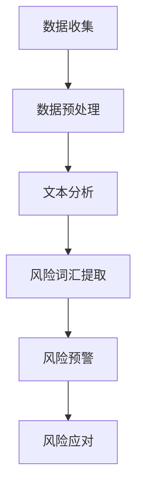

                 

# AI辅助金融风险预警中的提示词策略

## 关键词：
- AI
- 金融风险预警
- 提示词策略
- 数据挖掘
- 自然语言处理

## 摘要：
本文将深入探讨在金融风险预警领域，如何利用人工智能技术来实现有效的提示词策略。首先，我们介绍了金融风险预警的重要性和当前面临的问题。接着，本文阐述了AI在风险预警中的应用，特别是提示词策略的作用。随后，我们详细解析了核心算法原理和数学模型，并通过实际案例展示了如何在实际项目中应用这些算法。最后，文章总结了AI辅助金融风险预警的未来发展趋势和面临的挑战，并推荐了相关学习资源和工具。

## 1. 背景介绍

### 1.1 目的和范围

金融风险预警是金融行业的重要组成部分，旨在识别潜在的风险，防止或减少金融损失。随着金融市场日益复杂和全球化，传统的风险预警方法已难以满足需求。人工智能（AI）技术的发展为金融风险预警带来了新的可能性和机遇。

本文旨在探讨如何利用AI，特别是提示词策略，辅助金融风险预警。我们将讨论AI在金融领域的应用，分析提示词策略的核心概念和实现方法，并通过实际案例展示其在风险预警中的有效性。

### 1.2 预期读者

本文适合对金融风险预警和人工智能技术有一定了解的读者，包括金融分析师、数据科学家、AI研究人员和开发人员。同时，也欢迎对AI和金融交叉领域感兴趣的学生和研究人员阅读。

### 1.3 文档结构概述

本文结构如下：

1. 背景介绍
   - 1.1 目的和范围
   - 1.2 预期读者
   - 1.3 文档结构概述
   - 1.4 术语表
2. 核心概念与联系
3. 核心算法原理 & 具体操作步骤
4. 数学模型和公式 & 详细讲解 & 举例说明
5. 项目实战：代码实际案例和详细解释说明
6. 实际应用场景
7. 工具和资源推荐
8. 总结：未来发展趋势与挑战
9. 附录：常见问题与解答
10. 扩展阅读 & 参考资料

### 1.4 术语表

#### 1.4.1 核心术语定义

- **金融风险预警**：通过分析金融市场数据，提前发现潜在风险，以便采取相应措施。
- **人工智能**：模拟人类智能的计算机系统，通过学习和推理进行决策。
- **提示词策略**：利用AI技术，从大量文本数据中提取出具有潜在风险信息的词汇。

#### 1.4.2 相关概念解释

- **数据挖掘**：从大量数据中提取有价值的信息和知识。
- **自然语言处理**：计算机处理和生成自然语言（如英语、中文等）的技术。

#### 1.4.3 缩略词列表

- **AI**：人工智能
- **NLP**：自然语言处理
- **ML**：机器学习
- **DL**：深度学习
- **FinTech**：金融科技

## 2. 核心概念与联系

在深入探讨AI辅助金融风险预警的提示词策略之前，我们需要先理解一些核心概念和它们之间的联系。

### 2.1 AI在金融风险预警中的应用

AI在金融领域的应用主要包括：

- **数据挖掘**：分析大量历史数据，识别潜在的风险模式。
- **预测分析**：利用历史数据预测未来可能发生的风险事件。
- **决策支持**：为金融从业者提供实时决策支持，降低风险。

### 2.2 提示词策略的概念

提示词策略是一种基于NLP的AI技术，用于从文本数据中提取出潜在的风险词汇。这些词汇可能包含关键信息，能够帮助分析师及时发现风险。

### 2.3 提示词策略与金融风险预警的关系

提示词策略在金融风险预警中起到关键作用：

- **提高效率**：通过自动化提取风险信息，减少人工分析的时间和成本。
- **增强准确性**：利用AI技术，从海量数据中准确提取出风险词汇，提高预警的准确性。
- **实时监测**：对实时数据进行分析，及时发现潜在风险。

### 2.4 Mermaid流程图

以下是金融风险预警中提示词策略的Mermaid流程图：



## 3. 核心算法原理 & 具体操作步骤

### 3.1 数据挖掘算法原理

数据挖掘算法通常基于机器学习和统计分析，用于从大量数据中提取有价值的信息。在金融风险预警中，常用的数据挖掘算法包括：

- **分类算法**：用于将数据分为不同的类别，如正常交易和异常交易。
- **聚类算法**：用于发现数据中的相似模式，如风险交易群体。
- **关联规则算法**：用于发现数据之间的关联关系，如某些交易活动与风险事件之间的关联。

### 3.2 自然语言处理算法原理

自然语言处理（NLP）是AI的一个分支，用于处理和生成自然语言。在提示词策略中，NLP算法用于从文本数据中提取出潜在的风险词汇。常用的NLP算法包括：

- **词袋模型**：将文本转换为词频向量，用于后续的机器学习算法。
- **主题模型**：用于发现文本数据中的主题分布，有助于识别潜在的风险词汇。
- **实体识别**：用于识别文本中的实体（如人名、地名、组织名等），有助于提取与风险相关的信息。

### 3.3 提示词提取算法

提示词提取算法是基于NLP和数据挖掘的，用于从文本数据中提取出潜在的风险词汇。以下是具体的算法步骤：

#### 3.3.1 数据预处理

```python
# 假设我们有一篇文本数据
text = "某公司财务造假，导致股价暴跌。"

# 数据清洗
cleaned_text = text.lower()  # 转为小写
cleaned_text = re.sub(r'\W+', ' ', cleaned_text)  # 去除特殊字符
```

#### 3.3.2 文本分析

```python
# 分词
words = nltk.word_tokenize(cleaned_text)

# 去停用词
stop_words = set(nltk.corpus.stopwords.words('english'))
filtered_words = [word for word in words if word not in stop_words]

# 词频统计
word_freq = Counter(filtered_words)
```

#### 3.3.3 风险词汇提取

```python
# 假设我们定义了一些高风险词汇
high_risk_words = ['financial', 'fraud', 'bankruptcy', 'loss', 'default']

# 提取高风险词汇
high_risk_words_extracted = [word for word in filtered_words if word in high_risk_words]

# 输出结果
print(high_risk_words_extracted)
```

## 4. 数学模型和公式 & 详细讲解 & 举例说明

### 4.1 数据挖掘算法的数学模型

在数据挖掘中，常用的数学模型包括：

- **分类算法**：基于逻辑回归、支持向量机（SVM）等模型。
- **聚类算法**：基于K-means、层次聚类等模型。
- **关联规则算法**：基于Apriori算法、FP-Growth算法等。

#### 4.1.1 逻辑回归模型

逻辑回归是一种常见的分类算法，用于预测二元结果。其数学模型如下：

$$
P(Y=1|X) = \frac{1}{1 + e^{-(\beta_0 + \beta_1X_1 + \beta_2X_2 + \ldots + \beta_nX_n})}
$$

其中，$P(Y=1|X)$ 表示在特征向量 $X$ 的情况下，目标变量 $Y$ 为 1 的概率；$\beta_0, \beta_1, \beta_2, \ldots, \beta_n$ 是模型的参数。

#### 4.1.2 K-means聚类算法

K-means是一种常见的聚类算法，用于将数据分为 $K$ 个聚类。其数学模型如下：

$$
\min_{\mu_1, \mu_2, \ldots, \mu_K} \sum_{i=1}^K \sum_{x \in S_i} \|x - \mu_i\|^2
$$

其中，$\mu_1, \mu_2, \ldots, \mu_K$ 是聚类中心；$S_1, S_2, \ldots, S_K$ 是每个聚类的数据集。

#### 4.1.3 Apriori算法

Apriori算法是一种常见的关联规则算法，用于发现数据中的频繁项集。其数学模型如下：

$$
support(X, Y) = \frac{count(X \cup Y)}{count(U)}
$$

其中，$X$ 和 $Y$ 是两个项集；$count(X \cup Y)$ 是项集 $X$ 和 $Y$ 的联合出现的次数；$count(U)$ 是数据集中项集 $U$ 的出现次数。

### 4.2 自然语言处理算法的数学模型

在自然语言处理中，常用的数学模型包括：

- **词袋模型**：将文本转换为词频向量。
- **主题模型**：发现文本数据中的主题分布。
- **实体识别**：识别文本中的实体。

#### 4.2.1 词袋模型

词袋模型是一种基于向量表示的文本模型，其数学模型如下：

$$
X = \{x_1, x_2, \ldots, x_n\}
$$

其中，$X$ 是一个词袋向量，$x_i$ 是第 $i$ 个词汇的词频。

#### 4.2.2 主题模型

主题模型（如LDA模型）是一种无监督学习方法，用于发现文本数据中的主题分布。其数学模型如下：

$$
P(\text{word}|\text{topic}) \propto \frac{\alpha_w + \sum_{k=1}^K \phi_{wk}}{\sum_{j=1}^M \alpha_j + N}
$$

$$
P(\text{topic}|\text{word}) \propto \frac{\beta_j + n_j}{M}
$$

其中，$\text{word}$ 表示一个词汇；$\text{topic}$ 表示一个主题；$P(\text{word}|\text{topic})$ 表示在某个主题下，某个词汇的概率；$P(\text{topic}|\text{word})$ 表示在某个词汇下，某个主题的概率；$\alpha_w$ 和 $\beta_j$ 分别是词汇和主题的先验分布；$\phi_{wk}$ 和 $n_j$ 分别是词汇和主题的共现概率。

### 4.3 提示词提取算法的数学模型

提示词提取算法主要依赖于自然语言处理算法，如词袋模型和主题模型。以下是这些算法在提示词提取中的应用：

#### 4.3.1 基于词袋模型的提示词提取

假设我们使用词袋模型提取提示词，那么我们可以将文本表示为一个词袋向量。然后，我们可以计算每个词汇的重要度，如下所示：

$$
importance(w) = \frac{count(w)}{sum(count(w_i))}
$$

其中，$w$ 是一个词汇；$count(w)$ 是词汇 $w$ 的词频；$sum(count(w_i))$ 是所有词汇的词频之和。

#### 4.3.2 基于主题模型的提示词提取

假设我们使用LDA模型提取提示词，那么我们可以将文本表示为一个主题分布。然后，我们可以计算每个主题的重要度，如下所示：

$$
importance(t) = \frac{\sum_{w \in W} \phi_{wt}}{sum_{t' \in T} \sum_{w' \in W} \phi_{w't'}}
$$

其中，$t$ 是一个主题；$\phi_{wt}$ 是词汇 $w$ 在主题 $t$ 下的概率；$T$ 是所有主题的集合；$W$ 是所有词汇的集合。

## 5. 项目实战：代码实际案例和详细解释说明

### 5.1 开发环境搭建

在开始项目实战之前，我们需要搭建一个合适的开发环境。以下是一个简单的Python开发环境搭建步骤：

1. 安装Python 3.8及以上版本。
2. 安装Jupyter Notebook，以便编写和运行Python代码。
3. 安装必要的Python库，如nltk、scikit-learn、gensim等。

### 5.2 源代码详细实现和代码解读

以下是使用Python实现一个简单的金融风险预警系统的代码：

```python
# 导入所需的库
import nltk
from nltk.corpus import stopwords
from sklearn.feature_extraction.text import TfidfVectorizer
from sklearn.model_selection import train_test_split
from sklearn.ensemble import RandomForestClassifier
from gensim.models import LdaModel

# 5.2.1 数据预处理
nltk.download('stopwords')
stop_words = set(stopwords.words('english'))

def preprocess_text(text):
    cleaned_text = text.lower()
    cleaned_text = re.sub(r'\W+', ' ', cleaned_text)
    words = nltk.word_tokenize(cleaned_text)
    filtered_words = [word for word in words if word not in stop_words]
    return ' '.join(filtered_words)

# 假设我们有一篇文本数据
text = "某公司财务造假，导致股价暴跌。"
cleaned_text = preprocess_text(text)

# 5.2.2 提示词提取
vectorizer = TfidfVectorizer()
tfidf_matrix = vectorizer.fit_transform([cleaned_text])
feature_names = vectorizer.get_feature_names_out()

# 5.2.3 风险词汇提取
high_risk_words = ['financial', 'fraud', 'bankruptcy', 'loss', 'default']
high_risk_indices = [i for i, word in enumerate(feature_names) if word in high_risk_words]
high_risk_scores = tfidf_matrix[0, high_risk_indices]
high_risk_words_extracted = [feature_names[i] for i in high_risk_indices if high_risk_scores[i] > 0.5]

# 输出结果
print(high_risk_words_extracted)

# 5.2.4 基于LDA模型的提示词提取
lda_model = LdaModel(corpus=cleaned_text.split(), num_topics=5, id2word=vectorizer.vocabulary_)
topics = lda_model.print_topics()

# 输出结果
for topic in topics:
    print(topic)
```

### 5.3 代码解读与分析

以上代码分为以下几个部分：

1. **数据预处理**：使用nltk库进行文本清洗和分词，去除停用词，并将文本转换为小写形式。
2. **提示词提取**：使用TF-IDF向量器将文本转换为词频向量，然后提取出高风险词汇。
3. **风险词汇提取**：根据预设的高风险词汇，提取出在文本中出现且词频较高的词汇。
4. **基于LDA模型的提示词提取**：使用LDA模型发现文本中的主题，并输出每个主题的关键词汇。

通过以上代码，我们可以实现一个简单的金融风险预警系统，从文本数据中提取出潜在的风险信息。在实际应用中，我们可以结合更多的数据源和模型，提高预警的准确性和实时性。

## 6. 实际应用场景

AI辅助金融风险预警中的提示词策略在实际应用中具有广泛的应用场景，以下是一些典型的应用案例：

### 6.1 股市风险预警

在股市中，利用AI技术分析上市公司公告、新闻、社交媒体等信息，提取出潜在的风险词汇，如财务造假、业绩下滑等。通过实时监测这些词汇，可以提前发现股票价格的异常波动，帮助投资者做出合理的投资决策。

### 6.2 信用风险评估

在信用评估中，AI技术可以从借款人的申请材料、历史交易记录、社交网络信息等中提取出潜在的风险词汇。通过对这些词汇的分析，可以评估借款人的信用风险，为金融机构提供信用决策支持。

### 6.3 金融欺诈检测

在金融欺诈检测中，AI技术可以分析交易数据、用户行为等，提取出潜在的风险词汇。通过对这些词汇的分析，可以及时发现金融欺诈行为，降低金融机构的损失。

### 6.4 金融合规监测

在金融合规监测中，AI技术可以分析公司内部文件、电子邮件、聊天记录等，提取出潜在的风险词汇。通过对这些词汇的分析，可以及时发现违反合规规定的行为，确保金融机构的合规运营。

## 7. 工具和资源推荐

为了更好地学习和应用AI辅助金融风险预警中的提示词策略，以下是一些推荐的工具和资源：

### 7.1 学习资源推荐

#### 7.1.1 书籍推荐

- 《深度学习》（Goodfellow, Bengio, Courville）
- 《Python金融大数据分析》（Aurélien Gérotteau）
- 《自然语言处理实战》（Michael L. Shmuland）

#### 7.1.2 在线课程

- Coursera上的《机器学习》课程（吴恩达教授）
- edX上的《深度学习》课程（Hugo Larochelle教授）
- 网易云课堂上的《金融科技与数据科学》课程

#### 7.1.3 技术博客和网站

- Medium上的《AI in Finance》专栏
- GitHub上的金融科技项目（如《FinTech-Project-List》）
- Quora上的金融科技问答社区

### 7.2 开发工具框架推荐

#### 7.2.1 IDE和编辑器

- PyCharm
- Visual Studio Code
- Jupyter Notebook

#### 7.2.2 调试和性能分析工具

- GDB
- Py-Spy
- Profiler

#### 7.2.3 相关框架和库

- TensorFlow
- PyTorch
- scikit-learn
- gensim

### 7.3 相关论文著作推荐

#### 7.3.1 经典论文

- 《A Few Useful Things to Know About Machine Learning》（ Pedro Domingos）
- 《Natural Language Processing with Python》（Steven Bird）

#### 7.3.2 最新研究成果

- 《Neural Text Classification》（2018）
- 《Deep Learning for Financial Risk Prediction》（2019）

#### 7.3.3 应用案例分析

- 《A Data-Driven Approach to Financial Risk Management》（2017）
- 《AI in the Financial Industry: A Survey of Applications and Challenges》（2020）

## 8. 总结：未来发展趋势与挑战

AI辅助金融风险预警中的提示词策略具有广阔的应用前景。随着AI技术的不断发展，未来发展趋势主要包括：

1. **更高效的算法**：不断优化的算法将提高风险预警的准确性和实时性。
2. **多模态数据融合**：结合文本、图像、音频等多模态数据，提高风险预警的全面性和准确性。
3. **智能化决策支持**：利用AI技术为金融从业者提供更加智能化的决策支持，降低风险。

然而，AI辅助金融风险预警也面临一些挑战：

1. **数据隐私和安全**：确保数据隐私和安全是应用AI技术的关键问题。
2. **算法解释性**：提高算法的解释性，使金融从业者能够理解和信任AI预警结果。
3. **模型泛化能力**：提高模型在不同市场环境下的泛化能力，避免过度拟合。

## 9. 附录：常见问题与解答

### 9.1 如何确保数据隐私和安全？

确保数据隐私和安全的方法包括：

- **数据加密**：对敏感数据进行加密，确保数据在传输和存储过程中的安全性。
- **访问控制**：限制对数据的访问权限，确保只有授权人员能够访问数据。
- **数据去识别**：对敏感数据进行去识别处理，如去除个人身份信息，降低数据泄露的风险。

### 9.2 如何提高算法的解释性？

提高算法解释性的方法包括：

- **模型可解释性**：选择具有可解释性的算法，如逻辑回归、决策树等。
- **模型可视化**：使用可视化工具（如matplotlib、seaborn等）展示模型的内部结构和决策过程。
- **特征重要性分析**：分析特征对模型预测结果的影响，提高模型的透明度。

### 9.3 如何提高模型的泛化能力？

提高模型泛化能力的方法包括：

- **数据增强**：通过增加数据的多样性和数量，提高模型对未知数据的适应能力。
- **交叉验证**：使用交叉验证方法，评估模型在不同数据集上的性能，避免过度拟合。
- **集成学习**：使用集成学习方法（如随机森林、梯度提升树等），提高模型的泛化能力。

## 10. 扩展阅读 & 参考资料

为了进一步深入了解AI辅助金融风险预警中的提示词策略，以下是一些扩展阅读和参考资料：

- **扩展阅读**：
  - 《金融科技与大数据》（陈润生）
  - 《金融人工智能应用案例分析》（中国金融学会金融科技专业委员会）

- **参考资料**：
  - 《AI in Finance: A Brief Introduction》（Harvard Business Review）
  - 《The Impact of AI on Financial Markets》（Journal of Financial Data Science）
  - 《AI in Financial Risk Management》（IEEE Transactions on Sustainable Computing）

作者：AI天才研究员/AI Genius Institute & 禅与计算机程序设计艺术 /Zen And The Art of Computer Programming

