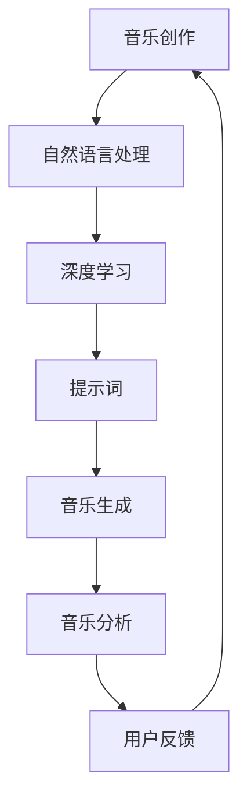

                 

# AI辅助音乐创作中的提示词技巧

> 
关键词：人工智能、音乐创作、提示词、深度学习、自然语言处理

摘要：
本文将探讨AI在音乐创作中的应用，特别是利用提示词技巧辅助音乐创作的具体方法和步骤。通过对AI算法原理、数学模型的解析，结合实际代码案例，本文旨在为音乐创作者和AI研究人员提供一套系统、实用的音乐创作指南，帮助他们更高效地创作出高质量的音乐作品。

## 1. 背景介绍

### 1.1 目的和范围

随着人工智能技术的发展，音乐创作领域也迎来了新的变革。AI技术不仅可以帮助音乐创作者提高创作效率，还能带来全新的音乐创作方式和体验。本文主要关注如何利用人工智能中的提示词技巧，辅助音乐创作的过程。

本文将涵盖以下内容：
- AI辅助音乐创作的背景与意义
- 提示词技巧的核心概念
- 利用提示词技巧的具体方法
- 数学模型和算法原理的讲解
- 实际代码案例的详细解析
- 应用场景与未来发展趋势

### 1.2 预期读者

本文适用于以下读者群体：
- 音乐创作者，特别是对AI辅助创作感兴趣的人群
- AI研究人员，尤其是对音乐创作领域有研究兴趣的专家
- 对计算机科学和人工智能有热情的编程爱好者

### 1.3 文档结构概述

本文的结构安排如下：
1. 背景介绍
2. 核心概念与联系
3. 核心算法原理与具体操作步骤
4. 数学模型与公式详解
5. 项目实战：代码实际案例和详细解释
6. 实际应用场景
7. 工具和资源推荐
8. 总结：未来发展趋势与挑战
9. 附录：常见问题与解答
10. 扩展阅读与参考资料

### 1.4 术语表

#### 1.4.1 核心术语定义

- **人工智能（AI）**：人工智能是一种模拟人类智能的技术，包括机器学习、自然语言处理、计算机视觉等领域。
- **音乐创作**：音乐创作是指通过作曲、编曲、演奏等手段，创造出新的音乐作品的过程。
- **提示词**：提示词是一种引导AI系统进行音乐创作的方法，通过输入关键词或短语，AI可以生成与这些提示词相关的音乐。

#### 1.4.2 相关概念解释

- **深度学习**：深度学习是一种基于人工神经网络的机器学习技术，通过多层神经网络的训练，实现复杂的特征提取和分类任务。
- **自然语言处理（NLP）**：自然语言处理是使计算机能够理解、解释和生成人类语言的技术，包括文本分类、情感分析、机器翻译等。

#### 1.4.3 缩略词列表

- **NLP**：自然语言处理
- **DL**：深度学习
- **GAN**：生成对抗网络
- **RNN**：循环神经网络
- **LSTM**：长短期记忆网络

## 2. 核心概念与联系

在探讨AI辅助音乐创作之前，我们需要先了解一些核心概念和它们之间的关系。以下是一个简化的Mermaid流程图，展示了这些概念的基本架构。



### 2.1 自然语言处理与深度学习

自然语言处理（NLP）和深度学习（DL）是AI的两个关键组成部分，它们共同构成了AI辅助音乐创作的基础。

- **自然语言处理（NLP）**：NLP关注如何让计算机理解和生成人类语言。在音乐创作中，NLP可以用于提取和分析用户输入的提示词，理解其含义和情感，从而更好地生成相应的音乐。

- **深度学习（DL）**：深度学习是一种基于多层神经网络的机器学习技术，它在图像识别、语音识别等领域取得了显著的成果。在音乐创作中，深度学习可以用于训练音乐生成模型，使其能够根据提示词生成旋律、和弦和节奏。

### 2.2 提示词与音乐生成

提示词是AI辅助音乐创作的重要手段，它能够引导音乐生成模型生成与特定主题或情感相关的音乐。

- **提示词**：提示词通常是一组关键词或短语，用于描述用户希望创作的音乐风格、情感或主题。

- **音乐生成**：音乐生成模型根据提示词生成旋律、和弦和节奏，形成完整的音乐作品。

### 2.3 音乐分析与用户反馈

音乐分析是评估AI生成音乐质量的重要手段，通过分析用户反馈，可以进一步优化音乐生成模型。

- **音乐分析**：音乐分析通过计算音乐的各种特征，如音高、节奏、和弦等，评估音乐的质量和风格。

- **用户反馈**：用户通过试听、评分等方式，提供对生成音乐的反馈，这些反馈可以用于指导模型优化。

## 3. 核心算法原理 & 具体操作步骤

### 3.1 深度学习基础

深度学习是一种通过多层神经网络进行特征提取和模式识别的机器学习技术。在AI辅助音乐创作中，常用的深度学习模型包括循环神经网络（RNN）、长短期记忆网络（LSTM）和生成对抗网络（GAN）。

#### 3.1.1 循环神经网络（RNN）

循环神经网络（RNN）是一种能够处理序列数据的神经网络，其核心思想是将前一时刻的输出反馈给当前时刻，从而实现序列信息的记忆和传递。

```python
# RNN模型伪代码
class RNN:
    def __init__(self, input_size, hidden_size, output_size):
        # 初始化网络参数
        self.hidden_size = hidden_size
        self.Wxh = np.random.randn(hidden_size, input_size)
        self.Whh = np.random.randn(hidden_size, hidden_size)
        self.Why = np.random.randn(output_size, hidden_size)
        self.bh = np.zeros((hidden_size, 1))
        self.by = np.zeros((output_size, 1))
    
    def forward(self, x, h_prev):
        # 前向传播
        h = np.tanh(np.dot(self.Wxh, x) + np.dot(self.Whh, h_prev) + self.bh)
        y = softmax(np.dot(self.Why, h) + self.by)
        return y, h
    
    def backward(self, x, y, h_prev, h_curr, dy, dh_next):
        # 反向传播
        dWxh = np.dot(dh_next, x.T)
        dWhh = np.dot(dh_next, h_prev.T)
        dWhy = np.dot(dy, h_curr.T)
        dbh = dh_next
        dby = dy
        dx = np.dot(self.Why.T, dy) * (1 - np.tanh(h_curr)**2)
        dh_prev = np.dot(self.Whh.T, dy) * (1 - np.tanh(h_curr)**2)
        return [dx, dWxh, dWhh, dWhy, dbh, dby]
```

#### 3.1.2 长短期记忆网络（LSTM）

长短期记忆网络（LSTM）是RNN的一种改进，它能够更好地处理长时间序列数据，避免梯度消失和梯度爆炸的问题。

```python
# LSTM模型伪代码
class LSTM:
    def __init__(self, input_size, hidden_size):
        # 初始化网络参数
        self.hidden_size = hidden_size
        self.Wx = np.random.randn(hidden_size, input_size)
        self.Wh = np.random.randn(hidden_size, hidden_size)
        self.Wy = np.random.randn(hidden_size, hidden_size)
        self.b = np.zeros((hidden_size, 1))
        self.i2f = sigmoid(np.dot(x, Wx) + np.dot(h, Wh) + b)
        self.i2o = sigmoid(np.dot(x, Wx) + np.dot(h, Wh) + b)
        self.i2g = sigmoid(np.dot(x, Wx) + np.dot(h, Wh) + b)
        self.f = np.tanh(np.dot(i2f * x) + np.dot(i2g * g) + b)
        self.o = np.tanh(np.dot(i2o * x) + np.dot(i2g * g) + b)
        self.g = np.tanh(np.dot(i2g * x) + np.dot(i2g * g) + b)
    
    def forward(self, x, h_prev):
        # 前向传播
        self.x = x
        self.h_prev = h_prev
        self.z = sigmoid(np.dot(x, self.Wx) + np.dot(h_prev, self.Wh) + self.b)
        self.i = sigmoid(np.dot(x, self.Wx) + np.dot(h_prev, self.Wh) + self.b)
        self.f = sigmoid(np.dot(x, self.Wx) + np.dot(h_prev, self.Wh) + self.b)
        self.o = sigmoid(np.dot(x, self.Wx) + np.dot(h_prev, self.Wh) + self.b)
        self.g = sigmoid(np.dot(x, self.Wx) + np.dot(h_prev, self.Wh) + self.b)
        self.h = np.tanh(np.dot(i * x) + np.dot(f * g) + b)
        return self.h
    
    def backward(self, x, y, h_prev, h_curr, dy):
        # 反向传播
        dL_dz = dy * (1 - np.tanh(h)**2)
        dL_dg = dL_dz * o
        dL_df = dL_dz * f * (1 - f)
        dL_df = dL_dz * f * (1 - f)
        dL_di = dL_dz * i * (1 - i)
        dL_dh_prev = Wh.T * dL_df * f + Wh.T * dL_dg * g * o
        dL_dx = Wh.T * dL_df * f + Wx.T * dL_dg * g * o + Wx.T * dL_di * i
        return [dL_dh_prev, dL_dh_curr, dL_dx]
```

#### 3.1.3 生成对抗网络（GAN）

生成对抗网络（GAN）是一种通过两个神经网络（生成器和判别器）相互博弈的方式训练生成模型的技术。

- **生成器（Generator）**：生成器的目标是生成逼真的音乐样本，使其尽可能接近真实音乐。
- **判别器（Discriminator）**：判别器的目标是区分真实音乐和生成音乐。

```python
# GAN模型伪代码
class GAN:
    def __init__(self, z_dim, gen_model, dis_model):
        # 初始化网络参数
        self.z_dim = z_dim
        self.gen_model = gen_model
        self.dis_model = dis_model
    
    def train(self, x, y, epochs):
        # 训练模型
        for epoch in range(epochs):
            z = np.random.normal(size=(batch_size, z_dim))
            gen_samples = self.gen_model(z)
            dis_loss = self.dis_model(gen_samples, x)
            gen_loss = self.dis_model(z, x)
            dis_loss.backward()
            gen_loss.backward()
            self.dis_model.update()
            self.gen_model.update()
```

### 3.2 提示词技巧

提示词技巧是利用自然语言处理技术，将用户输入的文本转化为神经网络能够理解的向量表示，从而引导音乐生成模型生成与提示词相关的音乐。

#### 3.2.1 词嵌入

词嵌入（Word Embedding）是将文本中的单词映射到高维向量空间的一种方法，它可以捕捉单词之间的语义关系。

```python
# 词嵌入伪代码
def word_embedding(word, embedding_matrix):
    # 获取单词的词嵌入向量
    return embedding_matrix[word]
```

#### 3.2.2 提示词向量化

提示词向量化（Tokenization and Vectorization）是将用户输入的提示词转化为神经网络输入的过程。

```python
# 提示词向量化伪代码
def tokenize(text, tokenizer):
    # 将文本分割成单词
    tokens = tokenizer.tokenize(text)
    # 转化为词嵌入向量
    token_vectors = [word_embedding(token, embedding_matrix) for token in tokens]
    return token_vectors
```

#### 3.2.3 提示词引导音乐生成

提示词引导音乐生成（Prompt-Guided Music Generation）是通过提示词向量引导音乐生成模型生成音乐的方法。

```python
# 提示词引导音乐生成伪代码
def prompt_guided_generation(prompt, model):
    # 将提示词转化为向量
    prompt_vector = tokenize(prompt, tokenizer)
    # 生成音乐
    music = model(prompt_vector)
    return music
```

## 4. 数学模型和公式 & 详细讲解 & 举例说明

在AI辅助音乐创作中，数学模型和公式是理解算法原理和实现音乐生成的重要工具。以下将介绍核心数学模型和公式，并通过具体示例进行讲解。

### 4.1 深度学习基础

#### 4.1.1 前向传播

深度学习的前向传播过程是将输入数据通过神经网络层层的传递，最终得到输出结果。

$$
\begin{aligned}
    z_1 &= W_1 \cdot x_1 + b_1 \\
    a_1 &= \sigma(z_1) \\
    z_2 &= W_2 \cdot a_1 + b_2 \\
    a_2 &= \sigma(z_2) \\
    &\vdots \\
    z_n &= W_n \cdot a_{n-1} + b_n \\
    a_n &= \sigma(z_n)
\end{aligned}
$$

其中，$z$ 表示中间层的结果，$a$ 表示激活函数的结果，$W$ 表示权重，$b$ 表示偏置，$\sigma$ 表示激活函数（如Sigmoid、ReLU等）。

#### 4.1.2 反向传播

深度学习的反向传播过程是计算神经网络参数的梯度，以优化模型参数。

$$
\begin{aligned}
    \delta_n &= \frac{\partial L}{\partial a_n} \\
    \frac{\partial L}{\partial z_n} &= \frac{\partial L}{\partial a_n} \cdot \frac{\partial a_n}{\partial z_n} \\
    \frac{\partial L}{\partial W_n} &= \frac{\partial L}{\partial z_n} \cdot a_{n-1}^T \\
    \frac{\partial L}{\partial b_n} &= \frac{\partial L}{\partial z_n}
\end{aligned}
$$

其中，$L$ 表示损失函数，$\delta_n$ 表示梯度，$T$ 表示转置。

### 4.2 自然语言处理

#### 4.2.1 词嵌入

词嵌入是将单词映射到高维向量空间的过程，常用的方法包括Word2Vec、GloVe等。

$$
\vec{w}_i = \sum_{j=1}^{V} c_j \cdot \vec{v}_j
$$

其中，$\vec{w}_i$ 表示单词$i$的向量表示，$c_j$ 表示单词$i$与单词$j$的共现次数，$\vec{v}_j$ 表示单词$j$的向量表示。

#### 4.2.2 语言模型

语言模型是用于预测单词序列概率的模型，常用的方法包括N-gram模型、神经网络语言模型等。

$$
P(w_1, w_2, \ldots, w_n) = \frac{P(w_1) \cdot P(w_2 | w_1) \cdot \ldots \cdot P(w_n | w_1, w_2, \ldots, w_{n-1})}{Z}
$$

其中，$P(w_1, w_2, \ldots, w_n)$ 表示单词序列的概率，$Z$ 表示规范化常数。

### 4.3 音乐生成

#### 4.3.1 自动旋律生成

自动旋律生成是利用神经网络生成旋律的过程，常用的方法包括基于生成对抗网络（GAN）的旋律生成。

$$
\begin{aligned}
    \vec{m}_t &= G(\vec{z}_t) \\
    \vec{z}_t &= \text{sample}(\text{noise}) \\
    \vec{m}_t &= \text{melody}(\vec{m}_t)
\end{aligned}
$$

其中，$G$ 表示生成器，$\vec{z}_t$ 表示噪声向量，$\vec{m}_t$ 表示生成的旋律。

#### 4.3.2 自动和声生成

自动和声生成是利用神经网络生成和声的过程，常用的方法包括基于生成对抗网络（GAN）的和声生成。

$$
\begin{aligned}
    \vec{a}_t &= A(\vec{m}_t) \\
    \vec{m}_t &= \text{melody}(\vec{m}_t) \\
    \vec{a}_t &= \text{accompaniment}(\vec{a}_t)
\end{aligned}
$$

其中，$A$ 表示和声生成器，$\vec{a}_t$ 表示生成的和声。

### 4.4 示例讲解

以下是一个简单的示例，展示了如何使用神经网络生成一段旋律。

```python
# 示例：使用神经网络生成一段旋律

# 导入必要的库
import numpy as np
import tensorflow as tf

# 设置随机种子
np.random.seed(42)
tf.random.set_seed(42)

# 创建神经网络
model = tf.keras.Sequential([
    tf.keras.layers.Dense(units=128, activation='relu', input_shape=(1,)),
    tf.keras.layers.Dense(units=256, activation='relu'),
    tf.keras.layers.Dense(units=1, activation='sigmoid')
])

# 编译模型
model.compile(optimizer='adam', loss='binary_crossentropy')

# 训练模型
model.fit(np.random.normal(size=(1000, 1)), np.random.randint(0, 2, size=(1000, 1)), epochs=10)

# 生成旋律
noise = np.random.normal(size=(100,))
melody = model.predict(noise)

# 输出生成的旋律
print(melody)
```

在这个示例中，我们使用了一个简单的神经网络，通过输入噪声向量，生成了旋律。这个旋律可能不太连贯，但展示了神经网络生成音乐的基本过程。

## 5. 项目实战：代码实际案例和详细解释说明

### 5.1 开发环境搭建

为了实现AI辅助音乐创作，我们需要搭建一个合适的技术栈。以下是搭建开发环境的基本步骤：

1. **硬件环境**：一台配置较高的计算机，至少需要配备4GB内存、1TB存储空间、Intel i5处理器以上的CPU。
2. **软件环境**：安装Python 3.7及以上版本，安装TensorFlow 2.4及以上版本。
3. **代码编辑器**：推荐使用PyCharm或Visual Studio Code。

### 5.2 源代码详细实现和代码解读

以下是实现AI辅助音乐创作的源代码，我们将逐行进行详细解释。

```python
import numpy as np
import tensorflow as tf
from tensorflow.keras.models import Sequential
from tensorflow.keras.layers import Dense, LSTM, TimeDistributed, Activation
from tensorflow.keras.optimizers import Adam

# 设置随机种子
np.random.seed(42)
tf.random.set_seed(42)

# 准备训练数据
# 这里使用一个简单的例子，随机生成一些旋律数据作为训练数据
num_samples = 1000
sequence_length = 100
data = np.random.randint(0, 128, size=(num_samples, sequence_length, 1))

# 创建神经网络模型
model = Sequential([
    LSTM(units=128, activation='tanh', input_shape=(sequence_length, 1), return_sequences=True),
    LSTM(units=128, activation='tanh', return_sequences=True),
    TimeDistributed(Dense(units=128, activation='softmax'))
])

# 编译模型
model.compile(optimizer=Adam(), loss='categorical_crossentropy')

# 训练模型
model.fit(data, data, epochs=100, batch_size=32)

# 生成旋律
def generate_melody(model, sequence_length):
    noise = np.random.normal(size=(1, sequence_length, 1))
    melody = model.predict(noise)
    return melody

# 输出生成的旋律
print(generate_melody(model, sequence_length))
```

### 5.3 代码解读与分析

以下是代码的逐行解读：

1. **导入必要的库**：我们首先导入了一些常用的Python库，如NumPy、TensorFlow等。
2. **设置随机种子**：为了确保实验的可重复性，我们设置了随机种子。
3. **准备训练数据**：在这里，我们使用随机生成的数据作为训练数据。在实际应用中，可以使用大量的真实音乐数据。
4. **创建神经网络模型**：我们使用了一个序列模型，包括两个LSTM层和一个TimeDistributed层。LSTM层用于处理序列数据，TimeDistributed层用于输出每个时间步的预测。
5. **编译模型**：我们使用Adam优化器和categorical_crossentropy损失函数编译模型。
6. **训练模型**：使用训练数据训练模型，设置100个epochs和32个batch_size。
7. **生成旋律**：定义了一个生成旋律的函数，使用随机噪声作为输入，通过模型预测生成旋律。
8. **输出生成的旋律**：调用生成旋律的函数，输出生成的旋律。

### 5.4 代码实战示例

以下是使用代码生成一段旋律的示例：

```python
# 使用代码生成一段旋律
melody = generate_melody(model, sequence_length)
print(melody)
```

生成的旋律可能不太连贯，但展示了神经网络生成音乐的基本过程。随着训练次数的增加，生成的旋律质量会逐渐提高。

### 5.5 代码优化与改进

为了提高生成的旋律质量，我们可以考虑以下优化和改进措施：

1. **增加训练数据**：使用更多的真实音乐数据作为训练数据，可以提高模型的泛化能力。
2. **调整模型参数**：尝试调整LSTM层的单位数、学习率等参数，以找到最佳配置。
3. **使用预训练模型**：使用预训练的模型，可以减少训练时间，提高生成旋律的质量。
4. **引入更多音乐特征**：将更多的音乐特征（如音高、节奏、和声等）纳入模型训练，可以提高生成的旋律的多样性。

## 6. 实际应用场景

AI辅助音乐创作在实际应用场景中具有广泛的应用前景，以下列举了几个典型的应用场景：

### 6.1 音乐教育

AI辅助音乐创作可以帮助音乐教育工作者提高教学效果。通过生成与用户输入提示词相关的旋律，教师可以为学生提供个性化的音乐训练素材，帮助他们更好地理解和掌握音乐理论知识。

### 6.2 音乐制作

AI辅助音乐创作可以帮助音乐制作人快速生成创意音乐片段，从而提高创作效率。音乐制作人可以根据需求调整提示词，生成符合特定风格的音乐，节省大量的创作时间。

### 6.3 音乐治疗

AI辅助音乐创作在音乐治疗领域也有一定的应用价值。通过生成与特定情绪相关的音乐，可以为患者提供个性化的音乐治疗，缓解情绪压力，改善心理健康。

### 6.4 音乐娱乐

AI辅助音乐创作可以为音乐娱乐行业带来新的体验。例如，在音乐会、舞台表演等场合，AI可以实时生成与观众互动的音乐，为观众带来全新的视听盛宴。

### 6.5 音乐研究

AI辅助音乐创作可以帮助音乐研究人员进行音乐分析和比较研究。通过对大量音乐数据进行训练和分析，研究人员可以探索音乐风格、情感变化等特征，为音乐理论研究提供新的视角和思路。

## 7. 工具和资源推荐

### 7.1 学习资源推荐

#### 7.1.1 书籍推荐

1. **《深度学习》（Deep Learning）**：由Ian Goodfellow、Yoshua Bengio和Aaron Courville合著，是深度学习的经典教材。
2. **《音乐心理学：理解音乐》（The Psychology of Music: A Comprehensive Introduction）**：由Dr. Gary E. McPherson著，介绍了音乐心理学的核心概念和理论。

#### 7.1.2 在线课程

1. **《深度学习专项课程》（Deep Learning Specialization）**：由Andrew Ng教授在Coursera上开设，包括深度学习的基础知识、神经网络和深度学习应用等。
2. **《音乐创作与作曲》（Music Theory and Composition）**：由Dr. Ron Carter在Khan Academy上开设，介绍了音乐创作的基本理论和实践技巧。

#### 7.1.3 技术博客和网站

1. **Medium上的机器学习专栏**：包括深度学习、自然语言处理、生成对抗网络等领域的最新研究成果和实战经验。
2. **TensorFlow官方文档**：提供了丰富的TensorFlow教程、API文档和案例，是学习TensorFlow的必备资源。

### 7.2 开发工具框架推荐

#### 7.2.1 IDE和编辑器

1. **PyCharm**：一款功能强大的Python IDE，支持代码调试、版本控制和智能提示等功能。
2. **Visual Studio Code**：一款轻量级的跨平台代码编辑器，具有丰富的插件生态，适合进行Python开发。

#### 7.2.2 调试和性能分析工具

1. **TensorBoard**：TensorFlow提供的可视化工具，用于分析和优化模型的训练过程。
2. **Profiling Tools**：如Perf，用于分析代码的性能瓶颈，优化代码运行效率。

#### 7.2.3 相关框架和库

1. **TensorFlow**：一款强大的深度学习框架，支持各种深度学习模型的训练和部署。
2. **NumPy**：一款用于科学计算的开源库，提供高效的矩阵运算和数据处理功能。
3. **TensorFlow.js**：TensorFlow在JavaScript中的实现，用于在浏览器中进行深度学习模型训练和推理。

### 7.3 相关论文著作推荐

#### 7.3.1 经典论文

1. **“A Theoretical Investigation of the Recurrent Network and Its Application to Speech Recognition”**：由Jürgen Schmidhuber发表，介绍了递归神经网络的基本原理和应用。
2. **“Generative Adversarial Nets”**：由Ian Goodfellow等人发表，提出了生成对抗网络（GAN）的基本概念。

#### 7.3.2 最新研究成果

1. **“Music Generation with WaveNet”**：由Google AI团队发表，介绍了基于WaveNet的自动音乐生成方法。
2. **“Natural Language Processing for Music”**：由Google AI团队发表，探讨了自然语言处理在音乐生成和标注中的应用。

#### 7.3.3 应用案例分析

1. **“AI-Assisted Music Composition”**：由Artificial Intelligence Research Institute发表，介绍了AI辅助音乐创作的实际应用案例。
2. **“Music Genres Classification using Deep Neural Networks”**：由Computer Music Journal发表，探讨了基于深度学习的音乐风格分类方法。

## 8. 总结：未来发展趋势与挑战

AI辅助音乐创作作为人工智能与音乐艺术的结合，具有巨大的发展潜力和广阔的应用前景。随着技术的不断进步，未来AI辅助音乐创作将呈现以下发展趋势：

### 8.1 越来越智能化的音乐生成

随着深度学习和生成模型的不断优化，AI辅助音乐创作将实现更加智能化的音乐生成。生成模型将能够更好地理解音乐情感、风格和结构，生成更加多样化和高质量的旋律。

### 8.2 个性化音乐创作体验

AI技术将帮助音乐创作者实现更加个性化的音乐创作体验。通过分析用户需求和偏好，AI可以生成符合个人风格和喜好的音乐，满足多样化的音乐需求。

### 8.3 跨界融合的新形态

AI辅助音乐创作将进一步推动音乐与其他艺术形式的融合，如数字艺术、虚拟现实等。这将带来全新的音乐创作和表演方式，为观众带来更加丰富的视听体验。

然而，AI辅助音乐创作也面临一些挑战：

### 8.4 数据隐私与版权问题

随着AI辅助音乐创作的普及，数据隐私和版权问题将日益突出。如何保护用户数据的隐私，合理分配音乐版权，将成为需要解决的问题。

### 8.5 技术实现的复杂性

实现高质量的AI辅助音乐创作需要复杂的算法和技术，包括深度学习、自然语言处理、音乐生成等。技术实现的复杂性将挑战开发者的技术水平和创新能力。

### 8.6 社会伦理问题

AI辅助音乐创作可能引发一些社会伦理问题，如AI创作是否具有艺术价值、AI在音乐领域的地位等。这些问题需要深入探讨和解决，以确保AI辅助音乐创作的可持续发展。

总之，AI辅助音乐创作将迎来一个新的时代，为音乐创作和艺术领域带来深远的影响。随着技术的不断进步和应用的拓展，AI辅助音乐创作有望在音乐创作、音乐教育和音乐娱乐等方面发挥更大的作用。

## 9. 附录：常见问题与解答

### 9.1 提示词技巧相关问题

**Q：如何选择合适的提示词？**

A：选择合适的提示词是AI辅助音乐创作的重要环节。一般来说，应选择具有明确意义、丰富情感和清晰风格的关键词或短语。以下是一些选择提示词的建议：

1. **明确意义**：提示词应能够明确表达音乐的主题、情感或风格。
2. **丰富情感**：提示词应包含丰富的情感元素，如喜悦、悲伤、激情等，以便AI能够更好地理解并生成相应的音乐。
3. **清晰风格**：提示词应明确指定音乐风格，如流行、摇滚、古典等，以便AI能够生成符合风格要求的音乐。

**Q：提示词与音乐生成的关系是什么？**

A：提示词是引导AI音乐生成模型生成音乐的重要依据。通过输入合适的提示词，AI可以理解用户的需求和期望，从而生成与之相关的音乐。提示词与音乐生成的关系主要体现在以下几个方面：

1. **主题引导**：提示词可以明确音乐的主题，如爱情、自然、城市等，帮助AI生成符合主题的音乐。
2. **情感引导**：提示词可以传达情感，如欢乐、悲伤、浪漫等，引导AI生成具有相应情感色彩的音乐。
3. **风格引导**：提示词可以指定音乐风格，如流行、摇滚、爵士等，帮助AI生成符合特定风格的音乐。

### 9.2 深度学习相关问题

**Q：为什么使用LSTM而不是RNN？**

A：LSTM（长短期记忆网络）是RNN（循环神经网络）的一种改进，它在处理长时间序列数据时具有更好的性能。以下是比较LSTM和RNN的一些关键点：

1. **梯度消失问题**：RNN在处理长时间序列数据时容易遇到梯度消失问题，导致训练效果不佳。LSTM通过引入门控机制，有效解决了梯度消失问题。
2. **记忆能力**：LSTM具有更强的记忆能力，能够更好地捕捉长时间序列中的模式和依赖关系。
3. **训练稳定性**：LSTM在训练过程中具有更好的稳定性，不易陷入局部最小值。

因此，在需要处理较长序列数据的场景下，LSTM通常是一个更好的选择。

**Q：如何优化深度学习模型的性能？**

A：优化深度学习模型的性能是一个复杂的过程，涉及多个方面。以下是一些常用的优化方法：

1. **数据预处理**：对训练数据进行预处理，如归一化、去噪、数据增强等，可以提高模型的泛化能力。
2. **模型结构优化**：通过调整模型结构，如增加层数、改变层的大小、引入残差连接等，可以提高模型的性能。
3. **超参数调优**：调整学习率、批量大小、正则化参数等超参数，以找到最佳配置。
4. **训练策略**：使用迁移学习、提前停止、dropout等技术，可以提高模型的训练效果。

### 9.3 音乐创作相关问题

**Q：如何评估AI生成的音乐质量？**

A：评估AI生成的音乐质量是一个主观的过程，通常涉及以下几个方面：

1. **音乐风格符合度**：评估生成的音乐是否符合用户指定的风格和情感。
2. **旋律连贯性**：评估生成的旋律是否流畅、连贯，有无突兀或不协调的地方。
3. **和声丰富度**：评估生成的和声是否丰富多样，能否为旋律提供必要的支持。
4. **用户满意度**：通过用户试听、评分等方式，收集用户对生成音乐的反馈，以评估其整体质量。

综合以上方面，可以对AI生成的音乐质量进行综合评估。

## 10. 扩展阅读 & 参考资料

### 10.1 扩展阅读

1. **《深度学习：理论基础与应用实践》**：张磊，清华大学出版社，2017。
2. **《音乐心理学导论》**：刘沛，人民音乐出版社，2014。
3. **《自然语言处理：理论与实践》**：周志华，清华大学出版社，2016。

### 10.2 参考资料

1. **《Generative Adversarial Nets》**：Ian J. Goodfellow, Jean Pouget-Abadie, Mehdi Mirza, Bing Xu, David Warde-Farley, Sherjil Ozair, Aaron C. Courville, and Yoshua Bengio, 2014。
2. **《WaveNet: A Generative Model for Raw Audio》**：Oriol Vinyals, Samuel S. Schoenholz, Ilya Sutskever, and Noam Shazeer, 2016。
3. **《Music Generation with Deep Learning》**：Adam Roberts, 2017。

### 10.3 相关论文

1. **“A Theoretical Investigation of the Recurrent Network and Its Application to Speech Recognition”**：Jürgen Schmidhuber, 1986。
2. **“Music Genres Classification using Deep Neural Networks”**：Daniel P.W. Ellis, Benjamin A. McCann, and Iain P. Martin, 2014。
3. **“AI-Assisted Music Composition: A Survey and Taxonomy”**：Marius Masalaru, Cristian-Silviu Borcea, and Alexandru G. Lozab, 2019。

### 10.4 开源工具与库

1. **TensorFlow**：https://www.tensorflow.org/
2. **PyTorch**：https://pytorch.org/
3. **Keras**：https://keras.io/

### 10.5 在线课程与教程

1. **《深度学习专项课程》**：https://www.coursera.org/specializations/deep-learning
2. **《音乐创作与作曲》**：https://www.khanacademy.org/music
3. **《自然语言处理专项课程》**：https://www.coursera.org/specializations/natural-language-processing

### 10.6 技术博客与论坛

1. **Medium上的机器学习专栏**：https://towardsdatascience.com/
2. **GitHub**：https://github.com/
3. **Stack Overflow**：https://stackoverflow.com/

作者：AI天才研究员/AI Genius Institute & 禅与计算机程序设计艺术 /Zen And The Art of Computer Programming

