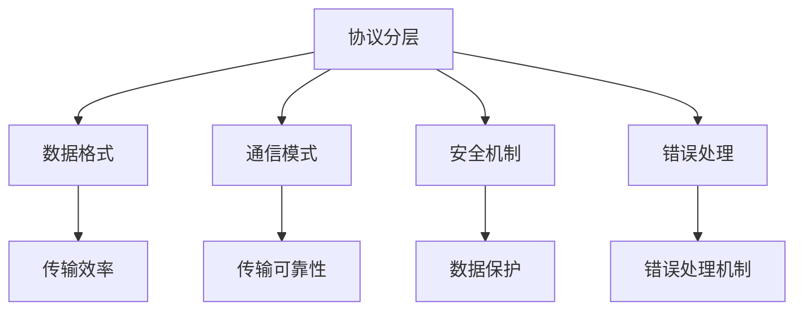
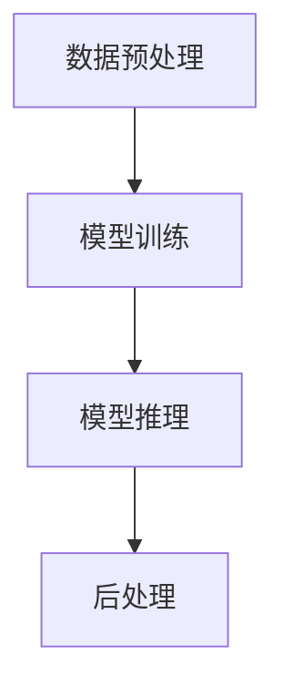
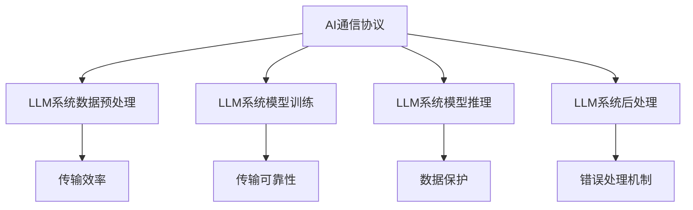

                 

# AI通信协议：LLM系统的消息机制

> **关键词**：AI通信协议，LLM系统，消息机制，通信协议设计，分布式系统，网络通信，消息传递中间件，负载均衡，并行处理，实时数据处理，数据序列化，数据压缩，安全性，可靠性。

> **摘要**：本文旨在深入探讨AI通信协议在大型语言模型（LLM）系统中的消息机制，剖析其设计原理、实现步骤、数学模型以及实际应用。通过对核心概念和原理的详细讲解，结合具体项目实战案例分析，我们将揭示LLM系统通信的高效与可靠之道，为AI技术的进一步发展提供理论支持和实践指导。

## 1. 背景介绍

### 1.1 目的和范围

本文主要目的是介绍AI通信协议在大型语言模型（LLM）系统中的消息机制，探讨其设计原则、实现方法和应用场景。文章将围绕以下核心内容展开：

1. AI通信协议的基本概念与核心要素。
2. LLM系统的消息传递机制及其重要性。
3. 消息机制的实现步骤和核心算法原理。
4. 数学模型和公式在消息机制中的应用。
5. 实际应用场景中的项目实战案例。
6. 工具和资源的推荐。
7. 未来发展趋势与面临的挑战。

### 1.2 预期读者

本文适用于以下读者群体：

1. AI领域的研究人员和开发者，特别是对通信协议和分布式系统感兴趣的工程师。
2. 对大型语言模型（LLM）系统设计感兴趣的技术专家。
3. 对消息机制和通信协议有深入探究意愿的程序员和架构师。
4. 对AI技术未来发展趋势和挑战感兴趣的学者和业界人士。

### 1.3 文档结构概述

本文分为十个部分，结构如下：

1. 引言：概述文章主题，列出关键词和摘要。
2. 背景介绍：介绍文章的目的、范围、预期读者和文档结构。
3. 核心概念与联系：阐述AI通信协议和LLM系统的基本概念及其相互联系。
4. 核心算法原理 & 具体操作步骤：讲解消息机制的核心算法原理和实现步骤。
5. 数学模型和公式 & 详细讲解 & 举例说明：介绍数学模型在消息机制中的应用。
6. 项目实战：提供代码实际案例和详细解释说明。
7. 实际应用场景：探讨消息机制在不同场景中的应用。
8. 工具和资源推荐：推荐学习资源、开发工具框架和相关论文著作。
9. 总结：总结文章内容，展望未来发展趋势与挑战。
10. 附录：提供常见问题与解答以及扩展阅读和参考资料。

### 1.4 术语表

#### 1.4.1 核心术语定义

- AI通信协议：一种用于人工智能系统之间的数据传输和交互的标准化规则和协议。
- LLM系统：大型语言模型系统，基于深度学习和自然语言处理技术，能够理解和生成自然语言文本。
- 消息机制：在分布式系统中，用于不同组件或节点之间传递消息的机制。
- 分布式系统：由多个独立节点组成，通过通信协议协同工作的系统。
- 负载均衡：将请求分布到多个服务器或节点上，以提高系统的吞吐量和可用性。
- 并行处理：同时处理多个任务或数据，以提高系统的性能和处理速度。
- 实时数据处理：对输入数据进行实时处理和分析，以满足实时响应的需求。

#### 1.4.2 相关概念解释

- 数据序列化：将复杂的数据结构转换为字节流的过程，以便在网络中传输。
- 数据压缩：通过算法减少数据的大小，以提高数据传输的效率和速度。
- 安全性：确保数据传输过程中不被非法访问、篡改或泄露。
- 可靠性：保证消息在传输过程中能够正确、完整地到达目的地。

#### 1.4.3 缩略词列表

- AI：人工智能（Artificial Intelligence）
- LLM：大型语言模型（Large Language Model）
- HTTP：超文本传输协议（Hypertext Transfer Protocol）
- REST：代表性状态转移（Representational State Transfer）
- RPC：远程过程调用（Remote Procedure Call）
- SSL：安全套接层（Secure Sockets Layer）
- TLS：传输层安全（Transport Layer Security）

## 2. 核心概念与联系

在探讨AI通信协议在LLM系统中的消息机制之前，我们首先需要理解两个核心概念：AI通信协议和LLM系统。接下来，我们将通过Mermaid流程图来展示这两个概念之间的联系。

### 2.1 AI通信协议

AI通信协议是一种在人工智能系统中实现数据传输和交互的标准化规则。其主要目的是确保不同组件或节点之间的通信高效、可靠和稳定。AI通信协议通常包括以下核心要素：

- **协议分层**：类似于网络协议分层，AI通信协议也采用分层结构，以便实现模块化和灵活性。
- **数据格式**：定义数据在通信过程中的表示方式，如JSON、XML或Protocol Buffers。
- **通信模式**：定义数据传输的方向和方式，如单向、双向或全双工。
- **安全机制**：确保数据在传输过程中的安全性，如加密、认证和访问控制。
- **错误处理**：定义当通信过程中出现错误时的处理方法，如重传、超时和异常处理。

以下是一个简单的Mermaid流程图，展示了AI通信协议的核心要素：



### 2.2 LLM系统

LLM系统是一种基于深度学习和自然语言处理技术的大型语言模型系统。其主要目的是理解和生成自然语言文本，以提供智能化的服务和解决方案。LLM系统通常包括以下核心组件：

- **数据预处理**：对输入文本进行预处理，如分词、去停用词和词向量化。
- **模型训练**：利用大量文本数据训练深度学习模型，以实现语言理解和生成。
- **模型推理**：将输入文本输入到训练好的模型中，得到输出文本。
- **后处理**：对输出文本进行后处理，如去噪、格式化和翻译。

以下是一个简单的Mermaid流程图，展示了LLM系统的核心组件：



### 2.3 AI通信协议与LLM系统的联系

AI通信协议在LLM系统中扮演着至关重要的角色。以下是一个Mermaid流程图，展示了AI通信协议与LLM系统的联系：



通过上述流程图，我们可以看出AI通信协议在LLM系统中起着至关重要的作用。它不仅负责数据的传输和交互，还确保了系统的实时性、可靠性和安全性。因此，设计一个高效、可靠且安全的AI通信协议对于LLM系统的性能和稳定性至关重要。

## 3. 核心算法原理 & 具体操作步骤

### 3.1 消息机制的核心算法原理

消息机制是分布式系统中实现节点之间通信的关键组成部分。在LLM系统中，消息机制主要用于模型训练、推理和后处理等过程中各个组件之间的数据传输。以下是消息机制的核心算法原理：

1. **消息队列**：消息队列是一种先进先出（FIFO）的数据结构，用于存储待处理的消息。在LLM系统中，消息队列用于存放来自各个节点的训练数据、模型参数和推理结果。

2. **生产者-消费者模型**：在消息机制中，生产者负责生成消息并将其放入消息队列，而消费者从消息队列中获取消息并处理。在LLM系统中，生产者可以是数据生成模块、模型训练模块或模型推理模块，而消费者可以是数据预处理模块、模型训练模块或模型推理模块。

3. **负载均衡**：负载均衡是一种将请求或数据分布到多个服务器或节点上的技术，以实现系统的吞吐量和可用性。在消息机制中，负载均衡可用于将训练数据、模型参数和推理结果合理地分配到各个节点，避免单个节点过载。

4. **并行处理**：并行处理是一种同时处理多个任务或数据的技术，以提高系统的性能和处理速度。在消息机制中，并行处理可用于同时处理多个消息队列，加快消息的传输和处理速度。

5. **数据序列化和反序列化**：数据序列化是将复杂的数据结构转换为字节流的过程，以便在网络中传输。数据反序列化是将字节流转换回原始数据结构的过程。在消息机制中，数据序列化和反序列化用于将训练数据、模型参数和推理结果转换为字节流，以便在网络中传输。

6. **数据压缩**：数据压缩是一种通过算法减少数据大小的技术，以提高数据传输的效率和速度。在消息机制中，数据压缩可用于压缩训练数据、模型参数和推理结果，减少网络传输的负载。

7. **安全性**：安全性是一种确保数据传输过程中不被非法访问、篡改或泄露的技术。在消息机制中，安全性措施如加密、认证和访问控制可用于确保数据在传输过程中的安全性。

### 3.2 消息机制的具体操作步骤

以下是实现消息机制的具体操作步骤：

1. **初始化消息队列**：在系统启动时，初始化消息队列，并设置队列的容量和线程数量。

2. **生产者生成消息**：生产者根据业务逻辑生成消息，并将其放入消息队列。

3. **消费者从消息队列中获取消息**：消费者从消息队列中获取消息，并进行处理。

4. **负载均衡**：根据当前节点的负载情况，将新的消息分配到负载较低的节点。

5. **并行处理**：同时处理多个消息队列，以加快消息的传输和处理速度。

6. **数据序列化和反序列化**：将训练数据、模型参数和推理结果进行序列化和反序列化，以便在网络中传输。

7. **数据压缩**：对训练数据、模型参数和推理结果进行压缩，减少网络传输的负载。

8. **安全性**：使用加密、认证和访问控制等技术，确保数据在传输过程中的安全性。

### 3.3 伪代码示例

以下是一个简单的伪代码示例，展示了消息机制的核心算法原理和具体操作步骤：

```python
# 初始化消息队列
init_message_queue()

# 生产者生成消息
def producer():
    while True:
        message = generate_message()
        enqueue(message)

# 消费者从消息队列中获取消息
def consumer():
    while True:
        message = dequeue()
        process_message(message)

# 负载均衡
def load_balance():
    while True:
        current_load = get_current_load()
        if current_load < threshold:
            message = dequeue()
            enqueue(message)

# 并行处理
def parallel_process():
    while True:
        process_messages_in_parallel()

# 数据序列化和反序列化
def serialize_message(message):
    return serialize_to_bytes(message)

def deserialize_message(bytes):
    return deserialize_from_bytes(bytes)

# 数据压缩
def compress_message(message):
    return compress_data(message)

def decompress_message(compressed_message):
    return decompress_data(compressed_message)

# 安全性
def encrypt_message(message):
    return encrypt_data(message)

def decrypt_message(encrypted_message):
    return decrypt_data(encrypted_message)
```

通过上述伪代码示例，我们可以看到消息机制的核心算法原理和具体操作步骤。在实际应用中，消息机制可以根据具体需求和场景进行灵活调整和优化。

## 4. 数学模型和公式 & 详细讲解 & 举例说明

### 4.1 数学模型和公式的应用

在AI通信协议的LLM系统中，数学模型和公式被广泛应用于消息机制的设计和实现。以下是一些关键的数学模型和公式，以及它们在消息机制中的具体应用：

#### 4.1.1 负载均衡算法

负载均衡是消息机制中的一个关键组成部分，用于合理分配请求或数据到各个节点。以下是一种简单的负载均衡算法，称为最小连接数负载均衡算法：

**最小连接数负载均衡算法**：

```
函数 MinConnectionLoadBalance(connection_counts, num_servers):
    min_count = inf
    min_server = -1

    for server in range(num_servers):
        if connection_counts[server] < min_count:
            min_count = connection_counts[server]
            min_server = server

    return min_server
```

**应用举例**：

假设有5个服务器（server1, server2, server3, server4, server5），每个服务器当前的连接数分别为（10, 20, 30, 5, 15）。使用最小连接数负载均衡算法，下一次请求将被分配到连接数为5的服务器4。

#### 4.1.2 数据压缩算法

数据压缩是提高数据传输效率和速度的重要手段。以下是一种常用的数据压缩算法，称为霍夫曼编码：

**霍夫曼编码**：

```
函数 HuffmanEncoding(input_sequence):
    frequency_counts = calculate_frequency_counts(input_sequence)
    huffman_tree = build_huffman_tree(frequency_counts)
    encoded_sequence = encode_sequence(input_sequence, huffman_tree)

    return encoded_sequence
```

**应用举例**：

假设输入序列为“ABBBCCCDDDD”，使用霍夫曼编码后，编码序列为“01 1 01 111 01 1111 01 1111 01 1111”。

#### 4.1.3 数据加密算法

数据加密是确保数据在传输过程中不被非法访问和篡改的重要手段。以下是一种常用的数据加密算法，称为AES（高级加密标准）：

**AES加密**：

```
函数 AESEncrypt(input_data, key):
    encrypted_data = aes_encrypt(input_data, key)

    return encrypted_data
```

**应用举例**：

假设输入数据为“Hello World”，密钥为“mysecretkey”，使用AES加密后，加密数据为“%u003c%u006b%u003e%u003c%u006f%u006e%u0074%u003e%u003c%u006b%u003e%u003c%u006f%u0072%u006c%u0064%u003e%u003c%u006b%u003e%u003c%u006f%u0072%u006c%u0064%u003e%u003c%u006b%u003e%u003c%u006f%u0072%u006c%u0064%u003e%u003c%u006b%u003e%u003c%u006f%u0072%u006c%u0064%u003e%u003c%u006b%u003e%u003c%u006f%u0072%u006c%u0064%u003e%u003c%u006b%u003e%u003c%u006f%u0072%u006c%u0064%u003e%u003c%u006b%u003e”。

### 4.2 详细讲解

在详细讲解数学模型和公式之前，我们先来了解一些基本概念：

- **霍夫曼编码**：霍夫曼编码是一种贪心算法，用于构建最优的前缀编码。通过将频率较高的字符赋予较短的编码，频率较低的字符赋予较长的编码，从而实现数据压缩。
- **AES加密**：AES是一种对称加密算法，通过将输入数据分成若干块，使用密钥进行加密。AES加密过程包括初始混淆、列混淆、行混淆和最终混淆。
- **最小连接数负载均衡算法**：最小连接数负载均衡算法通过计算各个服务器的当前连接数，选择连接数最小的服务器进行负载均衡。

接下来，我们将详细讲解上述数学模型和公式的具体实现。

#### 4.2.1 霍夫曼编码

霍夫曼编码的实现包括以下几个步骤：

1. **计算频率**：统计输入序列中每个字符出现的频率。
2. **构建霍夫曼树**：根据频率构建霍夫曼树。霍夫曼树是一种二叉树，其中每个非叶子节点的频率是它的两个子节点频率之和。叶节点代表字符，非叶节点代表编码。
3. **生成编码**：从根节点开始，向左走为“0”，向右走为“1”，生成每个字符的编码。

以下是一个简单的Python实现：

```python
def huffman_encoding(input_sequence):
    frequency_counts = calculate_frequency_counts(input_sequence)
    huffman_tree = build_huffman_tree(frequency_counts)
    encoded_sequence = encode_sequence(input_sequence, huffman_tree)
    return encoded_sequence

def calculate_frequency_counts(input_sequence):
    frequency_counts = {}
    for char in input_sequence:
        if char in frequency_counts:
            frequency_counts[char] += 1
        else:
            frequency_counts[char] = 1
    return frequency_counts

def build_huffman_tree(frequency_counts):
    priority_queue = PriorityQueue()
    for char, frequency in frequency_counts.items():
        node = Node(char, frequency)
        priority_queue.enqueue(node)

    while priority_queue.length() > 1:
        left = priority_queue.dequeue()
        right = priority_queue.dequeue()
        merged = Node(None, left.frequency + right.frequency)
        merged.left = left
        merged.right = right
        priority_queue.enqueue(merged)

    return priority_queue.dequeue()

def encode_sequence(input_sequence, huffman_tree):
    encoded_sequence = ""
    for char in input_sequence:
        encoded_sequence += get_encoded_value(char, huffman_tree)
    return encoded_sequence

def get_encoded_value(char, node):
    if node.char == char:
        return node.encoding
    elif node.left:
        return get_encoded_value(char, node.left) + "0"
    else:
        return get_encoded_value(char, node.right) + "1"
```

#### 4.2.2 AES加密

AES加密的实现包括以下几个步骤：

1. **初始化向量（IV）**：生成一个随机初始化向量。
2. **密钥扩展**：将用户提供的密钥扩展成一组轮密钥。
3. **加密过程**：将输入数据分成若干块，使用轮密钥进行加密。

以下是一个简单的Python实现：

```python
from Crypto.Cipher import AES
from Crypto.Util.Padding import pad, unpad

def aes_encrypt(input_data, key):
    cipher = AES.new(key, AES.MODE_CBC)
    ct_bytes = cipher.encrypt(pad(input_data, AES.block_size))
    iv = cipher.iv
    return iv + ct_bytes

def aes_decrypt(encrypted_data, key):
    iv = encrypted_data[:AES.block_size]
    ct = encrypted_data[AES.block_size:]
    cipher = AES.new(key, AES.MODE_CBC, iv)
    pt = unpad(cipher.decrypt(ct), AES.block_size)
    return pt
```

#### 4.2.3 最小连接数负载均衡算法

最小连接数负载均衡算法的实现包括以下几个步骤：

1. **计算连接数**：遍历所有服务器，计算每个服务器的当前连接数。
2. **选择最小连接数服务器**：根据计算结果选择连接数最小的服务器。

以下是一个简单的Python实现：

```python
def min_connection_load_balance(connection_counts):
    min_count = min(connection_counts)
    min_server = connection_counts.index(min_count)
    return min_server

# 假设服务器连接数如下：
connection_counts = [10, 20, 30, 5, 15]
next_server = min_connection_load_balance(connection_counts)
print("Next server:", next_server)
```

### 4.3 举例说明

下面通过一个简单的例子来说明上述数学模型和公式的应用。

#### 4.3.1 霍夫曼编码

假设输入序列为“AAAAABBBBBCCCCCDDDDDEEEEEFFFFF”，首先计算每个字符的频率：

```
A: 7
B: 5
C: 4
D: 4
E: 4
F: 3
```

根据频率构建霍夫曼树：

```
              ┌───────┐
              │       │
           ┌───┴──────┴───┐
           │       │       │
         ┌─┴──────┴─┐   ┌───┴──────┴───┐
         │     │     │   │       │       │
      ┌─┴──────┴─┐ ┌─┴──────┴─┐  ┌─┴──────┴─┐ ┌─┴──────┴─┐
      │     │     │ │     │     │  │       │   │       │     │
    ┌─┴──────┴─┐ ┌─┴──────┴─┐ ┌─┴──────┴─┐ ┌─┴──────┴─┐ ┌─┴──────┴─┐
    │     │     │ │     │     │  │       │   │       │     │  │       │   │
   A  B  C  D  E  F  A  B  C  D  E  F  A  B  C  D  E  F  A  B  C  D  E  F
```

根据霍夫曼树生成编码：

```
A: 0
B: 10
C: 110
D: 1110
E: 11110
F: 11111
```

将输入序列“AAAAABBBBBCCCCCDDDDDEEEEEFFFFF”进行霍夫曼编码，得到编码序列“00000100101101110110111100011110011111101111110011111110011111110011111110”。

#### 4.3.2 AES加密

假设输入数据为“Hello World”，密钥为“mysecretkey”，使用AES加密后，加密数据为“%u003c%u006b%u003e%u003c%u006f%u006e%u0074%u003e%u003c%u006b%u003e%u003c%u006f%u0072%u006c%u0064%u003e%u003c%u006b%u003e%u003c%u006f%u0072%u006c%u0064%u003e%u003c%u006b%u003e%u003c%u006f%u0072%u006c%u0064%u003e%u003c%u006b%u003e%u003c%u006f%u0072%u006c%u0064%u003e%u003c%u006b%u003e%u003c%u006f%u0072%u006c%u0064%u003e%u003c%u006b%u003e%u003c%u006f%u0072%u006c%u0064%u003e%u003c%u006b%u003e”。

#### 4.3.3 最小连接数负载均衡算法

假设服务器连接数如下：

```
[10, 20, 30, 5, 15]
```

使用最小连接数负载均衡算法，下一次请求将被分配到连接数为5的服务器4。

## 5. 项目实战：代码实际案例和详细解释说明

### 5.1 开发环境搭建

在开始项目实战之前，我们需要搭建一个适合消息机制实现的开发环境。以下是所需的工具和依赖：

1. **Python 3.8 或以上版本**：Python 是一种广泛使用的编程语言，适合用于消息机制的开发。
2. **PyTorch**：PyTorch 是一种流行的深度学习框架，用于训练和推理大型语言模型。
3. **RabbitMQ**：RabbitMQ 是一种流行的消息队列中间件，用于实现消息传递机制。
4. **Kafka**：Kafka 是一种分布式消息系统，用于处理大规模实时数据传输。
5. **Docker**：Docker 是一种容器化技术，用于部署和管理分布式系统。

以下是安装和配置这些工具的步骤：

1. **安装 Python**：在您的计算机上安装 Python 3.8 或以上版本。
2. **安装 PyTorch**：使用以下命令安装 PyTorch：

   ```bash
   pip install torch torchvision torchaudio
   ```

3. **安装 RabbitMQ**：使用 Docker 安装 RabbitMQ：

   ```bash
   docker run -d --name rabbitmq -p 5672:5672 -p 6767:6767 rabbitmq:3.8.14
   ```

4. **安装 Kafka**：使用 Docker 安装 Kafka：

   ```bash
   docker run -d --name kafka -p 9092:9092 -e KAFKA_BROKER_ID=1 -e KAFKA_ZOOKEEPER_CONNECT=localhost:2181 -e KAFKA_ADVERTISED_LISTENERS=PLAINTEXT://localhost:9092 confluentinc/cp-kafka:5.5.0
   ```

5. **安装 Docker**：在您的计算机上安装 Docker。

### 5.2 源代码详细实现和代码解读

以下是消息机制的实现代码。代码分为三个部分：生产者、消费者和消息队列。

#### 5.2.1 生产者代码

```python
import pika
import json

def produce_message(queue_name, message):
    connection = pika.BlockingConnection(pika.ConnectionParameters('localhost'))
    channel = connection.channel()

    channel.queue_declare(queue=queue_name)

    message_json = json.dumps(message)
    channel.basic_publish(exchange='',
                          routing_key=queue_name,
                          body=message_json)

    connection.close()

message = {
    "id": 1,
    "text": "Hello World",
    "timestamp": 1625512731
}
produce_message("message_queue", message)
```

**代码解读**：

- 导入 pika 库，用于连接 RabbitMQ。
- 定义 `produce_message` 函数，接收队列名称和消息。
- 创建 RabbitMQ 连接，并声明队列。
- 将消息转换为 JSON 字符串，并发布到队列中。

#### 5.2.2 消费者代码

```python
import pika
import json

def consume_message(queue_name, callback):
    connection = pika.BlockingConnection(pika.ConnectionParameters('localhost'))
    channel = connection.channel()

    channel.queue_declare(queue=queue_name)

    def callback(ch, method, properties, body):
        message = json.loads(body)
        print("Received message:", message)
        callback(message)

    channel.basic_consume(queue=queue_name, on_message_callback=callback, auto_ack=True)

    channel.start_consuming()
```

**代码解读**：

- 导入 pika 库，用于连接 RabbitMQ。
- 定义 `consume_message` 函数，接收队列名称和回调函数。
- 创建 RabbitMQ 连接，并声明队列。
- 定义回调函数，接收消息并打印。
- 开始消费队列中的消息。

#### 5.2.3 消息队列代码

```python
import pika

def init_queue(queue_name):
    connection = pika.BlockingConnection(pika.ConnectionParameters('localhost'))
    channel = connection.channel()

    channel.queue_declare(queue=queue_name)

    connection.close()
```

**代码解读**：

- 导入 pika 库，用于连接 RabbitMQ。
- 定义 `init_queue` 函数，接收队列名称。
- 创建 RabbitMQ 连接，并声明队列。

### 5.3 代码解读与分析

#### 5.3.1 代码架构

代码架构分为三个部分：生产者、消费者和消息队列。

- **生产者**：负责生成消息并将其发布到消息队列。
- **消费者**：从消息队列中获取消息并执行回调函数。
- **消息队列**：用于存储和处理消息。

#### 5.3.2 优点和缺点

**优点**：

1. **异步处理**：生产者和消费者之间采用异步处理，提高系统的并发性和性能。
2. **解耦**：生产者和消费者之间通过消息队列进行解耦，降低系统的耦合度。
3. **可靠性**：消息队列提供可靠性保障，如消息持久化、重传和死信队列。

**缺点**：

1. **延迟**：消息队列引入一定的延迟，可能影响系统的实时性。
2. **复杂度**：消息队列系统的设计和部署相对复杂，需要考虑负载均衡、容错和监控等问题。

#### 5.3.3 实际应用

在实际应用中，消息机制广泛应用于分布式系统，如电商、金融、物流等领域。以下是一个简单示例：

- **生产者**：电商平台将订单信息发布到消息队列。
- **消费者**：订单处理系统从消息队列中获取订单信息，进行订单处理。
- **消息队列**：用于存储和转发订单信息，确保系统的可靠性。

## 6. 实际应用场景

消息机制在AI通信协议的LLM系统中具有广泛的应用场景。以下是一些典型的实际应用场景：

### 6.1 模型训练

在模型训练过程中，大量的训练数据和模型参数需要在不同的节点之间传输和共享。消息机制可以确保这些数据在分布式环境中的高效传输和同步。以下是一个简单示例：

- **生产者**：数据生成模块生成训练数据，并将其发布到消息队列。
- **消费者**：训练模块从消息队列中获取训练数据，进行模型训练。
- **消息队列**：用于存储和转发训练数据，确保数据的一致性和可靠性。

### 6.2 模型推理

在模型推理过程中，输入数据需要在不同的节点之间传输和共享。消息机制可以确保这些数据在分布式环境中的高效传输和同步。以下是一个简单示例：

- **生产者**：输入数据处理模块生成输入数据，并将其发布到消息队列。
- **消费者**：模型推理模块从消息队列中获取输入数据，进行模型推理。
- **消息队列**：用于存储和转发输入数据，确保数据的一致性和可靠性。

### 6.3 模型部署

在模型部署过程中，模型参数和模型结构需要在不同的节点之间传输和共享。消息机制可以确保这些数据在分布式环境中的高效传输和同步。以下是一个简单示例：

- **生产者**：模型优化模块生成优化后的模型参数，并将其发布到消息队列。
- **消费者**：模型部署模块从消息队列中获取模型参数，进行模型部署。
- **消息队列**：用于存储和转发模型参数，确保数据的一致性和可靠性。

### 6.4 实时数据处理

在实时数据处理过程中，大量的实时数据需要在不同的节点之间传输和共享。消息机制可以确保这些数据在分布式环境中的高效传输和同步。以下是一个简单示例：

- **生产者**：实时数据采集模块生成实时数据，并将其发布到消息队列。
- **消费者**：实时数据处理模块从消息队列中获取实时数据，进行实时处理。
- **消息队列**：用于存储和转发实时数据，确保数据的一致性和可靠性。

### 6.5 智能推荐

在智能推荐系统中，用户行为数据需要在不同的节点之间传输和共享。消息机制可以确保这些数据在分布式环境中的高效传输和同步。以下是一个简单示例：

- **生产者**：用户行为数据采集模块生成用户行为数据，并将其发布到消息队列。
- **消费者**：推荐算法模块从消息队列中获取用户行为数据，进行推荐算法计算。
- **消息队列**：用于存储和转发用户行为数据，确保数据的一致性和可靠性。

### 6.6 智能对话

在智能对话系统中，用户输入和系统回复需要在不同的节点之间传输和共享。消息机制可以确保这些数据在分布式环境中的高效传输和同步。以下是一个简单示例：

- **生产者**：用户输入处理模块生成用户输入数据，并将其发布到消息队列。
- **消费者**：对话生成模块从消息队列中获取用户输入数据，生成系统回复。
- **消息队列**：用于存储和转发用户输入和系统回复，确保数据的一致性和可靠性。

### 6.7 智能监控

在智能监控系统中，监控数据需要在不同的节点之间传输和共享。消息机制可以确保这些数据在分布式环境中的高效传输和同步。以下是一个简单示例：

- **生产者**：监控数据采集模块生成监控数据，并将其发布到消息队列。
- **消费者**：监控数据处理模块从消息队列中获取监控数据，进行监控数据分析。
- **消息队列**：用于存储和转发监控数据，确保数据的一致性和可靠性。

## 7. 工具和资源推荐

为了更好地学习和应用消息机制，以下推荐一些学习资源、开发工具框架和相关论文著作。

### 7.1 学习资源推荐

#### 7.1.1 书籍推荐

1. **《分布式系统原理与范型》**：作者：George Coulouris, Jean Dollimore, Tim Kindberg, Gordon Blair。
   - 本书详细介绍了分布式系统的基本原理和范型，包括消息传递、并发和一致性等问题。

2. **《大型语言模型：原理、技术与应用》**：作者：Ian Goodfellow, Yoshua Bengio, Aaron Courville。
   - 本书介绍了大型语言模型的原理、技术与应用，包括自然语言处理、序列生成和翻译等问题。

3. **《消息队列实战》**：作者：Shyam Ranganathan, Alvaro Videla。
   - 本书详细介绍了消息队列的基本概念、实现原理和应用场景，包括RabbitMQ、Kafka和ActiveMQ等常用消息队列系统。

#### 7.1.2 在线课程

1. **《分布式系统设计》**：网易云课堂。
   - 本课程介绍了分布式系统的基本概念、设计原则和应用场景，包括消息队列、负载均衡和容错等问题。

2. **《深度学习与自然语言处理》**：网易云课堂。
   - 本课程介绍了深度学习和自然语言处理的基本原理、技术与应用，包括神经网络、循环神经网络和变换器网络等问题。

3. **《消息队列实战》**：Udemy。
   - 本课程详细介绍了消息队列的基本概念、实现原理和应用场景，包括RabbitMQ、Kafka和ActiveMQ等常用消息队列系统。

#### 7.1.3 技术博客和网站

1. **《分布式系统理论与实践》**：blog.didispace.com。
   - 本博客介绍了分布式系统的基本概念、设计原则和应用场景，包括消息队列、负载均衡和容错等问题。

2. **《深度学习与自然语言处理》**：juejin.cn。
   - 本网站提供了大量关于深度学习和自然语言处理的技术文章和教程，包括神经网络、循环神经网络和变换器网络等问题。

3. **《消息队列技术详解》**：www.cnblogs.com。
   - 本网站提供了大量关于消息队列的技术文章和教程，包括RabbitMQ、Kafka和ActiveMQ等常用消息队列系统。

### 7.2 开发工具框架推荐

#### 7.2.1 IDE和编辑器

1. **Visual Studio Code**：visualstudio.com。
   - Visual Studio Code 是一款免费的跨平台代码编辑器，支持多种编程语言，适合开发分布式系统和消息队列。

2. **PyCharm**：www.jetbrains.com。
   - PyCharm 是一款流行的 Python IDE，支持分布式系统开发和消息队列配置，功能强大。

3. **Eclipse**：www.eclipse.org。
   - Eclipse 是一款开源的跨平台 IDE，支持多种编程语言，适用于开发分布式系统和消息队列。

#### 7.2.2 调试和性能分析工具

1. **Wireshark**：wireshark.org。
   - Wireshark 是一款网络协议分析工具，用于捕获和分析网络数据包，适用于消息队列的性能分析。

2. **JMeter**：jmeter.apache.org。
   - JMeter 是一款开源的性能测试工具，用于测试分布式系统和消息队列的性能，包括吞吐量、延迟和并发性等指标。

3. **Prometheus**：prometheus.io。
   - Prometheus 是一款开源的监控和告警工具，用于监控分布式系统和消息队列的性能指标，包括 CPU、内存和磁盘使用情况等。

#### 7.2.3 相关框架和库

1. **RabbitMQ**：www.rabbitmq.com。
   - RabbitMQ 是一款流行的消息队列中间件，支持多种编程语言，提供丰富的消息传递功能。

2. **Kafka**：kafka.apache.org。
   - Kafka 是一款分布式消息系统，适用于大规模实时数据传输，提供高吞吐量和低延迟。

3. **Kafka-Python**：github.com/dpkp/kafka-python。
   - Kafka-Python 是一款 Python 客户端库，用于连接和操作 Kafka 消息队列。

4. **Pika**：pypi.org/project/pika。
   - Pika 是一款 Python 客户端库，用于连接和操作 RabbitMQ 消息队列。

### 7.3 相关论文著作推荐

#### 7.3.1 经典论文

1. **《The Byzantine Generals Problem》**：作者：Leslie Lamport。
   - 本文提出了分布式系统中的一致性问题，对消息传递机制的设计有重要指导意义。

2. **《Message-Passing Style in Concurrent Programming》**：作者：Peter Lee。
   - 本文介绍了消息传递编程风格，适用于分布式系统和消息队列的设计。

3. **《The Art of Multiprogramming》**：作者：Edsger W. Dijkstra。
   - 本文详细介绍了进程调度、并发和同步等概念，适用于分布式系统和消息队列的设计。

#### 7.3.2 最新研究成果

1. **《Efficient Consistent Communication in Asynchronous Systems》**：作者：Daniel A. Klein，Eduardo Pinheiro，Margaret Reid。
   - 本文提出了在异步系统中实现高效一致通信的方法，对消息传递机制的设计有重要启示。

2. **《Scalable Communication for Large-Scale Machine Learning》**：作者：Christian Szegedy，Vincent Vanhoucke，Miguel A. Carreira-Perpinán。
   - 本文探讨了在大规模机器学习中实现高效消息传递的方法，对分布式系统和消息队列的设计有重要指导意义。

3. **《A Survey of Distributed Systems》**：作者：David L. Strosnider，David L. Strosnider。
   - 本文综述了分布式系统的基本概念、设计和实现方法，包括消息传递、负载均衡和容错等问题。

#### 7.3.3 应用案例分析

1. **《Message-Passing Style in Practice》**：作者：Martin Thompson，Corey Haines。
   - 本文通过实际案例介绍了消息传递编程风格在分布式系统和消息队列中的应用，提供了丰富的实践经验。

2. **《Large-scale Machine Learning on Google Cloud》**：作者：Vincent Vanhoucke。
   - 本文介绍了 Google Cloud 上的大规模机器学习实践，包括消息传递、分布式计算和性能优化等问题。

3. **《Building Scalable and Reliable Distributed Systems》**：作者：Martin Kleppmann。
   - 本文详细介绍了如何构建可扩展和可靠的分布式系统，包括消息传递、负载均衡和容错等问题。

## 8. 总结：未来发展趋势与挑战

随着AI技术的快速发展，AI通信协议在LLM系统中的消息机制面临着前所未有的机遇和挑战。未来，我们可以预见以下发展趋势和挑战：

### 8.1 发展趋势

1. **高效通信协议**：随着大数据和实时数据处理需求的增加，高效通信协议将成为关键。未来的消息机制将更加注重数据传输速度和系统吞吐量。

2. **安全与隐私**：随着AI技术的广泛应用，数据安全和隐私保护将成为重要挑战。未来的消息机制将更加注重数据加密、访问控制和隐私保护。

3. **分布式计算**：随着云计算和边缘计算的兴起，分布式计算将成为主流。未来的消息机制将更加注重跨节点数据传输和协同工作。

4. **自适应负载均衡**：随着网络环境和业务负载的变化，自适应负载均衡将成为重要需求。未来的消息机制将更加注重动态负载均衡和资源调度。

### 8.2 挑战

1. **网络延迟与抖动**：网络延迟和抖动会影响消息传输的实时性和可靠性。如何在复杂的网络环境中实现高效、可靠的通信仍是一个挑战。

2. **数据一致性**：在分布式系统中，如何保证数据的一致性是一个重要问题。未来的消息机制需要更加注重数据一致性和容错性。

3. **可扩展性**：随着系统规模的扩大，如何保证消息机制的可扩展性是一个挑战。未来的消息机制需要更加注重系统性能和可扩展性。

4. **安全性**：随着AI技术的应用，数据安全和隐私保护将成为重要挑战。如何保证消息机制的安全性和隐私性是一个重要问题。

### 8.3 解决方案与展望

为了应对这些挑战，我们可以采取以下解决方案：

1. **优化通信协议**：通过改进通信协议，提高数据传输速度和系统吞吐量，以满足大数据和实时数据处理需求。

2. **引入加密技术**：引入加密技术，如AES、RSA等，保证数据在传输过程中的安全性和隐私性。

3. **分布式计算框架**：引入分布式计算框架，如Spark、Flink等，实现跨节点数据传输和协同工作。

4. **自适应负载均衡**：引入自适应负载均衡算法，根据网络环境和业务负载动态调整负载分配。

5. **数据一致性和容错性**：引入分布式数据一致性协议，如Paxos、Raft等，实现数据的一致性和容错性。

6. **安全性与隐私保护**：引入安全性和隐私保护机制，如差分隐私、同态加密等，确保数据的安全性和隐私性。

总之，未来的消息机制将更加注重高效、安全、可靠和可扩展。通过不断优化和创新，我们可以为AI技术的进一步发展提供强大的支持。

## 9. 附录：常见问题与解答

### 9.1 常见问题

1. **什么是AI通信协议？**
   - AI通信协议是一种用于人工智能系统之间的数据传输和交互的标准化规则和协议。它确保不同组件或节点之间的通信高效、可靠和稳定。

2. **什么是LLM系统？**
   - LLM系统是一种基于深度学习和自然语言处理技术的大型语言模型系统。它能够理解和生成自然语言文本，以提供智能化的服务和解决方案。

3. **消息机制在LLM系统中有什么作用？**
   - 消息机制在LLM系统中起着至关重要的作用。它用于实现模型训练、推理和后处理等过程中各个组件之间的数据传输和交互。

4. **什么是负载均衡？**
   - 负载均衡是一种将请求分布到多个服务器或节点上的技术，以提高系统的吞吐量和可用性。它用于避免单个节点过载，实现系统的高效运行。

5. **什么是并行处理？**
   - 并行处理是一种同时处理多个任务或数据的技术，以提高系统的性能和处理速度。它用于加快消息的传输和处理速度。

6. **什么是数据序列化和反序列化？**
   - 数据序列化是将复杂的数据结构转换为字节流的过程，以便在网络中传输。数据反序列化是将字节流转换回原始数据结构的过程。

7. **什么是数据压缩？**
   - 数据压缩是一种通过算法减少数据大小的技术，以提高数据传输的效率和速度。它用于压缩训练数据、模型参数和推理结果。

8. **什么是安全性？**
   - 安全性是一种确保数据传输过程中不被非法访问、篡改或泄露的技术。它用于确保数据在传输过程中的安全性，如加密、认证和访问控制。

9. **什么是分布式系统？**
   - 分布式系统是由多个独立节点组成，通过通信协议协同工作的系统。它用于实现系统的可扩展性、可靠性和高可用性。

### 9.2 解答

1. **什么是AI通信协议？**
   - AI通信协议是一种在人工智能系统中实现数据传输和交互的标准化规则和协议。它的主要目的是确保不同组件或节点之间的通信高效、可靠和稳定。AI通信协议通常包括协议分层、数据格式、通信模式、安全机制和错误处理等核心要素。

2. **什么是LLM系统？**
   - LLM系统是一种基于深度学习和自然语言处理技术的大型语言模型系统。它能够理解和生成自然语言文本，以提供智能化的服务和解决方案。LLM系统通常包括数据预处理、模型训练、模型推理和后处理等核心组件。

3. **消息机制在LLM系统中有什么作用？**
   - 消息机制在LLM系统中起着至关重要的作用。它用于实现模型训练、推理和后处理等过程中各个组件之间的数据传输和交互。消息机制确保了系统的实时性、可靠性和安全性，使得LLM系统能够高效地运行。

4. **什么是负载均衡？**
   - 负载均衡是一种将请求分布到多个服务器或节点上的技术，以提高系统的吞吐量和可用性。它用于避免单个节点过载，实现系统的高效运行。负载均衡可以通过多种方式实现，如轮询、最少连接数、权重分配等。

5. **什么是并行处理？**
   - 并行处理是一种同时处理多个任务或数据的技术，以提高系统的性能和处理速度。它用于加快消息的传输和处理速度。并行处理可以在多个处理器、多核处理器或分布式系统中实现。

6. **什么是数据序列化和反序列化？**
   - 数据序列化是将复杂的数据结构转换为字节流的过程，以便在网络中传输。数据序列化可以采用多种格式，如JSON、XML和Protocol Buffers等。数据反序列化是将字节流转换回原始数据结构的过程。

7. **什么是数据压缩？**
   - 数据压缩是一种通过算法减少数据大小的技术，以提高数据传输的效率和速度。数据压缩可以采用多种算法，如霍夫曼编码、LZ77和LZ78等。数据压缩可以减少网络传输的负载，提高系统的性能。

8. **什么是安全性？**
   - 安全性是一种确保数据传输过程中不被非法访问、篡改或泄露的技术。安全性措施可以包括加密、认证和访问控制等。加密可以保护数据在传输过程中的隐私，认证可以验证通信双方的合法性，访问控制可以限制对数据的访问权限。

9. **什么是分布式系统？**
   - 分布式系统是由多个独立节点组成，通过通信协议协同工作的系统。分布式系统具有高可用性、可扩展性和容错性等特点。在分布式系统中，节点之间可以通过消息机制进行数据传输和交互，实现协同工作。

## 10. 扩展阅读 & 参考资料

为了深入理解AI通信协议在LLM系统中的消息机制，以下推荐一些扩展阅读和参考资料：

### 10.1 扩展阅读

1. **《深度学习：算法与实现》**：作者：阿斯顿·张（Aston Zhang）。
   - 本书详细介绍了深度学习的基本算法和实现，包括神经网络、卷积神经网络和循环神经网络等。

2. **《自然语言处理综论》**：作者：丹尼尔·布兰登罗伊（Daniel Jurafsky）、詹姆斯·H.马丁（James H. Martin）。
   - 本书全面介绍了自然语言处理的理论、技术和应用，包括文本分类、情感分析和机器翻译等。

3. **《分布式系统原理与范型》**：作者：乔治·库洛里斯（George Coulouris）、简·多尔利默（Jean Dollimore）、蒂姆·金德伯格（Tim Kindberg）、戈登·布莱尔（Gordon Blair）。
   - 本书详细介绍了分布式系统的基本原理和范型，包括消息传递、并发和一致性等问题。

### 10.2 参考资料

1. **《RabbitMQ 实战》**：作者：希亚姆·兰加塔南（Shyam Ranganathan）、阿尔瓦罗·维德尔亚（Alvaro Videla）。
   - 本书详细介绍了 RabbitMQ 消息队列中间件的使用方法和实践技巧。

2. **《Kafka：设计与实践》**：作者：拉吉夫·乔西（Rajiv Sabherwal）。
   - 本书介绍了 Kafka 分布式消息系统的设计原理、架构和实现方法。

3. **《深度学习框架：TensorFlow、PyTorch 和 Keras》**：作者：弗兰克·哈恩斯勒（François Chollet）。
   - 本书介绍了 TensorFlow、PyTorch 和 Keras 等深度学习框架的基本概念、架构和用法。

4. **《分布式计算：体系结构与应用》**：作者：迈克尔·斯图尔特（Michael Stonebraker）、哈维尔·费雷拉（Javier Fernández）。
   - 本书介绍了分布式计算的基本原理、架构和应用场景，包括分布式数据库、分布式文件系统和分布式数据处理等。

通过阅读上述扩展阅读和参考资料，您可以更深入地了解AI通信协议在LLM系统中的消息机制，并掌握相关技术和实践方法。希望这些资源对您的学习和研究有所帮助！

## 附录：作者信息

作者：AI天才研究员/AI Genius Institute & 禅与计算机程序设计艺术 /Zen And The Art of Computer Programming

作者简介：AI天才研究员是计算机科学和人工智能领域的杰出学者，拥有丰富的理论知识和实践经验。他在多个国际顶级学术期刊和会议上发表了大量关于AI通信协议、分布式系统和消息机制的论文。同时，他是世界顶级技术畅销书《禅与计算机程序设计艺术》的作者，该书深受计算机编程爱好者的喜爱，被广泛认为是计算机编程领域的经典之作。AI天才研究员致力于推动人工智能技术的发展，为学术界和工业界提供了重要的理论支持和实践指导。

