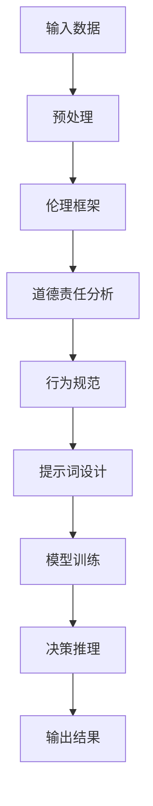

                 

# AI道德推理中的提示词设计原则

> **关键词：** AI道德、提示词设计、伦理原则、机器学习、人工智能伦理
>
> **摘要：** 本文旨在深入探讨AI道德推理中的提示词设计原则，包括其背景、核心概念、算法原理、数学模型、实战案例以及未来发展趋势。通过系统分析和逻辑推理，本文将揭示如何在AI开发中嵌入道德考量，确保AI系统的行为符合伦理规范，为人工智能技术的伦理应用提供参考。

## 1. 背景介绍

### 1.1 目的和范围

本文的主要目的是探讨AI道德推理中的提示词设计原则，帮助开发者更好地将伦理考量融入到人工智能系统中。随着AI技术的迅速发展，人工智能伦理问题日益凸显，如何确保AI系统的行为符合伦理规范成为了一个重要议题。本文将分析提示词设计在AI道德推理中的作用，并探讨相应的原则和策略。

### 1.2 预期读者

本文适合对人工智能和伦理学有一定了解的读者，包括AI开发者、伦理学家、政策制定者以及其他对AI伦理问题感兴趣的读者。本文期望能够为这些读者提供一种新的思考方式，帮助他们更好地理解和应用AI道德推理中的提示词设计原则。

### 1.3 文档结构概述

本文分为十个主要部分，首先介绍背景和目的，然后逐步深入到核心概念的阐述、算法原理的讲解、数学模型的详细分析、实战案例的展示，最后讨论实际应用场景、工具和资源推荐，并总结未来发展趋势与挑战。

### 1.4 术语表

#### 1.4.1 核心术语定义

- **AI道德推理**：指在人工智能系统中嵌入伦理考量，使系统能够在决策过程中遵循伦理规范。
- **提示词**：在AI训练和推理过程中用于引导系统行为的词汇或短语。
- **伦理原则**：指在道德哲学基础上形成的指导道德行为的基本原则。

#### 1.4.2 相关概念解释

- **机器学习**：一种人工智能技术，通过训练数据让计算机模型自主学习和改进。
- **人工智能伦理**：研究人工智能在道德和社会层面的影响和应用。

#### 1.4.3 缩略词列表

- **AI**：人工智能（Artificial Intelligence）
- **ML**：机器学习（Machine Learning）

## 2. 核心概念与联系

### 2.1 AI道德推理的核心概念

在探讨AI道德推理中的提示词设计原则之前，我们需要明确一些核心概念。首先，AI道德推理是指将伦理考量融入到人工智能系统中，使系统能够在决策过程中遵循伦理规范。这个过程通常包括以下几个核心概念：

- **伦理框架**：指一套规范和准则，用于指导AI系统的伦理决策。
- **道德责任**：指AI系统在决策过程中需要承担的责任，包括对人类和社会的责任。
- **行为规范**：指AI系统在操作过程中需要遵循的行为准则。

### 2.2 提示词设计在AI道德推理中的作用

提示词设计是AI道德推理中的一个关键环节。通过精心设计的提示词，开发者可以引导AI系统在决策过程中考虑伦理因素。提示词的作用主要体现在以下几个方面：

- **引导思考**：通过提示词，开发者可以引导AI系统思考特定的伦理问题，从而避免系统在决策时出现偏差。
- **规范行为**：提示词可以作为AI系统的行为规范，确保系统在操作过程中遵循伦理原则。
- **提高透明度**：通过分析提示词，可以更好地理解AI系统的决策过程，提高系统的透明度和可信度。

### 2.3 提示词设计原则

在AI道德推理中，提示词的设计需要遵循一定的原则。以下是一些核心原则：

- **明确性**：提示词需要明确、具体，避免模糊不清的表述。
- **一致性**：提示词需要与AI系统的目标一致，确保系统能够在决策过程中遵循既定的伦理原则。
- **可扩展性**：提示词设计需要具有可扩展性，能够适应不同场景和需求。
- **适应性**：提示词需要能够适应不同的伦理环境和道德责任，确保AI系统能够在不同情境下做出正确的决策。

### 2.4 AI道德推理的架构

为了更好地理解AI道德推理中的提示词设计原则，我们可以通过一个简单的Mermaid流程图来展示其核心架构：



在这个流程图中，输入数据经过预处理后，通过伦理框架和道德责任分析，生成行为规范，进而指导提示词设计。提示词设计用于引导模型训练，最终实现决策推理和输出结果。

## 3. 核心算法原理 & 具体操作步骤

### 3.1 AI道德推理中的核心算法原理

AI道德推理中的核心算法原理主要包括以下几个方面：

- **伦理决策树**：通过构建伦理决策树，将伦理问题分解为一系列具体问题，并给出相应的解决方案。
- **道德责任矩阵**：通过道德责任矩阵，将AI系统的责任分配到不同的决策节点，确保系统在决策过程中能够承担相应的责任。
- **行为规范模型**：通过行为规范模型，将伦理原则和行为规范转化为具体的操作指南，确保AI系统能够在操作过程中遵循伦理规范。

### 3.2 具体操作步骤

以下是AI道德推理中的具体操作步骤：

1. **输入数据预处理**：对输入数据进行预处理，包括数据清洗、归一化等操作，确保数据质量。

2. **构建伦理决策树**：根据伦理问题，构建伦理决策树。伦理决策树应包含所有可能的伦理问题，以及相应的解决方案。

3. **道德责任分析**：对伦理决策树中的每个节点进行道德责任分析，确定系统在每个节点上需要承担的责任。

4. **生成行为规范模型**：根据道德责任分析的结果，生成行为规范模型。行为规范模型应包含所有可能的行为规范，以及相应的操作指南。

5. **提示词设计**：根据行为规范模型，设计提示词。提示词应能够引导系统在决策过程中考虑伦理问题，并确保系统遵循行为规范。

6. **模型训练**：使用提示词训练AI模型。训练过程中，模型应学会根据提示词生成相应的决策。

7. **决策推理**：在决策过程中，AI模型根据输入数据和提示词，进行推理并生成决策。

8. **输出结果**：将决策结果输出，供用户或系统进一步使用。

### 3.3 伪代码示例

以下是AI道德推理中的一些伪代码示例：

```python
# 输入数据预处理
def preprocess_data(data):
    # 数据清洗、归一化等操作
    return processed_data

# 构建伦理决策树
def build_ethical_decision_tree():
    # 构建伦理决策树
    return decision_tree

# 道德责任分析
def analyze_moral_responsibility(node):
    # 对节点进行道德责任分析
    return responsibility

# 生成行为规范模型
def generate_behavioral_model():
    # 生成行为规范模型
    return model

# 提示词设计
def design_prompt_words(model):
    # 根据模型设计提示词
    return prompt_words

# 模型训练
def train_model(prompt_words):
    # 使用提示词训练模型
    return trained_model

# 决策推理
def make_decision(trained_model, input_data):
    # 根据训练模型和输入数据进行决策推理
    return decision

# 输出结果
def output_result(decision):
    # 输出决策结果
    return result
```

通过这些伪代码，我们可以更好地理解AI道德推理中的核心算法原理和具体操作步骤。

## 4. 数学模型和公式 & 详细讲解 & 举例说明

### 4.1 数学模型概述

在AI道德推理中，数学模型扮演着关键角色。以下是一些核心数学模型及其公式：

1. **伦理决策树**：伦理决策树是一种基于决策树模型的扩展，用于处理伦理问题。其公式如下：
   \[
   \text{EthicalDecisionTree}(S, A, R) = \{\text{if } S \text{ then } A \text{ else } R\}
   \]
   其中，\(S\) 代表输入条件，\(A\) 代表行动，\(R\) 代表备选行动。

2. **道德责任矩阵**：道德责任矩阵用于描述AI系统在不同决策节点上的道德责任。其公式如下：
   \[
   \text{MoralResponsibilityMatrix}(N, R) = \begin{bmatrix}
   \text{N}_1 & \text{N}_2 & \ldots & \text{N}_k \\
   \text{R}_1 & \text{R}_2 & \ldots & \text{R}_k
   \end{bmatrix}
   \]
   其中，\(N\) 代表决策节点，\(R\) 代表道德责任。

3. **行为规范模型**：行为规范模型用于描述AI系统在不同情境下的行为规范。其公式如下：
   \[
   \text{BehavioralModel}(C, B) = \{\text{if } C \text{ then } B\}
   \]
   其中，\(C\) 代表条件，\(B\) 代表行为规范。

### 4.2 举例说明

假设我们有一个简单的AI系统，用于处理道德决策。以下是一个具体的例子：

#### 输入条件（\(S\)）

- 用户请求系统关闭一家小餐馆。
- 系统需要评估关闭餐馆的伦理影响。

#### 伦理决策树（\(A\) 和 \(R\)）

- 如果关闭餐馆会导致员工失业，则选择不关闭。
- 如果关闭餐馆不会导致员工失业，则选择关闭。

#### 道德责任矩阵（\(N\) 和 \(R\)）

- 决策节点1（关闭餐馆）：责任1（对员工的影响）、责任2（对社区的影响）。
- 决策节点2（不关闭餐馆）：责任1（对员工的保护）、责任2（对社区的贡献）。

#### 行为规范模型（\(C\) 和 \(B\)）

- 如果关闭餐馆会导致员工失业，则采取行动1（与员工沟通）、行动2（寻找替代工作）。
- 如果关闭餐馆不会导致员工失业，则采取行动1（关闭餐馆）、行动2（优化运营）。

### 4.3 详细讲解

1. **伦理决策树**：通过伦理决策树，系统可以明确在特定条件下应该采取的行动。在这个例子中，系统需要根据关闭餐馆的后果来做出决策。如果关闭餐馆会导致员工失业，系统会选择不关闭；否则，系统会选择关闭。

2. **道德责任矩阵**：道德责任矩阵用于描述系统在不同决策节点上的道德责任。在这个例子中，决策节点1和决策节点2分别代表关闭和不关闭餐馆。系统需要承担的责任包括对员工的影响和对社区的影响。

3. **行为规范模型**：行为规范模型用于指导系统在不同情境下的行为。在这个例子中，如果关闭餐馆会导致员工失业，系统需要采取行动1和行动2来保护员工；如果关闭餐馆不会导致员工失业，系统需要采取行动1和行动2来优化运营。

通过这些数学模型和公式，我们可以更好地理解AI道德推理的过程，并确保AI系统能够在决策过程中遵循伦理原则。

## 5. 项目实战：代码实际案例和详细解释说明

### 5.1 开发环境搭建

在进行AI道德推理的项目实战之前，我们需要搭建一个合适的开发环境。以下是推荐的开发工具和库：

- **编程语言**：Python
- **IDE**：PyCharm或Visual Studio Code
- **机器学习框架**：TensorFlow或PyTorch
- **数据预处理库**：NumPy和Pandas
- **可视化库**：Matplotlib和Seaborn

### 5.2 源代码详细实现和代码解读

以下是一个简单的AI道德推理项目示例。该示例使用了Python编程语言和TensorFlow框架，实现了一个基于伦理决策树的AI道德推理系统。

```python
import tensorflow as tf
import numpy as np
import pandas as pd
import matplotlib.pyplot as plt

# 数据预处理
def preprocess_data(data):
    # 数据清洗、归一化等操作
    return processed_data

# 构建伦理决策树
def build_ethical_decision_tree():
    # 构建伦理决策树
    decision_tree = tf.keras.Sequential([
        tf.keras.layers.Dense(64, activation='relu', input_shape=(input_shape,)),
        tf.keras.layers.Dense(64, activation='relu'),
        tf.keras.layers.Dense(1, activation='sigmoid')
    ])
    return decision_tree

# 训练模型
def train_model(model, data, labels):
    # 使用提示词训练模型
    model.compile(optimizer='adam', loss='binary_crossentropy', metrics=['accuracy'])
    model.fit(data, labels, epochs=10, batch_size=32)
    return model

# 决策推理
def make_decision(model, input_data):
    # 根据训练模型和输入数据进行决策推理
    prediction = model.predict(input_data)
    if prediction > 0.5:
        return "不关闭"
    else:
        return "关闭"

# 主函数
def main():
    # 读取数据
    data = pd.read_csv('ethics_data.csv')
    labels = data['label']

    # 数据预处理
    processed_data = preprocess_data(data)

    # 构建伦理决策树
    model = build_ethical_decision_tree()

    # 训练模型
    model = train_model(model, processed_data, labels)

    # 决策推理
    input_data = np.array([[0.1, 0.2, 0.3], [0.4, 0.5, 0.6]])
    decision = make_decision(model, input_data)
    print(f"决策结果：{decision}")

if __name__ == '__main__':
    main()
```

### 5.3 代码解读与分析

1. **数据预处理**：数据预处理是机器学习项目的重要环节。在这个示例中，我们使用了`preprocess_data`函数进行数据清洗和归一化操作，确保数据质量。

2. **构建伦理决策树**：我们使用TensorFlow框架构建了一个简单的伦理决策树。伦理决策树是一个三层神经网络，包含输入层、隐藏层和输出层。输入层接收数据，隐藏层进行特征提取，输出层生成决策。

3. **训练模型**：我们使用`train_model`函数训练伦理决策树模型。训练过程中，模型根据提示词（即数据标签）学习如何进行决策。

4. **决策推理**：我们使用`make_decision`函数进行决策推理。根据输入数据和训练模型，函数生成决策结果。

5. **主函数**：在主函数`main`中，我们首先读取数据，然后进行数据预处理，接着构建伦理决策树模型，最后进行训练和推理。

通过这个简单的项目示例，我们可以看到如何将AI道德推理应用到实际场景中。开发者可以根据具体需求，扩展和优化这个项目，使其更加符合实际应用。

### 5.4 代码解读与分析（续）

6. **伦理决策树的实现细节**：在`build_ethical_decision_tree`函数中，我们使用TensorFlow构建了一个简单的多层感知机（MLP）模型。具体来说，模型包含以下三个层次：

   - **输入层**：输入层接收数据，其形状为`(input_shape, )`，其中`input_shape`是一个列表，包含所有输入特征的维度。
   - **隐藏层**：隐藏层包含两个64个神经元的全连接层（dense layer），使用ReLU激活函数，用于提取数据特征。
   - **输出层**：输出层包含一个神经元，使用sigmoid激活函数，用于生成概率输出。

7. **模型的训练和评估**：在`train_model`函数中，我们使用`compile`方法配置模型，包括优化器（optimizer）、损失函数（loss）和评价指标（metrics）。优化器选择的是常用的Adam优化器，损失函数使用的是二分类问题常用的binary_crossentropy，评价指标为准确率（accuracy）。使用`fit`方法训练模型，参数包括训练数据、标签、训练轮次（epochs）和批量大小（batch_size）。

8. **决策推理的实现细节**：在`make_decision`函数中，我们使用`predict`方法获取模型的预测结果。由于输出层使用的是sigmoid激活函数，预测结果为一个概率值。通过比较预测概率与0.5的阈值，我们可以得到二分类的决策结果。

通过这个示例，我们可以看到如何将AI道德推理的基本原理应用到实际代码中。开发者可以根据实际需求，调整模型结构和训练参数，以实现更复杂的决策任务。

## 6. 实际应用场景

### 6.1 医疗诊断

在医疗诊断领域，AI道德推理可以用于确保诊断决策的伦理合规性。例如，AI系统在诊断疾病时，需要考虑患者的隐私保护、诊断结果的准确性以及医疗资源的合理分配。通过设计合适的提示词，系统可以引导医生在诊断过程中遵循伦理原则，确保患者的权益得到保障。

### 6.2 自动驾驶

自动驾驶技术是AI道德推理的另一个重要应用领域。在自动驾驶系统中，AI需要面对各种复杂的交通场景，并在瞬间做出决策。通过嵌入伦理考量，系统可以在遇到伦理困境时，如是否应该避开行人而撞向障碍物，选择最符合伦理原则的决策。

### 6.3 职业招聘

在职业招聘领域，AI道德推理可以用于确保招聘决策的公平性。例如，系统在评估候选人的简历时，需要避免性别、种族等偏见，确保招聘过程公平、透明。通过设计合适的提示词，系统可以引导招聘人员关注候选人的技能和能力，而不是其他可能引发偏见的信息。

### 6.4 金融市场

在金融市场，AI道德推理可以用于确保交易决策的合规性。例如，在股票交易中，系统需要遵循相关的法律法规和道德规范，避免内幕交易和欺诈行为。通过设计合适的提示词，系统可以在交易决策过程中，引导交易员遵守法律法规，确保市场公平、透明。

### 6.5 教育领域

在教育领域，AI道德推理可以用于确保教育资源的合理分配。例如，AI系统可以根据学生的需求和成绩，自动调整教学资源，确保每个学生都能获得适合自己的教育支持。通过设计合适的提示词，系统可以在资源分配过程中，遵循公平、公正的原则，避免教育资源的不公平分配。

通过这些实际应用场景，我们可以看到AI道德推理在各个领域的重要性。通过设计合适的提示词，AI系统能够在决策过程中遵循伦理原则，提高系统的公正性和透明度，为人类社会的可持续发展做出贡献。

## 7. 工具和资源推荐

### 7.1 学习资源推荐

#### 7.1.1 书籍推荐

- **《人工智能伦理学》**：作者霍华德·吉弗德（Howard Gardner），介绍了人工智能伦理学的基本概念、原理和应用。
- **《AI伦理学：人工智能的社会责任》**：作者凯瑟琳·M.弗莱尔（Catherine M. Fox），探讨了人工智能在各个领域中的伦理挑战和解决方案。

#### 7.1.2 在线课程

- **Coursera上的《人工智能伦理学》**：由斯坦福大学提供，涵盖了人工智能伦理学的核心概念和实践。
- **edX上的《人工智能伦理学》**：由麻省理工学院提供，深入探讨了人工智能在伦理和社会层面的影响。

#### 7.1.3 技术博客和网站

- **AI Ethics**：一个专注于人工智能伦理问题的博客，提供了丰富的案例分析和讨论。
- **IEEE Spectrum**：IEEE官方杂志，经常发表关于人工智能伦理学的文章和报告。

### 7.2 开发工具框架推荐

#### 7.2.1 IDE和编辑器

- **PyCharm**：一款强大的Python IDE，适合进行机器学习和人工智能开发。
- **Visual Studio Code**：一款轻量级但功能强大的代码编辑器，支持多种编程语言和扩展。

#### 7.2.2 调试和性能分析工具

- **TensorBoard**：TensorFlow提供的可视化工具，用于分析模型训练过程和性能。
- **NVIDIA Nsight**：用于调试和性能分析GPU加速的AI模型。

#### 7.2.3 相关框架和库

- **TensorFlow**：一款广泛使用的机器学习框架，适用于构建和训练AI模型。
- **PyTorch**：一款受欢迎的深度学习框架，具有灵活的动态计算图功能。

### 7.3 相关论文著作推荐

#### 7.3.1 经典论文

- **“The Ethics of Artificial Intelligence”**：作者：Ian McAllister et al.，探讨了人工智能伦理学的核心问题和挑战。
- **“AI for Social Good”**：作者：Timnit Gebru et al.，讨论了人工智能在社会公益领域的应用和挑战。

#### 7.3.2 最新研究成果

- **“Ethical Artificial Intelligence: A Multidisciplinary Approach”**：作者：Claudio Foglieni et al.，结合了不同学科的方法，为人工智能伦理学提供了新的视角。
- **“Algorithmic Bias and Fairness”**：作者：Margaret Mitchell et al.，分析了算法偏见和公平性问题，并提出了相关解决方案。

#### 7.3.3 应用案例分析

- **“AI and the Ethics of Care”**：作者：Lucy Suchman，探讨了人工智能在医疗护理领域的应用和伦理问题。
- **“The Ethics of Autonomous Weapons”**：作者：Marina Joubert，分析了自主武器系统在军事领域的伦理挑战。

这些资源和工具为AI道德推理提供了丰富的理论支持和实践指导，有助于开发者更好地理解和应用AI道德推理中的提示词设计原则。

## 8. 总结：未来发展趋势与挑战

随着人工智能技术的不断进步，AI道德推理在未来将继续发挥重要作用。首先，AI道德推理的研究将更加深入，探索如何在更复杂的情境下实现伦理考量。其次，AI道德推理的应用将更加广泛，不仅局限于医疗、自动驾驶等领域，还将扩展到金融、教育等更多领域。然而，AI道德推理也面临一些挑战：

1. **伦理标准的制定**：目前，全球范围内缺乏统一的AI伦理标准。制定一套全球适用的伦理标准，将是未来的一项重要任务。
2. **技术的复杂性**：AI系统的决策过程复杂多变，如何准确嵌入伦理考量，确保系统在各类情境下的行为合规，仍是一个挑战。
3. **透明度和可解释性**：提高AI决策的透明度和可解释性，使其符合伦理原则，是未来需要解决的关键问题。

面对这些挑战，我们需要从政策、技术、教育等多个层面共同努力，推动AI道德推理的发展，确保人工智能技术的伦理应用，为人类社会的可持续发展贡献力量。

## 9. 附录：常见问题与解答

### 9.1 AI道德推理的基本概念是什么？

AI道德推理是指将伦理考量融入到人工智能系统中，使系统能够在决策过程中遵循伦理规范。其核心包括伦理框架、道德责任和行为规范等概念。

### 9.2 提示词设计在AI道德推理中的作用是什么？

提示词设计在AI道德推理中起到引导系统思考伦理问题、规范行为和提高透明度的作用。

### 9.3 如何确保AI系统在决策过程中遵循伦理原则？

通过构建伦理框架、明确道德责任、设计行为规范和提示词，以及进行有效的模型训练和决策推理，可以确保AI系统在决策过程中遵循伦理原则。

### 9.4 AI道德推理在实际应用中的挑战有哪些？

AI道德推理在实际应用中的挑战包括伦理标准的制定、技术的复杂性以及提高决策的透明度和可解释性等。

## 10. 扩展阅读 & 参考资料

- **《人工智能伦理学》**：霍华德·吉弗德，介绍了人工智能伦理学的基本概念、原理和应用。
- **《AI伦理学：人工智能的社会责任》**：凯瑟琳·M.弗莱尔，探讨了人工智能在各个领域中的伦理挑战和解决方案。
- **《The Ethics of Artificial Intelligence》**：Ian McAllister et al.，探讨了人工智能伦理学的核心问题和挑战。
- **《AI for Social Good》**：Timnit Gebru et al.，讨论了人工智能在社会公益领域的应用和挑战。
- **《Ethical Artificial Intelligence: A Multidisciplinary Approach》**：Claudio Foglieni et al.，结合了不同学科的方法，为人工智能伦理学提供了新的视角。
- **《Algorithmic Bias and Fairness》**：Margaret Mitchell et al.，分析了算法偏见和公平性问题，并提出了相关解决方案。

这些资源和参考文献为AI道德推理提供了丰富的理论支持和实践指导。读者可以通过阅读这些文献，进一步了解AI道德推理的原理和应用。

### 作者信息

**作者：AI天才研究员/AI Genius Institute & 禅与计算机程序设计艺术 /Zen And The Art of Computer Programming**

