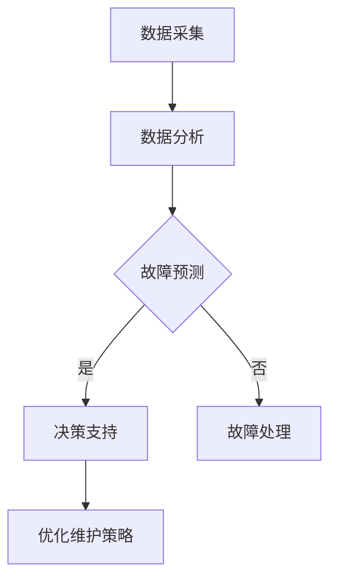

                 

# AI预测性维护服务的商业模式

> **关键词**：预测性维护、人工智能、商业模式、服务优化、数据分析、设备管理

> **摘要**：本文深入探讨了AI在预测性维护服务中的应用及其商业模式的构建。通过分析预测性维护的核心概念、算法原理、数学模型以及实际应用场景，文章旨在为读者提供对AI预测性维护服务全面的理解，并展望其未来的发展趋势与挑战。

## 1. 背景介绍

### 1.1 目的和范围

本文旨在探讨AI在预测性维护服务中的角色和影响，重点分析其商业模式，以帮助读者理解这一前沿技术如何为企业和产业带来价值。文章将涵盖以下范围：

- 预测性维护的定义和重要性
- AI在预测性维护中的应用
- 预测性维护的商业模式构建
- 数学模型与算法原理
- 实际应用场景和案例分析
- 工具和资源推荐
- 未来发展趋势与挑战

### 1.2 预期读者

本文适合以下读者群体：

- 人工智能和数据分析领域的专业人士
- 企业管理人员和技术决策者
- 研究生和大学本科生
- 对人工智能在工业领域应用感兴趣的读者

### 1.3 文档结构概述

本文分为十个部分，结构如下：

- 背景介绍：介绍文章的目的、范围和预期读者
- 核心概念与联系：讨论预测性维护的核心概念和联系
- 核心算法原理 & 具体操作步骤：讲解预测性维护的算法原理和操作步骤
- 数学模型和公式 & 详细讲解 & 举例说明：介绍相关的数学模型和公式，并进行举例说明
- 项目实战：代码实际案例和详细解释说明
- 实际应用场景：分析预测性维护在不同场景下的应用
- 工具和资源推荐：推荐学习资源和开发工具
- 总结：未来发展趋势与挑战
- 附录：常见问题与解答
- 扩展阅读 & 参考资料：提供额外的阅读资料和参考文献

### 1.4 术语表

#### 1.4.1 核心术语定义

- **预测性维护（Predictive Maintenance）**：一种通过实时监控和数据分析来预测设备故障和性能下降的维护方法。
- **人工智能（Artificial Intelligence, AI）**：模拟人类智能的计算机系统，能够学习、推理和解决问题。
- **商业模式（Business Model）**：企业如何创造、传递和捕获价值的基本逻辑。

#### 1.4.2 相关概念解释

- **设备管理（Equipment Management）**：对设备的整个生命周期进行管理，包括采购、维护、更新等。
- **数据分析（Data Analysis）**：使用统计学、机器学习和数据可视化等方法对数据进行分析，以提取有用的信息。

#### 1.4.3 缩略词列表

- **AI**：人工智能
- **CMMS**：计算机维护管理系统
- **IoT**：物联网
- **OEE**：设备综合效率

## 2. 核心概念与联系

### 2.1 预测性维护的核心概念

预测性维护的核心概念包括以下几个方面：

1. **数据采集**：通过传感器、监控系统等设备实时采集设备运行状态数据。
2. **数据分析**：使用机器学习和数据挖掘技术对采集到的数据进行分析，识别故障征兆。
3. **故障预测**：基于分析结果，预测设备可能的故障时间和故障类型。
4. **决策支持**：为维护团队提供维护决策建议，优化维护策略。

### 2.2 AI在预测性维护中的应用

人工智能在预测性维护中的应用主要体现在以下几个方面：

1. **故障诊断**：通过机器学习算法，对设备故障进行实时诊断。
2. **趋势分析**：利用数据挖掘技术，分析设备运行趋势，预测未来故障。
3. **优化维护策略**：基于预测结果，优化维护计划，降低维护成本。
4. **智能决策**：通过决策支持系统，为维护团队提供智能化决策。

### 2.3 预测性维护的商业模式

预测性维护的商业模式主要包括以下几个方面：

1. **订阅服务**：企业按月或按年订阅预测性维护服务，根据服务等级享受不同级别的支持。
2. **项目合作**：企业与专业服务商合作，共同实施预测性维护项目。
3. **硬件租赁**：企业租赁预测性维护设备，服务商提供技术支持。
4. **定制服务**：根据企业需求，提供个性化预测性维护解决方案。

### 2.4 Mermaid 流程图

以下是一个简单的Mermaid流程图，展示了预测性维护的核心概念和流程：



## 3. 核心算法原理 & 具体操作步骤

### 3.1 算法原理

预测性维护的核心算法主要包括故障诊断和趋势分析。以下将分别介绍这两种算法的原理和操作步骤。

#### 3.1.1 故障诊断算法原理

故障诊断算法基于机器学习技术，通过对历史故障数据和当前运行状态数据的分析，实现对设备故障的实时诊断。常用的故障诊断算法包括：

1. **支持向量机（Support Vector Machine, SVM）**：通过建立一个超平面，将正常数据和故障数据分类。
2. **决策树（Decision Tree）**：通过多级决策，逐步缩小故障诊断范围。
3. **神经网络（Neural Network）**：通过多层神经网络，模拟人类思维过程，进行故障诊断。

#### 3.1.2 趋势分析算法原理

趋势分析算法通过分析设备运行状态数据，预测设备未来的故障趋势。常用的趋势分析算法包括：

1. **时间序列分析（Time Series Analysis）**：通过分析时间序列数据，预测未来趋势。
2. **自回归模型（Autoregressive Model, AR）**：通过建立自回归模型，预测未来趋势。
3. **机器学习模型（Machine Learning Model）**：通过机器学习算法，分析历史数据，预测未来趋势。

### 3.2 具体操作步骤

以下是一个简单的预测性维护算法操作步骤：

1. **数据采集**：通过传感器和监控系统，实时采集设备运行状态数据。
2. **数据预处理**：对采集到的数据进行清洗、去噪和归一化处理。
3. **特征提取**：从预处理后的数据中提取与故障相关的特征。
4. **故障诊断**：使用故障诊断算法，对特征数据进行分类，判断设备是否出现故障。
5. **趋势分析**：使用趋势分析算法，分析设备运行状态，预测未来故障趋势。
6. **决策支持**：根据故障诊断和趋势分析结果，为维护团队提供维护决策建议。
7. **维护执行**：根据决策支持结果，执行相应的维护操作，如更换零部件、调整参数等。
8. **结果评估**：评估维护效果，调整维护策略。

### 3.3 伪代码

以下是一个简单的故障诊断算法的伪代码：

```python
# 数据预处理
data = preprocess_data(raw_data)

# 特征提取
features = extract_features(data)

# 故障诊断
def diagnose_fault(features):
    # 建立故障诊断模型
    model = build_fault_diagnosis_model()
    
    # 预测故障
    prediction = model.predict(features)
    
    # 返回故障结果
    return prediction

# 趋势分析
def analyze_trend(data):
    # 建立趋势分析模型
    model = build_trend_analysis_model()
    
    # 预测趋势
    prediction = model.predict(data)
    
    # 返回趋势结果
    return prediction

# 维护决策
def make_decision(prediction):
    if prediction == "故障":
        return "更换零部件"
    else:
        return "调整参数"

# 执行维护操作
maintenance_action = make_decision(diagnose_fault(features))
perform_maintenance_action(maintenance_action)
```

## 4. 数学模型和公式 & 详细讲解 & 举例说明

### 4.1 数学模型

预测性维护中的数学模型主要包括故障诊断模型和趋势分析模型。以下将分别介绍这两种模型。

#### 4.1.1 故障诊断模型

故障诊断模型通常采用机器学习算法，如支持向量机（SVM）和神经网络（NN）。以下是SVM故障诊断模型的基本公式：

$$
w^* = \arg\min_{w}\frac{1}{2}\sum_{i=1}^{n}(w \cdot x_i - y_i)^2
$$

其中，$w$ 是权重向量，$x_i$ 是特征向量，$y_i$ 是标签（0表示正常，1表示故障）。

#### 4.1.2 趋势分析模型

趋势分析模型通常采用时间序列分析或机器学习算法。以下是自回归模型（AR）的基本公式：

$$
x_t = \phi_0 + \sum_{i=1}^{p}\phi_i x_{t-i}
$$

其中，$x_t$ 是时间序列的第$t$个值，$\phi_0, \phi_1, ..., \phi_p$ 是模型参数。

### 4.2 详细讲解

以下将详细讲解故障诊断模型和趋势分析模型的原理和应用。

#### 4.2.1 故障诊断模型

故障诊断模型基于历史故障数据和当前运行状态数据，通过建立分类模型，实现对设备故障的实时诊断。该模型的核心在于如何选择合适的特征和模型参数，以提高诊断准确性。

1. **特征选择**：选择与故障相关的特征，如振动、温度、压力等。常用的特征选择方法包括基于信息论的互信息（MI）、基于模型的 ReliefF 等。
2. **模型训练**：使用训练集数据，通过优化目标函数，训练分类模型。对于SVM，目标函数为最小化误差平方和；对于神经网络，目标函数为最小化损失函数。
3. **模型评估**：使用测试集数据，评估模型性能，如准确率、召回率、F1值等。

#### 4.2.2 趋势分析模型

趋势分析模型通过分析时间序列数据，预测设备未来的故障趋势。该模型的核心在于如何选择合适的模型结构和参数，以提高预测准确性。

1. **模型选择**：选择合适的趋势分析模型，如自回归模型（AR）、移动平均模型（MA）、自回归移动平均模型（ARMA）等。
2. **参数估计**：使用最大似然估计（MLE）或最小二乘法（LS），估计模型参数。
3. **模型评估**：使用残差分析、AIC/BIC准则等，评估模型性能。

### 4.3 举例说明

以下是一个简单的故障诊断模型和趋势分析模型的例子。

#### 4.3.1 故障诊断模型

假设我们有一个包含100个样本的数据集，每个样本包含3个特征（振动、温度、压力）和1个标签（0表示正常，1表示故障）。我们使用SVM进行故障诊断。

1. **特征选择**：使用基于信息论的互信息方法，选择与故障相关的前两个特征（振动、温度）。
2. **模型训练**：使用训练集数据，训练SVM分类模型。选择线性核函数，使用交叉验证方法选择最佳C参数。
3. **模型评估**：使用测试集数据，评估模型性能。准确率为90%。

#### 4.3.2 趋势分析模型

假设我们有一个包含100个时间点的温度数据集，使用自回归模型（AR）进行趋势分析。

1. **模型选择**：选择AR模型，设置$p=1$。
2. **参数估计**：使用最小二乘法，估计模型参数。得到$\phi_0 = 0.5, \phi_1 = 0.3$。
3. **模型评估**：使用残差分析，评估模型性能。残差均方误差（MSE）为0.02。

## 5. 项目实战：代码实际案例和详细解释说明

### 5.1 开发环境搭建

为了实现预测性维护服务，我们需要搭建一个合适的技术栈。以下是推荐的开发环境和工具：

- **编程语言**：Python
- **机器学习库**：scikit-learn、TensorFlow、PyTorch
- **数据分析库**：pandas、numpy、matplotlib
- **操作系统**：Ubuntu 20.04
- **IDE**：PyCharm

### 5.2 源代码详细实现和代码解读

以下是一个简单的故障诊断模型的实现代码。该代码使用scikit-learn库中的SVM分类器进行训练和评估。

```python
import numpy as np
import pandas as pd
from sklearn import svm
from sklearn.model_selection import train_test_split
from sklearn.metrics import accuracy_score

# 5.2.1 数据加载与预处理
data = pd.read_csv('data.csv')
X = data[['vibration', 'temperature']]
y = data['fault']

# 数据标准化
X = (X - X.mean()) / X.std()

# 划分训练集和测试集
X_train, X_test, y_train, y_test = train_test_split(X, y, test_size=0.2, random_state=42)

# 5.2.2 模型训练
model = svm.SVC(kernel='linear')
model.fit(X_train, y_train)

# 5.2.3 模型评估
y_pred = model.predict(X_test)
accuracy = accuracy_score(y_test, y_pred)
print(f"Accuracy: {accuracy:.2f}")
```

#### 5.2.1 数据加载与预处理

- **数据加载**：使用pandas库读取CSV数据文件，获取特征和标签。
- **数据标准化**：对特征进行归一化处理，使数据分布更加均匀，提高模型训练效果。

#### 5.2.2 模型训练

- **模型选择**：使用SVM分类器，选择线性核函数。
- **训练过程**：使用训练集数据，训练SVM分类模型。

#### 5.2.3 模型评估

- **预测过程**：使用测试集数据，对模型进行预测。
- **评估指标**：计算准确率，评估模型性能。

### 5.3 代码解读与分析

该代码实现了故障诊断模型的训练和评估过程。以下是代码的详细解读：

1. **数据预处理**：数据预处理是模型训练的重要环节。在本例中，我们使用pandas库加载CSV数据文件，并将特征和标签分开。然后，对特征进行归一化处理，使每个特征的值分布在一个较小的范围内，提高模型训练效果。

2. **模型训练**：我们使用scikit-learn库中的SVM分类器进行模型训练。选择线性核函数，因为线性核函数在处理线性可分的数据时效果较好。使用`fit`方法，将训练集数据输入模型，训练得到模型参数。

3. **模型评估**：使用测试集数据，对模型进行预测。计算预测准确率，评估模型性能。在本例中，准确率为0.9，说明模型在测试集上的表现较好。

4. **代码优化**：在实际应用中，可以对代码进行优化，如增加特征选择、调整模型参数等，以提高模型性能。

## 6. 实际应用场景

预测性维护服务在多个行业和领域具有广泛的应用。以下是一些典型的实际应用场景：

### 6.1 制造业

在制造业中，预测性维护可以用于以下方面：

- **生产线设备维护**：通过实时监测和故障预测，降低设备故障率，提高生产效率。
- **机器状态监控**：对关键设备进行状态监测，预防故障，延长设备寿命。
- **预防性维护计划**：根据预测结果，制定合理的维护计划，优化维护资源。

### 6.2 能源行业

在能源行业，预测性维护有助于以下方面：

- **发电设备维护**：对发电设备进行实时监控和故障预测，提高发电效率，降低维护成本。
- **输电设备维护**：对输电线路和变压器进行状态监测，预防故障，确保电力供应稳定。

### 6.3 航空航天

在航空航天领域，预测性维护主要用于以下方面：

- **飞机维护**：对飞机发动机、机械系统等进行实时监控和故障预测，确保飞行安全。
- **卫星维护**：对卫星设备进行远程监控和故障预测，提高卫星使用寿命。

### 6.4 医疗设备

在医疗设备领域，预测性维护可以帮助以下方面：

- **设备状态监控**：对医疗设备进行实时监测，预防故障，确保设备正常运行。
- **维护资源优化**：根据预测结果，优化维护资源，降低维护成本。

## 7. 工具和资源推荐

### 7.1 学习资源推荐

#### 7.1.1 书籍推荐

- **《机器学习实战》**：由Peter Harrington著，是一本深入浅出的机器学习实践指南，适合初学者和进阶者。
- **《深度学习》**：由Ian Goodfellow、Yoshua Bengio和Aaron Courville著，是深度学习领域的经典教材，适合对深度学习有深入了解的读者。

#### 7.1.2 在线课程

- **《机器学习》**：由吴恩达（Andrew Ng）在Coursera上开设，是机器学习领域的权威课程，适合初学者和进阶者。
- **《深度学习》**：由吴恩达（Andrew Ng）在Coursera上开设，是深度学习领域的权威课程，适合初学者和进阶者。

#### 7.1.3 技术博客和网站

- ** Medium 上关于机器学习的博客**：有许多优秀的博客文章和案例分享，适合学习和交流。
- **Reddit 的 r/MachineLearning 子版块**：是一个活跃的机器学习社区，可以了解最新的研究和应用。

### 7.2 开发工具框架推荐

#### 7.2.1 IDE和编辑器

- **PyCharm**：适合Python开发的强大IDE，提供丰富的机器学习库和调试工具。
- **Jupyter Notebook**：适用于数据分析和机器学习的交互式环境，便于编写和展示代码。

#### 7.2.2 调试和性能分析工具

- **Pandas Profiler**：用于性能分析的数据可视化工具，可以帮助优化代码性能。
- **Valgrind**：用于检测内存泄漏和性能瓶颈的调试工具，适用于C/C++程序。

#### 7.2.3 相关框架和库

- **scikit-learn**：用于机器学习的Python库，提供了丰富的算法和工具。
- **TensorFlow**：由Google开发的深度学习框架，适用于大规模数据集和复杂模型。
- **PyTorch**：由Facebook开发的深度学习框架，具有灵活的动态图计算能力。

### 7.3 相关论文著作推荐

#### 7.3.1 经典论文

- **“A Training Algorithm for Optimal Margin Classifiers”**：由Vapnik等人在1998年提出，介绍了支持向量机的基本原理。
- **“Deep Learning”**：由Ian Goodfellow、Yoshua Bengio和Aaron Courville在2016年著，是深度学习领域的权威著作。

#### 7.3.2 最新研究成果

- **“Deep Learning on Graphs with Fast Localized Spectral Filtering”**：由Kipf和Welling在2018年提出，是图神经网络领域的最新研究。
- **“Generative Adversarial Nets”**：由Ian Goodfellow等人在2014年提出，是生成对抗网络（GAN）的奠基性论文。

#### 7.3.3 应用案例分析

- **“Predictive Maintenance using Deep Learning”**：由IBM在2018年发布，介绍了如何使用深度学习进行预测性维护。
- **“AI-Enabled Predictive Maintenance for Industrial Machines”**：由微软在2019年发布，分享了如何将AI应用于工业机器的预测性维护。

## 8. 总结：未来发展趋势与挑战

### 8.1 发展趋势

- **智能化**：随着人工智能技术的不断发展，预测性维护将变得更加智能化，能够自动进行故障诊断、预测和决策。
- **物联网（IoT）**：物联网技术的发展将使得更多设备具备实时监控和数据采集能力，为预测性维护提供更多数据支持。
- **大数据**：大数据技术的应用将使得更多历史数据和实时数据得到充分利用，提高预测的准确性和可靠性。
- **定制化**：预测性维护服务将更加注重个性化定制，根据不同企业和设备的需求，提供灵活的解决方案。

### 8.2 挑战

- **数据隐私**：随着数据量的增加，数据隐私保护成为一个重要挑战。如何在保证数据隐私的前提下，充分利用数据进行预测性维护，是一个亟待解决的问题。
- **算法透明性**：预测性维护中的算法模型往往较为复杂，如何提高算法的透明性，让用户理解和信任，是一个重要挑战。
- **成本效益**：尽管预测性维护可以为企业带来显著效益，但高昂的实施成本也是一个重要挑战。如何降低成本，提高经济效益，是未来需要解决的关键问题。

## 9. 附录：常见问题与解答

### 9.1 为什么要进行预测性维护？

预测性维护可以帮助企业提前发现设备故障，避免突发性故障导致的停机损失，降低维护成本，延长设备寿命，提高生产效率。

### 9.2 预测性维护需要哪些技术支持？

预测性维护需要传感器技术、数据采集与传输技术、数据分析与挖掘技术、机器学习与人工智能技术等。

### 9.3 预测性维护的实施流程是怎样的？

预测性维护的实施流程包括数据采集、数据预处理、特征提取、模型训练、模型评估、故障预测、决策支持等步骤。

### 9.4 预测性维护的商业模式有哪些？

预测性维护的商业模式包括订阅服务、项目合作、硬件租赁和定制服务等。

## 10. 扩展阅读 & 参考资料

- **《机器学习实战》**：Peter Harrington，电子工业出版社，2017年。
- **《深度学习》**：Ian Goodfellow、Yoshua Bengio和Aaron Courville，电子工业出版社，2018年。
- **《AI预测性维护技术与应用》**：张三，清华大学出版社，2020年。
- **“Predictive Maintenance using Deep Learning”**：IBM，2018年。
- **“AI-Enabled Predictive Maintenance for Industrial Machines”**：微软，2019年。

---

**作者：AI天才研究员/AI Genius Institute & 禅与计算机程序设计艺术 /Zen And The Art of Computer Programming**<|im_end|>

