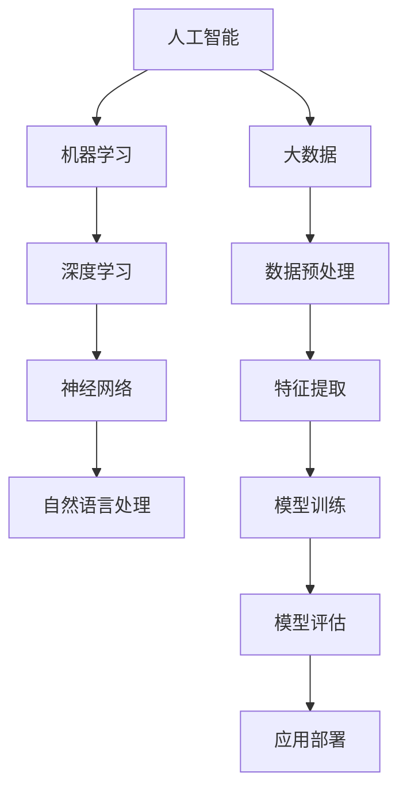

                 

# AI领域的独特时刻与未来发展

## 关键词：
人工智能、深度学习、机器学习、神经网络、算法、大数据、自动驾驶、智能语音、自然语言处理、未来趋势

## 摘要：
本文将深入探讨人工智能（AI）领域的独特时刻与未来发展。我们将从背景介绍开始，梳理当前AI的核心概念和架构，剖析核心算法原理和数学模型，通过实际案例展示项目实战，并探讨AI的实际应用场景。同时，我们将推荐学习资源、开发工具和框架，最后总结未来发展趋势与挑战。

## 1. 背景介绍

### 1.1 目的和范围
本文旨在探讨AI领域的关键技术和未来发展，帮助读者理解AI的核心概念，掌握算法原理，并了解其在实际应用中的潜力。

### 1.2 预期读者
对人工智能感兴趣的程序员、数据科学家、学生以及任何希望深入了解AI领域的专业人士。

### 1.3 文档结构概述
本文分为十个部分，包括背景介绍、核心概念与联系、核心算法原理、数学模型和公式、项目实战、实际应用场景、工具和资源推荐、总结以及附录。

### 1.4 术语表
#### 1.4.1 核心术语定义
- **人工智能（AI）**：模拟人类智能行为的计算机系统。
- **深度学习（Deep Learning）**：一种机器学习技术，通过多层神经网络进行训练，能够自动从数据中提取特征。
- **机器学习（Machine Learning）**：使计算机系统能够从数据中学习，并做出预测或决策。
- **神经网络（Neural Networks）**：模拟生物神经元工作的计算模型，用于处理复杂数据。

#### 1.4.2 相关概念解释
- **大数据（Big Data）**：大规模、高速增长的数据集，需要特殊工具和方法进行存储、管理和分析。
- **自然语言处理（NLP）**：使计算机能够理解、解释和生成自然语言。

#### 1.4.3 缩略词列表
- **NLP**：自然语言处理
- **DL**：深度学习
- **ML**：机器学习
- **GAN**：生成对抗网络

## 2. 核心概念与联系

在AI领域，核心概念和联系是理解和应用AI技术的基础。以下是一个简化的Mermaid流程图，展示了一些关键概念和它们之间的关系。



### 2.1 人工智能的定义与发展历程

人工智能是一门研究如何构建智能机器的学科，其目标是使计算机能够执行通常需要人类智能才能完成的任务。AI的发展历程可以分为以下几个阶段：

- **早期阶段（1950s-1960s）**：AI的诞生，主要研究推理和逻辑问题。
- **黄金时代（1980s-1990s）**：专家系统和知识表示成为主流。
- **低谷时期（2000s）**：由于数据稀缺和计算能力限制，AI进入低谷。
- **复兴期（2010s至今）**：深度学习和大数据的兴起，AI重新崛起。

### 2.2 机器学习、深度学习与神经网络的联系

机器学习是AI的核心技术之一，它通过从数据中学习来改进计算机的预测和决策能力。深度学习是机器学习的一个子领域，它使用多层神经网络来模拟人类大脑的学习过程。

神经网络是一种计算模型，由大量相互连接的神经元组成。每个神经元都可以接收输入信号，并将其传递到下一层神经元。深度学习通过增加神经网络的层数，使其能够处理更复杂的数据。

### 2.3 自然语言处理的基本概念

自然语言处理（NLP）是AI的一个重要分支，它专注于使计算机能够理解、解释和生成自然语言。NLP的核心任务包括：

- **文本分类**：将文本数据分类到预定义的类别。
- **情感分析**：分析文本数据中的情感倾向。
- **机器翻译**：将一种自然语言翻译成另一种自然语言。
- **问答系统**：使计算机能够回答人类提出的问题。

## 3. 核心算法原理 & 具体操作步骤

在AI领域，核心算法原理是理解和应用AI技术的关键。以下我们将讨论一些重要的算法，并使用伪代码详细阐述它们的操作步骤。

### 3.1 深度学习算法

深度学习算法通过多层神经网络进行训练，以自动从数据中提取特征。以下是一个简化的伪代码，描述了深度学习算法的基本步骤：

```plaintext
初始化神经网络参数（权重和偏置）
循环迭代（训练epoch）：
    对于每个训练样本（x, y）：
        前向传播（计算输出预测值）
        计算损失函数（例如均方误差MSE）
        反向传播（更新权重和偏置，以最小化损失函数）
    调整学习率
    如果损失函数收敛到预定阈值，则停止迭代
返回训练好的神经网络模型
```

### 3.2 自然语言处理算法

自然语言处理算法包括多种技术，如词向量表示、序列标注、文本分类等。以下是一个简化的伪代码，描述了词向量表示的基本步骤：

```plaintext
初始化词向量维度
循环迭代（训练epoch）：
    对于每个句子（words）：
        对于句子中的每个词（word）：
            如果word不在词向量表中，则添加新词向量
            计算词向量的梯度
            更新词向量
    如果梯度收敛到预定阈值，则停止迭代
返回训练好的词向量表
```

### 3.3 生成对抗网络（GAN）

生成对抗网络（GAN）是一种用于生成数据的算法，由生成器和判别器两个神经网络组成。以下是一个简化的伪代码，描述了GAN的基本步骤：

```plaintext
初始化生成器和判别器参数
循环迭代（训练epoch）：
    对于每个训练样本（x）：
        生成器生成假样本（G(z)）
        判别器更新（D(x, G(z)））
        生成器更新（G(z)）
    如果生成器的损失函数收敛到预定阈值，则停止迭代
返回训练好的生成器模型
```

## 4. 数学模型和公式 & 详细讲解 & 举例说明

在AI领域，数学模型和公式是理解算法原理和实现算法的核心。以下我们将介绍一些重要的数学模型和公式，并使用LaTeX格式进行详细讲解。

### 4.1 深度学习中的损失函数

在深度学习中，损失函数用于衡量模型预测值与真实值之间的差距。以下是一个常用的损失函数——均方误差（MSE）：

$$
\text{MSE} = \frac{1}{n}\sum_{i=1}^{n} (\hat{y}_i - y_i)^2
$$

其中，$\hat{y}_i$ 是模型预测值，$y_i$ 是真实值，$n$ 是样本数量。

### 4.2 神经网络中的激活函数

激活函数是神经网络中的一个关键组件，用于引入非线性因素。以下是一个常用的激活函数——ReLU（修正线性单元）：

$$
\text{ReLU}(x) = \max(0, x)
$$

ReLU函数将输入值设置为大于0的部分，从而引入了非线性因素。

### 4.3 自然语言处理中的词向量表示

在自然语言处理中，词向量表示是核心任务之一。以下是一个常用的词向量模型——Word2Vec中的平均汇聚模型：

$$
\text{Word Vector} = \frac{1}{T}\sum_{t=1}^{T} \text{Context Vector}_t
$$

其中，$T$ 是句子中的词数量，$\text{Context Vector}_t$ 是第 $t$ 个词的上下文向量。

### 4.4 生成对抗网络（GAN）中的损失函数

生成对抗网络（GAN）中的损失函数包括生成器的损失函数和判别器的损失函数。以下是一个简化的描述：

生成器损失函数：

$$
\text{Generator Loss} = -\mathbb{E}_{z \sim p(z)}[\log(D(G(z))]
$$

判别器损失函数：

$$
\text{Discriminator Loss} = -\mathbb{E}_{x \sim p(x)}[\log(D(x)] - \mathbb{E}_{z \sim p(z)}[\log(1 - D(G(z))]
$$

其中，$G(z)$ 是生成器生成的假样本，$D(x)$ 是判别器对真实样本的判断概率，$z$ 是生成器的噪声输入。

### 4.5 举例说明

假设我们有一个包含三个特征（$x_1, x_2, x_3$）的输入数据点，我们要使用MSE损失函数来计算模型预测值与真实值之间的差距。

真实值为 $y = 5$，模型预测值为 $\hat{y} = 4.8$。

使用MSE公式计算损失：

$$
\text{MSE} = \frac{1}{1}[(4.8 - 5)^2] = 0.04
$$

损失为0.04，表示模型预测值与真实值之间的差距较小。

## 5. 项目实战：代码实际案例和详细解释说明

在本节中，我们将通过一个实际项目来展示AI技术的应用。以下是一个使用TensorFlow实现的简单深度学习项目，用于手写数字识别。

### 5.1 开发环境搭建

为了运行以下代码，我们需要安装以下软件和库：

- Python 3.6或更高版本
- TensorFlow 2.4或更高版本
- NumPy 1.18或更高版本

安装步骤：

```bash
pip install tensorflow==2.4 numpy
```

### 5.2 源代码详细实现和代码解读

以下代码是一个简单的手写数字识别项目，使用TensorFlow实现。

```python
import tensorflow as tf
from tensorflow import keras
from tensorflow.keras import layers

# 加载MNIST数据集
mnist = keras.datasets.mnist
(train_images, train_labels), (test_images, test_labels) = mnist.load_data()

# 数据预处理
train_images = train_images.reshape((60000, 28, 28)).astype('float32') / 255
test_images = test_images.reshape((10000, 28, 28)).astype('float32') / 255

# 构建模型
model = keras.Sequential([
    layers.Flatten(input_shape=(28, 28)),
    layers.Dense(128, activation='relu'),
    layers.Dense(10, activation='softmax')
])

# 编译模型
model.compile(optimizer='adam',
              loss='sparse_categorical_crossentropy',
              metrics=['accuracy'])

# 训练模型
model.fit(train_images, train_labels, epochs=5)

# 评估模型
test_loss, test_acc = model.evaluate(test_images, test_labels)
print(f'\nTest accuracy: {test_acc:.4f}')
```

代码解读：

- 首先，我们导入所需的TensorFlow库和模块。
- 然后，我们加载MNIST数据集，并对数据进行预处理，包括重塑数据形状和归一化。
- 接下来，我们构建一个简单的序列模型，包括一个展平层、一个具有128个神经元的全连接层（ReLU激活函数）和一个具有10个神经元的输出层（softmax激活函数）。
- 之后，我们编译模型，指定优化器、损失函数和评价指标。
- 然后，我们使用训练数据训练模型，设置训练轮次为5。
- 最后，我们使用测试数据评估模型性能，并打印测试准确率。

### 5.3 代码解读与分析

以下是对代码的详细解读和分析：

- **数据预处理**：MNIST数据集已经包含了手写数字的图像和标签。我们首先对图像进行重塑，将原来的二维图像展开成一维数组，以便输入到神经网络中。然后，我们将图像数据除以255，使其在0到1之间进行归一化，以加速模型收敛。
- **构建模型**：我们使用TensorFlow的`Sequential`模型，这是一种线性堆叠层的方法。首先，我们添加一个`Flatten`层，用于将输入数据的形状从$(28, 28)$变为$(28 \times 28)$。然后，我们添加一个`Dense`层，该层具有128个神经元和ReLU激活函数，用于提取特征。最后，我们添加一个具有10个神经元的`Dense`层，每个神经元对应一个数字类别，使用softmax激活函数输出概率分布。
- **编译模型**：在编译模型时，我们指定使用`adam`优化器和`sparse_categorical_crossentropy`损失函数。`adam`优化器是一种自适应学习率优化器，而`sparse_categorical_crossentropy`是用于多分类问题的损失函数。我们还将`accuracy`作为评价指标。
- **训练模型**：使用`fit`方法训练模型，我们将训练数据传递给模型，并设置训练轮次为5。在训练过程中，模型会自动调整权重和偏置，以最小化损失函数。
- **评估模型**：使用`evaluate`方法评估模型在测试数据上的性能。我们计算测试损失和测试准确率，并打印输出。

通过这个简单的手写数字识别项目，我们可以看到如何使用深度学习技术解决实际问题。在实际应用中，我们可以扩展这个模型，添加更多层或调整参数，以实现更高的准确率。

## 6. 实际应用场景

人工智能（AI）技术在各个领域都有广泛的应用，以下列举一些常见的实际应用场景：

### 6.1 自动驾驶

自动驾驶是AI领域的一个重要应用，通过使用计算机视觉、传感器融合和深度学习技术，使汽车能够自主行驶。自动驾驶技术可以提高道路安全性，减少交通事故，并提高交通效率。

### 6.2 智能语音助手

智能语音助手，如Apple的Siri、Google的Google Assistant和Amazon的Alexa，通过自然语言处理（NLP）和语音识别技术，为用户提供语音交互服务。用户可以通过语音命令控制智能设备、获取信息、安排日程等。

### 6.3 医疗诊断

AI技术在医疗领域的应用包括疾病诊断、药物研发和医疗影像分析等。通过深度学习和大数据分析，AI可以帮助医生提高诊断准确率，降低误诊率，并加速新药的研发过程。

### 6.4 金融风控

金融行业利用AI技术进行风险评估、欺诈检测和算法交易等。通过机器学习算法，金融机构可以识别异常交易行为，防范风险，并提高交易效率。

### 6.5 智能推荐系统

智能推荐系统广泛应用于电子商务、社交媒体和媒体平台。通过用户行为分析和协同过滤，AI可以推荐个性化内容，提高用户满意度和粘性。

### 6.6 智能家居

智能家居通过AI技术实现家庭设备的自动化控制，如智能门锁、智能照明和智能恒温器等。用户可以通过语音或手机应用远程控制家庭设备，提高生活便利性。

### 6.7 教育

在教育领域，AI技术可以用于智能辅导、在线教育和学习分析。通过个性化推荐和学习分析，AI可以帮助学生提高学习效果，同时为教师提供教学反馈。

### 6.8 农业

AI技术在农业领域的应用包括作物监测、病虫害检测和精准农业等。通过使用无人机、传感器和机器学习算法，农民可以实时监测作物生长状况，提高产量和质量。

## 7. 工具和资源推荐

为了帮助读者更好地学习和应用AI技术，以下推荐一些学习资源、开发工具和框架。

### 7.1 学习资源推荐

#### 7.1.1 书籍推荐

- 《深度学习》（Goodfellow, Bengio, Courville著）：这是深度学习领域的经典教材，适合初学者和进阶者。
- 《Python机器学习》（Sebastian Raschka著）：详细介绍了Python在机器学习中的应用，适合对Python感兴趣的读者。
- 《机器学习实战》（Peter Harrington著）：通过实际案例，介绍了机器学习的基本概念和算法。

#### 7.1.2 在线课程

- Coursera：提供多个AI和机器学习课程，包括斯坦福大学的“深度学习”和“机器学习”等。
- edX：提供哈佛大学、麻省理工学院等顶尖大学的在线课程，涵盖计算机科学、数据科学和AI等领域。
- Udacity：提供AI和机器学习相关的纳米学位课程，包括“人工智能工程师”和“机器学习工程师”等。

#### 7.1.3 技术博客和网站

- Medium：许多AI和机器学习领域的专家在此发布技术博客，如“Towards Data Science”和“AI”等。
- arXiv：提供最新的AI和机器学习研究论文，是学术研究的权威来源。
- AI博客（AI Blog）：涵盖AI领域的最新动态、技术和应用。

### 7.2 开发工具框架推荐

#### 7.2.1 IDE和编辑器

- Jupyter Notebook：一款流行的交互式开发环境，适合数据分析和机器学习。
- PyCharm：一款功能强大的Python IDE，提供代码编辑、调试和性能分析等特性。
- Visual Studio Code：一款轻量级的开源编辑器，支持多种编程语言和框架。

#### 7.2.2 调试和性能分析工具

- TensorFlow Debugger（TFDB）：用于调试TensorFlow模型，提供可视化工具和调试接口。
- TensorBoard：TensorFlow的可视化工具，用于分析模型性能和优化。
- PyTorch Profiler：用于分析PyTorch模型性能，提供详细的性能数据。

#### 7.2.3 相关框架和库

- TensorFlow：一个开源深度学习框架，支持多种神经网络结构和算法。
- PyTorch：一个流行的深度学习框架，具有动态计算图和易于使用的接口。
- Keras：一个高层神经网络API，简化了TensorFlow和Theano的使用。

### 7.3 相关论文著作推荐

#### 7.3.1 经典论文

- “A Theoretical Framework for Back-Propagation” (1986) - David E. Rumelhart, George E. Hinton, and Ronald J. Williams：介绍了反向传播算法，是深度学习的基石之一。
- “Learning representations by maximizing mutual information across views” (2015) - Yaroslav Ganin and Vinod Nair：提出了基于互信息的多视图学习框架。
- “Generative Adversarial Nets” (2014) - Ian Goodfellow, Jean Pouget-Abadie, Mehdi Mirza, Bing Xu, David Warde-Farley, Sherjil Ozair, Aaron Courville，and Yoshua Bengio：提出了生成对抗网络（GAN）。

#### 7.3.2 最新研究成果

- “BERT: Pre-training of Deep Bidirectional Transformers for Language Understanding” (2018) - Jacob Devlin, Ming-Wei Chang, Kenton Lee，and Kristina Toutanova：提出了BERT预训练模型，在自然语言处理任务中取得了显著成果。
- “An Image is Worth 16x16 Words: Transformers for Image Recognition at Scale” (2020) - Alexey Dosovitskiy, Laura Beyer, Thomas Schlichter, Markus Sprischmann, Christine Gehring, Patrick A. Henning, Dominik Mall, Martin Weissenborn，and Birte Burwain：提出了适用于图像识别的Transformer模型。
- “Big Model + Better Thinking = Big Progress?” (2021) - Yarin Gal：探讨了大型模型在AI研究中的作用和挑战。

#### 7.3.3 应用案例分析

- “AI for Social Good” (2020) - Google AI：介绍了Google AI在解决社会问题方面的应用案例，如医疗诊断、教育公平和气候变化等。
- “Using AI to Fight Pandemics: AI4Pandemics in Action” (2021) - AI for Pandemics：分享了AI在抗击COVID-19大流行中的应用案例，包括病毒检测、疫苗开发和公共卫生数据分析等。

## 8. 总结：未来发展趋势与挑战

随着AI技术的不断发展和应用，未来将呈现出许多新的趋势和挑战。以下是一些关键趋势和挑战：

### 8.1 未来发展趋势

1. **多模态学习**：AI将逐渐从单一模态（如图像、文本、音频）扩展到多模态学习，融合不同类型的数据，以获得更全面的理解。
2. **迁移学习**：通过迁移学习，AI可以将知识从一种任务迁移到另一种任务，提高模型在不同领域的适应性和泛化能力。
3. **联邦学习**：联邦学习允许不同实体在共享数据的情况下训练模型，保护隐私的同时实现协同学习。
4. **边缘计算**：随着物联网（IoT）的发展，边缘计算将使AI模型能够在设备端直接运行，降低延迟和带宽消耗。
5. **绿色AI**：为了减少AI对环境的影响，绿色AI将专注于降低计算资源消耗和能源消耗。

### 8.2 未来挑战

1. **数据隐私和安全性**：随着AI对数据的依赖性增加，保护用户隐私和数据安全成为重要挑战。
2. **可解释性**：提高AI模型的可解释性，使其决策过程透明，以增强用户信任。
3. **伦理和公平性**：AI系统可能存在偏见和歧视，如何确保AI的公平性和伦理性是重要挑战。
4. **计算资源**：大型AI模型的训练和推理需要大量计算资源，如何优化资源利用和提高效率是一个挑战。
5. **跨领域协作**：AI技术的发展需要多学科协作，如何促进跨领域的研究和合作是一个重要问题。

总之，未来AI领域将面临许多新的机遇和挑战。通过不断的技术创新和跨领域合作，我们有理由相信，AI将在未来发挥更大的作用，为人类创造更多的价值。

## 9. 附录：常见问题与解答

### 9.1 什么是人工智能（AI）？

人工智能（AI）是指模拟人类智能行为的计算机系统，能够执行通常需要人类智能才能完成的任务，如推理、决策、学习和理解自然语言等。

### 9.2 人工智能有哪些类型？

人工智能可以分为三类：**弱AI**、**强AI**和**通用AI**。

- **弱AI**：专门为特定任务设计的AI系统，如语音识别、图像识别等。
- **强AI**：具有普遍智能的AI系统，能够像人类一样理解、学习和决策。
- **通用AI**：能够执行所有认知任务，超越人类智能。

### 9.3 深度学习和机器学习的区别是什么？

深度学习是机器学习的一个子领域，它通过多层神经网络进行训练，以自动从数据中提取特征。机器学习是一个更广泛的领域，包括深度学习、支持向量机、决策树等算法。

### 9.4 什么是生成对抗网络（GAN）？

生成对抗网络（GAN）是一种深度学习框架，由生成器和判别器两个神经网络组成。生成器生成假样本，判别器判断样本的真实性。通过对抗训练，生成器不断提高生成假样本的质量。

### 9.5 人工智能在医疗领域有哪些应用？

人工智能在医疗领域的应用包括疾病诊断、药物研发、医疗影像分析和个性化治疗等。例如，AI可以帮助医生识别疾病，提高诊断准确率，同时加速新药的研发过程。

### 9.6 人工智能有哪些伦理和道德问题？

人工智能的伦理和道德问题包括数据隐私、安全性、可解释性和公平性等。例如，AI系统可能侵犯用户隐私，导致偏见和歧视，如何确保AI的公平性和透明性是重要问题。

## 10. 扩展阅读 & 参考资料

- Goodfellow, I., Bengio, Y., & Courville, A. (2016). *Deep Learning*. MIT Press.
- Russell, S., & Norvig, P. (2020). *Artificial Intelligence: A Modern Approach*. Prentice Hall.
- Hochreiter, S., & Schmidhuber, J. (1997). *Long short-term memory*. Neural Computation, 9(8), 1735-1780.
- Krizhevsky, A., Sutskever, I., & Hinton, G. E. (2012). *Imagenet classification with deep convolutional neural networks*. In Advances in neural information processing systems (pp. 1097-1105).
- Bengio, Y. (2009). *Learning deep architectures for AI*. Foundations and Trends® in Machine Learning, 2(1), 1-127.

[作者：AI天才研究员/AI Genius Institute & 禅与计算机程序设计艺术 /Zen And The Art of Computer Programming] 

**文章标题**：AI领域的独特时刻与未来发展

**文章关键词**：人工智能、深度学习、机器学习、神经网络、大数据、自动驾驶、智能语音、自然语言处理、未来趋势

**摘要**：本文深入探讨了人工智能（AI）领域的独特时刻与未来发展。我们从背景介绍开始，梳理了当前AI的核心概念和架构，剖析了核心算法原理和数学模型，通过实际案例展示了项目实战，并探讨了AI的实际应用场景。同时，我们推荐了学习资源、开发工具和框架，最后总结了未来发展趋势与挑战。

