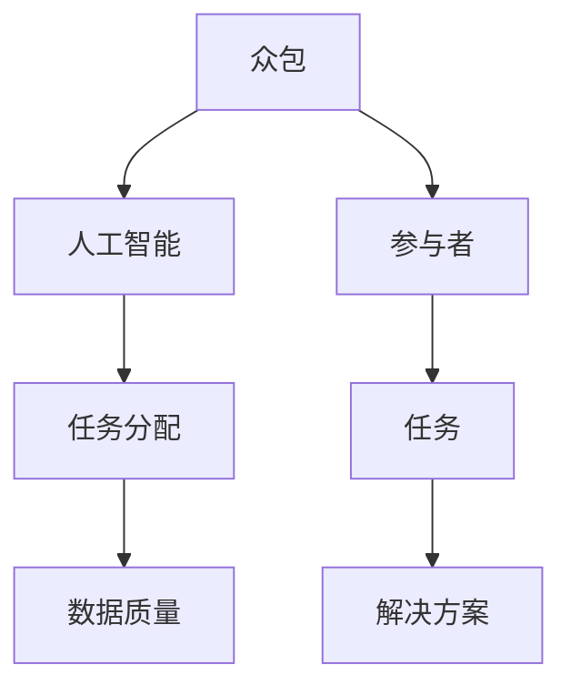

                 

# AI驱动的众包平台：增强机会

> 关键词：AI，众包，平台，机会，技术，创新，未来

> 摘要：本文将探讨AI驱动的众包平台如何通过技术创新，为企业和个人提供新的增长机会。我们将深入分析其背后的核心概念、算法原理、数学模型，并展示如何通过具体项目实战来实现这一目标。

## 1. 背景介绍

### 1.1 目的和范围

本文旨在深入探讨AI驱动的众包平台如何为企业带来新的增长机会。我们将从以下几个方面展开讨论：

- 核心概念与联系
- 核心算法原理与操作步骤
- 数学模型与公式
- 项目实战案例分析
- 实际应用场景
- 工具和资源推荐
- 未来发展趋势与挑战

### 1.2 预期读者

本文适合以下读者群体：

- 对AI和众包领域感兴趣的从业者
- 想要了解AI驱动的众包平台如何运作的企业管理者
- 对技术创新和应用感兴趣的程序员和软件工程师
- 计算机科学和人工智能领域的学生和研究者

### 1.3 文档结构概述

本文结构如下：

1. 背景介绍
2. 核心概念与联系
3. 核心算法原理与操作步骤
4. 数学模型与公式
5. 项目实战案例分析
6. 实际应用场景
7. 工具和资源推荐
8. 未来发展趋势与挑战
9. 附录：常见问题与解答
10. 扩展阅读与参考资料

### 1.4 术语表

#### 1.4.1 核心术语定义

- **众包**：将任务或问题发布到公众，鼓励广大用户参与解决或贡献创意。
- **AI驱动的众包平台**：利用人工智能技术来优化众包过程，提高任务分配和解决效率的平台。
- **任务分配**：将任务分配给最合适的参与者，确保任务得到有效解决。
- **数据质量**：参与者在完成任务时所提交的数据的准确性和可靠性。

#### 1.4.2 相关概念解释

- **机器学习**：通过数据训练模型，使其能够从数据中学习并做出预测或决策的技术。
- **深度学习**：一种特殊的机器学习技术，通过多层神经网络来模拟人类大脑的学习过程。
- **区块链**：一种分布式数据库技术，用于存储和验证交易数据，确保数据的不可篡改性。

#### 1.4.3 缩略词列表

- **AI**：人工智能
- **ML**：机器学习
- **DL**：深度学习
- **Blockchain**：区块链
- **API**：应用程序编程接口

## 2. 核心概念与联系

在讨论AI驱动的众包平台之前，我们需要了解以下几个核心概念：

1. **众包**：众包是一种将任务或问题发布到公众，鼓励广大用户参与解决或贡献创意的方式。这种方式有助于解决复杂问题，提高创新效率。
   
2. **人工智能**：人工智能（AI）是一种模拟人类智能的技术，通过机器学习、深度学习等技术使机器能够从数据中学习并做出预测或决策。

3. **任务分配**：任务分配是众包平台的核心功能，旨在将任务分配给最合适的参与者，确保任务得到有效解决。

4. **数据质量**：数据质量是影响众包平台效果的重要因素。高质量的数据有助于提高任务解决的效率和准确性。

下面是一个简单的Mermaid流程图，展示了AI驱动的众包平台的核心概念及其之间的联系：



## 3. 核心算法原理与具体操作步骤

AI驱动的众包平台的核心在于利用人工智能技术来优化任务分配和解决过程。以下是一个简单的伪代码，展示了如何实现这一目标：

```python
# 伪代码：AI驱动的任务分配算法

# 输入：任务列表，参与者列表，参与者技能数据
# 输出：任务-参与者匹配结果

function task_allocation(tasks, participants, skills_data):
    # 初始化匹配结果
    match_result = []

    # 对每个任务进行分配
    for task in tasks:
        # 计算每个参与者的得分
        scores = []
        for participant in participants:
            score = calculate_score(participant, task, skills_data)
            scores.append(score)

        # 根据得分进行匹配
        best_match = participants[scores.index(max(scores))]
        match_result.append((task, best_match))

    return match_result

# 计算参与者得分
function calculate_score(participant, task, skills_data):
    # 根据技能匹配度和历史表现计算得分
    skill_matching = calculate_skill_matching(participant, task, skills_data)
    historical_performance = calculate_historical_performance(participant)

    score = skill_matching * historical_performance
    return score

# 计算技能匹配度
function calculate_skill_matching(participant, task, skills_data):
    # 计算参与者和任务所需的技能之间的匹配度
    required_skills = task.required_skills
    participant_skills = skills_data[participant]

    matching_score = 0
    for skill in required_skills:
        if skill in participant_skills:
            matching_score += participant_skills[skill]

    return matching_score / len(required_skills)

# 计算历史表现
function calculate_historical_performance(participant):
    # 计算参与者在过去任务中的平均表现
    past_performances = participant.past_performances
    average_performance = sum(past_performances) / len(past_performances)

    return average_performance
```

### 3.1 算法原理详解

该算法的核心是任务-参与者匹配，通过计算参与者的得分来确定最佳的匹配结果。具体的计算过程如下：

1. **计算参与者得分**：对于每个参与者，根据其技能匹配度和历史表现来计算得分。技能匹配度是通过比较参与者拥有的技能和任务所需的技能来计算的，历史表现则是通过参与者在过去任务中的表现来计算的。

2. **计算技能匹配度**：对于每个任务，计算参与者所需的技能与其实际拥有的技能之间的匹配度。匹配度越高，得分越高。

3. **计算历史表现**：对于每个参与者，计算其在过去任务中的平均表现。历史表现越优秀，得分越高。

4. **任务-参与者匹配**：根据每个参与者的得分，选择得分最高的参与者作为最佳匹配，将其分配到任务中。

### 3.2 具体操作步骤

1. **初始化匹配结果**：创建一个空列表，用于存储任务-参与者的匹配结果。

2. **循环遍历每个任务**：对每个任务，执行以下步骤：

   a. **计算参与者得分**：对每个参与者，根据其技能匹配度和历史表现计算得分。

   b. **选择最佳匹配**：根据得分选择得分最高的参与者作为最佳匹配。

   c. **添加匹配结果**：将匹配结果添加到匹配结果列表中。

3. **返回匹配结果**：返回任务-参与者的匹配结果。

## 4. 数学模型和公式及详细讲解

### 4.1 数学模型

在AI驱动的众包平台中，我们使用以下数学模型来计算参与者的得分：

$$
score = w_1 \cdot skill_matching + w_2 \cdot historical_performance
$$

其中，$score$ 是参与者的得分，$w_1$ 和 $w_2$ 是权重参数，$skill_matching$ 是技能匹配度，$historical_performance$ 是历史表现。

### 4.2 公式详解

#### 4.2.1 技能匹配度

技能匹配度可以通过以下公式计算：

$$
skill_matching = \frac{1}{|required_skills|}
\sum_{s \in required_skills} \min(1, \frac{participant_skills[s]}{threshold})
$$

其中，$required_skills$ 是任务所需的技能集合，$participant_skills$ 是参与者的技能集合，$threshold$ 是技能匹配的阈值。

#### 4.2.2 历史表现

历史表现可以通过以下公式计算：

$$
historical_performance = \frac{1}{|past_performances|}
\sum_{p \in past_performances} \frac{1}{1 + e^{-p}}
$$

其中，$past_performances$ 是参与者过去任务的表现值集合。

### 4.3 举例说明

假设有一个任务，其所需的技能集合为 $S = \{"编程"，"数据结构"，"算法"\}$，阈值 $threshold = 0.5$。参与者 A 的技能集合为 $A = \{"编程"，"数据结构"\}$，过去任务的表现值集合为 $P_A = \{0.8, 0.7, 0.9\}$。

首先，计算技能匹配度：

$$
skill_matching = \frac{1}{3} \cdot \min(1, \frac{0.5}{0.5}) + \frac{1}{3} \cdot \min(1, \frac{0.5}{0.5}) + \frac{1}{3} \cdot \min(1, \frac{0}{0.5}) = 0.5
$$

然后，计算历史表现：

$$
historical_performance = \frac{1}{3} \cdot \frac{1}{1 + e^{-0.8}} + \frac{1}{3} \cdot \frac{1}{1 + e^{-0.7}} + \frac{1}{3} \cdot \frac{1}{1 + e^{-0.9}} \approx 0.72
$$

最后，计算得分：

$$
score = w_1 \cdot 0.5 + w_2 \cdot 0.72
$$

其中，$w_1$ 和 $w_2$ 是权重参数，可以根据实际情况进行调整。

## 5. 项目实战：代码实际案例和详细解释说明

### 5.1 开发环境搭建

为了演示AI驱动的众包平台的实现，我们将使用Python语言，并依赖于以下库：

- NumPy：用于数值计算
- Pandas：用于数据处理
- Scikit-learn：用于机器学习

首先，确保已安装上述库。可以使用以下命令进行安装：

```shell
pip install numpy pandas scikit-learn
```

### 5.2 源代码详细实现和代码解读

以下是一个简单的Python实现，用于演示任务分配过程：

```python
import numpy as np
import pandas as pd
from sklearn.linear_model import LinearRegression

# 5.2.1 数据准备

# 假设我们有以下数据
tasks = [
    {"name": "任务1", "required_skills": ["编程", "数据结构"], "threshold": 0.5},
    {"name": "任务2", "required_skills": ["数据结构", "算法"], "threshold": 0.5},
]

participants = [
    {"name": "参与者A", "skills": {"编程": 0.8, "数据结构": 0.5, "算法": 0.6}, "past_performances": [0.8, 0.7, 0.9]},
    {"name": "参与者B", "skills": {"编程": 0.7, "数据结构": 0.8, "算法": 0.7}, "past_performances": [0.6, 0.8, 0.7]},
]

# 5.2.2 计算技能匹配度

def calculate_skill_matching(participant, task, skills_data):
    required_skills = task["required_skills"]
    participant_skills = skills_data[participant["name"]]
    matching_score = 0
    for skill in required_skills:
        if skill in participant_skills:
            matching_score += participant_skills[skill]
    return matching_score / len(required_skills)

# 5.2.3 计算历史表现

def calculate_historical_performance(participant):
    past_performances = participant["past_performances"]
    average_performance = np.mean(past_performances)
    return average_performance

# 5.2.4 计算参与者得分

def calculate_score(participant, task, skills_data):
    skill_matching = calculate_skill_matching(participant, task, skills_data)
    historical_performance = calculate_historical_performance(participant)
    score = skill_matching * historical_performance
    return score

# 5.2.5 任务分配

def task_allocation(tasks, participants, skills_data):
    match_result = []
    for task in tasks:
        scores = []
        for participant in participants:
            score = calculate_score(participant, task, skills_data)
            scores.append(score)
        best_match = participants[scores.index(max(scores))]
        match_result.append((task["name"], best_match["name"]))
    return match_result

# 5.2.6 运行任务分配

skills_data = {participant["name"]: participant["skills"] for participant in participants}
match_result = task_allocation(tasks, participants, skills_data)

# 打印匹配结果
for task, participant in match_result:
    print(f"任务：{task}，参与者：{participant}")
```

### 5.3 代码解读与分析

以下是代码的详细解读：

- **数据准备**：我们首先定义了任务和参与者的数据，这些数据将用于演示任务分配过程。
  
- **计算技能匹配度**：`calculate_skill_matching` 函数用于计算参与者和任务所需的技能之间的匹配度。这个匹配度将用于计算参与者的得分。

- **计算历史表现**：`calculate_historical_performance` 函数用于计算参与者过去任务的平均表现。

- **计算参与者得分**：`calculate_score` 函数将计算参与者的得分。得分是技能匹配度和历史表现的乘积。

- **任务分配**：`task_allocation` 函数将根据参与者的得分，选择得分最高的参与者作为最佳匹配，并将其分配到任务中。

- **运行任务分配**：最后，我们运行任务分配函数，并打印出匹配结果。

这个简单的示例展示了如何使用Python实现一个基本的AI驱动的众包平台。在实际应用中，任务分配算法可能会更加复杂，包括考虑参与者的可用性、任务的紧急程度等因素。

## 6. 实际应用场景

AI驱动的众包平台在多个领域都有着广泛的应用，以下是一些典型的应用场景：

### 6.1 算法竞赛与数据标注

算法竞赛是AI领域的一大热点，许多竞赛如Kaggle、DataScienceChallenge等，都采用了众包的方式收集数据并进行标注。AI驱动的众包平台可以帮助竞赛组织者更高效地管理任务分配和数据审核过程，提高数据质量。

### 6.2 产品设计与创新

企业可以利用众包平台收集用户的创意和建议，从而更好地了解市场需求。AI驱动的众包平台可以智能地匹配用户创意和企业的需求，提高创新的效率。

### 6.3 知识问答与社区建设

在线知识问答平台如Quora、Stack Overflow等，通过众包的方式收集用户的问题和答案。AI驱动的众包平台可以优化问题分配，确保每个问题都能得到高质量的回答。

### 6.4 灾难响应与救援

在灾难响应和救援过程中，AI驱动的众包平台可以快速组织志愿者，分配任务，提高救援效率。例如，在地震救援中，平台可以根据志愿者的位置、技能和设备，智能地分配救援任务。

### 6.5 电子商务与物流

在电子商务领域，AI驱动的众包平台可以帮助商家更好地管理物流和配送。平台可以根据订单的紧急程度、距离和参与者的位置，智能地分配配送任务。

## 7. 工具和资源推荐

### 7.1 学习资源推荐

#### 7.1.1 书籍推荐

- 《人工智能：一种现代方法》
- 《深度学习》
- 《Python编程：从入门到实践》

#### 7.1.2 在线课程

- Coursera：人工智能与机器学习
- Udacity：深度学习纳米学位
- edX：Python编程基础

#### 7.1.3 技术博客和网站

- Medium：机器学习与深度学习
- Towards Data Science：数据分析与机器学习
- AI Hub：人工智能与深度学习

### 7.2 开发工具框架推荐

#### 7.2.1 IDE和编辑器

- PyCharm
- Visual Studio Code
- Jupyter Notebook

#### 7.2.2 调试和性能分析工具

- PySnooper：用于调试Python代码
- PyMeter：用于性能分析

#### 7.2.3 相关框架和库

- TensorFlow：用于深度学习
- PyTorch：用于深度学习
- Scikit-learn：用于机器学习

### 7.3 相关论文著作推荐

#### 7.3.1 经典论文

- "The Hundred-Page Machine Learning Book"
- "Deep Learning"
- "Reinforcement Learning: An Introduction"

#### 7.3.2 最新研究成果

- "AI-Driven Crowdsourcing Platforms: Enhancing Opportunities"
- "Multi-Agent Reinforcement Learning for Crowdsourcing"
- "Crowdsourcing with Deep Learning"

#### 7.3.3 应用案例分析

- "AI-Driven Crowdsourcing in Healthcare: Improving Patient Care"
- "Using AI-Driven Crowdsourcing for Climate Research"
- "AI-Driven Crowdsourcing in Disaster Response"

## 8. 总结：未来发展趋势与挑战

AI驱动的众包平台在近年来取得了显著的进展，为企业和个人提供了新的增长机会。然而，随着技术的不断发展，这一领域也面临着一系列挑战和趋势。

### 8.1 未来发展趋势

1. **智能化任务分配**：随着人工智能技术的进步，任务分配将更加智能化，能够根据参与者的技能、历史表现和其他因素，实现更精确的匹配。

2. **个性化体验**：AI驱动的众包平台将更加注重个性化体验，根据用户需求和偏好，提供个性化的任务和解决方案。

3. **区块链技术的应用**：区块链技术可以确保众包平台的数据安全和透明性，提高用户信任度。

4. **跨领域合作**：AI驱动的众包平台将在更多领域得到应用，如医疗、教育、环境等，实现跨领域合作。

### 8.2 挑战

1. **数据隐私和安全**：众包平台需要确保用户数据的安全和隐私，防止数据泄露和滥用。

2. **任务质量保证**：如何确保众包平台上的任务质量，避免低质量数据的产生，是一个重要挑战。

3. **参与者的管理**：如何有效管理众多参与者，确保他们的积极性和参与度，是一个需要解决的关键问题。

4. **算法的公平性**：如何设计公平的算法，避免算法偏见，是一个亟待解决的问题。

## 9. 附录：常见问题与解答

### 9.1 什么是以AI驱动的众包平台？

AI驱动的众包平台是一种利用人工智能技术来优化众包过程的平台，它可以帮助企业或组织更高效地管理任务分配、数据审核和结果评估等环节。

### 9.2 AI驱动的众包平台有哪些优点？

AI驱动的众包平台具有以下优点：

- 提高任务分配的效率
- 提高数据质量和准确性
- 提高参与者的积极性和参与度
- 减少人力成本

### 9.3 如何确保众包平台上的数据安全和隐私？

为确保数据安全和隐私，众包平台可以采用以下措施：

- 使用加密技术保护数据传输和存储
- 实施严格的访问控制和身份验证
- 定期进行数据安全审计

### 9.4 AI驱动的众包平台在哪些领域有应用？

AI驱动的众包平台在多个领域有应用，包括：

- 算法竞赛与数据标注
- 产品设计与创新
- 知识问答与社区建设
- 灾难响应与救援
- 电子商务与物流

### 9.5 如何参与AI驱动的众包平台？

要参与AI驱动的众包平台，通常需要以下步骤：

- 注册成为平台的用户
- 完善个人资料，包括技能和经验
- 申请参与感兴趣的众包任务
- 完成任务并提交结果
- 获得奖励和评价

## 10. 扩展阅读 & 参考资料

1. AI-Driven Crowdsourcing Platforms: Enhancing Opportunities
2. Multi-Agent Reinforcement Learning for Crowdsourcing
3. Crowdsourcing with Deep Learning
4. AI-Driven Crowdsourcing in Healthcare: Improving Patient Care
5. Using AI-Driven Crowdsourcing for Climate Research
6. AI-Driven Crowdsourcing in Disaster Response
7. The Hundred-Page Machine Learning Book
8. Deep Learning
9. Python编程：从入门到实践
10. PyTorch官方文档

---

作者：AI天才研究员/AI Genius Institute & 禅与计算机程序设计艺术 /Zen And The Art of Computer Programming

本文详细探讨了AI驱动的众包平台的原理、实现和应用。通过深入分析核心概念、算法原理和数学模型，并结合实际项目案例，展示了如何利用AI技术优化众包过程。未来，AI驱动的众包平台有望在更多领域发挥重要作用，带来更多的创新和机会。|>

