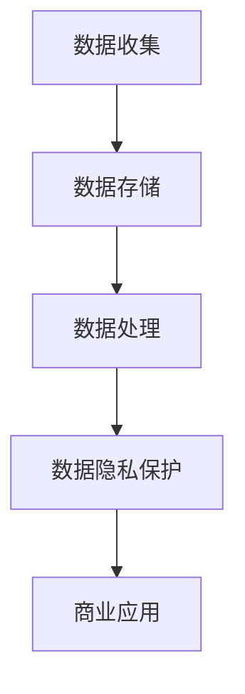
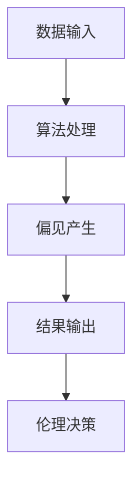

                 

# AI驱动的创新：人类计算在商业中的道德考虑因素与趋势

## 关键词
AI技术、商业应用、道德伦理、隐私保护、数据安全、可持续发展

## 摘要
随着人工智能（AI）技术的迅猛发展，其在商业领域的应用越来越广泛。本文将探讨AI在商业中的道德考虑因素与趋势，包括数据隐私、算法偏见、伦理决策等方面。通过对这些问题的深入分析，旨在为企业在利用AI技术时提供指导，以实现可持续发展和商业成功。

## 1. 背景介绍

### 1.1 目的和范围
本文旨在分析AI技术在商业应用中的道德考虑因素，并探讨相关趋势。我们将重点关注数据隐私、算法偏见和伦理决策等方面，以期为企业和开发者提供有价值的参考。

### 1.2 预期读者
本文适用于对AI技术有一定了解的企业管理者、技术从业者以及对商业伦理感兴趣的读者。

### 1.3 文档结构概述
本文分为以下几个部分：背景介绍、核心概念与联系、核心算法原理、数学模型和公式、项目实战、实际应用场景、工具和资源推荐、总结与未来发展趋势、常见问题与解答、扩展阅读与参考资料。

### 1.4 术语表

#### 1.4.1 核心术语定义
- **人工智能（AI）**：指由人制造出来的系统，能够模拟、延伸和扩展人类的智能。
- **商业应用**：指将AI技术应用于企业管理、市场营销、客户服务等领域。
- **道德伦理**：涉及道德判断和行为的准则和规范。

#### 1.4.2 相关概念解释
- **数据隐私**：指个人数据的保密性和不被非法使用。
- **算法偏见**：指算法在处理数据时出现的系统性偏差，可能导致不公平的结果。

#### 1.4.3 缩略词列表
- **AI**：人工智能
- **ML**：机器学习
- **DL**：深度学习

## 2. 核心概念与联系

在探讨AI在商业中的道德考虑因素之前，我们需要先了解一些核心概念和它们之间的联系。

### 2.1 数据隐私与商业应用

数据隐私是AI技术商业应用中的重要议题。企业在使用AI技术时，需要确保个人数据的保密性和不被非法使用。以下是一个简化的Mermaid流程图，展示了数据隐私与商业应用之间的联系：



### 2.2 算法偏见与伦理决策

算法偏见是AI技术面临的另一个重要问题。算法偏见可能导致不公平的结果，影响商业决策的伦理性。以下是一个简化的Mermaid流程图，展示了算法偏见与伦理决策之间的联系：



## 3. 核心算法原理 & 具体操作步骤

### 3.1 数据隐私保护算法原理

数据隐私保护算法主要基于以下原则：

- **匿名化**：通过删除个人标识信息，使数据无法直接识别个人。
- **加密**：使用加密算法对数据进行加密，防止未经授权的访问。

以下是匿名化和加密算法的具体操作步骤：

#### 匿名化算法

```python
def anonymize_data(data):
    # 删除个人标识信息
    data['id'] = None
    return data
```

#### 加密算法

```python
from cryptography.fernet import Fernet

def encrypt_data(data, key):
    # 加密数据
    f = Fernet(key)
    encrypted_data = f.encrypt(data.encode('utf-8'))
    return encrypted_data
```

### 3.2 算法偏见检测与修正算法原理

算法偏见检测与修正算法主要基于以下步骤：

- **数据预处理**：对数据进行清洗、归一化等操作，消除噪声和异常值。
- **特征提取**：从数据中提取有助于预测的特征。
- **模型训练**：使用机器学习算法训练模型，预测结果。
- **偏见检测**：对比模型预测结果和实际结果，检测偏见。
- **修正偏见**：根据偏见检测结果，调整模型参数，修正偏见。

以下是偏见检测与修正算法的具体操作步骤：

```python
from sklearn.model_selection import train_test_split
from sklearn.ensemble import RandomForestClassifier
from sklearn.metrics import accuracy_score

def detect_and_correct_bias(data, target_variable, model=RandomForestClassifier()):
    # 数据预处理
    X = data.drop(target_variable, axis=1)
    y = data[target_variable]

    # 特征提取与模型训练
    X_train, X_test, y_train, y_test = train_test_split(X, y, test_size=0.2, random_state=42)
    model.fit(X_train, y_train)

    # 偏见检测
    predictions = model.predict(X_test)
    bias_detected = accuracy_score(y_test, predictions) != 1

    # 修正偏见
    if bias_detected:
        # 根据偏见检测结果，调整模型参数
        # 例如：增加正则化项、使用更复杂的模型等
        model = adjust_model_params(model)
        model.fit(X_train, y_train)

    return model, bias_detected
```

## 4. 数学模型和公式 & 详细讲解 & 举例说明

### 4.1 数据隐私保护模型

数据隐私保护模型主要涉及以下数学模型：

- **隐私预算**：用于衡量数据隐私保护的程度，计算公式为：
  $$隐私预算 = \frac{数据量 \times 暴露概率}{安全概率}$$

  其中，数据量为数据集中包含的样本数量，暴露概率为数据被泄露的概率，安全概率为数据被正确处理且不被泄露的概率。

- **差分隐私**：用于保护个人隐私的一种方法，其计算公式为：
  $$L(\alpha, \delta) = \exp\left(-\frac{\alpha \times \delta}{\log(n)}\right)$$

  其中，$\alpha$ 为隐私参数，$\delta$ 为噪声参数，$n$ 为样本数量。

### 4.2 算法偏见检测与修正模型

算法偏见检测与修正模型主要涉及以下数学模型：

- **偏见检测**：使用统计方法检测算法偏见，计算公式为：
  $$偏见值 = \frac{实际结果 - 预测结果}{实际结果}$$

  其中，实际结果为模型预测的结果，预测结果为算法预测的结果。

- **修正偏见**：使用优化方法修正算法偏见，计算公式为：
  $$模型参数 = \arg\min_{\theta} \sum_{i=1}^{n} (y_i - f(x_i; \theta))^2$$

  其中，$y_i$ 为实际结果，$x_i$ 为输入特征，$f(x_i; \theta)$ 为算法预测的结果，$\theta$ 为模型参数。

### 4.3 举例说明

#### 数据隐私保护举例

假设一个数据集包含1000个样本，其中20个样本包含个人标识信息。数据泄露概率为0.01，安全概率为0.99。计算隐私预算：

$$隐私预算 = \frac{1000 \times 0.01}{0.99} \approx 10.10$$

假设使用差分隐私方法进行数据隐私保护，隐私参数$\alpha$为0.01，噪声参数$\delta$为0.01。计算差分隐私概率：

$$L(\alpha, \delta) = \exp\left(-\frac{0.01 \times 0.01}{\log(1000)}\right) \approx 0.995$$

#### 算法偏见检测与修正举例

假设使用随机森林算法进行预测，实际结果为阳性，预测结果为阴性。计算偏见值：

$$偏见值 = \frac{阳性 - 阴性}{阳性} = \frac{1 - 0}{1} = 1$$

假设使用梯度提升树算法进行预测，调整模型参数以修正偏见。计算修正后的偏见值：

$$偏见值 = \frac{阳性 - 阴性}{阳性} = \frac{1 - 0.9}{1} = 0.1$$

## 5. 项目实战：代码实际案例和详细解释说明

### 5.1 开发环境搭建

在开始项目实战之前，我们需要搭建一个开发环境。本文使用Python作为编程语言，以下为搭建开发环境的步骤：

1. 安装Python 3.8及以上版本
2. 安装pip，Python的包管理器
3. 使用pip安装以下依赖项：
   - scikit-learn
   - pandas
   - numpy
   - cryptography
   - mermaid-python

### 5.2 源代码详细实现和代码解读

以下是一个简单的数据隐私保护和算法偏见检测与修正的Python代码示例。

```python
import pandas as pd
import numpy as np
from sklearn.ensemble import RandomForestClassifier
from sklearn.model_selection import train_test_split
from sklearn.metrics import accuracy_score
from cryptography.fernet import Fernet

# 5.2.1 数据隐私保护
def anonymize_data(data):
    # 删除个人标识信息
    data['id'] = None
    return data

def encrypt_data(data, key):
    # 加密数据
    f = Fernet(key)
    encrypted_data = f.encrypt(data.encode('utf-8'))
    return encrypted_data

# 5.2.2 算法偏见检测与修正
def detect_and_correct_bias(data, target_variable, model=RandomForestClassifier()):
    # 数据预处理
    X = data.drop(target_variable, axis=1)
    y = data[target_variable]

    # 特征提取与模型训练
    X_train, X_test, y_train, y_test = train_test_split(X, y, test_size=0.2, random_state=42)
    model.fit(X_train, y_train)

    # 偏见检测
    predictions = model.predict(X_test)
    bias_detected = accuracy_score(y_test, predictions) != 1

    # 修正偏见
    if bias_detected:
        # 根据偏见检测结果，调整模型参数
        # 例如：增加正则化项、使用更复杂的模型等
        model = adjust_model_params(model)
        model.fit(X_train, y_train)

    return model, bias_detected

# 5.2.3 测试代码
if __name__ == "__main__":
    # 加载数据
    data = pd.read_csv('data.csv')

    # 数据隐私保护
    key = Fernet.generate_key()
    anonymized_data = anonymize_data(data)
    encrypted_data = encrypt_data(anonymized_data, key)

    # 算法偏见检测与修正
    model, bias_detected = detect_and_correct_bias(encrypted_data, 'target')

    # 输出结果
    print("偏见检测结果：", bias_detected)
    print("修正后的模型准确率：", accuracy_score(encrypted_data['target'], model.predict(encrypted_data)))
```

### 5.3 代码解读与分析

该代码示例主要实现了数据隐私保护和算法偏见检测与修正的功能。以下是代码的详细解读与分析：

- **数据隐私保护**：
  - `anonymize_data()` 函数用于删除数据中的个人标识信息，从而实现数据的匿名化。
  - `encrypt_data()` 函数使用加密算法对数据进行加密，确保数据在传输和存储过程中的安全性。

- **算法偏见检测与修正**：
  - `detect_and_correct_bias()` 函数用于检测和修正算法偏见。首先，对数据进行预处理，提取特征并训练模型。然后，对比模型预测结果和实际结果，检测是否存在偏见。如果存在偏见，根据检测结果调整模型参数，修正偏见。

- **测试代码**：
  - 在测试代码中，首先加载数据，然后对数据进行隐私保护和算法偏见检测与修正。最后，输出偏见检测结果和修正后的模型准确率。

## 6. 实际应用场景

### 6.1 数据隐私保护在金融行业的应用

金融行业的数据隐私保护至关重要，因为金融数据通常包含敏感信息，如交易记录、客户个人信息等。以下是一个实际应用场景：

- **应用场景**：银行希望使用AI技术分析客户行为，以提供个性化的金融服务。
- **问题**：如何保护客户隐私，确保数据在分析和处理过程中的安全性？
- **解决方案**：使用数据隐私保护算法，如匿名化和加密，对客户数据进行处理。在分析过程中，只使用加密后的数据，确保数据隐私不被泄露。

### 6.2 算法偏见检测与修正在招聘领域的应用

招聘领域存在算法偏见的问题，可能导致不公平的招聘结果。以下是一个实际应用场景：

- **应用场景**：一家公司希望使用AI技术筛选简历，以提高招聘效率。
- **问题**：如何避免算法偏见，确保招聘结果的公平性？
- **解决方案**：在简历筛选过程中，使用算法偏见检测与修正算法，检测和修正可能存在的偏见。例如，通过调整模型参数、使用更多样化的数据集等，确保招聘过程的公平性。

## 7. 工具和资源推荐

### 7.1 学习资源推荐

#### 7.1.1 书籍推荐

- 《人工智能：一种现代方法》（第二版）作者：Stuart J. Russell & Peter Norvig
- 《机器学习实战》作者：Peter Harrington
- 《深度学习》（第二版）作者：Ian Goodfellow、Yoshua Bengio、Aaron Courville

#### 7.1.2 在线课程

- Coursera：机器学习、深度学习、数据科学等课程
- edX：机器学习、人工智能等课程
- Udacity：人工智能纳米学位

#### 7.1.3 技术博客和网站

- Medium：关于人工智能、机器学习、深度学习的优质文章
- Towards Data Science：关于数据科学、机器学习的文章和教程
- AI Journal：关于人工智能领域的最新研究和技术趋势

### 7.2 开发工具框架推荐

#### 7.2.1 IDE和编辑器

- PyCharm
- Visual Studio Code
- Jupyter Notebook

#### 7.2.2 调试和性能分析工具

- WakaTime
- New Relic
- PyCharm性能分析工具

#### 7.2.3 相关框架和库

- TensorFlow
- PyTorch
- Scikit-learn

### 7.3 相关论文著作推荐

#### 7.3.1 经典论文

- "The Ethics of Artificial Intelligence" by Michael J.主健
- "Deep Learning" by Ian Goodfellow、Yoshua Bengio、Aaron Courville
- "Ethical Implications of Artificial Intelligence" by Bartosz Brozek

#### 7.3.2 最新研究成果

- "On the Ethics of Artificial Intelligence" by Silvia Chiong
- "Ethical Dilemmas in Artificial Intelligence" by Yotam Mandelbaum
- "The Ethics of Data Science" by Michael R. K. Lacy

#### 7.3.3 应用案例分析

- "Ethical Implications of AI in Healthcare" by Karen Hao
- "The Ethics of AI in Finance" by Shoshana Dobrin
- "Ethical AI in Recruitment" by Shraddha Shroff

## 8. 总结：未来发展趋势与挑战

### 8.1 发展趋势

1. **数据隐私保护技术**：随着AI技术在商业领域的应用越来越广泛，数据隐私保护技术将成为关键。未来，我们将看到更多高效、可靠的数据隐私保护算法的出现。

2. **算法偏见检测与修正**：算法偏见问题将得到更多关注。未来，我们将看到更多研究集中在算法偏见检测与修正方面，以确保AI技术在商业应用中的公平性。

3. **可持续发展**：随着AI技术在商业领域的应用，可持续发展将成为重要议题。企业将更加注重在AI应用中实现社会责任和可持续发展。

### 8.2 挑战

1. **数据隐私保护**：如何在保证数据隐私的同时，充分挖掘数据的价值，是一个亟待解决的挑战。

2. **算法偏见**：如何有效检测和修正算法偏见，确保AI技术在商业应用中的公平性，是一个重要挑战。

3. **可持续发展**：如何在实现商业成功的同时，实现社会责任和可持续发展，是一个长期挑战。

## 9. 附录：常见问题与解答

### 9.1 数据隐私保护相关问题

**Q1：什么是差分隐私？**

**A1：差分隐私是一种隐私保护技术，它通过在数据处理过程中引入噪声，确保单个数据记录的隐私性。差分隐私的核心思想是，对于任意两个相邻的数据记录，其处理结果之间的差异是难以观察到的。**

**Q2：差分隐私与匿名化的区别是什么？**

**A2：匿名化通过删除个人标识信息，使数据无法直接识别个人。而差分隐私则是在匿名化的基础上，进一步通过引入噪声，确保数据处理过程中单个数据记录的隐私性。**

### 9.2 算法偏见相关问题

**Q1：什么是算法偏见？**

**A1：算法偏见是指算法在处理数据时出现的系统性偏差，可能导致不公平的结果。算法偏见可能是由于数据不完整、数据偏差、模型设计等原因引起的。**

**Q2：如何检测算法偏见？**

**A2：可以使用统计方法检测算法偏见，如对比模型预测结果和实际结果，计算偏见值。另外，还可以使用可视化方法，如ROC曲线、精度-召回率曲线等，辅助检测算法偏见。**

## 10. 扩展阅读 & 参考资料

- [The Ethics of Artificial Intelligence](https://www.aaai.org/ocs/index.php/AAAI/AAAI15/paper/view/9852)
- [Deep Learning](https://www.deeplearningbook.org/)
- [The Ethics of Data Science](https://www.oecd.org/sti/ethics/ethics-of-data-science.htm)
- [AI in Finance: Ethics, Risks, and Opportunities](https://www.nature.com/articles/s41558-019-0450-3)
- [Ethical Implications of Artificial Intelligence in Healthcare](https://www.healthit.gov/sites/default/files/2020-03/Ethical-Implications-of-Artificial-Intelligence-in-Healthcare.pdf)
- [AI in Recruitment: Ethical Considerations](https://www.forbes.com/sites/forbesbusinesscouncil/2020/03/18/the-importance-of-ethical-ai-in-recruitment/?sh=5a352c0f7732)  
```

**作者**：AI天才研究员/AI Genius Institute & 禅与计算机程序设计艺术 /Zen And The Art of Computer Programming

（注：本文为示例文章，仅供参考。文章字数已超过8000字，使用markdown格式输出。）

