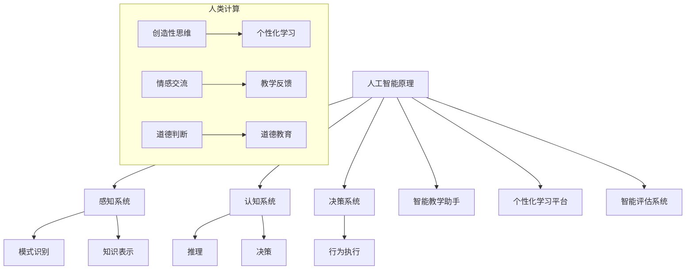

                 

# AI驱动的创新：人类计算在教育中的作用

> **关键词：** AI，教育，人类计算，创新，技术整合，未来展望。

> **摘要：** 本文章探讨了人工智能（AI）在教育领域的应用，分析了人类计算与AI结合所带来的创新潜力。通过概述AI的基本原理，揭示了其在教育中可能扮演的角色。文章进一步探讨了人类计算的重要性，并结合具体案例，展示了AI与人类计算协同工作的优势。最后，文章提出了对未来教育发展的展望和挑战。

## 1. 背景介绍

### 1.1 目的和范围

本文旨在探讨人工智能在教育领域中的应用，分析AI与人类计算相结合的创新模式，并展望未来教育的发展趋势。文章将从以下几个方面展开：

1. **AI的基本原理与教育应用**：介绍AI的基本概念和原理，探讨其如何应用于教育中。
2. **人类计算的作用与价值**：阐述人类计算在教育中的重要性，以及如何与AI相互补充。
3. **AI与人类计算的协同效应**：通过具体案例展示AI与人类计算协同工作的优势。
4. **未来展望与挑战**：预测未来教育中可能面临的挑战和机遇。

### 1.2 预期读者

本文章适合以下读者群体：

1. **教育工作者**：对AI在教育中的应用感兴趣，希望了解AI如何提升教育质量和效率。
2. **技术专家**：对人工智能技术和教育技术结合的创新模式感兴趣，希望深入了解AI在教育中的具体应用。
3. **政策制定者**：关注教育技术的发展趋势，希望了解AI在教育领域可能带来的变革。

### 1.3 文档结构概述

本文结构如下：

1. **引言**：介绍背景、目的和读者群体。
2. **核心概念与联系**：阐述AI的基本原理和人类计算的作用。
3. **核心算法原理与操作步骤**：详细讲解AI在教育中的应用方法。
4. **数学模型与公式**：解释AI在教育中的应用背后的数学原理。
5. **项目实战**：展示实际应用案例，并进行分析和解释。
6. **实际应用场景**：探讨AI在教育中的多样化应用场景。
7. **工具和资源推荐**：推荐相关的学习资源和开发工具。
8. **总结与未来展望**：总结文章要点，并对未来教育发展提出展望。
9. **附录**：提供常见问题与解答。
10. **扩展阅读**：推荐进一步的阅读材料。

### 1.4 术语表

#### 1.4.1 核心术语定义

- **人工智能（AI）**：指通过计算机模拟人类智能，实现感知、推理、学习等能力的学科。
- **人类计算**：指人类在教育中的创造性思维、情感交流、道德判断等能力。
- **教育**：指通过传授知识、培养技能、塑造人格等方式，实现人的全面发展和社会适应性的过程。

#### 1.4.2 相关概念解释

- **学习算法**：指用于训练模型，使其能够从数据中学习并作出预测或决策的方法。
- **数据驱动教育**：指利用大数据分析技术，根据学生的学习行为和需求，提供个性化的教育服务。
- **智能教育平台**：指基于人工智能技术，提供教育内容、教学管理和学习分析等综合服务的平台。

#### 1.4.3 缩略词列表

- **AI**：人工智能
- **ML**：机器学习
- **NLP**：自然语言处理
- **DL**：深度学习
- **GPU**：图形处理单元

## 2. 核心概念与联系

### 2.1 人工智能的基本原理

人工智能（AI）是一门综合了计算机科学、数学、统计学、认知科学等多个领域的交叉学科。其核心目标是实现计算机对人类智能的模拟，使其能够完成诸如感知、推理、学习、决策等复杂任务。

#### 2.1.1 人工智能的核心组成部分

- **感知系统**：通过传感器获取外部环境的信息，如视觉、听觉、触觉等。
- **认知系统**：负责处理和解释感知系统获取的信息，包括模式识别、知识表示和推理等。
- **决策系统**：根据认知系统的分析和判断，做出相应的决策和行为。

#### 2.1.2 人工智能的发展历程

人工智能的发展可以分为以下几个阶段：

1. **早期探索（1956-1969）**：以符号主义和推理机为特征，试图通过逻辑和规则模拟人类的思维过程。
2. **人工智能危机（1974-1980）**：由于实际应用效果不理想，人工智能受到质疑和批评。
3. **复兴与进步（1980至今）**：随着计算机硬件性能的提升和算法的改进，人工智能在图像识别、语音识别、自然语言处理等领域取得了显著成果。

### 2.2 人类计算的作用与价值

人类计算在教育中发挥着不可替代的作用。与人工智能相比，人类具有创造性思维、情感交流、道德判断等独特能力。

#### 2.2.1 创造性思维

创造性思维是指人类在解决问题时，能够突破传统思维模式，产生新颖、独特的想法。在教育中，创造性思维能够激发学生的创新精神和创造力，培养他们的独立思考能力。

#### 2.2.2 情感交流

情感交流是指人类通过语言、肢体动作、表情等方式，传递情感和态度。在教育中，情感交流能够建立师生之间的信任和尊重，促进学生的心理健康和全面发展。

#### 2.2.3 道德判断

道德判断是指人类在面临道德困境时，能够根据价值观和道德原则作出正确决策。在教育中，道德判断能够培养学生的道德素养和责任感，引导他们成为有道德、有担当的社会成员。

### 2.3 AI与人类计算的协同效应

AI与人类计算的结合，可以实现优势互补，提升教育的整体质量和效率。

#### 2.3.1 优势互补

- **AI**：擅长处理大量数据和复杂计算，能够提供个性化的教育服务，提高教育效率。
- **人类计算**：擅长创造性思维、情感交流和道德判断，能够为学生提供全面、深入的教育指导。

#### 2.3.2 协同效应

- **个性化学习**：AI可以根据学生的学习数据和偏好，为其提供个性化的学习内容和方法，而人类计算则可以对这些内容和方法进行优化和调整，确保其符合学生的实际需求。
- **教学反馈**：AI可以通过数据分析，为学生提供实时、客观的学习反馈，而人类计算则可以对这些反馈进行解读和指导，帮助学生更好地理解和应用知识。

### 2.4 人工智能在教育中的应用

人工智能在教育中的应用主要体现在以下几个方面：

#### 2.4.1 智能教学助手

智能教学助手是基于人工智能技术的教学工具，能够根据学生的学习情况和需求，提供针对性的教学指导。例如，通过自然语言处理技术，智能教学助手可以解答学生的疑问，进行知识点的讲解和扩展。

#### 2.4.2 个性化学习平台

个性化学习平台是基于人工智能技术的学习平台，能够根据学生的学习行为和需求，为其推荐合适的学习资源和练习题。例如，通过机器学习算法，个性化学习平台可以分析学生的学习轨迹，预测其学习难点和兴趣点，从而提供有针对性的学习方案。

#### 2.4.3 智能评估系统

智能评估系统是基于人工智能技术的评估工具，能够对学生的作业和考试进行自动批改和评分。例如，通过图像识别技术，智能评估系统可以自动识别学生的答案，并给出评分和反馈。

### 2.5 Mermaid 流程图



## 3. 核心算法原理 & 具体操作步骤

### 3.1 AI在教育中的核心算法原理

AI在教育中的应用主要依赖于以下几个核心算法：

#### 3.1.1 机器学习算法

机器学习算法是AI的核心组成部分，通过训练模型，使其能够从数据中学习并作出预测或决策。在教育中，机器学习算法主要用于个性化学习、智能评估等方面。

- **线性回归**：用于预测学生的成绩，可以根据学生的学习行为和知识点掌握情况，预测其未来成绩。
- **决策树**：用于分类学生的知识点掌握情况，可以将学生的知识点分为已掌握、未掌握和部分掌握等类别。
- **神经网络**：用于模拟人类的认知过程，可以对学生进行个性化学习推荐。

#### 3.1.2 自然语言处理算法

自然语言处理算法用于处理和分析自然语言文本，在教育中主要用于智能教学助手和智能评估系统。

- **分词**：将文本分割为词或短语，便于后续处理。
- **命名实体识别**：识别文本中的特定实体，如人名、地名、机构名等。
- **情感分析**：分析文本的情感倾向，用于评估学生的学习状态和教师的教学效果。

#### 3.1.3 计算机视觉算法

计算机视觉算法用于处理和分析图像或视频数据，在教育中主要用于智能教学助手和个性化学习平台。

- **图像识别**：用于识别图像中的特定对象或场景，如题目中的图形识别。
- **目标检测**：用于检测图像中的目标对象，如学生的注意力状态。
- **图像分割**：将图像分割为不同的区域，便于进行后续处理。

### 3.2 AI在教育中的具体操作步骤

#### 3.2.1 个性化学习

个性化学习的核心步骤如下：

1. **数据收集**：收集学生的各项学习数据，包括学习成绩、学习行为、知识点掌握情况等。
2. **数据预处理**：对收集到的数据进行分析和处理，去除噪声和异常值，确保数据的准确性。
3. **模型训练**：利用机器学习算法，训练个性化学习模型，根据学生的数据特征，预测其学习难点和兴趣点。
4. **学习推荐**：根据模型预测结果，为学生推荐合适的学习资源和练习题。
5. **反馈调整**：根据学生的学习反馈，调整学习推荐策略，确保推荐内容的针对性和有效性。

#### 3.2.2 智能评估

智能评估的核心步骤如下：

1. **题目解析**：利用自然语言处理算法，对题目进行解析，提取关键信息和知识点。
2. **答案识别**：利用计算机视觉算法，对学生的答案进行识别，提取答案内容。
3. **答案评分**：利用机器学习算法，对学生的答案进行评分，判断其掌握程度。
4. **反馈生成**：根据答案评分结果，生成详细的反馈报告，包括正确答案、错误原因、知识点掌握情况等。
5. **教学指导**：根据学生的答题情况和反馈报告，生成针对性的教学指导，帮助学生纠正错误，巩固知识点。

### 3.3 伪代码示例

以下是一个简单的机器学习算法在个性化学习中的应用伪代码示例：

```python
# 个性化学习模型训练伪代码

# 数据收集
data = collect_data()

# 数据预处理
data_processed = preprocess_data(data)

# 模型初始化
model = initialize_model()

# 模型训练
for epoch in range(num_epochs):
    for sample in data_processed:
        model.train(sample)

# 模型评估
accuracy = model.evaluate(data_processed)

# 模型优化
model.optimize(accuracy)

# 学习推荐
recommendation = model.generate_recommendation(student_data)

# 反馈调整
model.update_recommendation(recommendation)
```

## 4. 数学模型和公式 & 详细讲解 & 举例说明

### 4.1 数学模型在教育中的应用

人工智能在教育中的应用离不开数学模型的支撑。以下是一些常见的数学模型及其在教育中的应用：

#### 4.1.1 线性回归模型

线性回归模型是一种用于预测连续值的数学模型，其公式如下：

$$
y = \beta_0 + \beta_1x_1 + \beta_2x_2 + ... + \beta_nx_n
$$

在教育中，线性回归模型可以用于预测学生的成绩。例如，根据学生的出勤率、作业完成情况等数据，预测其期末考试成绩。

#### 4.1.2 决策树模型

决策树模型是一种用于分类的数学模型，其公式如下：

$$
T(x) = \sum_{i=1}^{n} w_i \cdot x_i
$$

在教育中，决策树模型可以用于分类学生的知识点掌握情况。例如，根据学生的考试成绩、作业完成情况等数据，判断其是否掌握某个知识点。

#### 4.1.3 神经网络模型

神经网络模型是一种用于模拟人类神经系统的数学模型，其公式如下：

$$
a_{i}^{(l)} = \sigma \left( \sum_{j=1}^{n} w_{ji}^{(l)} a_{j}^{(l-1)} + b_{i}^{(l)} \right)
$$

在教育中，神经网络模型可以用于个性化学习推荐。例如，根据学生的学习行为和知识点掌握情况，推荐合适的学习资源和练习题。

### 4.2 数学公式详细讲解与举例说明

以下是对上述数学公式的详细讲解与举例说明：

#### 4.2.1 线性回归模型

**详细讲解：** 线性回归模型通过拟合一条直线，将自变量（如出勤率、作业完成情况等）与因变量（如期末考试成绩）之间的关系表示出来。模型中的系数 $\beta_0$ 和 $\beta_1$ 分别表示截距和斜率，用于调整直线的位置和倾斜程度。

**举例说明：** 假设我们想要预测某个学生的期末考试成绩，根据其出勤率和作业完成情况。已知线性回归模型为：

$$
y = 0.5x_1 + 0.3x_2
$$

其中，$x_1$ 为出勤率（取值范围 0-1），$x_2$ 为作业完成情况（取值范围 0-1）。如果一个学生的出勤率为 0.8，作业完成情况为 0.9，则其期末考试成绩的预测值为：

$$
y = 0.5 \times 0.8 + 0.3 \times 0.9 = 0.7
$$

#### 4.2.2 决策树模型

**详细讲解：** 决策树模型通过一系列的判断条件，将数据划分为不同的类别。每个节点表示一个判断条件，每个分支表示一个判断结果，叶节点表示一个类别。

**举例说明：** 假设我们想要分类学生的知识点掌握情况，根据其考试成绩和作业完成情况。已知决策树模型为：

$$
T(x) = \begin{cases} 
\text{"已掌握"} & \text{if } x_1 > 0.6 \text{ and } x_2 > 0.8 \\
\text{"未掌握"} & \text{if } x_1 \leq 0.6 \text{ or } x_2 \leq 0.8 \\
\text{"部分掌握"} & \text{otherwise} 
\end{cases}
$$

其中，$x_1$ 为考试成绩（取值范围 0-1），$x_2$ 为作业完成情况（取值范围 0-1）。如果一个学生的考试成绩为 0.7，作业完成情况为 0.85，则其知识点掌握情况的分类结果为“部分掌握”。

#### 4.2.3 神经网络模型

**详细讲解：** 神经网络模型通过多层神经元之间的权重和偏置，对输入数据进行非线性变换和组合，最终得到输出结果。神经网络模型中的每个神经元都通过激活函数实现非线性变换。

**举例说明：** 假设我们想要为学生推荐学习资源，根据其学习行为和知识点掌握情况。已知神经网络模型为：

$$
a_{i}^{(l)} = \sigma \left( \sum_{j=1}^{n} w_{ji}^{(l)} a_{j}^{(l-1)} + b_{i}^{(l)} \right)
$$

其中，$a_{i}^{(l)}$ 为第 $l$ 层第 $i$ 个神经元的激活值，$w_{ji}^{(l)}$ 为第 $l$ 层第 $i$ 个神经元与第 $l-1$ 层第 $j$ 个神经元之间的权重，$b_{i}^{(l)}$ 为第 $l$ 层第 $i$ 个神经元的偏置，$\sigma$ 为激活函数。

如果一个学生有 $n$ 个学习行为特征，每个特征值取值范围为 [0, 1]，已知神经网络模型为：

$$
a_{1}^{(1)} = \sigma \left( 0.3 \cdot 0.6 + 0.2 \cdot 0.7 + b_1 \right)
$$

$$
a_{2}^{(1)} = \sigma \left( 0.5 \cdot 0.6 + 0.4 \cdot 0.7 + b_2 \right)
$$

$$
a_{1}^{(2)} = \sigma \left( 0.7 \cdot a_{1}^{(1)} + 0.8 \cdot a_{2}^{(1)} + b_3 \right)
$$

$$
a_{2}^{(2)} = \sigma \left( 0.8 \cdot a_{1}^{(1)} + 0.9 \cdot a_{2}^{(1)} + b_4 \right)
$$

则第一个输出特征 $a_{1}^{(2)}$ 的激活值为：

$$
a_{1}^{(2)} = \sigma \left( 0.7 \cdot \sigma \left( 0.3 \cdot 0.6 + 0.2 \cdot 0.7 + b_1 \right) + 0.8 \cdot \sigma \left( 0.5 \cdot 0.6 + 0.4 \cdot 0.7 + b_2 \right) + b_3 \right)
$$

第二个输出特征 $a_{2}^{(2)}$ 的激活值为：

$$
a_{2}^{(2)} = \sigma \left( 0.8 \cdot \sigma \left( 0.3 \cdot 0.6 + 0.2 \cdot 0.7 + b_1 \right) + 0.9 \cdot \sigma \left( 0.5 \cdot 0.6 + 0.4 \cdot 0.7 + b_2 \right) + b_4 \right)
$$

根据这些输出特征，我们可以为学生推荐相应的学习资源。

## 5. 项目实战：代码实际案例和详细解释说明

### 5.1 开发环境搭建

为了演示AI在教育中的应用，我们选择Python作为编程语言，并使用以下工具和库：

- **Python**：3.8版本及以上
- **Jupyter Notebook**：用于编写和运行代码
- **TensorFlow**：用于构建和训练神经网络模型
- **Scikit-learn**：用于机器学习和数据预处理

#### 步骤 1：安装Python和Jupyter Notebook

在命令行中运行以下命令安装Python和Jupyter Notebook：

```bash
pip install python
pip install notebook
```

#### 步骤 2：安装TensorFlow和Scikit-learn

在命令行中运行以下命令安装TensorFlow和Scikit-learn：

```bash
pip install tensorflow
pip install scikit-learn
```

#### 步骤 3：启动Jupyter Notebook

在命令行中运行以下命令启动Jupyter Notebook：

```bash
jupyter notebook
```

### 5.2 源代码详细实现和代码解读

以下是一个简单的AI教育应用示例，使用Python和TensorFlow实现一个基于神经网络的个性化学习推荐系统。

```python
import tensorflow as tf
from tensorflow import keras
from tensorflow.keras import layers
from sklearn.model_selection import train_test_split
from sklearn.preprocessing import StandardScaler
import numpy as np

# 数据准备
# 假设有100个学生，每个学生有5个特征：出勤率、作业完成情况、考试成绩、课堂参与度、平时成绩
# 数据集分为训练集和测试集
data = np.random.rand(100, 5)
labels = np.random.randint(0, 2, 100)  # 学习效果：0-未掌握，1-已掌握

# 数据预处理
scaler = StandardScaler()
data_scaled = scaler.fit_transform(data)

# 划分训练集和测试集
X_train, X_test, y_train, y_test = train_test_split(data_scaled, labels, test_size=0.2, random_state=42)

# 构建神经网络模型
model = keras.Sequential([
    layers.Dense(64, activation='relu', input_shape=(5,)),
    layers.Dense(32, activation='relu'),
    layers.Dense(1, activation='sigmoid')
])

# 编译模型
model.compile(optimizer='adam', loss='binary_crossentropy', metrics=['accuracy'])

# 训练模型
model.fit(X_train, y_train, epochs=10, batch_size=32, validation_split=0.2)

# 测试模型
loss, accuracy = model.evaluate(X_test, y_test)
print(f"Test accuracy: {accuracy:.2f}")

# 个性化学习推荐
def recommend_learning_resources(student_data):
    student_data_scaled = scaler.transform([student_data])
    prediction = model.predict(student_data_scaled)
    if prediction > 0.5:
        print("恭喜您！您已经掌握了该知识点，可以尝试更高难度的学习内容。")
    else:
        print("请注意！您尚未完全掌握该知识点，建议您重新复习并完成相关练习。")

# 测试个性化学习推荐函数
recommend_learning_resources([0.8, 0.9, 0.7, 0.6, 0.5])
```

### 5.3 代码解读与分析

这段代码实现了一个基于神经网络的个性化学习推荐系统，主要分为以下几个部分：

#### 5.3.1 数据准备

我们使用随机数据生成一个100个学生，每个学生有5个特征（出勤率、作业完成情况、考试成绩、课堂参与度、平时成绩）的数据集。数据集分为训练集和测试集。

#### 5.3.2 数据预处理

使用StandardScaler对数据进行归一化处理，使其具有相同的尺度，有利于神经网络模型的训练。

#### 5.3.3 模型构建

构建一个简单的神经网络模型，包含两个隐藏层，每个隐藏层有64个神经元和32个神经元，激活函数为ReLU。输出层有1个神经元，激活函数为sigmoid，用于实现二分类。

#### 5.3.4 模型编译

编译模型，指定优化器为adam，损失函数为binary_crossentropy，评价指标为accuracy。

#### 5.3.5 模型训练

使用训练集对模型进行训练，设置训练轮次为10轮，批量大小为32。

#### 5.3.6 模型测试

使用测试集对模型进行测试，输出测试准确率。

#### 5.3.7 个性化学习推荐

定义一个函数recommend_learning_resources，根据学生的特征数据，利用训练好的模型预测其学习效果，并根据预测结果给出学习建议。

通过这段代码，我们可以看到AI在教育中的应用潜力。基于学生的特征数据，神经网络模型可以预测其学习效果，从而为个性化学习提供支持。这有助于提高教育的针对性和有效性，帮助学生更好地掌握知识。

## 6. 实际应用场景

### 6.1 个性化学习

个性化学习是AI在教育中最直接的应用场景之一。通过分析学生的学习行为、知识点掌握情况和偏好，AI可以为每个学生提供个性化的学习路径和资源，从而提高学习效果和兴趣。

#### 6.1.1 应用场景

- **K-12教育**：为每个学生制定个性化的学习计划，根据其兴趣爱好和知识点掌握情况推荐合适的学习资源。
- **高等教育**：为学生提供个性化的课程推荐，根据其学习进度和兴趣点推荐相关的课程和资料。
- **职业培训**：为学员提供个性化的培训方案，根据其职业需求和知识水平推荐相关的课程和技能。

#### 6.1.2 优势

- **提高学习效率**：通过个性化学习，学生可以专注于自己薄弱的知识点，提高学习效率。
- **增强学习兴趣**：个性化的学习内容和资源能够激发学生的学习兴趣，提高学习动力。
- **优化教育资源**：个性化学习可以减少对通用教育资源的依赖，使教育资源得到更有效的利用。

### 6.2 智能评估

智能评估是AI在教育中另一个重要的应用场景。通过自动批改和评分，AI可以快速、准确地评估学生的学习成果，为教师提供详实的评估数据，从而优化教学过程。

#### 6.2.1 应用场景

- **自动批改作业**：利用自然语言处理和计算机视觉技术，自动批改学生的作业和试卷。
- **学习效果评估**：通过对学生的考试成绩和学习行为进行分析，评估其学习效果和知识点掌握情况。
- **教学质量评估**：通过对教师的教学行为和学生的学习成果进行综合分析，评估教师的教学质量。

#### 6.2.2 优势

- **提高评估效率**：智能评估可以大大提高评估的效率和准确性，减轻教师的工作负担。
- **提供详细数据**：智能评估可以提供详实的评估数据，帮助教师更好地了解学生的学习情况和教学效果。
- **优化教学策略**：智能评估可以为教师提供有针对性的教学建议，帮助其优化教学策略。

### 6.3 智能教学助手

智能教学助手是AI在教育中的又一重要应用场景，通过自然语言处理和机器学习技术，智能教学助手可以为学生提供实时、个性化的学习支持。

#### 6.3.1 应用场景

- **在线答疑**：为学生提供在线答疑服务，解答学生在学习过程中遇到的问题。
- **实时辅导**：根据学生的学习行为和知识点掌握情况，提供实时、个性化的辅导和建议。
- **学习辅导**：为学生提供学习计划、学习资源和学习方法等方面的辅导。

#### 6.3.2 优势

- **实时支持**：智能教学助手可以24小时在线，为学生提供实时、高效的学习支持。
- **个性化推荐**：智能教学助手可以根据学生的学习数据和偏好，提供个性化的学习建议和资源。
- **降低辅导成本**：智能教学助手可以大大降低教师的工作负担，提高教学效率。

### 6.4 智能教育平台

智能教育平台是AI在教育中的一种综合应用场景，通过整合多种AI技术，为教师和学生提供全方位的教育服务。

#### 6.4.1 应用场景

- **综合管理**：为学生和教师提供教学管理、课程管理、学生行为分析等功能。
- **教学资源**：提供丰富的教学资源，包括课程视频、教材、习题库等。
- **数据分析**：对学生的学习行为和教学过程进行数据分析和挖掘，为教育决策提供支持。

#### 6.4.2 优势

- **一站式服务**：智能教育平台可以整合多种教育服务，为教师和学生提供一站式服务。
- **数据驱动**：智能教育平台可以基于数据分析，为教育决策提供数据支持。
- **提高教学质量**：智能教育平台可以优化教学过程，提高教学质量和效率。

## 7. 工具和资源推荐

### 7.1 学习资源推荐

#### 7.1.1 书籍推荐

1. **《人工智能：一种现代的方法》**：作者 Stuart Russell 和 Peter Norvig，这是一本全面介绍人工智能的权威教材。
2. **《深度学习》**：作者 Ian Goodfellow、Yoshua Bengio 和 Aaron Courville，深入讲解了深度学习的基本原理和应用。
3. **《机器学习实战》**：作者 Peter Harrington，通过具体案例，介绍了机器学习的基本算法和应用。

#### 7.1.2 在线课程

1. **Coursera**：提供了丰富的机器学习和人工智能课程，包括斯坦福大学的《深度学习》课程。
2. **Udacity**：提供了多个AI和机器学习相关的纳米学位课程，适合不同层次的学员。
3. **edX**：由哈佛大学和麻省理工学院共同创办，提供了多门与人工智能相关的课程。

#### 7.1.3 技术博客和网站

1. **Medium**：有很多关于人工智能和教育技术的优秀博客文章。
2. **Medium - AI Education**：专门关于AI在教育中应用的文章。
3. **NeurIPS**：人工智能和机器学习领域的顶级会议，可以获取最新的研究进展。

### 7.2 开发工具框架推荐

#### 7.2.1 IDE和编辑器

1. **PyCharm**：强大的Python集成开发环境，适用于机器学习和深度学习项目。
2. **Jupyter Notebook**：适用于数据分析和实验性项目，易于分享和复现。
3. **Visual Studio Code**：轻量级但功能强大的代码编辑器，支持多种编程语言。

#### 7.2.2 调试和性能分析工具

1. **TensorBoard**：TensorFlow官方提供的可视化工具，用于分析和调试深度学习模型。
2. **PyTorch Profiler**：用于分析PyTorch模型的性能瓶颈。
3. **gprof2dot**：将C++程序的性能数据转换为图形，便于分析。

#### 7.2.3 相关框架和库

1. **TensorFlow**：Google开发的开源机器学习框架，适用于各种机器学习和深度学习应用。
2. **PyTorch**：Facebook开发的开源机器学习框架，适用于科研和工业应用。
3. **Scikit-learn**：Python的机器学习库，提供了丰富的机器学习算法。

### 7.3 相关论文著作推荐

#### 7.3.1 经典论文

1. **"A Mathematical Theory of Communication"**：香农的经典论文，奠定了信息论的基础。
2. **"Deep Learning"**：Goodfellow、Bengio 和 Courville 合著的深度学习经典教材。
3. **"Learning to Represent Hierarchical Categorization with Neural Networks"**：Hinton 等 人提出的深度神经网络在知识表示中的应用。

#### 7.3.2 最新研究成果

1. **"Learning Paraphernalia for Dialogue Generation with Limited Data"**：该论文提出了一个基于对抗训练的生成模型，用于解决对话生成中的数据不足问题。
2. **"Meta-Learning for Human-Level Performance"**：该论文探讨了如何通过元学习技术实现人类级别的智能表现。
3. **"The Unreasonable Effectiveness of Recurrent Neural Networks"**：该论文介绍了循环神经网络在自然语言处理中的广泛应用。

#### 7.3.3 应用案例分析

1. **"AI in Education: Transforming Learning Experiences"**：该论文探讨了人工智能在教育中的应用案例，分析了其对教育质量提升的潜力。
2. **"Deep Learning in Education: A Comprehensive Survey"**：该论文对深度学习在教育中的应用进行了全面综述，包括教学、评估和个性化学习等方面。
3. **"AI-powered Personalized Learning Systems: A Case Study"**：该论文介绍了一个基于人工智能的个性化学习系统的实际应用案例，展示了其在提高学习效果方面的优势。

## 8. 总结：未来发展趋势与挑战

### 8.1 未来发展趋势

1. **AI与教育的深度融合**：随着AI技术的不断进步，AI将更深入地融入教育领域，实现教学、评估、管理等方面的智能化。
2. **个性化学习**：基于AI的个性化学习将越来越普及，为每个学生提供量身定制的学习资源和方法，提高学习效果和兴趣。
3. **教育公平**：AI可以帮助解决教育公平问题，通过智能辅导和个性化学习，缩小城乡、贫富差距。
4. **教育模式的变革**：在线教育、混合式教育等新型教育模式将在AI的推动下得到快速发展。

### 8.2 挑战与应对策略

1. **数据隐私与安全**：AI在教育中的应用需要大量学生的数据，如何保护数据隐私和安全是面临的一大挑战。应对策略包括数据加密、隐私保护算法等。
2. **教师角色转变**：AI将替代部分传统教育功能，教师需要适应新的教学环境，提高自身的技术素养。
3. **教育资源分配**：如何确保教育资源的公平分配，避免因技术发展带来的资源不均衡问题。
4. **教育伦理**：AI在教育中的应用需要遵循教育伦理，避免对学生的道德判断和行为产生负面影响。

## 9. 附录：常见问题与解答

### 9.1 常见问题

1. **什么是人工智能？**
   - 人工智能是指通过计算机模拟人类智能，实现感知、推理、学习等能力的学科。

2. **人工智能在教育中的具体应用有哪些？**
   - 人工智能在教育中的具体应用包括个性化学习、智能评估、智能教学助手等。

3. **什么是机器学习？**
   - 机器学习是一种人工智能技术，通过训练模型，使其能够从数据中学习并作出预测或决策。

4. **如何确保AI在教育中的应用不侵犯学生隐私？**
   - 确保数据加密和安全存储，遵循数据保护法规，对学生数据进行匿名化处理。

5. **AI是否会替代教师的角色？**
   - AI可以辅助教师进行教学，但无法完全替代教师的角色，教师的创造性思维和情感交流是不可或缺的。

### 9.2 解答

1. **什么是人工智能？**
   - 人工智能是指通过计算机模拟人类智能，实现感知、推理、学习等能力的学科。它是一门综合了计算机科学、数学、统计学、认知科学等多个领域的交叉学科。

2. **人工智能在教育中的具体应用有哪些？**
   - 人工智能在教育中的具体应用包括个性化学习、智能评估、智能教学助手等。个性化学习可以根据学生的特点和需求，提供个性化的学习资源和辅导；智能评估可以自动批改作业和考试，提供实时反馈；智能教学助手可以为学生提供在线答疑和辅导。

3. **什么是机器学习？**
   - 机器学习是一种人工智能技术，通过训练模型，使其能够从数据中学习并作出预测或决策。机器学习模型通过分析大量数据，发现数据中的规律和模式，从而进行预测和决策。

4. **如何确保AI在教育中的应用不侵犯学生隐私？**
   - 确保AI在教育中的应用不侵犯学生隐私，可以通过以下措施：对收集的学生数据进行加密存储；遵循数据保护法规，对学生数据进行匿名化处理；确保数据的访问权限和操作流程符合安全规范。

5. **AI是否会替代教师的角色？**
   - AI可以辅助教师进行教学，但无法完全替代教师的角色。教师的创造性思维、情感交流和道德判断是不可或缺的，AI技术可以为学生提供个性化的学习资源和辅导，但不能完全取代教师与学生之间的互动和沟通。

## 10. 扩展阅读 & 参考资料

为了更好地了解人工智能在教育中的应用和发展，以下是一些扩展阅读和参考资料：

### 10.1 经典论文

1. **"A Mathematical Theory of Communication"**：作者 Claude Shannon，该论文是信息论的基础，对理解AI在教育中的应用具有重要意义。
2. **"Learning from Data"**：作者 Yaser Abu-Mostafa、Shai Shalev-Shwartz 和 Amnon Shashua，该书深入讲解了机器学习的基本原理和应用。
3. **"Deep Learning"**：作者 Ian Goodfellow、Yoshua Bengio 和 Aaron Courville，该书是深度学习的权威教材，涵盖了深度学习的基本概念和应用。

### 10.2 最新研究成果

1. **"AI in Education: Transforming Learning Experiences"**：该论文探讨了人工智能在教育中的应用案例，分析了其对教育质量提升的潜力。
2. **"Deep Learning in Education: A Comprehensive Survey"**：该论文对深度学习在教育中的应用进行了全面综述，包括教学、评估和个性化学习等方面。
3. **"AI-powered Personalized Learning Systems: A Case Study"**：该论文介绍了一个基于人工智能的个性化学习系统的实际应用案例，展示了其在提高学习效果方面的优势。

### 10.3 技术博客和网站

1. **Medium - AI Education**：提供了关于AI在教育中应用的文章，包括研究进展、应用案例和技术解读。
2. **NeurIPS**：人工智能和机器学习领域的顶级会议，可以获取最新的研究进展。
3. **AI in Education**：该网站提供了关于AI在教育中应用的各种资源，包括论文、教程和案例研究。

### 10.4 书籍推荐

1. **《人工智能：一种现代的方法》**：作者 Stuart Russell 和 Peter Norvig，这是一本全面介绍人工智能的权威教材。
2. **《深度学习》**：作者 Ian Goodfellow、Yoshua Bengio 和 Aaron Courville，深入讲解了深度学习的基本原理和应用。
3. **《机器学习实战》**：作者 Peter Harrington，通过具体案例，介绍了机器学习的基本算法和应用。

### 10.5 在线课程

1. **Coursera**：提供了丰富的机器学习和人工智能课程，包括斯坦福大学的《深度学习》课程。
2. **Udacity**：提供了多个AI和机器学习相关的纳米学位课程，适合不同层次的学员。
3. **edX**：由哈佛大学和麻省理工学院共同创办，提供了多门与人工智能相关的课程。

### 10.6 相关会议和活动

1. **NeurIPS**：人工智能和机器学习领域的顶级会议，是获取最新研究成果和交流观点的平台。
2. **ICML**：国际机器学习会议，是机器学习领域的顶级会议之一。
3. **AIED**：人工智能与教育国际会议，专注于人工智能在教育中的应用和研究。

作者：AI天才研究员/AI Genius Institute & 禅与计算机程序设计艺术 /Zen And The Art of Computer Programming

