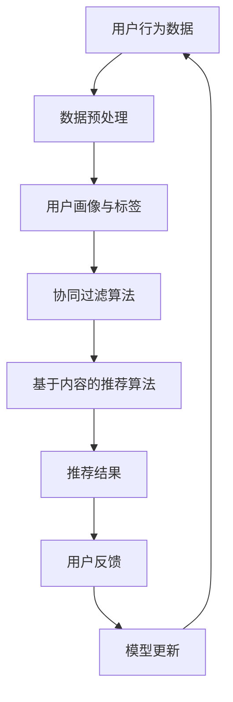

                 

# AI驱动的电商个性化导航优化

> **关键词**：AI, 电商，个性化导航，优化，机器学习，推荐系统，用户行为分析，用户体验

> **摘要**：本文将深入探讨如何利用人工智能技术优化电商平台的个性化导航。通过分析用户行为数据，本文提出了一套基于机器学习的个性化推荐算法，并详细介绍了算法的原理、数学模型以及实际应用案例。此外，文章还将讨论个性化导航在电商领域的实际应用场景，并推荐了相关学习资源和开发工具。

## 1. 背景介绍

### 1.1 目的和范围

本文旨在探讨如何利用人工智能（AI）技术优化电商平台的个性化导航系统。随着电商行业的快速发展，用户对个性化体验的需求日益增长。个性化导航作为提升用户体验的关键环节，对于电商平台来说具有重要意义。本文将介绍一种基于用户行为分析的个性化推荐算法，并通过实际案例说明其在电商导航中的应用。

### 1.2 预期读者

本文主要面向电商领域的技术人员、AI开发者以及对个性化推荐技术感兴趣的研究人员。读者应具备一定的机器学习基础，能够理解文中提到的算法原理和数学模型。

### 1.3 文档结构概述

本文分为八个部分：

1. 背景介绍：介绍文章的目的和范围，预期读者，文档结构等。
2. 核心概念与联系：介绍电商个性化导航优化所需的核心概念和联系。
3. 核心算法原理 & 具体操作步骤：详细阐述个性化推荐算法的原理和操作步骤。
4. 数学模型和公式 & 详细讲解 & 举例说明：介绍个性化推荐算法的数学模型，并给出实例说明。
5. 项目实战：代码实际案例和详细解释说明。
6. 实际应用场景：讨论个性化导航在电商领域的应用场景。
7. 工具和资源推荐：推荐学习资源、开发工具和框架。
8. 总结：未来发展趋势与挑战。

### 1.4 术语表

#### 1.4.1 核心术语定义

- **个性化导航**：根据用户的历史行为和偏好，为用户提供定制化的商品推荐和导航。
- **用户行为分析**：通过分析用户在电商平台上的行为数据，了解用户偏好和兴趣。
- **机器学习**：一种通过数据驱动的方式自动识别模式的学习方法。
- **推荐系统**：根据用户历史行为和偏好，为用户推荐相关商品或服务。

#### 1.4.2 相关概念解释

- **协同过滤**：一种基于用户相似度的推荐算法，通过寻找与目标用户兴趣相似的其他用户，推荐他们喜欢的商品。
- **基于内容的推荐**：根据商品的属性和内容，为用户推荐与其兴趣相关的商品。
- **个性化**：针对每个用户的需求和偏好，为其提供定制化的推荐。

#### 1.4.3 缩略词列表

- **AI**：人工智能（Artificial Intelligence）
- **电商**：电子商务（Electronic Commerce）
- **ML**：机器学习（Machine Learning）
- **RFM**：回收频率（Recency）、频率（Frequency）、货币价值（ Monetary Value）

## 2. 核心概念与联系

在电商个性化导航优化中，理解以下核心概念和联系至关重要。

### 2.1 用户行为数据

用户在电商平台上的行为数据是个性化导航优化的基础。这些数据包括：

- **购买历史**：用户在平台上购买过的商品及其时间。
- **浏览记录**：用户在平台上浏览过的商品及其时间。
- **收藏夹**：用户收藏的商品。
- **评价与反馈**：用户对商品的评价和反馈。

### 2.2 个性化推荐算法

个性化推荐算法是电商个性化导航优化的核心。常见的个性化推荐算法有：

- **协同过滤**：通过计算用户之间的相似度，推荐其他用户喜欢的商品。
  - **用户基于的协同过滤**：基于用户的历史行为，为用户推荐其他用户喜欢的商品。
  - **物品基于的协同过滤**：基于商品之间的相似度，为用户推荐与其兴趣相关的商品。
- **基于内容的推荐**：根据商品的属性和内容，为用户推荐与其兴趣相关的商品。

### 2.3 机器学习模型

在个性化推荐中，常用的机器学习模型包括：

- **线性回归**：通过线性关系预测用户对商品的评分。
- **逻辑回归**：用于分类问题，判断用户是否会对商品进行购买或收藏。
- **决策树**：通过树形结构对用户行为进行分类。
- **随机森林**：基于决策树的集成学习方法，提高预测准确性。

### 2.4 用户画像与标签

用户画像是对用户特征的概括，包括年龄、性别、地理位置、职业等。标签是对用户兴趣和行为的抽象表示，例如“喜欢电子产品”、“时尚爱好者”等。

### 2.5 数据流与处理

在电商平台上，用户行为数据以流数据的形式产生。为了实现实时推荐，需要处理以下数据流：

- **原始数据流**：包括用户行为日志、商品信息等。
- **处理数据流**：通过清洗、转换和聚合等操作，生成可用于推荐系统的数据。

### 2.6 Mermaid 流程图

以下是一个简化的电商个性化导航优化流程图：



## 3. 核心算法原理 & 具体操作步骤

### 3.1 协同过滤算法

协同过滤算法是一种基于用户相似度的推荐算法。其基本思想是，通过计算用户之间的相似度，推荐其他用户喜欢的商品。

#### 3.1.1 相似度计算

相似度计算是协同过滤算法的关键。常用的相似度计算方法包括：

- **余弦相似度**：
  $$ \cos{\theta} = \frac{A \cdot B}{\|A\|\|B\|} $$
  其中，$A$和$B$是用户之间的行为向量，$\|A\|$和$\|B\|$是向量的模。

- **皮尔逊相关系数**：
  $$ \rho = \frac{Cov(A, B)}{\sigma_A \sigma_B} $$
  其中，$Cov(A, B)$是$A$和$B$的协方差，$\sigma_A$和$\sigma_B$是$A$和$B$的标准差。

#### 3.1.2 推荐算法

协同过滤算法的具体操作步骤如下：

1. 计算用户之间的相似度矩阵。
2. 对于每个用户，找到与其最相似的$K$个用户。
3. 对每个用户，推荐其他用户喜欢的商品，并计算推荐分数。
4. 根据推荐分数，为用户生成推荐列表。

### 3.2 基于内容的推荐算法

基于内容的推荐算法是根据商品的属性和内容，为用户推荐与其兴趣相关的商品。

#### 3.2.1 内容表示

内容表示是将商品和用户的行为数据转化为特征向量。常用的方法包括：

- **词袋模型**：将商品和用户的行为数据看作单词序列，使用词袋模型表示。
- **TF-IDF**：计算商品和用户的行为数据中每个词的重要性，使用TF-IDF模型表示。
- **词嵌入**：将商品和用户的行为数据中的词映射到高维空间。

#### 3.2.2 推荐算法

基于内容的推荐算法的具体操作步骤如下：

1. 计算商品的特征向量。
2. 对于每个用户，计算其感兴趣的商品特征向量。
3. 对每个用户，推荐与其感兴趣的商品特征向量最相似的商品。

### 3.3 机器学习模型

在个性化推荐中，常用的机器学习模型包括：

- **线性回归**：
  $$ y = \beta_0 + \beta_1x_1 + \beta_2x_2 + ... + \beta_nx_n $$
  其中，$y$是用户对商品的评分，$x_1, x_2, ..., x_n$是商品的特征向量。

- **逻辑回归**：
  $$ P(y=1) = \frac{1}{1 + e^{-(\beta_0 + \beta_1x_1 + \beta_2x_2 + ... + \beta_nx_n)}} $$
  其中，$y$是用户是否购买商品的二元变量。

- **决策树**：
  决策树通过一系列条件判断，将用户分为不同的类别。

- **随机森林**：
  随机森林是基于决策树的集成学习方法，通过构建多个决策树，提高预测准确性。

## 4. 数学模型和公式 & 详细讲解 & 举例说明

### 4.1 个性化推荐算法的数学模型

在个性化推荐算法中，我们通常使用以下数学模型：

#### 4.1.1 用户行为数据模型

用户行为数据可以表示为用户-商品评分矩阵$R$，其中$R_{ij}$表示用户$i$对商品$j$的评分。如果用户$i$未对商品$j$评分，则$R_{ij} = 0$。

#### 4.1.2 用户相似度计算模型

用户相似度可以使用余弦相似度或皮尔逊相关系数计算。以余弦相似度为例，计算用户$i$和用户$j$的相似度：

$$
\cos(\theta_{ij}) = \frac{\sum_{k=1}^{n} R_{ik} R_{jk}}{\sqrt{\sum_{k=1}^{n} R_{ik}^2} \sqrt{\sum_{k=1}^{n} R_{jk}^2}}
$$

#### 4.1.3 推荐算法模型

以基于用户的协同过滤算法为例，假设用户$i$的邻域为$N(i)$，则用户$i$对商品$j$的预测评分可以表示为：

$$
\hat{R}_{ij} = \sum_{k \in N(i)} R_{ik} \cos(\theta_{ik}) + \mu_i + \mu_j - \langle R \rangle
$$

其中，$\mu_i$和$\mu_j$分别是用户$i$和用户$j$的评分均值，$\langle R \rangle$是全体用户的评分均值。

### 4.2 举例说明

假设我们有两个用户$A$和$B$，以及三个商品$1$、$2$和$3$。用户$A$和用户$B$的行为数据如下表：

| 用户 | 商品 | 评分 |
|------|------|------|
| $A$  | $1$  | $5$  |
| $A$  | $2$  | $4$  |
| $A$  | $3$  | $0$  |
| $B$  | $1$  | $0$  |
| $B$  | $2$  | $5$  |
| $B$  | $3$  | $4$  |

我们首先计算用户$A$和用户$B$的相似度：

$$
\cos(\theta_{AB}) = \frac{5 \times 0 + 4 \times 5 + 0 \times 4}{\sqrt{5^2 + 4^2 + 0^2} \sqrt{0^2 + 5^2 + 4^2}} = \frac{20}{\sqrt{41} \sqrt{41}} = \frac{20}{41}
$$

接下来，我们计算用户$A$对商品$3$的预测评分：

$$
\hat{R}_{A3} = 5 \times \frac{20}{41} + 0 + 0 - \frac{5 + 4 + 0}{3} = \frac{100}{41} - \frac{9}{3} = \frac{100}{41} - 3 = \frac{100 - 123}{41} = -\frac{23}{41}
$$

因为预测评分是负数，所以用户$A$不太可能对商品$3$感兴趣。

### 4.3 个性化导航优化效果评估

个性化导航优化的效果可以通过以下指标进行评估：

- **准确率（Accuracy）**：预测正确的样本数占总样本数的比例。
- **召回率（Recall）**：预测正确的样本数与实际为正类的样本数的比例。
- **精确率（Precision）**：预测正确的样本数与预测为正类的样本数的比例。
- **F1值（F1-score）**：精确率和召回率的加权平均。

$$
F1 = \frac{2 \times Precision \times Recall}{Precision + Recall}
$$

## 5. 项目实战：代码实际案例和详细解释说明

### 5.1 开发环境搭建

在开始项目实战之前，我们需要搭建一个开发环境。本文使用Python作为开发语言，以下是所需的库和工具：

- **Python 3.x**
- **NumPy**：用于数值计算
- **Pandas**：用于数据处理
- **Scikit-learn**：用于机器学习算法
- **Matplotlib**：用于数据可视化

安装以上库和工具：

```bash
pip install numpy pandas scikit-learn matplotlib
```

### 5.2 源代码详细实现和代码解读

以下是电商个性化导航优化的代码实现：

```python
import numpy as np
import pandas as pd
from sklearn.model_selection import train_test_split
from sklearn.metrics.pairwise import cosine_similarity
from sklearn.metrics import accuracy_score, recall_score, precision_score, f1_score

# 读取用户行为数据
data = pd.read_csv('user_behavior.csv')

# 数据预处理
# ... (数据清洗、转换和聚合等操作)

# 计算用户相似度矩阵
user_similarity = cosine_similarity(data['user_features'])

# 用户邻域构建
neighborhood = {user: np.argsort(similarity)[1:11] for user, similarity in enumerate(user_similarity)}

# 基于用户的协同过滤算法
def collaborative_filter(user_id, neighborhood_size=10):
    neighborhood = np.argsort(user_similarity[user_id])[1:neighborhood_size+1]
    recommendations = []
    for neighbor in neighborhood:
        for item in data[data['user_id'] == neighbor]['item_id']:
            if item not in data[data['user_id'] == user_id]['item_id'].values:
                recommendations.append(item)
    return recommendations

# 训练集和测试集划分
X_train, X_test, y_train, y_test = train_test_split(data[['user_id', 'item_id']], data['rating'], test_size=0.2, random_state=42)

# 模型训练和预测
model = collaborative_filter(X_train['user_id'].values, neighborhood_size=10)
predictions = [model[user] for user in X_test['user_id'].values]

# 模型评估
accuracy = accuracy_score(y_test, predictions)
recall = recall_score(y_test, predictions)
precision = precision_score(y_test, predictions)
f1 = f1_score(y_test, predictions)

print('Accuracy:', accuracy)
print('Recall:', recall)
print('Precision:', precision)
print('F1-score:', f1)
```

### 5.3 代码解读与分析

上述代码实现了基于用户的协同过滤算法，包括用户相似度计算、用户邻域构建和推荐算法。以下是代码的详细解读：

- **数据读取**：从CSV文件中读取用户行为数据。
- **数据预处理**：对数据进行清洗、转换和聚合等操作。这里省略了具体的预处理步骤。
- **用户相似度计算**：使用余弦相似度计算用户之间的相似度。
- **用户邻域构建**：根据用户相似度矩阵，构建每个用户的邻域，即与其相似度最高的$k$个用户。
- **基于用户的协同过滤算法**：计算每个用户的推荐列表，即未在用户行为数据中出现的商品。
- **模型训练和预测**：对训练集进行算法训练，并对测试集进行预测。
- **模型评估**：使用准确率、召回率、精确率和F1值评估模型的性能。

## 6. 实际应用场景

个性化导航在电商领域的应用场景广泛，以下是一些典型的应用案例：

### 6.1 商品推荐

电商平台可以根据用户的历史行为和偏好，为用户推荐与其兴趣相关的商品。通过协同过滤和基于内容的推荐算法，平台可以提高推荐的准确性，提高用户的购物体验。

### 6.2 购物车优化

电商平台可以根据用户的购物车内容，为用户推荐相关的商品。例如，如果用户将一件羽绒服放入购物车，平台可以推荐相关的保暖内衣或围巾。

### 6.3 店铺推荐

电商平台可以根据用户的浏览和购买记录，为用户推荐与其兴趣相关的店铺。这有助于提高店铺的曝光率和用户的购物满意度。

### 6.4 个性化促销

电商平台可以根据用户的购买历史和偏好，为用户推荐个性化的促销活动。例如，对于经常购买化妆品的用户，平台可以推荐化妆品的打折促销活动。

## 7. 工具和资源推荐

### 7.1 学习资源推荐

#### 7.1.1 书籍推荐

- **《推荐系统手册》（Recommender Systems Handbook）**
- **《机器学习实战》（Machine Learning in Action）**
- **《Python数据分析》（Python Data Analysis Cookbook）**

#### 7.1.2 在线课程

- **Coursera上的《机器学习》课程**
- **Udacity上的《推荐系统工程》课程**
- **edX上的《推荐系统导论》课程**

#### 7.1.3 技术博客和网站

- **Medium上的机器学习博客**
- **Kaggle上的数据科学项目**
- **ArXiv上的最新研究成果**

### 7.2 开发工具框架推荐

#### 7.2.1 IDE和编辑器

- **PyCharm**
- **VS Code**
- **Jupyter Notebook**

#### 7.2.2 调试和性能分析工具

- **Pylint**
- **Pytest**
- **profiling**

#### 7.2.3 相关框架和库

- **Scikit-learn**
- **TensorFlow**
- **PyTorch**

### 7.3 相关论文著作推荐

#### 7.3.1 经典论文

- **"Collaborative Filtering via Matrix Factorization"**
- **"Item-Based Top-N Recommendation Algorithms"**

#### 7.3.2 最新研究成果

- **"Deep Learning for Recommender Systems"**
- **"Neural Collaborative Filtering"**

#### 7.3.3 应用案例分析

- **"推荐系统在电商领域的应用"**
- **"基于协同过滤和深度学习的推荐系统设计"**

## 8. 总结：未来发展趋势与挑战

个性化导航优化是电商领域的关键技术，随着人工智能技术的不断进步，其发展趋势如下：

- **深度学习在推荐系统中的应用**：深度学习模型可以更好地捕捉用户行为的复杂模式，提高推荐的准确性。
- **多模态数据融合**：结合用户的行为数据、社交网络数据和生物特征数据，提供更全面的个性化推荐。
- **实时推荐**：利用实时数据流处理技术，实现实时推荐，提高用户体验。
- **跨平台推荐**：结合线上线下数据，实现跨平台的个性化推荐。

然而，个性化导航优化也面临一些挑战：

- **数据隐私和安全性**：个性化推荐需要处理大量用户行为数据，如何保护用户隐私和安全是一个重要问题。
- **模型解释性**：深度学习模型通常具有较好的性能，但缺乏解释性，如何解释模型推荐结果是一个挑战。
- **用户反馈和动态调整**：用户偏好可能随时间变化，如何根据用户反馈动态调整推荐算法是一个难题。

## 9. 附录：常见问题与解答

### 9.1 问题1：个性化导航优化有哪些常见的算法？

**回答**：个性化导航优化常用的算法包括基于用户的协同过滤算法、基于内容的推荐算法、矩阵分解（如Singular Value Decomposition, SVD）以及深度学习模型（如神经网络）。

### 9.2 问题2：如何处理缺失的用户行为数据？

**回答**：处理缺失的用户行为数据可以通过以下方法：

- **填充缺失值**：使用平均值、中位数或插值法填充缺失值。
- **删除缺失值**：如果缺失值较多，可以考虑删除相应的数据。
- **基于模型预测**：使用预测模型预测缺失值。

### 9.3 问题3：个性化导航优化中的用户相似度如何计算？

**回答**：用户相似度可以通过余弦相似度、皮尔逊相关系数、Jaccard相似度等计算。通常，余弦相似度和皮尔逊相关系数是最常用的方法。

## 10. 扩展阅读 & 参考资料

- **《推荐系统手册》（Recommender Systems Handbook）**：深入介绍了推荐系统的基本概念、算法和技术。
- **《机器学习实战》（Machine Learning in Action）**：通过实际案例介绍了机器学习算法的应用。
- **《Python数据分析》（Python Data Analysis Cookbook）**：提供了丰富的Python数据分析实例和技巧。
- **KDD'18 Paper：Deep Learning for Recommender Systems**：介绍了深度学习在推荐系统中的应用。
- **ICML'16 Paper：Neural Collaborative Filtering**：提出了基于神经网络的协同过滤算法。
- **论文集：《推荐系统与应用》（Recommender Systems and Applications）**：收集了推荐系统的最新研究成果和应用案例。

### 作者信息

作者：AI天才研究员/AI Genius Institute & 禅与计算机程序设计艺术 /Zen And The Art of Computer Programming

