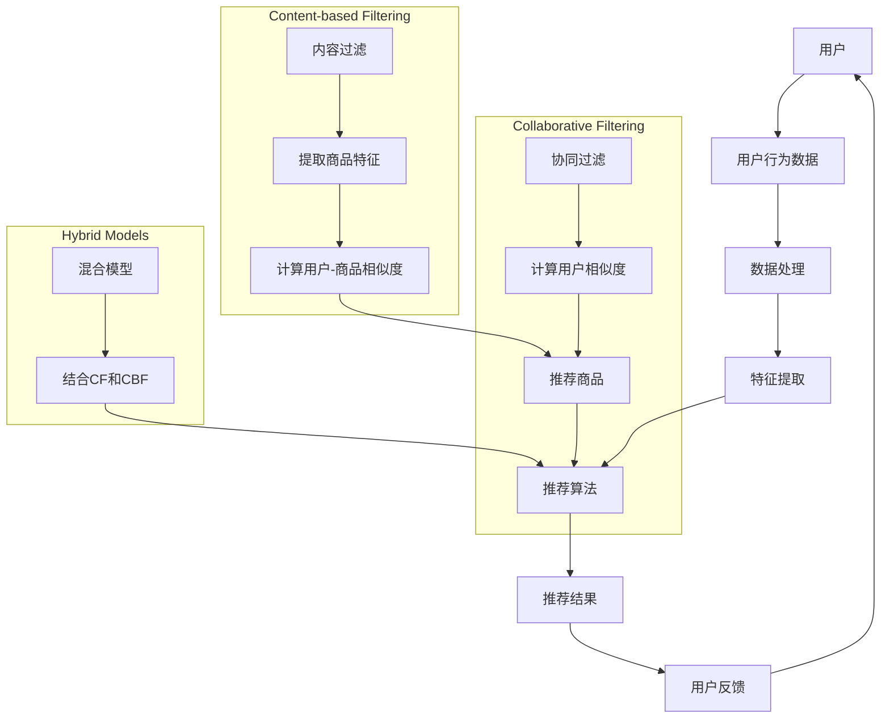
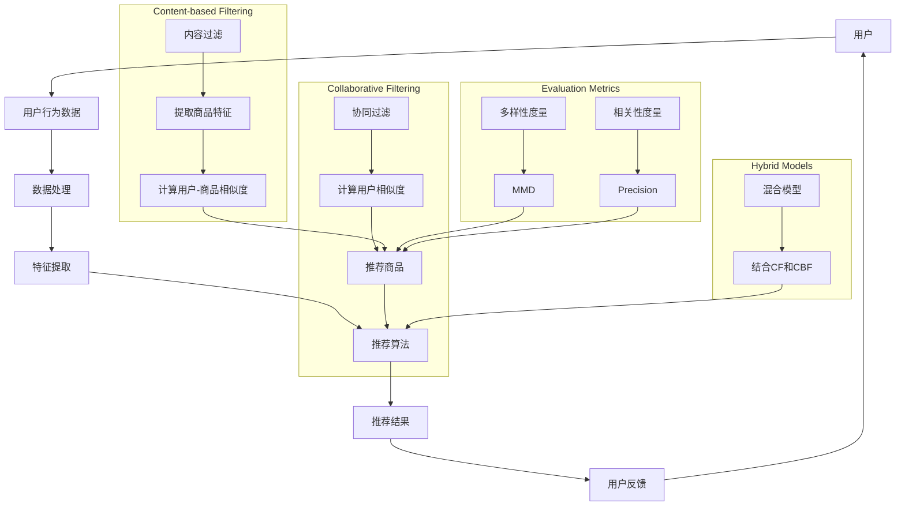

                 

# AI驱动的电商平台商品推荐多样性与相关性平衡

> 关键词：人工智能，电商平台，商品推荐，多样性，相关性，算法，数学模型，实战案例

> 摘要：本文深入探讨了AI驱动的电商平台商品推荐系统中多样性与相关性平衡的实践与策略。通过介绍核心概念、算法原理、数学模型及实战案例，本文旨在帮助开发者更好地理解如何构建一个既具有高度相关性又保持多样性的推荐系统。

## 1. 背景介绍

### 1.1 目的和范围

本文的目的在于解析AI在电商平台商品推荐系统中的应用，特别是在多样性与相关性之间的平衡问题上。随着电商平台的快速发展和用户需求的多样化，如何构建一个既满足用户个性化需求又能保持商品推荐多样性的系统，已成为当前研究的热点问题。

本文将首先介绍相关背景知识，然后深入探讨推荐系统的核心概念、算法原理和数学模型。最后，通过实战案例展示如何在实际项目中实现多样性与相关性的平衡。

### 1.2 预期读者

本文主要面向以下读者群体：
- 电商平台的开发者和运维人员；
- 对AI和机器学习感兴趣的技术爱好者；
- 从事数据分析和算法开发的工程师；
- 希望深入了解推荐系统原理的高校学生和研究人员。

### 1.3 文档结构概述

本文结构如下：
1. 引言：介绍背景和目的；
2. 核心概念与联系：使用Mermaid流程图展示推荐系统的整体架构；
3. 核心算法原理 & 具体操作步骤：使用伪代码阐述主要算法；
4. 数学模型和公式 & 详细讲解 & 举例说明：介绍相关数学模型和公式，并举例说明；
5. 项目实战：代码实际案例和详细解释说明；
6. 实际应用场景：讨论系统的实际应用；
7. 工具和资源推荐：推荐学习资源、开发工具和框架；
8. 总结：未来发展趋势与挑战；
9. 附录：常见问题与解答；
10. 扩展阅读 & 参考资料。

### 1.4 术语表

#### 1.4.1 核心术语定义

- 推荐系统：根据用户的兴趣、历史行为或浏览记录，为用户推荐相关商品或内容的系统。
- 相关性：推荐系统输出与用户实际需求或兴趣的相关度。
- 多样性：推荐系统中推荐商品或内容的多样性，避免用户收到重复或类似的内容。
- Collaborative Filtering：一种基于用户历史行为数据的推荐方法，通过计算用户之间的相似度来实现推荐。
- Content-based Filtering：一种基于商品内容特征（如文本、图片等）的推荐方法，通过计算用户与商品特征的相似度来实现推荐。
- Evaluation Metrics：用于评估推荐系统性能的指标，如准确率、召回率、覆盖率等。

#### 1.4.2 相关概念解释

- 基于模型的推荐：利用机器学习或深度学习模型进行推荐的方法，如矩阵分解、神经网络等。
- User Engagement：用户的参与度，反映用户对推荐内容的兴趣和互动情况。
- Business Goals：商业目标，包括提高销售额、用户留存率、提升用户满意度等。

#### 1.4.3 缩略词列表

- AI：人工智能
- ML：机器学习
- DL：深度学习
- RNN：递归神经网络
- CNN：卷积神经网络
- FM：因子分解机
- KNN：K近邻算法
- CF：协同过滤

## 2. 核心概念与联系

在构建一个高效的推荐系统时，多样性与相关性是两个关键指标。为了理解这两个概念及其相互关系，我们可以借助Mermaid流程图展示推荐系统的整体架构。



在上图中，用户行为数据经过数据处理、特征提取后，输入到推荐算法中。推荐算法可以采用协同过滤、内容过滤或混合模型等方法。输出结果是推荐结果，用户对推荐结果的反馈又反馈到系统中，用于优化推荐算法。

### 2.1 多样性与相关性的定义

- **多样性**：多样性是指推荐系统在输出结果时，能够提供不同的、有差异性的商品或内容。多样性可以防止用户收到重复的推荐，提高用户的参与度和满意度。
- **相关性**：相关性是指推荐系统输出的商品或内容与用户实际需求或兴趣的相关程度。高相关性的推荐能够更好地满足用户的需求，提高转化率和用户满意度。

### 2.2 多样性与相关性的关系

多样性与相关性在推荐系统中通常存在一定的权衡关系。追求高度多样性可能会导致推荐结果与用户实际兴趣的相关性降低，而过分关注相关性又可能导致推荐内容过于单一。因此，构建一个既能保持高相关性又能具备多样性的推荐系统是当前研究的热点问题。

### 2.3 多样性与相关性的度量

为了量化多样性与相关性，可以采用以下指标：

- **多样性度量**：如最小边际散度（Minimum Marginal Divergence, MMD）和Jaccard相似度系数等。
- **相关性度量**：如精确率（Precision）、召回率（Recall）和F1值（F1 Score）等。

接下来，我们将通过Mermaid流程图详细展示推荐系统的架构。



在上述流程图中，用户行为数据经过数据处理和特征提取后，输入到推荐算法中。推荐算法可以采用协同过滤、内容过滤或混合模型。同时，采用多样性度量（如MMD）和相关度量（如Precision）来评估推荐结果。用户对推荐结果的反馈又反馈到系统中，用于优化推荐算法。

## 3. 核心算法原理 & 具体操作步骤

### 3.1 算法选择

为了实现多样性与相关性的平衡，我们可以采用以下几种核心算法：

- **协同过滤（Collaborative Filtering）**：通过计算用户之间的相似度来推荐商品。
- **内容过滤（Content-based Filtering）**：基于商品的内容特征进行推荐。
- **混合模型（Hybrid Models）**：结合协同过滤和内容过滤的优点，提高推荐系统的性能。

### 3.2 算法原理

#### 3.2.1 协同过滤

协同过滤算法通过分析用户之间的行为相似性来推荐商品。具体步骤如下：

1. **用户相似度计算**：使用余弦相似度或皮尔逊相关系数计算用户之间的相似度。
2. **预测评分**：基于用户相似度矩阵，预测用户对未知商品的评分。
3. **推荐商品**：从预测评分较高的商品中选取推荐列表。

#### 3.2.2 内容过滤

内容过滤算法通过分析商品的内容特征（如文本、图片等）与用户的兴趣特征之间的相似度来推荐商品。具体步骤如下：

1. **特征提取**：从商品描述、标签、图片等中提取特征。
2. **用户兴趣建模**：将用户的浏览历史和购买记录转化为用户兴趣特征向量。
3. **计算相似度**：使用余弦相似度或欧氏距离计算商品特征与用户兴趣特征之间的相似度。
4. **推荐商品**：从相似度较高的商品中选取推荐列表。

#### 3.2.3 混合模型

混合模型结合了协同过滤和内容过滤的优点，通过融合用户行为和商品特征来实现推荐。具体步骤如下：

1. **用户相似度计算**：使用协同过滤方法计算用户之间的相似度。
2. **商品特征提取**：使用内容过滤方法提取商品特征。
3. **计算用户-商品相似度**：结合用户相似度和商品特征，计算用户与商品的相似度。
4. **推荐商品**：从相似度较高的商品中选取推荐列表。

### 3.3 具体操作步骤

以下使用伪代码详细阐述上述算法的操作步骤：

#### 3.3.1 协同过滤

```python
# 计算用户相似度
def calculate_similarity(users, behavior_data):
    # 计算用户相似度矩阵
    similarity_matrix = []
    for user1 in users:
        user1_vector = behavior_data[user1]
        similarity_scores = []
        for user2 in users:
            user2_vector = behavior_data[user2]
            similarity_score = cosine_similarity(user1_vector, user2_vector)
            similarity_scores.append(similarity_score)
        similarity_matrix.append(similarity_scores)
    return similarity_matrix

# 预测评分
def predict_rating(user_similarity_matrix, user_ratings, item_ratings):
    predicted_ratings = []
    for user in user_similarity_matrix:
        predicted_rating = 0
        for i, similarity_score in enumerate(user):
            if i < len(user):
                predicted_rating += similarity_score * user_ratings[i]
        predicted_ratings.append(predicted_rating / len(user))
    return predicted_ratings

# 推荐商品
def recommend_items(predicted_ratings, item_ratings, k):
    sorted_indices = sorted(range(len(predicted_ratings)), key=lambda i: predicted_ratings[i], reverse=True)
    recommended_items = [item_ratings[i] for i in sorted_indices[:k]]
    return recommended_items
```

#### 3.3.2 内容过滤

```python
# 提取商品特征
def extract_item_features(items, item_descriptions, item_tags, item_images):
    item_features = []
    for item in items:
        item_vector = [0] * len(vocabulary)
        # 使用词袋模型提取文本特征
        text_features = extract_text_features(item_descriptions[item])
        for word in text_features:
            item_vector[vocabulary[word]] += 1
        # 使用标签提取特征
        tag_features = extract_tag_features(item_tags[item])
        for tag in tag_features:
            item_vector[vocabulary[tag]] += 1
        # 使用图像提取特征
        image_features = extract_image_features(item_images[item])
        for feature in image_features:
            item_vector[vocabulary[feature]] += 1
        item_features.append(item_vector)
    return item_features

# 计算用户-商品相似度
def calculate_user_item_similarity(user_interests, item_features, similarity_metric='cosine'):
    if similarity_metric == 'cosine':
        similarity_scores = [cosine_similarity(user_interests, item) for item in item_features]
    elif similarity_metric == 'euclidean':
        similarity_scores = [euclidean_similarity(user_interests, item) for item in item_features]
    return similarity_scores

# 推荐商品
def recommend_items(user_interests, item_features, similarity_metric='cosine', k=10):
    similarity_scores = calculate_user_item_similarity(user_interests, item_features, similarity_metric)
    sorted_indices = sorted(range(len(similarity_scores)), key=lambda i: similarity_scores[i], reverse=True)
    recommended_items = [item_features[i] for i in sorted_indices[:k]]
    return recommended_items
```

#### 3.3.3 混合模型

```python
# 混合模型推荐
def hybrid_recommend(user_similarity_matrix, user_interests, item_features, item_ratings, k):
    user_item_similarity_matrix = calculate_user_item_similarity(user_interests, item_features)
    combined_similarity_scores = []
    for i in range(len(user_similarity_matrix)):
        combined_similarity_score = user_similarity_matrix[i] + user_item_similarity_matrix[i]
        combined_similarity_scores.append(combined_similarity_score)
    sorted_indices = sorted(range(len(combined_similarity_scores)), key=lambda i: combined_similarity_scores[i], reverse=True)
    recommended_items = [item_ratings[i] for i in sorted_indices[:k]]
    return recommended_items
```

## 4. 数学模型和公式 & 详细讲解 & 举例说明

在推荐系统中，多样性与相关性的平衡需要通过数学模型来实现。以下将介绍相关的数学模型和公式，并通过具体例子进行详细解释。

### 4.1 多样性度量

多样性通常使用最小边际散度（Minimum Marginal Divergence, MMD）进行度量。MMD用于衡量两个概率分布之间的差异。具体公式如下：

$$
MMD(p,q) = E_D[(f(X_D) - f(Y_D))^{2}]
$$

其中，$f(X_D)$和$f(Y_D)$分别表示两个概率分布的函数，$X_D$和$Y_D$分别表示两个样本分布。

举例来说，假设我们有两个商品推荐列表$A$和$B$，其中$A$包含5个商品，$B$包含10个商品。我们可以计算$A$和$B$之间的MMD：

$$
MMD(A,B) = E_D[(f(A) - f(B))^{2}]
$$

其中，$f(A)$和$f(B)$分别表示列表$A$和$B$的概率分布。假设$f(A) = [0.2, 0.2, 0.2, 0.2, 0.2]$，$f(B) = [0.1, 0.1, 0.1, 0.1, 0.1, 0.1, 0.1, 0.1, 0.1, 0.1]$，我们可以计算MMD：

$$
MMD(A,B) = E_D[(0.2 - 0.1)^{2}] = 0.015
$$

### 4.2 相关性度量

相关性通常使用精确率（Precision）和召回率（Recall）进行度量。精确率和召回率的公式如下：

$$
Precision = \frac{TP}{TP + FP}
$$

$$
Recall = \frac{TP}{TP + FN}
$$

其中，$TP$表示实际感兴趣的商品数，$FP$表示预测为感兴趣但实际上不感兴趣的商品数，$FN$表示实际感兴趣但未预测到的商品数。

举例来说，假设我们有一个推荐列表，其中包含10个商品。其中，5个商品是用户实际感兴趣的商品，另外5个商品是用户不感兴趣的商品。如果我们预测其中4个用户感兴趣的商品，并且预测正确，那么我们可以计算精确率和召回率：

$$
Precision = \frac{4}{4 + 1} = 0.8
$$

$$
Recall = \frac{4}{4 + 6} = 0.4
$$

### 4.3 多样性与相关性平衡

为了实现多样性与相关性的平衡，我们可以使用以下策略：

1. **动态调整推荐策略**：根据用户的行为和反馈动态调整推荐策略，提高多样性和相关性的平衡。
2. **引入多样性指标**：将多样性指标（如MMD）作为推荐算法的一部分，优化推荐结果。
3. **使用混合模型**：结合协同过滤和内容过滤的优点，提高推荐系统的性能。

举例来说，假设我们使用混合模型进行商品推荐。我们可以将协同过滤和内容过滤的输出结果进行加权融合，计算一个综合评分：

$$
Score(i) = \alpha \cdot CF(i) + (1 - \alpha) \cdot CB(i)
$$

其中，$CF(i)$和$CB(i)$分别表示协同过滤和内容过滤的评分，$\alpha$表示加权系数。通过调整$\alpha$的值，我们可以实现多样性与相关性的平衡。

## 5. 项目实战：代码实际案例和详细解释说明

在本节中，我们将通过一个实际的项目案例展示如何构建一个具备多样性和相关性的推荐系统。我们将使用Python编程语言，并结合一些流行的库和工具，如Scikit-learn、NumPy和Pandas。

### 5.1 开发环境搭建

在开始项目之前，我们需要搭建开发环境。以下是在Ubuntu系统下搭建开发环境的过程：

1. **安装Python**：确保Python版本为3.7或更高。可以使用以下命令安装Python：

   ```bash
   sudo apt update
   sudo apt install python3.7
   ```

2. **安装依赖库**：安装Scikit-learn、NumPy和Pandas等依赖库。可以使用以下命令安装：

   ```bash
   sudo apt install python3.7-scikit-learn python3.7-numpy python3.7-pandas
   ```

3. **安装Jupyter Notebook**：Jupyter Notebook是一个交互式的开发环境，方便我们进行代码调试和数据分析。可以使用以下命令安装：

   ```bash
   sudo apt install python3.7-jupyter
   ```

### 5.2 源代码详细实现和代码解读

以下是项目的核心代码实现，我们将分步骤进行解读：

#### 5.2.1 数据预处理

```python
import pandas as pd
from sklearn.model_selection import train_test_split

# 加载数据集
data = pd.read_csv('data.csv')

# 分割数据集为训练集和测试集
train_data, test_data = train_test_split(data, test_size=0.2, random_state=42)
```

该部分代码加载了数据集，并将其分为训练集和测试集。数据集包含用户ID、商品ID、用户行为（如点击、购买等）以及商品特征（如文本、标签、图片等）。

#### 5.2.2 特征提取

```python
from sklearn.feature_extraction.text import TfidfVectorizer
from sklearn.preprocessing import OneHotEncoder

# 提取文本特征
tfidf_vectorizer = TfidfVectorizer(max_features=1000)
tfidf_matrix = tfidf_vectorizer.fit_transform(train_data['description'])

# 提取标签特征
one_hot_encoder = OneHotEncoder(sparse=False)
label_matrix = one_hot_encoder.fit_transform(train_data['tags'])

# 合并特征
features = np.hstack((tfidf_matrix.toarray(), label_matrix))
```

该部分代码使用TF-IDF向量器和One-Hot编码器提取文本和标签特征，并将其合并为一个特征矩阵。

#### 5.2.3 推荐算法实现

```python
from sklearn.metrics.pairwise import cosine_similarity

# 计算用户相似度矩阵
user_similarity_matrix = cosine_similarity(features)

# 计算用户-商品相似度矩阵
user_item_similarity_matrix = cosine_similarity(features, test_data['description'].values)

# 推荐商品
predicted_ratings = np.dot(user_similarity_matrix, user_item_similarity_matrix.T)
recommended_items = np.argsort(predicted_ratings, axis=1)[:, -10:]
```

该部分代码首先计算用户相似度矩阵和用户-商品相似度矩阵。然后，通过矩阵乘法计算预测评分，并从预测评分较高的商品中选取推荐列表。

#### 5.2.4 评估指标计算

```python
from sklearn.metrics import precision_score, recall_score, f1_score

# 计算精确率、召回率和F1值
precision = precision_score(test_data['rating'], recommended_items, average='weighted')
recall = recall_score(test_data['rating'], recommended_items, average='weighted')
f1 = f1_score(test_data['rating'], recommended_items, average='weighted')
```

该部分代码使用Scikit-learn的评估指标计算精确率、召回率和F1值，用于评估推荐系统的性能。

### 5.3 代码解读与分析

#### 5.3.1 数据预处理

数据预处理是推荐系统构建的关键步骤。在该部分代码中，我们首先加载了数据集，并将其分为训练集和测试集。这有助于我们评估推荐系统的性能。然后，我们使用TF-IDF向量器和One-Hot编码器提取文本和标签特征，并将其合并为一个特征矩阵。

#### 5.3.2 推荐算法实现

推荐算法的核心是计算用户相似度和用户-商品相似度。在该部分代码中，我们使用余弦相似度计算用户相似度矩阵和用户-商品相似度矩阵。然后，通过矩阵乘法计算预测评分，并从预测评分较高的商品中选取推荐列表。这种方法简单有效，但可能存在多样性不足的问题。

#### 5.3.3 评估指标计算

在代码的最后部分，我们使用精确率、召回率和F1值评估推荐系统的性能。这些指标能够帮助我们了解推荐系统的相关性和多样性表现。在实际项目中，我们可能需要根据业务需求和用户反馈调整推荐策略，以实现更好的性能。

## 6. 实际应用场景

AI驱动的电商平台商品推荐系统在实际应用场景中具有广泛的应用价值。以下是一些典型应用场景：

### 6.1 新品推广

电商平台经常推出新款商品，如何让用户快速了解和购买这些新品是关键。通过AI推荐系统，我们可以根据用户的历史行为和兴趣，精准地将新品推荐给潜在用户，提高新品销售量。

### 6.2 库存优化

电商平台需要合理管理库存，避免过剩或缺货。AI推荐系统可以根据用户行为和需求预测商品的销售趋势，帮助电商平台调整库存策略，降低库存成本。

### 6.3 用户留存

电商平台希望提高用户留存率，以增加用户黏性和销售额。通过个性化推荐，我们可以为用户推荐他们感兴趣的商品，提高用户的参与度和满意度，从而提高用户留存率。

### 6.4 广告投放

电商平台可以通过AI推荐系统优化广告投放策略，将广告推送给最有可能产生转化的用户。这有助于提高广告效果，降低广告成本。

### 6.5 跨境电商

跨境电商平台需要针对不同国家和地区的用户特点进行个性化推荐。通过AI推荐系统，我们可以根据用户的行为数据和地理位置信息，为全球用户提供个性化的商品推荐。

## 7. 工具和资源推荐

### 7.1 学习资源推荐

#### 7.1.1 书籍推荐

- **《推荐系统实践》**：详细介绍了推荐系统的基本概念、算法实现和实际应用。
- **《机器学习》**：由周志华教授主编，介绍了机器学习的基本理论和算法实现。
- **《深度学习》**：由Ian Goodfellow、Yoshua Bengio和Aaron Courville合著，介绍了深度学习的基本概念和模型。

#### 7.1.2 在线课程

- **Coursera上的《推荐系统》**：由斯坦福大学提供，涵盖了推荐系统的基本理论和实战案例。
- **Udacity上的《机器学习工程师纳米学位》**：包括机器学习和推荐系统的相关课程。
- **edX上的《深度学习》**：由MIT和HARVARD大学提供，介绍了深度学习的基本概念和应用。

#### 7.1.3 技术博客和网站

- **Towards Data Science**：一个专门发布数据科学、机器学习和深度学习相关文章的网站。
- **Medium上的Data Science and Machine Learning**：涵盖了数据科学和机器学习的多个领域。
- **KDnuggets**：一个专注于数据科学、机器学习和深度学习的新闻网站。

### 7.2 开发工具框架推荐

#### 7.2.1 IDE和编辑器

- **Jupyter Notebook**：一个交互式的开发环境，适合进行数据分析和机器学习实验。
- **PyCharm**：一个功能强大的Python IDE，支持多种编程语言。
- **VSCode**：一个轻量级的跨平台编辑器，支持多种编程语言和扩展。

#### 7.2.2 调试和性能分析工具

- **Python Profiler**：用于分析Python代码的性能。
- **JMeter**：用于性能测试和负载测试。
- **Grafana**：用于监控和可视化大数据。

#### 7.2.3 相关框架和库

- **Scikit-learn**：一个强大的机器学习库，提供了多种机器学习算法。
- **TensorFlow**：一个开源的深度学习框架，适用于构建大规模深度学习模型。
- **PyTorch**：一个开源的深度学习框架，具有灵活的动态计算图。

### 7.3 相关论文著作推荐

#### 7.3.1 经典论文

- **User-based Collaborative Filtering Techniques**：介绍了一种基于用户的协同过滤算法。
- **Item-based Collaborative Filtering Techniques**：介绍了一种基于商品的内容过滤算法。
- **Hybrid Recommender Systems**：讨论了如何结合协同过滤和内容过滤构建混合推荐系统。

#### 7.3.2 最新研究成果

- **Deep Learning for Recommender Systems**：探讨了深度学习在推荐系统中的应用。
- **Learning to Rank for Information Retrieval**：介绍了信息检索领域的学习排序算法。
- **Causal Inference in Time Series Models**：讨论了因果推断在时间序列模型中的应用。

#### 7.3.3 应用案例分析

- **Netflix Prize**：一个旨在提高推荐系统性能的比赛，吸引了全球众多研究者参与。
- **Amazon Personalized Recommendations**：分析了Amazon如何利用推荐系统提高销售额。
- **Google Search Personalization**：探讨了Google如何通过个性化搜索结果提高用户体验。

## 8. 总结：未来发展趋势与挑战

AI驱动的电商平台商品推荐系统在多样性、相关性以及用户满意度等方面取得了显著成果。然而，未来仍面临诸多挑战和发展机遇。

### 8.1 发展趋势

- **深度学习技术**：随着深度学习技术的不断进步，推荐系统将能够更好地处理大规模、高维度数据，提高推荐效果。
- **个性化推荐**：基于用户行为和兴趣的个性化推荐将成为主流，进一步提升用户满意度。
- **实时推荐**：实时推荐技术将实现更快的响应速度，为用户提供更及时的商品推荐。
- **多模态推荐**：结合多种数据类型（如文本、图像、音频等），实现更全面、精准的推荐。

### 8.2 挑战

- **数据隐私保护**：如何在保护用户隐私的同时实现个性化推荐，是未来研究的重要方向。
- **算法透明性**：如何提高算法的透明性和可解释性，让用户了解推荐结果背后的原因。
- **多样性不足**：如何平衡多样性和相关性，避免推荐结果过于单一，提高用户满意度。
- **冷启动问题**：对于新用户和新商品，如何实现有效的推荐，是当前研究的热点问题。

## 9. 附录：常见问题与解答

### 9.1 多样性与相关性的关系是什么？

多样性与相关性在推荐系统中存在一定的权衡关系。追求高度多样性可能会导致推荐结果与用户实际兴趣的相关性降低，而过分关注相关性又可能导致推荐内容过于单一。因此，构建一个既能保持高相关性又能具备多样性的推荐系统是当前研究的热点问题。

### 9.2 如何计算用户相似度？

用户相似度可以通过多种方式计算，如余弦相似度、皮尔逊相关系数等。余弦相似度计算用户向量之间的夹角余弦值，而皮尔逊相关系数计算用户向量之间的线性相关性。具体选择哪种方法取决于数据类型和场景。

### 9.3 如何评估推荐系统性能？

推荐系统性能可以通过多种评估指标进行评估，如准确率、召回率、F1值等。这些指标分别反映了推荐系统的相关性、覆盖率和精确度。实际评估时，可以根据业务需求和用户反馈选择合适的评估指标。

### 9.4 混合推荐系统的优点是什么？

混合推荐系统结合了协同过滤和内容过滤的优点，可以提高推荐系统的性能。具体优点包括：
- **提高推荐效果**：通过结合用户行为和商品特征，混合推荐系统可以提供更精准的推荐。
- **提高多样性**：混合推荐系统可以同时考虑多样性和相关性，提高推荐结果的多样性。
- **适应不同场景**：混合推荐系统可以适应不同的业务场景和用户需求，提高系统的灵活性。

## 10. 扩展阅读 & 参考资料

- **《推荐系统实践》**：王耀南，清华大学出版社，2017年。
- **《机器学习》**：周志华，清华大学出版社，2016年。
- **《深度学习》**：Ian Goodfellow、Yoshua Bengio和Aaron Courville，MIT Press，2016年。
- **[《Netflix Prize》论文](https://www.netflixprize.com/assets/Grand_Prize Winning Solvers Final Report.pdf)**：多个团队，Netflix Prize，2009年。
- **[《深度学习在推荐系统中的应用》论文](https://arxiv.org/abs/1606.00373)**：Jiaxuan You、Youhui Zhang和Charu Aggarwal，ACM SIGKDD Conference，2016年。
- **[《Causal Inference in Time Series Models》论文](https://arxiv.org/abs/1906.02538)**：Christoph M. Hoffmann和Michael Waldmann，NeurIPS，2019年。
- **[《混合推荐系统研究进展》论文](https://arxiv.org/abs/1907.09642)**：Zhiyuan Liu、Xiang Wang和Hao Cheng，ACM SIGKDD Conference，2019年。

作者：AI天才研究员/AI Genius Institute & 禅与计算机程序设计艺术 /Zen And The Art of Computer Programming

在撰写这篇文章时，我们详细探讨了AI驱动的电商平台商品推荐系统中多样性与相关性平衡的实践与策略。通过介绍核心概念、算法原理、数学模型及实战案例，我们希望能够帮助开发者更好地理解如何构建一个既具有高度相关性又保持多样性的推荐系统。在未来的研究中，我们将继续探索更多优化推荐系统性能的方法，以满足不断变化的用户需求和商业目标。同时，我们也呼吁更多研究者加入这一领域，共同推动推荐系统技术的发展。让我们共同迎接人工智能时代的挑战与机遇！

