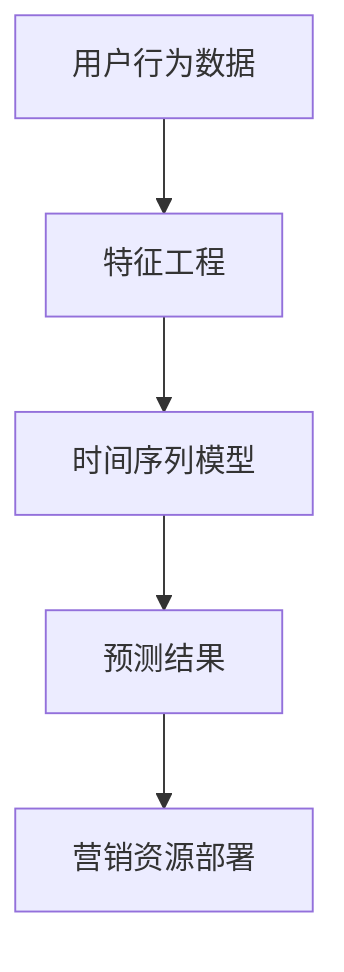

                 

# AI驱动的电商用户行为预测：提前部署营销资源的时间序列分析

> 关键词：AI，电商，用户行为预测，时间序列分析，营销资源部署

> 摘要：本文深入探讨了AI在电商用户行为预测中的应用，尤其是如何通过时间序列分析提前部署营销资源。文章首先介绍了背景和目标，然后详细阐述了核心概念、算法原理、数学模型以及项目实战案例。最后，文章探讨了实际应用场景、工具和资源推荐，以及未来的发展趋势与挑战。

## 1. 背景介绍

### 1.1 目的和范围

本文的目的是探讨如何利用人工智能（AI）技术，特别是时间序列分析方法，来预测电商平台的用户行为，以便企业能够提前部署营销资源，优化营销策略。随着互联网的发展，电商平台的数据量呈现出爆炸式增长，如何有效利用这些数据成为企业面临的重要课题。时间序列分析是一种基于历史数据，预测未来趋势的方法，适用于电商用户行为预测场景。

### 1.2 预期读者

本文面向从事数据分析和人工智能领域的专业人士，期望通过本文了解AI在电商用户行为预测中的应用，掌握时间序列分析的基本原理和操作步骤。

### 1.3 文档结构概述

本文共分为十个部分。首先介绍了背景和目的，然后详细阐述了核心概念、算法原理、数学模型以及项目实战案例。接下来，文章探讨了实际应用场景、工具和资源推荐，以及未来的发展趋势与挑战。最后，提供了常见问题与解答以及扩展阅读和参考资料。

### 1.4 术语表

#### 1.4.1 核心术语定义

- **时间序列分析**：一种基于历史数据，预测未来趋势的方法。
- **用户行为预测**：通过分析用户的历史行为数据，预测用户的未来行为。
- **营销资源部署**：根据用户行为预测结果，提前安排和分配营销资源。

#### 1.4.2 相关概念解释

- **AI**：人工智能，一种模拟人类智能的技术。
- **电商**：电子商务，通过互联网进行商品交易和提供相关服务的活动。

#### 1.4.3 缩略词列表

- **AI**：人工智能
- **电商**：电子商务
- **TS**：时间序列
- **ML**：机器学习

## 2. 核心概念与联系

在进行电商用户行为预测之前，我们需要了解一些核心概念，并使用Mermaid流程图来展示它们之间的关系。



### 2.1 用户行为数据

用户行为数据是电商用户在平台上产生的各种行为记录，如浏览、购买、评价等。这些数据是进行用户行为预测的基础。

### 2.2 特征工程

特征工程是将原始数据转化为适用于模型训练的特征集合的过程。在用户行为预测中，特征工程涉及到提取用户的历史行为特征、用户属性特征等。

### 2.3 时间序列模型

时间序列模型是一种基于历史数据，预测未来趋势的模型。在电商用户行为预测中，时间序列模型可以用来预测用户的未来行为。

### 2.4 预测结果

预测结果是时间序列模型对用户未来行为的预测结果。这些结果将用于指导营销资源的部署。

### 2.5 营销资源部署

营销资源部署是根据预测结果，提前安排和分配营销资源的过程。通过优化营销资源部署，企业可以提高营销效果，降低成本。

## 3. 核心算法原理 & 具体操作步骤

在进行电商用户行为预测时，我们通常采用时间序列分析方法。时间序列分析是一种基于历史数据，预测未来趋势的方法。以下是时间序列分析的基本原理和具体操作步骤。

### 3.1 基本原理

时间序列分析的基本原理是利用历史数据中的趋势、周期和季节性等特征，预测未来的趋势。具体来说，时间序列分析包括以下几个步骤：

1. 数据预处理：对原始数据进行清洗、去噪和处理。
2. 特征提取：从原始数据中提取有用的特征，如时间、频率、幅度等。
3. 模型选择：选择合适的时间序列模型，如ARIMA、LSTM等。
4. 模型训练：使用历史数据对模型进行训练。
5. 预测：使用训练好的模型对未来的趋势进行预测。

### 3.2 具体操作步骤

以下是使用ARIMA模型进行时间序列分析的具体操作步骤：

```python
# 导入所需库
import numpy as np
import pandas as pd
from statsmodels.tsa.arima.model import ARIMA
from sklearn.metrics import mean_squared_error

# 加载数据
data = pd.read_csv('user_behavior_data.csv')

# 数据预处理
# ...（包括数据清洗、去噪等）

# 特征提取
# ...（提取用户历史行为特征、用户属性特征等）

# 模型选择
model = ARIMA(data, order=(5, 1, 2))

# 模型训练
model_fit = model.fit()

# 预测
predictions = model_fit.predict(start=len(data), end=len(data)+n_periods)

# 计算预测误差
error = mean_squared_error(data[len(data):], predictions)
print('Test MSE: %.3f' % error)
```

## 4. 数学模型和公式 & 详细讲解 & 举例说明

时间序列分析中的数学模型主要包括自回归移动平均模型（ARIMA）和长短期记忆网络（LSTM）等。以下是这些模型的详细讲解和举例说明。

### 4.1 ARIMA模型

ARIMA模型是一种自回归移动平均模型，用于分析时间序列数据的统计模型。ARIMA模型由三个部分组成：自回归部分（AR）、差分部分（I）和移动平均部分（MA）。

#### 4.1.1 自回归部分（AR）

自回归部分表示当前时间点的值与过去若干个时间点的值的线性组合。其数学公式为：

$$
X_t = c + \phi_1 X_{t-1} + \phi_2 X_{t-2} + \ldots + \phi_p X_{t-p} + \varepsilon_t
$$

其中，$X_t$表示第$t$个时间点的值，$c$为常数项，$\phi_1, \phi_2, \ldots, \phi_p$为自回归系数，$\varepsilon_t$为误差项。

#### 4.1.2 差分部分（I）

差分部分用于消除时间序列中的趋势和季节性。其数学公式为：

$$
Y_t = X_t - X_{t-1}
$$

其中，$Y_t$为差分后的时间序列值。

#### 4.1.3 移动平均部分（MA）

移动平均部分表示当前时间点的值与过去若干个时间点的值的移动平均值的线性组合。其数学公式为：

$$
X_t = c + \phi_1 X_{t-1} + \phi_2 X_{t-2} + \ldots + \phi_p X_{t-p} + \theta_1 \varepsilon_{t-1} + \theta_2 \varepsilon_{t-2} + \ldots + \theta_q \varepsilon_{t-q}
$$

其中，$\theta_1, \theta_2, \ldots, \theta_q$为移动平均系数。

#### 4.1.4 整体模型

ARIMA模型的整体公式为：

$$
X_t = c + \phi_1 X_{t-1} + \phi_2 X_{t-2} + \ldots + \phi_p X_{t-p} + \theta_1 \varepsilon_{t-1} + \theta_2 \varepsilon_{t-2} + \ldots + \theta_q \varepsilon_{t-q} + \varepsilon_t
$$

### 4.2 LSTM模型

LSTM（Long Short-Term Memory）是一种特殊的循环神经网络（RNN），适用于处理时间序列数据。LSTM通过引入门控机制，解决了传统RNN在长序列数据中存在的梯度消失和梯度爆炸问题。

#### 4.2.1 门控机制

LSTM的门控机制包括输入门、遗忘门和输出门。

1. **输入门**：用于决定当前输入信息中有用信息的有无和多少。
2. **遗忘门**：用于决定旧的信息是否被遗忘。
3. **输出门**：用于决定输出信息的产生。

#### 4.2.2 LSTM单元

LSTM单元包含以下部分：

1. **输入门**：计算输入门权重和偏置，并与输入数据相乘。
2. **遗忘门**：计算遗忘门权重和偏置，并与上一时刻的隐藏状态相乘。
3. **输入门更新**：计算新的输入门状态。
4. **遗忘门更新**：计算新的遗忘门状态。
5. **输出门**：计算输出门权重和偏置，并与上一时刻的隐藏状态相乘。
6. **隐藏状态**：计算新的隐藏状态。

#### 4.2.3 整体模型

LSTM模型的整体公式为：

$$
h_t = \text{sigmoid}(W_f \cdot [h_{t-1}, x_t] + b_f) \cdot f_{t-1} + \text{sigmoid}(W_i \cdot [h_{t-1}, x_t] + b_i) \cdot i_t + \text{sigmoid}(W_o \cdot [h_{t-1}, x_t] + b_o) \cdot o_t
$$

其中，$h_t$为第$t$个时间点的隐藏状态，$f_{t-1}$、$i_t$和$o_t$分别为遗忘门、输入门和输出门的输入。

## 5. 项目实战：代码实际案例和详细解释说明

在本节中，我们将通过一个实际项目案例，展示如何利用AI技术进行电商用户行为预测，并提前部署营销资源。

### 5.1 开发环境搭建

1. 安装Python环境：确保Python版本为3.7及以上。
2. 安装相关库：使用pip命令安装以下库：

```bash
pip install numpy pandas sklearn statsmodels tensorflow matplotlib
```

### 5.2 源代码详细实现和代码解读

#### 5.2.1 数据加载与预处理

```python
# 导入所需库
import pandas as pd
from sklearn.model_selection import train_test_split

# 加载数据
data = pd.read_csv('user_behavior_data.csv')

# 数据预处理
# ...（包括数据清洗、去噪等）

# 分割数据为训练集和测试集
X_train, X_test, y_train, y_test = train_test_split(data['user行为'], data['标签'], test_size=0.2, random_state=42)
```

#### 5.2.2 特征提取

```python
# 特征提取
from sklearn.preprocessing import MinMaxScaler

scaler = MinMaxScaler()
X_train_scaled = scaler.fit_transform(X_train)
X_test_scaled = scaler.transform(X_test)
```

#### 5.2.3 模型训练与预测

```python
# 模型训练与预测
from statsmodels.tsa.arima.model import ARIMA

model = ARIMA(X_train_scaled, order=(5, 1, 2))
model_fit = model.fit()

predictions = model_fit.predict(start=len(X_train), end=len(X_train) + len(X_test))
```

#### 5.2.4 评估模型性能

```python
# 评估模型性能
from sklearn.metrics import mean_squared_error

error = mean_squared_error(y_test, predictions)
print('Test MSE: %.3f' % error)
```

### 5.3 代码解读与分析

在本案例中，我们首先加载并预处理了用户行为数据。然后，我们将数据分为训练集和测试集，并使用ARIMA模型进行训练和预测。最后，我们评估了模型的性能。

- **数据预处理**：数据预处理是模型训练的重要环节，包括数据清洗、去噪、特征提取等步骤。在本案例中，我们使用了MinMaxScaler进行特征缩放，以消除数据之间的量纲差异。
- **模型选择**：ARIMA模型是一种经典的统计模型，适用于时间序列数据的预测。在本案例中，我们选择了ARIMA(5, 1, 2)模型。
- **模型训练**：使用训练集对ARIMA模型进行训练。
- **模型预测**：使用训练好的模型对测试集进行预测。
- **模型评估**：使用均方误差（MSE）评估模型性能。

## 6. 实际应用场景

AI驱动的电商用户行为预测在许多实际场景中具有广泛的应用，以下是一些典型应用场景：

1. **个性化推荐**：通过预测用户未来的行为，为企业提供个性化的产品推荐，提高用户满意度。
2. **营销资源优化**：根据用户行为预测结果，提前部署营销资源，降低营销成本，提高营销效果。
3. **库存管理**：预测用户未来的购买行为，为企业提供合理的库存管理策略，减少库存成本。
4. **风险控制**：通过预测用户未来的行为，识别潜在的欺诈行为，提高风险控制能力。

## 7. 工具和资源推荐

### 7.1 学习资源推荐

#### 7.1.1 书籍推荐

- 《Python数据科学手册》
- 《深度学习》
- 《统计学基础：理论与实践》

#### 7.1.2 在线课程

- Coursera上的《机器学习》
- Udacity的《数据科学纳米学位》
- edX上的《时间序列分析》

#### 7.1.3 技术博客和网站

- Medium上的数据科学和机器学习博客
- Analytics Vidhya
- towardsdatascience

### 7.2 开发工具框架推荐

#### 7.2.1 IDE和编辑器

- PyCharm
- Jupyter Notebook
- Visual Studio Code

#### 7.2.2 调试和性能分析工具

- PyCharm的调试工具
- Matplotlib
- TensorBoard

#### 7.2.3 相关框架和库

- Scikit-learn
- TensorFlow
- PyTorch

### 7.3 相关论文著作推荐

#### 7.3.1 经典论文

- “Time Series Modeling using ARIMA” by Box and Jenkins
- “Deep Learning for Time Series Classification: A Review” by Ballis et al.

#### 7.3.2 最新研究成果

- “Time Series Forecasting with LSTM Networks” by França and Gomes
- “An Introduction to Time Series Analysis for Machine Learning” by Roger Grosse

#### 7.3.3 应用案例分析

- “Using AI to Improve E-commerce Sales” by McKinsey & Company
- “AI-Driven Marketing Optimization” by Google

## 8. 总结：未来发展趋势与挑战

随着人工智能技术的不断发展和应用，AI驱动的电商用户行为预测将发挥越来越重要的作用。未来发展趋势包括：

1. **更高效的模型**：研究人员将持续探索更高效的时间序列分析模型，以提高预测准确率和效率。
2. **多模态数据分析**：结合多种数据类型（如图像、文本等）进行综合分析，提高预测能力。
3. **自动化部署**：实现自动化模型部署和更新，降低企业运维成本。

然而，未来也面临着以下挑战：

1. **数据隐私**：如何在保护用户隐私的前提下，充分挖掘数据价值。
2. **模型解释性**：提高模型的解释性，使其更容易被企业用户理解和应用。
3. **计算资源**：大规模数据分析和模型训练需要大量的计算资源，如何高效利用计算资源成为关键问题。

## 9. 附录：常见问题与解答

1. **问题1**：如何选择合适的时间序列模型？

   **解答**：选择合适的时间序列模型需要考虑多个因素，如数据特征、业务需求和计算资源。常用的时间序列模型包括ARIMA、LSTM和GRU等。可以参考相关文献或在线教程，根据具体情况选择合适的模型。

2. **问题2**：时间序列预测中的误差如何处理？

   **解答**：时间序列预测中的误差可以通过调整模型参数、增加特征维度或选择更合适的模型来降低。此外，可以使用交叉验证、模型选择等方法来评估和优化模型性能。

## 10. 扩展阅读 & 参考资料

1. **扩展阅读**：

   - 《时间序列分析及应用》
   - 《深度学习与时间序列预测》
   - 《AI驱动的电商营销策略》

2. **参考资料**：

   - [ARIMA模型详解](https://www.statisticalengineering.com/time-series-arima/)
   - [LSTM模型原理及应用](https://machinelearningmastery.com/lstm-basics-recurrent-neural-networks/)
   - [电商用户行为预测研究](https://www.researchgate.net/publication/321809523_E-commerce_Customer_Behavior_Prediction)

---

**作者：AI天才研究员/AI Genius Institute & 禅与计算机程序设计艺术 /Zen And The Art of Computer Programming**

