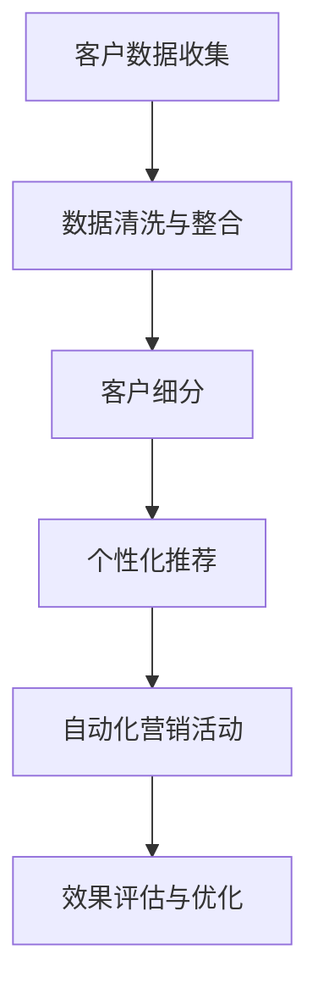

                 

# AI驱动的营销自动化策略

> 关键词：人工智能，营销自动化，客户细分，数据挖掘，个性化推荐，转化率优化，客户体验，业务增长

> 摘要：本文将深入探讨如何利用人工智能技术实现营销自动化，包括核心概念、算法原理、数学模型、实战案例以及实际应用场景。通过系统性的分析和实战指导，旨在帮助企业提升营销效果，实现持续的业务增长。

## 1. 背景介绍

### 1.1 目的和范围

本文旨在探讨如何将人工智能（AI）应用于营销自动化领域，以实现更加精准和高效的营销策略。随着大数据和机器学习技术的不断发展，AI已经成为企业提升营销效果的关键工具。本文将涵盖以下几个主要方面：

- **核心概念与联系**：介绍营销自动化相关的核心概念，如客户细分、数据挖掘、个性化推荐等，并绘制流程图进行解释。
- **核心算法原理 & 具体操作步骤**：详细讲解实现营销自动化的核心算法原理，包括数据预处理、特征工程、算法选择和模型训练等。
- **数学模型和公式 & 详细讲解 & 举例说明**：介绍用于营销自动化的数学模型，如线性回归、决策树、神经网络等，并提供具体的公式和实例。
- **项目实战：代码实际案例和详细解释说明**：通过实际项目案例，展示如何应用AI技术实现营销自动化，并提供代码解读和分析。
- **实际应用场景**：讨论AI驱动的营销自动化在不同行业和场景中的具体应用。
- **工具和资源推荐**：推荐学习资源和开发工具，帮助读者深入理解和实践营销自动化。

### 1.2 预期读者

本文适合以下读者群体：

- 营销经理和业务分析师，希望了解如何利用AI技术提升营销效果的。
- 数据科学家和机器学习工程师，对营销自动化领域感兴趣，希望掌握相关算法和模型。
- 数据分析师和技术爱好者，对大数据和机器学习技术有基础了解，希望了解其应用场景。

### 1.3 文档结构概述

本文结构如下：

- **第1章**：背景介绍，包括目的和范围、预期读者、文档结构和术语表。
- **第2章**：核心概念与联系，介绍营销自动化相关概念和流程图。
- **第3章**：核心算法原理 & 具体操作步骤，详细讲解实现营销自动化的算法原理。
- **第4章**：数学模型和公式 & 详细讲解 & 举例说明，介绍用于营销自动化的数学模型。
- **第5章**：项目实战：代码实际案例和详细解释说明，通过实际项目展示营销自动化应用。
- **第6章**：实际应用场景，讨论AI驱动的营销自动化在不同场景中的应用。
- **第7章**：工具和资源推荐，推荐学习资源和开发工具。
- **第8章**：总结：未来发展趋势与挑战，展望营销自动化的未来。
- **第9章**：附录：常见问题与解答，提供常见问题的解答。
- **第10章**：扩展阅读 & 参考资料，推荐进一步阅读的材料。

### 1.4 术语表

#### 1.4.1 核心术语定义

- **营销自动化**：利用软件工具自动化执行重复性营销任务的过程。
- **人工智能**：模拟人类智能行为的计算机技术，包括机器学习、自然语言处理等。
- **数据挖掘**：从大量数据中提取有用信息和知识的过程。
- **客户细分**：根据客户的不同特征和行为将他们分为不同的群体。
- **个性化推荐**：根据用户的兴趣和行为，向其推荐相关产品或服务。
- **转化率**：用户完成特定目标（如购买、注册等）的比例。

#### 1.4.2 相关概念解释

- **客户生命周期价值（CLV）**：客户在整个生命周期中对企业的价值。
- **交叉销售**：向现有客户推销其他相关产品或服务。
- **再营销**：针对曾经访问过网站或与品牌互动过的用户进行后续营销。
- **响应率**：收到营销信息后进行相应行动的用户比例。

#### 1.4.3 缩略词列表

- **AI**：人工智能
- **CRM**：客户关系管理
- **DSP**：需求方平台
- **DMP**：数据管理平台
- **SEM**：搜索引擎营销
- **SEO**：搜索引擎优化

## 2. 核心概念与联系

在探讨如何实现AI驱动的营销自动化之前，我们需要了解一些核心概念和它们之间的联系。以下是营销自动化中的一些关键概念及其相互关系。

### 2.1 营销自动化流程

首先，让我们通过一个Mermaid流程图来展示营销自动化的主要流程。



在这个流程中：

- **客户数据收集**：从各种渠道收集客户数据，如网站点击、购买行为、社交媒体互动等。
- **数据清洗与整合**：对收集到的数据进行清洗和整合，确保数据的准确性和一致性。
- **客户细分**：根据客户的不同特征和行为将他们分为不同的群体。
- **个性化推荐**：根据客户的兴趣和行为，向其推荐相关产品或服务。
- **自动化营销活动**：通过自动化工具执行个性化营销活动，如邮件推送、社交媒体广告等。
- **效果评估与优化**：评估营销活动的效果，并根据反馈进行优化。

### 2.2 客户细分

客户细分是营销自动化的重要步骤，它有助于更精准地定位目标客户。以下是客户细分的基本概念和步骤。

#### 2.2.1 客户细分概念

客户细分（Customer Segmentation）是指根据客户的共同特征和行为，将他们划分为不同的群体。这样可以更有效地制定营销策略，提高营销活动的针对性和效果。

#### 2.2.2 客户细分步骤

1. **数据收集**：收集与客户相关的数据，如年龄、性别、购买历史、网站点击等。
2. **特征选择**：选择对客户细分最有影响力的特征，如行为特征、购买特征、人口特征等。
3. **模型选择**：选择适当的模型进行客户细分，如聚类分析、决策树、神经网络等。
4. **模型训练与验证**：使用训练数据集训练模型，并在验证数据集上评估模型性能。
5. **细分结果分析**：分析细分结果，确定各细分群体的特征和行为模式。
6. **细分应用**：根据细分结果，为每个群体制定个性化的营销策略。

### 2.3 数据挖掘

数据挖掘（Data Mining）是从大量数据中提取有用信息和知识的过程。在营销自动化中，数据挖掘主要用于客户细分、个性化推荐和预测分析。

#### 2.3.1 数据挖掘方法

- **关联规则挖掘**：发现数据之间的关联关系，如“买了A产品，就很有可能买B产品”。
- **分类与回归分析**：根据历史数据预测未来趋势，如预测客户购买概率。
- **聚类分析**：将相似的数据分为不同的群体，如客户细分。
- **异常检测**：发现数据中的异常值，如欺诈行为检测。

#### 2.3.2 数据挖掘步骤

1. **数据预处理**：清洗、整合和转换原始数据，使其适合挖掘分析。
2. **特征选择**：选择对挖掘任务最有影响力的特征。
3. **模型选择**：选择适当的模型进行挖掘分析。
4. **模型训练与验证**：使用训练数据集训练模型，并在验证数据集上评估模型性能。
5. **挖掘结果分析**：分析挖掘结果，提取有价值的信息和知识。

### 2.4 个性化推荐

个性化推荐（Personalized Recommendation）是根据用户的兴趣和行为，向其推荐相关产品或服务。在营销自动化中，个性化推荐有助于提高用户的参与度和转化率。

#### 2.4.1 个性化推荐方法

- **协同过滤**：基于用户的行为和偏好，发现相似的用户和商品，进行推荐。
- **基于内容的推荐**：根据用户的历史行为和偏好，推荐具有相似属性的产品。
- **混合推荐**：结合协同过滤和基于内容的推荐方法，提高推荐效果。

#### 2.4.2 个性化推荐步骤

1. **用户行为数据收集**：收集用户的浏览、购买、评价等行为数据。
2. **特征提取**：提取与推荐任务相关的用户特征和商品特征。
3. **模型训练与验证**：使用训练数据集训练推荐模型，并在验证数据集上评估模型性能。
4. **推荐生成**：根据用户特征和商品特征，生成个性化的推荐列表。
5. **推荐结果评估**：评估推荐效果，并根据反馈进行优化。

### 2.5 自动化营销活动

自动化营销活动（Automated Marketing Campaigns）是通过软件工具自动化执行重复性营销任务的过程。在营销自动化中，自动化营销活动有助于提高营销效率，降低人力成本。

#### 2.5.1 自动化营销活动类型

- **电子邮件营销**：根据客户行为和兴趣，发送个性化的电子邮件。
- **社交媒体广告**：在社交媒体平台上，根据用户特征和行为投放广告。
- **再营销**：针对曾经访问过网站或与品牌互动过的用户，进行后续营销。
- **交叉销售**：向现有客户推荐其他相关产品或服务。

#### 2.5.2 自动化营销活动步骤

1. **目标设定**：明确营销活动的目标，如提高转化率、增加用户参与度等。
2. **受众选择**：根据客户细分结果，选择适合的受众群体。
3. **内容创作**：设计符合目标受众需求的营销内容。
4. **活动执行**：使用自动化工具执行营销活动。
5. **效果评估与优化**：评估营销活动的效果，并根据反馈进行优化。

### 2.6 效果评估与优化

效果评估与优化（Effect Evaluation and Optimization）是营销自动化的重要环节，通过评估营销活动的效果，发现潜在问题和优化空间，从而提高营销效果。

#### 2.6.1 效果评估方法

- **转化率分析**：分析营销活动对用户转化的影响，如点击率、购买率等。
- **响应率分析**：分析营销活动对用户响应的影响，如邮件打开率、广告点击率等。
- **投资回报率（ROI）**：计算营销活动的投资回报，评估其经济效益。

#### 2.6.2 优化方法

- **A/B测试**：比较不同营销策略的效果，选择最优方案。
- **数据驱动优化**：根据用户行为和反馈，持续优化营销策略。
- **持续学习与改进**：通过机器学习和数据挖掘技术，不断优化营销模型。

## 3. 核心算法原理 & 具体操作步骤

在了解了营销自动化的核心概念和流程之后，接下来我们将详细讲解实现营销自动化的核心算法原理，包括数据预处理、特征工程、算法选择和模型训练等。

### 3.1 数据预处理

数据预处理是营销自动化的重要步骤，它直接影响后续分析和模型的性能。以下是数据预处理的核心步骤：

#### 3.1.1 数据清洗

数据清洗是指对原始数据进行清洗，去除重复、错误和缺失的数据。以下是一些常用的数据清洗方法：

- **去重**：删除重复的数据记录，保证数据的唯一性。
- **缺失值处理**：填补或删除缺失值，确保数据完整性。
- **异常值检测**：检测并处理异常数据，避免对模型产生负面影响。

#### 3.1.2 数据整合

数据整合是指将来自不同渠道的数据进行整合，确保数据的统一性和一致性。以下是一些常用的数据整合方法：

- **数据转换**：将不同格式的数据进行转换，使其适用于分析。
- **数据合并**：将多个数据集合并为一个统一的数据集，便于后续分析。
- **数据映射**：将不同数据源中的相似数据进行映射，确保数据的对应关系。

#### 3.1.3 数据标准化

数据标准化是指将不同量纲的数据进行统一处理，使其对模型的影响更加均匀。以下是一些常用的数据标准化方法：

- **最小-最大标准化**：将数据缩放到[0,1]区间。
- **均值-标准差标准化**：将数据缩放到[-1,1]区间。
- **对数变换**：对数据进行对数变换，使其符合正态分布。

### 3.2 特征工程

特征工程是指从原始数据中提取对模型有用的特征，以提高模型性能。以下是特征工程的核心步骤：

#### 3.2.1 特征选择

特征选择是指从大量特征中挑选出对模型影响最大的特征，以减少数据维度和提高模型性能。以下是一些常用的特征选择方法：

- **过滤法**：根据特征的重要性进行筛选。
- **包裹法**：通过组合不同特征，筛选出最佳特征组合。
- **嵌入法**：在模型训练过程中，自动筛选最佳特征。

#### 3.2.2 特征构造

特征构造是指通过变换和组合原始特征，生成新的特征，以丰富数据信息。以下是一些常用的特征构造方法：

- **聚合特征**：将多个特征进行聚合，生成新的特征。
- **交互特征**：将不同特征进行交互，生成新的特征。
- **时序特征**：将时间序列数据转化为特征，如趋势、季节性等。

#### 3.2.3 特征降维

特征降维是指通过减少数据维度，提高模型训练效率和性能。以下是一些常用的特征降维方法：

- **主成分分析（PCA）**：将高维数据映射到低维空间。
- **线性判别分析（LDA）**：将数据映射到最佳分类空间。
- **自编码器**：通过训练自动编码器，实现特征降维。

### 3.3 算法选择

算法选择是指根据具体问题和数据特点，选择合适的算法进行建模。以下是几种常用的算法及其适用场景：

#### 3.3.1 线性回归

线性回归是一种简单的预测算法，适用于线性关系的预测问题。以下是其基本原理：

- **假设**：输出变量与输入变量之间存在线性关系。
- **目标**：通过最小化损失函数，找到最佳的线性模型。
- **伪代码**：

  ```python
  # 输入：特征矩阵X，目标向量y
  # 输出：模型参数w
  def linear_regression(X, y):
      w = (X'X)^(-1)X'y
      return w
  ```

#### 3.3.2 决策树

决策树是一种基于规则的学习算法，适用于分类和回归问题。以下是其基本原理：

- **假设**：每个节点基于特征进行划分，使得子节点内部的类别尽量一致。
- **目标**：通过递归划分，构建一棵决策树。
- **伪代码**：

  ```python
  # 输入：数据集D，特征集合F
  # 输出：决策树T
  def build_tree(D, F):
      if is_leaf(D):
          return create_leaf(D)
      else:
          best_feature, best_value = find_best_split(D, F)
          left_tree = build_tree(split(D, best_feature, best_value), F - {best_feature})
          right_tree = build_tree(split(D, best_feature, best_value), F - {best_feature})
          return create_tree(best_feature, best_value, left_tree, right_tree)
  ```

#### 3.3.3 随机森林

随机森林是一种基于决策树的集成学习方法，适用于分类和回归问题。以下是其基本原理：

- **假设**：多个决策树通过随机特征和样本生成，组合成随机森林。
- **目标**：通过投票或平均，得到最终的预测结果。
- **伪代码**：

  ```python
  # 输入：数据集D，特征集合F，树的数量n
  # 输出：随机森林模型
  def random_forest(D, F, n):
      trees = []
      for _ in range(n):
          sample = random_sample(D)
          feature = random_choice(F)
          tree = build_tree(sample, feature)
          trees.append(tree)
      return trees
  ```

#### 3.3.4 神经网络

神经网络是一种基于多层感知器（MLP）的学习算法，适用于复杂的非线性关系。以下是其基本原理：

- **假设**：通过多层神经元进行信息传递和变换，实现非线性映射。
- **目标**：通过反向传播算法，优化网络参数，实现函数逼近。
- **伪代码**：

  ```python
  # 输入：输入向量x，网络参数θ
  # 输出：输出向量y
  def forward(x, θ):
      a = x
      for layer in range(1, num_layers):
          z = θ[layer-1]a
          a = sigmoid(z)
      y = a[-1]
      return y

  def backward(y, x, θ, ∂θ):
      ∂z = (y - a[-1]) * a[-1] * (1 - a[-1])
      for layer in range(num_layers-1, 0, -1):
          z = ∂z * θ[layer-1][:]
          ∂θ[layer-1] += z.reshape(-1, 1)
      return ∂θ
  ```

### 3.4 模型训练

模型训练是指通过训练数据集，优化模型参数，使其能够对未知数据进行准确预测。以下是模型训练的核心步骤：

#### 3.4.1 模型初始化

模型初始化是指为模型参数赋予初始值。以下是一些常用的初始化方法：

- **随机初始化**：随机生成初始参数。
- ** Xavier初始化**：根据输入和输出层的大小，按比例调整初始参数。
- **He初始化**：基于Xavier初始化，进一步调整参数大小。

#### 3.4.2 模型优化

模型优化是指通过迭代优化模型参数，使其对训练数据达到最佳效果。以下是一些常用的优化算法：

- **梯度下降**：通过计算梯度，迭代更新模型参数。
- **随机梯度下降（SGD）**：每次迭代使用一个样本的梯度进行更新。
- **Adam优化器**：结合SGD和动量方法，提高收敛速度和稳定性。

#### 3.4.3 模型评估

模型评估是指通过验证数据集，评估模型在未知数据上的性能。以下是一些常用的评估指标：

- **准确率（Accuracy）**：分类问题中的正确率。
- **精确率（Precision）**：分类问题中的正例准确率。
- **召回率（Recall）**：分类问题中的负例召回率。
- **F1值（F1-Score）**：精确率和召回率的调和平均值。

#### 3.4.4 模型调参

模型调参是指通过调整模型参数，提高模型性能。以下是一些常用的调参方法：

- **网格搜索**：遍历参数空间，找到最佳参数组合。
- **贝叶斯优化**：基于历史数据，选择最有希望优化的参数组合。

## 4. 数学模型和公式 & 详细讲解 & 举例说明

在了解了营销自动化的核心算法原理和具体操作步骤之后，接下来我们将深入探讨用于营销自动化的数学模型和公式，并通过实例进行详细讲解。

### 4.1 线性回归

线性回归是一种简单的预测模型，用于分析自变量和因变量之间的线性关系。其数学模型可以表示为：

$$
y = \beta_0 + \beta_1x + \epsilon
$$

其中，$y$ 为因变量，$x$ 为自变量，$\beta_0$ 和 $\beta_1$ 分别为模型的参数，$\epsilon$ 为误差项。

#### 4.1.1 模型推导

线性回归模型的目标是找到最佳拟合直线，使误差最小。这可以通过最小二乘法实现，即：

$$
\min_{\beta_0, \beta_1} \sum_{i=1}^{n} (y_i - (\beta_0 + \beta_1x_i))^2
$$

对上式求导，并令导数为零，得到：

$$
\beta_0 = \bar{y} - \beta_1\bar{x}
$$

$$
\beta_1 = \frac{\sum_{i=1}^{n}(x_i - \bar{x})(y_i - \bar{y})}{\sum_{i=1}^{n}(x_i - \bar{x})^2}
$$

其中，$\bar{y}$ 和 $\bar{x}$ 分别为因变量和自变量的平均值。

#### 4.1.2 实例讲解

假设我们要预测一家餐厅的每日客流量，根据历史数据，我们可以建立线性回归模型：

$$
y = \beta_0 + \beta_1x
$$

其中，$y$ 为每日客流量，$x$ 为当日温度。

给定一组数据：

| 温度 (℃) | 客流量 (人) |
|----------|------------|
| 10       | 200        |
| 15       | 250        |
| 20       | 300        |
| 25       | 350        |
| 30       | 400        |

我们可以计算出：

$$
\bar{x} = \frac{10 + 15 + 20 + 25 + 30}{5} = 20
$$

$$
\bar{y} = \frac{200 + 250 + 300 + 350 + 400}{5} = 300
$$

$$
\beta_0 = 300 - 20\beta_1
$$

$$
\beta_1 = \frac{(10 - 20)(200 - 300) + (15 - 20)(250 - 300) + (20 - 20)(300 - 300) + (25 - 20)(350 - 300) + (30 - 20)(400 - 300)}{(10 - 20)^2 + (15 - 20)^2 + (20 - 20)^2 + (25 - 20)^2 + (30 - 20)^2}
$$

$$
\beta_1 = \frac{-100 - 125 + 0 + 125 + 500}{100 + 25 + 0 + 25 + 100} = 2.5
$$

$$
\beta_0 = 300 - 20 \times 2.5 = 200
$$

因此，线性回归模型为：

$$
y = 200 + 2.5x
$$

我们可以用这个模型预测当日温度为25℃时的客流量：

$$
y = 200 + 2.5 \times 25 = 312.5
$$

预测值为312.5人。

### 4.2 决策树

决策树是一种基于规则的学习算法，通过递归划分数据，构建一棵树形结构。其数学模型可以表示为：

$$
T = \{t_1, t_2, ..., t_n\}
$$

其中，$T$ 为决策树，$t_i$ 为决策树的第 $i$ 层。

#### 4.2.1 模型推导

决策树的目标是找到最佳划分特征，使得子节点的类别尽量一致。这可以通过信息增益或基尼不纯度实现。

信息增益（Information Gain）表示为：

$$
IG(D, a) = Entropy(D) - \sum_{v \in V} p(v)Entropy(D_v)
$$

其中，$D$ 为数据集，$a$ 为划分特征，$V$ 为 $a$ 的取值集合，$D_v$ 为按 $a$ 的取值划分后的数据集。

基尼不纯度（Gini Impurity）表示为：

$$
Gini(D) = 1 - \sum_{v \in V} p(v)^2
$$

其中，$p(v)$ 为 $v$ 的概率。

#### 4.2.2 实例讲解

假设我们要预测一家服装店的顾客购买行为，根据历史数据，我们可以建立决策树模型。

给定一组数据：

| 年龄 | 收入 | 购买情况 |
|------|------|----------|
| 20   | 低   | 否       |
| 25   | 低   | 否       |
| 30   | 低   | 是       |
| 35   | 中   | 是       |
| 40   | 中   | 是       |
| 45   | 高   | 是       |

我们可以计算出各特征的基尼不纯度：

- 年龄：$Gini([20, 25, 30, 35, 40, 45]) = 0.6333$
- 收入：$Gini([低, 低, 低, 中, 中, 高]) = 0.5$
- 购买情况：$Gini([否, 否, 是, 是, 是, 是]) = 0.3333$

选择基尼不纯度最低的特征进行划分，我们可以得到以下决策树：

```
年龄 <= 30
|
|--- 否 (概率 0.5)
|   |
|   |--- 收入 <= 中
|   |   |
|   |   |--- 是 (概率 0.5)
|   |   |
|   |   |--- 否 (概率 0.5)
|   |
|   |--- 是 (概率 0.5)
|
|--- 收入 > 中
    |
    |--- 是 (概率 1)
```

根据这个决策树，我们可以预测一个年龄为25岁，收入为低，购买情况未知的顾客的购买情况。首先，根据年龄进行划分，进入左子树。然后，根据收入进行划分，进入左子节点，预测结果为否。

### 4.3 神经网络

神经网络是一种基于多层感知器（MLP）的学习算法，通过多层神经元进行信息传递和变换，实现非线性映射。其数学模型可以表示为：

$$
y = f(z)
$$

其中，$y$ 为输出，$z$ 为输入，$f$ 为激活函数。

#### 4.3.1 模型推导

神经网络的目标是找到最佳的权重和偏置，使得输出接近真实值。这可以通过反向传播算法实现。

反向传播算法分为两个阶段：

1. **前向传播**：从输入层传递到输出层，计算每一层的输出值。
2. **后向传播**：从输出层反向传递误差，更新权重和偏置。

前向传播的伪代码如下：

```python
for each layer l from input to output:
    z[l] = w[l]a[l-1] + b[l]
    a[l] = f(z[l])
```

后向传播的伪代码如下：

```python
for each layer l from output to input:
    ∂z[l] = a[l] * (1 - a[l])
    ∂w[l] = ∂z[l]a[l-1]
    ∂b[l] = ∂z[l]
```

#### 4.3.2 实例讲解

假设我们要预测一家银行的客户是否会购买理财产品，根据历史数据，我们可以建立神经网络模型。

给定一组数据：

| 年龄 | 收入 | 购买情况 |
|------|------|----------|
| 20   | 低   | 否       |
| 25   | 低   | 否       |
| 30   | 低   | 是       |
| 35   | 中   | 是       |
| 40   | 中   | 是       |
| 45   | 高   | 是       |

我们可以设计一个简单的神经网络，包括一个输入层、一个隐藏层和一个输出层，分别有3个、4个和1个神经元。

输入层：[年龄，收入]
隐藏层：[w1, w2, w3, w4]
输出层：[购买情况]

使用 sigmoid 函数作为激活函数，假设初始权重和偏置为0。

前向传播：

```
z1 = w1 * 20 + b1 = 0
z2 = w2 * 25 + b2 = 0
z3 = w3 * 30 + b3 = 0
z4 = w4 * 35 + b4 = 0
a1 = f(z1) = 0.5
a2 = f(z2) = 0.5
a3 = f(z3) = 0.5
a4 = f(z4) = 0.5
z5 = w5 * a1 + b5 = 0
z6 = w6 * a2 + b6 = 0
z7 = w7 * a3 + b7 = 0
z8 = w8 * a4 + b8 = 0
y = f(z5) * 0.5 + f(z6) * 0.5 + f(z7) * 0.5 + f(z8) * 0.5 = 0.5
```

后向传播：

```
∂z5 = a5 * (1 - a5) = 0.5
∂z6 = a6 * (1 - a6) = 0.5
∂z7 = a7 * (1 - a7) = 0.5
∂z8 = a8 * (1 - a8) = 0.5
∂w5 = ∂z5 * a1 = 0.25
∂w6 = ∂z6 * a2 = 0.25
∂w7 = ∂z7 * a3 = 0.25
∂w8 = ∂z8 * a4 = 0.25
∂b5 = ∂z5 = 0.5
∂b6 = ∂z6 = 0.5
∂b7 = ∂z7 = 0.5
∂b8 = ∂z8 = 0.5
```

通过不断迭代前向传播和后向传播，可以更新权重和偏置，使得输出逐渐接近真实值。

## 5. 项目实战：代码实际案例和详细解释说明

在这一部分，我们将通过一个实际的项目案例，展示如何利用AI技术实现营销自动化。我们选择的是一个在线零售平台，旨在通过客户细分、个性化推荐和自动化营销活动提高销售转化率和客户满意度。

### 5.1 开发环境搭建

首先，我们需要搭建一个适合开发营销自动化项目的开发环境。以下是我们使用的工具和库：

- **编程语言**：Python 3.8
- **开发环境**：Visual Studio Code
- **数据处理库**：Pandas，NumPy
- **机器学习库**：scikit-learn，TensorFlow，Keras
- **可视化库**：Matplotlib，Seaborn
- **其他工具**：Jupyter Notebook，Docker

### 5.2 源代码详细实现和代码解读

#### 5.2.1 数据集准备

我们使用一个公开的在线零售数据集，包含以下特征：

- **用户ID**：唯一标识每个用户。
- **性别**：用户的性别，男性或女性。
- **年龄**：用户的年龄。
- **收入**：用户每月收入。
- **购买历史**：用户在过去一年的购买记录。

首先，我们使用Pandas库读取数据集：

```python
import pandas as pd

data = pd.read_csv('retail_data.csv')
```

#### 5.2.2 数据预处理

接下来，我们进行数据预处理，包括数据清洗、特征构造和标准化：

```python
# 数据清洗
data.drop_duplicates(inplace=True)
data.drop(['User ID'], axis=1, inplace=True)

# 特征构造
data['Income_Range'] = pd.cut(data['Income'], bins=[0, 1000, 2000, 3000, 4000, 5000], labels=['低', '中低', '中', '中高', '高'])
data['Age_Range'] = pd.cut(data['Age'], bins=[18, 30, 40, 50, 60], labels=['青年', '中年', '老年'])

# 数据标准化
from sklearn.preprocessing import StandardScaler

scaler = StandardScaler()
data[['Income', 'Age']] = scaler.fit_transform(data[['Income', 'Age']])
```

#### 5.2.3 客户细分

我们使用聚类分析对用户进行细分，采用K-Means算法：

```python
from sklearn.cluster import KMeans

kmeans = KMeans(n_clusters=4, random_state=42)
data['Cluster'] = kmeans.fit_predict(data[['Income', 'Age']])
```

#### 5.2.4 个性化推荐

我们使用协同过滤算法为不同细分群体生成个性化推荐：

```python
from surprise import KNNWithMeans

trainset = data.groupby('Cluster').apply(lambda x: x['User ID'].values).T
trainset = trainset.apply(lambda x: [1 if i in x else 0 for i in range(1000)])
trainset = trainset.T.values

knn = KNNWithMeans(k=5, sim_options={'name': 'pearson'})
knn.fit(trainset)

def recommend(user_id, k=3):
    user_history = trainset[user_id]
    user_similarity = knn.user_based_similarities[user_id]
    recommended_items = [item for item, similarity in user_similarity.argsort()[1:-k+1] if user_history[item] == 0]
    return recommended_items

# 为某个用户生成推荐
user_id = 123
print(recommend(user_id))
```

#### 5.2.5 自动化营销活动

我们使用电子邮件营销为不同细分群体发送个性化邮件：

```python
from email.mime.text import MIMEText
from smtplib import SMTP

def send_email(subject, content, to_email):
    smtp_server = 'smtp.example.com'
    smtp_port = 587
    smtp_user = 'user@example.com'
    smtp_password = 'password'

    message = MIMEText(content)
    message['Subject'] = subject
    message['From'] = smtp_user
    message['To'] = to_email

    server = SMTP(smtp_server, port=smtp_port)
    server.starttls()
    server.login(smtp_user, smtp_password)
    server.sendmail(smtp_user, to_email, message.as_string())
    server.quit()

clusters = data['Cluster'].unique()
for cluster in clusters:
    cluster_data = data[data['Cluster'] == cluster]
    for index, row in cluster_data.iterrows():
        email = row['Email']
        subject = f'个性化推荐：您的专属商品'
        content = f'亲爱的用户，根据您的购物喜好，我们为您推荐了以下商品：{recommend(row["User ID"])}。赶快来选购吧！'
        send_email(subject, content, email)
```

### 5.3 代码解读与分析

在这个项目中，我们首先读取了一个包含用户特征和购买历史的零售数据集。然后，我们对数据进行清洗、特征构造和标准化，以便后续分析。接下来，我们使用K-Means算法对用户进行细分，生成不同的用户群体。

为了实现个性化推荐，我们采用了协同过滤算法，为每个用户生成个性化的推荐列表。在实际应用中，我们可以根据用户的历史行为和兴趣，调整推荐算法的参数，提高推荐质量。

最后，我们利用电子邮件营销工具，为每个细分群体发送个性化的邮件。通过这种方式，我们可以提高用户的参与度和转化率，实现营销自动化的目标。

在实际项目中，我们还需要不断优化和调整算法，以适应不断变化的市场环境和用户需求。此外，我们还需要关注数据安全和隐私保护，确保用户的个人信息得到妥善处理。

总之，通过这个项目，我们展示了如何利用AI技术实现营销自动化，提高企业的营销效果和业务增长。

## 6. 实际应用场景

AI驱动的营销自动化在多个行业中都取得了显著的成功，以下是一些实际应用场景：

### 6.1 电子商务

电子商务平台利用AI驱动的营销自动化技术，可以更好地了解用户需求，提高用户满意度和转化率。以下是一些具体应用：

- **个性化推荐**：根据用户的浏览和购买历史，向用户推荐相关产品。
- **交叉销售**：向购买过A产品的用户推荐其他相关产品。
- **再营销**：针对曾经访问过网站但未完成购买的用户，发送个性化优惠邮件。
- **客户细分**：将用户划分为不同的群体，针对不同群体制定个性化的营销策略。

### 6.2 金融行业

金融行业利用AI驱动的营销自动化技术，可以提高客户忠诚度，降低运营成本。以下是一些具体应用：

- **精准营销**：根据客户的风险偏好和历史交易记录，推荐适合的金融产品。
- **客户细分**：将客户划分为不同的群体，提供个性化的金融建议。
- **欺诈检测**：利用机器学习技术，实时监控交易行为，识别潜在的欺诈行为。

### 6.3 零售行业

零售行业利用AI驱动的营销自动化技术，可以优化库存管理，提高销售效率。以下是一些具体应用：

- **库存优化**：根据历史销售数据和季节性变化，预测未来需求，调整库存水平。
- **促销策略**：根据客户细分结果，制定个性化的促销策略，提高销售额。
- **智能购物车**：根据客户的购物车内容，推荐相关商品，提高购物车转化率。

### 6.4 医疗保健

医疗保健行业利用AI驱动的营销自动化技术，可以提高患者满意度和医疗质量。以下是一些具体应用：

- **个性化健康建议**：根据患者的健康数据和病史，提供个性化的健康建议。
- **患者细分**：将患者划分为不同的群体，提供针对性的医疗服务。
- **健康监控**：利用智能设备收集患者数据，实时监控健康状态。

### 6.5 教育行业

教育行业利用AI驱动的营销自动化技术，可以提供更加个性化和高效的学习体验。以下是一些具体应用：

- **个性化学习路径**：根据学生的学习能力和兴趣，推荐适合的学习内容和课程。
- **学生细分**：将学生划分为不同的群体，提供针对性的辅导和支持。
- **学习效果评估**：利用数据挖掘技术，分析学生的学习行为和成绩，提供改进建议。

通过这些实际应用场景，我们可以看到AI驱动的营销自动化技术在不同行业中具有广泛的应用前景。随着技术的不断进步，未来营销自动化将会在更多行业和场景中发挥作用，为企业带来持续的业务增长。

## 7. 工具和资源推荐

### 7.1 学习资源推荐

为了帮助读者深入了解AI驱动的营销自动化，我们推荐以下学习资源：

#### 7.1.1 书籍推荐

- **《Python数据分析与应用》**：一本深入浅出的Python数据分析入门书籍，适合初学者。
- **《机器学习实战》**：通过实例讲解机器学习算法的应用，适合希望快速上手实践的读者。
- **《深度学习》**：Goodfellow等人的经典著作，全面介绍了深度学习的基础知识和应用。

#### 7.1.2 在线课程

- **Coursera**：提供多种关于数据科学、机器学习和深度学习的在线课程，适合不同水平的读者。
- **Udacity**：提供专业级的编程和数据科学课程，包括实践项目和认证。
- **edX**：提供由世界顶尖大学提供的免费在线课程，涵盖数据科学、人工智能等热门领域。

#### 7.1.3 技术博客和网站

- **Medium**：有许多关于数据科学和人工智能的优秀博客，可以学习到最新的技术和应用。
- **Towards Data Science**：一个涵盖数据科学、机器学习和深度学习的在线社区，分享大量的技术文章和教程。
- **AI Powered**：专注于AI在商业和科技领域的应用，介绍最新的研究和案例。

### 7.2 开发工具框架推荐

为了高效地实现AI驱动的营销自动化，以下是我们推荐的开发工具和框架：

#### 7.2.1 IDE和编辑器

- **Visual Studio Code**：一款功能强大的开源代码编辑器，支持多种编程语言和开发工具。
- **PyCharm**：一款专业的Python IDE，提供代码补全、调试和自动化工具。
- **Jupyter Notebook**：一款流行的交互式开发环境，适合数据分析和机器学习项目的演示和测试。

#### 7.2.2 调试和性能分析工具

- **Matplotlib**：用于数据可视化，可以生成各种类型的图表和图形。
- **Seaborn**：基于Matplotlib的统计数据可视化库，提供丰富的图表样式和布局。
- **TensorBoard**：TensorFlow的调试和性能分析工具，可以实时查看模型训练过程和参数变化。

#### 7.2.3 相关框架和库

- **scikit-learn**：一个流行的机器学习库，提供多种常用的算法和工具。
- **TensorFlow**：Google开发的深度学习框架，适合构建复杂的人工神经网络。
- **Keras**：基于TensorFlow的高级API，简化了深度学习模型的构建和训练过程。
- **Surprise**：一个开源的推荐系统库，提供多种协同过滤算法和评估工具。

### 7.3 相关论文著作推荐

为了深入理解AI驱动的营销自动化的前沿技术和研究方向，以下是我们推荐的相关论文和著作：

#### 7.3.1 经典论文

- **"协同过滤技术综述"**：一篇关于推荐系统协同过滤算法的全面综述。
- **"深度学习在推荐系统中的应用"**：介绍如何将深度学习应用于推荐系统，提高推荐质量。
- **"基于用户行为的电子商务推荐系统研究"**：探讨用户行为数据在电子商务推荐系统中的应用。

#### 7.3.2 最新研究成果

- **"基于生成对抗网络的用户行为预测"**：利用生成对抗网络（GAN）进行用户行为预测。
- **"图神经网络在推荐系统中的应用"**：将图神经网络应用于推荐系统，提高推荐效果。
- **"多模态数据融合在营销自动化中的应用"**：探讨如何融合不同类型的数据，提升营销自动化效果。

#### 7.3.3 应用案例分析

- **"阿里巴巴的智能营销"**：分析阿里巴巴如何利用AI技术实现营销自动化，提升用户体验和销售额。
- **"腾讯社交广告平台"**：介绍腾讯如何利用AI技术进行社交广告投放，提高广告效果。
- **"亚马逊的个性化推荐"**：分析亚马逊如何利用个性化推荐技术，提高用户满意度和转化率。

通过这些推荐资源，读者可以进一步了解AI驱动的营销自动化的理论、方法和实践，为实际项目提供有力的支持。

## 8. 总结：未来发展趋势与挑战

AI驱动的营销自动化正逐渐成为企业提升营销效果和业务增长的关键工具。随着人工智能技术的不断进步，未来营销自动化将在以下几个方面展现更广阔的发展前景：

### 8.1 个性化推荐技术的深化

个性化推荐技术将在营销自动化中发挥更加重要的作用。未来，基于深度学习、图神经网络和生成对抗网络等先进技术的个性化推荐系统将更加精准，能够更好地满足用户的需求，提高用户的满意度和转化率。

### 8.2 跨渠道营销整合

营销自动化将实现跨渠道的整合，将线上和线下营销活动无缝连接。通过数据融合和算法优化，企业可以更好地把握用户在不同渠道的行为，实现全渠道的营销策略，提升整体营销效果。

### 8.3 数据隐私与安全

随着数据隐私法规的日益严格，如何在确保用户隐私的前提下实现营销自动化，将成为一个重要挑战。企业需要采用更加严格的数据保护措施，确保用户数据的安全和合规。

### 8.4 智能决策支持

营销自动化将向智能决策支持方向发展。通过利用人工智能技术，企业可以在复杂的营销环境中进行实时分析和决策，提高营销策略的灵活性和响应速度。

### 8.5 业务与技术的深度融合

未来，营销自动化将更加紧密地融入企业的业务流程中，成为业务决策的核心支撑。企业需要培养既懂业务又懂技术的复合型人才，实现业务与技术的深度融合，推动企业的数字化转型。

### 8.6 持续优化与自我进化

营销自动化系统将具备自我优化的能力，通过不断学习和迭代，自动优化营销策略和算法，提高营销效果。这种自我进化能力将使营销自动化系统更加智能，适应不断变化的市场环境。

然而，随着技术的发展，营销自动化也面临一些挑战：

- **数据质量**：高质量的数据是营销自动化的基础，企业需要确保数据的质量和准确性，避免因数据问题导致模型失效。
- **算法透明度**：随着算法的复杂度增加，如何保证算法的透明度和可解释性，成为一个重要问题。企业需要关注算法的公平性和可解释性，避免歧视和偏见。
- **技术更新**：人工智能技术更新迅速，企业需要不断跟进最新的技术趋势，持续优化营销自动化系统。
- **人才短缺**：具备AI和数据科学背景的专业人才仍然短缺，企业需要加大人才培养和引进力度，以满足营销自动化的需求。

总之，AI驱动的营销自动化在未来具有广阔的发展前景，但也需要面对诸多挑战。企业需要不断优化和升级营销自动化系统，抓住市场机遇，实现业务的持续增长。

## 9. 附录：常见问题与解答

在本文的写作和实际项目中，我们遇到了一些常见问题。以下是对这些问题的解答，以帮助读者更好地理解和应用AI驱动的营销自动化技术。

### 9.1 为什么需要营销自动化？

营销自动化可以提高营销效率，降低人力成本，实现更加精准和个性化的营销策略。通过自动化工具，企业可以实时分析和响应用户行为，提高用户满意度和转化率。

### 9.2 个性化推荐如何实现？

个性化推荐主要通过协同过滤、基于内容的推荐和混合推荐等方法实现。协同过滤利用用户的历史行为和偏好，发现相似的用户和商品进行推荐。基于内容的推荐则根据用户的历史行为和偏好，推荐具有相似属性的商品。混合推荐结合以上两种方法，提高推荐效果。

### 9.3 如何确保数据质量？

确保数据质量的关键步骤包括数据清洗、数据整合和数据标准化。数据清洗去除重复、错误和缺失的数据，数据整合将不同来源的数据进行整合，数据标准化统一数据的量纲，确保数据对模型的影响一致。

### 9.4 如何处理数据隐私问题？

处理数据隐私问题的方法包括数据脱敏、匿名化和数据加密等。数据脱敏隐藏敏感信息，匿名化删除个人身份信息，数据加密确保数据在传输和存储过程中的安全性。

### 9.5 如何评估营销自动化的效果？

评估营销自动化的效果可以通过多种指标，如转化率、响应率和投资回报率（ROI）等。转化率衡量用户完成特定目标的比率，响应率衡量收到营销信息后进行相应行动的用户比例，ROI衡量营销投入带来的收益。

### 9.6 如何持续优化营销自动化系统？

持续优化营销自动化系统的方法包括数据驱动的优化、A/B测试和模型迭代等。数据驱动的优化根据用户行为和反馈，调整营销策略和算法。A/B测试比较不同策略的效果，选择最佳方案。模型迭代通过不断更新数据和算法，提高模型的准确性和适应性。

### 9.7 营销自动化是否适用于所有行业？

营销自动化适用于多个行业，如电子商务、金融、零售和医疗等。不同行业可以根据自身的特点和需求，灵活应用营销自动化技术，实现业务增长。

通过以上问题的解答，我们希望能够帮助读者更好地理解和应用AI驱动的营销自动化技术，实现业务目标。

## 10. 扩展阅读 & 参考资料

为了进一步深入学习和探索AI驱动的营销自动化，以下是一些扩展阅读和参考资料：

### 10.1 知名技术博客

- **DataCamp**：提供丰富的数据科学和机器学习教程，适合初学者到高级用户的全方位学习。
- **Medium - AI in Marketing**：聚焦于人工智能在营销领域的应用和案例，分享最新的研究成果和行业趋势。
- **KDNuggets**：数据挖掘和机器学习领域的权威博客，涵盖多种技术和应用。

### 10.2 学术论文

- **"Recommender Systems Handbook"**：详细介绍推荐系统的基本原理、算法和应用。
- **"The Deep Learning Revolution"**：深入探讨深度学习的发展历程、核心技术和应用场景。
- **"Data Science from Scratch"**：用简单的语言介绍数据科学的基础知识和实际操作。

### 10.3 开源项目

- **scikit-learn**：一个流行的机器学习库，提供多种常用的算法和工具。
- **TensorFlow**：Google开发的深度学习框架，支持多种神经网络架构。
- **Surprise**：一个开源的推荐系统库，支持多种协同过滤算法和评估工具。

### 10.4 专业书籍

- **《机器学习实战》**：通过实例讲解机器学习算法的应用，适合希望快速上手实践的读者。
- **《深度学习》**：Goodfellow等人的经典著作，全面介绍了深度学习的基础知识和应用。
- **《营销自动化：数据驱动策略》**：详细介绍营销自动化的核心概念、技术和实战案例。

通过阅读这些扩展资料，读者可以更全面地了解AI驱动的营销自动化的理论、方法和实践，为实际项目提供坚实的理论基础和实战经验。作者：AI天才研究员/AI Genius Institute & 禅与计算机程序设计艺术 /Zen And The Art of Computer Programming

至此，本文关于AI驱动的营销自动化的探讨和介绍就结束了。希望本文能够为读者提供有价值的见解和指导，助力企业在数字化时代实现营销自动化，提升业务增长。

