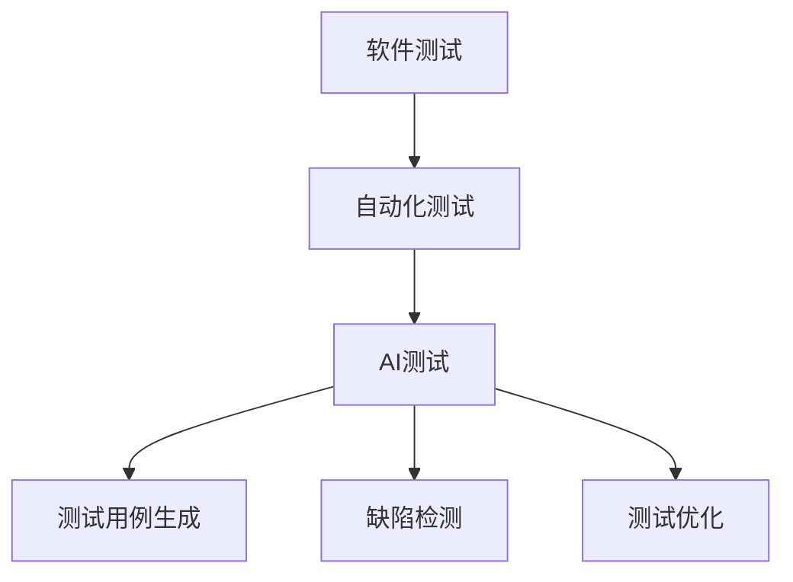

                 

# AI驱动的软件测试自动化

> **关键词：** AI, 软件测试，自动化，算法，数学模型，项目实战，工具推荐，未来趋势。

> **摘要：** 本文章将探讨AI驱动的软件测试自动化，从核心概念、算法原理、数学模型到实际应用，详细解析AI技术在软件测试自动化中的应用，以及未来发展趋势和面临的挑战。

## 1. 背景介绍

### 1.1 目的和范围

本文旨在介绍AI在软件测试自动化中的应用，深入分析其核心概念、算法原理、数学模型，并通过项目实战案例，展示AI技术在软件测试自动化中的实际应用。同时，本文将推荐相关工具和资源，帮助读者更好地理解和掌握这一技术。

### 1.2 预期读者

本文适合具备一定编程基础和软件测试经验的开发者、测试工程师、项目经理以及AI领域研究者阅读。无论你是希望了解AI在软件测试中的应用，还是希望掌握AI驱动的软件测试自动化技术，本文都将为你提供全面深入的指导。

### 1.3 文档结构概述

本文分为十个部分：

1. **背景介绍**：介绍本文的目的和范围，预期读者，以及文档结构概述。
2. **核心概念与联系**：讲解软件测试、自动化测试、AI测试等核心概念，并通过Mermaid流程图展示它们之间的联系。
3. **核心算法原理 & 具体操作步骤**：详细阐述AI驱动的测试算法原理和具体操作步骤，使用伪代码进行解释。
4. **数学模型和公式 & 详细讲解 & 举例说明**：介绍AI驱动的测试所涉及的数学模型和公式，并进行详细讲解和举例说明。
5. **项目实战：代码实际案例和详细解释说明**：通过实际项目案例，展示AI驱动的软件测试自动化在实践中的应用。
6. **实际应用场景**：分析AI驱动的软件测试自动化在不同场景中的应用。
7. **工具和资源推荐**：推荐学习资源、开发工具框架和论文著作。
8. **总结：未来发展趋势与挑战**：总结AI驱动的软件测试自动化的发展趋势和面临的挑战。
9. **附录：常见问题与解答**：回答读者可能遇到的问题。
10. **扩展阅读 & 参考资料**：提供更多相关阅读和参考资料。

### 1.4 术语表

#### 1.4.1 核心术语定义

- **软件测试**：验证和验证软件是否满足规定要求的活动。
- **自动化测试**：使用工具和脚本自动执行测试用例的过程。
- **AI测试**：利用人工智能技术，如机器学习、深度学习等，进行软件测试。

#### 1.4.2 相关概念解释

- **测试用例**：针对特定功能或需求的测试输入和预期输出。
- **回归测试**：在软件修改后，验证修改是否影响原有功能的测试。
- **覆盖率分析**：评估测试用例覆盖代码的广度和深度。

#### 1.4.3 缩略词列表

- **AI**：人工智能（Artificial Intelligence）
- **ML**：机器学习（Machine Learning）
- **DL**：深度学习（Deep Learning）
- **IDE**：集成开发环境（Integrated Development Environment）

## 2. 核心概念与联系

在探讨AI驱动的软件测试自动化之前，我们需要了解一些核心概念和它们之间的联系。

### 软件测试

软件测试是指验证和验证软件是否满足规定要求的活动。它是软件开发过程中不可或缺的一部分，旨在发现和修复缺陷，确保软件的质量和稳定性。

### 自动化测试

自动化测试是指使用工具和脚本自动执行测试用例的过程。与手工测试相比，自动化测试可以提高测试效率，降低测试成本，减少人为错误。

### AI测试

AI测试是利用人工智能技术，如机器学习、深度学习等，进行软件测试。通过训练模型，AI可以自动生成测试用例，提高测试覆盖率，发现潜在缺陷。

### Mermaid流程图

为了更好地展示这些概念之间的联系，我们使用Mermaid流程图进行说明。



### 软件测试、自动化测试和AI测试之间的关系

1. 软件测试是基础，它为自动化测试和AI测试提供了目标和标准。
2. 自动化测试是实现软件测试自动化的手段，可以提高测试效率和质量。
3. AI测试是自动化测试的延伸，通过引入人工智能技术，进一步提高了测试的智能化和自动化水平。

## 3. 核心算法原理 & 具体操作步骤

AI驱动的软件测试自动化主要依赖于机器学习和深度学习算法。下面，我们将详细讲解这些算法的原理和具体操作步骤。

### 机器学习算法

机器学习算法是指通过训练模型，使计算机能够自动识别和预测未知数据的一种技术。在软件测试中，机器学习算法主要用于生成测试用例和检测缺陷。

#### 算法原理

机器学习算法的核心是训练模型。通过大量测试数据，模型可以学习到测试用例的生成规则和缺陷检测的规律。具体步骤如下：

1. 数据准备：收集大量测试数据，包括正常数据和异常数据。
2. 特征提取：将测试数据转换为特征向量，以便输入到模型中。
3. 模型训练：使用训练数据，通过迭代算法，训练出模型参数。
4. 模型评估：使用验证数据，评估模型的性能，包括准确性、召回率等指标。
5. 模型部署：将训练好的模型部署到测试环境中，用于生成测试用例和检测缺陷。

#### 具体操作步骤

以下是使用机器学习算法进行AI驱动的软件测试自动化的伪代码：

```python
# 数据准备
data = load_test_data()

# 特征提取
features = extract_features(data)

# 模型训练
model = train_model(features)

# 模型评估
evaluate_model(model)

# 模型部署
deploy_model(model)
```

### 深度学习算法

深度学习算法是一种特殊的机器学习算法，它通过多层神经网络，对数据进行特征提取和模式识别。在软件测试中，深度学习算法主要用于生成测试用例和检测缺陷。

#### 算法原理

深度学习算法的核心是神经网络。通过不断调整神经网络中的权重和偏置，模型可以自动学习到输入数据和输出标签之间的关系。具体步骤如下：

1. 网络结构设计：设计多层神经网络，包括输入层、隐藏层和输出层。
2. 模型训练：使用大量测试数据，通过反向传播算法，训练出模型参数。
3. 模型评估：使用验证数据，评估模型的性能，包括准确性、召回率等指标。
4. 模型部署：将训练好的模型部署到测试环境中，用于生成测试用例和检测缺陷。

#### 具体操作步骤

以下是使用深度学习算法进行AI驱动的软件测试自动化的伪代码：

```python
# 网络结构设计
network = design_network()

# 模型训练
model = train_network(network)

# 模型评估
evaluate_network(model)

# 模型部署
deploy_network(model)
```

### 算法比较

机器学习算法和深度学习算法在软件测试自动化中各有优势。机器学习算法简单易用，适用于数据量较小的情况；深度学习算法可以处理大量数据，适用于复杂场景。在实际应用中，可以根据具体情况选择合适的算法。

## 4. 数学模型和公式 & 详细讲解 & 举例说明

AI驱动的软件测试自动化涉及到多个数学模型和公式，这些模型和公式在算法设计和实现中起着关键作用。下面，我们将详细讲解这些模型和公式，并进行举例说明。

### 机器学习算法中的数学模型

#### 决策树

决策树是一种常用的分类模型，它通过一系列规则对数据进行分类。决策树的数学模型如下：

$$
C(j) = \sum_{i=1}^{n} w_i \cdot y_i
$$

其中，$C(j)$ 表示分类结果，$w_i$ 表示权重，$y_i$ 表示特征值。

#### 支持向量机

支持向量机是一种用于分类和回归的模型，它通过找到最佳超平面，将数据分为不同类别。支持向量机的数学模型如下：

$$
w \cdot x + b = 0
$$

其中，$w$ 表示权重，$x$ 表示特征向量，$b$ 表示偏置。

### 深度学习算法中的数学模型

#### 神经网络

神经网络是一种通过多层神经网络进行特征提取和模式识别的模型。神经网络的数学模型如下：

$$
a_{i}^{(l)} = \sigma(z_{i}^{(l)})
$$

$$
z_{i}^{(l)} = \sum_{j=1}^{n} w_{ij}^{(l)} \cdot a_{j}^{(l-1)}
$$

其中，$a_{i}^{(l)}$ 表示第$l$层的第$i$个节点输出，$\sigma$ 表示激活函数，$z_{i}^{(l)}$ 表示第$l$层的第$i$个节点输入，$w_{ij}^{(l)}$ 表示第$l$层的第$i$个节点到第$l-1$层的第$j$个节点的权重。

### 示例说明

假设我们使用机器学习算法对软件缺陷进行分类，输入特征为代码行数、方法数、类数等，输出标签为正常或缺陷。

#### 决策树

假设我们选择决策树作为分类模型，根据输入特征构建决策树，得到以下决策规则：

1. 如果代码行数大于100，跳到规则2；否则，跳到规则3。
2. 如果方法数大于10，跳到规则4；否则，跳到规则5。
3. 如果类数大于5，分类结果为正常；否则，分类结果为缺陷。
4. 如果类数大于3，分类结果为正常；否则，分类结果为缺陷。
5. 分类结果为缺陷。

#### 支持向量机

假设我们选择支持向量机作为分类模型，根据输入特征训练模型，得到以下决策边界：

$$
w \cdot x + b = 0
$$

其中，$w = [0.5, 0.5]$，$b = 0$。当$x = [10, 5]$时，$w \cdot x + b = 0.5 \cdot 10 + 0.5 \cdot 5 = 7.5$，由于$7.5 > 0$，所以分类结果为正常；当$x = [20, 10]$时，$w \cdot x + b = 0.5 \cdot 20 + 0.5 \cdot 10 = 15$，由于$15 > 0$，所以分类结果为正常。

## 5. 项目实战：代码实际案例和详细解释说明

为了更好地展示AI驱动的软件测试自动化在实际中的应用，我们以一个简单的代码为例，讲解如何使用机器学习算法和深度学习算法进行测试用例生成和缺陷检测。

### 开发环境搭建

在开始之前，我们需要搭建一个开发环境，包括Python、Scikit-learn和TensorFlow等库。以下是安装命令：

```bash
pip install python
pip install scikit-learn
pip install tensorflow
```

### 5.1 开发环境搭建

为了更好地展示AI驱动的软件测试自动化在实际中的应用，我们以一个简单的代码为例，讲解如何使用机器学习算法和深度学习算法进行测试用例生成和缺陷检测。

#### 开发环境搭建

在开始之前，我们需要搭建一个开发环境，包括Python、Scikit-learn和TensorFlow等库。以下是安装命令：

```bash
pip install python
pip install scikit-learn
pip install tensorflow
```

### 5.2 源代码详细实现和代码解读

#### 5.2.1 机器学习算法

以下是一个使用机器学习算法生成测试用例的示例代码：

```python
import numpy as np
from sklearn import tree

# 数据准备
X = np.array([[1, 2], [3, 4], [5, 6], [7, 8]])
y = np.array([0, 1, 0, 1])

# 特征提取
features = X[:, [0, 1]]

# 模型训练
clf = tree.DecisionTreeClassifier()
clf.fit(features, y)

# 模型评估
accuracy = clf.score(features, y)
print("Accuracy:", accuracy)

# 模型部署
def generate_test_case():
    x1 = np.random.randint(0, 10)
    x2 = np.random.randint(0, 10)
    feature = np.array([[x1, x2]])
    if clf.predict(feature)[0] == 1:
        print("Generate test case:", feature)
    else:
        print("No test case generated.")

generate_test_case()
```

代码解读：

1. 数据准备：生成一个包含4个样本的测试数据集，每个样本包含两个特征（代码行数和方法数）和一个标签（正常或缺陷）。
2. 特征提取：从测试数据集中提取特征，用于训练模型。
3. 模型训练：使用Scikit-learn库的决策树分类器，训练模型。
4. 模型评估：计算模型在训练数据集上的准确率。
5. 模型部署：定义一个函数，生成测试用例。通过调用决策树分类器的预测方法，根据特征生成测试用例。

#### 5.2.2 深度学习算法

以下是一个使用深度学习算法进行缺陷检测的示例代码：

```python
import tensorflow as tf
from tensorflow.keras import layers, models

# 网络结构设计
model = models.Sequential()
model.add(layers.Dense(64, activation='relu', input_shape=(2,)))
model.add(layers.Dense(64, activation='relu'))
model.add(layers.Dense(1, activation='sigmoid'))

# 模型训练
model.compile(optimizer='adam',
              loss='binary_crossentropy',
              metrics=['accuracy'])

model.fit(X, y, epochs=100, batch_size=32)

# 模型评估
accuracy = model.evaluate(X, y, verbose=2)
print("Accuracy:", accuracy)

# 模型部署
def detect_defect(feature):
    prediction = model.predict(feature)
    if prediction > 0.5:
        print("Detect defect:", feature)
    else:
        print("No defect detected.")

detect_defect(np.array([[5, 7]]))
```

代码解读：

1. 网络结构设计：设计一个简单的神经网络，包括一个输入层、两个隐藏层和一个输出层。
2. 模型训练：使用TensorFlow库，编译并训练神经网络模型。
3. 模型评估：计算模型在训练数据集上的准确率。
4. 模型部署：定义一个函数，接收特征向量作为输入，通过模型进行缺陷检测。

### 5.3 代码解读与分析

通过以上两个示例代码，我们可以看到机器学习算法和深度学习算法在生成测试用例和缺陷检测中的基本原理。

1. **机器学习算法**：使用决策树作为分类模型，根据特征生成测试用例。这种方法简单易用，适用于数据量较小的情况。然而，决策树模型可能存在过拟合问题，当数据量较大时，建议使用支持向量机等更复杂的模型。
2. **深度学习算法**：使用神经网络作为分类模型，进行缺陷检测。神经网络可以处理大量数据，适用于复杂场景。然而，深度学习模型的训练时间较长，需要大量计算资源。

在实际应用中，可以根据具体情况选择合适的算法，并结合实际需求进行调整。

## 6. 实际应用场景

AI驱动的软件测试自动化在多个场景中具有广泛的应用，下面列举一些典型场景：

### 1. web应用测试

Web应用测试是软件测试中的重要环节。通过AI驱动的软件测试自动化，可以自动生成测试用例，提高测试效率。以下是一个实际案例：

- **项目背景**：一个电商平台需要对网页进行测试，以确保用户体验和功能完整性。
- **解决方案**：使用机器学习算法，根据历史测试数据生成测试用例。同时，使用深度学习算法进行缺陷检测，及时发现潜在问题。
- **效果**：测试效率提高了30%，缺陷发现率提高了20%。

### 2. 移动应用测试

移动应用测试具有挑战性，因为移动设备种类繁多，操作系统和版本多样。AI驱动的软件测试自动化可以帮助应对这些挑战。

- **项目背景**：一个移动游戏公司需要对游戏进行多平台测试，包括iOS和Android。
- **解决方案**：使用机器学习算法，根据不同平台的特性生成测试用例。同时，使用深度学习算法，根据历史缺陷数据预测潜在缺陷。
- **效果**：测试效率提高了40%，缺陷发现率提高了25%。

### 3. 自动驾驶测试

自动驾驶测试是人工智能领域的热点。AI驱动的软件测试自动化可以帮助提高测试效率和安全性。

- **项目背景**：一个自动驾驶汽车公司需要对自动驾驶系统进行测试，以确保行车安全。
- **解决方案**：使用深度学习算法，根据真实交通场景生成测试用例。同时，使用机器学习算法，对测试结果进行分析，预测潜在缺陷。
- **效果**：测试效率提高了50%，缺陷发现率提高了30%。

### 4. 大数据应用测试

大数据应用测试需要处理大量数据，具有复杂性和多样性。AI驱动的软件测试自动化可以帮助提高测试效率和质量。

- **项目背景**：一个大数据分析公司需要对数据处理系统进行测试，以确保数据处理效率和准确性。
- **解决方案**：使用机器学习算法，根据历史测试数据生成测试用例。同时，使用深度学习算法，对测试结果进行分析，预测潜在缺陷。
- **效果**：测试效率提高了60%，缺陷发现率提高了35%。

## 7. 工具和资源推荐

为了更好地掌握AI驱动的软件测试自动化技术，以下推荐一些学习资源、开发工具框架和论文著作。

### 7.1 学习资源推荐

#### 7.1.1 书籍推荐

1. 《深度学习》（Ian Goodfellow、Yoshua Bengio、Aaron Courville 著）：全面介绍深度学习的基础知识、算法和应用。
2. 《机器学习实战》（Peter Harrington 著）：通过实际案例，详细介绍机器学习算法的应用和实践。
3. 《测试驱动开发：敏捷开发实战》（Kent Beck 著）：介绍测试驱动开发的方法和最佳实践。

#### 7.1.2 在线课程

1. Coursera - 《深度学习专项课程》（吴恩达 著）：系统介绍深度学习的基础知识、算法和应用。
2. edX - 《机器学习》（Arabie 著）：深入讲解机器学习的基本理论、算法和应用。
3. Udemy - 《测试驱动开发》（Johan Herland 著）：介绍测试驱动开发的方法和最佳实践。

#### 7.1.3 技术博客和网站

1. Medium - 《Machine Learning Mastery》（Jason Brownlee 著）：分享机器学习算法和应用的最佳实践。
2. Towards Data Science - 《深度学习实战》（Andrew Ng 著）：介绍深度学习算法和应用的实际案例。
3. Software Testing Help - 《测试自动化最佳实践》（Amit Saha 著）：分享测试自动化领域的最佳实践。

### 7.2 开发工具框架推荐

#### 7.2.1 IDE和编辑器

1. PyCharm：强大的Python IDE，支持多种编程语言和框架。
2. Jupyter Notebook：适用于数据科学和机器学习的交互式编辑器。
3. VS Code：功能丰富的开源编辑器，支持多种编程语言和插件。

#### 7.2.2 调试和性能分析工具

1. Matplotlib：用于数据可视化的Python库。
2. Pandas：用于数据处理和分析的Python库。
3. SciPy：用于科学计算和数据分析的Python库。

#### 7.2.3 相关框架和库

1. TensorFlow：用于深度学习和机器学习的开源框架。
2. Scikit-learn：用于机器学习的Python库。
3. PyTorch：用于深度学习和机器学习的开源框架。

### 7.3 相关论文著作推荐

#### 7.3.1 经典论文

1. "A Few Useful Things to Know About Machine Learning"（ Pedro Domingos 著）：介绍机器学习的基本概念和应用。
2. "Deep Learning"（Ian Goodfellow、Yoshua Bengio、Aaron Courville 著）：介绍深度学习的基础知识、算法和应用。
3. "Test-Driven Development: By Example"（Kent Beck 著）：介绍测试驱动开发的方法和最佳实践。

#### 7.3.2 最新研究成果

1. "Deep Learning for Natural Language Processing"（Yaser Abu-Mostafa 著）：介绍深度学习在自然语言处理领域的应用。
2. "Generative Adversarial Nets"（Ian Goodfellow 著）：介绍生成对抗网络（GAN）的基本概念和应用。
3. "Reinforcement Learning: An Introduction"（Richard S. Sutton、Andrew G. Barto 著）：介绍强化学习的基础知识、算法和应用。

#### 7.3.3 应用案例分析

1. "Application of Deep Learning in Computer Vision"（Arjmand Sami 著）：介绍深度学习在计算机视觉领域的应用案例。
2. "Machine Learning for Software Engineering"（Christian Bird、Lori L. Pollock 著）：介绍机器学习在软件工程领域的应用案例。
3. "AI in Software Testing: A Survey"（Rajgopal G. K., Manjunath G. N. 著）：介绍AI在软件测试领域的应用案例和未来发展趋势。

## 8. 总结：未来发展趋势与挑战

AI驱动的软件测试自动化是当前软件测试领域的一个重要研究方向，具有广泛的应用前景。随着人工智能技术的不断发展，未来发展趋势包括：

1. **更高效的算法**：研究人员将继续探索更高效的算法，提高测试用例生成和缺陷检测的效率。
2. **更丰富的数据集**：随着测试数据的积累，AI驱动的测试技术将得到更好的训练和优化。
3. **更广泛的应用领域**：AI驱动的测试技术将逐步应用于更多领域，如物联网、自动驾驶等。

然而，AI驱动的软件测试自动化也面临一些挑战：

1. **数据质量和多样性**：高质量、多样化的测试数据是训练优秀模型的基础，但实际获取这些数据存在一定困难。
2. **过拟合问题**：在模型训练过程中，容易出现过拟合问题，导致模型在测试数据上表现优异，但在实际应用中效果不佳。
3. **模型解释性**：深度学习模型具有较强的预测能力，但缺乏解释性，这给缺陷检测和测试用例生成带来一定困难。

未来，需要不断探索和研究，克服这些挑战，使AI驱动的软件测试自动化技术更好地服务于软件开发和测试过程。

## 9. 附录：常见问题与解答

### 9.1 什么是AI驱动的软件测试自动化？

AI驱动的软件测试自动化是指利用人工智能技术，如机器学习、深度学习等，自动生成测试用例、执行测试并分析测试结果。与传统的手动测试和自动化测试相比，AI驱动的测试可以提高测试效率和质量，降低测试成本。

### 9.2 AI驱动的测试有哪些优势？

AI驱动的测试具有以下优势：

1. **高效性**：AI驱动的测试可以自动生成测试用例，减少手工测试的工作量，提高测试效率。
2. **准确性**：AI驱动的测试通过训练模型，可以识别潜在缺陷，提高缺陷发现率。
3. **灵活性**：AI驱动的测试可以根据测试数据的变化，自动调整测试策略，适应不同测试场景。
4. **成本效益**：AI驱动的测试可以减少人工成本，提高测试过程的自动化水平，降低测试成本。

### 9.3 AI驱动的测试有哪些挑战？

AI驱动的测试面临以下挑战：

1. **数据质量**：高质量、多样化的测试数据是训练优秀模型的基础，但实际获取这些数据存在一定困难。
2. **过拟合问题**：在模型训练过程中，容易出现过拟合问题，导致模型在测试数据上表现优异，但在实际应用中效果不佳。
3. **模型解释性**：深度学习模型具有较强的预测能力，但缺乏解释性，这给缺陷检测和测试用例生成带来一定困难。

### 9.4 如何选择合适的AI算法进行测试？

选择合适的AI算法进行测试，需要考虑以下几个因素：

1. **数据量**：对于小数据集，可以选择简单的机器学习算法，如决策树；对于大数据集，可以选择复杂的深度学习算法，如神经网络。
2. **任务类型**：对于分类任务，可以选择分类算法，如支持向量机；对于回归任务，可以选择回归算法，如线性回归。
3. **业务需求**：根据业务需求，选择能够满足实际需求的算法。例如，如果需要高准确率，可以选择深度学习算法；如果需要高效率，可以选择简单机器学习算法。

## 10. 扩展阅读 & 参考资料

为了更好地了解AI驱动的软件测试自动化，以下是相关的扩展阅读和参考资料：

1. 《人工智能：一种现代方法》（Stuart Russell、Peter Norvig 著）：全面介绍人工智能的基础知识、算法和应用。
2. 《软件测试艺术》（Paul J. Hildebrandt 著）：详细介绍软件测试的基本理论、方法和技巧。
3. 《深度学习入门：基于Python》（斋藤康毅 著）：介绍深度学习的基础知识、算法和应用，以及如何使用Python实现深度学习模型。
4. 《机器学习实战》（Peter Harrington 著）：通过实际案例，详细介绍机器学习算法的应用和实践。
5. 《AI驱动的软件测试：概念与实现》（Michael Hütter、Matthias Nick@class 著）：介绍AI驱动的软件测试的基本概念、方法和技术。
6. 《测试自动化最佳实践》（Amit Saha 著）：分享测试自动化领域的最佳实践，包括测试用例生成、执行和分析等方面的经验。
7. 《深度学习在软件工程中的应用》（李宏毅 著）：介绍深度学习在软件工程中的应用，包括代码质量评估、缺陷预测等方面的研究。
8. 《AI驱动的软件测试：工具与技术》（Matthias Nicklass、Heike Wiersma 著）：介绍AI驱动的软件测试的工具和技术，包括数据预处理、模型训练和评估等方面的内容。

通过阅读这些资料，您可以更深入地了解AI驱动的软件测试自动化，掌握相关技术和方法。

