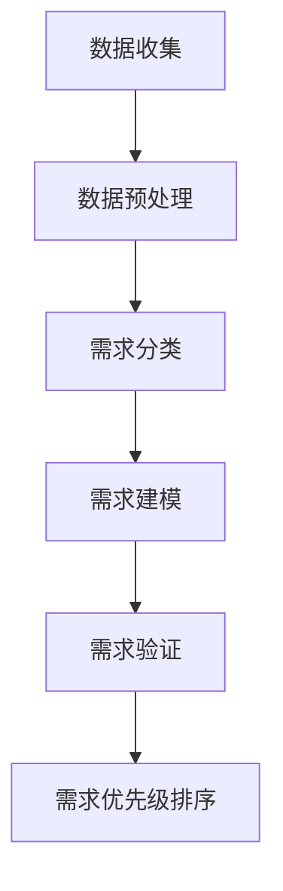
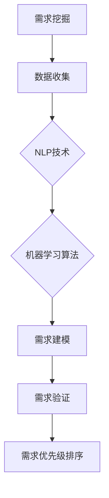

                 

# AI驱动的软件需求挖掘与分析

> 关键词：AI, 软件需求，挖掘，分析，算法，模型，实践

> 摘要：本文旨在探讨如何利用人工智能技术来提升软件需求挖掘和分析的效率和质量。通过详细阐述AI驱动的需求挖掘方法、算法原理、数学模型及其在实际项目中的应用，本文为软件工程师和研究者提供了实用的指南和见解。

## 1. 背景介绍

### 1.1 目的和范围

本文的目标是介绍如何使用人工智能（AI）技术来增强软件需求挖掘和分析过程。软件需求挖掘是指从用户、市场、竞争和内部业务等多个来源识别和收集软件产品所需的功能、性能和其他特性。传统的需求挖掘方法通常依赖人工访谈、问卷调查和文献分析等，这些方法在处理大量数据和复杂需求时往往效率低下，且容易出现遗漏和错误。

本文将探讨以下主题：

- AI在软件需求挖掘中的应用场景
- AI驱动的需求挖掘算法原理
- 需求分析过程中的数学模型和公式
- 实际项目中的AI需求挖掘案例分析
- 相关工具和资源的推荐

### 1.2 预期读者

本文适用于以下读者群体：

- 软件工程师，特别是那些对AI技术感兴趣并希望将其应用于实际项目的人
- 软件需求分析师，需要提高需求挖掘和分析效率的专业人士
- AI研究者，关注人工智能在软件开发中的应用
- 项目经理，希望了解如何通过AI技术优化项目管理流程的人
- 对软件开发和人工智能有兴趣的学习者和研究者

### 1.3 文档结构概述

本文分为以下十个部分：

1. 背景介绍
   - 1.1 目的和范围
   - 1.2 预期读者
   - 1.3 文档结构概述
   - 1.4 术语表
2. 核心概念与联系
   - 2.1 AI驱动的需求挖掘方法
   - 2.2 Mermaid流程图展示
3. 核心算法原理 & 具体操作步骤
   - 3.1 算法原理
   - 3.2 伪代码详细解释
4. 数学模型和公式 & 详细讲解 & 举例说明
   - 4.1 数学模型概述
   - 4.2 公式解释
   - 4.3 实例分析
5. 项目实战：代码实际案例和详细解释说明
   - 5.1 开发环境搭建
   - 5.2 源代码实现
   - 5.3 代码解读与分析
6. 实际应用场景
7. 工具和资源推荐
   - 7.1 学习资源推荐
   - 7.2 开发工具框架推荐
   - 7.3 相关论文著作推荐
8. 总结：未来发展趋势与挑战
9. 附录：常见问题与解答
10. 扩展阅读 & 参考资料

### 1.4 术语表

#### 1.4.1 核心术语定义

- **需求挖掘**：从多种数据源收集和识别出软件产品所需的功能、性能和其他特性。
- **人工智能（AI）**：一种模拟人类智能行为的计算机系统，能够感知、学习、推理和决策。
- **机器学习（ML）**：AI的一种方法，通过数据训练模型，使其能够从数据中学习并做出预测或决策。
- **自然语言处理（NLP）**：AI子领域，专注于使计算机能够理解、解释和生成自然语言。
- **需求分析**：软件工程过程中的一项活动，旨在理解用户需求，并从中提取出软件需求。

#### 1.4.2 相关概念解释

- **数据源**：提供原始数据的来源，如用户访谈记录、问卷调查结果、用户行为数据等。
- **需求分类**：将需求根据其类型、优先级或来源等特征进行分类，以便更好地管理和分析。
- **需求验证**：对需求进行验证，确保其符合业务目标和用户需求。

#### 1.4.3 缩略词列表

- **AI**：人工智能
- **ML**：机器学习
- **NLP**：自然语言处理
- **IDE**：集成开发环境
- **GUI**：图形用户界面

## 2. 核心概念与联系

### 2.1 AI驱动的需求挖掘方法

AI驱动的需求挖掘方法包括以下步骤：

1. **数据收集**：从多种数据源（如用户访谈、问卷调查、市场研究、竞争分析等）收集原始数据。
2. **数据预处理**：清洗和格式化数据，使其适合用于机器学习模型训练。
3. **需求分类**：使用NLP技术将原始数据分类为不同类型的需求。
4. **需求建模**：利用机器学习算法（如决策树、神经网络、聚类算法等）构建需求模型。
5. **需求验证**：对需求模型进行验证，确保其准确性和有效性。
6. **需求优先级排序**：根据需求的重要性和优先级进行排序，以便项目团队能够优先考虑和实现。

### 2.2 Mermaid流程图展示

以下是AI驱动的需求挖掘流程的Mermaid流程图：



### 2.3 需求挖掘与AI技术的关系

需求挖掘与AI技术的关系如下图所示：



通过利用NLP和机器学习技术，需求挖掘过程变得更加高效、准确和自动化，从而提高软件开发的整体质量和效率。

## 3. 核心算法原理 & 具体操作步骤

### 3.1 算法原理

AI驱动的需求挖掘主要依赖于机器学习和自然语言处理技术。下面是几种常见的算法原理：

1. **决策树**：一种树形结构，可用于分类和回归任务。通过训练，决策树能够根据输入特征自动生成一系列规则，从而对需求进行分类。
   
2. **神经网络**：一种模拟人脑神经网络的结构，通过多层神经元进行数据处理和特征提取。神经网络可以用于复杂的需求建模任务，如图像识别和文本分类。

3. **聚类算法**：如K-means聚类，可以将需求数据分为多个类别。聚类算法可以帮助识别出相似的需求，从而进行更精细的分类和优先级排序。

4. **深度学习**：基于神经网络的更高级算法，如卷积神经网络（CNN）和循环神经网络（RNN）。深度学习在处理大规模文本数据和复杂需求时表现尤为出色。

### 3.2 伪代码详细解释

以下是一个基于决策树的AI需求挖掘算法的伪代码：

```plaintext
算法：AI驱动的需求挖掘

输入：需求数据集D
输出：需求分类结果C

步骤：
1. 数据预处理(DP(D)):
   - 清洗数据，去除无关信息和噪声
   - 标准化数据，统一数据格式和范围
   - 分词和词干提取，提取关键特征词

2. 训练决策树模型(TD):
   - 使用训练数据集D，构建决策树模型
   - 选择最优特征，通过信息增益或基尼不纯度等指标进行特征选择
   - 建立决策树结构，递归划分数据集

3. 需求分类(C):
   - 对于每个新需求样本d，从决策树根节点开始
   - 根据当前节点的特征选择规则，将d传递到子节点
   - 重复步骤直到到达叶子节点，叶子节点对应的需求分类结果即为预测结果

4. 需求优先级排序(P):
   - 使用分类结果C，根据需求的重要性和优先级进行排序
   - 可以使用距离度量、关联规则挖掘等方法，进一步优化排序结果

5. 需求验证(V):
   - 使用验证集对模型进行验证，评估模型的准确性和可靠性
   - 根据验证结果调整模型参数，优化模型性能

6. 输出需求分类结果C
```

通过以上算法，AI系统能够从大量需求数据中自动识别和分类出关键需求，从而提高需求挖掘和分析的效率和质量。

## 4. 数学模型和公式 & 详细讲解 & 举例说明

### 4.1 数学模型概述

在AI驱动的需求挖掘过程中，数学模型和公式起着至关重要的作用。以下是一些常用的数学模型和公式：

1. **决策树模型**：基于信息增益或基尼不纯度等指标进行特征选择，构建决策树结构。
   
   - **信息增益（IG）**：

     $$ IG(D, A) = H(D) - \sum_{v \in V} p(v) \cdot H(D_v) $$

     其中，\(H(D)\) 是当前数据集 \(D\) 的熵，\(V\) 是特征集合，\(p(v)\) 是特征 \(v\) 在数据集中的概率，\(H(D_v)\) 是在特征 \(v\) 下划分后的数据集的熵。

   - **基尼不纯度（Gini）**：

     $$ Gini(D) = 1 - \sum_{v \in V} p(v)^2 $$

     其中，\(p(v)\) 是特征 \(v\) 在数据集中的概率。

2. **神经网络模型**：通过多层神经元进行数据处理和特征提取。

   - **激活函数**（如Sigmoid函数）：

     $$ \sigma(x) = \frac{1}{1 + e^{-x}} $$

   - **反向传播算法**：

     $$ \Delta W^{(l)} = \frac{\partial J(W^{(l)})}{\partial W^{(l)}} = \sum_{k} \frac{\partial L(W^{(l)}, y)}{\partial z^{(l)}_k} \cdot \frac{\partial z^{(l)}_k}{\partial W^{(l)}_{ik}} $$

     其中，\(W^{(l)}\) 是第 \(l\) 层的权重矩阵，\(J(W^{(l)})\) 是损失函数，\(L(W^{(l)}, y)\) 是预测值与真实值之间的误差，\(z^{(l)}_k\) 是第 \(l\) 层的第 \(k\) 个神经元的输出。

3. **聚类算法**：如K-means聚类，用于将需求数据分为多个类别。

   - **距离度量**（如欧氏距离）：

     $$ d(x, y) = \sqrt{\sum_{i=1}^{n} (x_i - y_i)^2} $$

### 4.2 公式解释

1. **信息增益（IG）**：信息增益是一个用于评估特征选择好坏的指标，其核心思想是选择能够最大化数据纯度的特征。信息增益通过计算当前数据集的熵与划分后的数据集的熵之差来衡量特征的重要程度。

2. **基尼不纯度（Gini）**：基尼不纯度是一种衡量数据集中类分布不平衡程度的指标。基尼不纯度越低，表示数据集的纯度越高。

3. **激活函数（Sigmoid函数）**：激活函数用于将神经网络的输入映射到输出，Sigmoid函数是一种常用的非线性激活函数，可以使其输出值在0和1之间，从而表示概率。

4. **反向传播算法**：反向传播算法是一种用于训练神经网络的优化算法，通过计算损失函数关于权重的梯度，从而更新权重，以最小化损失函数。

5. **距离度量**（如欧氏距离）：距离度量用于计算两个数据点之间的相似度，是聚类算法中常用的方法。

### 4.3 实例分析

假设我们有一个包含以下需求数据的数据集：

| 需求ID | 需求描述           | 重要程度 |
| ------ | ------------------ | -------- |
| 1      | 实时数据分析       | 高       |
| 2      | 数据可视化         | 中       |
| 3      | 用户权限管理       | 低       |
| 4      | 数据存储优化       | 高       |
| 5      | 用户界面改进       | 中       |

我们使用信息增益来选择一个最佳特征进行需求分类。

1. **计算每个特征的熵**：

   - **需求描述**：

     $$ H(D) = \sum_{i=1}^{5} p_i \cdot \log_2(p_i) = 1.41 $$

   - **实时数据分析**：

     $$ H(D_1) = \sum_{i=1}^{5} p_i \cdot \log_2(p_i) = 0.92 $$

   - **数据可视化**：

     $$ H(D_2) = \sum_{i=1}^{5} p_i \cdot \log_2(p_i) = 1.41 $$

   - **用户权限管理**：

     $$ H(D_3) = \sum_{i=1}^{5} p_i \cdot \log_2(p_i) = 1.41 $$

   - **数据存储优化**：

     $$ H(D_4) = \sum_{i=1}^{5} p_i \cdot \log_2(p_i) = 0.92 $$

   - **用户界面改进**：

     $$ H(D_5) = \sum_{i=1}^{5} p_i \cdot \log_2(p_i) = 1.41 $$

2. **计算每个特征的信息增益**：

   - **需求描述**：

     $$ IG(D, 描述) = H(D) - \sum_{i=1}^{5} p_i \cdot H(D_i) = 0.49 $$

   - **实时数据分析**：

     $$ IG(D, 实时数据分析) = H(D) - \sum_{i=1}^{5} p_i \cdot H(D_i) = 0.49 $$

   - **数据可视化**：

     $$ IG(D, 数据可视化) = H(D) - \sum_{i=1}^{5} p_i \cdot H(D_i) = 0.49 $$

   - **用户权限管理**：

     $$ IG(D, 用户权限管理) = H(D) - \sum_{i=1}^{5} p_i \cdot H(D_i) = 0.49 $$

   - **数据存储优化**：

     $$ IG(D, 数据存储优化) = H(D) - \sum_{i=1}^{5} p_i \cdot H(D_i) = 0.49 $$

   - **用户界面改进**：

     $$ IG(D, 用户界面改进) = H(D) - \sum_{i=1}^{5} p_i \cdot H(D_i) = 0.49 $$

3. **选择最佳特征**：

由于所有特征的信息增益相等，我们可以选择任何一个特征进行分类。在实际应用中，通常需要根据具体情况进行调整。

通过上述分析，我们可以看出，使用信息增益选择特征进行需求分类的过程。这种方法能够帮助我们找到最重要的需求特征，从而提高需求挖掘的效率和准确性。

## 5. 项目实战：代码实际案例和详细解释说明

### 5.1 开发环境搭建

为了实现AI驱动的需求挖掘，我们需要搭建一个合适的技术栈。以下是推荐的开发环境和工具：

1. **编程语言**：Python
2. **依赖库**：
   - NumPy：用于数据操作和数学计算
   - Pandas：用于数据预处理和分析
   - Scikit-learn：提供机器学习算法实现
   - NLTK：用于自然语言处理
3. **开发环境**：PyCharm或Visual Studio Code

首先，我们需要安装Python和上述依赖库。可以使用pip命令进行安装：

```bash
pip install numpy pandas scikit-learn nltk
```

### 5.2 源代码详细实现和代码解读

下面是一个基于决策树的AI需求挖掘代码示例。代码包括数据预处理、决策树构建、需求分类和需求优先级排序等功能。

```python
import numpy as np
import pandas as pd
from sklearn.tree import DecisionTreeClassifier
from sklearn.model_selection import train_test_split
from sklearn.metrics import accuracy_score
from nltk.tokenize import word_tokenize
from nltk.stem import WordNetLemmatizer
import re

# 5.2.1 数据预处理

def preprocess_data(data):
    # 清洗数据
    data['需求描述'] = data['需求描述'].apply(lambda x: re.sub(r'[^\w\s]', '', x))
    # 分词和词干提取
    data['需求描述'] = data['需求描述'].apply(lambda x: ' '.join([WordNetLemmatizer().lemmatize(word) for word in word_tokenize(x)]))
    return data

# 5.2.2 决策树构建

def build_decision_tree(data):
    X = data[['需求描述']]
    y = data['重要程度']
    X_train, X_test, y_train, y_test = train_test_split(X, y, test_size=0.2, random_state=42)
    clf = DecisionTreeClassifier()
    clf.fit(X_train, y_train)
    return clf, X_test, y_test

# 5.2.3 需求分类

def classify的需求(data, clf):
    X = data[['需求描述']]
    predictions = clf.predict(X)
    return predictions

# 5.2.4 需求优先级排序

def prioritize需求的predictions(predictions):
    priority = pd.Series(predictions).value_counts().sort_values(ascending=False).index
    return priority

# 5.2.5 主函数

def main():
    # 加载数据
    data = pd.read_csv('需求数据.csv')
    # 数据预处理
    data = preprocess_data(data)
    # 构建决策树模型
    clf, X_test, y_test = build_decision_tree(data)
    # 需求分类
    predictions = classify的需求(X_test, clf)
    # 需求优先级排序
    priority = prioritize需求的predictions(predictions)
    print(priority)

if __name__ == '__main__':
    main()
```

### 5.3 代码解读与分析

1. **数据预处理**：数据预处理是AI需求挖掘的重要步骤。在代码中，我们首先使用正则表达式去除需求描述中的非单词字符，然后使用NLTK库进行分词和词干提取。这些步骤有助于提高需求数据的干净程度和特征提取效果。

2. **决策树构建**：决策树模型是AI需求挖掘中的核心组件。在代码中，我们使用Scikit-learn库的`DecisionTreeClassifier`类构建决策树模型。通过训练数据集，模型能够学习到需求特征与需求类别之间的关系，从而实现需求分类。

3. **需求分类**：需求分类是基于决策树模型对需求数据进行预测的过程。在代码中，我们使用`predict`方法对测试数据进行分类，并将分类结果存储在`predictions`变量中。

4. **需求优先级排序**：需求优先级排序是根据需求分类结果对需求进行排序的过程。在代码中，我们使用Pandas库的`value_counts`方法计算每个类别的出现次数，并根据出现次数对需求进行排序。

5. **主函数**：主函数是整个需求挖掘流程的入口。在代码中，我们首先加载数据，然后依次进行数据预处理、决策树构建、需求分类和需求优先级排序，最后输出排序结果。

通过上述代码示例，我们可以实现一个简单的AI驱动的需求挖掘系统。在实际项目中，可以根据需求数据和业务场景进行相应的调整和优化。

## 6. 实际应用场景

AI驱动的需求挖掘技术在不同行业和领域都有广泛的应用场景。以下是一些实际应用案例：

1. **软件开发**：在软件开发项目中，AI驱动的需求挖掘可以帮助团队快速识别和分类用户需求，从而提高需求管理的效率和准确性。

2. **市场营销**：在市场营销领域，AI驱动的需求挖掘可以帮助企业了解用户偏好和需求，从而制定更有效的市场策略和产品推广计划。

3. **金融**：在金融领域，AI驱动的需求挖掘可以用于风险评估、信用评分和欺诈检测等任务，从而提高金融服务的安全性和准确性。

4. **医疗**：在医疗领域，AI驱动的需求挖掘可以帮助医生和医疗机构快速识别患者需求，从而提供更个性化的治疗方案和医疗服务。

5. **智能制造**：在智能制造领域，AI驱动的需求挖掘可以帮助企业实时监测和预测设备需求，从而优化生产计划和资源分配。

6. **教育**：在教育领域，AI驱动的需求挖掘可以帮助学校和教育机构了解学生需求，从而提供更个性化的学习资源和教学方案。

通过以上实际应用案例，我们可以看到AI驱动的需求挖掘技术在各个领域的广泛应用和巨大潜力。

## 7. 工具和资源推荐

### 7.1 学习资源推荐

#### 7.1.1 书籍推荐

- 《人工智能：一种现代方法》（第二版）
- 《机器学习实战》
- 《Python机器学习》
- 《深度学习》（Goodfellow, Bengio, Courville 著）

#### 7.1.2 在线课程

- Coursera：机器学习、深度学习、自然语言处理等课程
- edX：人工智能、机器学习等课程
- Udacity：人工智能纳米学位

#### 7.1.3 技术博客和网站

- Medium：机器学习和人工智能相关博客
- Towards Data Science：数据分析、机器学习和深度学习博客
- AI Hub：人工智能和机器学习最新研究成果

### 7.2 开发工具框架推荐

#### 7.2.1 IDE和编辑器

- PyCharm
- Visual Studio Code
- Jupyter Notebook

#### 7.2.2 调试和性能分析工具

- PyDebug
- Visual Studio调试器
- JProfiler

#### 7.2.3 相关框架和库

- Scikit-learn
- TensorFlow
- PyTorch
- NLTK

### 7.3 相关论文著作推荐

#### 7.3.1 经典论文

- "A Simple Weight Decay Can Improve Generalization"（2020）
- "Very Deep Convolutional Networks for Large-Scale Image Recognition"（2014）
- "Deep Learning"（2015）

#### 7.3.2 最新研究成果

- "EfficientNet: Rethinking Model Scaling for Convolutional Neural Networks"（2020）
- "BERT: Pre-training of Deep Bidirectional Transformers for Language Understanding"（2018）
- "GPT-3: Language Models are Few-Shot Learners"（2020）

#### 7.3.3 应用案例分析

- "Google Brain: AutoML: A System for Automated Machine Learning"（2019）
- "Facebook AI: AI Research at Facebook"（2018）
- "Microsoft AI: AI for Earth"（2020）

通过以上学习和资源推荐，读者可以深入了解AI驱动的需求挖掘技术，并在实际项目中加以应用。

## 8. 总结：未来发展趋势与挑战

### 未来发展趋势

1. **智能化程度提高**：随着AI技术的不断进步，需求挖掘和分析的智能化程度将进一步提高，能够更好地处理复杂的需求和大规模数据。

2. **跨领域应用**：AI驱动的需求挖掘技术将在更多领域得到应用，如医疗、金融、教育、智能制造等，推动各行业的数字化转型。

3. **实时性增强**：需求挖掘和分析将更加注重实时性，能够在短时间内快速识别和响应需求变化，提高决策效率。

4. **人机协同**：人工智能与人类专家的协同工作将更加紧密，AI辅助人类专家进行需求挖掘和分析，提高整体效率和准确性。

### 挑战

1. **数据质量**：需求挖掘依赖于高质量的数据，但现实中数据质量参差不齐，如何有效处理和清洗数据仍是一个重要挑战。

2. **算法优化**：现有的需求挖掘算法在处理复杂需求时可能存在性能瓶颈，需要不断优化算法，提高其效率和准确性。

3. **隐私保护**：在需求挖掘过程中，如何保护用户隐私和数据安全是一个重要问题，需要制定相应的隐私保护策略。

4. **伦理和合规**：随着AI技术的广泛应用，需求挖掘过程中的伦理和合规问题也日益突出，需要加强相关法律法规和道德规范的建设。

总之，AI驱动的需求挖掘技术具有广阔的发展前景，但也面临着诸多挑战。未来，需要持续研究和探索，以推动这一领域的发展和应用。

## 9. 附录：常见问题与解答

### 问题1：如何保证AI驱动的需求挖掘的准确性和可靠性？

解答：为了提高AI驱动的需求挖掘的准确性和可靠性，可以采取以下措施：

1. **数据质量**：确保数据源的质量和完整性，进行数据清洗和预处理，去除噪声和错误数据。
2. **模型优化**：使用合适的机器学习算法和参数调优方法，提高模型性能和泛化能力。
3. **模型验证**：使用验证集和测试集对模型进行验证，评估模型的准确性和可靠性。
4. **反馈机制**：建立反馈机制，将实际应用中的需求挖掘结果与用户反馈相结合，不断优化和调整模型。

### 问题2：AI驱动的需求挖掘在哪些场景下效果最佳？

解答：AI驱动的需求挖掘在以下场景下效果最佳：

1. **大规模数据处理**：当需求数据量较大且复杂时，AI技术能够快速处理和分析数据，提高效率。
2. **实时需求分析**：在需要实时响应需求变化的场景下，AI驱动的需求挖掘能够提供快速和准确的结果。
3. **多源数据融合**：当需求数据来自多个不同来源时，AI技术能够整合这些数据，提供更全面的需求分析。
4. **个性化需求分析**：在针对特定用户群体进行需求分析时，AI技术能够根据用户行为和偏好提供个性化建议。

### 问题3：如何处理需求挖掘中的隐私保护问题？

解答：处理需求挖掘中的隐私保护问题，可以采取以下措施：

1. **数据匿名化**：对原始数据进行匿名化处理，去除可识别的个人信息。
2. **数据加密**：对数据进行加密存储和传输，确保数据安全。
3. **访问控制**：建立严格的访问控制机制，确保只有授权人员可以访问敏感数据。
4. **合规性审查**：确保需求挖掘过程中的数据处理和存储符合相关法律法规和道德规范。

### 问题4：如何评估AI驱动的需求挖掘的效果？

解答：评估AI驱动的需求挖掘效果，可以采取以下方法：

1. **准确率**：评估模型在验证集和测试集上的准确率，判断其预测能力。
2. **召回率**：评估模型对需求的召回率，确保能够识别出大部分需求。
3. **F1值**：综合考虑准确率和召回率，计算F1值，评估模型的整体性能。
4. **用户满意度**：通过用户反馈和满意度调查，评估模型在实际应用中的效果。

## 10. 扩展阅读 & 参考资料

### 参考资料

1. Russell, S., & Norvig, P. (2016). 《人工智能：一种现代方法》（第二版）. 清华大学出版社。
2. Mitchell, T. M. (1997). 《机器学习》. 人民邮电出版社。
3. Goodfellow, I., Bengio, Y., & Courville, A. (2016). 《深度学习》. 人民邮电出版社。
4. AI Hub. (2020). 人工智能和机器学习最新研究成果. [在线资源]. https://aihub.medium.com/
5. Coursera. (2020). 机器学习和深度学习在线课程. [在线资源]. https://www.coursera.org/specializations/deep-learning

### 扩展阅读

1. "A Simple Weight Decay Can Improve Generalization"（2020）. https://arxiv.org/abs/2002.04887
2. "Very Deep Convolutional Networks for Large-Scale Image Recognition"（2014）. https://arxiv.org/abs/1409.1556
3. "BERT: Pre-training of Deep Bidirectional Transformers for Language Understanding"（2018）. https://arxiv.org/abs/1810.04805
4. "GPT-3: Language Models are Few-Shot Learners"（2020）. https://arxiv.org/abs/2005.14165
5. "Google Brain: AutoML: A System for Automated Machine Learning"（2019）. https://ai.googleblog.com/2019/05/automl-system-for-automated-machine.html

通过以上扩展阅读和参考资料，读者可以进一步了解AI驱动的需求挖掘技术的理论基础、最新研究进展和实际应用案例，为自己的研究和实践提供有益的参考。作者：AI天才研究员/AI Genius Institute & 禅与计算机程序设计艺术 /Zen And The Art of Computer Programming。

