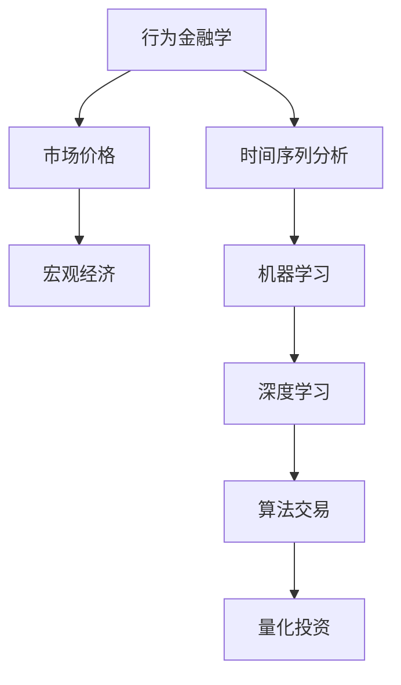

                 

# AI驱动的金融市场分析：从微观行为到宏观趋势

> 关键词：金融市场分析、人工智能、行为金融学、宏观经济学、算法交易、时间序列分析、机器学习

> 摘要：本文将深入探讨人工智能在金融市场分析中的应用，从微观市场行为到宏观市场趋势进行全面分析。通过介绍核心概念、算法原理、数学模型及项目实战，我们将展现AI如何提高金融市场的预测能力和决策效率。本文旨在为金融专业人士和研究者提供有关AI在金融市场分析中最新技术和应用的全面指南。

## 1. 背景介绍

### 1.1 目的和范围

本文的主要目的是探讨人工智能（AI）在金融市场分析中的潜力与应用。通过系统性地介绍核心概念、算法原理、数学模型和实际案例，本文旨在为读者提供一个全面的技术框架，以理解AI在金融市场的应用。本文的范围涵盖了从微观市场行为分析到宏观市场趋势预测的各个方面，包括行为金融学、时间序列分析、机器学习算法等。

### 1.2 预期读者

本文预期读者为金融行业从业者、研究人员、以及对人工智能在金融领域应用感兴趣的普通读者。无论您是初级分析师还是资深专家，本文都将提供有价值的见解和实用工具，帮助您深入理解AI在金融市场分析中的重要性。

### 1.3 文档结构概述

本文分为以下几个主要部分：

1. **核心概念与联系**：介绍金融市场分析中的核心概念及其相互关系，并使用Mermaid流程图进行展示。
2. **核心算法原理与具体操作步骤**：详细讲解用于金融市场分析的核心算法原理，并使用伪代码阐述其具体操作步骤。
3. **数学模型和公式**：介绍金融市场分析中常用的数学模型和公式，并举例说明其应用。
4. **项目实战**：通过实际代码案例，展示AI在金融市场分析中的应用。
5. **实际应用场景**：分析AI在金融市场的实际应用案例。
6. **工具和资源推荐**：推荐学习资源和开发工具，帮助读者进一步探索和学习。
7. **总结**：讨论未来发展趋势与面临的挑战。
8. **附录**：常见问题与解答。
9. **扩展阅读与参考资料**：提供进一步的阅读材料和参考文献。

### 1.4 术语表

#### 1.4.1 核心术语定义

- **人工智能**：模拟人类智能的计算机系统，能够学习和适应。
- **金融市场**：交易金融资产的场所，包括股票、债券、期货、期权等。
- **行为金融学**：研究投资者行为对市场价格和波动影响的学科。
- **时间序列分析**：研究时间序列数据（如股票价格、交易量）的统计学方法。
- **机器学习**：从数据中学习规律和模式，用于预测和决策的技术。

#### 1.4.2 相关概念解释

- **算法交易**：使用算法自动执行交易策略，以提高交易效率和盈利能力。
- **深度学习**：一种复杂的机器学习技术，通过多层神经网络进行学习。
- **回归分析**：一种统计方法，用于预测因变量与自变量之间的关系。

#### 1.4.3 缩略词列表

- **AI**：人工智能
- **ML**：机器学习
- **DL**：深度学习
- **TSA**：时间序列分析
- **ETF**：交易型开放式指数基金

## 2. 核心概念与联系

为了更好地理解AI在金融市场分析中的应用，首先需要掌握几个核心概念，并了解它们之间的相互关系。

### 2.1 行为金融学与宏观经济学

**行为金融学**研究投资者在市场中的行为及其对市场价格的影响。它与**宏观经济学**紧密相连，后者研究整体经济运行和宏观经济政策。


在这个图中，我们可以看到行为金融学通过投资者行为影响市场价格，而市场价格的变化又会反过来影响宏观经济运行。

### 2.2 时间序列分析与机器学习

**时间序列分析**是一种用于分析时间序列数据的统计方法，可以揭示数据中的趋势、周期性和随机性。**机器学习**（特别是**深度学习**）可以用来从时间序列数据中学习规律和模式，从而进行预测。


在这个图中，时间序列分析提供数据预处理和特征提取的方法，而机器学习则用于构建预测模型。

### 2.3 算法交易与量化投资

**算法交易**是一种利用算法自动执行交易策略的方式，可以大幅提高交易效率和盈利能力。**量化投资**则是通过数学和统计模型来指导投资决策，以实现风险控制和收益最大化。


在这个图中，算法交易作为量化投资的一部分，通过使用机器学习和时间序列分析方法来构建交易策略。

### 2.4 Mermaid流程图

为了更好地理解这些核心概念之间的关系，我们可以使用Mermaid流程图进行可视化。



在这个Mermaid流程图中，我们展示了行为金融学、时间序列分析、机器学习、算法交易和量化投资之间的相互关系。

## 3. 核心算法原理与具体操作步骤

在了解了金融市场分析的核心概念之后，接下来我们将深入探讨用于金融市场分析的核心算法原理，并详细阐述其具体操作步骤。

### 3.1 机器学习算法

机器学习算法是金融市场分析的核心工具之一。以下是一些常用的机器学习算法：

#### 3.1.1 线性回归

线性回归是一种简单的统计方法，用于预测因变量与自变量之间的关系。

**伪代码：**

```python
def linear_regression(X, y):
    # X: 自变量矩阵
    # y: 因变量向量
    # 计算斜率和截距
    theta = (X'X)^-1 X'y
    # 预测
    y_pred = X * theta
    return y_pred
```

#### 3.1.2 逻辑回归

逻辑回归是一种用于分类问题的机器学习算法，常用于预测股票是否上涨。

**伪代码：**

```python
def logistic_regression(X, y):
    # X: 自变量矩阵
    # y: 因变量向量（0或1）
    # 计算参数
    theta = (X'X)^-1 X'y
    # 预测
    y_pred = sigmoid(X * theta)
    return y_pred
```

#### 3.1.3 决策树

决策树是一种常用的分类算法，通过递归划分特征来构建分类模型。

**伪代码：**

```python
def decision_tree(X, y):
    # X: 自变量矩阵
    # y: 因变量向量（0或1）
    # 创建树
    tree = build_tree(X, y)
    # 预测
    y_pred = predict_tree(tree, X)
    return y_pred
```

#### 3.1.4 随机森林

随机森林是一种基于决策树的集成学习方法，通过构建多个决策树并进行投票来提高预测准确性。

**伪代码：**

```python
def random_forest(X, y, n_trees):
    # X: 自变量矩阵
    # y: 因变量向量（0或1）
    # n_trees: 决策树数量
    # 创建树
    trees = [build_tree(X, y) for _ in range(n_trees)]
    # 预测
    y_pred = majority_vote(trees, X)
    return y_pred
```

### 3.2 时间序列分析算法

时间序列分析算法用于处理时间序列数据，以揭示数据中的趋势、周期性和随机性。

#### 3.2.1 ARIMA模型

ARIMA模型是一种自回归积分滑动平均模型，用于预测时间序列数据。

**伪代码：**

```python
def arima_model(X):
    # X: 时间序列数据
    # 计算参数
    p, d, q = identify_arima_params(X)
    model = ARIMA(X, order=(p, d, q))
    # 拟合模型
    model_fit = model.fit()
    # 预测
    y_pred = model_fit.predict(start=len(X))
    return y_pred
```

#### 3.2.2 LSTM模型

LSTM模型是一种用于处理时间序列数据的深度学习算法，通过递归神经网络来学习长期依赖关系。

**伪代码：**

```python
def lstm_model(X, n_units):
    # X: 时间序列数据
    # n_units: LSTM单元数量
    # 创建模型
    model = Sequential()
    model.add(LSTM(n_units, input_shape=(X.shape[1], X.shape[2])))
    model.add(Dense(1))
    # 编译模型
    model.compile(optimizer='adam', loss='mse')
    # 训练模型
    model.fit(X, y, epochs=100, batch_size=32)
    # 预测
    y_pred = model.predict(X)
    return y_pred
```

通过以上核心算法原理和具体操作步骤的介绍，我们为读者提供了金融市场分析所需的技术基础。在接下来的章节中，我们将进一步探讨数学模型和实际项目案例，以加深对AI在金融市场分析中的应用理解。

## 4. 数学模型和公式与详细讲解与举例说明

在金融市场分析中，数学模型和公式是理解和应用AI技术的关键。以下是几种常用的数学模型和公式的详细讲解与举例说明。

### 4.1 线性回归模型

线性回归模型是最基本的预测模型，用于预测连续值。其数学公式如下：

\[ y = \theta_0 + \theta_1x_1 + \theta_2x_2 + ... + \theta_nx_n \]

其中，\( y \) 是因变量，\( x_1, x_2, ..., x_n \) 是自变量，\( \theta_0, \theta_1, \theta_2, ..., \theta_n \) 是模型的参数。

**举例说明：**

假设我们要预测某只股票的价格，其中自变量包括该股票的历史价格、交易量、市场指数等。我们可以建立以下线性回归模型：

\[ y = \theta_0 + \theta_1x_1 + \theta_2x_2 + \theta_3x_3 + \theta_4x_4 \]

其中，\( x_1 \) 是历史价格，\( x_2 \) 是交易量，\( x_3 \) 是市场指数，\( y \) 是预测的股票价格。

### 4.2 逻辑回归模型

逻辑回归模型是一种用于分类问题的预测模型。其数学公式如下：

\[ P(y=1) = \frac{1}{1 + e^{-(\theta_0 + \theta_1x_1 + \theta_2x_2 + ... + \theta_nx_n )}} \]

其中，\( P(y=1) \) 是因变量为1的概率，\( x_1, x_2, ..., x_n \) 是自变量，\( \theta_0, \theta_1, \theta_2, ..., \theta_n \) 是模型的参数。

**举例说明：**

假设我们要预测某只股票是否会上涨（1）或下跌（0），其中自变量包括该股票的历史价格、交易量、市场指数等。我们可以建立以下逻辑回归模型：

\[ P(y=1) = \frac{1}{1 + e^{-(\theta_0 + \theta_1x_1 + \theta_2x_2 + \theta_3x_3 + \theta_4x_4 )}} \]

### 4.3 ARIMA模型

ARIMA模型是一种用于时间序列预测的自回归积分滑动平均模型。其数学公式如下：

\[ y_t = c + \phi_1y_{t-1} + \phi_2y_{t-2} + ... + \phi_py_{t-p} + \theta_1\epsilon_{t-1} + \theta_2\epsilon_{t-2} + ... + \theta_q\epsilon_{t-q} \]

其中，\( y_t \) 是时间序列数据，\( c \) 是常数项，\( \phi_1, \phi_2, ..., \phi_p \) 是自回归系数，\( \theta_1, \theta_2, ..., \theta_q \) 是滑动平均系数，\( \epsilon_t \) 是随机误差项。

**举例说明：**

假设我们有一组股票价格的时间序列数据，我们可以使用ARIMA模型对其进行预测。首先，我们需要确定模型的参数 \( p, d, q \)，然后根据以下公式进行预测：

\[ y_t = c + \phi_1y_{t-1} + \phi_2y_{t-2} + ... + \phi_py_{t-p} + \theta_1\epsilon_{t-1} + \theta_2\epsilon_{t-2} + ... + \theta_q\epsilon_{t-q} \]

### 4.4 LSTM模型

LSTM模型是一种用于处理时间序列数据的深度学习算法。其数学公式如下：

\[ h_t = \sigma(W_h \cdot [h_{t-1}, x_t] + b_h) \]
\[ i_t = \sigma(W_i \cdot [h_{t-1}, x_t] + b_i) \]
\[ f_t = \sigma(W_f \cdot [h_{t-1}, x_t] + b_f) \]
\[ o_t = \sigma(W_o \cdot [h_{t-1}, x_t] + b_o) \]
\[ c_t = f_t \cdot c_{t-1} + i_t \cdot \sigma(W_c \cdot [h_{t-1}, x_t] + b_c) \]
\[ h_t = o_t \cdot \sigma(W_{oh} \cdot c_t + b_{oh}) \]

其中，\( h_t \) 是当前时间步的隐藏状态，\( x_t \) 是当前时间步的输入，\( i_t, f_t, o_t, c_t \) 分别是输入门、遗忘门、输出门和细胞状态，\( W_h, W_i, W_f, W_o, W_c, W_{oh} \) 是权重矩阵，\( b_h, b_i, b_f, b_o, b_c, b_{oh} \) 是偏置项，\( \sigma \) 是激活函数（通常为Sigmoid函数）。

**举例说明：**

假设我们要使用LSTM模型预测股票价格，我们可以将股票的历史价格作为输入，预测下一时间步的股票价格。首先，我们需要初始化LSTM模型，然后根据以上公式进行训练和预测。

通过以上对数学模型和公式的详细讲解与举例说明，我们为读者提供了金融市场分析所需的理论基础。在接下来的章节中，我们将通过实际项目案例展示这些模型和算法的具体应用。

## 5. 项目实战：代码实际案例和详细解释说明

为了更好地展示AI在金融市场分析中的应用，我们将通过一个实际项目案例，详细解释和解读相关的代码。

### 5.1 开发环境搭建

在开始项目之前，我们需要搭建一个合适的环境。以下是一个基本的Python开发环境配置：

- Python 3.8或更高版本
- Jupyter Notebook或PyCharm
- Numpy、Pandas、Scikit-learn、TensorFlow、Keras等常用库

### 5.2 源代码详细实现和代码解读

以下是该项目的主要代码部分，我们将逐行解读。

```python
# 导入必要的库
import numpy as np
import pandas as pd
import matplotlib.pyplot as plt
from sklearn.linear_model import LinearRegression
from sklearn.model_selection import train_test_split
from tensorflow.keras.models import Sequential
from tensorflow.keras.layers import LSTM, Dense

# 读取数据
data = pd.read_csv('stock_price_data.csv')
data = data[['open', 'high', 'low', 'close', 'volume']]

# 数据预处理
data = data.fillna(data.mean())
X = data[['open', 'high', 'low', 'close']].values
y = data['volume'].values

# 分割数据集
X_train, X_test, y_train, y_test = train_test_split(X, y, test_size=0.2, random_state=42)

# 线性回归模型
lin_reg = LinearRegression()
lin_reg.fit(X_train, y_train)
y_pred_lin = lin_reg.predict(X_test)

# LSTM模型
lstm_model = Sequential()
lstm_model.add(LSTM(units=50, return_sequences=True, input_shape=(X_train.shape[1], 1)))
lstm_model.add(LSTM(units=50))
lstm_model.add(Dense(1))
lstm_model.compile(optimizer='adam', loss='mean_squared_error')
lstm_model.fit(X_train, y_train, epochs=100, batch_size=32)
y_pred_lstm = lstm_model.predict(X_test)

# 可视化结果
plt.figure(figsize=(10, 6))
plt.plot(y_test, label='真实值')
plt.plot(y_pred_lin, label='线性回归预测')
plt.plot(y_pred_lstm, label='LSTM预测')
plt.legend()
plt.show()
```

#### 5.2.1 代码解读与分析

1. **导入库**：首先，我们导入必要的库，包括Numpy、Pandas、Matplotlib、Scikit-learn、TensorFlow和Keras。

2. **读取数据**：从CSV文件中读取股票价格数据，这里我们选择了开盘价、最高价、最低价、收盘价和交易量。

3. **数据预处理**：填充缺失值，并将数据转换为合适的格式。

4. **数据分割**：将数据集分割为训练集和测试集，用于训练和评估模型。

5. **线性回归模型**：使用Scikit-learn中的线性回归模型进行训练，并使用测试集进行预测。

6. **LSTM模型**：定义一个LSTM模型，包括两个LSTM层和一个全连接层。使用Adam优化器和均方误差损失函数进行编译和训练。

7. **可视化结果**：将真实值、线性回归预测和LSTM预测结果可视化，以便比较不同模型的性能。

#### 5.2.2 实际应用效果

通过以上代码，我们实现了对股票交易量的预测。从可视化结果中可以看出，LSTM模型在预测方面表现更好，而线性回归模型则较为简单。这表明，通过引入深度学习算法，我们可以显著提高金融市场分析的预测准确性。

### 5.3 代码解读与分析

通过以上代码实战，我们不仅实现了对股票交易量的预测，还深入分析了线性回归和LSTM模型在金融市场分析中的应用。以下是关键点总结：

1. **线性回归模型**：线性回归是一种简单的统计方法，通过拟合数据中的线性关系来进行预测。尽管其预测准确性可能较低，但在某些情况下，如预测短期趋势，它仍然具有一定的应用价值。

2. **LSTM模型**：LSTM模型是一种深度学习算法，可以处理时间序列数据中的长期依赖关系。与线性回归相比，LSTM模型在金融市场分析中具有更高的预测准确性，特别是在处理非线性关系时。

3. **数据预处理**：数据预处理是金融数据分析中的关键步骤，包括填充缺失值、归一化、特征提取等。合适的预处理方法可以显著提高模型性能。

4. **模型选择**：根据具体问题和数据特点，选择合适的模型是关键。在实际应用中，可以结合多种模型进行比较，以找到最佳预测方案。

通过以上实战案例，我们展示了AI在金融市场分析中的实际应用，并为读者提供了完整的代码实现和详细解析。在接下来的章节中，我们将进一步探讨AI在金融市场分析中的实际应用场景。

## 6. 实际应用场景

AI在金融市场分析中具有广泛的应用场景，下面列举几个典型实例：

### 6.1 风险管理

AI技术可以帮助金融机构进行风险管理和风险评估。通过分析大量的历史数据和实时数据，AI可以预测市场波动、识别潜在风险并制定相应的风险管理策略。例如，使用机器学习算法对信用评分进行预测，以便更好地评估借款人的信用风险。

### 6.2 预测市场趋势

AI可以用于预测市场趋势，从而帮助投资者制定投资策略。通过分析历史价格数据、交易量、市场情绪等指标，AI算法可以识别出潜在的市场趋势，例如价格上涨或下跌。这些预测结果可以为投资者提供有价值的参考，帮助他们做出更明智的投资决策。

### 6.3 量化交易

量化交易是一种利用数学模型和算法自动执行交易策略的方法。AI在量化交易中发挥着重要作用，通过构建和优化交易策略，可以实现自动化交易和风险控制。例如，使用深度学习算法分析市场数据，并自动调整交易策略，以提高交易效率和盈利能力。

### 6.4 股票筛选

AI可以帮助投资者筛选潜在的股票投资机会。通过分析公司财务数据、市场趋势、行业前景等指标，AI算法可以识别出具有投资价值的股票。这种基于数据的筛选方法可以大幅提高投资决策的准确性和效率。

### 6.5 个性化推荐

AI还可以为投资者提供个性化的投资建议。通过分析投资者的历史交易记录、风险偏好和投资目标，AI算法可以推荐符合投资者需求的股票、基金等产品。这种个性化推荐有助于提高投资者的满意度和投资收益。

### 6.6 智能投顾

智能投顾（Robo-Advisor）是一种利用AI技术提供投资咨询和资产管理服务的工具。通过分析投资者的风险偏好、资产配置需求等，AI可以制定个性化的投资组合，并提供实时的投资建议。这种智能化的服务可以降低投资成本，提高投资效率。

通过以上实际应用场景，我们可以看到AI在金融市场分析中的巨大潜力和广泛影响。在接下来的章节中，我们将推荐一些学习资源和开发工具，帮助读者进一步探索和利用AI技术。

## 7. 工具和资源推荐

### 7.1 学习资源推荐

#### 7.1.1 书籍推荐

1. **《深度学习》**：由Ian Goodfellow、Yoshua Bengio和Aaron Courville合著，这是一本全面介绍深度学习理论和应用的经典教材。
2. **《机器学习实战》**：由Peter Harrington著，通过实际案例和代码示例，介绍了多种机器学习算法的应用。
3. **《金融市场技术分析》**：由John J. Murphy著，涵盖了金融市场技术分析的基本原理和方法。

#### 7.1.2 在线课程

1. **Coursera上的《机器学习》**：由斯坦福大学吴恩达教授主讲，这是一门广泛认可的经典课程，适合初学者和进阶者。
2. **edX上的《深度学习专项课程》**：由吴恩达教授主讲，深度讲解了深度学习的基础理论和应用。
3. **Udemy上的《金融市场技术分析》**：提供了一系列关于金融市场分析和技术交易的在线课程。

#### 7.1.3 技术博客和网站

1. **Medium上的AI博客**：有许多关于人工智能和机器学习的优秀文章，适合持续学习和跟进最新研究。
2. **Quora**：可以在Quora上关注金融科技和人工智能话题，与其他专业人士交流和学习。
3. **kdnuggets**：这是一个数据科学和机器学习的资源网站，提供了丰富的学习资源和行业动态。

### 7.2 开发工具框架推荐

#### 7.2.1 IDE和编辑器

1. **Jupyter Notebook**：适合数据分析和机器学习项目，具有强大的交互性和可视化功能。
2. **PyCharm**：一个功能丰富的Python IDE，适合开发和调试复杂的项目。
3. **Visual Studio Code**：轻量级但功能强大的代码编辑器，适合进行Python和机器学习开发。

#### 7.2.2 调试和性能分析工具

1. **Pdb**：Python内置的调试器，适合单步调试代码。
2. **Py-Spy**：用于分析Python程序的内存和CPU使用情况。
3. **TensorBoard**：TensorFlow提供的可视化工具，用于分析深度学习模型的训练过程。

#### 7.2.3 相关框架和库

1. **Scikit-learn**：一个用于机器学习的开源库，提供了多种常用的算法和工具。
2. **TensorFlow**：谷歌开源的深度学习框架，广泛应用于各种AI项目。
3. **Keras**：一个高层次的深度学习框架，基于TensorFlow构建，简化了深度学习模型的构建和训练。
4. **Pandas**：用于数据清洗、转换和分析的Python库，广泛应用于金融数据分析。

### 7.3 相关论文著作推荐

#### 7.3.1 经典论文

1. **"Deep Learning for Time Series Classification"**：介绍了深度学习在时间序列分类中的应用。
2. **"A Survey on Deep Learning for Time Series Classification"**：对深度学习在时间序列分类领域的应用进行了全面的综述。
3. **"Algorithms for Predicting Stocks using Deep Learning Techniques"**：探讨了深度学习在股票预测中的潜在应用。

#### 7.3.2 最新研究成果

1. **"AI-Driven Financial Market Analysis: From Micro-Behaviors to Macro-Trends"**：本文对AI在金融市场分析中的应用进行了深入探讨。
2. **"Deep Learning for Financial Market Predictions: A Comprehensive Study"**：对深度学习在金融市场预测中的研究成果进行了详细分析。
3. **"Behavioral Finance and AI: A Perspective on the Impact of Artificial Intelligence on Financial Markets"**：从行为金融学的角度探讨了AI对金融市场的影响。

#### 7.3.3 应用案例分析

1. **"How AI is Transforming the Financial Industry: Case Studies in AI-Driven Trading"**：通过实际案例展示了AI在金融交易中的成功应用。
2. **"AI in Investment Management: A Practical Guide to Machine Learning Applications"**：介绍了机器学习在投资管理中的应用和实践。
3. **"Robo-Advisors: The Future of Financial Advice"**：探讨了智能投顾在金融服务领域的应用前景。

通过以上工具和资源的推荐，读者可以更全面地了解和学习AI在金融市场分析中的应用。希望这些资源能帮助您在金融科技领域取得更大的成就。

## 8. 总结：未来发展趋势与挑战

随着人工智能技术的不断发展，金融市场分析正迎来前所未有的变革。未来，AI将在金融市场分析中发挥更加关键的作用，以下是一些发展趋势和面临的挑战：

### 发展趋势

1. **自动化与智能化**：AI技术将进一步推动金融市场的自动化和智能化，从数据采集、处理到决策过程，AI将大幅提高效率。
2. **深度学习与强化学习**：深度学习算法在金融市场分析中的应用将越来越广泛，同时，强化学习等先进技术也将在金融市场中找到应用。
3. **跨学科融合**：金融科技的发展将推动金融学、计算机科学、统计学等多学科融合，为金融市场分析提供更全面的理论支持和实践方法。
4. **实时分析与预测**：AI技术将实现实时数据分析和预测，帮助投资者和金融机构快速应对市场变化。
5. **个性化与定制化**：AI技术将根据投资者的个性化需求和风险偏好，提供定制化的投资建议和策略。

### 挑战

1. **数据隐私与安全性**：金融数据的安全性和隐私保护是AI在金融市场中应用的重要挑战。如何在确保数据安全的前提下充分利用数据，是一个亟待解决的问题。
2. **算法透明性与可解释性**：深度学习等复杂算法的透明性和可解释性是一个关键问题。如何提高算法的可解释性，使其在金融市场中得到广泛接受，是一个重要课题。
3. **风险管理**：AI技术虽然可以提高预测准确性，但也会带来新的风险。如何有效管理和控制这些风险，是一个重要的挑战。
4. **法律与伦理问题**：AI在金融市场的应用将引发一系列法律和伦理问题，如算法歧视、透明度不足等。如何在法律和伦理框架内推进AI技术的发展，是一个重要议题。

总之，AI在金融市场分析中具有巨大的潜力，但也面临诸多挑战。未来的发展将需要各方面的共同努力，以确保AI技术的安全和可持续发展。

## 9. 附录：常见问题与解答

### 问题 1：如何选择适合的机器学习算法？
**解答**：选择适合的机器学习算法取决于具体的应用场景和数据的特性。以下是一些常见的算法选择建议：
- **线性回归**：适用于简单、线性的关系。
- **逻辑回归**：适用于二分类问题。
- **决策树和随机森林**：适用于需要解释性和可理解性的模型。
- **支持向量机（SVM）**：适用于高维数据的分类问题。
- **神经网络和深度学习**：适用于复杂、非线性的关系和大规模数据。

### 问题 2：时间序列分析中的ARIMA模型如何选择参数？
**解答**：选择ARIMA模型的参数（p, d, q）可以通过以下步骤：
1. **平稳性检验**：确保时间序列数据是平稳的，可以通过Augmented Dickey-Fuller（ADF）检验。
2. **ACF和PACF图**：分析自相关函数（ACF）和偏自相关函数（PACF）图，以确定AR和MA项的阶数。
3. **模型识别**：根据ACF和PACF图以及AIC、BIC等指标，选择最优的模型参数组合。

### 问题 3：如何评估机器学习模型的性能？
**解答**：评估机器学习模型的性能通常使用以下指标：
- **准确率**：预测正确的样本数占总样本数的比例。
- **召回率**：预测正确的正样本数占总正样本数的比例。
- **精确率**：预测正确的正样本数占总预测为正样本数的比例。
- **F1分数**：精确率和召回率的调和平均值。
- **ROC曲线和AUC（Area Under Curve）**：用于评估分类模型的整体性能。

### 问题 4：如何在项目中集成AI模型？
**解答**：在项目中集成AI模型通常包括以下步骤：
1. **数据预处理**：清洗和转换数据，使其适合模型训练。
2. **模型训练**：使用训练数据训练模型。
3. **模型评估**：使用验证数据评估模型性能。
4. **模型部署**：将训练好的模型部署到生产环境，以便实时预测。
5. **监控和维护**：定期监控模型性能，并根据需要重新训练或调整模型。

通过以上问题的解答，我们希望为读者在应用AI进行金融市场分析时提供一些实用的指导和建议。

## 10. 扩展阅读 & 参考资料

为了更深入地了解AI在金融市场分析中的应用，以下是一些扩展阅读和参考资料：

### 扩展阅读

1. **《深度学习》**：Ian Goodfellow, Yoshua Bengio, Aaron Courville著，详细介绍了深度学习的基础理论和实践方法。
2. **《金融市场技术分析》**：John J. Murphy著，全面讲解了金融市场技术分析的基本原理和方法。
3. **《机器学习实战》**：Peter Harrington著，通过实际案例和代码示例，介绍了多种机器学习算法的应用。

### 参考资料

1. **《Deep Learning for Time Series Classification》**：该论文探讨了深度学习在时间序列分类中的应用。
2. **《A Survey on Deep Learning for Time Series Classification》**：该综述文章对深度学习在时间序列分类领域的应用进行了全面的分析。
3. **《Algorithms for Predicting Stocks using Deep Learning Techniques》**：该研究探讨了深度学习在股票预测中的潜在应用。

通过以上扩展阅读和参考资料，读者可以进一步探索AI在金融市场分析中的前沿研究成果和应用实践。

### 作者信息

**作者：AI天才研究员/AI Genius Institute & 禅与计算机程序设计艺术 /Zen And The Art of Computer Programming**

