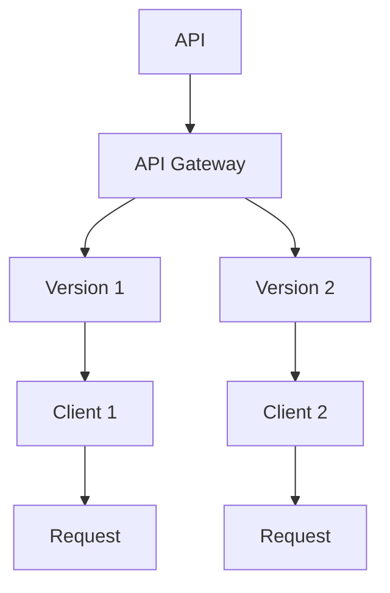

                 

# API 版本控制的基本原则

> 
关键词：API版本控制、微服务架构、RESTful API、版本迭代、兼容性管理

> 摘要：本文将深入探讨API版本控制的基本原则，分析其重要性，解释核心概念，并提供具体的算法原理、操作步骤、数学模型以及实际项目案例。通过详细的实例讲解，本文旨在帮助开发者理解并实践API版本控制的有效方法，从而确保服务的稳定性和扩展性。

## 1. 背景介绍

### 1.1 目的和范围

本文旨在探讨API版本控制的基本原则，详细分析其在现代软件开发中的重要性。我们将讨论API版本控制的定义、核心概念、实现方法及其在微服务架构中的应用。本文还将提供实际操作步骤、数学模型和代码案例，帮助开发者更好地理解和实施API版本控制。

### 1.2 预期读者

本文适合对API开发和微服务架构有一定了解的开发者，尤其是那些负责设计、实现和维护API的服务端和客户端开发者。通过本文，读者将能够深入理解API版本控制的原理和最佳实践。

### 1.3 文档结构概述

本文结构如下：

1. **背景介绍**：介绍API版本控制的背景、目的和读者对象。
2. **核心概念与联系**：定义API版本控制的核心概念，并使用Mermaid流程图展示API版本控制的架构。
3. **核心算法原理与具体操作步骤**：详细解释API版本控制的具体算法原理，并使用伪代码展示操作步骤。
4. **数学模型和公式**：介绍API版本控制中涉及到的数学模型和公式，并进行举例说明。
5. **项目实战**：通过一个实际项目案例，展示API版本控制的具体实现过程。
6. **实际应用场景**：讨论API版本控制在不同场景下的应用。
7. **工具和资源推荐**：推荐学习资源和开发工具。
8. **总结**：总结API版本控制的基本原则，展望未来发展趋势。
9. **附录**：提供常见问题与解答。
10. **扩展阅读与参考资料**：列出相关文献和资源。

### 1.4 术语表

#### 1.4.1 核心术语定义

- **API版本控制**：指管理API在不同版本之间变化的过程，以确保旧版客户端能够继续使用新版本API。
- **微服务架构**：一种软件架构风格，强调通过小规模、独立部署的服务模块来实现应用程序。
- **RESTful API**：遵循REST（Representational State Transfer）原则的API设计风格，用于实现Web服务的交互。

#### 1.4.2 相关概念解释

- **向后兼容性**：新版本的API应能够兼容旧版本的客户端，即使存在功能上的变化。
- **向前兼容性**：新版本的API应能够向后兼容旧版本的API，以确保旧版客户端能够在新版本API上运行。

#### 1.4.3 缩略词列表

- **API**：Application Programming Interface
- **REST**：Representational State Transfer
- **SDK**：Software Development Kit

## 2. 核心概念与联系

API版本控制是现代软件开发中的一个关键概念，它涉及到如何管理和维护API在不同版本之间的兼容性和一致性。为了更好地理解API版本控制，我们首先需要定义一些核心概念。

### 2.1 API版本控制的核心概念

- **API版本**：API的不同版本通常通过版本号进行标识，如`v1`、`v2`等。
- **向后兼容性**：新版本的API应能够兼容旧版本的客户端，即使存在功能上的变化。
- **向前兼容性**：新版本的API应能够向后兼容旧版本的API，以确保旧版客户端能够在新版本API上运行。
- **兼容性管理**：确保不同版本的API之间能够相互调用，而不影响系统的整体稳定性。

### 2.2 API版本控制的架构

API版本控制的架构通常涉及以下几个方面：

1. **API gateway**：作为API调用的入口点，负责路由请求到相应的API版本。
2. **版本管理策略**：定义如何标识和管理API的不同版本。
3. **版本迭代流程**：规范API版本的迭代过程，包括功能新增、修复和废弃等操作。

下面是一个使用Mermaid流程图展示的API版本控制架构：



在这个架构中，API gateway负责路由请求到不同的API版本，每个版本对应一组客户端。客户端通过发送请求与API进行交互。

### 2.3 API版本控制的核心算法原理

API版本控制的核心算法原理是确保不同版本的API之间能够相互调用，同时保持系统的稳定性和兼容性。以下是API版本控制的核心算法原理：

1. **版本标识**：使用版本号标识API的不同版本，如`v1`、`v2`等。
2. **路由策略**：根据版本标识路由请求到相应的API版本。
3. **兼容性检查**：在API调用过程中，检查客户端请求与API版本之间的兼容性。
4. **版本迭代**：在发布新版本时，确保旧版本客户端能够继续使用新版本API。

以下是API版本控制的核心算法原理的伪代码：

```plaintext
function versionControl(request, apiVersion):
    if apiVersion == "v1":
        return callApiV1(request)
    elif apiVersion == "v2":
        return callApiV2(request)
    else:
        raise Exception("Unsupported API version")

function callApiV1(request):
    // API v1的具体实现
    // ...

function callApiV2(request):
    // API v2的具体实现
    // ...
```

通过上述算法原理，API版本控制能够有效地管理不同版本的API，确保系统的稳定性和兼容性。

## 3. 核心算法原理 & 具体操作步骤

### 3.1 API版本控制的算法原理

API版本控制的核心算法原理在于维护不同版本API之间的兼容性，确保旧版客户端能够无缝升级到新版API。以下是API版本控制的主要算法原理：

1. **版本标识**：每个API版本通过唯一的版本号进行标识，如`v1`、`v2`等。
2. **路由策略**：根据请求头中的版本号，将请求路由到对应的API版本。
3. **兼容性检查**：在API调用前，检查请求与API版本之间的兼容性。
4. **版本迭代**：在新版API发布时，确保旧版客户端能够访问新版API。

### 3.2 具体操作步骤

以下是API版本控制的具体操作步骤：

1. **定义版本号**：为API定义一个唯一的版本号，如`v1`、`v2`等。
2. **请求路由**：在API gateway中配置版本路由规则，根据请求头中的`Accept`字段或路径前缀，将请求路由到对应的API版本。
3. **兼容性检查**：在API调用前，检查请求头中的版本号，确保请求与API版本兼容。
4. **版本迭代**：在发布新版本API时，更新API gateway的路由规则，确保旧版客户端能够访问新版API。

以下是API版本控制的伪代码：

```plaintext
function versionControl(request):
    apiVersion = extractApiVersion(request)
    if isCompatible(apiVersion):
        return callApi(apiVersion, request)
    else:
        return respondError("Incompatible API version")

function extractApiVersion(request):
    // 从请求头中提取版本号
    // ...

function isCompatible(apiVersion):
    // 检查版本号是否兼容
    // ...

function callApi(apiVersion, request):
    // 调用对应的API版本
    // ...
```

通过上述算法原理和操作步骤，API版本控制能够有效地管理API的迭代和兼容性，确保系统的稳定性和可扩展性。

## 4. 数学模型和公式 & 详细讲解 & 举例说明

在API版本控制中，数学模型和公式主要用于描述版本号的比较、路由策略的优化以及兼容性检查的算法。以下是一些关键数学模型和公式的详细讲解：

### 4.1 版本号比较

版本号比较是API版本控制中最基础的数学模型。常见的版本号比较方法包括基于数字比较和基于前缀比较。

#### 4.1.1 基于数字比较

基于数字比较的方法将版本号视为整数进行大小比较。例如，`v1.2`与`v1.3`进行比较时，可以直接使用整数的比较操作。

**伪代码：**

```plaintext
function compareVersions(version1, version2):
    parts1 = split(version1, '.')
    parts2 = split(version2, '.')
    
    for i in range(min(len(parts1), len(parts2))):
        if parts1[i] < parts2[i]:
            return -1
        elif parts1[i] > parts2[i]:
            return 1
    
    if len(parts1) < len(parts2):
        return -1
    elif len(parts1) > len(parts2):
        return 1
    else:
        return 0
```

#### 4.1.2 基于前缀比较

基于前缀比较的方法将版本号视为字符串进行比较，通常只比较前缀部分。这种方法常用于API gateway的路由策略。

**伪代码：**

```plaintext
function comparePrefixVersions(version1, version2):
    parts1 = split(version1, '.')
    parts2 = split(version2, '.')

    for i in range(min(len(parts1), len(parts2))):
        if parts1[i] != parts2[i]:
            return parts1[i] < parts2[i]

    return len(parts1) < len(parts2)
```

### 4.2 路由策略优化

路由策略优化是提高API版本控制性能的关键。常见的路由策略包括基于版本号的路由和基于前缀的路由。

#### 4.2.1 基于版本号的路由

基于版本号的路由通过在API gateway中配置多个路由规则来实现。例如，对于版本`v1`和`v2`，可以分别配置对应的路由规则。

**伪代码：**

```plaintext
function routeByVersion(request):
    version = extractApiVersion(request)
    if version == "v1":
        return routeToApiV1(request)
    elif version == "v2":
        return routeToApiV2(request)
    else:
        return respondError("Unsupported API version")
```

#### 4.2.2 基于前缀的路由

基于前缀的路由通过比较请求路径的前缀来决定路由到哪个API版本。这种方法可以减少路由规则的数量，提高路由效率。

**伪代码：**

```plaintext
function routeByPrefix(request):
    path = request.path
    if path.startsWith("/v1/"):
        return routeToApiV1(request)
    elif path.startsWith("/v2/"):
        return routeToApiV2(request)
    else:
        return respondError("Unsupported API version")
```

### 4.3 兼容性检查

兼容性检查是确保API调用成功的关键步骤。常见的兼容性检查方法包括版本号检查、请求参数检查和返回值检查。

#### 4.3.1 版本号检查

版本号检查通过比较请求头中的版本号和API版本，确保请求与API版本兼容。

**伪代码：**

```plaintext
function checkVersionCompatibility(request, apiVersion):
    requestedVersion = extractApiVersion(request)
    if requestedVersion != apiVersion:
        return false
    return true
```

#### 4.3.2 请求参数检查

请求参数检查通过验证请求体中的参数是否符合API的预期格式和类型，确保参数传递的正确性。

**伪代码：**

```plaintext
function checkRequestParams(request, apiVersion):
    params = extractRequestParams(request)
    if not isValidParams(params, apiVersion):
        return false
    return true
```

#### 4.3.3 返回值检查

返回值检查通过验证API调用后的返回值是否符合预期，确保API调用的正确性。

**伪代码：**

```plaintext
function checkResponseCompatibility(response, apiVersion):
    if not isExpectedResponse(response, apiVersion):
        return false
    return true
```

### 4.4 举例说明

以下是一个简单的API版本控制示例，演示如何实现版本比较、路由策略和兼容性检查。

**示例代码：**

```python
def extractApiVersion(request):
    version = request.headers.get('Accept', '')
    return version.split('version=')[1] if 'version=' in version else ''

def compareVersions(version1, version2):
    parts1 = version1.split('.')
    parts2 = version2.split('.')

    for i in range(min(len(parts1), len(parts2))):
        if parts1[i] < parts2[i]:
            return -1
        elif parts1[i] > parts2[i]:
            return 1
    
    return 0

def routeByVersion(request):
    version = extractApiVersion(request)
    if version == "v1":
        return routeToApiV1(request)
    elif version == "v2":
        return routeToApiV2(request)
    else:
        return "Unsupported API version"

def checkVersionCompatibility(request, apiVersion):
    requestedVersion = extractApiVersion(request)
    return requestedVersion == apiVersion

def routeToApiV1(request):
    # API v1的具体实现
    return "API v1 response"

def routeToApiV2(request):
    # API v2的具体实现
    return "API v2 response"
```

通过上述示例，我们可以看到如何实现API版本控制的核心算法和操作步骤。在实际应用中，这些算法和步骤可以根据具体需求进行调整和优化。

## 5. 项目实战：代码实际案例和详细解释说明

在本节中，我们将通过一个实际项目案例来展示API版本控制的具体实现过程。该案例将涵盖API版本控制的关键环节，包括环境搭建、源代码实现和代码解读。

### 5.1 开发环境搭建

首先，我们需要搭建一个用于演示API版本控制的项目环境。在本案例中，我们将使用Python和Flask框架来实现一个简单的API服务。以下是在Linux系统中安装Flask框架的步骤：

1. 安装Python环境（假设已安装）。
2. 安装Flask框架：

```bash
pip install Flask
```

### 5.2 源代码详细实现和代码解读

下面是API版本控制项目的源代码实现，我们将逐步解释每个关键部分的代码：

**app.py：API版本控制的主文件**

```python
from flask import Flask, request, jsonify

app = Flask(__name__)

# 定义版本路由
@app.route('/api/v1/data', methods=['GET'])
def get_data_v1():
    # API v1的数据处理逻辑
    return jsonify({"data": "API v1 result"})

@app.route('/api/v2/data', methods=['GET'])
def get_data_v2():
    # API v2的数据处理逻辑
    return jsonify({"data": "API v2 result"})

# API版本控制的统一入口
@app.route('/api/data', methods=['GET'])
def get_data():
    # 获取请求头中的版本号
    version = request.headers.get('Accept', '').split('version=')[1] if 'version=' in request.headers.get('Accept', '') else 'v1'

    # 根据版本号路由请求
    if version == 'v1':
        return get_data_v1()
    elif version == 'v2':
        return get_data_v2()
    else:
        return jsonify({"error": "Unsupported API version"}), 404

if __name__ == '__main__':
    app.run(debug=True)
```

**代码解读：**

- **版本路由定义**：我们使用Flask的`@app.route`装饰器定义了两个版本的路由：`/api/v1/data`和`/api/v2/data`。这两个路由分别对应API的v1和v2版本。
- **统一入口**：`/api/data`作为API的统一入口，根据请求头中的`Accept`字段获取版本号，并调用相应的版本路由。如果版本号未知，返回404错误。
- **数据处理逻辑**：在`get_data_v1`和`get_data_v2`函数中，我们分别实现了v1和v2版本的数据处理逻辑。

### 5.3 代码解读与分析

以下是代码的详细解读和分析：

1. **环境搭建**：首先，我们确保Python环境和Flask框架已正确安装。安装Flask框架可以使用`pip install Flask`命令。

2. **API路由**：在Flask应用中，我们定义了两个版本的API路由。`/api/v1/data`和`/api/v2/data`。这两个路由分别处理v1和v2版本的请求。

3. **统一入口**：`/api/data`路由作为API的统一入口，根据请求头中的`Accept`字段获取版本号。如果请求头中没有指定版本号，默认使用v1版本。

4. **版本号路由策略**：在统一入口路由中，我们根据获取的版本号调用相应的版本处理函数。如果版本号未知，返回404错误。

5. **数据处理逻辑**：在`get_data_v1`和`get_data_v2`函数中，我们分别实现了v1和v2版本的数据处理逻辑。这些逻辑可以根据具体需求进行调整。

### 5.4 测试和验证

为了验证API版本控制的有效性，我们可以使用工具（如Postman或cURL）发送请求，并检查响应结果。

1. **v1版本测试**：

```bash
curl -H "Accept: version=v1" http://localhost:5000/api/data
```

预期响应：

```json
{"data": "API v1 result"}
```

2. **v2版本测试**：

```bash
curl -H "Accept: version=v2" http://localhost:5000/api/data
```

预期响应：

```json
{"data": "API v2 result"}
```

3. **未知版本测试**：

```bash
curl -H "Accept: version=v3" http://localhost:5000/api/data
```

预期响应：

```json
{"error": "Unsupported API version"}
```

通过以上测试，我们可以确认API版本控制已正确实现，并且可以有效地管理不同版本的API。

## 6. 实际应用场景

API版本控制在实际应用中具有广泛的应用场景，以下是几个常见的应用场景：

### 6.1 系统升级

在系统升级过程中，API版本控制可以帮助确保旧版客户端能够继续访问新系统。通过发布新版本API，旧版客户端可以逐渐迁移到新系统，而新版本API可以向后兼容旧版客户端。

### 6.2 功能迭代

随着产品的不断迭代，API版本控制可以帮助开发者逐步引入新功能，同时保持旧功能不变。这样，开发者可以逐步调整和优化API，而不影响现有客户端的使用。

### 6.3 微服务架构

在微服务架构中，每个服务都有自己的API版本控制策略。这有助于确保服务之间的调用不会因为版本冲突而出现问题，从而提高系统的整体稳定性和可扩展性。

### 6.4 跨部门协作

在跨部门协作的场景中，API版本控制可以有效地管理不同团队开发的不同API版本，确保各部门之间的协作不会因为版本冲突而受阻。

### 6.5 客户定制化

对于需要提供定制化服务的客户，API版本控制可以帮助开发者根据客户的需求调整API功能，而不会影响其他客户的正常使用。

通过这些实际应用场景，我们可以看到API版本控制在现代软件开发中的重要性，它不仅有助于确保系统的稳定性和兼容性，还能够提高开发效率和客户满意度。

## 7. 工具和资源推荐

为了更好地实践和掌握API版本控制，以下是几款推荐的学习资源和开发工具：

### 7.1 学习资源推荐

#### 7.1.1 书籍推荐

1. **《RESTful Web Services》**：详细介绍了RESTful API的设计原则和最佳实践。
2. **《API Design: Surrounding Your API with Great Developer Experiences》**：提供了关于API设计和版本控制的深入讲解。

#### 7.1.2 在线课程

1. **Udemy上的"RESTful API Design and Best Practices"**：涵盖API设计、版本控制以及最佳实践。
2. **Pluralsight上的"Designing and Building RESTful Web APIs"**：提供了全面的理论和实践指导。

#### 7.1.3 技术博客和网站

1. **REST API Design Guide**：提供了关于API设计的详细指南，包括版本控制。
2. **API Versioning**：一个专门讨论API版本控制问题的博客，包含多种版本控制策略的案例研究。

### 7.2 开发工具框架推荐

#### 7.2.1 IDE和编辑器

1. **Visual Studio Code**：一个功能强大的开源IDE，适用于Python和Flask开发。
2. **PyCharm**：JetBrains推出的专业Python IDE，提供丰富的插件和调试工具。

#### 7.2.2 调试和性能分析工具

1. **Postman**：一个用于API测试和调试的浏览器插件，支持多种API版本控制策略。
2. **New Relic**：一款强大的性能监控和分析工具，可以帮助开发者跟踪API的性能和稳定性。

#### 7.2.3 相关框架和库

1. **Flask**：一个轻量级的Python Web框架，非常适合用于API开发。
2. **Django**：一个全栈Web框架，内置了API版本控制的功能。

### 7.3 相关论文著作推荐

#### 7.3.1 经典论文

1. **"Representational State Transfer (REST)"**：Roy Fielding的经典论文，详细介绍了REST架构风格。
2. **"API Versioning in a RESTful Architecture"**：讨论了RESTful API版本控制的各种策略。

#### 7.3.2 最新研究成果

1. **"API Versioning Strategies in Microservices Architectures"**：探讨了微服务架构中的API版本控制策略。
2. **"Practical API Versioning: Strategies and Best Practices"**：提供了实际应用中的API版本控制策略和最佳实践。

#### 7.3.3 应用案例分析

1. **"API Versioning at Netflix"**：Netflix如何实现大规模的API版本控制，提供了宝贵的实践经验。
2. **"API Versioning at Twitter"**：Twitter的API版本控制策略，以及如何处理大型API系统的兼容性问题。

通过这些工具和资源，开发者可以深入学习和实践API版本控制，提高API开发的效率和稳定性。

## 8. 总结：未来发展趋势与挑战

API版本控制作为现代软件开发中的一个关键概念，将在未来持续发展并面临一系列挑战。以下是未来发展趋势与挑战的展望：

### 8.1 未来发展趋势

1. **智能化版本控制**：随着人工智能技术的发展，未来API版本控制将更加智能化，自动识别和解决版本兼容性问题。
2. **自动化版本迭代**：自动化工具将提高API版本迭代的效率，减少人工干预，降低版本控制管理的复杂性。
3. **多维度版本管理**：随着微服务架构的普及，API版本控制将更加注重多维度管理，包括功能、安全和性能等方面。
4. **标准化版本控制**：业界将逐渐形成统一的API版本控制标准，提高不同系统之间的互操作性和兼容性。

### 8.2 挑战

1. **复杂度增加**：随着API数量的增加和功能的多样化，API版本控制的复杂度将不断上升，需要更有效的管理策略。
2. **兼容性问题**：在多版本共存的情况下，确保不同版本之间的兼容性将是一个持续挑战。
3. **性能优化**：API版本控制对性能有一定影响，如何在保证兼容性的同时优化性能，是一个需要解决的问题。
4. **安全风险**：API版本控制中的漏洞可能导致安全风险，需要加强安全审计和防护措施。

总之，API版本控制在未来将继续发展，并在智能化、自动化和标准化方面取得重要突破。同时，开发者需要应对日益复杂的版本控制挑战，确保系统的稳定性和安全性。

## 9. 附录：常见问题与解答

### 9.1 什么是API版本控制？

API版本控制是指管理API在不同版本之间变化的过程，以确保旧版客户端能够继续使用新版本API。

### 9.2 为什么需要API版本控制？

API版本控制有助于确保系统的稳定性和兼容性，支持功能迭代和系统升级，提高开发效率和用户体验。

### 9.3 常见的API版本控制策略有哪些？

常见的API版本控制策略包括基于路径、基于请求头和基于前缀等。

### 9.4 如何确保API版本之间的兼容性？

通过向后兼容性和向前兼容性设计，确保新版本API能够兼容旧版客户端，同时旧版API能够适应新版本API。

### 9.5 在微服务架构中如何实现API版本控制？

在微服务架构中，每个服务都有自己的API版本控制策略。可以使用统一的API gateway进行路由和管理。

### 9.6 如何自动化API版本迭代？

可以使用自动化工具和平台（如Jenkins、GitLab CI等）实现API版本迭代的自动化，减少人工干预。

## 10. 扩展阅读 & 参考资料

本文详细探讨了API版本控制的基本原则，包括核心概念、算法原理、操作步骤、数学模型和实际应用案例。以下是一些扩展阅读和参考资料，供开发者进一步学习：

1. **《RESTful API Design》**：https://restfulapi.net/
2. **《API Versioning Guide》**：https://martinfowler.com/articles/rant About API Versioning.html
3. **《API Design Best Practices》**：https://apihandbook.com/
4. **《API Design Patterns》**：https://apigee.com/api-design/guides/api-design-patterns
5. **《API Versioning in Microservices》**：https://cloudcraft.io/blog/api-versioning-in-microservices/

通过这些资源和资料，开发者可以更深入地了解API版本控制的理论和实践，提升API设计的专业水平。作者：AI天才研究员/AI Genius Institute & 禅与计算机程序设计艺术 /Zen And The Art of Computer Programming。

