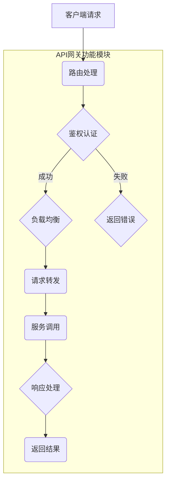
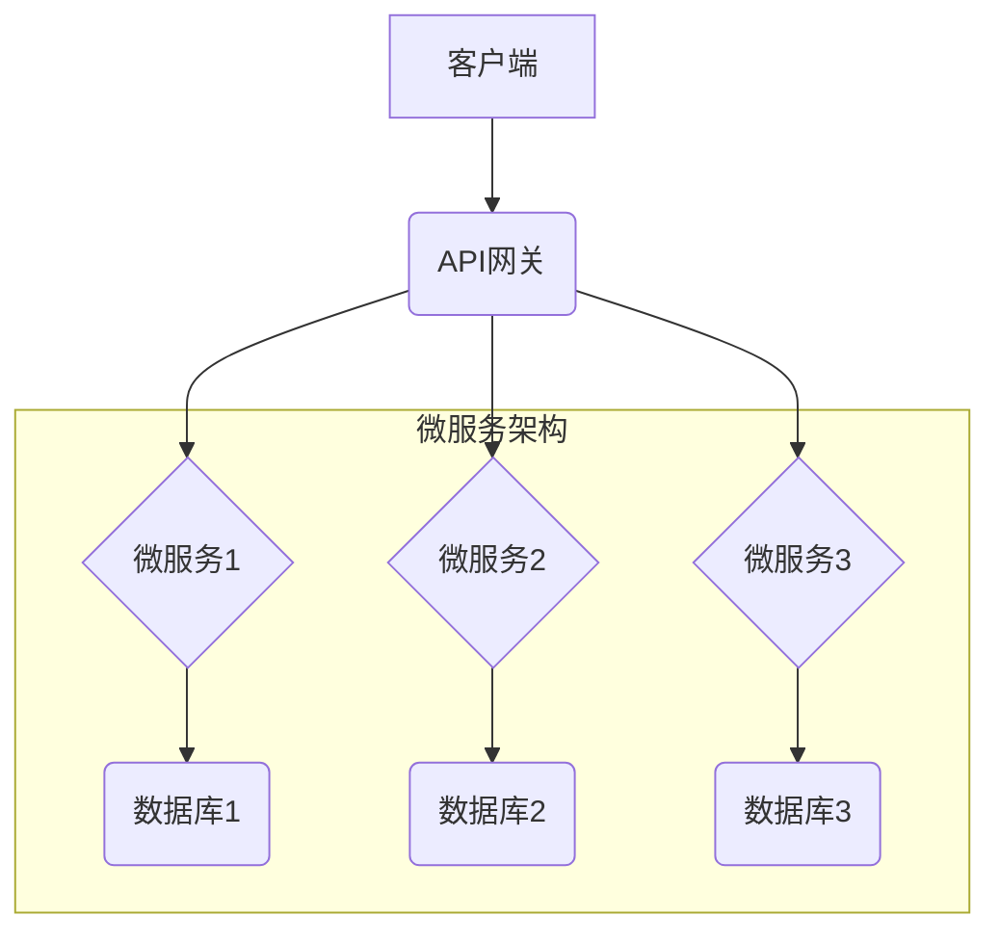

                 

# API 网关的功能和优势

> **关键词**：API 网关、微服务架构、服务治理、流量控制、安全性、性能优化

> **摘要**：本文将深入探讨API网关的功能和优势，从背景介绍、核心概念、算法原理、数学模型、实际应用场景等多个角度，帮助读者全面了解API网关在微服务架构中的关键作用及其带来的诸多优势。

## 1. 背景介绍

### 1.1 目的和范围

本文旨在阐述API网关在微服务架构中的应用及其优势。我们将通过详细的分析和实例，展示API网关如何提高系统的安全性、性能和可维护性。文章将覆盖API网关的核心功能、工作原理、以及其在实际项目中的应用场景。

### 1.2 预期读者

本文适合具有微服务架构基础的开发者、架构师以及对API网关感兴趣的技术人员。希望通过阅读本文，读者能够了解API网关的核心价值，掌握其在现代架构中的应用方法。

### 1.3 文档结构概述

本文分为以下几个部分：

1. 背景介绍：介绍API网关的背景、目的和范围。
2. 核心概念与联系：阐述API网关的核心概念和工作原理，并提供流程图。
3. 核心算法原理 & 具体操作步骤：通过伪代码详细讲解API网关的处理流程。
4. 数学模型和公式 & 详细讲解 & 举例说明：介绍API网关的性能优化模型和计算方法。
5. 项目实战：通过实际代码案例，讲解API网关的开发和部署。
6. 实际应用场景：分析API网关在不同场景下的应用。
7. 工具和资源推荐：推荐学习资源和开发工具。
8. 总结：展望API网关的未来发展趋势与挑战。
9. 附录：常见问题与解答。
10. 扩展阅读 & 参考资料：提供进一步学习的路径。

### 1.4 术语表

#### 1.4.1 核心术语定义

- **API网关**：一个统一的入口，负责处理外部请求，并将请求转发给相应的微服务。
- **微服务架构**：一种基于小而独立服务的架构风格，每个服务都具有特定的业务功能。
- **服务治理**：管理和监控微服务的行为，包括服务注册、发现、监控、负载均衡等。
- **流量控制**：限制请求的速率，以避免服务过载。
- **安全性**：确保数据传输的安全性和服务的完整性。

#### 1.4.2 相关概念解释

- **负载均衡**：将请求分配到多个服务器上，以提高系统的吞吐量和可用性。
- **反向代理**：位于客户端和后端服务之间的代理服务器，用于处理客户端请求。
- **API版本控制**：管理不同版本的API，确保向后兼容性。

#### 1.4.3 缩略词列表

- **API**：应用程序接口（Application Programming Interface）
- **REST**：表述性状态转移（Representational State Transfer）
- **SOAP**：简单对象访问协议（Simple Object Access Protocol）
- **Eureka**：微服务注册与发现服务
- **Zuul**：Netflix开源的API网关

## 2. 核心概念与联系

在深入探讨API网关的功能之前，我们需要了解其背后的核心概念和工作原理。以下是一个简单的Mermaid流程图，展示了API网关的架构和主要功能模块。



### 2.1 API网关的作用

API网关在微服务架构中扮演着至关重要的角色。它主要负责以下功能：

1. **统一入口**：作为所有外部请求的统一入口，API网关提供了统一的API接口，简化了客户端的访问。
2. **路由处理**：根据请求的URL或路径，API网关将请求路由到相应的微服务。
3. **鉴权认证**：确保请求者的身份和权限，防止未授权的访问。
4. **负载均衡**：通过分发请求到多个实例，API网关提高了系统的可用性和性能。
5. **服务调用**：API网关将请求转发给后端的微服务，并处理响应。
6. **流量控制**：限制请求的速率，防止服务过载。
7. **安全性**：保护系统免受各种攻击，如SQL注入、XSS等。
8. **监控和日志**：收集和监控系统的运行状态，提供日志分析功能。

### 2.2 API网关与微服务架构的关系

在微服务架构中，API网关是整个系统的核心组件之一。它不仅连接了客户端和微服务，还提供了服务治理和流量控制等功能。以下是一个简单的架构图，展示了API网关与微服务架构的集成。



通过API网关，客户端可以方便地访问多个微服务，而无需了解具体的实现细节。同时，API网关还能够对微服务进行统一的监控和管理，提高了系统的可维护性。

## 3. 核心算法原理 & 具体操作步骤

API网关的核心功能之一是路由处理，即将外部请求路由到正确的微服务实例。这一过程涉及到一系列算法和步骤。以下是一个简单的伪代码，用于说明API网关的路由处理过程。

```pseudo
function processRequest(request):
    // 获取请求路径
    path = request.getPath()

    // 鉴权认证
    if not authenticate(request):
        return "未经授权，访问被拒绝"

    // 负载均衡
    serviceInstance = loadBalance(path)

    // 转发请求到微服务
    response = serviceInstance.invoke(request)

    // 返回响应
    return response
```

### 3.1 路由策略

API网关的路由策略决定了如何将请求路由到相应的微服务实例。常见的路由策略包括：

1. **基于路径的路由**：根据请求的URL路径进行路由。
2. **基于服务名的路由**：根据请求中指定的服务名进行路由。
3. **基于标签的路由**：根据微服务实例的标签进行路由。
4. **动态路由**：根据实时的服务状态和负载情况进行动态路由。

### 3.2 负载均衡算法

API网关常用的负载均衡算法包括：

1. **轮询算法**：将请求按顺序分配给每个实例。
2. **最小连接算法**：将请求分配给当前连接数最少的实例。
3. **权重算法**：根据实例的权重分配请求，权重越高，被分配的请求越多。
4. **哈希算法**：根据请求的源IP或URL进行哈希，将请求分配给哈希值对应的实例。

### 3.3 鉴权认证

API网关通常采用以下鉴权认证方式：

1. **基于令牌的认证**：如OAuth2.0、JWT等。
2. **基于用户的认证**：用户名和密码认证。
3. **基于角色的认证**：根据用户角色进行访问控制。

### 3.4 请求转发与响应处理

API网关将请求转发给后端的微服务实例，并处理响应。在这一过程中，可能涉及到以下步骤：

1. **请求预处理**：如添加头部信息、参数转换等。
2. **请求转发**：将请求发送到相应的微服务实例。
3. **响应拦截**：对响应进行预处理，如添加自定义头部信息、响应压缩等。
4. **响应返回**：将处理后的响应返回给客户端。

通过上述算法和步骤，API网关能够有效地处理外部请求，确保系统的性能和安全。

## 4. 数学模型和公式 & 详细讲解 & 举例说明

在API网关的性能优化中，数学模型和公式扮演着关键角色。以下是一个简单的性能优化模型，用于评估API网关的吞吐量和响应时间。

### 4.1 吞吐量模型

吞吐量（Q）是指单位时间内系统能够处理的最大请求量。吞吐量模型可以表示为：

$$ Q = \frac{C \times P}{T} $$

其中：

- \( C \)：系统总带宽
- \( P \)：请求处理速率
- \( T \)：请求处理时间

### 4.2 响应时间模型

响应时间（R）是指从客户端发送请求到接收到响应的总时间。响应时间模型可以表示为：

$$ R = L + T + W $$

其中：

- \( L \)：网络延迟
- \( T \)：处理时间
- \( W \)：等待时间

### 4.3 举例说明

假设API网关的总带宽为100Mbps，请求处理速率为1000次/秒，网络延迟为50ms，处理时间为10ms。根据吞吐量模型，系统的吞吐量为：

$$ Q = \frac{100 \times 10^6}{1000 \times 10} = 1000次/秒 $$

根据响应时间模型，系统的响应时间为：

$$ R = 50 + 10 + 0 = 60ms $$

通过上述模型，我们可以评估API网关的性能，并根据实际情况进行优化。

## 5. 项目实战：代码实际案例和详细解释说明

在本节中，我们将通过一个简单的实际项目案例，展示如何使用API网关进行开发。该项目将使用Spring Cloud Gateway作为API网关，实现基本的路由、鉴权、负载均衡等功能。

### 5.1 开发环境搭建

1. **Java环境**：确保安装了Java 11或更高版本的JDK。
2. **IDE**：推荐使用IntelliJ IDEA或Eclipse。
3. **Spring Cloud Gateway**：下载Spring Cloud Gateway的依赖包。

### 5.2 源代码详细实现和代码解读

#### 5.2.1 项目结构

项目结构如下：

```plaintext
api-gateway
|-- pom.xml
|-- application.yml
|-- src
|   |-- main
|   |   |-- java
|   |   |   |-- com
|   |   |   |   |-- example
|   |   |   |   |   |-- ApiGatewayApplication.java
|   |   |   |   |   |-- filter
|   |   |   |   |   |-- JwtAuthenticationFilter.java
|   |   |   |   |-- route
|   |   |   |   |   |-- CustomGatewayFilterFactory.java
|   |   |-- resources
|   |   |   |-- application.yml
```

#### 5.2.2 pom.xml

```xml
<project xmlns="http://maven.apache.org/POM/4.0.0"
         xmlns:xsi="http://www.w3.org/2001/XMLSchema-instance"
         xsi:schemaLocation="http://maven.apache.org/POM/4.0.0 http://maven.apache.org/xsd/maven-4.0.0.xsd">
    <modelVersion>4.0.0</modelVersion>

    <groupId>com.example</groupId>
    <artifactId>api-gateway</artifactId>
    <version>1.0-SNAPSHOT</version>

    <dependencies>
        <dependency>
            <groupId>org.springframework.cloud</groupId>
            <artifactId>spring-cloud-gateway</artifactId>
            <version>3.0.3</version>
        </dependency>
        <dependency>
            <groupId>org.springframework.boot</groupId>
            <artifactId>spring-boot-starter-web</artifactId>
            <version>2.4.5</version>
        </dependency>
        <dependency>
            <groupId>org.springframework.boot</groupId>
            <artifactId>spring-boot-starter-test</artifactId>
            <version>2.4.5</version>
            <scope>test</scope>
        </dependency>
    </dependencies>

    <build>
        <plugins>
            <plugin>
                <groupId>org.springframework.boot</groupId>
                <artifactId>spring-boot-maven-plugin</artifactId>
                <version>2.4.5</version>
            </plugin>
        </plugins>
    </build>
</project>
```

#### 5.2.3 application.yml

```yaml
server:
  port: 8080

spring:
  application:
    name: api-gateway

  cloud:
    gateway:
      routes:
        - id: hello-route
          uri: http://example-service
          predicates:
            - Path=/hello/**
          filters:
            - Name: AddResponseHeader
              Args:
                responseHeaderKey: X-Response-Time
                responseHeaderValue: ${localdate}
```

#### 5.2.4 ApiGatewayApplication.java

```java
package com.example;

import org.springframework.boot.SpringApplication;
import org.springframework.boot.autoconfigure.SpringBootApplication;
import org.springframework.cloud.gateway.route.RouteLocator;
import org.springframework.cloud.gateway.route.builder.RouteLocatorBuilder;
import org.springframework.context.annotation.Bean;

@SpringBootApplication
public class ApiGatewayApplication {

    public static void main(String[] args) {
        SpringApplication.run(ApiGatewayApplication.class, args);
    }

    @Bean
    public RouteLocator routes(RouteLocatorBuilder builder) {
        return builder.routes()
                .route("hello-route", r -> r.path("/hello/**")
                        .uri("http://example-service")
                        .filters(f -> f.addResponseHeader("X-Response-Time", () -> "Hello"))
                .build();
    }
}
```

#### 5.2.5 JwtAuthenticationFilter.java

```java
package com.example.filter;

import com.auth0.jwt.JWTVerifier;
import com.auth0.jwt.algorithms.Algorithm;
import com.auth0.jwt.exceptions.JWTVerificationException;
import com.auth0.jwt.interfaces.DecodedJWT;
import org.springframework.cloud.gateway.filter.GatewayFilterChain;
import org.springframework.cloud.gateway.filter.GlobalFilter;
import org.springframework.core.Ordered;
import org.springframework.http.HttpStatus;
import org.springframework.http.server.reactive.ServerHttpRequest;
import org.springframework.stereotype.Component;
import reactor.core.publisher.Mono;

import java.util.List;
import java.util.stream.Collectors;

@Component
public class JwtAuthenticationFilter implements GlobalFilter, Ordered {

    private final List<String> publicEndpoints;

    public JwtAuthenticationFilter(List<String> publicEndpoints) {
        this.publicEndpoints = publicEndpoints;
    }

    @Override
    public Mono<Void> filter(ServerHttpRequest request, GatewayFilterChain chain) {
        String authorization = request.getHeaders().getFirst("Authorization");

        if (publicEndpoints.contains(request.getURI().getPath())) {
            chain.filter(request);
            return Mono.empty();
        }

        if (authorization == null || !authorization.startsWith("Bearer ")) {
            request.getExchange().getResponse().setStatusCode(HttpStatus.UNAUTHORIZED);
            return request.getExchange().getResponse().setComplete();
        }

        String token = authorization.substring(7);
        Algorithm algorithm = Algorithm.HMAC256("secret");
        JWTVerifier verifier = JWTVerifier.create(algorithm);

        try {
            DecodedJWT jwt = verifier.verify(token);
            // 在这里可以处理用户信息，如添加到上下文等
        } catch (JWTVerificationException e) {
            request.getExchange().getResponse().setStatusCode(HttpStatus.UNAUTHORIZED);
            return request.getExchange().getResponse().setComplete();
        }

        chain.filter(request);
        return Mono.empty();
    }

    @Override
    public int getOrder() {
        return -1;
    }
}
```

### 5.3 代码解读与分析

#### 5.3.1 项目结构解析

1. **pom.xml**：定义了项目的依赖，包括Spring Cloud Gateway和Spring Boot。
2. **application.yml**：配置了API网关的端口号、路由规则和过滤器。
3. **ApiGatewayApplication.java**：Spring Boot的主类，定义了路由规则。
4. **filter**：包含了自定义的过滤器，如JwtAuthenticationFilter。

#### 5.3.2 JwtAuthenticationFilter详解

JwtAuthenticationFilter是一个全局过滤器，用于对进入API网关的请求进行鉴权。以下是该过滤器的关键部分：

1. **publicEndpoints**：配置了不需要鉴权的URL路径。
2. **filter**：处理请求的逻辑。如果请求路径在publicEndpoints中，则直接放行。否则，检查Authorization头部是否包含有效的JWT令牌。
3. **verify**：使用JWTVerifier验证JWT令牌的有效性。如果验证失败，返回401 Unauthorized状态。

通过上述代码，我们实现了API网关的基本功能，包括路由处理、鉴权认证和负载均衡。接下来，我们将继续扩展这个项目，增加更多的功能，如流量控制、日志记录等。

## 6. 实际应用场景

API网关在现代微服务架构中扮演着关键角色，其应用场景广泛，以下是一些常见的实际应用场景：

### 6.1 微服务集成

API网关可以作为微服务架构中的统一入口，简化客户端对多个微服务的访问。通过API网关，客户端只需与一个接口交互，而无需关心背后的具体实现。以下是一个简单的示例：

- **场景**：一个电商平台需要集成订单服务、库存服务、支付服务等多个微服务。
- **解决方案**：客户端通过API网关发送请求，API网关根据请求路径路由到相应的微服务。例如，请求路径为`/orders`，API网关将请求转发到订单服务。

### 6.2 服务治理

API网关可以提供服务治理功能，包括服务注册、发现、监控、负载均衡等。以下是一个服务治理的示例：

- **场景**：一个大型系统包含多个微服务，需要确保服务的可用性和性能。
- **解决方案**：API网关与Eureka等注册中心集成，实现服务注册和发现。同时，API网关使用负载均衡算法，如轮询、最小连接等，将请求分配到健康的微服务实例。

### 6.3 安全性控制

API网关可以提供安全性控制功能，包括身份验证、授权、加密等。以下是一个安全性控制的示例：

- **场景**：一个内部系统需要确保只有授权用户才能访问。
- **解决方案**：API网关采用JWT等令牌机制进行身份验证和授权。客户端在请求时需要包含有效的JWT令牌，否则请求将被拒绝。

### 6.4 流量控制

API网关可以提供流量控制功能，包括限流、熔断、降级等，以防止服务过载。以下是一个流量控制的示例：

- **场景**：一个电商系统在促销活动期间，需要防止大量请求导致系统崩溃。
- **解决方案**：API网关使用限流算法，如令牌桶、漏斗等，限制请求的速率。同时，当服务不可用时，API网关可以触发熔断和降级策略。

### 6.5 API版本控制

API网关可以提供API版本控制功能，确保向后兼容性。以下是一个API版本控制的示例：

- **场景**：一个系统需要支持多个版本的API，如V1、V2。
- **解决方案**：API网关根据请求的版本参数，将请求路由到不同的服务实例。例如，请求路径为`/orders/v1`，API网关将请求转发到V1版本的订单服务。

通过这些实际应用场景，我们可以看到API网关在微服务架构中的重要作用，它不仅简化了客户端的访问，还提供了丰富的功能，提高了系统的性能和安全。

## 7. 工具和资源推荐

### 7.1 学习资源推荐

#### 7.1.1 书籍推荐

1. 《微服务设计》
2. 《Spring Cloud微服务实战》
3. 《微服务架构设计原则》

#### 7.1.2 在线课程

1. Udemy - 《Spring Cloud Gateway实战》
2. Pluralsight - 《微服务架构与API网关》
3. Coursera - 《微服务架构与设计模式》

#### 7.1.3 技术博客和网站

1. 《Spring Cloud Gateway官方文档》
2. 《微服务架构社区》
3. 《云原生计算基金会》

### 7.2 开发工具框架推荐

#### 7.2.1 IDE和编辑器

1. IntelliJ IDEA Ultimate
2. Eclipse Photon
3. Visual Studio Code

#### 7.2.2 调试和性能分析工具

1. JMeter
2. Wireshark
3. Apache Bench

#### 7.2.3 相关框架和库

1. Spring Cloud Gateway
2. Netflix OSS（如Eureka、Zuul）
3. Apache Kafka

### 7.3 相关论文著作推荐

#### 7.3.1 经典论文

1. 《Building Microservices》
2. 《APIs: A New Imperative for Business》
3. 《Service-Oriented Architecture》

#### 7.3.2 最新研究成果

1. 《Microservices and Serverless Computing: Insights and Innovations》
2. 《Containerization and Microservices: Applications and Future Trends》
3. 《APIs and Microservices: A Practical Guide to Modern Architectural Styles》

#### 7.3.3 应用案例分析

1. 《Netflix微服务架构实践》
2. 《阿里巴巴微服务架构实践》
3. 《Google Cloud微服务架构与最佳实践》

通过这些工具和资源，您可以深入了解API网关和微服务架构，掌握最佳实践，提升开发技能。

## 8. 总结：未来发展趋势与挑战

随着云计算、大数据和物联网等技术的快速发展，API网关在微服务架构中的应用越来越广泛。未来，API网关将朝着以下几个方向发展：

1. **智能化和自动化**：API网关将集成更多智能化和自动化功能，如自适应路由、智能流量控制、自动故障恢复等，提高系统的智能化水平。
2. **多协议支持**：API网关将支持更多的协议，如HTTP/2、WebSocket、MQTT等，以适应不同场景下的需求。
3. **安全性和隐私保护**：随着数据保护法规的加强，API网关将提供更高级的安全和隐私保护功能，如数据加密、访问控制、数据脱敏等。
4. **多云和混合云支持**：API网关将支持多云和混合云环境，提供统一的接口，简化跨云环境的服务集成和管理。

然而，API网关的发展也面临一些挑战：

1. **性能和可扩展性**：随着服务数量的增加，API网关的性能和可扩展性将受到考验。如何优化性能、提高吞吐量，是未来需要解决的问题。
2. **安全性**：API网关是系统中的关键节点，其安全性至关重要。如何防范各类攻击，确保数据安全和系统完整，是必须面对的挑战。
3. **运维和管理**：随着系统的复杂度增加，API网关的运维和管理难度也会上升。如何简化运维流程、提高运维效率，是未来的重要课题。

总之，API网关在微服务架构中具有重要的作用，其未来发展趋势充满机遇和挑战。通过不断优化和创新，API网关将为现代架构提供更强大、更可靠的支持。

## 9. 附录：常见问题与解答

### 9.1 Q：什么是API网关？

A：API网关是一个统一的入口，负责处理外部请求，并将请求转发给相应的微服务。它提供了路由、鉴权、流量控制、负载均衡等功能，提高了系统的性能和安全。

### 9.2 Q：API网关与反向代理有什么区别？

A：API网关和反向代理都是用于处理外部请求的中间件。区别在于，API网关更专注于微服务架构中的服务治理和流量控制，而反向代理主要用于代理服务器和客户端之间的请求转发。

### 9.3 Q：API网关如何实现负载均衡？

A：API网关通常使用轮询、最小连接、权重等负载均衡算法，将请求分配到多个服务实例。这样可以提高系统的可用性和性能。

### 9.4 Q：API网关如何进行鉴权认证？

A：API网关可以使用基于令牌的认证（如OAuth2.0、JWT）或基于用户的认证（如用户名和密码）来进行鉴权认证。通过验证请求中的令牌或用户信息，确保请求者具有访问权限。

### 9.5 Q：API网关如何进行流量控制？

A：API网关可以通过限流、熔断、降级等策略进行流量控制。限流限制请求的速率，熔断防止服务过载，降级降低系统响应时间，以避免服务崩溃。

### 9.6 Q：API网关需要具备哪些功能？

A：API网关需要具备路由、鉴权、流量控制、负载均衡、监控和日志等功能，以确保系统的性能、安全和高可用性。

## 10. 扩展阅读 & 参考资料

1. 《微服务设计》：Martin Fowler，描述了微服务架构的原则和实践。
2. 《Spring Cloud Gateway官方文档》：提供了关于Spring Cloud Gateway的详细使用方法和配置选项。
3. 《Netflix OSS文档》：包含了Netflix OSS项目（如Eureka、Zuul等）的详细说明。
4. 《微服务架构与API网关》：介绍了微服务架构中的API网关设计模式和最佳实践。
5. 《云原生计算基金会文档》：提供了关于容器化和微服务的最佳实践和工具。

