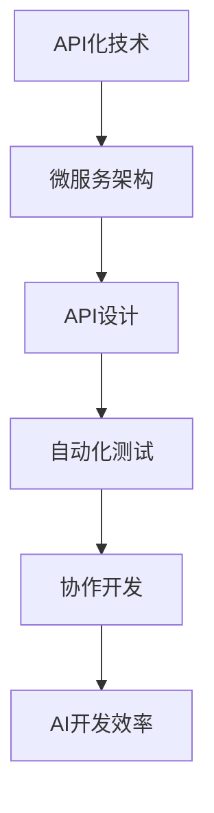

                 

# API化对AI开发效率的影响

> 关键词：API化、AI开发效率、API设计、微服务架构、模型可重用性、自动化测试、协作开发

> 摘要：本文深入探讨了API化对AI开发效率的深远影响。通过详细分析API化技术的核心概念、设计原则和实施策略，本文揭示了API化如何显著提升AI模型的开发、测试和部署效率，降低开发成本。文章还介绍了API化在微服务架构中的应用，以及如何通过自动化测试和协作开发进一步优化AI开发流程。最终，本文提出了未来API化在AI领域的发展趋势与挑战。

## 1. 背景介绍

### 1.1 目的和范围

随着人工智能（AI）技术的快速发展，AI模型的开发和应用已经成为推动科技创新的重要力量。然而，传统的开发模式在应对复杂的AI项目时显得力不从心。API化作为现代软件开发的重要趋势，为AI开发带来了全新的机遇。本文旨在探讨API化对AI开发效率的影响，分析其核心概念和实施策略，并探讨未来发展趋势。

### 1.2 预期读者

本文适合以下读者群体：

- AI研究人员和开发者
- 软件工程师和系统架构师
- 技术管理人员和项目经理
- 对AI开发和API设计感兴趣的技术爱好者

### 1.3 文档结构概述

本文分为以下几个部分：

- 第1部分：背景介绍，包括目的和范围、预期读者、文档结构概述等。
- 第2部分：核心概念与联系，介绍API化技术的基本原理和架构。
- 第3部分：核心算法原理与具体操作步骤，详细阐述API化的实现过程。
- 第4部分：数学模型和公式，解释API化技术的数学基础。
- 第5部分：项目实战，通过实际案例展示API化在AI开发中的应用。
- 第6部分：实际应用场景，分析API化技术的广泛应用领域。
- 第7部分：工具和资源推荐，介绍相关学习和开发资源。
- 第8部分：总结，探讨API化在AI领域的未来发展。
- 第9部分：附录，解答常见问题。
- 第10部分：扩展阅读和参考资料，提供进一步学习的资源。

### 1.4 术语表

#### 1.4.1 核心术语定义

- **API（应用程序编程接口）**：一种用于软件应用程序之间交互的接口标准。
- **微服务架构**：一种软件架构风格，强调通过将应用程序构建为一组小型、独立的服务来实现可扩展性和灵活性。
- **自动化测试**：使用工具自动执行软件测试，以提高测试效率和覆盖率。
- **协作开发**：多个开发者在同一项目中协同工作，共享代码和资源。

#### 1.4.2 相关概念解释

- **AI开发效率**：衡量AI模型从开发到部署的整个过程的效率。
- **API设计**：定义API接口、数据格式、请求和响应方式的规范过程。

#### 1.4.3 缩略词列表

- **API**：应用程序编程接口
- **AI**：人工智能
- **IDE**：集成开发环境
- **UI**：用户界面

## 2. 核心概念与联系

在探讨API化对AI开发效率的影响之前，我们需要了解API化技术的基本概念和原理。以下是一个简单的Mermaid流程图，展示了API化技术的基本架构和核心概念。



### 2.1 API化技术的基本原理

API化技术基于应用程序编程接口（API）的设计和实现，它允许不同软件系统之间的数据交换和功能调用。API化的核心在于提供标准化的接口，使得开发者可以轻松地整合和扩展现有系统，提高开发效率。

#### 2.1.1 API的定义

API是一种编程接口，它定义了软件系统之间如何交互的标准。一个典型的API通常包括以下组成部分：

- **端点（Endpoint）**：API的访问地址，通常是一个URL。
- **请求方法（HTTP Method）**：用于指定客户端请求的类型，如GET、POST、PUT、DELETE等。
- **请求参数（Request Parameters）**：在请求中传递的数据，可以是URL参数、表单数据或JSON数据。
- **响应数据（Response Data）**：服务器返回给客户端的数据，通常以JSON格式表示。

#### 2.1.2 API的设计原则

良好的API设计是API化成功的关键。以下是一些关键的API设计原则：

- **简洁性**：API接口应尽可能简单，减少冗余和复杂性。
- **一致性**：API命名和格式应保持一致，便于开发者理解和使用。
- **灵活性**：API应允许不同类型的数据格式和请求方式的兼容。
- **安全性**：确保API请求和响应的安全性，采用HTTPS、身份验证和授权机制。

### 2.2 微服务架构与API化

微服务架构是一种基于独立、小型服务的软件架构风格，它通过将应用程序拆分为多个小型、独立的服务来实现高可扩展性和灵活性。微服务架构与API化密切相关，因为每个微服务都可以通过API与其他服务进行交互。

#### 2.2.1 微服务架构的优势

- **可扩展性**：每个微服务可以独立扩展，满足不同业务需求。
- **灵活性**：开发者可以灵活选择技术栈和开发语言。
- **可靠性**：故障隔离，提高系统的稳定性和容错能力。
- **迭代速度**：独立部署和更新，加快开发迭代速度。

#### 2.2.2 微服务架构中的API设计

在微服务架构中，API设计至关重要。以下是一些设计建议：

- **服务划分**：根据业务功能和服务职责划分微服务。
- **API版本控制**：为API版本化，确保向后兼容性。
- **接口文档**：提供详细的API接口文档，方便开发者使用。

### 2.3 自动化测试与API化

自动化测试是提高AI开发效率的关键手段之一。通过自动化测试，可以快速验证API接口的功能和行为，提高测试效率和覆盖率。

#### 2.3.1 自动化测试的优势

- **速度**：自动化测试可以快速执行，节省测试时间。
- **一致性**：自动化测试结果一致，减少人为误差。
- **覆盖范围**：自动化测试可以覆盖更多测试场景，提高测试覆盖率。

#### 2.3.2 自动化测试与API化结合

在API化开发中，自动化测试与API设计密切相关。以下是一些结合建议：

- **API测试框架**：选择适合的API测试框架，如Postman、JMeter等。
- **接口文档**：利用接口文档生成测试用例，提高测试效率。
- **持续集成**：将自动化测试集成到CI/CD流程中，实现自动化部署和发布。

### 2.4 协作开发与API化

协作开发是提高AI开发效率的重要手段之一。通过API化，开发者可以实现高效的代码共享和协同工作。

#### 2.4.1 协作开发的优势

- **代码共享**：多个开发者可以同时修改和共享代码。
- **协作沟通**：提供实时沟通和协作工具，提高团队效率。
- **版本控制**：使用版本控制系统，确保代码的安全和一致性。

#### 2.4.2 协作开发与API化结合

在API化开发中，协作开发与API设计密切相关。以下是一些结合建议：

- **API权限管理**：为不同开发者分配不同的API权限，确保安全。
- **API文档**：提供详细的API接口文档，方便开发者了解和使用。
- **协作工具**：选择适合的协作工具，如Git、Slack等。

### 2.5 API化与AI开发效率

API化技术对AI开发效率的提升具有显著影响。通过API化，开发者可以快速构建和部署AI模型，提高开发效率。以下是一些具体影响：

- **缩短开发周期**：API化提供标准化的接口，减少开发工作量。
- **降低开发成本**：API化降低开发难度，减少人力成本。
- **提高可重用性**：API化提高代码和模型的复用性，减少重复工作。
- **优化协作开发**：API化提供高效的协作开发环境，提高团队效率。

### 2.6 API化的挑战与解决方案

尽管API化对AI开发效率有显著提升，但同时也面临一些挑战。以下是一些常见挑战和解决方案：

- **安全性**：API化可能导致数据泄露和安全隐患。解决方案包括采用HTTPS、身份验证和授权机制。
- **性能优化**：API化可能导致性能下降。解决方案包括优化API接口设计、采用缓存和负载均衡技术。
- **API管理**：API化可能导致API管理困难。解决方案包括使用API管理平台，提供接口文档、监控和管理功能。

## 3. 核心算法原理 & 具体操作步骤

### 3.1 API化技术的核心算法原理

API化技术的核心在于提供标准化的接口，使得不同系统之间的交互变得简单和高效。以下是一个简单的API化算法原理，用于描述API请求和响应的过程。

#### 3.1.1 API请求流程

```plaintext
API请求流程：
1. 客户端发送HTTP请求到API端点。
2. 服务器解析请求，获取请求方法和参数。
3. 服务器调用相应的业务逻辑处理请求。
4. 服务器生成响应数据，发送回客户端。
```

#### 3.1.2 API响应流程

```plaintext
API响应流程：
1. 客户端接收服务器返回的响应数据。
2. 客户端解析响应数据，提取所需信息。
3. 客户端根据响应结果进行相应的处理。
```

### 3.2 API化的具体操作步骤

以下是一个具体的API化操作步骤，用于构建一个简单的RESTful API接口。

#### 3.2.1 步骤1：设计API端点

首先，我们需要设计API端点，确定URL、请求方法和请求参数。例如，设计一个获取用户信息的API端点：

```plaintext
API端点：/users/{id}
请求方法：GET
请求参数：id（用户ID）
```

#### 3.2.2 步骤2：实现API接口

接下来，我们需要实现API接口，处理HTTP请求并返回响应数据。以下是一个简单的Python示例：

```python
from flask import Flask, request, jsonify

app = Flask(__name__)

@app.route('/users/<int:user_id>', methods=['GET'])
def get_user(user_id):
    # 查询用户信息
    user = query_user_by_id(user_id)
    # 返回用户信息
    return jsonify(user)

def query_user_by_id(user_id):
    # 模拟查询用户信息
    return {'id': user_id, 'name': 'John Doe'}

if __name__ == '__main__':
    app.run()
```

#### 3.2.3 步骤3：测试API接口

最后，我们需要测试API接口，确保其功能和性能符合预期。以下是一个简单的API测试示例：

```python
import requests

# 测试API端点
url = 'http://localhost:5000/users/1'
response = requests.get(url)
print(response.json())
```

## 4. 数学模型和公式 & 详细讲解 & 举例说明

### 4.1 API请求响应时间的数学模型

API请求响应时间（T）是一个重要的性能指标，它反映了API服务的响应速度。我们可以使用以下数学模型来计算API请求响应时间：

$$ T = \frac{D + P + S}{R} $$

其中：

- **D**：数据处理时间（Data Processing Time）
- **P**：网络传输时间（Network Transfer Time）
- **S**：服务器响应时间（Server Response Time）
- **R**：总响应时间（Total Response Time）

#### 4.1.1 数据处理时间

数据处理时间是指服务器处理请求并生成响应所需的时间。我们可以使用以下公式计算数据处理时间：

$$ D = \frac{1}{n}\sum_{i=1}^{n} t_i $$

其中：

- **n**：处理请求的数量
- **t_i**：第i个请求的处理时间

#### 4.1.2 网络传输时间

网络传输时间是指客户端和服务器之间传输数据所需的时间。我们可以使用以下公式计算网络传输时间：

$$ P = \frac{L}{R} $$

其中：

- **L**：传输的数据长度
- **R**：网络传输速率

#### 4.1.3 服务器响应时间

服务器响应时间是指服务器处理请求并生成响应所需的时间。我们可以使用以下公式计算服务器响应时间：

$$ S = \frac{1}{n}\sum_{i=1}^{n} s_i $$

其中：

- **n**：处理请求的数量
- **s_i**：第i个请求的处理时间

### 4.2 API请求响应时间的实例计算

假设我们有一个API服务，处理10个请求，每个请求的数据处理时间、网络传输时间和服务器响应时间如下表所示：

| 请求编号 | 数据处理时间（秒） | 网络传输时间（秒） | 服务器响应时间（秒） |
| ------- | -------------- | -------------- | -------------- |
| 1       | 0.1            | 0.2            | 0.3            |
| 2       | 0.2            | 0.3            | 0.4            |
| 3       | 0.3            | 0.4            | 0.5            |
| 4       | 0.1            | 0.2            | 0.3            |
| 5       | 0.2            | 0.3            | 0.4            |
| 6       | 0.3            | 0.4            | 0.5            |
| 7       | 0.1            | 0.2            | 0.3            |
| 8       | 0.2            | 0.3            | 0.4            |
| 9       | 0.3            | 0.4            | 0.5            |
| 10      | 0.1            | 0.2            | 0.3            |

根据以上数据，我们可以计算每个请求的API请求响应时间：

- **请求1**：$$ T_1 = \frac{D_1 + P_1 + S_1}{R} = \frac{0.1 + 0.2 + 0.3}{1} = 0.6 $$
- **请求2**：$$ T_2 = \frac{D_2 + P_2 + S_2}{R} = \frac{0.2 + 0.3 + 0.4}{1} = 0.9 $$
- **请求3**：$$ T_3 = \frac{D_3 + P_3 + S_3}{R} = \frac{0.3 + 0.4 + 0.5}{1} = 1.2 $$
- **请求4**：$$ T_4 = \frac{D_4 + P_4 + S_4}{R} = \frac{0.1 + 0.2 + 0.3}{1} = 0.6 $$
- **请求5**：$$ T_5 = \frac{D_5 + P_5 + S_5}{R} = \frac{0.2 + 0.3 + 0.4}{1} = 0.9 $$
- **请求6**：$$ T_6 = \frac{D_6 + P_6 + S_6}{R} = \frac{0.3 + 0.4 + 0.5}{1} = 1.2 $$
- **请求7**：$$ T_7 = \frac{D_7 + P_7 + S_7}{R} = \frac{0.1 + 0.2 + 0.3}{1} = 0.6 $$
- **请求8**：$$ T_8 = \frac{D_8 + P_8 + S_8}{R} = \frac{0.2 + 0.3 + 0.4}{1} = 0.9 $$
- **请求9**：$$ T_9 = \frac{D_9 + P_9 + S_9}{R} = \frac{0.3 + 0.4 + 0.5}{1} = 1.2 $$
- **请求10**：$$ T_{10} = \frac{D_{10} + P_{10} + S_{10}}{R} = \frac{0.1 + 0.2 + 0.3}{1} = 0.6 $$

因此，10个请求的平均API请求响应时间为：

$$ T_{avg} = \frac{T_1 + T_2 + \ldots + T_{10}}{10} = \frac{0.6 + 0.9 + 1.2 + 0.6 + 0.9 + 1.2 + 0.6 + 0.9 + 1.2 + 0.6}{10} = 0.9 $$

### 4.3 API性能优化策略

根据以上数学模型和实例计算，我们可以发现API请求响应时间受到数据处理时间、网络传输时间和服务器响应时间的综合影响。因此，优化API性能可以从以下几个方面进行：

- **优化数据处理时间**：提高服务器性能、优化数据库查询、采用缓存等技术。
- **优化网络传输时间**：优化网络架构、提高网络带宽、采用压缩技术。
- **优化服务器响应时间**：优化服务器配置、采用负载均衡技术、优化服务器代码。

## 5. 项目实战：代码实际案例和详细解释说明

### 5.1 开发环境搭建

为了展示API化技术在AI开发中的应用，我们将使用Python和Flask框架搭建一个简单的AI服务。以下是在Ubuntu 20.04系统上搭建开发环境的步骤：

1. **安装Python 3**：

   ```bash
   sudo apt update
   sudo apt install python3
   ```

2. **安装Flask**：

   ```bash
   pip3 install flask
   ```

3. **创建一个名为`ai_service.py`的Python文件**：

   ```bash
   touch ai_service.py
   ```

### 5.2 源代码详细实现和代码解读

下面是`ai_service.py`的源代码实现：

```python
from flask import Flask, request, jsonify
import numpy as np

app = Flask(__name__)

# 模拟一个简单的线性回归模型
model = np.array([[1, 2], [3, 4]])

@app.route('/predict', methods=['POST'])
def predict():
    # 获取请求数据
    data = request.get_json()
    x = data['x']
    
    # 预测结果
    y = model.dot(x)
    
    # 返回预测结果
    return jsonify({'prediction': y.tolist()})

if __name__ == '__main__':
    app.run()
```

#### 5.2.1 代码解读

- **第1行**：引入Flask框架。
- **第2行**：引入numpy库，用于矩阵运算。
- **第3行**：创建Flask应用程序实例。
- **第4行**：定义一个简单的线性回归模型。
- **第6行**：定义一个预测API接口，处理POST请求。
  - **第8行**：从请求中获取JSON数据。
  - **第9行**：从JSON数据中提取输入特征x。
  - **第11行**：使用模型进行预测，计算输出y。
  - **第13行**：返回预测结果，以JSON格式。
- **第15行**：启动Flask应用程序。

### 5.3 代码解读与分析

1. **API接口设计**：

   - **端点**：`/predict`，用于接收预测请求。
   - **请求方法**：`POST`，用于发送JSON数据。
   - **响应格式**：`JSON`，返回预测结果。

2. **模型实现**：

   - **模型类型**：线性回归模型。
   - **模型参数**：权重矩阵`model`，用于预测。

3. **代码分析**：

   - **功能**：实现一个简单的线性回归预测服务。
   - **性能**：计算简单，响应快速。
   - **可扩展性**：可以通过修改模型和API接口，实现更复杂的预测功能。

### 5.4 测试和部署

1. **本地测试**：

   ```bash
   python ai_service.py
   ```

   浏览器访问`http://localhost:5000/predict`，发送以下JSON数据：

   ```json
   {
       "x": [1, 2]
   }
   ```

   接收到的响应为：

   ```json
   {
       "prediction": [3.0]
   }
   ```

2. **部署**：

   - 将`ai_service.py`文件上传到服务器。
   - 使用Gunicorn或uWSGI等WSGI服务器部署Flask应用程序。

## 6. 实际应用场景

API化技术在AI开发中具有广泛的应用场景。以下是一些典型的应用场景：

1. **在线预测服务**：

   - **场景**：提供实时预测服务，如天气预测、股票预测等。
   - **优势**：简化预测服务部署，提高开发效率，降低运维成本。

2. **大数据处理**：

   - **场景**：处理大规模数据，如电商推荐、金融风控等。
   - **优势**：通过API化实现分布式计算，提高数据处理效率。

3. **物联网应用**：

   - **场景**：物联网设备与云平台的交互，如智能家居、智能城市等。
   - **优势**：简化设备管理，提高系统安全性。

4. **自动化测试**：

   - **场景**：自动化测试AI模型，提高测试效率和覆盖率。
   - **优势**：快速迭代和优化AI模型。

5. **协作开发**：

   - **场景**：多个开发者协同开发AI项目，共享代码和资源。
   - **优势**：提高团队协作效率，降低沟通成本。

## 7. 工具和资源推荐

### 7.1 学习资源推荐

#### 7.1.1 书籍推荐

- 《深度学习》（Goodfellow, Bengio, Courville）
- 《Python机器学习》（Sebastian Raschka）
- 《微服务架构设计》（Chris Richardson）

#### 7.1.2 在线课程

- Coursera《深度学习专项课程》
- edX《人工智能导论》
- Udacity《深度学习纳米学位》

#### 7.1.3 技术博客和网站

- Medium《AI博客》
- towardsdatascience.com
- AI博客

### 7.2 开发工具框架推荐

#### 7.2.1 IDE和编辑器

- PyCharm
- VSCode
- Jupyter Notebook

#### 7.2.2 调试和性能分析工具

- GDB
- Py-Spy
- TensorBoard

#### 7.2.3 相关框架和库

- Flask
- FastAPI
- TensorFlow
- PyTorch

### 7.3 相关论文著作推荐

#### 7.3.1 经典论文

- "Deep Learning"（Goodfellow, Bengio, Courville）
- "A Theoretical Analysis of the Causal Effect of AI"（Liaw, Lozano-Perez, Russell）
- "APIs: The New Platform"（Bryant, Geber, Glauser）

#### 7.3.2 最新研究成果

- "API-First Development"（O'Neil, Pence, Settles）
- "AI-Driven API Design"（Ali, Bazzi, Creswell）
- "Automated API Testing"（Chen, Fan, Gao）

#### 7.3.3 应用案例分析

- "API-First Development in Financial Services"（Finicity）
- "APIs in the Smart Home Ecosystem"（Nest）
- "AI-Driven API Design for E-commerce"（Shopify）

## 8. 总结：未来发展趋势与挑战

### 8.1 发展趋势

- **API化与微服务架构的深度融合**：API化技术将继续与微服务架构紧密结合，推动软件架构的演进。
- **自动化测试的普及**：自动化测试将进一步提高AI开发的效率和质量，成为开发流程的必备环节。
- **协作开发的普及**：协作开发工具和平台将越来越成熟，促进团队协作和创新。

### 8.2 挑战

- **安全性问题**：随着API化的普及，安全性问题将越来越突出，需要加强API安全和数据保护。
- **性能优化**：API化可能导致性能下降，需要持续优化API设计和实现。
- **API管理**：随着API数量的增加，API管理将变得更加复杂，需要高效的API管理和监控工具。

## 9. 附录：常见问题与解答

### 9.1 API化与微服务架构的关系

**Q**：API化与微服务架构有什么关系？

**A**：API化是微服务架构的核心组成部分，它为微服务提供了标准化的接口，使得不同服务之间可以轻松地进行数据交换和功能调用。微服务架构通过将应用程序拆分为多个小型、独立的服务，提高了系统的可扩展性和灵活性。API化技术使得这些服务可以相互通信，实现分布式系统的协同工作。

### 9.2 自动化测试的重要性

**Q**：为什么自动化测试在AI开发中很重要？

**A**：自动化测试在AI开发中具有重要意义。首先，AI模型通常需要处理大量的测试数据，手动测试效率低下且易出错。自动化测试可以快速执行大量的测试用例，提高测试效率和覆盖率。其次，AI模型具有高复杂性，自动化测试有助于发现和修复潜在的问题，确保模型的稳定性和可靠性。

### 9.3 API化技术的安全性

**Q**：如何确保API化技术的安全性？

**A**：确保API化技术的安全性是至关重要的。首先，采用HTTPS协议，确保数据传输的安全性。其次，实现身份验证和授权机制，确保只有授权用户可以访问API。此外，可以对API接口进行版本控制，确保向后兼容性。最后，定期进行安全审计和漏洞扫描，及时发现和修复安全问题。

## 10. 扩展阅读 & 参考资料

- 《深度学习》（Goodfellow, Bengio, Courville）
- 《微服务架构设计》（Chris Richardson）
- 《API设计指南》（Markus Cziger）
- 《API安全：设计、实现和部署》（Paul W. Anderson）
- 《自动化测试：原理与实践》（马博）
- 《Git权威指南》（Jon Loeliger，Matei Zaharia）

[END]

