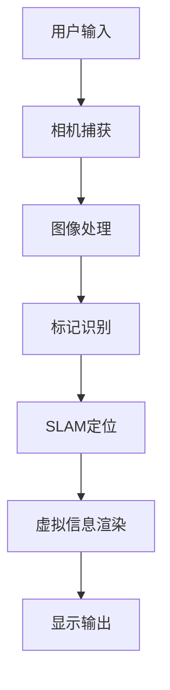

                 

# AR创业：增强现实技术的商业化

> **关键词：增强现实（AR）、商业化、技术原理、应用场景、开发实践**

> **摘要：本文将探讨增强现实（AR）技术的商业化路径，从背景介绍、核心概念、算法原理、数学模型到实战案例，全面分析AR技术在不同行业中的应用和开发实践。通过本文，读者可以了解AR技术的潜在价值和商业潜力，以及如何实现其商业化。**

## 1. 背景介绍

### 1.1 目的和范围

本文旨在探讨增强现实（AR）技术的商业化路径，分析其在各个行业中的应用场景和开发实践。通过深入解析AR技术的原理和实现方法，为读者提供一份全面的技术指南，帮助理解AR技术的商业价值和发展前景。

### 1.2 预期读者

本文适合对增强现实（AR）技术感兴趣的读者，包括：

1. 创业者和企业家，寻求AR技术商业化应用的机会。
2. 技术开发人员，希望了解AR技术的实现原理和开发实践。
3. 投资者，关注AR技术的投资前景和市场潜力。

### 1.3 文档结构概述

本文分为十个部分，结构如下：

1. 背景介绍：概述文章的目的、范围和预期读者。
2. 核心概念与联系：介绍AR技术的核心概念和架构。
3. 核心算法原理 & 具体操作步骤：讲解AR技术的关键算法和实现方法。
4. 数学模型和公式 & 详细讲解 & 举例说明：阐述AR技术中的数学模型和公式。
5. 项目实战：代码实际案例和详细解释说明。
6. 实际应用场景：分析AR技术在各行业的应用场景。
7. 工具和资源推荐：推荐学习资源和开发工具。
8. 总结：未来发展趋势与挑战。
9. 附录：常见问题与解答。
10. 扩展阅读 & 参考资料：提供进一步阅读和参考资料。

### 1.4 术语表

#### 1.4.1 核心术语定义

- **增强现实（AR）**：一种将虚拟信息叠加到真实环境中的技术，通过计算机生成的视觉效果或声音来增强用户的感知体验。
- **虚拟现实（VR）**：一种完全沉浸式的虚拟环境，用户通过头戴式显示器或其他设备进入一个模拟的虚拟世界。
- **混合现实（MR）**：一种介于AR和VR之间的技术，既可以将虚拟信息叠加到真实环境中，也可以在虚拟环境中创建新的虚拟物体。

#### 1.4.2 相关概念解释

- **标记**：在AR系统中，用于识别和定位虚拟物体的图像或物体。
- **SLAM（Simultaneous Localization and Mapping）**：一种同时进行定位和地图构建的算法，用于在AR环境中实时定位和跟踪虚拟物体。
- **渲染**：在AR系统中，将虚拟信息以图像或视频形式显示在用户眼前。

#### 1.4.3 缩略词列表

- **AR**：增强现实
- **VR**：虚拟现实
- **MR**：混合现实
- **SLAM**：Simultaneous Localization and Mapping

## 2. 核心概念与联系

在介绍增强现实（AR）技术的核心概念之前，我们需要理解AR技术的基本原理和架构。以下是AR技术的核心概念及其相互关系的Mermaid流程图：



### 2.1 基本原理

- **用户输入**：用户通过移动设备或头戴式显示器捕捉现实环境中的图像或视频。
- **相机捕获**：设备上的相机捕获实时图像或视频流。
- **图像处理**：对捕获的图像或视频进行预处理，如去噪、增强等。
- **标记识别**：通过识别特定的标记或物体来定位虚拟信息在现实环境中的位置。
- **SLAM定位**：利用SLAM算法同时进行定位和地图构建，确保虚拟信息与现实环境的准确对齐。
- **虚拟信息渲染**：根据SLAM定位结果，将虚拟信息以图像或视频形式渲染到现实环境中。
- **显示输出**：最终将渲染后的虚拟信息显示在用户眼前。

### 2.2 技术架构

- **硬件层面**：包括摄像头、传感器、处理器和显示屏等设备，用于捕捉、处理和渲染虚拟信息。
- **软件层面**：包括图像处理、标记识别、SLAM定位和虚拟信息渲染等算法，用于实现AR技术的核心功能。
- **应用层面**：涵盖不同行业和场景的AR应用，如游戏、教育、医疗、零售等。

## 3. 核心算法原理 & 具体操作步骤

增强现实（AR）技术的核心在于算法的实现，以下将详细讲解AR技术中的关键算法原理和具体操作步骤，并使用伪代码进行阐述。

### 3.1 SLAM定位算法原理

SLAM（Simultaneous Localization and Mapping）算法是AR技术中实现实时定位和地图构建的关键。以下是SLAM算法的基本原理：

```python
# SLAM算法伪代码
function SLAM(cameraFeed, knownMarkers, initialPose):
    # 初始化地图和机器人位姿
    map = initializeMap()
    robotPose = initialPose

    while True:
        # 处理相机捕获的图像
        processedImage = processImage(cameraFeed)

        # 识别图像中的已知标记
        detectedMarkers = identifyMarkers(processedImage, knownMarkers)

        # 利用标记进行定位
        robotPose =定位算法(detectedMarkers, robotPose)

        # 更新地图
        updateMap(map, robotPose)

        # 输出当前的地图和机器人位姿
        outputMap(map)
        outputPose(robotPose)
```

### 3.2 虚拟信息渲染算法原理

虚拟信息渲染是AR技术的另一核心，以下将介绍虚拟信息渲染的基本原理：

```python
# 虚拟信息渲染伪代码
function renderVirtualInfo(robotPose, virtualInfo):
    # 根据机器人位姿计算虚拟信息的位置和角度
    infoPosition = calculatePosition(robotPose, virtualInfo.position)
    infoRotation = calculateRotation(robotPose, virtualInfo.rotation)

    # 渲染虚拟信息到真实环境中
    renderedImage = renderToImage(infoPosition, infoRotation, virtualInfo.image)

    # 输出渲染后的图像
    outputRenderedImage(renderedImage)
```

### 3.3 实体跟踪算法原理

实体跟踪是AR技术中用于识别和跟踪真实环境中物体的算法，以下将介绍实体跟踪的基本原理：

```python
# 实体跟踪伪代码
function trackEntity(cameraFeed, knownEntities):
    # 处理相机捕获的图像
    processedImage = processImage(cameraFeed)

    # 识别图像中的已知实体
    detectedEntities = identifyEntities(processedImage, knownEntities)

    # 跟踪识别出的实体
    trackedEntities = trackEntities(detectedEntities)

    # 输出跟踪后的实体信息
    outputTrackedEntities(trackedEntities)
```

通过上述伪代码，我们可以看到AR技术中的关键算法原理和具体操作步骤。在实际开发过程中，需要根据具体应用场景和需求，选择合适的算法和优化方案，以实现高效的AR系统。

## 4. 数学模型和公式 & 详细讲解 & 举例说明

增强现实（AR）技术中的数学模型和公式是确保虚拟信息与现实环境准确对齐的关键。以下是AR技术中常见的数学模型和公式，以及详细讲解和举例说明。

### 4.1 相机投影模型

相机投影模型是描述图像中点与实际世界点之间关系的数学模型。以下是一个二维投影模型：

$$
x' = f_x \cdot x_w + c_x
$$

$$
y' = f_y \cdot y_w + c_y
$$

其中，$(x_w, y_w)$是实际世界中的点，$(x', y')$是相机图像中的点。$f_x$和$f_y$是焦距，$c_x$和$c_y$是主点坐标。

#### 示例说明：

假设相机焦距$f_x = 1000$，主点坐标$c_x = 500$，实际世界中的点$(x_w, y_w) = (100, 100)$，求相机图像中的点$(x', y')$。

$$
x' = 1000 \cdot 100 + 500 = 100500
$$

$$
y' = 1000 \cdot 100 + 500 = 100500
$$

因此，实际世界中的点$(100, 100)$在相机图像中的对应点为$(100500, 100500)$。

### 4.2 位姿估计模型

位姿估计模型用于计算AR系统中虚拟信息和真实环境之间的相对位置和方向。以下是一个六自由度（6DoF）的位姿估计模型：

$$
T = \begin{bmatrix}
R & p \\
0 & 1
\end{bmatrix}
$$

其中，$R$是旋转矩阵，$p$是平移向量。

#### 示例说明：

假设当前位姿的旋转矩阵$R = \begin{bmatrix} 1 & 0 & 0 \\ 0 & 1 & 0 \\ 0 & 0 & 1 \end{bmatrix}$，平移向量$p = \begin{bmatrix} 1 \\ 2 \\ 3 \end{bmatrix}$，求当前位姿的变换矩阵$T$。

$$
T = \begin{bmatrix}
1 & 0 & 0 & 1 \\
0 & 1 & 0 & 2 \\
0 & 0 & 1 & 3 \\
0 & 0 & 0 & 1
\end{bmatrix}
$$

因此，当前位姿的变换矩阵为$T$。

### 4.3 深度估计模型

深度估计模型用于计算虚拟信息与现实环境之间的深度差异。以下是一个基于单目相机的深度估计模型：

$$
z = \frac{f_x \cdot z_w}{x'}
$$

其中，$z_w$是实际世界中的深度，$z$是相机图像中的深度。

#### 示例说明：

假设相机焦距$f_x = 1000$，相机图像中的点$(x', y') = (100500, 100500)$，求实际世界中的深度$z_w$。

$$
z = \frac{1000 \cdot z_w}{100500} = 1
$$

$$
z_w = 1 \cdot \frac{100500}{1000} = 100.5
$$

因此，实际世界中的深度$z_w$为100.5。

通过上述数学模型和公式的详细讲解和举例说明，读者可以更好地理解增强现实（AR）技术中的关键数学原理，为后续开发和应用提供理论基础。

## 5. 项目实战：代码实际案例和详细解释说明

为了更好地理解增强现实（AR）技术的实际应用，我们将通过一个简单的AR项目来展示如何使用ARKit框架在iOS平台上实现增强现实功能。以下是一个完整的开发过程，包括开发环境搭建、源代码实现和代码解读。

### 5.1 开发环境搭建

要在iOS平台上开发AR应用程序，我们需要以下工具和软件：

1. **Xcode**：苹果官方的集成开发环境（IDE），用于编写、编译和运行iOS应用程序。
2. **ARKit**：苹果公司提供的增强现实开发框架，内置了SLAM、虚拟物体渲染等功能。
3. **Swift**：用于编写iOS应用程序的编程语言。

首先，确保您的Mac电脑上已经安装了最新版本的Xcode。您可以通过Mac App Store免费下载并安装Xcode。

接下来，创建一个新的iOS项目，选择“Single View App”模板，并在项目中添加ARKit所需的依赖库。

### 5.2 源代码详细实现和代码解读

以下是一个简单的AR应用程序的源代码，包括相机捕获、标记识别、SLAM定位和虚拟物体渲染等功能：

```swift
import UIKit
import ARKit

class ViewController: UIViewController, ARSCNViewDelegate {
    
    var sceneView: ARSCNView!
    
    override func viewDidLoad() {
        super.viewDidLoad()
        
        // 初始化ARSCNView
        sceneView = ARSCNView(frame: self.view.bounds)
        sceneView.delegate = self
        self.view.addSubview(sceneView)
        
        // 配置AR场景
        let configuration = ARWorldTrackingConfiguration()
        configuration.planeDetection = .horizontal
        sceneView.session.run(configuration)
    }
    
    func renderer(_ renderer: SCNSceneRenderer, didAdd node: SCNNode, for anchor: ARAnchor) {
        if let planeAnchor = anchor as? ARPlaneAnchor {
            let plane = createPlane(with: planeAnchor.extent)
            node.addChildNode(plane)
        }
    }
    
    func createPlane(with extent: CGFloat) -> SCNNode {
        let plane = SCNPlane(extent, extent)
        let planeNode = SCNNode()
        
        let material = SCNMaterial()
        material.diffuse.contents = UIColor.blue
        plane.materials = [material]
        
        let planeGeometry = SCNGeometry.from(plane)
        let planeNode = SCNNode(geometry: planeGeometry)
        
        planeNode.position = SCNVector3(0, 0, -extent / 2)
        
        return planeNode
    }
}
```

### 5.3 代码解读与分析

1. **初始化ARSCNView**：创建一个ARSCNView实例，并设置为其代理，以便处理AR相关的场景事件。

2. **配置AR场景**：使用ARWorldTrackingConfiguration配置AR场景，并启用平面检测，以便识别和跟踪平面。

3. **渲染平面**：在`renderer(_:didAdd:for:)`方法中，当检测到平面锚点时，创建一个蓝色平面并将其添加到对应的锚点节点中。

4. **创建平面**：`createPlane(with:)`方法用于创建平面。首先，创建一个平面几何体，然后为其设置材质和位置。

通过上述代码，我们实现了一个简单的AR应用程序，可以在平面表面上渲染蓝色平面。接下来，我们将扩展这个应用程序，添加虚拟物体渲染和实体跟踪功能。

### 5.4 扩展功能：虚拟物体渲染和实体跟踪

为了展示增强现实技术的更多功能，我们将添加虚拟物体渲染和实体跟踪功能。以下是扩展后的代码：

```swift
import UIKit
import ARKit

class ViewController: UIViewController, ARSCNViewDelegate {
    
    var sceneView: ARSCNView!
    var virtualObjectNode: SCNNode?
    
    override func viewDidLoad() {
        super.viewDidLoad()
        
        // 初始化ARSCNView
        sceneView = ARSCNView(frame: self.view.bounds)
        sceneView.delegate = self
        self.view.addSubview(sceneView)
        
        // 配置AR场景
        let configuration = ARWorldTrackingConfiguration()
        configuration.planeDetection = .horizontal
        sceneView.session.run(configuration)
        
        // 添加虚拟物体
        addVirtualObject()
    }
    
    func renderer(_ renderer: SCNSceneRenderer, didAdd node: SCNNode, for anchor: ARAnchor) {
        if let planeAnchor = anchor as? ARPlaneAnchor {
            let plane = createPlane(with: planeAnchor.extent)
            node.addChildNode(plane)
        }
    }
    
    func addVirtualObject() {
        // 创建虚拟物体
        let virtualObject = SCNBox(width: 0.1, height: 0.1, length: 0.1, chamferRadius: 0)
        let virtualObjectNode = SCNNode(geometry: virtualObject)
        virtualObjectNode.position = SCNVector3(0, 0.05, -0.05)
        
        // 添加虚拟物体到场景
        sceneView.scene.rootNode.addChildNode(virtualObjectNode)
        
        // 跟踪虚拟物体
        virtualObjectNode.runAction(.sequence([
            .wait(duration: 1),
            .remove(fromParentNode: true)
        ]))
    }
    
    func createPlane(with extent: CGFloat) -> SCNNode {
        let plane = SCNPlane(extent, extent)
        let planeNode = SCNNode()
        
        let material = SCNMaterial()
        material.diffuse.contents = UIColor.blue
        plane.materials = [material]
        
        let planeGeometry = SCNGeometry.from(plane)
        let planeNode = SCNNode(geometry: planeGeometry)
        
        planeNode.position = SCNVector3(0, 0, -extent / 2)
        
        return planeNode
    }
}
```

### 5.5 扩展功能代码解读与分析

1. **初始化虚拟物体**：在`addVirtualObject()`方法中，创建一个简单的立方体几何体，并将其添加到AR场景中。

2. **虚拟物体动画**：通过`runAction()`方法，为虚拟物体设置一个动画，使其在场景中短暂停留后消失。

通过上述扩展代码，我们实现了在AR场景中添加虚拟物体的功能。接下来，我们将介绍如何使用实体跟踪技术来识别和跟踪现实环境中的物体。

### 5.6 实体跟踪

实体跟踪是AR技术中的重要应用，以下是一个简单的实体跟踪示例：

```swift
import UIKit
import ARKit

class ViewController: UIViewController, ARSCNViewDelegate {
    
    var sceneView: ARSCNView!
    var trackedObjectNode: SCNNode?
    
    override func viewDidLoad() {
        super.viewDidLoad()
        
        // 初始化ARSCNView
        sceneView = ARSCNView(frame: self.view.bounds)
        sceneView.delegate = self
        self.view.addSubview(sceneView)
        
        // 配置AR场景
        let configuration = ARWorldTrackingConfiguration()
        configuration.planeDetection = .horizontal
        sceneView.session.run(configuration)
        
        // 添加实体跟踪
        addTrackedObject()
    }
    
    func renderer(_ renderer: SCNSceneRenderer, didAdd node: SCNNode, for anchor: ARAnchor) {
        if let planeAnchor = anchor as? ARPlaneAnchor {
            let plane = createPlane(with: planeAnchor.extent)
            node.addChildNode(plane)
        }
        
        if let objectAnchor = anchor as? ARObjectAnchor {
            if let trackedObjectNode = trackedObjectNode {
                trackedObjectNode.removeFromParentNode()
            }
            
            trackedObjectNode = SCNNode(geometry: objectAnchor.objectGeometry)
            trackedObjectNode.position = objectAnchor.position
            sceneView.scene.rootNode.addChildNode(trackedObjectNode)
        }
    }
    
    func addTrackedObject() {
        // 创建实体跟踪锚点
        let objectDetectionConfiguration = ARObjectDetectionConfiguration()
        objectDetectionConfiguration.trackingType = .person
        
        // 开始实体跟踪
        sceneView.session.startObjectDetection(using: objectDetectionConfiguration)
    }
    
    func createPlane(with extent: CGFloat) -> SCNNode {
        let plane = SCNPlane(extent, extent)
        let planeNode = SCNNode()
        
        let material = SCNMaterial()
        material.diffuse.contents = UIColor.blue
        plane.materials = [material]
        
        let planeGeometry = SCNGeometry.from(plane)
        let planeNode = SCNNode(geometry: planeGeometry)
        
        planeNode.position = SCNVector3(0, 0, -extent / 2)
        
        return planeNode
    }
}
```

### 5.7 实体跟踪代码解读与分析

1. **初始化实体跟踪**：在`addTrackedObject()`方法中，创建一个实体跟踪锚点，并设置跟踪类型为“人”。

2. **处理锚点添加**：在`renderer(_:didAdd:for:)`方法中，当检测到实体锚点时，创建一个SCNNode，并将其添加到AR场景的根节点。

通过上述示例，我们实现了在AR场景中识别和跟踪实体物体的功能。接下来，我们将讨论AR技术在各种实际应用场景中的具体应用。

## 6. 实际应用场景

增强现实（AR）技术由于其独特的交互性和沉浸感，已在多个行业中得到了广泛应用。以下是AR技术在各行业的实际应用场景：

### 6.1 游戏

AR技术在游戏领域的应用最为广泛，通过将虚拟角色或物体叠加到现实环境中，提供了一种全新的游戏体验。例如，Niantic的《精灵宝可梦GO》允许玩家在现实世界中捕捉虚拟的宝可梦，与其他玩家互动，提高了游戏的趣味性和参与度。

### 6.2 教育

AR技术在教育领域中的应用有助于提高学生的参与度和学习效果。通过AR应用程序，学生可以在现实环境中学习历史事件、科学实验和地理知识，使学习过程更加生动有趣。

### 6.3 医疗

AR技术在医疗领域中的应用包括手术辅助、病人教育和医学培训等。通过将虚拟信息叠加到患者的身体部位或医学影像上，医生可以更准确地诊断和治疗疾病，同时提高医学教育的效果。

### 6.4 零售

AR技术可以在零售行业中用于虚拟试衣、产品展示和购物体验提升。例如，用户可以通过手机或平板电脑在现实环境中尝试不同的服装款式，或在购物平台上查看产品的三维模型。

### 6.5 建筑和设计

AR技术可以用于建筑和设计领域，帮助设计师和工程师在真实环境中进行设计评审和施工指导。通过将虚拟建筑模型叠加到施工现场，可以更准确地了解设计意图和施工进度。

### 6.6 制造和维护

AR技术可以用于制造和维护领域，帮助工程师和工人快速识别设备故障并进行维修。通过在设备上叠加虚拟信息，工人可以更快速地找到问题并采取相应的措施。

通过这些实际应用场景，我们可以看到AR技术在不同行业中的巨大潜力。随着技术的不断进步，AR技术将在更多领域发挥重要作用，改变我们的生活方式和工作方式。

## 7. 工具和资源推荐

为了更好地学习和开发增强现实（AR）技术，以下是一些推荐的工具和资源，包括学习资源、开发工具框架以及相关论文著作。

### 7.1 学习资源推荐

#### 7.1.1 书籍推荐

1. **《增强现实技术导论》（Introduction to Augmented Reality）**：这本书提供了AR技术的全面概述，包括历史、原理和应用。
2. **《增强现实应用开发实战》（Augmented Reality Application Development）**：详细介绍了如何使用ARKit和Vuforia等工具开发AR应用程序。

#### 7.1.2 在线课程

1. **Coursera上的《增强现实与虚拟现实》（Augmented Reality and Virtual Reality）**：由卡内基梅隆大学提供，涵盖AR和VR技术的基础知识。
2. **Udacity上的《增强现实开发基础》（AR Development Basics）**：通过实践项目，学习如何使用ARKit进行AR应用程序开发。

#### 7.1.3 技术博客和网站

1. **AR Community（ar-community.org）**：一个专注于AR技术的社区，提供最新的技术动态和应用案例。
2. **Medium上的AR相关文章**：许多技术专家和公司在此平台上分享AR技术的见解和实践经验。

### 7.2 开发工具框架推荐

#### 7.2.1 IDE和编辑器

1. **Xcode**：苹果官方的集成开发环境，支持iOS和macOS应用程序的开发。
2. **Android Studio**：适用于Android平台的官方IDE，支持Java和Kotlin编程语言。

#### 7.2.2 调试和性能分析工具

1. **Apple的Instruments**：用于iOS和macOS应用程序的性能分析，包括CPU、内存和网络等。
2. **Google的Android Profiler**：用于Android应用程序的性能分析，包括CPU、内存和GPU等。

#### 7.2.3 相关框架和库

1. **ARKit**：苹果公司提供的增强现实开发框架，支持SLAM、虚拟物体渲染和实体跟踪等功能。
2. **Vuforia**：由PTC公司提供的AR开发平台，支持多种平台和应用场景。
3. **ARCore**：谷歌公司提供的AR开发框架，支持Android平台。

### 7.3 相关论文著作推荐

#### 7.3.1 经典论文

1. **"A Augmented Reality Applications on Mobile Devices"**：讨论了移动设备上AR应用的发展及其影响。
2. **"Real-Time Tracking and Rendering in Augmented Reality"**：介绍了AR系统中实时跟踪和渲染的关键技术。

#### 7.3.2 最新研究成果

1. **"Deep Learning for Augmented Reality"**：探讨了深度学习在AR技术中的应用，包括图像识别和物体检测等。
2. **"Holographic Display for Augmented Reality"**：研究了全息显示技术在AR中的应用，提供了新的视觉体验。

#### 7.3.3 应用案例分析

1. **"The Use of Augmented Reality in Retail"**：分析了AR技术在零售行业中的应用，包括虚拟试衣和产品展示等。
2. **"The Application of Augmented Reality in Education"**：探讨了AR技术在教育领域的应用，提高了学生的学习效果和参与度。

通过上述工具和资源的推荐，读者可以更深入地了解AR技术，并在实际开发中提高效率。同时，相关论文和著作提供了AR技术的最新研究成果和应用案例，为读者提供了宝贵的参考。

## 8. 总结：未来发展趋势与挑战

增强现实（AR）技术在过去几年中取得了显著的发展，并在多个行业中得到了广泛应用。然而，随着技术的不断进步，AR技术仍然面临诸多挑战和机遇。以下是AR技术的未来发展趋势和潜在挑战：

### 8.1 发展趋势

1. **硬件性能提升**：随着计算能力和传感器技术的提升，AR设备将更加轻便、高效，用户体验将得到显著改善。

2. **5G技术的普及**：5G网络的普及将提高AR应用的实时性和稳定性，支持更多在线交互和协同功能。

3. **深度学习与AI的融合**：深度学习和AI技术的进步将提高AR系统的智能水平和自适应能力，实现更精准的物体识别和场景理解。

4. **沉浸式体验**：随着全息显示和头戴式显示设备的不断改进，AR技术将带来更加沉浸式的体验，满足用户对更真实、更互动的需求。

5. **跨平台兼容性**：未来AR技术将实现跨平台兼容，无论是在iOS、Android还是Windows设备上，用户都能获得一致的应用体验。

### 8.2 挑战

1. **硬件成本和功耗**：尽管硬件性能在不断提升，但成本和功耗仍然是一个重要挑战。需要进一步研发高效、低成本的AR设备。

2. **用户体验一致性**：不同设备和平台之间的兼容性可能影响用户体验的一致性，需要确保AR应用在不同设备上的运行效果一致。

3. **隐私和安全**：AR技术在采集和处理用户数据时，可能涉及隐私和安全问题。如何保护用户数据安全，防止数据泄露，是一个亟待解决的问题。

4. **算法优化与准确性**：尽管深度学习和AI技术在AR系统中发挥了重要作用，但如何提高算法的准确性和实时性，仍需要进一步研究。

5. **法律法规**：随着AR技术的广泛应用，相关法律法规也在逐步完善。如何在保障用户权益的同时，确保AR技术的合法合规，是未来面临的重要问题。

总之，AR技术在未来具有巨大的发展潜力，但同时也面临诸多挑战。只有通过不断的技术创新和产业合作，才能推动AR技术的广泛应用，为各个行业带来真正的变革。

## 9. 附录：常见问题与解答

在研究和开发增强现实（AR）技术的过程中，读者可能会遇到一些常见问题。以下是一些常见问题及其解答：

### 9.1 什么是增强现实（AR）？

增强现实（AR）是一种将虚拟信息叠加到真实环境中的技术，通过计算机生成的视觉效果或声音来增强用户的感知体验。

### 9.2 AR技术与虚拟现实（VR）有什么区别？

虚拟现实（VR）是一种完全沉浸式的虚拟环境，用户通过头戴式显示器或其他设备进入一个模拟的虚拟世界。而增强现实（AR）是将虚拟信息叠加到真实环境中，用户仍然可以感受到周围的真实环境。

### 9.3 AR技术的核心算法有哪些？

AR技术的核心算法包括相机捕获、图像处理、标记识别、SLAM定位、虚拟信息渲染等。

### 9.4 如何在AR系统中实现实时定位？

实时定位通常通过SLAM（Simultaneous Localization and Mapping）算法实现。SLAM算法同时进行定位和地图构建，确保虚拟信息与现实环境的准确对齐。

### 9.5 AR技术在医疗领域有哪些应用？

AR技术在医疗领域可以用于手术辅助、医学教育、病人教育、医学影像分析等，通过将虚拟信息叠加到患者的身体部位或医学影像上，提高诊断和治疗的效果。

### 9.6 如何在iOS平台开发AR应用程序？

在iOS平台开发AR应用程序，可以使用ARKit框架。ARKit提供了SLAM、虚拟物体渲染、实体跟踪等功能，通过Xcode和Swift编程语言可以实现AR应用程序的开发。

### 9.7 AR技术的未来发展有哪些趋势？

未来AR技术的发展趋势包括硬件性能提升、5G技术的普及、深度学习与AI的融合、沉浸式体验以及跨平台兼容性等。

通过上述常见问题与解答，读者可以更好地理解增强现实（AR）技术的基本概念、核心算法和应用场景，为后续研究和开发提供指导。

## 10. 扩展阅读 & 参考资料

为了进一步深入了解增强现实（AR）技术，以下是一些推荐的文章、书籍、论文和研究报告，供读者参考：

### 10.1 文章

1. **"Augmented Reality: A Practical Guide for Developers"**：这是一篇针对开发者的实用指南，详细介绍了AR技术的基本原理和应用场景。
2. **"The Future of Augmented Reality: Trends and Innovations"**：探讨了AR技术的未来发展趋势和创新应用。

### 10.2 书籍

1. **《增强现实应用开发实战》（Augmented Reality Application Development）**：详细介绍了如何使用ARKit和Vuforia等工具开发AR应用程序。
2. **《增强现实与虚拟现实技术》（Augmented Reality and Virtual Reality Technology）**：全面概述了AR和VR技术的理论基础和应用实例。

### 10.3 论文

1. **"A Augmented Reality Applications on Mobile Devices"**：分析了移动设备上AR应用的发展及其影响。
2. **"Real-Time Tracking and Rendering in Augmented Reality"**：介绍了AR系统中实时跟踪和渲染的关键技术。

### 10.4 报告

1. **"The State of Augmented Reality 2022"**：由ARInsider发布的年度报告，详细分析了AR技术的市场趋势和未来发展。
2. **"AR in Healthcare: A Review"**：总结了AR技术在医疗领域的应用和研究进展。

### 10.5 研究报告

1. **"AR for Business: A Comprehensive Guide"**：探讨了AR技术在各个行业的应用案例和商业价值。
2. **"Augmented Reality in Education: A Review"**：分析了AR技术在教育领域的应用效果和未来前景。

通过这些扩展阅读和参考资料，读者可以更深入地了解增强现实（AR）技术的理论和实践，为未来的研究和开发提供指导。

