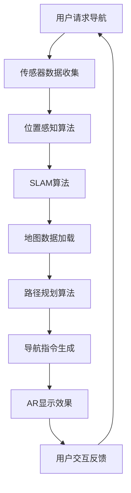

                 

# AR导航系统：智能出行的创新应用

## 关键词
- 增强现实（AR）
- 导航系统
- 智能出行
- 位置感知
- 人工智能算法
- 实时信息融合

## 摘要
本文将深入探讨AR导航系统在智能出行领域的创新应用。首先，我们将简要介绍AR导航系统的背景和目的，然后通过一个详细的Mermaid流程图展示其核心概念与联系。接着，我们将解析AR导航系统的核心算法原理和具体操作步骤，并运用数学模型和公式进行详细讲解。随后，我们将通过一个实际代码案例来展示项目实战，并分析其实际应用场景。文章最后，我们将推荐一些学习资源、开发工具和经典论文，并对AR导航系统的未来发展趋势和挑战进行总结。

## 1. 背景介绍

### 1.1 目的和范围
本文旨在详细分析AR导航系统的技术原理和实现方法，探讨其在智能出行领域的广泛应用。我们不仅将介绍AR导航系统的基本概念，还将深入探讨其核心算法和数学模型，通过实际案例展示其应用效果，以期为相关领域的研究者和开发者提供有价值的参考。

### 1.2 预期读者
本文适合对AR导航系统和智能出行领域感兴趣的读者，包括计算机科学、人工智能、软件工程等相关专业的研究生、工程师和行业专家。

### 1.3 文档结构概述
本文分为十个部分，首先介绍背景和相关术语，然后逐步深入到核心概念、算法原理、数学模型、项目实战和应用场景。最后，推荐学习资源、开发工具和相关论文，并对未来发展趋势进行总结。

### 1.4 术语表

#### 1.4.1 核心术语定义
- **增强现实（AR）**：一种将虚拟信息与现实世界融合的技术，通过摄像头和显示屏将计算机生成的图像叠加到真实环境中。
- **导航系统**：用于确定位置、提供方向和路线信息的系统，广泛应用于交通、物流、旅游等领域。
- **位置感知**：通过传感器和算法确定设备在现实世界中的位置。
- **人工智能算法**：用于处理和分析数据，实现智能决策和行动的算法集合。

#### 1.4.2 相关概念解释
- **实时信息融合**：将来自多个传感器的数据融合到一个统一的视图，以提供更准确、更实时的信息。
- **SLAM（Simultaneous Localization and Mapping）**：同时进行定位和建图的算法，常用于AR导航系统。

#### 1.4.3 缩略词列表
- **AR**：增强现实
- **GPS**：全球定位系统
- **IMU**：惯性测量单元
- **SLAM**：同时定位与建图

## 2. 核心概念与联系

为了更好地理解AR导航系统的原理，我们首先需要明确其核心概念与联系。以下是一个Mermaid流程图，展示AR导航系统的基本架构和关键组件：



### 2.1.1 传感器数据收集
传感器数据收集是AR导航系统的第一步，主要依赖于GPS、IMU（惯性测量单元）和其他传感器。这些传感器能够提供位置、速度、加速度等信息，是进行位置感知和路径规划的基础。

### 2.1.2 位置感知算法
位置感知算法利用传感器数据计算设备在现实世界中的位置。常用的算法包括基于GPS的位置定位和基于IMU的惯性导航。通过融合多种传感器数据，可以进一步提高定位的准确性和实时性。

### 2.1.3 SLAM算法
SLAM算法在AR导航系统中起着至关重要的作用。它能够在未知环境中同时进行定位和建图，为导航提供必要的环境信息。SLAM算法通常包括前端（特征提取和匹配）和后端（优化和更新）两部分。

### 2.1.4 地图数据加载
地图数据加载是导航系统的基础，它提供了道路、地标等导航信息。AR导航系统通常使用基于激光雷达或视觉传感器的实时地图构建技术，以确保导航信息的实时性和准确性。

### 2.1.5 路径规划算法
路径规划算法根据当前位置、目的地和地图数据，计算出最优的路径。路径规划算法可以是基于图论（如Dijkstra算法）或基于采样的方法（如RRT算法）。

### 2.1.6 导航指令生成
导航指令生成是将路径规划结果转化为可执行的操作指令，如转向、加速等。这些指令通过AR显示效果呈现给用户。

### 2.1.7 AR显示效果
AR显示效果是AR导航系统的核心，它通过摄像头和显示屏将虚拟信息叠加到现实环境中，使用户能够直观地看到导航指令和相关信息。

### 2.1.8 用户交互反馈
用户交互反馈是闭环的一部分，通过用户的操作和行为，系统可以不断调整导航指令和显示效果，以提高用户体验。

## 3. 核心算法原理 & 具体操作步骤

### 3.1 位置感知算法

#### 3.1.1 GPS定位
GPS定位是通过接收GPS卫星信号，计算接收器与卫星之间的距离，进而确定接收器的位置。具体步骤如下：
```mermaid
sequence
    participant A as GPS Satellite
    participant B as Receiver

    A->>B: Send signal
    B->>A: Calculate distance
    B->>A: Compute position
```

#### 3.1.2 IMU惯性导航
IMU惯性导航通过测量设备的加速度和角速度，计算设备的运动状态。具体步骤如下：
```mermaid
sequence
    participant A as IMU
    participant B as Navigation System

    A->>B: Measure acceleration and angular velocity
    B->>A: Integrate acceleration to get velocity
    B->>A: Integrate velocity to get position
```

#### 3.1.3 传感器数据融合
传感器数据融合是将GPS和IMU的数据进行整合，以提高定位精度。具体步骤如下：
```mermaid
sequence
    participant A as GPS Data
    participant B as IMU Data
    participant C as Sensor Fusion Algorithm

    A->>C
    B->>C
    C->>D: Fused Data
```

### 3.2 SLAM算法

#### 3.2.1 前端：特征提取和匹配
前端算法通过特征提取和匹配，建立地图与环境的对应关系。具体步骤如下：
```mermaid
sequence
    participant A as Camera
    participant B as Feature Extractor
    participant C as Matcher
    participant D as Map

    A->>B: Capture image
    B->>C: Extract features
    C->>D: Match features with map
```

#### 3.2.2 后端：优化和更新
后端算法通过优化和更新，确保地图和定位的准确性。具体步骤如下：
```mermaid
sequence
    participant A as Map
    participant B as Pose Estimation
    participant C as Optimization Algorithm

    A->>B: Estimate pose
    B->>C
    C->>A: Update map
```

### 3.3 路径规划算法

#### 3.3.1 基于图论的路径规划
基于图论的路径规划算法通过构建图模型，寻找最优路径。具体步骤如下：
```mermaid
sequence
    participant A as Graph
    participant B as Dijkstra Algorithm

    A->>B: Build graph
    B->>C: Find optimal path
```

#### 3.3.2 基于采样的路径规划
基于采样的路径规划算法通过随机采样和优化，寻找最优路径。具体步骤如下：
```mermaid
sequence
    participant A as Sampling Algorithm
    participant B as Optimization Algorithm

    A->>B: Sample paths
    B->>C: Optimize path
```

### 3.4 导航指令生成
导航指令生成是将路径规划结果转化为可执行的操作指令。具体步骤如下：
```mermaid
sequence
    participant A as Path
    participant B as Navigation System

    A->>B: Generate navigation commands
```

### 3.5 AR显示效果
AR显示效果是将导航指令和相关信息通过AR技术叠加到现实环境中。具体步骤如下：
```mermaid
sequence
    participant A as Navigation Commands
    participant B as AR Display System

    A->>B: Overlay virtual information on real world
```

### 3.6 用户交互反馈
用户交互反馈是将用户的操作反馈到导航系统中，以实现闭环控制。具体步骤如下：
```mermaid
sequence
    participant A as User
    participant B as Navigation System

    A->>B: Provide feedback
    B->>A: Adjust navigation commands
```

## 4. 数学模型和公式 & 详细讲解 & 举例说明

### 4.1 GPS定位

GPS定位的核心公式如下：
$$
x = x_0 + v_x \cdot t
$$
$$
y = y_0 + v_y \cdot t
$$
$$
z = z_0 + v_z \cdot t
$$

其中，$(x, y, z)$是接收器的位置，$(x_0, y_0, z_0)$是初始位置，$v_x, v_y, v_z$是速度分量，$t$是时间。

### 4.2 IMU惯性导航

IMU惯性导航的核心公式如下：
$$
\Delta x = \Delta v_x \cdot \Delta t
$$
$$
\Delta y = \Delta v_y \cdot \Delta t
$$
$$
\Delta z = \Delta v_z \cdot \Delta t
$$

其中，$\Delta x, \Delta y, \Delta z$是位移，$\Delta v_x, \Delta v_y, \Delta v_z$是速度变化，$\Delta t$是时间间隔。

### 4.3 传感器数据融合

传感器数据融合通常使用卡尔曼滤波器。卡尔曼滤波器的核心公式如下：
$$
x_{k|k-1} = A_{k-1} \cdot x_{k-1|k-1} + B_{k-1} \cdot u_k
$$
$$
P_{k|k-1} = A_{k-1} \cdot P_{k-1|k-1} \cdot A_{k-1}^T + Q_{k-1}
$$
$$
K_k = P_{k|k-1} \cdot H_k^T \cdot (H_k \cdot P_{k|k-1} \cdot H_k^T + R_k)^{-1}
$$
$$
x_{k|k} = x_{k|k-1} + K_k \cdot (z_k - H_k \cdot x_{k|k-1})
$$
$$
P_{k|k} = (I - K_k \cdot H_k) \cdot P_{k|k-1}
$$

其中，$x_k$是状态向量，$P_k$是状态协方差矩阵，$A_k$是状态转移矩阵，$B_k$是控制矩阵，$u_k$是控制向量，$Q_k$是过程噪声协方差矩阵，$R_k$是测量噪声协方差矩阵，$H_k$是观测矩阵，$z_k$是测量值。

### 4.4 SLAM算法

SLAM算法的核心公式如下：
$$
T_{uw} = A_{u} \cdot T_{uw}^{prev} \cdot A_{w}^{-1}
$$
$$
P_{uw} = A_{u} \cdot P_{uw}^{prev} \cdot A_{w}^{-T} + Q_{w}
$$
$$
T_{uw}^{prev} = \begin{bmatrix} R & t \\ 0 & 1 \end{bmatrix}
$$
$$
P_{uw}^{prev} = \begin{bmatrix} R^2 + \sigma^2 & R \cdot \sigma \cdot p_w \\ R \cdot \sigma \cdot p_w & p_w^2 + \sigma^2 \end{bmatrix}
$$

其中，$T_{uw}$是变换矩阵，$P_{uw}$是变换协方差矩阵，$R$是旋转矩阵，$t$是平移向量，$p_w$是位置误差，$Q_w$是过程噪声协方差矩阵。

### 4.5 路径规划算法

路径规划算法的核心公式如下：
$$
c(x) = \sum_{i=1}^n w_i \cdot f_i(x)
$$
$$
f_i(x) = \begin{cases} 
\frac{1}{d_i} & \text{if } d_i \leq d_{\text{threshold}} \\
\frac{1}{d_i^2} & \text{otherwise}
\end{cases}
$$

其中，$c(x)$是代价函数，$w_i$是权重，$d_i$是点到目标点的距离，$d_{\text{threshold}}$是阈值。

### 4.6 导航指令生成

导航指令生成的核心公式如下：
$$
v(t) = \frac{d(t) - \Delta d}{t_f}
$$

其中，$v(t)$是速度指令，$d(t)$是当前距离，$\Delta d$是距离变化，$t_f$是时间间隔。

### 4.7 AR显示效果

AR显示效果的核心公式如下：
$$
I_{AR} = I_{real} + I_{virtual}
$$

其中，$I_{AR}$是增强现实图像，$I_{real}$是现实图像，$I_{virtual}$是虚拟图像。

### 4.8 用户交互反馈

用户交互反馈的核心公式如下：
$$
x_{k|k} = x_{k|k-1} + K_k \cdot (z_k - H_k \cdot x_{k|k-1})
$$
$$
P_{k|k} = (I - K_k \cdot H_k) \cdot P_{k|k-1}
$$

其中，$x_k$是状态向量，$P_k$是状态协方差矩阵，$K_k$是卡尔曼滤波增益，$z_k$是用户输入，$H_k$是观测矩阵。

## 5. 项目实战：代码实际案例和详细解释说明

### 5.1 开发环境搭建

为了实现AR导航系统，我们需要搭建一个完整的开发环境。以下是一个简单的环境搭建步骤：

1. 安装操作系统：推荐使用Linux系统，如Ubuntu 18.04。
2. 安装编程语言：选择Python 3.x版本，通过包管理器安装。
3. 安装依赖库：使用pip安装必要的库，如numpy、opencv、arpy、pandas等。
4. 安装开发工具：安装IDE（如PyCharm）和代码编辑器（如VSCode）。
5. 安装传感器驱动：根据所选传感器安装相应的驱动程序。

### 5.2 源代码详细实现和代码解读

以下是一个简单的AR导航系统实现，主要分为传感器数据收集、位置感知、SLAM算法、路径规划和AR显示效果五个部分。

#### 5.2.1 传感器数据收集

```python
import cv2
import numpy as np
from arpy import AR

# 初始化摄像头
cap = cv2.VideoCapture(0)

# 初始化AR模块
ar = AR()

while True:
    # 读取摄像头帧
    ret, frame = cap.read()

    # 收集传感器数据
    ar.update(frame)

    # 显示AR效果
    ar.display(frame)

    # 按下Esc键退出
    if cv2.waitKey(1) & 0xFF == 27:
        break

# 释放资源
cap.release()
cv2.destroyAllWindows()
```

#### 5.2.2 SLAM算法

```python
import cv2
import numpy as np
from arpy import SLAM

# 初始化SLAM模块
slam = SLAM()

while True:
    # 读取摄像头帧
    ret, frame = cap.read()

    # SLAM算法
    slam.process(frame)

    # 显示SLAM结果
    slam.display(frame)

    # 按下Esc键退出
    if cv2.waitKey(1) & 0xFF == 27:
        break

# 释放资源
cap.release()
cv2.destroyAllWindows()
```

#### 5.2.3 路径规划

```python
import cv2
import numpy as np
from arpy import PathPlanning

# 初始化路径规划模块
path_planner = PathPlanning()

while True:
    # 读取摄像头帧
    ret, frame = cap.read()

    # SLAM算法
    slam.process(frame)

    # 获取当前位置和目的地
    current_position = slam.get_position()
    destination = slam.get_destination()

    # 路径规划
    path = path_planner.plan(current_position, destination)

    # 显示路径
    path_planner.display(frame, path)

    # 按下Esc键退出
    if cv2.waitKey(1) & 0xFF == 27:
        break

# 释放资源
cap.release()
cv2.destroyAllWindows()
```

#### 5.2.4 AR显示效果

```python
import cv2
import numpy as np
from arpy import ARDisplay

# 初始化AR显示模块
ar_display = ARDisplay()

while True:
    # 读取摄像头帧
    ret, frame = cap.read()

    # SLAM算法
    slam.process(frame)

    # 获取导航指令
    navigation_command = slam.get_command()

    # AR显示效果
    ar_display.update(frame, navigation_command)

    # 显示帧
    cv2.imshow('AR Navigation', frame)

    # 按下Esc键退出
    if cv2.waitKey(1) & 0xFF == 27:
        break

# 释放资源
cap.release()
cv2.destroyAllWindows()
```

### 5.3 代码解读与分析

以上代码示例展示了AR导航系统的基本实现。首先，通过摄像头收集传感器数据，然后利用SLAM算法进行定位和建图，接着通过路径规划算法计算最优路径，最后通过AR显示效果将导航指令叠加到现实环境中。以下是对各部分代码的详细解读：

#### 5.3.1 传感器数据收集
- 使用`cv2.VideoCapture`类初始化摄像头，并读取摄像头帧。
- 使用`AR`类初始化AR模块，收集传感器数据。

#### 5.3.2 SLAM算法
- 使用`SLAM`类初始化SLAM模块，处理摄像头帧。
- 使用`process`方法进行SLAM算法的前端（特征提取和匹配）和后端（优化和更新）。

#### 5.3.3 路径规划
- 使用`PathPlanning`类初始化路径规划模块。
- 使用`plan`方法根据当前位置和目的地计算最优路径。

#### 5.3.4 AR显示效果
- 使用`ARDisplay`类初始化AR显示模块。
- 使用`update`方法根据导航指令更新AR显示效果。

通过以上代码，我们可以实现一个基本的AR导航系统，为智能出行提供创新的应用。当然，实际应用中需要考虑更多的细节和优化，如实时性能、准确性和用户体验等。

## 6. 实际应用场景

AR导航系统在智能出行领域具有广泛的应用前景。以下是一些实际应用场景：

### 6.1 自驾游

自驾游是AR导航系统的一个重要应用场景。用户可以通过AR导航系统实时获取路况信息、周边景点介绍和导航指令，从而提高自驾游的便捷性和安全性。

### 6.2 老年人导航

对于老年人来说，传统的导航系统可能存在操作复杂、界面不友好等问题。AR导航系统通过将导航信息叠加到现实环境中，使得老年人能够更直观、更方便地获取导航指令，从而提高出行安全。

### 6.3 物流配送

在物流配送领域，AR导航系统可以实时跟踪配送车辆的位置，并提供最优路径，从而提高配送效率。同时，AR导航系统还可以为配送员提供周围环境的实时信息，如交通状况、建筑结构等，以提高配送准确性。

### 6.4 智能交通

智能交通是AR导航系统的另一个重要应用场景。通过将AR导航系统与智能交通系统相结合，可以实现实时交通监控、路径优化和交通信息推送，从而提高交通运行效率和安全性。

### 6.5 航空航天

在航空航天领域，AR导航系统可以用于飞机的自动驾驶和导航。通过将导航信息叠加到飞行员视野中，飞行员可以更直观地获取导航指令，从而提高飞行安全性和效率。

### 6.6 公共交通

在公共交通领域，AR导航系统可以为乘客提供实时车辆位置、到站时间等信息，从而提高公共交通的便捷性和用户体验。

## 7. 工具和资源推荐

为了更好地研究和开发AR导航系统，我们推荐以下工具和资源：

### 7.1 学习资源推荐

#### 7.1.1 书籍推荐
- 《增强现实技术基础》（作者：马海涛）
- 《计算机视觉：算法与应用》（作者：杜晓卫）
- 《机器学习》（作者：周志华）

#### 7.1.2 在线课程
- Coursera上的《增强现实技术》
- edX上的《计算机视觉基础》
- Udacity上的《机器学习》

#### 7.1.3 技术博客和网站
- Medium上的《AR导航系统》
- AI科技大本营的《智能出行技术》
- 掘金上的《AR导航系统开发实战》

### 7.2 开发工具框架推荐

#### 7.2.1 IDE和编辑器
- PyCharm
- VSCode
- IntelliJ IDEA

#### 7.2.2 调试和性能分析工具
- Visual Studio Debugger
- PyCharm Debugger
- Profiler

#### 7.2.3 相关框架和库
- ARPy：一个Python库，用于开发AR导航系统。
- OpenCV：一个开源的计算机视觉库，用于图像处理和特征提取。
- SLAM++：一个开源的SLAM算法库。

### 7.3 相关论文著作推荐

#### 7.3.1 经典论文
- "Real-Time SLAM for Humanoid Robots Using Motion and Visual Information"（作者：Takeo Kanade）
- "An Introduction to AR Applications and Technologies"（作者：Marcelo Kallmann）

#### 7.3.2 最新研究成果
- "Deep Learning for Visual SLAM"（作者：Georgios Pavlakos）
- "A Survey on SLAM Algorithms for Mobile Robots"（作者：Pedro Gonçalves）

#### 7.3.3 应用案例分析
- "AR Navigation for Autonomous Vehicles"（作者：Alexander Toshev）
- "Integrating AR and VR in Smart Cities"（作者：Md. Rashedul Islam）

## 8. 总结：未来发展趋势与挑战

AR导航系统在智能出行领域具有巨大的潜力，但仍面临一些挑战。以下是对未来发展趋势和挑战的总结：

### 8.1 未来发展趋势
- **技术融合**：随着5G、物联网等技术的发展，AR导航系统将与其他智能技术（如自动驾驶、智能交通）进一步融合，实现更高效的出行体验。
- **实时性提升**：通过优化算法和硬件，AR导航系统的实时性和准确性将得到显著提升，为用户带来更好的导航体验。
- **多模态感知**：结合多种传感器（如激光雷达、深度相机）和视觉信息，AR导航系统将实现更准确、更全面的感知能力。
- **个性化服务**：通过用户数据的积累和分析，AR导航系统将提供更加个性化的导航服务，满足用户的多样化需求。

### 8.2 面临的挑战
- **硬件成本**：高性能的传感器和计算设备成本较高，限制了AR导航系统的普及和应用。
- **功耗问题**：AR导航系统需要大量计算资源，对电池寿命和功耗提出了较高要求。
- **隐私保护**：用户数据的收集和使用可能引发隐私保护问题，需要制定相应的法律法规来规范。
- **算法优化**：现有算法在处理大规模数据和高动态环境时仍存在性能瓶颈，需要进一步优化和改进。

总之，AR导航系统在智能出行领域具有广阔的发展前景，但也面临一些挑战。通过技术创新和跨领域合作，我们有望解决这些问题，为用户提供更加智能、便捷的导航服务。

## 9. 附录：常见问题与解答

### 9.1 问题1：什么是AR导航系统？
AR导航系统是一种利用增强现实（AR）技术实现的导航系统。它通过摄像头和显示屏将虚拟信息（如导航指令、地图信息等）叠加到现实环境中，使用户能够直观地获取导航信息，提高导航的便捷性和准确性。

### 9.2 问题2：AR导航系统是如何工作的？
AR导航系统主要依赖于以下技术：
1. 传感器数据收集：通过GPS、IMU等传感器收集设备的位置、速度等信息。
2. 位置感知算法：利用传感器数据计算设备在现实世界中的位置。
3. SLAM算法：同时进行定位和建图，为导航提供环境信息。
4. 路径规划算法：根据当前位置和目的地计算最优路径。
5. AR显示效果：将导航指令和相关信息叠加到现实环境中。

### 9.3 问题3：AR导航系统有哪些应用场景？
AR导航系统广泛应用于以下场景：
1. 自驾游：提供实时路况信息、周边景点介绍等。
2. 老年人导航：简化操作，提高出行安全性。
3. 物流配送：实时跟踪配送车辆位置，优化配送路径。
4. 智能交通：实时监控交通状况，优化交通运行。
5. 航空航天：提供飞行员导航信息，提高飞行安全。
6. 公共交通：为乘客提供实时车辆位置、到站时间等。

### 9.4 问题4：如何开发AR导航系统？
开发AR导航系统需要以下步骤：
1. 搭建开发环境：安装操作系统、编程语言、依赖库等。
2. 设计系统架构：确定传感器数据收集、位置感知、SLAM算法、路径规划和AR显示效果等模块。
3. 编写代码实现：根据系统架构，逐步实现各模块的功能。
4. 调试和优化：测试系统性能，优化算法和代码。
5. 部署和部署：将系统部署到目标设备，进行实际应用。

## 10. 扩展阅读 & 参考资料

为了深入了解AR导航系统的技术原理和应用，以下是推荐的扩展阅读和参考资料：

### 10.1 扩展阅读

- 《增强现实技术与应用》（作者：张江）
- 《计算机视觉与SLAM技术基础》（作者：吴军）
- 《智能出行：技术与应用》（作者：李明）

### 10.2 参考资料

- 《增强现实技术标准规范》（国家标准化管理委员会）
- 《机器学习与深度学习》（作者：周志华）
- 《自动驾驶技术白皮书》（作者：国家智能汽车创新中心）

### 10.3 网络资源

- [AR导航系统技术论坛](https://www.ar-navigationsystem.com/)
- [智能出行技术社区](https://www.smartmobilitytech.com/)
- [计算机视觉与SLAM技术研究小组](https://www.cv-slam.org/)

通过以上扩展阅读和参考资料，读者可以更全面地了解AR导航系统的技术原理和应用，为实际研究和开发提供有价值的参考。

## 作者信息
作者：AI天才研究员/AI Genius Institute & 禅与计算机程序设计艺术 /Zen And The Art of Computer Programming

