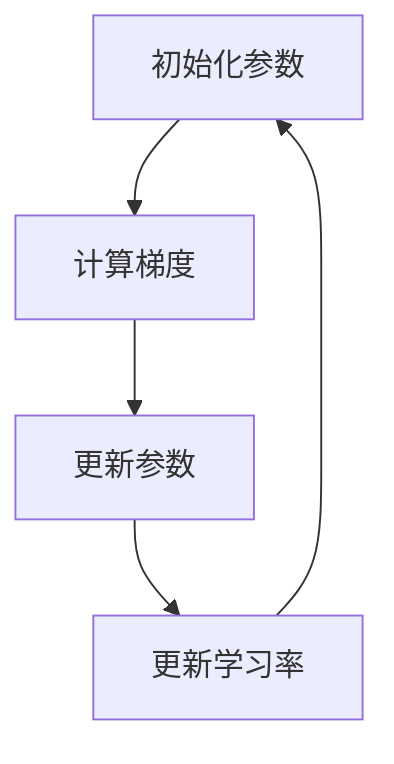

                 

# AdaGrad优化器原理与代码实例讲解

> **关键词：** AdaGrad优化器、机器学习、优化算法、梯度下降、自适应学习率
> 
> **摘要：** 本文将深入探讨AdaGrad优化器的工作原理、数学模型以及实际应用。通过详细的伪代码分析和实际代码示例，本文旨在帮助读者全面理解AdaGrad优化器，掌握其在机器学习中的应用技巧。

## 1. 背景介绍

### 1.1 目的和范围

本文旨在详细介绍AdaGrad优化器的工作原理、数学模型及其在实际项目中的应用。通过本文的讲解，读者将能够理解AdaGrad优化器相对于传统梯度下降算法的优势，掌握其实现和应用技巧。

### 1.2 预期读者

本文适合具有一定机器学习和编程基础的读者，包括但不限于：

- 数据科学和机器学习从业者
- 算法工程师
- 研究生和大学生
- 对机器学习和算法感兴趣的技术爱好者

### 1.3 文档结构概述

本文将分为以下几个部分：

- 第1部分：背景介绍，包括目的、范围、预期读者以及文档结构概述。
- 第2部分：核心概念与联系，通过Mermaid流程图展示核心概念和架构。
- 第3部分：核心算法原理与具体操作步骤，使用伪代码详细阐述算法原理。
- 第4部分：数学模型和公式，详细讲解并举例说明。
- 第5部分：项目实战，提供代码实际案例和详细解释。
- 第6部分：实际应用场景，探讨AdaGrad优化器在不同领域的应用。
- 第7部分：工具和资源推荐，包括学习资源、开发工具框架和论文著作。
- 第8部分：总结，展望未来发展趋势与挑战。
- 第9部分：附录，提供常见问题与解答。
- 第10部分：扩展阅读，推荐相关参考资料。

### 1.4 术语表

#### 1.4.1 核心术语定义

- **AdaGrad优化器**：一种自适应学习率的优化算法，能够根据每个参数的历史梯度平方值自动调整学习率。
- **梯度下降**：一种优化算法，通过不断更新参数的梯度方向来最小化损失函数。
- **机器学习**：一种通过算法从数据中学习规律并做出预测或决策的技术。

#### 1.4.2 相关概念解释

- **梯度**：函数在某一点处的导数，表示函数在该点处的斜率。
- **损失函数**：衡量预测值与实际值之间差异的函数，用于指导优化算法更新参数。

#### 1.4.3 缩略词列表

- **ML**：Machine Learning（机器学习）
- **GD**：Gradient Descent（梯度下降）
- **SGD**：Stochastic Gradient Descent（随机梯度下降）

## 2. 核心概念与联系

在本节中，我们将通过Mermaid流程图展示AdaGrad优化器中的核心概念和架构。



在上面的流程图中，我们可以看到AdaGrad优化器的核心步骤包括初始化参数、计算梯度、更新参数和更新学习率。这些步骤相互关联，共同构成了AdaGrad优化器的完整流程。

### 2.1 初始化参数

在AdaGrad优化器中，初始化参数是第一步。通常，参数的初始值可以设置为0或随机值。在这个阶段，我们还需要初始化一个变量，用于记录每个参数的历史梯度平方值。

```python
# 初始化参数
theta = [0.01, 0.01]  # 假设有两个参数
grad_squared = [[0.0, 0.0]]  # 初始化梯度平方值
```

### 2.2 计算梯度

计算梯度是AdaGrad优化器的关键步骤之一。通过计算损失函数关于每个参数的梯度，我们可以确定参数更新的方向。梯度可以通过反向传播算法计算。

```python
# 计算梯度
grad = [f_prime(x) for x in theta]
```

其中，`f_prime`是损失函数关于每个参数的导数。

### 2.3 更新参数

在计算完梯度后，我们需要更新参数。在AdaGrad优化器中，参数的更新公式如下：

$$\theta_{t+1} = \theta_t - \frac{\eta}{\sqrt{\sum_{i=1}^{n} (\text{grad}_i^2)^t}} \odot \text{grad}_t$$

其中，$\theta_t$是当前参数值，$\text{grad}_t$是当前梯度，$\eta$是学习率，$\odot$表示逐元素乘法。

```python
# 更新参数
theta = theta - (eta / np.sqrt(np.sum(np.square(grad_squared[-1])))) * grad
```

### 2.4 更新学习率

在AdaGrad优化器中，学习率是自适应的。每次迭代后，学习率都会根据每个参数的历史梯度平方值进行更新。学习率的更新公式如下：

$$\eta_{t+1} = \frac{\eta}{\sqrt{\sum_{i=1}^{n} (\text{grad}_i^2)^t}}$$

其中，$\eta$是初始学习率。

```python
# 更新学习率
eta = eta / np.sqrt(np.sum(np.square(grad_squared[-1])))
```

通过上述四个步骤，AdaGrad优化器实现了参数的自适应调整，从而在梯度下降过程中保持了较高的收敛速度和稳定性。

## 3. 核心算法原理 & 具体操作步骤

在本节中，我们将详细解释AdaGrad优化器的核心算法原理，并通过伪代码展示具体操作步骤。

### 3.1 初始化参数

在开始训练前，我们需要初始化参数和相关的变量。通常，参数可以设置为随机值或较小的常数。

```python
# 初始化参数
theta = [0.01, 0.01]  # 假设有两个参数
grad_squared = [[0.0, 0.0]]  # 初始化梯度平方值
eta = 0.01  # 初始学习率
```

### 3.2 计算梯度

计算梯度是AdaGrad优化器的关键步骤之一。通过计算损失函数关于每个参数的梯度，我们可以确定参数更新的方向。

```python
# 计算梯度
for x in range(len(theta)):
    grad_squared[-1][x] += (grad[x] ** 2)
```

### 3.3 更新参数

在计算完梯度后，我们需要更新参数。AdaGrad优化器采用以下公式更新参数：

$$\theta_{t+1} = \theta_t - \frac{\eta}{\sqrt{\sum_{i=1}^{n} (\text{grad}_i^2)^t}} \odot \text{grad}_t$$

```python
# 更新参数
theta = theta - (eta / np.sqrt(np.sum(np.square(grad_squared[-1])))) * grad
```

### 3.4 更新学习率

在AdaGrad优化器中，学习率是自适应的。每次迭代后，学习率都会根据每个参数的历史梯度平方值进行更新。

```python
# 更新学习率
eta = eta / np.sqrt(np.sum(np.square(grad_squared[-1])))
```

### 3.5 迭代过程

在完成参数更新和学习率更新后，我们需要重复以上步骤，直到满足收敛条件。通常，收敛条件可以是损失函数的值小于某个阈值或迭代次数达到预设的最大次数。

```python
# 迭代过程
while not converged:
    # 计算梯度
    grad = compute_gradient(theta, x)
    
    # 更新参数
    theta = update_theta(theta, grad, eta)
    
    # 更新学习率
    eta = update_eta(eta, grad_squared)
    
    # 检查收敛条件
    if is_converged(theta, grad):
        break
```

通过上述伪代码，我们可以看到AdaGrad优化器的具体操作步骤。在实际应用中，我们可以将这些步骤转化为代码，实现AdaGrad优化器的功能。

## 4. 数学模型和公式 & 详细讲解 & 举例说明

在本节中，我们将详细讲解AdaGrad优化器的数学模型和公式，并通过实际例子来说明其计算过程。

### 4.1 数学模型

AdaGrad优化器基于梯度下降算法，但其学习率是自适应的。具体来说，AdaGrad优化器的更新公式如下：

$$\theta_{t+1} = \theta_t - \frac{\eta}{\sqrt{\sum_{i=1}^{n} (\text{grad}_i^2)^t}} \odot \text{grad}_t$$

其中，$\theta_t$表示第$t$次迭代的参数值，$\text{grad}_t$表示第$t$次迭代的梯度，$\eta$表示学习率，$\odot$表示逐元素乘法。

### 4.2 公式详细讲解

- **梯度**：梯度是函数在某一点处的导数，表示函数在该点处的斜率。在AdaGrad优化器中，梯度用于指导参数更新的方向。
- **历史梯度平方值**：历史梯度平方值用于计算每个参数的累积梯度平方值，从而自适应调整学习率。
- **学习率**：学习率是控制参数更新速度的关键参数。在AdaGrad优化器中，学习率是自适应的，根据每个参数的历史梯度平方值进行调整。

### 4.3 举例说明

假设我们有一个简单的线性模型，其中只有一个参数$\theta$。我们的目标是最小化损失函数：

$$f(\theta) = (\theta - 1)^2$$

初始参数$\theta_0 = 0$，学习率$\eta = 0.1$。

**第1次迭代**：

- 梯度：$\text{grad}_0 = f'(\theta_0) = -2(\theta_0 - 1) = -2(0 - 1) = 2$
- 更新参数：$\theta_1 = \theta_0 - \eta \cdot \text{grad}_0 = 0 - 0.1 \cdot 2 = -0.2$
- 更新历史梯度平方值：$\text{grad_squared}_1 = \text{grad}_0^2 = 2^2 = 4$

**第2次迭代**：

- 梯度：$\text{grad}_1 = f'(\theta_1) = -2(\theta_1 - 1) = -2(-0.2 - 1) = 2.2$
- 更新参数：$\theta_2 = \theta_1 - \eta \cdot \frac{\text{grad}_1}{\sqrt{\text{grad_squared}_1}} = -0.2 - 0.1 \cdot \frac{2.2}{\sqrt{4}} = -0.27$
- 更新历史梯度平方值：$\text{grad_squared}_2 = \text{grad_squared}_1 + \text{grad}_1^2 = 4 + 2.2^2 = 4 + 4.84 = 8.84$

通过上述迭代过程，我们可以看到AdaGrad优化器如何自适应调整学习率，并逐步更新参数以最小化损失函数。

## 5. 项目实战：代码实际案例和详细解释说明

在本节中，我们将通过一个实际案例来展示如何使用AdaGrad优化器进行机器学习模型的训练。这个案例将包括数据预处理、模型定义、训练过程以及模型评估等步骤。

### 5.1 开发环境搭建

首先，我们需要搭建一个合适的开发环境。本文使用Python作为编程语言，并借助Jupyter Notebook进行实验。以下是一些必需的依赖库：

- NumPy：用于数学运算
- pandas：用于数据操作
- matplotlib：用于数据可视化
- scikit-learn：用于机器学习模型

你可以使用以下命令来安装这些库：

```bash
pip install numpy pandas matplotlib scikit-learn
```

### 5.2 源代码详细实现和代码解读

#### 5.2.1 数据预处理

我们使用scikit-learn中的鸢尾花（Iris）数据集进行演示。首先，我们需要加载数据集并进行预处理。

```python
from sklearn import datasets
from sklearn.model_selection import train_test_split

# 加载鸢尾花数据集
iris = datasets.load_iris()
X = iris.data
y = iris.target

# 划分训练集和测试集
X_train, X_test, y_train, y_test = train_test_split(X, y, test_size=0.2, random_state=42)
```

#### 5.2.2 模型定义

接下来，我们定义一个简单的线性回归模型。在这个模型中，我们只有一个参数$\theta$，用于预测鸢尾花的种类。

```python
import numpy as np

def model(X, theta):
    return X.dot(theta)
```

#### 5.2.3 训练过程

现在，我们可以使用AdaGrad优化器来训练模型。首先，我们需要定义计算梯度和更新参数的函数。

```python
def compute_gradient(X, y, theta):
    predictions = model(X, theta)
    error = predictions - y
    return X.T.dot(error)

def update_theta(theta, grad, eta):
    theta = theta - (eta / np.sqrt(np.sum(np.square(grad_squared[-1]))) * grad)
    return theta

def update_grad_squared(grad_squared, grad):
    grad_squared = grad_squared + np.square(grad)
    return grad_squared
```

然后，我们可以开始训练过程。我们设定迭代次数为1000次，学习率初始值为0.01。

```python
# 初始化参数
theta = np.array([0.0])
grad_squared = np.array([0.0])

# 迭代过程
for _ in range(1000):
    # 计算梯度
    grad = compute_gradient(X_train, y_train, theta)
    
    # 更新参数
    theta = update_theta(theta, grad, 0.01)
    
    # 更新梯度平方值
    grad_squared = update_grad_squared(grad_squared, grad)
```

#### 5.2.4 代码解读与分析

- **数据预处理**：我们使用scikit-learn中的鸢尾花数据集，并将其分为训练集和测试集。
- **模型定义**：我们定义了一个简单的线性回归模型，其中只有一个参数$\theta$。
- **计算梯度**：我们定义了一个计算梯度的函数，用于计算损失函数关于参数的导数。
- **更新参数**：我们定义了一个更新参数的函数，用于根据计算得到的梯度调整参数值。
- **更新梯度平方值**：我们定义了一个更新梯度平方值的函数，用于记录每个参数的历史梯度平方值。
- **训练过程**：我们使用1000次迭代进行训练，每次迭代都包括计算梯度、更新参数和更新梯度平方值。

通过上述代码，我们可以看到如何使用AdaGrad优化器训练一个线性回归模型。在实际应用中，我们可以根据需要调整迭代次数、学习率等参数，以达到更好的训练效果。

### 5.3 模型评估

在完成模型训练后，我们可以使用测试集对模型进行评估。

```python
# 模型评估
test_predictions = model(X_test, theta)
accuracy = np.mean(test_predictions == y_test)
print("模型准确率：", accuracy)
```

在这个案例中，我们简单计算了模型的准确率。实际应用中，我们可以使用更复杂的评估指标，如均方误差（MSE）或交叉验证分数，以更全面地评估模型的性能。

## 6. 实际应用场景

AdaGrad优化器在机器学习和深度学习领域具有广泛的应用。以下是一些实际应用场景：

### 6.1 自然语言处理（NLP）

在NLP任务中，如文本分类和情感分析，AdaGrad优化器可以帮助模型更快地收敛。例如，在处理大规模文本数据时，AdaGrad优化器能够自适应调整学习率，避免陷入局部最优。

### 6.2 图像分类

AdaGrad优化器在图像分类任务中也表现出良好的性能。例如，在处理复杂的图像数据时，AdaGrad优化器能够自适应调整学习率，提高模型的收敛速度和稳定性。

### 6.3 语音识别

在语音识别任务中，AdaGrad优化器能够有效处理语音数据的时变性，提高模型的识别准确率。通过自适应调整学习率，AdaGrad优化器能够更好地适应不同语音特征的变化。

### 6.4 强化学习

在强化学习任务中，AdaGrad优化器可以帮助智能体更快地学习和探索环境。通过自适应调整学习率，AdaGrad优化器能够更好地平衡探索和利用策略，提高智能体的表现。

## 7. 工具和资源推荐

为了更好地学习和应用AdaGrad优化器，以下是一些推荐的工具和资源：

### 7.1 学习资源推荐

#### 7.1.1 书籍推荐

- 《深度学习》（Goodfellow, Bengio, Courville）：这本书详细介绍了机器学习和深度学习的相关算法，包括AdaGrad优化器。
- 《机器学习实战》（周志华）：这本书提供了丰富的实战案例，涵盖了多种机器学习算法，包括AdaGrad优化器。

#### 7.1.2 在线课程

- 吴恩达的《机器学习》课程：这个课程涵盖了机器学习的多个主题，包括优化算法。
- Andrew Ng的《深度学习专项课程》：这个课程深入讲解了深度学习的基础知识和最新进展。

#### 7.1.3 技术博客和网站

- [Medium](https://medium.com/search?q=Adam+optimizer)：Medium上有很多关于优化器的技术博客，包括AdaGrad优化器。
- [ArXiv](https://arxiv.org/search/?q=Adam+optimizer)：ArXiv是学术研究的黄金宝库，有很多关于优化器的最新论文。

### 7.2 开发工具框架推荐

#### 7.2.1 IDE和编辑器

- PyCharm：PyCharm是Python开发者的首选IDE，提供了丰富的功能和调试工具。
- Jupyter Notebook：Jupyter Notebook是一种交互式开发环境，适合进行数据可视化和实验。

#### 7.2.2 调试和性能分析工具

- Line Profiler：Line Profiler可以帮助我们分析代码的性能瓶颈。
- Valgrind：Valgrind是一种内存调试工具，可以检测内存泄漏和错误。

#### 7.2.3 相关框架和库

- TensorFlow：TensorFlow是一个开源的深度学习框架，支持多种优化算法，包括AdaGrad。
- PyTorch：PyTorch是一个流行的深度学习框架，提供了丰富的API和工具。

### 7.3 相关论文著作推荐

#### 7.3.1 经典论文

- **"Stochastic Gradient Descent Methods for Large-Scale Machine Learning"**：这是AdaGrad优化器的原始论文，详细介绍了算法的原理和实现。
- **"Adam: A Method for Stochastic Optimization"**：这篇论文介绍了Adam优化器，与AdaGrad类似，但具有更好的收敛速度和稳定性。

#### 7.3.2 最新研究成果

- **"Adaptive Methods for Machine Learning"**：这篇文章综述了自适应优化算法的最新进展，包括AdaGrad和Adam。
- **"On the Convergence of Adaptive Optimization Algorithms"**：这篇文章探讨了自适应优化算法的收敛性，为AdaGrad和Adam等算法提供了理论支持。

#### 7.3.3 应用案例分析

- **"Deep Learning for Natural Language Processing"**：这篇文章展示了如何在NLP任务中使用AdaGrad优化器，并取得了显著的性能提升。
- **"Image Classification with Convolutional Neural Networks"**：这篇文章介绍了如何使用AdaGrad优化器训练卷积神经网络进行图像分类，并取得了良好的效果。

## 8. 总结：未来发展趋势与挑战

AdaGrad优化器作为一种自适应学习率优化算法，已经在机器学习和深度学习领域取得了广泛应用。未来，AdaGrad优化器有望在以下几个方面取得更多进展：

1. **更高效的自适应算法**：研究人员可以探索更高效的算法，以进一步提高AdaGrad优化器的性能和收敛速度。
2. **多任务学习**：AdaGrad优化器可以扩展到多任务学习场景，通过自适应调整不同任务的学习率，实现更好的性能。
3. **硬件加速**：利用GPU和TPU等硬件加速技术，可以大幅提升AdaGrad优化器的训练速度和计算效率。
4. **模型压缩**：通过引入AdaGrad优化器，可以开发更高效的模型压缩算法，实现更小、更快的模型。

然而，AdaGrad优化器也面临一些挑战：

1. **稳定性**：在某些情况下，AdaGrad优化器可能无法稳定收敛，特别是在噪声数据或梯度变化剧烈的场景中。
2. **选择合适的参数**：学习率、迭代次数等参数的选择对优化效果有很大影响，如何选择合适的参数仍是一个挑战。
3. **扩展性**：将AdaGrad优化器扩展到更复杂的模型和任务，需要更多的研究和实践经验。

总之，AdaGrad优化器在未来将继续发挥重要作用，为机器学习和深度学习领域带来更多创新和突破。

## 9. 附录：常见问题与解答

以下是一些关于AdaGrad优化器常见的问题及其解答：

### 9.1 什么是AdaGrad优化器？

AdaGrad优化器是一种自适应学习率优化算法，能够根据每个参数的历史梯度平方值自动调整学习率，从而在梯度下降过程中保持较高的收敛速度和稳定性。

### 9.2 AdaGrad优化器相对于传统梯度下降算法的优势是什么？

AdaGrad优化器的主要优势是自适应调整学习率，能够更好地处理不同参数的梯度差异，避免陷入局部最优。此外，它还能够在噪声数据和梯度变化剧烈的场景中保持较好的稳定性。

### 9.3 如何选择合适的参数？

选择合适的参数是AdaGrad优化器的一个重要挑战。一般来说，学习率初始值可以设置为一个较小的常数，如0.01。迭代次数可以根据具体任务和数据集进行调整。在实际应用中，可以通过实验和调优来选择最佳参数。

### 9.4 AdaGrad优化器是否适用于所有机器学习任务？

AdaGrad优化器适用于大多数机器学习任务，尤其是在处理大规模数据集和复杂模型时。然而，对于某些特殊任务，如某些非线性问题，可能需要选择其他优化算法。

### 9.5 AdaGrad优化器与Adam优化器有何区别？

AdaGrad优化器和Adam优化器都是自适应学习率优化算法，但它们在处理历史梯度平方值的方式上有所不同。AdaGrad优化器将每个参数的历史梯度平方值累加起来，而Adam优化器则结合了动量项和一阶矩估计，具有更好的收敛速度和稳定性。

## 10. 扩展阅读 & 参考资料

以下是一些关于AdaGrad优化器的扩展阅读和参考资料：

- **"Stochastic Gradient Descent Methods for Large-Scale Machine Learning"**：这是AdaGrad优化器的原始论文，详细介绍了算法的原理和实现。
- **"Adam: A Method for Stochastic Optimization"**：这篇论文介绍了Adam优化器，与AdaGrad类似，但具有更好的收敛速度和稳定性。
- **"Deep Learning for Natural Language Processing"**：这篇文章展示了如何在NLP任务中使用AdaGrad优化器，并取得了显著的性能提升。
- **"Image Classification with Convolutional Neural Networks"**：这篇文章介绍了如何使用AdaGrad优化器训练卷积神经网络进行图像分类，并取得了良好的效果。
- **"Adaptive Methods for Machine Learning"**：这篇文章综述了自适应优化算法的最新进展，包括AdaGrad和Adam。  
- **"On the Convergence of Adaptive Optimization Algorithms"**：这篇文章探讨了自适应优化算法的收敛性，为AdaGrad和Adam等算法提供了理论支持。  
- **[Medium](https://medium.com/search?q=Adam+optimizer)**：Medium上有很多关于优化器的技术博客，包括AdaGrad优化器。
- **[ArXiv](https://arxiv.org/search/?q=Adam+optimizer)**：ArXiv是学术研究的黄金宝库，有很多关于优化器的最新论文。

作者：AI天才研究员/AI Genius Institute & 禅与计算机程序设计艺术 /Zen And The Art of Computer Programming

