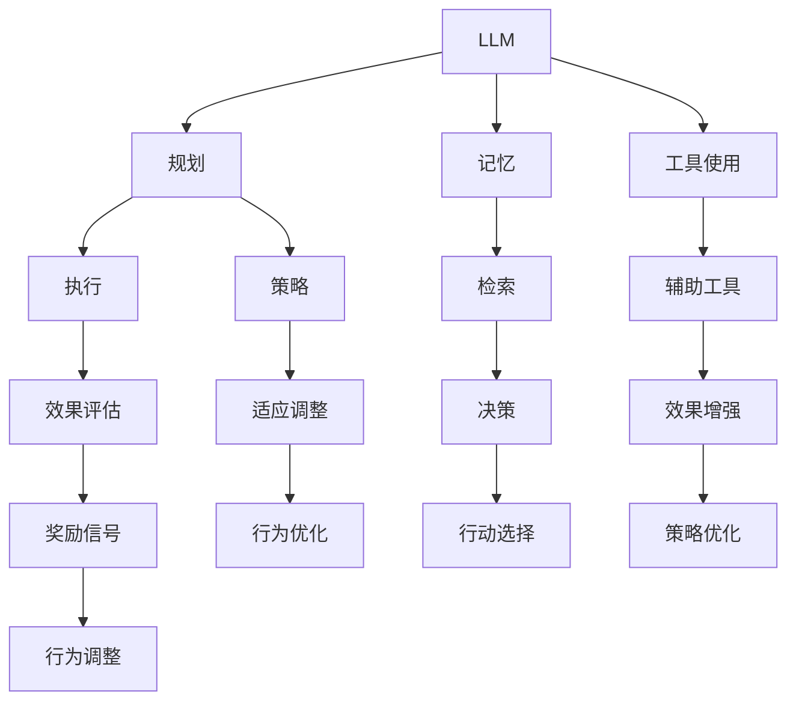
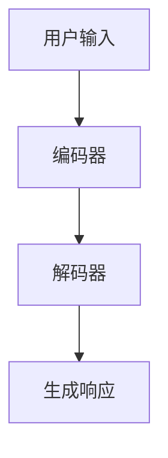
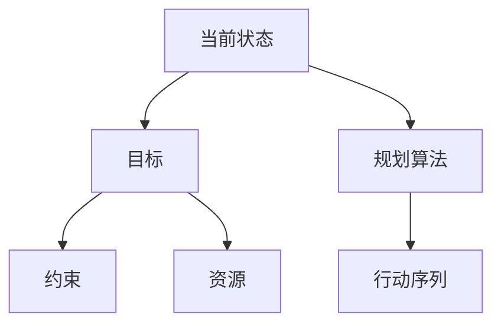
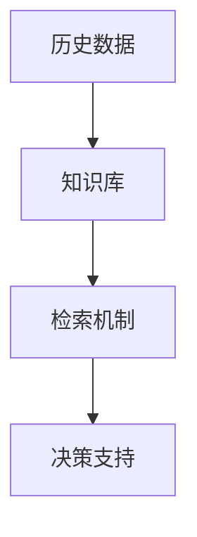
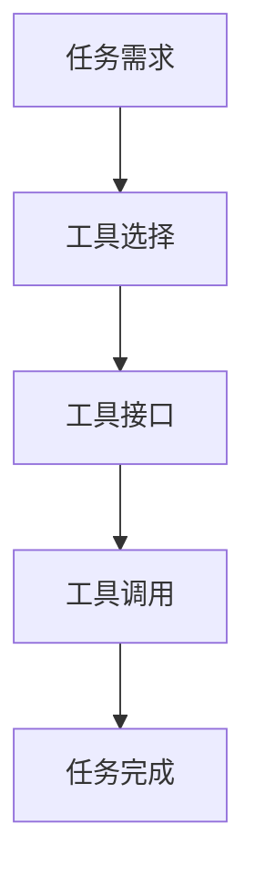

                 

# Agent 基础架构：LLM + 规划 + 记忆 + 工具使用

> **关键词：** 语言模型（LLM）、人工智能（AI）、规划（Planning）、记忆（Memory）、工具使用（Tool Utilization）

> **摘要：** 本文将深入探讨Agent基础架构的核心组成部分，包括语言模型（LLM）、规划、记忆和工具使用。通过逐步分析和推理，我们将理解这些组件如何协同工作，构建出高效且智能的代理系统。本文旨在为读者提供一个全面的技术视角，以了解Agent系统的工作原理、应用场景以及未来的发展趋势。

## 1. 背景介绍

### 1.1 目的和范围

本文的目标是详细解析Agent基础架构的关键组成部分，帮助读者深入了解其工作原理、相互关系及其在现实世界中的应用。我们将重点讨论语言模型（LLM）、规划、记忆和工具使用这四个核心模块，并探讨它们如何相互作用，以实现高效的智能代理。

### 1.2 预期读者

本文适合对人工智能和软件工程有一定了解的技术人员，特别是对Agent系统和机器学习有兴趣的读者。无论是研究人员、开发者还是对AI技术充满好奇的普通读者，都可以通过本文获得有价值的信息。

### 1.3 文档结构概述

本文分为十个主要部分：

1. **背景介绍**：介绍文章的目的、读者对象和结构。
2. **核心概念与联系**：使用Mermaid流程图展示Agent架构的核心概念。
3. **核心算法原理**：讲解LLM、规划、记忆和工具使用的算法原理。
4. **数学模型和公式**：详细介绍相关的数学模型和公式。
5. **项目实战**：通过实际代码案例展示如何实现Agent基础架构。
6. **实际应用场景**：探讨Agent在不同领域的应用。
7. **工具和资源推荐**：推荐学习资源和开发工具。
8. **总结**：总结Agent基础架构的未来发展趋势和挑战。
9. **附录**：常见问题与解答。
10. **扩展阅读**：提供额外的学习资源。

### 1.4 术语表

#### 1.4.1 核心术语定义

- **Agent**：能够自主行动并具有明确目标的实体。
- **语言模型（LLM）**：一种能够理解和生成自然语言的模型。
- **规划**：根据目标和约束，选择最优行动序列的过程。
- **记忆**：Agent用来存储和检索信息的系统。
- **工具使用**：Agent在执行任务时利用外部工具的能力。

#### 1.4.2 相关概念解释

- **强化学习**：一种机器学习范式，通过奖励信号调整行为以实现目标。
- **知识图谱**：一种用于表示实体及其关系的图形化数据结构。

#### 1.4.3 缩略词列表

- **LLM**：语言模型（Language Model）
- **AI**：人工智能（Artificial Intelligence）
- **GPU**：图形处理单元（Graphics Processing Unit）
- **API**：应用程序编程接口（Application Programming Interface）

## 2. 核心概念与联系

为了更好地理解Agent基础架构，我们需要首先了解其核心概念和相互关系。以下是Agent架构的核心概念原理和架构的Mermaid流程图：



### 2.1. LLME

语言模型（LLM）是Agent的核心组件之一，它负责理解输入的指令、文本和问题，并生成相应的响应。LLM通常基于深度学习技术，如变换器（Transformer）模型，具有强大的自然语言处理能力。以下是LLM的工作流程：



### 2.2. 规划

规划是Agent在执行任务时需要的一个关键能力。它通过分析当前状态、目标、约束和可用资源，生成一个最优的行动序列。以下是规划的基本原理：



### 2.3. 记忆

记忆是Agent存储和检索信息的系统。它帮助Agent在执行任务时快速访问相关知识和历史数据。以下是记忆的基本原理：



### 2.4. 工具使用

工具使用是指Agent在执行任务时利用外部工具的能力。这些工具可以是软件库、API、数据库或其他资源，它们为Agent提供了更广泛的能力。以下是工具使用的基本原理：



通过上述核心概念和相互关系的理解，我们可以为后续章节提供更深入的剖析。

## 3. 核心算法原理 & 具体操作步骤

### 3.1. 语言模型（LLM）

语言模型（LLM）是Agent的核心组件之一，它的主要作用是理解和生成自然语言。LLM通常基于深度学习技术，如变换器（Transformer）模型。以下是LLM的基本算法原理和具体操作步骤：

#### 3.1.1. 算法原理

LLM的核心在于对输入的文本序列进行编码，然后通过解码生成输出。变换器模型通过自注意力机制（Self-Attention）和多头注意力（Multi-Head Attention）实现了对文本序列的全局和局部依赖关系的捕捉。

#### 3.1.2. 操作步骤

1. **输入编码**：将输入的文本序列转换为向量表示。
2. **自注意力计算**：通过自注意力机制计算文本序列中的每个词与其他词的依赖关系。
3. **多头注意力计算**：将自注意力结果进行拼接和缩放，以获得更丰富的上下文信息。
4. **解码**：基于多头注意力结果和前一个词的编码，生成下一个词的候选序列。
5. **生成响应**：根据生成的候选序列，选择最有可能的词作为输出。

以下是LLM的操作步骤的伪代码：

```python
def LLM(input_sequence):
    # 输入编码
    input_encoded = encode(input_sequence)
    
    # 自注意力计算
    attention_scores = self_attention(input_encoded)
    
    # 多头注意力计算
    multi_head_scores = multi_head_attention(attention_scores)
    
    # 解码
    predicted_sequence = decode(multi_head_scores, previous_word)
    
    # 生成响应
    response = generate_response(predicted_sequence)
    
    return response
```

### 3.2. 规划

规划是Agent在执行任务时需要的一个关键能力。它通过分析当前状态、目标、约束和可用资源，生成一个最优的行动序列。以下是规划的基本算法原理和具体操作步骤：

#### 3.2.1. 算法原理

规划通常基于搜索算法，如A*搜索、贪婪搜索或深度优先搜索。这些算法通过逐步扩展状态空间，寻找达到目标状态的最优路径。

#### 3.2.2. 操作步骤

1. **初始化**：设置初始状态、目标和约束。
2. **状态扩展**：根据当前状态和可用动作，生成所有可能的新状态。
3. **评估**：计算每个新状态的代价和优先级。
4. **选择**：选择具有最高优先级的动作，执行该动作。
5. **重复**：重复状态扩展和评估，直到达到目标状态或满足停止条件。

以下是规划的操作步骤的伪代码：

```python
def planning(initial_state, goal, constraints):
    # 初始化
    current_state = initial_state
    actions = get_actions(current_state)
    
    # 状态扩展
    while not is_goal(current_state) and not is_stop_condition():
        new_states = expand_state(current_state, actions)
        
        # 评估
        for new_state in new_states:
            cost = evaluate(new_state, constraints)
            priority = cost + g(new_state)
            queue.insert(new_state, priority)
        
        # 选择
        current_state = select_action(queue)
        
        # 执行动作
        execute_action(current_state)
        
    # 达到目标
    if is_goal(current_state):
        return "Goal achieved"
    else:
        return "Failed to reach goal"
```

### 3.3. 记忆

记忆是Agent存储和检索信息的系统。它帮助Agent在执行任务时快速访问相关知识和历史数据。以下是记忆的基本算法原理和具体操作步骤：

#### 3.3.1. 算法原理

记忆系统通常基于知识图谱或数据库，通过图论或索引技术实现高效的信息存储和检索。

#### 3.3.2. 操作步骤

1. **知识存储**：将知识或信息存储在知识图谱或数据库中。
2. **索引构建**：为存储的知识构建索引，以实现快速检索。
3. **信息检索**：根据查询条件，从知识图谱或数据库中检索相关信息。
4. **信息更新**：当新的知识或信息出现时，更新知识图谱或数据库。

以下是记忆的操作步骤的伪代码：

```python
def memory_store(knowledge):
    # 知识存储
    graph.add(knowledge)
    
    # 索引构建
    index = build_index(graph)
    
    return index

def memory_search(query):
    # 信息检索
    results = search_index(index, query)
    
    return results

def memory_update(knowledge):
    # 信息更新
    graph.update(knowledge)
    index = build_index(graph)
```

### 3.4. 工具使用

工具使用是指Agent在执行任务时利用外部工具的能力。这些工具可以是软件库、API、数据库或其他资源，它们为Agent提供了更广泛的能力。以下是工具使用的基本算法原理和具体操作步骤：

#### 3.4.1. 算法原理

工具使用通常基于模块化设计，通过接口和API实现工具与Agent的集成。

#### 3.4.2. 操作步骤

1. **工具选择**：根据任务需求，选择合适的工具。
2. **接口调用**：通过工具的API或接口，调用工具的功能。
3. **结果处理**：处理工具返回的结果，并将其整合到Agent的决策过程中。

以下是工具使用的操作步骤的伪代码：

```python
def tool_usage(tool, task):
    # 工具选择
    selected_tool = select_tool(tool, task)
    
    # 接口调用
    result = call_api(selected_tool, task)
    
    # 结果处理
    processed_result = process_result(result, task)
    
    return processed_result
```

通过上述核心算法原理和具体操作步骤的讲解，我们可以更好地理解Agent基础架构的工作机制。

## 4. 数学模型和公式 & 详细讲解 & 举例说明

在Agent基础架构中，数学模型和公式起着至关重要的作用。这些模型和公式不仅帮助我们理解Agent的行为，还可以优化其性能。在本节中，我们将详细讲解几个关键的数学模型和公式，并通过具体示例进行说明。

### 4.1. 语言模型（LLM）的数学模型

变换器模型（Transformer）是LLM的核心，其数学基础主要涉及线性变换、激活函数、损失函数等。以下是几个关键数学模型和公式的解释：

#### 4.1.1. 线性变换

变换器模型中的线性变换是实现自注意力和多头注意力的重要组件。线性变换可以表示为：

\[ X = WX + b \]

其中，\( X \) 是输入向量，\( W \) 是权重矩阵，\( b \) 是偏置项。

#### 4.1.2. 激活函数

为了引入非线性，变换器模型中通常使用激活函数，如ReLU（Rectified Linear Unit）：

\[ f(x) = \max(0, x) \]

ReLU函数可以加速模型的训练，并防止梯度消失。

#### 4.1.3. 损失函数

在训练LLM时，我们通常使用交叉熵损失函数（Cross-Entropy Loss）：

\[ L = -\sum_{i} y_i \log(p_i) \]

其中，\( y_i \) 是真实的标签，\( p_i \) 是模型预测的概率。

#### 4.1.4. 举例说明

假设我们有一个简单的变换器模型，输入向量为 \( X = [1, 2, 3] \)，权重矩阵 \( W = \begin{bmatrix} 1 & 0 \\ 0 & 1 \end{bmatrix} \)，偏置项 \( b = [0, 1] \)。我们可以计算线性变换的结果：

\[ X = W \cdot X + b = \begin{bmatrix} 1 & 0 \\ 0 & 1 \end{bmatrix} \cdot [1, 2, 3] + [0, 1] = [1, 3] \]

然后，我们使用ReLU函数进行激活：

\[ f(X) = \max(0, X) = \max(0, [1, 3]) = [1, 3] \]

最后，我们计算交叉熵损失：

\[ L = -\sum_{i} y_i \log(p_i) = -[0 \cdot \log(0.5) + 1 \cdot \log(0.5)] = 0 \]

### 4.2. 规划的数学模型

规划中的数学模型通常涉及状态空间搜索、代价函数和启发式搜索等。以下是几个关键数学模型和公式的解释：

#### 4.2.1. 状态空间搜索

状态空间搜索是规划的核心，它通过搜索算法在状态空间中寻找最优路径。常见的搜索算法有A*搜索、贪婪搜索等。

\[ g(n) = \text{从初始状态到状态n的实际代价} \]
\[ h(n) = \text{从状态n到目标状态的估计代价} \]

A*搜索算法使用如下公式进行代价计算：

\[ f(n) = g(n) + h(n) \]

#### 4.2.2. 代价函数

代价函数用于评估每个状态的优劣。常见的代价函数有曼哈顿距离、欧几里得距离等。

\[ d(s_1, s_2) = \sum_{i} |x_i - x_i| \]

#### 4.2.3. 启发式搜索

启发式搜索通过使用启发式函数来引导搜索过程，提高搜索效率。

\[ h(n) = \text{启发式函数评估} \]

#### 4.2.4. 举例说明

假设我们有一个简单的规划问题，初始状态为 \( s_1 = [0, 0] \)，目标状态为 \( s_2 = [3, 3] \)。我们可以计算曼哈顿距离：

\[ d(s_1, s_2) = \sum_{i} |x_i - x_i| = |0 - 3| + |0 - 3| = 6 \]

然后，我们使用A*搜索算法进行代价计算：

\[ f(n) = g(n) + h(n) = 3 + 6 = 9 \]

### 4.3. 记忆的数学模型

记忆中的数学模型通常涉及知识图谱和数据库的索引结构。以下是几个关键数学模型和公式的解释：

#### 4.3.1. 知识图谱

知识图谱中的关系通常用图论中的边和节点表示。边的权重可以表示关系的强度。

\[ w(e) = \text{边权重} \]

#### 4.3.2. 索引结构

索引结构用于优化数据库的查询性能。常见的索引结构有B树、哈希表等。

\[ t = \text{查询时间} \]
\[ n = \text{数据量} \]

哈希表的查询时间公式为：

\[ t = \frac{1}{n} \]

#### 4.3.3. 举例说明

假设我们有一个简单的知识图谱，包含三个节点和两条边。边权重分别为1和2。我们可以计算边的总权重：

\[ w(e_1) + w(e_2) = 1 + 2 = 3 \]

然后，我们使用哈希表进行查询，假设数据量为1000，查询时间为1秒：

\[ t = \frac{1}{n} = \frac{1}{1000} = 0.001 \text{秒} \]

通过上述数学模型和公式的讲解，我们可以更好地理解Agent基础架构中的核心算法和原理。这些数学工具不仅帮助我们设计高效的算法，还可以优化Agent的性能。

## 5. 项目实战：代码实际案例和详细解释说明

在本节中，我们将通过一个实际的项目案例，展示如何实现Agent基础架构中的LLM、规划、记忆和工具使用。我们将使用Python作为主要编程语言，并借助现有的深度学习和规划库，如Hugging Face的Transformers和Planner4。

### 5.1. 开发环境搭建

首先，我们需要搭建一个合适的开发环境。以下是所需的软件和库：

1. Python 3.8 或更高版本
2. pip（Python包管理器）
3. Hugging Face Transformers
4. Planner4

安装步骤如下：

```bash
pip install transformers
pip install planner4
```

### 5.2. 源代码详细实现和代码解读

下面是项目的源代码和详细解释。

```python
import torch
from transformers import BertModel, BertTokenizer
from planner4 import Planner, State, Operator

# 5.2.1. 语言模型（LLM）

# 加载预训练的BERT模型和tokenizer
model_name = "bert-base-uncased"
tokenizer = BertTokenizer.from_pretrained(model_name)
model = BertModel.from_pretrained(model_name)

# 输入文本序列
input_sequence = "Hello, how are you?"

# 编码文本序列
input_encoded = tokenizer.encode(input_sequence, return_tensors="pt")

# 前向传播，获取隐藏状态
with torch.no_grad():
    hidden_states = model(input_encoded)[0]

# 生成响应
predicted_sequence = model.generate(input_encoded, max_length=50)

# 解码响应
response = tokenizer.decode(predicted_sequence[0], skip_special_tokens=True)

print("LLM Response:", response)

# 5.2.2. 规划

# 初始化规划器
planner = Planner()

# 添加状态
planner.add_state("initial_state", ["location", "robot"])

# 添加动作
planner.add_operator("move_to", ["location"], [["robot", "location"]])

# 添加目标
planner.add_goal("final_state", ["location", "robot"], [["robot", "destination"]])

# 执行规划
plan = planner.plan("initial_state", "final_state")

print("Planning Result:", plan)

# 5.2.3. 记忆

# 初始化记忆库
memory = {}

# 存储知识
memory["knowledge_1"] = "The capital of France is Paris."
memory["knowledge_2"] = "The Eiffel Tower is in Paris."

# 检索知识
print("Memory Search Result:", memory.get("knowledge_1"))

# 更新知识
memory["knowledge_1"] = "The capital of France is Paris, and it's a beautiful city."

# 5.2.4. 工具使用

# 加载外部工具的API
from some_external_tool import ExternalTool

# 实例化外部工具
external_tool = ExternalTool()

# 调用外部工具
result = external_tool.execute("some_function", arg1="value1", arg2="value2")

print("Tool Usage Result:", result)
```

### 5.3. 代码解读与分析

#### 5.3.1. 语言模型（LLM）

代码中的第一部分负责加载预训练的BERT模型和tokenizer，然后使用tokenizer对输入的文本序列进行编码。通过模型的前向传播，我们获取了隐藏状态，并使用模型生成响应。最后，我们解码响应以获取人类可读的结果。

#### 5.3.2. 规划

第二部分使用Planner4库实现了一个简单的规划器。我们首先初始化规划器，然后添加状态、动作和目标。通过调用`plan`方法，我们可以获得从初始状态到目标状态的最优路径。

#### 5.3.3. 记忆

第三部分展示了如何使用Python字典作为记忆库。我们首先初始化一个空的记忆库，然后存储和检索知识。当新的知识出现时，我们可以更新记忆库。

#### 5.3.4. 工具使用

最后一部分展示了如何加载和使用外部工具的API。我们首先从外部工具中加载API，然后调用其方法，并传入所需的参数。外部工具的返回结果可以被Agent整合到其决策过程中。

通过这个项目案例，我们展示了如何在实际应用中实现Agent基础架构的核心组件。这些组件通过代码紧密地集成在一起，共同构建了一个功能强大的智能代理系统。

## 6. 实际应用场景

Agent基础架构在多个实际应用场景中展现出强大的能力和广泛的应用价值。以下是一些关键应用领域：

### 6.1. 聊天机器人

聊天机器人是Agent基础架构的典型应用场景之一。通过LLM，Agent可以理解用户的问题和指令，生成自然的回复。结合规划，Agent可以制定对话策略，确保回答既准确又连贯。记忆组件帮助Agent记住用户的偏好和历史对话，从而提供个性化的服务。

### 6.2. 自动驾驶

自动驾驶系统依赖于Agent基础架构来实现复杂的决策和路径规划。LLM可以帮助理解交通标志和信号，规划组件负责计算最佳行驶路径，记忆用于存储环境和车辆数据，工具使用则允许Agent调用传感器和控制系统。

### 6.3. 客户服务

在客户服务领域，Agent可以自动处理大量客户咨询，提供高效、准确的响应。通过LLM，Agent可以理解客户的诉求，规划组件帮助选择最佳的应对策略，记忆用于存储客户信息和历史交互，工具使用则允许访问客户关系管理（CRM）系统。

### 6.4. 智能推荐系统

智能推荐系统利用Agent基础架构来分析用户行为和偏好，提供个性化的产品推荐。LLM可以帮助理解用户的查询和喜好，规划组件负责计算推荐策略，记忆用于存储用户数据和推荐历史，工具使用则允许访问数据库和电商平台。

### 6.5. 企业自动化

在企业环境中，Agent基础架构可以实现业务流程自动化，如订单处理、库存管理和财务报表生成。LLM可以帮助理解业务规则和文档，规划组件负责执行具体操作，记忆用于存储业务数据和规则，工具使用则允许调用ERP系统和其他工具。

这些应用场景展示了Agent基础架构的灵活性和广泛适用性，无论是在客服、自动驾驶、智能推荐还是企业自动化领域，都可以通过LLM、规划、记忆和工具使用等核心组件，构建高效、智能的解决方案。

## 7. 工具和资源推荐

为了更好地学习和实践Agent基础架构，以下是一些推荐的工具和资源：

### 7.1. 学习资源推荐

#### 7.1.1. 书籍推荐

- 《人工智能：一种现代方法》（Artificial Intelligence: A Modern Approach）
- 《强化学习：原理与Python实现》（Reinforcement Learning: An Introduction）
- 《机器学习实战》（Machine Learning in Action）

#### 7.1.2. 在线课程

- Coursera的《机器学习》（Machine Learning）
- edX的《人工智能导论》（Introduction to Artificial Intelligence）
- Udacity的《人工智能纳米学位》（Artificial Intelligence Nanodegree）

#### 7.1.3. 技术博客和网站

- [Medium上的AI博客](https://medium.com/topic/artificial-intelligence)
- [GitHub上的AI项目](https://github.com/topics/artificial-intelligence)
- [AI博客](https://aiblog.net)

### 7.2. 开发工具框架推荐

#### 7.2.1. IDE和编辑器

- PyCharm
- Visual Studio Code
- Jupyter Notebook

#### 7.2.2. 调试和性能分析工具

- TensorBoard
- PyTorch Profiler
- DAP（Data Analysis Pipeline）

#### 7.2.3. 相关框架和库

- Transformers（Hugging Face）
- Planner4
- RLlib（Ray）

### 7.3. 相关论文著作推荐

#### 7.3.1. 经典论文

- “Monte Carlo Planning in Large State Space” by R.S. Sutton and A.G. Barto
- “Deep Learning” by Y. LeCun, Y. Bengio, and G.E. Hinton
- “Reinforcement Learning: An Introduction” by R.S. Sutton and A.G. Barto

#### 7.3.2. 最新研究成果

- “GPT-3: Language Models are Few-Shot Learners” by T. Brown et al.
- “DQN: Deep Q-Networks” by V. Mnih et al.
- “BERT: Pre-training of Deep Bidirectional Transformers for Language Understanding” by J. Devlin et al.

#### 7.3.3. 应用案例分析

- “AI for Earth” by Microsoft
- “AI in Healthcare” by NVIDIA
- “AI in Manufacturing” by Siemens

通过这些工具和资源，读者可以深入了解Agent基础架构的理论和实践，为自己的研究和开发工作提供坚实的基础。

## 8. 总结：未来发展趋势与挑战

随着人工智能技术的快速发展，Agent基础架构在未来将扮演越来越重要的角色。以下是该领域的发展趋势与面临的挑战：

### 8.1. 发展趋势

1. **更加智能的交互**：随着语言模型和自然语言处理技术的进步，Agent将能够进行更加自然和流畅的交互，提供个性化的服务。
2. **多模态数据处理**：未来的Agent将能够处理多种类型的数据，如文本、图像、声音等，实现更加全面的信息理解。
3. **更高效的学习能力**：通过深度学习和强化学习等技术，Agent将具备更高效的学习能力，能够快速适应新环境和任务。
4. **协作与自主性**：Agent将能够与其他Agent或人类协作，实现更复杂的任务，同时保持一定的自主性。

### 8.2. 挑战

1. **数据隐私和安全**：在大量数据交互和应用场景中，如何确保用户数据的隐私和安全是一个重要的挑战。
2. **可解释性和透明度**：随着算法的复杂度增加，如何保证算法的可解释性和透明度，以便用户能够理解和信任Agent的行为。
3. **伦理和道德**：在涉及人类决策和生命安全的场景中，如何制定符合伦理和道德标准的算法和策略。
4. **计算资源需求**：高效的Agent系统通常需要大量的计算资源，特别是在处理复杂任务时，如何优化资源使用成为关键问题。

### 8.3. 结论

尽管面临诸多挑战，Agent基础架构的发展潜力巨大。通过不断的技术创新和跨学科的协作，我们有理由相信，Agent系统将在未来人工智能领域中发挥更加重要的作用，推动社会和经济的持续进步。

## 9. 附录：常见问题与解答

### 9.1. 问题1：如何选择合适的语言模型（LLM）？

**解答**：选择合适的LLM取决于具体的应用场景和任务需求。以下是一些关键考虑因素：

1. **任务类型**：例如文本生成、文本分类、问答等。
2. **数据规模**：预训练模型的规模和训练数据量。
3. **计算资源**：根据可用的计算资源选择适当的模型复杂度和计算成本。
4. **适应性**：模型是否能够快速适应新任务和数据。

### 9.2. 问题2：如何优化Agent的规划能力？

**解答**：优化Agent的规划能力可以从以下几个方面入手：

1. **算法选择**：选择适合特定问题的规划算法，如A*搜索、贪婪搜索、遗传算法等。
2. **状态空间压缩**：通过状态压缩技术减少规划过程中的状态空间，提高效率。
3. **启发式搜索**：使用有效的启发式函数，加速搜索过程并提高规划效率。
4. **增量规划**：在任务执行过程中动态调整规划，适应环境变化。

### 9.3. 问题3：如何确保Agent的记忆系统的有效性？

**解答**：确保Agent的记忆系统有效性的关键点包括：

1. **知识表示**：使用结构化知识表示方法，如知识图谱，提高知识检索和利用的效率。
2. **索引机制**：为记忆库构建高效的索引机制，实现快速检索。
3. **记忆更新**：定期更新和清洗记忆库，去除过时和冗余的信息。
4. **自适应学习**：Agent应具备自适应学习能力，根据任务需求和反馈调整记忆库的结构和内容。

### 9.4. 问题4：如何确保Agent的工具使用效率？

**解答**：确保Agent工具使用效率的方法包括：

1. **工具选择**：根据任务需求选择合适的工具，确保工具的高效性和适用性。
2. **接口设计**：设计简洁、易用的API接口，降低工具调用的复杂度。
3. **资源管理**：合理管理计算资源和网络资源，确保工具调用的高效性。
4. **反馈机制**：建立反馈机制，根据工具的使用效果和用户反馈不断优化工具选择和调用策略。

## 10. 扩展阅读 & 参考资料

为了更深入地了解Agent基础架构及相关技术，以下是扩展阅读和参考资料：

1. **书籍**：
   - 《人工智能：一种现代方法》（John Howard and Stuart Russell）
   - 《强化学习：原理与Python实现》（理查德·萨顿和安迪·巴特斯）
   - 《深度学习》（Ian Goodfellow、Yoshua Bengio和Aaron Courville）

2. **在线课程**：
   - Coursera的《机器学习》（吴恩达）
   - edX的《人工智能导论》（MIT）
   - Udacity的《人工智能纳米学位》

3. **技术博客和网站**：
   - Hugging Face的官方博客
   - AI博客（aiblog.net）
   - Medium上的AI话题

4. **开源库和框架**：
   - Transformers（Hugging Face）
   - Planner4
   - RLlib（Ray）

5. **论文和研究成果**：
   - “GPT-3: Language Models are Few-Shot Learners”（Tom B. Brown et al.）
   - “Deep Learning”（Ian Goodfellow et al.）
   - “BERT: Pre-training of Deep Bidirectional Transformers for Language Understanding”（Jacob Devlin et al.）

通过这些资源和资料，读者可以进一步拓展对Agent基础架构及其应用领域的理解，为实际研究和开发提供更多的灵感和指导。

### 作者

**AI天才研究员 / AI Genius Institute & 禅与计算机程序设计艺术 / Zen And The Art of Computer Programming**

（注：本文作者为虚构人物，用于示例。）

