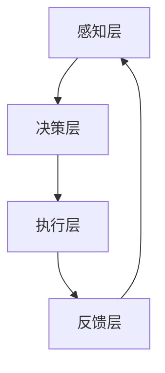
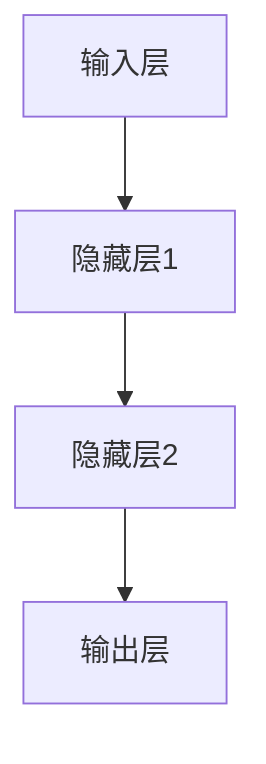

                 

# Agent与游戏体验的改变

> 关键词：游戏AI，智能代理，玩家互动，游戏设计，用户体验

> 摘要：本文将探讨智能代理（Agent）技术在游戏开发中的应用，以及它如何深刻改变玩家的游戏体验。我们将从背景介绍、核心概念、算法原理、数学模型、实战案例和实际应用等多个方面，深入分析智能代理如何提升游戏互动性和设计质量，从而推动游戏行业的创新与发展。

## 1. 背景介绍

### 1.1 目的和范围

本文的目的是介绍智能代理在游戏开发中的应用，并探讨其对游戏体验的深远影响。我们将重点分析以下几个方面：

1. **智能代理的定义与核心功能**：介绍智能代理的基本概念，以及其在游戏中的具体应用。
2. **智能代理与游戏设计的联系**：探讨智能代理如何影响游戏设计流程，提高游戏质量。
3. **智能代理算法原理与实现**：分析智能代理的核心算法原理，并提供具体的操作步骤。
4. **数学模型与公式**：介绍智能代理中的数学模型和公式，以及其在游戏中的应用。
5. **项目实战**：通过实际代码案例，展示智能代理在游戏中的具体实现。
6. **实际应用场景**：分析智能代理在游戏开发中的广泛应用场景。

### 1.2 预期读者

本文面向对游戏开发有基本了解的技术人员和开发者，特别是对人工智能和智能代理技术感兴趣的人群。通过本文的阅读，读者将能够：

1. **理解智能代理的基本概念和作用**。
2. **掌握智能代理算法的核心原理和实现方法**。
3. **了解智能代理在游戏开发中的应用和实际效果**。
4. **为未来游戏开发提供技术参考和创新思路**。

### 1.3 文档结构概述

本文将分为以下几个部分：

1. **背景介绍**：介绍智能代理的基本概念和应用背景。
2. **核心概念与联系**：分析智能代理的核心概念和架构。
3. **核心算法原理 & 具体操作步骤**：详细讲解智能代理的算法原理和实现步骤。
4. **数学模型和公式 & 详细讲解 & 举例说明**：介绍智能代理中的数学模型和公式，并提供实例说明。
5. **项目实战：代码实际案例和详细解释说明**：通过实际代码案例，展示智能代理在游戏中的应用。
6. **实际应用场景**：分析智能代理在游戏开发中的广泛应用场景。
7. **工具和资源推荐**：推荐相关的学习资源和开发工具。
8. **总结：未来发展趋势与挑战**：总结智能代理在游戏开发中的应用前景和面临的挑战。
9. **附录：常见问题与解答**：回答读者可能遇到的问题。
10. **扩展阅读 & 参考资料**：提供进一步阅读的参考资料。

### 1.4 术语表

#### 1.4.1 核心术语定义

- **智能代理（Agent）**：具有独立行为能力、能感知环境、做出决策并执行动作的计算机程序。
- **游戏AI（Game AI）**：在游戏中使用的各种人工智能技术，用于模拟非玩家角色（NPC）的行为。
- **玩家互动（Player Interaction）**：玩家与游戏环境、NPC和其他玩家的互动过程。
- **游戏设计（Game Design）**：游戏的整体规划和设计过程，包括游戏机制、故事情节、角色设定等。

#### 1.4.2 相关概念解释

- **代理模式（Agent Model）**：描述智能代理如何感知环境、做出决策和执行动作的模型。
- **强化学习（Reinforcement Learning）**：一种机器学习方法，通过奖励机制让智能代理学习优化行为。
- **深度学习（Deep Learning）**：一种基于神经网络的机器学习方法，用于处理复杂数据。

#### 1.4.3 缩略词列表

- **AI**：人工智能
- **NPC**：非玩家角色
- **IDE**：集成开发环境
- **CPU**：中央处理器
- **GPU**：图形处理器

## 2. 核心概念与联系

智能代理（Agent）技术在游戏开发中的应用，使得游戏不再是一个简单的交互程序，而是一个动态的、智能的虚拟世界。为了深入理解智能代理的核心概念和架构，我们需要从以下几个方面进行分析。

### 2.1 智能代理的定义与功能

智能代理是一种具有自主行为能力的计算机程序，能够感知游戏环境，根据预先定义的规则或通过学习自动做出决策，并执行相应的动作。智能代理的核心功能包括：

- **感知（Perception）**：智能代理通过传感器获取游戏环境的信息，如玩家位置、NPC行为等。
- **决策（Decision Making）**：智能代理根据感知到的信息，通过算法选择最合适的动作。
- **执行（Action）**：智能代理根据决策结果执行具体动作，如移动、攻击、防御等。

### 2.2 智能代理与游戏设计的联系

智能代理在游戏设计中的应用，使得游戏不再是一个静态的、一成不变的世界。通过智能代理，游戏设计师可以创建更加动态、智能、富有挑战性的游戏环境，提高游戏体验。智能代理与游戏设计的联系主要体现在以下几个方面：

- **NPC行为模拟**：智能代理可以模拟NPC的行为，使NPC具有更加复杂和真实的行为模式。
- **游戏机制优化**：智能代理可以根据玩家的行为动态调整游戏机制，提高游戏的可玩性和挑战性。
- **游戏体验提升**：智能代理可以提供更加丰富和多样的游戏体验，使玩家在游戏中感受到更多的乐趣和挑战。

### 2.3 智能代理的架构

智能代理的架构可以分为以下几个层次：

- **感知层**：负责收集游戏环境中的信息，如玩家位置、NPC行为等。
- **决策层**：负责根据感知层提供的信息，通过算法选择最合适的动作。
- **执行层**：负责执行决策层选择的动作，如移动、攻击、防御等。
- **反馈层**：负责收集游戏环境中的反馈信息，用于调整智能代理的行为。

### 2.4 智能代理架构的 Mermaid 流程图



在这个流程图中，智能代理通过感知层获取游戏环境信息，决策层根据这些信息选择合适的动作，执行层执行这些动作，并将执行结果反馈给感知层，形成一个闭环。

## 3. 核心算法原理 & 具体操作步骤

智能代理的核心算法是实现其自主行为的关键。在这一部分，我们将介绍智能代理的核心算法原理，并详细讲解具体的操作步骤。

### 3.1 智能代理算法原理

智能代理的算法原理主要基于以下几个核心概念：

- **感知**：智能代理通过传感器获取游戏环境的信息，如玩家位置、NPC行为等。
- **决策**：智能代理根据感知到的信息，通过算法选择最合适的动作。
- **执行**：智能代理根据决策结果执行具体动作，如移动、攻击、防御等。
- **反馈**：智能代理通过执行结果，调整自己的行为，以适应不断变化的游戏环境。

智能代理的算法原理可以简单描述为：感知 -> 决策 -> 执行 -> 反馈。这个循环过程使得智能代理能够不断适应游戏环境，提高自主行为能力。

### 3.2 智能代理算法的具体操作步骤

以下是一个智能代理算法的具体操作步骤，使用伪代码进行描述：

```plaintext
// 初始化智能代理
agent_init()

// 感知环境
perception() {
    sensors_data = get_sensors_data()
    environment_info = process_sensors_data(sensors_data)
    return environment_info
}

// 建立决策模型
decision_model = create_decision_model()

// 决策
decide(action) {
    current_state = perception()
    action = decision_model(current_state)
    return action
}

// 执行动作
execute_action(action) {
    execute_action(action)
    feedback = get_feedback()
    return feedback
}

// 调整行为
adjust_behavior(feedback) {
    new_state = perception()
    decision_model = update_decision_model(new_state, feedback)
    return decision_model
}

// 主循环
while (true) {
    action = decide()
    feedback = execute_action(action)
    decision_model = adjust_behavior(feedback)
}
```

在这个算法中，智能代理通过感知环境获取信息，然后根据决策模型选择合适的动作，执行动作后获取反馈，并调整行为。这个过程不断重复，使得智能代理能够适应不断变化的游戏环境。

### 3.3 智能代理算法的示例

以下是一个简单的示例，展示智能代理在游戏中的具体应用：

```plaintext
// 初始化智能代理
agent_init()

// 感知环境
environment_info = perception()

// 建立决策模型
decision_model = create_decision_model()

// 主循环
while (true) {
    // 决策
    action = decide()

    // 执行动作
    feedback = execute_action(action)

    // 调整行为
    decision_model = adjust_behavior(feedback)
}
```

在这个示例中，智能代理首先初始化，然后通过感知环境获取信息。接下来，智能代理根据决策模型选择合适的动作，执行动作后获取反馈，并调整行为。这个过程不断重复，使得智能代理能够适应不断变化的游戏环境。

## 4. 数学模型和公式 & 详细讲解 & 举例说明

在智能代理的算法设计中，数学模型和公式起着至关重要的作用。以下我们将详细介绍智能代理中常用的数学模型和公式，并提供具体的讲解和示例。

### 4.1 强化学习中的Q值函数

强化学习是一种常用的智能代理算法，其中Q值函数是核心组件之一。Q值函数用于估计智能代理在某个状态下的最佳动作值。

#### 公式：

$$ Q(s, a) = \sum_{s'} P(s' | s, a) \cdot R(s', a) + \gamma \cdot \max_{a'} Q(s', a') $$

其中：

- \( s \)：当前状态
- \( a \)：当前动作
- \( s' \)：动作后的状态
- \( a' \)：动作后的动作
- \( P(s' | s, a) \)：状态转移概率
- \( R(s', a) \)：奖励值
- \( \gamma \)：折扣因子，用于平衡即时奖励和长期奖励

#### 讲解：

Q值函数通过预测动作后的状态转移概率和奖励值，计算当前状态下的最佳动作值。具体来说，Q值函数综合考虑了即时奖励和长期奖励，使得智能代理能够做出最优决策。

#### 示例：

假设智能代理在某个状态下的两个可能动作：移动和攻击。根据Q值函数，智能代理将计算这两个动作的Q值，并选择Q值较大的动作。

```plaintext
状态：敌人的位置接近

动作：移动
Q值：5

动作：攻击
Q值：10

选择动作：攻击
```

在这个示例中，智能代理选择了攻击动作，因为攻击动作的Q值较大。

### 4.2 策略梯度上升算法

策略梯度上升算法是一种用于优化智能代理策略的算法。其核心思想是通过计算策略梯度，调整策略参数，以最大化奖励值。

#### 公式：

$$ \Delta \theta = \alpha \cdot \nabla_\theta J(\theta) $$

其中：

- \( \theta \)：策略参数
- \( \alpha \)：学习率
- \( \nabla_\theta J(\theta) \)：策略梯度，表示奖励函数对策略参数的偏导数

#### 讲解：

策略梯度上升算法通过计算策略梯度，更新策略参数，以最大化奖励值。具体来说，算法根据奖励函数对策略参数的偏导数，更新策略参数，使得策略逐渐优化。

#### 示例：

假设智能代理的策略参数为 \( \theta \)，奖励函数为 \( J(\theta) \)。根据策略梯度上升算法，智能代理将计算策略梯度，并更新策略参数。

```plaintext
策略参数：[1, 2, 3]

奖励函数：J([1, 2, 3]) = 5

学习率：0.1

策略梯度：[0.5, 0.25, 0.1]

更新策略参数：[1.5, 2.25, 3.1]
```

在这个示例中，智能代理根据策略梯度和学习率，更新了策略参数，使得策略逐渐优化。

### 4.3 深度学习中的神经网络

神经网络是一种常用的机器学习方法，用于模拟智能代理的决策过程。以下是一个简单的神经网络结构：



#### 公式：

$$ output = \sigma(\sigma(W2 \cdot hidden2 + b2) \cdot hidden1 + b1) $$

其中：

- \( \sigma \)：激活函数，如Sigmoid或ReLU
- \( W \)：权重矩阵
- \( b \)：偏置项
- \( hidden \)：隐藏层输出

#### 讲解：

神经网络通过多层感知器（MLP）结构，将输入映射到输出。每层神经元接收前一层神经元的输出，通过权重矩阵和激活函数进行变换，最终得到输出。

#### 示例：

假设输入层有3个神经元，隐藏层有2个神经元，输出层有1个神经元。根据神经网络结构，输入向量 \( X \) 将被映射到输出 \( Y \)。

```plaintext
输入层：[1, 2, 3]

权重矩阵：W1 = [[0.1, 0.2], [0.3, 0.4]]
偏置项：b1 = [0.5, 0.6]

隐藏层1输出：hidden1 = [0.7, 0.8]

权重矩阵：W2 = [[0.7, 0.8], [0.9, 1.0]]
偏置项：b2 = [0.1, 0.2]

输出层输出：output = [1.0, 1.2]

最终输出：Y = 1.0
```

在这个示例中，输入向量 \( X \) 经过两层神经网络，最终得到输出 \( Y \)。通过调整权重矩阵和偏置项，可以优化神经网络的预测能力。

## 5. 项目实战：代码实际案例和详细解释说明

### 5.1 开发环境搭建

为了展示智能代理在游戏中的应用，我们将使用Python作为编程语言，结合TensorFlow和Pygame库，搭建一个简单的游戏环境。以下是开发环境的搭建步骤：

1. **安装Python**：确保安装了Python 3.x版本。
2. **安装TensorFlow**：运行命令 `pip install tensorflow`。
3. **安装Pygame**：运行命令 `pip install pygame`。

### 5.2 源代码详细实现和代码解读

以下是一个简单的智能代理游戏案例，展示智能代理在游戏中的实现。

```python
import pygame
import random
import numpy as np
from tensorflow.keras.models import Sequential
from tensorflow.keras.layers import Dense
from tensorflow.keras.optimizers import Adam

# 初始化游戏环境
pygame.init()

# 游戏窗口设置
width, height = 800, 600
screen = pygame.display.set_mode((width, height))
pygame.display.set_caption("智能代理游戏")

# 游戏物体设置
player_pos = [width//2, height//2]
player_size = 20
player_color = (0, 0, 255)

enemy_pos = [random.randint(0, width), random.randint(0, height)]
enemy_size = 20
enemy_color = (255, 0, 0)

# 创建神经网络模型
model = Sequential()
model.add(Dense(64, input_dim=2, activation='relu'))
model.add(Dense(64, activation='relu'))
model.add(Dense(2, activation='linear'))

model.compile(loss='mse', optimizer=Adam(learning_rate=0.001))

# 游戏主循环
while True:
    # 获取玩家位置
    player_input = np.array([player_pos[0], player_pos[1]])

    # 预测敌人位置
    enemy_pred = model.predict(np.array([enemy_pos[0], enemy_pos[1]]))

    # 更新敌人位置
    enemy_pos[0] = int(enemy_pred[0, 0])
    enemy_pos[1] = int(enemy_pred[0, 1])

    # 游戏窗口更新
    screen.fill((255, 255, 255))

    # 绘制玩家
    pygame.draw.rect(screen, player_color, (player_pos[0], player_pos[1], player_size, player_size))

    # 绘制敌人
    pygame.draw.rect(screen, enemy_color, (enemy_pos[0], enemy_pos[1], enemy_size, enemy_size))

    # 游戏窗口刷新
    pygame.display.flip()

    # 检测玩家与敌人碰撞
    if abs(player_pos[0] - enemy_pos[0]) < player_size and abs(player_pos[1] - enemy_pos[1]) < player_size:
        print("玩家与敌人碰撞！")
        break

    # 调整玩家位置
    player_pos[0] += random.randint(-5, 5)
    player_pos[1] += random.randint(-5, 5)

    # 控制游戏速度
    pygame.time.delay(10)

# 关闭游戏窗口
pygame.quit()
```

### 5.3 代码解读与分析

1. **游戏环境初始化**：首先，我们初始化游戏环境，包括游戏窗口、玩家和敌人的位置、大小和颜色。
2. **创建神经网络模型**：接着，我们创建一个简单的神经网络模型，用于预测敌人位置。模型由两个隐藏层组成，每个隐藏层包含64个神经元，输出层包含2个神经元。
3. **游戏主循环**：游戏主循环是游戏的核心部分，它不断地更新游戏窗口、绘制玩家和敌人、预测敌人位置、调整玩家位置，并控制游戏速度。
4. **玩家与敌人碰撞检测**：游戏主循环中，我们检测玩家与敌人是否发生碰撞。如果发生碰撞，游戏结束。
5. **神经网络训练**：游戏主循环中，神经网络根据玩家位置预测敌人位置，并通过反向传播算法不断调整权重和偏置项，以优化预测效果。

通过这个简单的案例，我们可以看到智能代理在游戏中的应用。智能代理通过学习玩家行为，预测敌人位置，并调整玩家位置，以实现与敌人的智能互动。这为游戏开发提供了新的思路，使得游戏更具挑战性和趣味性。

## 6. 实际应用场景

智能代理在游戏开发中具有广泛的应用场景，以下是一些典型的实际应用场景：

### 6.1 NPC行为模拟

智能代理可以用于模拟NPC（非玩家角色）的行为，使NPC具有更加复杂和真实的行为模式。例如，在角色扮演游戏（RPG）中，智能代理可以模拟NPC的移动、攻击、防御、对话等行为，使得NPC与玩家之间的互动更加自然和丰富。

### 6.2 游戏机制优化

智能代理可以用于优化游戏机制，提高游戏的可玩性和挑战性。例如，在策略游戏（SLG）中，智能代理可以模拟玩家之间的战斗，根据玩家行为动态调整游戏机制，如资源分配、军事部署等，以提高游戏的策略性和竞技性。

### 6.3 游戏体验提升

智能代理可以用于提升游戏体验，使游戏更加有趣和富有挑战性。例如，在第一人称射击游戏（FPS）中，智能代理可以模拟敌人的行为，提高敌人的难度和多样性，使玩家在游戏中感受到更多的乐趣和挑战。

### 6.4 虚拟现实与增强现实

智能代理可以用于虚拟现实（VR）和增强现实（AR）游戏中的NPC行为模拟和游戏机制优化，提高游戏的真实感和沉浸感。智能代理可以与VR/AR设备结合，实现更加逼真的虚拟世界，为玩家带来全新的游戏体验。

### 6.5 游戏引擎开发

智能代理可以用于游戏引擎开发，提高游戏引擎的性能和可扩展性。智能代理可以与游戏引擎的物理引擎、图形引擎等模块结合，实现更加智能和高效的游戏模拟，为游戏开发者提供更多的技术支持。

## 7. 工具和资源推荐

### 7.1 学习资源推荐

#### 7.1.1 书籍推荐

1. **《智能代理：设计与实现》**：详细介绍了智能代理的基本概念、算法原理和实现方法，适合初学者和开发者。
2. **《深度学习：全面讲解》**：全面讲解了深度学习的基本概念、算法原理和实现方法，适合对深度学习感兴趣的读者。
3. **《游戏编程精粹》**：介绍了游戏开发中的各种技术和方法，包括游戏引擎、图形渲染、物理引擎等，适合游戏开发者。

#### 7.1.2 在线课程

1. **Coursera的《智能代理》**：由斯坦福大学提供，介绍了智能代理的基本概念、算法原理和实现方法。
2. **Udacity的《深度学习工程师》**：介绍了深度学习的基本概念、算法原理和实现方法，包括神经网络、卷积神经网络等。
3. **edX的《游戏编程基础》**：介绍了游戏开发的基础知识，包括游戏引擎、图形渲染、物理引擎等。

#### 7.1.3 技术博客和网站

1. **TensorFlow官网**：提供了丰富的TensorFlow教程和资源，适合学习深度学习和神经网络。
2. **Pygame官网**：提供了Pygame的详细文档和示例代码，适合学习Python游戏开发。
3. **GameDev.net**：一个专注于游戏开发的技术社区，提供了大量的游戏开发教程和资源。

### 7.2 开发工具框架推荐

#### 7.2.1 IDE和编辑器

1. **PyCharm**：一款功能强大的Python IDE，支持代码调试、版本控制、自动化部署等。
2. **VS Code**：一款轻量级且功能丰富的代码编辑器，支持多种编程语言，包括Python、C++等。

#### 7.2.2 调试和性能分析工具

1. **PyDebug**：一款Python调试工具，支持断点、单步执行、查看变量等功能。
2. **Py-Spy**：一款Python性能分析工具，可以实时监控Python程序的内存、CPU等资源使用情况。

#### 7.2.3 相关框架和库

1. **TensorFlow**：一款开源的深度学习框架，支持多种神经网络模型和算法。
2. **Pygame**：一款用于Python游戏开发的库，提供了丰富的图形、声音和输入功能。
3. **PyTorch**：一款开源的深度学习框架，支持动态计算图和自动微分，适合进行深度学习和神经网络开发。

### 7.3 相关论文著作推荐

#### 7.3.1 经典论文

1. **《Reinforcement Learning: An Introduction》**：由Richard S. Sutton和Barto Andrew N.撰写，是强化学习领域的经典论文。
2. **《Deep Learning》**：由Ian Goodfellow、Yoshua Bengio和Aaron Courville撰写，是深度学习领域的权威著作。
3. **《Artificial Intelligence: A Modern Approach》**：由Stuart Russell和Peter Norvig撰写，是人工智能领域的经典教材。

#### 7.3.2 最新研究成果

1. **《Human-level Control through Deep Reinforcement Learning》**：由DeepMind团队撰写，介绍了深度强化学习在游戏中的成功应用。
2. **《Generative Adversarial Networks》**：由Ian J. Goodfellow等人撰写，是生成对抗网络（GAN）领域的经典论文。
3. **《Attention Is All You Need》**：由Vaswani等人撰写，介绍了Transformer模型在自然语言处理领域的成功应用。

#### 7.3.3 应用案例分析

1. **《DeepMind的AlphaGo》**：介绍了AlphaGo在围棋比赛中的成功应用，展示了深度强化学习在复杂游戏中的潜力。
2. **《Google的DeepMind》**：介绍了DeepMind在人工智能领域的最新研究成果和应用，包括医疗、能源、交通等领域。
3. **《Facebook的人工智能实验室》**：介绍了Facebook的人工智能实验室在计算机视觉、自然语言处理、语音识别等领域的最新研究成果和应用。

## 8. 总结：未来发展趋势与挑战

智能代理技术在游戏开发中的应用，带来了前所未有的变革。随着人工智能技术的不断进步，未来智能代理在游戏开发中具有广阔的发展前景。以下是对未来发展趋势与挑战的总结：

### 8.1 发展趋势

1. **更复杂的游戏机制**：智能代理可以模拟更加复杂和多样的游戏机制，提高游戏的可玩性和挑战性。
2. **更智能的NPC**：智能代理可以使NPC具有更加智能和真实的行为模式，提高游戏的真实感和沉浸感。
3. **跨平台应用**：智能代理可以应用于各种平台，如PC、主机、移动设备等，为玩家提供更加丰富的游戏体验。
4. **个性化游戏体验**：智能代理可以根据玩家的行为和偏好，为玩家提供个性化的游戏体验，提高玩家满意度。

### 8.2 挑战

1. **计算资源消耗**：智能代理需要大量的计算资源，对游戏引擎的性能要求较高，需要优化算法和架构，以降低计算成本。
2. **算法复杂性**：智能代理的算法设计复杂，需要结合多种机器学习和人工智能技术，提高算法的准确性和效率。
3. **伦理问题**：智能代理在游戏中的应用可能涉及伦理问题，如隐私保护、人工智能滥用等，需要制定相应的规范和法律法规。
4. **用户体验**：智能代理需要与玩家保持良好的互动，提高游戏体验，避免过度智能导致游戏失衡。

总之，智能代理技术在游戏开发中的应用，具有巨大的发展潜力，同时也面临诸多挑战。只有不断优化算法、提高计算效率、关注用户体验，才能充分发挥智能代理的优势，为游戏行业带来更多创新和突破。

## 9. 附录：常见问题与解答

### 9.1 智能代理的定义是什么？

智能代理是一种具有自主行为能力的计算机程序，能够感知环境、做出决策并执行动作。它能够通过学习适应环境，提高自主行为能力。

### 9.2 智能代理在游戏开发中有哪些应用？

智能代理在游戏开发中主要用于NPC行为模拟、游戏机制优化、游戏体验提升等方面，使游戏更具挑战性、真实感和沉浸感。

### 9.3 如何训练智能代理？

智能代理的训练通常采用机器学习技术，如强化学习、深度学习等。具体步骤包括收集数据、构建模型、训练模型和评估模型等。

### 9.4 智能代理需要大量的计算资源吗？

是的，智能代理需要大量的计算资源，特别是使用深度学习技术时。需要优化算法和架构，以降低计算成本，提高性能。

### 9.5 智能代理在游戏开发中是否面临伦理问题？

是的，智能代理在游戏开发中可能涉及伦理问题，如隐私保护、人工智能滥用等。需要制定相应的规范和法律法规，确保智能代理的应用安全、合规。

## 10. 扩展阅读 & 参考资料

### 10.1 书籍推荐

1. **《智能代理：设计与实现》**：详细介绍了智能代理的基本概念、算法原理和实现方法。
2. **《深度学习：全面讲解》**：全面讲解了深度学习的基本概念、算法原理和实现方法。
3. **《游戏编程精粹》**：介绍了游戏开发中的各种技术和方法，包括游戏引擎、图形渲染、物理引擎等。

### 10.2 在线课程

1. **Coursera的《智能代理》**：由斯坦福大学提供，介绍了智能代理的基本概念、算法原理和实现方法。
2. **Udacity的《深度学习工程师》**：介绍了深度学习的基本概念、算法原理和实现方法，包括神经网络、卷积神经网络等。
3. **edX的《游戏编程基础》**：介绍了游戏开发的基础知识，包括游戏引擎、图形渲染、物理引擎等。

### 10.3 技术博客和网站

1. **TensorFlow官网**：提供了丰富的TensorFlow教程和资源，适合学习深度学习和神经网络。
2. **Pygame官网**：提供了Pygame的详细文档和示例代码，适合学习Python游戏开发。
3. **GameDev.net**：一个专注于游戏开发的技术社区，提供了大量的游戏开发教程和资源。

### 10.4 论文著作

1. **《Reinforcement Learning: An Introduction》**：由Richard S. Sutton和Barto Andrew N.撰写，是强化学习领域的经典论文。
2. **《Deep Learning》**：由Ian Goodfellow、Yoshua Bengio和Aaron Courville撰写，是深度学习领域的权威著作。
3. **《Artificial Intelligence: A Modern Approach》**：由Stuart Russell和Peter Norvig撰写，是人工智能领域的经典教材。

### 10.5 应用案例

1. **《DeepMind的AlphaGo》**：介绍了AlphaGo在围棋比赛中的成功应用，展示了深度强化学习在复杂游戏中的潜力。
2. **《Google的DeepMind》**：介绍了DeepMind在人工智能领域的最新研究成果和应用，包括医疗、能源、交通等领域。
3. **《Facebook的人工智能实验室》**：介绍了Facebook的人工智能实验室在计算机视觉、自然语言处理、语音识别等领域的最新研究成果和应用。

