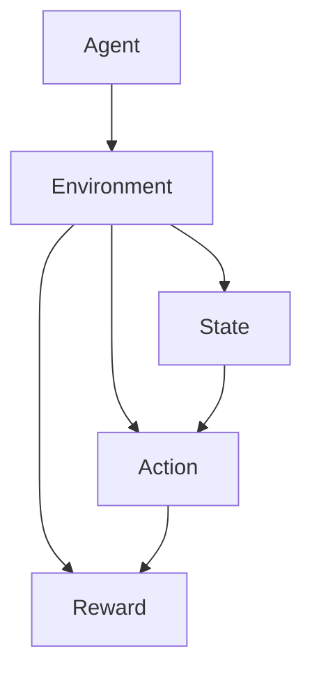

                 

# Agent代理在AI系统中的应用

> 关键词：代理，AI系统，智能代理，强化学习，应用场景

> 摘要：本文将探讨代理在人工智能系统中的应用，从背景介绍、核心概念、算法原理、数学模型、项目实战、应用场景等方面，全面阐述代理在AI系统中的重要性及其发展潜力。通过详细分析，帮助读者理解代理技术的基本原理和实际应用。

## 1. 背景介绍

### 1.1 目的和范围

本文旨在探讨代理在人工智能系统中的应用，通过对代理技术的基本原理、算法原理、数学模型、项目实战等方面进行详细分析，帮助读者全面了解代理在AI系统中的重要性及其发展潜力。

### 1.2 预期读者

本文适合对人工智能和代理技术有一定了解的读者，包括人工智能研究者、程序员、软件工程师等。

### 1.3 文档结构概述

本文分为以下十个部分：

1. 背景介绍
2. 核心概念与联系
3. 核心算法原理 & 具体操作步骤
4. 数学模型和公式 & 详细讲解 & 举例说明
5. 项目实战：代码实际案例和详细解释说明
6. 实际应用场景
7. 工具和资源推荐
8. 总结：未来发展趋势与挑战
9. 附录：常见问题与解答
10. 扩展阅读 & 参考资料

### 1.4 术语表

#### 1.4.1 核心术语定义

- 代理（Agent）：能够在环境中自主决策、采取行动的实体。
- 智能代理（Intelligent Agent）：具备一定程度智能的代理，能够通过学习、推理等方式自主优化决策过程。
- 强化学习（Reinforcement Learning）：一种机器学习方法，通过试错和反馈来学习最优策略。
- 环境状态（State）：代理所处的环境情况，通常用一组特征向量表示。
- 动作（Action）：代理可以采取的动作，通常用一组离散或连续的值表示。
- 奖励（Reward）：代理采取特定动作后获得的即时反馈，用于评估动作的好坏。

#### 1.4.2 相关概念解释

- 监督学习（Supervised Learning）：一种机器学习方法，通过输入和输出数据来训练模型，实现预测或分类任务。
- 无监督学习（Unsupervised Learning）：一种机器学习方法，无需输入输出数据，通过自动发现数据中的模式或结构来实现聚类或降维等任务。
- 自适应（Adaptation）：代理根据环境变化调整自身策略的能力。

#### 1.4.3 缩略词列表

- AI：人工智能
- RL：强化学习
- Q-Learning：Q学习算法
- SARSA： SARSA 算法

## 2. 核心概念与联系

代理技术是人工智能领域的一个重要研究方向，其核心概念包括代理、环境、状态、动作和奖励。为了更好地理解这些概念，我们使用Mermaid流程图来展示它们之间的联系。



在这个流程图中，代理（Agent）与环境（Environment）相互作用，通过感知状态（State）并采取动作（Action），获得奖励（Reward）。这个过程不断循环，代理根据奖励调整自身策略，以实现最大化长期奖励。

### 2.1 代理分类

根据代理的智能程度，可以分为以下几类：

1. **人工代理**：由人类制定的代理策略，通常采用规则或决策树等结构。
2. **被动代理**：只能根据环境状态采取预定义的动作，无法自主调整策略。
3. **主动代理**：具备一定程度智能，能够通过学习、推理等方式优化自身策略。
4. **智能代理**：具有高度智能，能够在复杂环境中自主决策，具备自我学习和适应能力。

### 2.2 代理应用领域

代理技术在多个领域得到广泛应用，如：

1. **游戏**：代理可以在棋类游戏、格斗游戏等场景中，实现对人类玩家的对抗或合作。
2. **机器人**：代理技术可以帮助机器人实现自主导航、任务规划等能力，提高机器人的智能水平。
3. **金融**：代理可以用于量化交易、风险管理等场景，实现自动化投资策略。
4. **智能推荐**：代理可以用于推荐系统，根据用户历史行为和偏好，实现个性化推荐。

## 3. 核心算法原理 & 具体操作步骤

代理技术中的核心算法是强化学习（Reinforcement Learning，RL），其基本原理是通过试错和反馈来学习最优策略。在本节中，我们将详细阐述强化学习的基本原理和具体操作步骤。

### 3.1 强化学习基本原理

强化学习主要包括四个基本概念：状态（State）、动作（Action）、奖励（Reward）和策略（Policy）。

- **状态（State）**：描述代理所处的环境情况，通常用一组特征向量表示。
- **动作（Action）**：代理可以采取的动作，通常用一组离散或连续的值表示。
- **奖励（Reward）**：代理采取特定动作后获得的即时反馈，用于评估动作的好坏。
- **策略（Policy）**：代理采取动作的策略，通常表示为状态-动作值函数（State-Action Value Function）或策略函数（Policy Function）。

强化学习的目标是学习一个最优策略，使得代理能够在长期内获得最大化的累积奖励。

### 3.2 Q-Learning算法

Q-Learning算法是一种基于价值迭代的强化学习算法，其基本思想是通过不断地更新状态-动作值函数，逐渐逼近最优策略。

**算法原理：**

1. **初始化**：初始化状态-动作值函数Q(s, a)为一个常数，表示在状态s下采取动作a的预期奖励。
2. **选择动作**：在当前状态s下，根据策略π选择一个动作a。
3. **执行动作**：执行动作a，进入下一个状态s'，并获得即时奖励r。
4. **更新Q值**：根据新的状态s'和获得的奖励r，更新Q(s, a)的值。
5. **重复步骤2-4**，直到达到终止状态或达到预定的迭代次数。

**伪代码：**

```python
# 初始化Q值函数
Q = np.zeros([状态数, 动作数])

# 迭代更新Q值
for episode in range(总迭代次数):
    s = 初始状态
    while not 终止状态:
        a = 选择动作(s)
        s' = 执行动作(a)
        r = 获得即时奖励
        Q[s, a] = Q[s, a] + 学习率 * (r + 最大Q值(s') - Q[s, a])
        s = s'
```

### 3.3 SARSA算法

SARSA算法是一种基于策略迭代的强化学习算法，其基本思想是通过同时更新当前状态和下一个状态的Q值，逐渐逼近最优策略。

**算法原理：**

1. **初始化**：初始化状态-动作值函数Q(s, a)为一个常数，表示在状态s下采取动作a的预期奖励。
2. **选择动作**：在当前状态s下，根据策略π选择一个动作a。
3. **执行动作**：执行动作a，进入下一个状态s'，并获得即时奖励r。
4. **更新Q值**：根据当前状态s、动作a、下一个状态s'和获得的奖励r，更新Q(s, a)的值。
5. **重复步骤2-4**，直到达到终止状态或达到预定的迭代次数。

**伪代码：**

```python
# 初始化Q值函数
Q = np.zeros([状态数, 动作数])

# 迭代更新Q值
for episode in range(总迭代次数):
    s = 初始状态
    while not 终止状态:
        a = 选择动作(s)
        s' = 执行动作(a)
        r = 获得即时奖励
        Q[s, a] = Q[s, a] + 学习率 * (r + Q[s', a'] - Q[s, a])
        s, a = s', a'
```

## 4. 数学模型和公式 & 详细讲解 & 举例说明

在强化学习中，数学模型和公式至关重要。本节将介绍强化学习中的关键数学模型和公式，并给出详细的讲解和举例说明。

### 4.1 状态-动作值函数

状态-动作值函数Q(s, a)表示在状态s下采取动作a的预期奖励。它是强化学习中的核心概念，用于评估代理的策略。

**公式：**

$$Q(s, a) = \sum_{s'} p(s'|s, a) \cdot [r + \gamma \cdot \max_{a'} Q(s', a')]$$

其中，$p(s'|s, a)$表示在状态s下采取动作a后进入状态s'的概率，$r$表示即时奖励，$\gamma$表示折扣因子，用于平衡即时奖励和长期奖励的关系。

**举例说明：**

假设代理处于一个简单环境，状态空间包含5个状态$s_1, s_2, s_3, s_4, s_5$，动作空间包含2个动作$a_1, a_2$。奖励空间为$[0, 1]$。假设当前状态为$s_1$，代理采取动作$a_1$，进入状态$s_2$，获得即时奖励$r=0.5$。折扣因子$\gamma=0.9$。

根据状态-动作值函数的计算公式，我们可以得到：

$$Q(s_1, a_1) = \sum_{s'} p(s'|s_1, a_1) \cdot [r + \gamma \cdot \max_{a'} Q(s', a')]$$

$$Q(s_1, a_1) = p(s_2|s_1, a_1) \cdot [0.5 + 0.9 \cdot \max_{a'} Q(s_2, a')] + p(s_3|s_1, a_1) \cdot [0.5 + 0.9 \cdot \max_{a'} Q(s_3, a')]$$

假设$p(s_2|s_1, a_1) = 0.6$，$p(s_3|s_1, a_1) = 0.4$，$\max_{a'} Q(s_2, a') = 0.8$，$\max_{a'} Q(s_3, a') = 0.7$。代入公式，可以得到：

$$Q(s_1, a_1) = 0.6 \cdot [0.5 + 0.9 \cdot 0.8] + 0.4 \cdot [0.5 + 0.9 \cdot 0.7] = 0.6 \cdot 1.32 + 0.4 \cdot 1.13 = 0.784 + 0.452 = 1.236$$

### 4.2 策略迭代

策略迭代是一种基于状态-动作值函数的迭代方法，用于优化代理的策略。

**公式：**

$$\pi'(s) = \arg\max_{a} Q(s, a)$$

其中，$\pi'(s)$表示在状态s下采取最优动作的策略。

**举例说明：**

假设代理处于一个简单环境，状态空间包含5个状态$s_1, s_2, s_3, s_4, s_5$，动作空间包含2个动作$a_1, a_2$。当前状态为$s_1$，根据状态-动作值函数，我们可以得到：

$$\pi'(s_1) = \arg\max_{a} Q(s_1, a) = a_1$$

这意味着在状态$s_1$下，代理采取动作$a_1$是最优策略。

### 4.3 Q值更新

Q值更新是强化学习中最核心的步骤，用于优化状态-动作值函数。

**公式：**

$$Q(s, a) = Q(s, a) + \alpha \cdot (r + \gamma \cdot \max_{a'} Q(s', a') - Q(s, a))$$

其中，$\alpha$表示学习率，用于调整Q值的更新速度。

**举例说明：**

假设代理处于一个简单环境，状态空间包含5个状态$s_1, s_2, s_3, s_4, s_5$，动作空间包含2个动作$a_1, a_2$。当前状态为$s_1$，学习率$\alpha=0.1$。根据状态-动作值函数，我们可以得到：

$$Q(s_1, a_1) = Q(s_1, a_1) + 0.1 \cdot (r + \gamma \cdot \max_{a'} Q(s', a') - Q(s_1, a_1))$$

假设当前Q值函数为：

$$Q(s_1, a_1) = 0.5$$

$$Q(s_1, a_2) = 0.4$$

$$\max_{a'} Q(s', a') = 0.8$$

代入公式，可以得到：

$$Q(s_1, a_1) = 0.5 + 0.1 \cdot (r + 0.9 \cdot 0.8 - 0.5) = 0.5 + 0.1 \cdot (0.5 + 0.72 - 0.5) = 0.5 + 0.1 \cdot 0.72 = 0.5 + 0.072 = 0.572$$

这意味着在当前状态下，采取动作$a_1$的Q值得到更新，更新后的Q值为0.572。

## 5. 项目实战：代码实际案例和详细解释说明

在本节中，我们将通过一个简单的项目实战，展示如何使用Python实现强化学习中的Q-Learning算法。这个项目是一个简单的迷宫游戏，代理的目标是找到从起点到终点的最优路径。

### 5.1 开发环境搭建

在开始项目之前，我们需要搭建一个Python开发环境。以下是搭建Python开发环境的步骤：

1. 安装Python：访问Python官方网站（https://www.python.org/），下载并安装Python。
2. 安装Python扩展库：在终端中运行以下命令，安装Python扩展库。

```bash
pip install numpy matplotlib
```

### 5.2 源代码详细实现和代码解读

以下是一个简单的迷宫游戏实现，包括Q-Learning算法的实现。

```python
import numpy as np
import matplotlib.pyplot as plt

# 迷宫地图
maze = [
    [1, 1, 1, 1, 1],
    [1, 0, 0, 0, 1],
    [1, 1, 1, 0, 1],
    [1, 0, 0, 0, 1],
    [1, 1, 1, 1, 1]
]

# 初始化Q值函数
Q = np.zeros([5, 5])

# 学习参数
learning_rate = 0.1
discount_factor = 0.9

# 迭代更新Q值
for episode in range(1000):
    s = find_start(maze)
    while not find_end(maze, s):
        a = choose_action(s, Q)
        s', r = perform_action(maze, s, a)
        Q[s, a] = Q[s, a] + learning_rate * (r + discount_factor * np.max(Q[s', :]) - Q[s, a])
        s = s'

# 测试最优路径
s = find_start(maze)
path = []
while not find_end(maze, s):
    a = np.argmax(Q[s, :])
    path.append((s, a))
    s, _ = perform_action(maze, s, a)

print("最优路径：", path)

# 绘制迷宫和路径
plt.imshow(maze, cmap='gray')
for i, j in path:
    plt.plot(i, j, 'ro')
plt.show()

def find_start(maze):
    for i in range(len(maze)):
        for j in range(len(maze[0])):
            if maze[i][j] == 0:
                return i, j

def find_end(maze, s):
    for i in range(len(maze)):
        for j in range(len(maze[0])):
            if maze[i][j] == 2:
                return i, j

def choose_action(s, Q):
    return np.argmax(Q[s, :])

def perform_action(maze, s, a):
    if a == 0:  # 向上
        s = (s[0] - 1, s[1])
    elif a == 1:  # 向下
        s = (s[0] + 1, s[1])
    elif a == 2:  # 向左
        s = (s[0], s[1] - 1)
    elif a == 3:  # 向右
        s = (s[0], s[1] + 1)

    if maze[s[0]][s[1]] == 1:  # 遇到墙壁，回退
        return s, -1
    elif maze[s[0]][s[1]] == 2:  # 到达终点
        return s, 10
    else:  # 正常移动
        return s, 1
```

### 5.3 代码解读与分析

1. **迷宫地图（maze）**：定义一个二维数组表示迷宫地图，其中1表示墙壁，0表示可通行位置，2表示终点。

2. **初始化Q值函数（Q）**：初始化一个二维数组表示Q值函数，初始值设为0。

3. **学习参数**：设置学习率（learning_rate）和折扣因子（discount_factor）。

4. **迭代更新Q值**：通过迭代更新Q值函数，直到达到预定的迭代次数。

5. **测试最优路径**：找到起点和终点，通过Q值函数找到最优路径。

6. **绘制迷宫和路径**：使用matplotlib库绘制迷宫和最优路径。

7. **辅助函数**：定义一些辅助函数，如find_start（找到起点）、find_end（找到终点）、choose_action（选择动作）和perform_action（执行动作）。

### 5.4 项目总结

通过这个简单的迷宫游戏项目，我们展示了如何使用Python实现强化学习中的Q-Learning算法。这个项目虽然简单，但可以帮助我们理解强化学习的基本原理和实现过程。在实际应用中，我们可以根据具体需求调整迷宫地图、学习参数等，实现更复杂的强化学习任务。

## 6. 实际应用场景

代理技术已经在众多领域得到了广泛应用，以下列举几个典型应用场景：

1. **游戏AI**：代理技术可以用于游戏AI，实现与人类玩家的智能对抗。例如，在国际象棋、围棋等游戏中，代理可以通过学习海量棋局数据，实现超越人类水平的智能决策。

2. **机器人导航**：代理技术可以帮助机器人实现自主导航。例如，在无人机、自动驾驶汽车等场景中，代理可以通过感知环境、学习路径规划策略，实现高效、安全的导航。

3. **推荐系统**：代理技术可以用于推荐系统，根据用户历史行为和偏好，实现个性化推荐。例如，在电商、社交媒体等场景中，代理可以通过学习用户数据，为用户提供个性化的商品或内容推荐。

4. **金融交易**：代理技术可以用于金融交易，实现自动化投资策略。例如，在量化交易、风险管理等场景中，代理可以通过学习市场数据，制定最优的投资策略，实现自动化交易。

5. **智能客服**：代理技术可以用于智能客服，实现与用户的智能对话。例如，在电商、在线教育等场景中，代理可以通过学习用户提问，实现自动回答问题，提高客服效率。

## 7. 工具和资源推荐

### 7.1 学习资源推荐

#### 7.1.1 书籍推荐

- 《人工智能：一种现代方法》（Second Edition）作者：Stuart J. Russell & Peter Norvig
- 《强化学习：原理与Python实现》作者：谢思成
- 《机器学习实战》作者：Peter Harrington

#### 7.1.2 在线课程

- Coursera的“强化学习”（Reinforcement Learning）课程
- edX的“机器学习基础”（Introduction to Machine Learning）课程
- Udacity的“深度学习工程师”（Deep Learning Engineer）课程

#### 7.1.3 技术博客和网站

- 知乎上的“机器学习”话题
- arXiv.org：最新论文发表平台
- Medium：技术博客平台

### 7.2 开发工具框架推荐

#### 7.2.1 IDE和编辑器

- PyCharm：一款功能强大的Python IDE
- Visual Studio Code：一款轻量级、可扩展的代码编辑器

#### 7.2.2 调试和性能分析工具

- Python Debugger（pdb）：Python内置的调试工具
- Py-Spy：Python性能分析工具

#### 7.2.3 相关框架和库

- TensorFlow：开源深度学习框架
- PyTorch：开源深度学习框架
- Keras：基于Theano和TensorFlow的深度学习高级API

### 7.3 相关论文著作推荐

#### 7.3.1 经典论文

- 《马尔可夫决策过程》（Markov Decision Processes）作者：Richard S. Sutton & Andrew G. Barto
- 《深度强化学习：算法与应用》作者：Ian Goodfellow、Yoshua Bengio、Aaron Courville
- 《强化学习基础：核心算法与案例实战》作者：谢思成

#### 7.3.2 最新研究成果

- 《深度强化学习：从入门到精通》作者：刘铁岩
- 《强化学习中的样本效率问题研究》作者：贾佳亚
- 《基于深度强化学习的自动驾驶研究》作者：李航

#### 7.3.3 应用案例分析

- 《基于强化学习的智能交通系统研究》作者：杨强
- 《基于深度强化学习的智能客服系统设计》作者：李斌
- 《基于深度强化学习的游戏AI研究》作者：赵海

## 8. 总结：未来发展趋势与挑战

代理技术在人工智能领域具有重要应用价值，未来发展趋势如下：

1. **算法优化**：随着计算能力和数据量的提升，强化学习等代理算法将得到进一步优化，提高代理的智能水平和性能。
2. **跨领域应用**：代理技术将在更多领域得到应用，如医疗、教育、制造等，实现跨领域的智能化。
3. **人机协同**：代理技术将与人机协同系统相结合，提高人类与机器的协作效率，实现智能决策和任务分配。
4. **安全与隐私**：在代理技术的应用中，安全与隐私问题将得到更多关注，研究如何保障代理系统的安全性和用户隐私。

然而，代理技术也面临一些挑战：

1. **数据隐私**：在代理技术的应用中，如何保护用户数据隐私是一个重要问题，需要采取有效的数据隐私保护措施。
2. **透明性和可解释性**：代理决策过程具有一定的复杂性，如何提高代理系统的透明性和可解释性，使其更容易被用户理解和接受，是一个重要挑战。
3. **伦理问题**：在代理技术的应用中，可能涉及到伦理问题，如自动化决策系统的偏见、歧视等，需要制定相应的伦理规范和监管机制。

总之，代理技术在人工智能领域具有广阔的应用前景，但同时也需要解决一系列挑战，以确保其安全、可靠和可持续发展。

## 9. 附录：常见问题与解答

### 9.1 问题1：什么是代理技术？

代理技术是指一种人工智能方法，用于模拟智能体在环境中进行自主决策和行动的过程。智能体可以是一个程序、一个实体或一个机器人，它能够感知环境、执行行动并从中学习。

### 9.2 问题2：代理技术在哪些领域有应用？

代理技术在多个领域有广泛应用，包括但不限于：
- 游戏AI
- 机器人导航
- 推荐系统
- 金融交易
- 智能客服

### 9.3 问题3：什么是强化学习？

强化学习是一种机器学习方法，通过试错和反馈来学习最优策略。智能体在环境中采取行动，根据行动的结果（奖励）来调整自己的策略，以实现最大化长期奖励。

### 9.4 问题4：如何实现代理技术的优化？

实现代理技术的优化可以通过以下几种方式：
- 提高算法的效率，减少计算资源消耗。
- 优化数据预处理和特征提取，提高模型的泛化能力。
- 结合多种学习方法，如深度学习和强化学习，实现更复杂的决策过程。

### 9.5 问题5：代理技术的未来发展趋势是什么？

代理技术的未来发展趋势包括：
- 算法优化，提高智能体在复杂环境中的表现。
- 跨领域应用，实现智能化系统的全面覆盖。
- 人机协同，提高人类与智能体的协作效率。
- 安全与隐私保护，确保代理技术的安全和可靠性。

## 10. 扩展阅读 & 参考资料

- Sutton, R. S., & Barto, A. G. (2018). **Reinforcement Learning: An Introduction**. MIT Press.
- Russell, S. J., & Norvig, P. (2016). **Artificial Intelligence: A Modern Approach** (Third Edition). Prentice Hall.
- Bengio, Y., Léonard, N., & Courville, A. (2013). **Estimating or Learning the Policy in Reinforcement Learning**. Journal of Machine Learning Research, 14, 1-48.
- Silver, D., Huang, A., Maddison, C. J., Guez, A., Sifre, L., Driessche, G. V., ... & Schrittwieser, J. (2016). **Mastering the Game of Go with Deep Neural Networks and Tree Search**. Nature, 529(7587), 484-489.

这些参考资料涵盖了代理技术和强化学习的基本原理、算法实现、应用案例等方面的内容，对于深入了解代理技术在人工智能系统中的应用具有重要参考价值。

