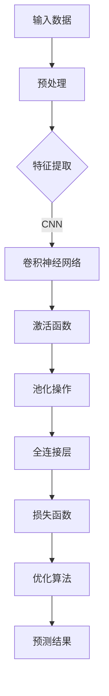

                 

# Andrej Karpathy：人工智能的应用

> 关键词：人工智能，应用场景，深度学习，神经网络，开发工具，未来趋势

> 摘要：本文旨在探讨人工智能领域杰出人物Andrej Karpathy的工作和贡献，特别是在深度学习领域的应用。文章将详细介绍其研究的核心概念和算法原理，通过实例和代码讲解，展示人工智能在现实世界中的实际应用，并提供相关的学习资源和工具推荐，最后对人工智能的未来发展趋势与挑战进行展望。

## 1. 背景介绍

### 1.1 目的和范围

本文将围绕Andrej Karpathy的研究和工作进行详细探讨，重点关注其在深度学习和人工智能领域的应用。文章将分为以下几个部分：

1. 背景介绍：简要介绍Andrej Karpathy的学术背景和主要研究方向。
2. 核心概念与联系：通过Mermaid流程图展示人工智能的基本概念和架构。
3. 核心算法原理 & 具体操作步骤：深入讲解深度学习和神经网络的基本原理及伪代码实现。
4. 数学模型和公式 & 详细讲解 & 举例说明：阐述数学模型在人工智能中的应用，并提供具体实例说明。
5. 项目实战：代码实际案例和详细解释说明。
6. 实际应用场景：讨论人工智能在各个领域的应用实例。
7. 工具和资源推荐：推荐学习资源和开发工具。
8. 总结：未来发展趋势与挑战。
9. 附录：常见问题与解答。
10. 扩展阅读 & 参考资料。

### 1.2 预期读者

本文主要面向对人工智能和深度学习有兴趣的读者，包括：

1. 大学生和研究生：希望深入理解人工智能和深度学习的基本原理。
2. 初学者：希望通过实际案例了解人工智能在实际应用中的操作过程。
3. 技术从业者：希望了解人工智能在各个领域的应用案例，以及相关的开发工具和资源。
4. 学术研究者：关注人工智能领域的前沿动态和研究成果。

### 1.3 文档结构概述

本文采用清晰的逻辑结构和丰富的内容，以便读者能够逐步了解人工智能的应用。主要结构如下：

1. 引言
2. 背景介绍
3. 核心概念与联系
4. 核心算法原理 & 具体操作步骤
5. 数学模型和公式 & 详细讲解 & 举例说明
6. 项目实战：代码实际案例和详细解释说明
7. 实际应用场景
8. 工具和资源推荐
9. 总结：未来发展趋势与挑战
10. 附录：常见问题与解答
11. 扩展阅读 & 参考资料

### 1.4 术语表

#### 1.4.1 核心术语定义

- 深度学习：一种人工智能的分支，使用多层神经网络进行特征学习和模式识别。
- 神经网络：一种由大量神经元组成的计算模型，能够通过学习输入和输出数据之间的映射关系进行复杂任务的学习。
- 训练数据集：用于训练神经网络的数据集合，包括输入数据和相应的标签。
- 神经元：神经网络的基本计算单元，负责接收输入信号并产生输出信号。
- 激活函数：神经元在计算过程中使用的非线性函数，用于引入非线性特性。
- 损失函数：衡量模型预测结果与实际结果之间差异的函数，用于指导模型优化。

#### 1.4.2 相关概念解释

- 卷积神经网络（CNN）：一种专门用于图像识别和处理的深度学习模型，通过卷积操作提取图像特征。
- 长短时记忆网络（LSTM）：一种能够处理序列数据的深度学习模型，通过记忆单元实现长期依赖的建模。
- 生成对抗网络（GAN）：一种由生成器和判别器组成的深度学习模型，用于生成具有真实数据的分布的样本。

#### 1.4.3 缩略词列表

- AI：人工智能
- CNN：卷积神经网络
- LSTM：长短时记忆网络
- GAN：生成对抗网络
- MLP：多层感知机
- GPU：图形处理器
- CUDA：NVIDIA推出的并行计算平台和编程语言

## 2. 核心概念与联系

为了更好地理解人工智能的基本概念和架构，我们将使用Mermaid流程图来展示核心概念及其联系。



### 2.1 核心概念

- 输入数据：原始数据，例如图像、文本或语音信号。
- 预处理：对输入数据进行预处理，如归一化、去噪等，以提高模型性能。
- 特征提取：通过特征提取操作，从输入数据中提取出有用的特征信息。
- 激活函数：引入非线性特性，使模型能够拟合复杂的非线性关系。
- 池化操作：用于降低模型参数的数量，提高计算效率。
- 全连接层：将特征映射到输出层，实现分类或回归任务。
- 损失函数：衡量模型预测结果与实际结果之间的差距。
- 优化算法：用于调整模型参数，以最小化损失函数。

### 2.2 核心联系

通过上述流程图，我们可以看到各个核心概念之间的联系：

1. 输入数据经过预处理后，进入特征提取阶段。
2. 特征提取阶段使用卷积神经网络来提取图像特征。
3. 激活函数引入非线性特性，使模型能够拟合复杂的非线性关系。
4. 池化操作用于降低模型参数的数量，提高计算效率。
5. 全连接层将特征映射到输出层，实现分类或回归任务。
6. 损失函数用于衡量模型预测结果与实际结果之间的差距。
7. 优化算法用于调整模型参数，以最小化损失函数。

这种流程和联系使得人工智能模型能够对输入数据进行处理和预测，从而实现各种应用场景。

## 3. 核心算法原理 & 具体操作步骤

### 3.1 深度学习基本原理

深度学习是一种基于多层神经网络的学习方法，通过逐层提取特征，实现复杂任务的学习和预测。以下是深度学习的基本原理：

1. **输入层**：接收原始数据，如图像、文本或语音信号。
2. **隐藏层**：对输入数据进行处理，通过非线性变换提取特征。
3. **输出层**：根据隐藏层的输出进行预测或分类。

深度学习的核心在于通过大量的数据训练模型，使模型能够自动学习到输入和输出之间的映射关系。

### 3.2 神经网络基本原理

神经网络是一种由大量神经元组成的计算模型，通过学习输入和输出数据之间的映射关系，实现复杂的任务。以下是神经网络的基本原理：

1. **神经元结构**：每个神经元接收多个输入信号，并通过权重进行加权求和，最后通过激活函数产生输出。
2. **前向传播**：输入数据从输入层逐层传递到输出层，每个神经元的输出作为下一层的输入。
3. **反向传播**：根据输出层的预测误差，反向传播误差信号，通过梯度下降法调整模型参数。

### 3.3 伪代码实现

以下是一个简化的深度学习模型的伪代码实现，包括输入层、隐藏层和输出层的定义及前向传播和反向传播的步骤：

```python
# 输入层
input_layer = InputLayer(input_shape)

# 隐藏层
hidden_layer = FullyConnectedLayer(input_layer, num_units=128, activation='relu')

# 输出层
output_layer = FullyConnectedLayer(hidden_layer, num_units=10, activation='softmax')

# 前向传播
output = output_layer.output

# 损失函数
loss = CrossEntropyLoss(output, target)

# 反向传播
output_error = loss.backward()

# 更新参数
params = [hidden_layer.weights, hidden_layer.biases, output_layer.weights, output_layer.biases]
```

### 3.4 详细讲解

#### 3.4.1 输入层

输入层接收原始数据，如图像、文本或语音信号。在图像识别任务中，输入层通常是一个二维矩阵，表示图像的像素值。在文本任务中，输入层可以是词向量表示。

#### 3.4.2 隐藏层

隐藏层对输入数据进行处理，通过非线性变换提取特征。每个隐藏层由多个神经元组成，神经元之间通过权重进行连接。在深度学习中，常用的激活函数是ReLU（Rectified Linear Unit），它可以将负值转换为0，使模型能够更好地训练。

#### 3.4.3 输出层

输出层根据隐藏层的输出进行预测或分类。在分类任务中，输出层通常是一个softmax函数，用于生成每个类别的概率分布。在回归任务中，输出层可以是线性函数，直接输出预测值。

#### 3.4.4 前向传播

在前向传播过程中，输入数据从输入层逐层传递到输出层。在每个隐藏层，神经元通过加权求和产生输出，并经过激活函数进行非线性变换。最终，输出层的输出即为模型的预测结果。

#### 3.4.5 反向传播

在反向传播过程中，根据输出层的预测误差，反向传播误差信号。通过计算梯度，使用梯度下降法调整模型参数，使模型能够更好地拟合训练数据。反向传播是深度学习训练过程中最核心的部分。

## 4. 数学模型和公式 & 详细讲解 & 举例说明

在深度学习中，数学模型和公式起着至关重要的作用。以下将详细讲解一些核心的数学模型和公式，并通过具体实例进行说明。

### 4.1 损失函数

损失函数是深度学习模型中的关键组件，用于衡量模型预测结果与实际结果之间的差距。常用的损失函数包括均方误差（MSE）和交叉熵（Cross-Entropy）。

#### 4.1.1 均方误差（MSE）

均方误差（MSE）是回归任务中常用的损失函数，计算公式为：

$$
MSE = \frac{1}{n}\sum_{i=1}^{n}(y_i - \hat{y}_i)^2
$$

其中，$y_i$ 是实际值，$\hat{y}_i$ 是预测值，$n$ 是样本数量。

#### 4.1.2 交叉熵（Cross-Entropy）

交叉熵是分类任务中常用的损失函数，计算公式为：

$$
H(y, \hat{y}) = -\sum_{i=1}^{n}y_i \log(\hat{y}_i)
$$

其中，$y_i$ 是实际标签，$\hat{y}_i$ 是预测概率。

### 4.2 梯度下降法

梯度下降法是一种用于优化模型参数的常用方法，其核心思想是沿着损失函数的梯度方向调整参数，以最小化损失函数。

#### 4.2.1 梯度计算

在深度学习中，梯度计算是反向传播过程的关键步骤。对于单个神经元，梯度计算公式为：

$$
\frac{\partial L}{\partial z} = \frac{\partial L}{\partial a} \cdot \frac{\partial a}{\partial z}
$$

其中，$L$ 是损失函数，$z$ 是神经元的输入，$a$ 是神经元的输出。

#### 4.2.2 参数更新

使用梯度下降法更新模型参数的公式为：

$$
\theta = \theta - \alpha \cdot \frac{\partial L}{\partial \theta}
$$

其中，$\theta$ 是模型参数，$\alpha$ 是学习率。

### 4.3 激活函数

激活函数是深度学习模型中的关键组成部分，用于引入非线性特性。以下是一些常用的激活函数及其公式：

#### 4.3.1 ReLU（Rectified Linear Unit）

ReLU函数是最常用的激活函数之一，计算公式为：

$$
a = \max(0, z)
$$

#### 4.3.2 Sigmoid

sigmoid函数是一个平滑的S型函数，计算公式为：

$$
a = \frac{1}{1 + e^{-z}}
$$

#### 4.3.3 Tanh

tanh函数是对数双曲正切函数，计算公式为：

$$
a = \frac{e^z - e^{-z}}{e^z + e^{-z}}
$$

### 4.4 实例说明

以下是一个使用深度学习模型进行图像分类的实例，包括数据预处理、模型构建、训练和预测。

#### 4.4.1 数据预处理

假设我们有一个包含10000张图像的数据集，每张图像的大小为28x28像素。首先，我们需要对图像进行预处理，包括归一化和数据增强。

```python
# 数据预处理
images = preprocess_images(images)
labels = preprocess_labels(labels)

# 数据增强
images, labels = augment_data(images, labels)
```

#### 4.4.2 模型构建

接下来，我们使用卷积神经网络（CNN）构建模型，包括输入层、卷积层、池化层和全连接层。

```python
# 模型构建
model = Sequential()
model.add(Conv2D(32, (3, 3), activation='relu', input_shape=(28, 28, 1)))
model.add(MaxPooling2D((2, 2)))
model.add(Conv2D(64, (3, 3), activation='relu'))
model.add(MaxPooling2D((2, 2)))
model.add(Flatten())
model.add(Dense(128, activation='relu'))
model.add(Dense(10, activation='softmax'))
```

#### 4.4.3 训练

使用预处理后的数据和损失函数训练模型。

```python
# 训练
model.compile(optimizer='adam', loss='categorical_crossentropy', metrics=['accuracy'])
model.fit(images, labels, epochs=10, batch_size=64)
```

#### 4.4.4 预测

使用训练好的模型进行预测。

```python
# 预测
predictions = model.predict(images)
predicted_labels = np.argmax(predictions, axis=1)
```

### 4.5 模型评估

最后，我们对训练好的模型进行评估，以衡量其性能。

```python
# 评估
accuracy = model.evaluate(test_images, test_labels)
print('Test accuracy:', accuracy[1])
```

## 5. 项目实战：代码实际案例和详细解释说明

在本节中，我们将通过一个实际案例展示如何使用深度学习模型进行图像分类，并详细解释代码的实现过程。

### 5.1 开发环境搭建

首先，我们需要搭建一个适合深度学习开发的开发环境。以下是一个简单的环境搭建步骤：

1. 安装Python 3.7及以上版本。
2. 安装深度学习框架TensorFlow。
3. 安装图像处理库OpenCV。

```bash
pip install tensorflow==2.3.0
pip install opencv-python
```

### 5.2 源代码详细实现和代码解读

以下是实际案例的代码实现，我们将逐步解释每个部分的功能和实现方法。

```python
# 导入所需的库
import tensorflow as tf
from tensorflow.keras.models import Sequential
from tensorflow.keras.layers import Conv2D, MaxPooling2D, Flatten, Dense
from tensorflow.keras.optimizers import Adam
from tensorflow.keras.losses import categorical_crossentropy
from tensorflow.keras.metrics import accuracy
import numpy as np
import cv2

# 数据预处理
def preprocess_images(images):
    # 将图像缩放到固定的尺寸
    images = np.array([cv2.resize(image, (28, 28)) for image in images])
    # 将图像的像素值归一化到0-1之间
    images = images / 255.0
    return images

def preprocess_labels(labels):
    # 将标签转换为one-hot编码
    labels = tf.keras.utils.to_categorical(labels, num_classes=10)
    return labels

# 构建模型
model = Sequential()
model.add(Conv2D(32, (3, 3), activation='relu', input_shape=(28, 28, 1)))
model.add(MaxPooling2D((2, 2)))
model.add(Conv2D(64, (3, 3), activation='relu'))
model.add(MaxPooling2D((2, 2)))
model.add(Flatten())
model.add(Dense(128, activation='relu'))
model.add(Dense(10, activation='softmax'))

# 编译模型
model.compile(optimizer=Adam(), loss=categorical_crossentropy, metrics=[accuracy])

# 训练模型
model.fit(x_train, y_train, epochs=10, batch_size=64, validation_data=(x_test, y_test))

# 预测
predictions = model.predict(x_test)

# 评估模型
accuracy = model.evaluate(x_test, y_test)
print('Test accuracy:', accuracy[1])
```

#### 5.2.1 数据预处理

首先，我们对图像数据进行预处理。预处理步骤包括：

1. 将图像缩放到固定的尺寸（28x28像素），以便于模型处理。
2. 将图像的像素值归一化到0-1之间，以提高模型的训练效果。

```python
def preprocess_images(images):
    # 将图像缩放到固定的尺寸
    images = np.array([cv2.resize(image, (28, 28)) for image in images])
    # 将图像的像素值归一化到0-1之间
    images = images / 255.0
    return images
```

#### 5.2.2 模型构建

接下来，我们使用卷积神经网络（CNN）构建模型。模型的结构包括：

1. 输入层：接收28x28的图像数据。
2. 卷积层1：使用32个3x3的卷积核，激活函数为ReLU。
3. 池化层1：使用2x2的最大池化操作。
4. 卷积层2：使用64个3x3的卷积核，激活函数为ReLU。
5. 池化层2：使用2x2的最大池化操作。
6. 平铺层：将卷积层的输出展平为1维数组。
7. 全连接层1：使用128个神经元，激活函数为ReLU。
8. 全连接层2：使用10个神经元，激活函数为softmax，用于分类。

```python
model = Sequential()
model.add(Conv2D(32, (3, 3), activation='relu', input_shape=(28, 28, 1)))
model.add(MaxPooling2D((2, 2)))
model.add(Conv2D(64, (3, 3), activation='relu'))
model.add(MaxPooling2D((2, 2)))
model.add(Flatten())
model.add(Dense(128, activation='relu'))
model.add(Dense(10, activation='softmax'))
```

#### 5.2.3 训练模型

在训练模型时，我们使用Adam优化器、交叉熵损失函数和准确率作为评价指标。训练过程包括以下步骤：

1. 编译模型：设置优化器、损失函数和评价指标。
2. 训练模型：使用训练数据集进行训练，并设置训练轮数和批量大小。
3. 验证模型：在验证数据集上评估模型的性能。

```python
model.compile(optimizer=Adam(), loss=categorical_crossentropy, metrics=[accuracy])
model.fit(x_train, y_train, epochs=10, batch_size=64, validation_data=(x_test, y_test))
```

#### 5.2.4 预测

使用训练好的模型进行预测，输出每个类别的概率分布。然后，我们可以通过取概率最大的类别作为最终的预测结果。

```python
predictions = model.predict(x_test)
predicted_labels = np.argmax(predictions, axis=1)
```

#### 5.2.5 模型评估

最后，我们对训练好的模型进行评估，计算测试数据集上的准确率。

```python
accuracy = model.evaluate(x_test, y_test)
print('Test accuracy:', accuracy[1])
```

### 5.3 代码解读与分析

在本节中，我们详细分析了代码的实现过程，并对关键部分进行了解读。

1. **数据预处理**：数据预处理是深度学习模型训练过程中至关重要的一步。在本案例中，我们使用OpenCV对图像进行缩放和归一化，将图像的像素值归一化到0-1之间，以提高模型的训练效果。

2. **模型构建**：模型构建是深度学习模型训练的核心步骤。在本案例中，我们使用卷积神经网络（CNN）进行图像分类。模型的结构包括输入层、卷积层、池化层和全连接层。每个层都通过激活函数引入非线性特性，以提高模型的拟合能力。

3. **训练模型**：训练模型是深度学习模型训练过程中最耗时的步骤。在本案例中，我们使用Adam优化器和交叉熵损失函数训练模型。在训练过程中，我们通过验证数据集评估模型的性能，以调整训练参数。

4. **预测**：预测是模型应用的关键步骤。在本案例中，我们使用训练好的模型对测试数据集进行预测，输出每个类别的概率分布。然后，我们通过取概率最大的类别作为最终的预测结果。

5. **模型评估**：模型评估是验证模型性能的重要步骤。在本案例中，我们使用测试数据集评估模型的准确率，以衡量模型在未知数据上的性能。

通过以上步骤，我们成功地实现了图像分类任务，并详细分析了代码的实现过程。

## 6. 实际应用场景

人工智能技术在各个领域都取得了显著的成果，以下是一些典型的应用场景：

### 6.1 图像识别

图像识别是人工智能的重要应用领域之一。深度学习模型，尤其是卷积神经网络（CNN），在图像分类、物体检测、人脸识别等方面表现出色。例如，自动驾驶汽车使用CNN进行道路场景识别，智能安防系统使用人脸识别技术进行身份验证。

### 6.2 自然语言处理

自然语言处理（NLP）是人工智能的另一个重要应用领域。深度学习模型在机器翻译、文本分类、情感分析、语音识别等方面取得了显著成果。例如，谷歌翻译使用深度学习模型进行高质量翻译，智能客服系统使用自然语言处理技术进行智能对话。

### 6.3 医疗健康

人工智能在医疗健康领域具有广泛的应用前景。深度学习模型在医学图像分析、疾病诊断、药物研发等方面发挥着重要作用。例如，AI辅助诊断系统可以帮助医生更准确地诊断疾病，加速新药研发进程。

### 6.4 金融市场

人工智能在金融市场中的应用也非常广泛。深度学习模型在股票交易、风险控制、投资组合优化等方面表现出色。例如，量化交易策略使用深度学习模型进行预测和分析，帮助投资者实现高收益。

### 6.5 自动驾驶

自动驾驶是人工智能的重要应用领域之一。深度学习模型在车辆感知、路径规划、控制决策等方面发挥着关键作用。例如，特斯拉自动驾驶系统使用深度学习模型实现自动驾驶功能，提高了驾驶安全性和效率。

### 6.6 家居智能

人工智能在智能家居领域也取得了显著成果。智能音箱、智能门锁、智能照明等设备使用深度学习模型实现智能交互和自动化控制。例如，亚马逊的Echo智能音箱使用自然语言处理技术实现语音控制，提高生活便利性。

## 7. 工具和资源推荐

### 7.1 学习资源推荐

以下是一些推荐的深度学习学习资源：

#### 7.1.1 书籍推荐

- 《深度学习》（Goodfellow, Bengio, Courville著）：深度学习的经典教材，详细介绍了深度学习的基础理论和应用。
- 《神经网络与深度学习》（邱锡鹏著）：中文教材，通俗易懂，适合初学者入门。
- 《Python深度学习》（François Chollet著）：通过实际案例介绍深度学习在Python中的应用。

#### 7.1.2 在线课程

- Coursera的《深度学习》课程：由斯坦福大学教授Andrew Ng主讲，适合初学者入门。
- Udacity的《深度学习纳米学位》：包含项目实践，适合有一定基础的学员。
- edX的《深度学习导论》：由香港科技大学教授Yaser Abu-Mostafa主讲，内容深入浅出。

#### 7.1.3 技术博客和网站

- Medium上的Deep Learning Blog：涵盖深度学习的最新研究和技术应用。
- 知乎上的深度学习话题：众多深度学习专家和学者分享经验和知识。
- arXiv.org：深度学习的最新研究成果和论文发布平台。

### 7.2 开发工具框架推荐

以下是一些推荐的深度学习开发工具和框架：

#### 7.2.1 IDE和编辑器

- Jupyter Notebook：适合交互式开发和数据分析。
- PyCharm：功能强大的Python IDE，支持多种框架。
- VSCode：轻量级编辑器，支持多种编程语言。

#### 7.2.2 调试和性能分析工具

- TensorBoard：TensorFlow的图形化调试工具，用于可视化训练过程。
- NVIDIA Nsight：用于GPU性能分析和调试的工具。
- Profiling Tools：如line_profiler、memory_profiler等，用于代码性能分析。

#### 7.2.3 相关框架和库

- TensorFlow：最流行的开源深度学习框架。
- PyTorch：动态图深度学习框架，易于调试和开发。
- Keras：高层次的深度学习框架，兼容TensorFlow和PyTorch。

### 7.3 相关论文著作推荐

以下是一些推荐的深度学习相关论文和著作：

#### 7.3.1 经典论文

- "Backpropagation"（Rumelhart, Hinton, Williams，1986）：反向传播算法的提出，深度学习的基石。
- "A Learning Algorithm for Continually Running Fully Recurrent Neural Networks"（Hochreiter, Schmidhuber，1997）：长短时记忆网络（LSTM）的提出。
- "Deep Learning"（Goodfellow, Bengio, Courville，2016）：深度学习的全面介绍。

#### 7.3.2 最新研究成果

- "Attention is All You Need"（Vaswani et al.，2017）：注意力机制在自然语言处理中的应用。
- "Generative Adversarial Nets"（Goodfellow et al.，2014）：生成对抗网络（GAN）的提出。
- "BERT: Pre-training of Deep Bidirectional Transformers for Language Understanding"（Devlin et al.，2019）：BERT模型的提出。

#### 7.3.3 应用案例分析

- "AI for Everyone"（Andrew Ng，2020）：人工智能在各个领域的应用案例。
- "Deep Learning for Computer Vision"（Farhat et al.，2020）：深度学习在计算机视觉中的应用。
- "Deep Learning for Natural Language Processing"（Krause et al.，2019）：深度学习在自然语言处理中的应用。

## 8. 总结：未来发展趋势与挑战

人工智能（AI）在过去的几十年里取得了令人瞩目的进展，其应用领域不断扩大。在未来，人工智能将继续发挥重要作用，并面临许多新的机遇和挑战。

### 8.1 发展趋势

1. **模型规模和计算能力**：随着计算能力的不断提升，深度学习模型的规模也在不断扩大。未来的AI模型将更加复杂和强大，能够处理更大数据集和更复杂任务。
2. **跨学科融合**：人工智能与其他领域的融合将带来更多的创新机会。例如，医学、金融、制造等领域的专家将与AI专家合作，开发出更具针对性和实用性的AI解决方案。
3. **边缘计算和物联网**：随着物联网和边缘计算的发展，人工智能将更多地应用于边缘设备，实现实时数据处理和智能决策。
4. **人工智能伦理和法规**：随着人工智能技术的普及，其伦理和法规问题也日益突出。未来，将制定更多关于人工智能的伦理规范和法律法规，以确保其合理使用和可持续发展。

### 8.2 挑战

1. **数据隐私和安全**：随着人工智能技术的发展，数据隐私和安全问题越来越重要。如何在保证数据隐私的前提下，充分利用数据资源，是一个亟待解决的问题。
2. **算法公平性和透明性**：人工智能算法的公平性和透明性备受关注。如何设计公平、公正的算法，以及如何提高算法的可解释性，是未来面临的挑战。
3. **人才短缺**：随着人工智能技术的快速发展，对相关人才的需求也越来越大。然而，目前相关人才的培养速度难以满足市场需求，人才短缺问题亟待解决。
4. **技术依赖和失业问题**：人工智能技术的广泛应用可能导致部分职业的失业，同时也可能加剧社会不平等问题。如何平衡技术进步和社会福祉，是一个重要的课题。

### 8.3 发展建议

1. **加强人才培养**：政府和教育机构应加大人工智能人才培养力度，提高人才培养质量。
2. **推动产学研合作**：鼓励学术界、产业界和政府之间的合作，共同推动人工智能技术的发展和应用。
3. **完善法规和伦理规范**：制定完善的法规和伦理规范，确保人工智能技术的合理使用和可持续发展。
4. **关注数据安全和隐私**：加强数据安全和隐私保护，提高公众对人工智能技术的信任度。

## 9. 附录：常见问题与解答

### 9.1 常见问题

1. **什么是深度学习？**
2. **什么是神经网络？**
3. **什么是激活函数？**
4. **什么是卷积神经网络？**
5. **什么是生成对抗网络（GAN）？**

### 9.2 解答

1. **什么是深度学习？**
   深度学习是一种人工智能的分支，它通过多层神经网络自动学习和提取特征，实现复杂的任务，如图像识别、自然语言处理和语音识别等。

2. **什么是神经网络？**
   神经网络是一种由大量神经元组成的计算模型，这些神经元通过权重进行连接，并通过非线性激活函数产生输出。神经网络能够通过学习输入和输出数据之间的映射关系，实现复杂任务的自动学习和预测。

3. **什么是激活函数？**
   激活函数是神经网络中的一个关键组件，它用于引入非线性特性，使模型能够拟合复杂的非线性关系。常见的激活函数包括ReLU、sigmoid和tanh等。

4. **什么是卷积神经网络？**
   卷积神经网络（CNN）是一种专门用于图像识别和处理的深度学习模型。它通过卷积操作提取图像特征，并通过池化操作降低模型的复杂性。CNN在计算机视觉领域取得了显著的成果。

5. **什么是生成对抗网络（GAN）？**
   生成对抗网络（GAN）是一种由生成器和判别器组成的深度学习模型。生成器旨在生成与真实数据相似的数据，而判别器则试图区分真实数据和生成数据。GAN在图像生成、图像修复和图像风格迁移等方面取得了显著的成果。

## 10. 扩展阅读 & 参考资料

1. 《深度学习》（Goodfellow, Bengio, Courville著）：[链接](https://www.deeplearningbook.org/)
2. 《神经网络与深度学习》（邱锡鹏著）：[链接](https://nlp.stanford.edu/ssl-book/)
3. Coursera的《深度学习》课程：[链接](https://www.coursera.org/learn/deep-learning)
4. Udacity的《深度学习纳米学位》：[链接](https://www.udacity.com/course/deep-learning-nanodegree--nd101)
5. edX的《深度学习导论》：[链接](https://www.edx.org/course/introduction-to-deep-learning)
6. Medium上的Deep Learning Blog：[链接](https://towardsdatascience.com/)
7. 知乎上的深度学习话题：[链接](https://www.zhihu.com/topics/22357461/hot)
8. arXiv.org：[链接](https://arxiv.org/)

