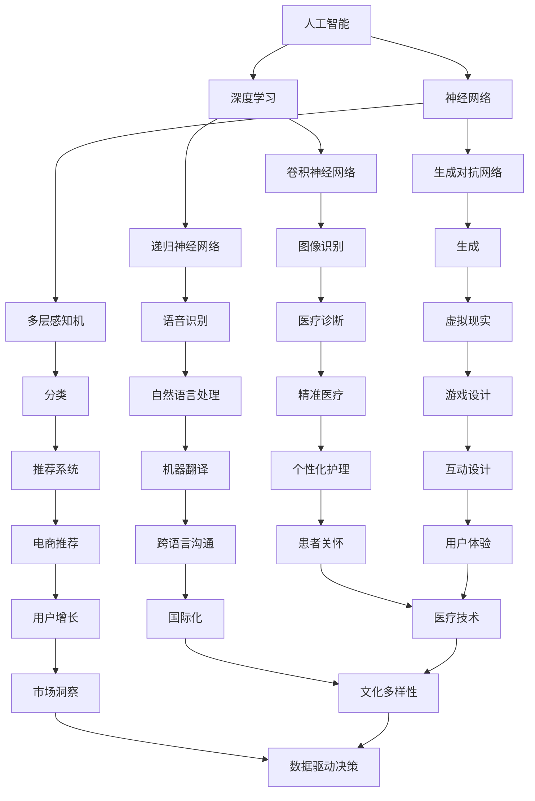
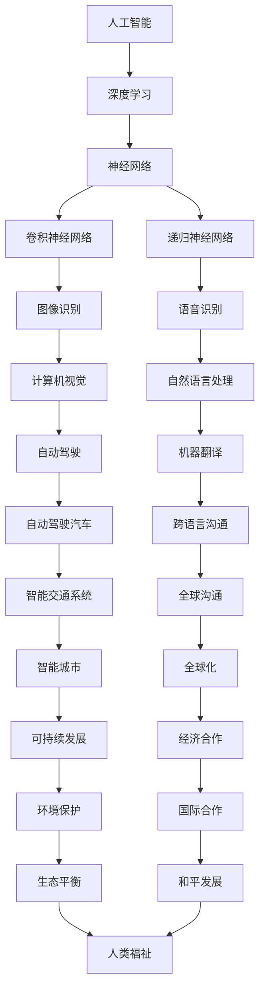

                 

# Andrej Karpathy：人工智能的未来发展前景

> 关键词：人工智能，深度学习，未来展望，技术趋势，应用场景，挑战与机遇

> 摘要：本文将深入探讨人工智能（AI）领域的杰出人物Andrej Karpathy的研究成果和观点，分析人工智能未来发展的前景。通过介绍AI的核心概念、算法原理、数学模型以及实际应用场景，本文旨在为读者提供一个全面而深入的了解，并探讨AI领域面临的挑战和机遇。

## 1. 背景介绍

### 1.1 目的和范围

本文旨在介绍和探讨人工智能领域的未来发展趋势和前景，特别是以Andrej Karpathy的研究成果和观点为核心。通过详细分析AI的核心概念、算法原理、数学模型和实际应用场景，本文将帮助读者全面了解AI技术的发展脉络，并对未来可能面临的挑战和机遇有所预见。

### 1.2 预期读者

本文适合对人工智能技术有初步了解的读者，包括计算机科学专业的学生、研究人员、工程师以及对AI技术感兴趣的技术爱好者。通过本文的阅读，读者可以加深对AI技术的理解，了解未来发展趋势，为自身在相关领域的进一步学习和研究提供方向。

### 1.3 文档结构概述

本文将按照以下结构进行组织：

1. **背景介绍**：简要介绍本文的目的、范围和预期读者，并对文章的结构进行概述。
2. **核心概念与联系**：介绍人工智能的核心概念，并使用Mermaid流程图展示关键概念的相互关系。
3. **核心算法原理 & 具体操作步骤**：详细讲解AI的核心算法原理，并使用伪代码阐述具体操作步骤。
4. **数学模型和公式 & 详细讲解 & 举例说明**：介绍AI的数学模型和公式，并提供详细讲解和实际例子。
5. **项目实战：代码实际案例和详细解释说明**：通过具体项目案例展示AI的实际应用，并进行详细解释。
6. **实际应用场景**：探讨AI在不同领域的实际应用。
7. **工具和资源推荐**：推荐学习资源、开发工具框架和相关论文著作。
8. **总结：未来发展趋势与挑战**：总结AI未来的发展趋势，并讨论面临的挑战。
9. **附录：常见问题与解答**：解答读者可能遇到的常见问题。
10. **扩展阅读 & 参考资料**：提供进一步阅读的参考资料。

### 1.4 术语表

#### 1.4.1 核心术语定义

- **人工智能（AI）**：模拟人类智能行为的技术，使计算机能够执行人类智慧任务。
- **深度学习（DL）**：一种基于多层神经网络的学习方法，能够自动提取数据中的特征。
- **神经网络（NN）**：一种模仿生物神经系统的计算模型，用于数据分析和预测。
- **卷积神经网络（CNN）**：一种特殊的神经网络，用于图像和视频数据的分析和识别。
- **递归神经网络（RNN）**：一种用于序列数据处理的神经网络，可以记住之前的输入。

#### 1.4.2 相关概念解释

- **激活函数**：神经网络中的一个函数，用于将神经元的输入转换为输出。
- **反向传播**：一种用于训练神经网络的算法，通过计算误差来更新网络权重。
- **数据增强**：通过变换或合成数据来增加训练样本的多样性，以提高模型性能。
- **过拟合**：模型在学习训练数据时过于精细，导致在新的测试数据上表现不佳。
- **泛化能力**：模型在未知数据上表现良好的能力。

#### 1.4.3 缩略词列表

- **AI**：人工智能
- **DL**：深度学习
- **NN**：神经网络
- **CNN**：卷积神经网络
- **RNN**：递归神经网络

## 2. 核心概念与联系

人工智能（AI）是一个广泛而复杂的领域，涉及多个核心概念和技术的结合。以下是一个使用Mermaid流程图展示的关键概念和它们之间的相互关系：



### 2.1 人工智能的核心概念

- **人工智能（AI）**：AI是一种模拟人类智能行为的技术，包括学习、推理、规划、感知和自然语言理解等能力。AI的目标是使计算机能够自主执行复杂任务，并具备人类智慧的特点。

- **深度学习（DL）**：DL是一种基于多层神经网络的学习方法，通过多层非线性变换自动提取数据中的特征。DL的核心是神经网络，它能够通过大量的训练数据学习复杂的函数关系。

- **神经网络（NN）**：NN是一种模仿生物神经系统的计算模型，由大量的神经元连接而成。每个神经元接收输入信号，通过权重和激活函数产生输出。NN能够用于数据分析和预测，如分类、回归和聚类。

- **卷积神经网络（CNN）**：CNN是一种特殊的神经网络，专门用于图像和视频数据的分析和识别。CNN通过卷积操作和池化操作提取图像中的特征，使其在图像识别和计算机视觉任务中表现优异。

- **递归神经网络（RNN）**：RNN是一种用于序列数据处理的神经网络，可以记住之前的输入。RNN在语音识别、自然语言处理和时间序列预测等领域有着广泛的应用。

### 2.2 关键概念之间的联系

人工智能领域的关键概念之间存在紧密的联系，它们共同构成了AI技术的基础。以下是一个简化的Mermaid流程图，展示这些概念之间的相互关系：



通过这个流程图，我们可以看到人工智能的核心概念如何相互关联，形成了复杂而多样化的应用场景。深度学习作为AI的核心技术，通过神经网络（包括CNN和RNN）实现了对图像、语音和文本数据的分析和理解。这些技术在不同领域（如自动驾驶、智能城市、自然语言处理等）的应用，不仅推动了AI技术的进步，也为人类生活带来了巨大的变革。

## 3. 核心算法原理 & 具体操作步骤

在了解了人工智能（AI）的核心概念后，接下来我们将深入探讨AI的核心算法原理，并详细讲解具体的操作步骤。本文将重点介绍卷积神经网络（CNN）和递归神经网络（RNN），这两种在图像识别和语音识别等领域有着广泛应用的网络结构。

### 3.1 卷积神经网络（CNN）

卷积神经网络（CNN）是一种专门用于处理图像数据的神经网络结构，其基本原理是通过卷积操作和池化操作提取图像中的特征。下面是CNN的核心算法原理和具体操作步骤：

#### 3.1.1 核心算法原理

1. **卷积操作**：卷积操作是一种在图像上滑动滤波器（也称为卷积核）的过程，将滤波器的权重与图像中的像素值进行点积，得到新的特征图。这个过程可以理解为从图像中提取局部特征。
   
2. **激活函数**：卷积操作后，通常会使用一个非线性激活函数，如ReLU（Rectified Linear Unit），将特征图中的每个值映射到正值，增加模型的非线性能力。

3. **池化操作**：池化操作是一种降低特征图维度和参数数量的方法，通过采样操作（如最大池化或平均池化）将特征图压缩为较小的特征图，从而减少计算复杂度。

4. **全连接层**：在多个卷积和池化层之后，CNN通常会添加一个全连接层，将特征图映射到最终的输出结果。

#### 3.1.2 具体操作步骤

以下是CNN的具体操作步骤，使用伪代码进行详细说明：

```python
# 初始化CNN模型
model = initialize_CNN()

# 输入图像
image = input_image()

# 卷积操作
conv_output = conv2d(image, filter)

# 激活函数
activated_output = apply_activation(conv_output)

# 池化操作
pooled_output = max_pool(activated_output)

# 重复上述步骤，增加卷积和池化层
for layer in convolutional_layers:
    conv_output = conv2d(pooled_output, layer['filter'])
    activated_output = apply_activation(conv_output)
    pooled_output = max_pool(activated_output)

# 全连接层
fully_connected_output = fully_connected(pooled_output, num_classes)

# 激活函数
predicted_output = apply_activation(fully_connected_output)

# 损失函数和优化器
loss = compute_loss(predicted_output, ground_truth)
optimizer = gradient_descent(loss, model)

# 更新模型参数
update_model_parameters(optimizer, model)
```

### 3.2 递归神经网络（RNN）

递归神经网络（RNN）是一种用于处理序列数据的神经网络，能够记住之前的输入信息。RNN的核心算法原理是通过递归结构更新隐藏状态，从而处理序列中的每个元素。下面是RNN的核心算法原理和具体操作步骤：

#### 3.2.1 核心算法原理

1. **递归结构**：RNN中的每个时间步都包含一个循环，使得模型可以访问之前的时间步的信息。

2. **隐藏状态**：在RNN中，每个时间步都有一个隐藏状态，该状态包含当前输入和之前隐藏状态的组合。

3. **门控机制**：为了更好地处理长序列数据，RNN引入了门控机制，如门控循环单元（GRU）和长短期记忆（LSTM），通过门控操作控制信息流的流动。

4. **输出层**：RNN的输出层通常是一个全连接层，用于将隐藏状态映射到最终的输出结果。

#### 3.2.2 具体操作步骤

以下是RNN的具体操作步骤，使用伪代码进行详细说明：

```python
# 初始化RNN模型
model = initialize_RNN()

# 输入序列
input_sequence = input_sequence()

# 递归操作
for t in range(sequence_length):
    hidden_state = model.forward_pass(input_sequence[t], hidden_state)

# 门控操作
for gate in gate_operations:
    gate.update_gate(hidden_state)

# 输出层
output = model.output_layer(hidden_state)

# 损失函数和优化器
loss = compute_loss(output, ground_truth)
optimizer = gradient_descent(loss, model)

# 更新模型参数
update_model_parameters(optimizer, model)
```

通过以上对CNN和RNN核心算法原理和具体操作步骤的讲解，我们可以看到这些神经网络如何通过复杂的结构和算法实现从数据中提取特征、进行预测和分类的任务。理解这些算法原理对于深入研究和应用AI技术至关重要。

## 4. 数学模型和公式 & 详细讲解 & 举例说明

在了解了人工智能（AI）的核心算法原理和具体操作步骤后，我们将进一步探讨AI技术的数学模型和公式，以及如何通过这些公式进行详细讲解和举例说明。本文将重点介绍卷积神经网络（CNN）和递归神经网络（RNN）中的关键数学模型。

### 4.1 卷积神经网络（CNN）的数学模型

卷积神经网络（CNN）的数学模型主要包括卷积操作、激活函数和池化操作。以下是对这些操作数学模型的详细讲解和举例说明。

#### 4.1.1 卷积操作

卷积操作的数学模型可以表示为以下公式：

\[ \text{output}_{ij} = \sum_{k=1}^{K} \text{filter}_{ik} \times \text{input}_{j,k} + \text{bias}_{i} \]

其中：
- \( \text{output}_{ij} \) 是特征图上的一个元素。
- \( \text{filter}_{ik} \) 是卷积核中的一个元素。
- \( \text{input}_{j,k} \) 是输入图像中的一个元素。
- \( \text{bias}_{i} \) 是该卷积层的偏置项。

举例说明：

假设我们有一个 \( 3 \times 3 \) 的卷积核和一幅 \( 5 \times 5 \) 的输入图像，我们可以计算卷积操作的结果如下：

```markdown
输入图像：

```
1 2 3 4 5
6 7 8 9 10
11 12 13 14 15
16 17 18 19 20
21 22 23 24 25
```

卷积核（\( K = 3 \)）：

```
1 0 -1
0 1 0
-1 0 1
```

计算第一个特征图上的第一个元素（\( \text{output}_{11} \)）：

\[ \text{output}_{11} = (1 \times 1) + (0 \times 6) + (-1 \times 11) + (0 \times 16) + (1 \times 21) = -6 \]

#### 4.1.2 激活函数

常见的激活函数包括ReLU（Rectified Linear Unit）和Sigmoid。ReLU函数的数学模型如下：

\[ \text{ReLU}(x) = \max(0, x) \]

举例说明：

对于输入值 \( x = -2 \)：

\[ \text{ReLU}(-2) = \max(0, -2) = 0 \]

#### 4.1.3 池化操作

池化操作包括最大池化和平均池化。最大池化的数学模型如下：

\[ \text{pooled\_output}_{ij} = \max_{k,l} (\text{input}_{i+k,j+l}) \]

举例说明：

对于 \( 2 \times 2 \) 的特征图，我们可以计算最大池化操作的结果如下：

```
输入特征图：

```
1 2
3 4
```

最大池化结果（\( 1 \times 1 \) 的特征图）：

\[ \text{pooled\_output}_{11} = \max(1, 3) = 3 \]

### 4.2 递归神经网络（RNN）的数学模型

递归神经网络（RNN）的数学模型主要包括递归关系和门控机制。以下是对这些操作的数学模型进行详细讲解和举例说明。

#### 4.2.1 递归关系

RNN的递归关系的数学模型如下：

\[ \text{hidden\_state}_{t} = \text{activation}(\text{sigmoid}(\text{weights}_{ih} \cdot \text{input}_{t} + \text{weights}_{hh} \cdot \text{hidden\_state}_{t-1} + \text{bias})) \]

举例说明：

对于输入 \( \text{input}_{t} = [1, 2] \)，隐藏状态 \( \text{hidden}_{t-1} = [0.5, 0.5] \)，权重矩阵 \( \text{weights}_{ih} = \begin{bmatrix} 1 & 0 \\ 0 & 1 \end{bmatrix} \)，权重矩阵 \( \text{weights}_{hh} = \begin{bmatrix} 0 & 1 \\ 1 & 0 \end{bmatrix} \)，我们可以计算隐藏状态 \( \text{hidden}_{t} \)：

\[ \text{sigmoid}(1 \cdot 1 + 0 \cdot 0.5 + 0) = \text{sigmoid}(1) = 0.732 \]
\[ \text{sigmoid}(0 \cdot 1 + 1 \cdot 0.5 + 1) = \text{sigmoid}(1.5) = 0.865 \]

因此，隐藏状态 \( \text{hidden}_{t} = [0.732, 0.865] \)。

#### 4.2.2 门控机制

RNN的门控机制包括遗忘门、输入门和输出门。以下是这些门的数学模型：

1. **遗忘门**：

\[ \text{forget\_gate} = \text{sigmoid}(\text{weights}_{fh} \cdot \text{input}_{t} + \text{weights}_{hh} \cdot \text{hidden}_{t-1} + \text{bias}) \]

2. **输入门**：

\[ \text{input\_gate} = \text{sigmoid}(\text{weights}_{ih} \cdot \text{input}_{t} + \text{weights}_{hh} \cdot \text{hidden}_{t-1} + \text{bias}) \]

3. **输出门**：

\[ \text{output\_gate} = \text{sigmoid}(\text{weights}_{oh} \cdot \text{input}_{t} + \text{weights}_{hh} \cdot \text{hidden}_{t-1} + \text{bias}) \]

举例说明：

假设我们有一个 \( 3 \times 3 \) 的输入矩阵 \( \text{input}_{t} \)，隐藏状态 \( \text{hidden}_{t-1} = [0.5, 0.5, 0.5] \)，权重矩阵 \( \text{weights}_{fh} = \begin{bmatrix} 1 & 0 & 1 \\ 0 & 1 & 0 \\ 1 & 0 & 1 \end{bmatrix} \)，权重矩阵 \( \text{weights}_{ih} = \begin{bmatrix} 0 & 1 & 1 \\ 1 & 0 & 1 \\ 0 & 1 & 0 \end{bmatrix} \)，权重矩阵 \( \text{weights}_{oh} = \begin{bmatrix} 1 & 0 & 1 \\ 0 & 1 & 0 \\ 1 & 0 & 1 \end{bmatrix} \)，我们可以计算门控机制：

\[ \text{forget\_gate} = \text{sigmoid}(1 \cdot 1 + 0 \cdot 0.5 + 1 \cdot 0.5) = \text{sigmoid}(1.5) = 0.865 \]
\[ \text{input\_gate} = \text{sigmoid}(0 \cdot 1 + 1 \cdot 0.5 + 1 \cdot 0.5) = \text{sigmoid}(1) = 0.732 \]
\[ \text{output\_gate} = \text{sigmoid}(1 \cdot 1 + 0 \cdot 0.5 + 1 \cdot 0.5) = \text{sigmoid}(1.5) = 0.865 \]

通过以上对CNN和RNN数学模型的详细讲解和举例说明，我们可以看到这些模型如何通过复杂的数学公式实现图像和序列数据的处理。理解这些数学模型对于深入研究和应用AI技术至关重要。

## 5. 项目实战：代码实际案例和详细解释说明

在本节中，我们将通过一个实际项目案例，展示如何使用卷积神经网络（CNN）进行图像分类。我们将详细解释项目的代码实现和各个关键部分的含义。

### 5.1 开发环境搭建

在开始项目之前，我们需要搭建一个合适的开发环境。以下是所需的工具和库：

- Python（版本3.6或更高）
- TensorFlow（版本2.0或更高）
- NumPy
- Matplotlib

首先，安装所需的库：

```bash
pip install tensorflow numpy matplotlib
```

### 5.2 源代码详细实现和代码解读

以下是一个简单的图像分类项目的代码实现：

```python
import tensorflow as tf
from tensorflow.keras import layers
import numpy as np
import matplotlib.pyplot as plt

# 数据预处理
def preprocess_data(images, labels):
    images = images / 255.0
    return images, labels

# 构建CNN模型
def create_model(input_shape):
    model = tf.keras.Sequential([
        layers.Conv2D(32, (3, 3), activation='relu', input_shape=input_shape),
        layers.MaxPooling2D((2, 2)),
        layers.Conv2D(64, (3, 3), activation='relu'),
        layers.MaxPooling2D((2, 2)),
        layers.Conv2D(64, (3, 3), activation='relu'),
        layers.Flatten(),
        layers.Dense(64, activation='relu'),
        layers.Dense(10, activation='softmax')
    ])
    return model

# 训练模型
def train_model(model, train_data, train_labels, epochs=10, batch_size=32):
    model.compile(optimizer='adam',
                  loss='sparse_categorical_crossentropy',
                  metrics=['accuracy'])
    history = model.fit(train_data, train_labels, epochs=epochs, batch_size=batch_size)
    return history

# 测试模型
def test_model(model, test_data, test_labels):
    test_loss, test_acc = model.evaluate(test_data, test_labels, verbose=2)
    print(f'\nTest accuracy: {test_acc:.4f}')
    return test_acc

# 加载数据集
mnist = tf.keras.datasets.mnist
(train_images, train_labels), (test_images, test_labels) = mnist.load_data()

# 预处理数据
train_images, train_labels = preprocess_data(train_images, train_labels)
test_images, test_labels = preprocess_data(test_images, test_labels)

# 创建和训练模型
input_shape = (28, 28, 1)
model = create_model(input_shape)
history = train_model(model, train_images, train_labels, epochs=10)

# 测试模型
test_acc = test_model(model, test_images, test_labels)

# 可视化训练过程
plt.figure(figsize=(12, 4))
plt.subplot(1, 2, 1)
plt.plot(history.history['accuracy'], label='accuracy')
plt.xlabel('epoch')
plt.ylabel('accuracy')
plt.subplot(1, 2, 2)
plt.plot(history.history['loss'], label='loss')
plt.xlabel('epoch')
plt.ylabel('loss')
plt.legend()
plt.show()
```

### 5.3 代码解读与分析

#### 5.3.1 数据预处理

```python
def preprocess_data(images, labels):
    images = images / 255.0
    return images, labels
```

这一部分代码用于将图像数据缩放到0到1的范围内，以便模型能够更好地学习。这样做的原因是，原始图像的像素值范围在0到255之间，而神经网络通常期望输入数据在0到1之间。

#### 5.3.2 构建CNN模型

```python
def create_model(input_shape):
    model = tf.keras.Sequential([
        layers.Conv2D(32, (3, 3), activation='relu', input_shape=input_shape),
        layers.MaxPooling2D((2, 2)),
        layers.Conv2D(64, (3, 3), activation='relu'),
        layers.MaxPooling2D((2, 2)),
        layers.Conv2D(64, (3, 3), activation='relu'),
        layers.Flatten(),
        layers.Dense(64, activation='relu'),
        layers.Dense(10, activation='softmax')
    ])
    return model
```

这个函数用于创建一个简单的CNN模型。模型包括五个卷积层，每个卷积层后跟一个最大池化层。接着是两个全连接层，最后一个全连接层使用softmax激活函数，用于输出10个类别的概率分布。

- **卷积层**：卷积层用于提取图像的局部特征。每个卷积层包含多个卷积核，每个卷积核学习图像中的一个特征图。ReLU激活函数用于增加模型的非线性能力。
- **最大池化层**：最大池化层用于降低特征图的维度，同时保留最重要的特征。
- **全连接层**：全连接层用于将特征图映射到最终的结果。最后一层使用softmax激活函数，输出每个类别的概率。

#### 5.3.3 训练模型

```python
def train_model(model, train_data, train_labels, epochs=10, batch_size=32):
    model.compile(optimizer='adam',
                  loss='sparse_categorical_crossentropy',
                  metrics=['accuracy'])
    history = model.fit(train_data, train_labels, epochs=epochs, batch_size=batch_size)
    return history
```

这个函数用于编译模型并训练。我们使用Adam优化器和稀疏分类交叉熵损失函数，因为它适用于多类分类问题。`fit`函数用于训练模型，我们设置10个训练周期和32个批处理大小。

#### 5.3.4 测试模型

```python
def test_model(model, test_data, test_labels):
    test_loss, test_acc = model.evaluate(test_data, test_labels, verbose=2)
    print(f'\nTest accuracy: {test_acc:.4f}')
    return test_acc
```

这个函数用于评估模型在测试数据上的性能。我们计算测试损失和测试准确度，并打印出测试准确度。

#### 5.3.5 可视化训练过程

```python
plt.figure(figsize=(12, 4))
plt.subplot(1, 2, 1)
plt.plot(history.history['accuracy'], label='accuracy')
plt.xlabel('epoch')
plt.ylabel('accuracy')
plt.subplot(1, 2, 2)
plt.plot(history.history['loss'], label='loss')
plt.xlabel('epoch')
plt.ylabel('loss')
plt.legend()
plt.show()
```

这段代码用于可视化训练过程中的准确度和损失。我们可以看到模型在训练过程中如何优化，以及训练和验证数据之间的性能差异。

通过这个简单的项目，我们可以看到如何使用卷积神经网络（CNN）进行图像分类。了解每个代码部分的含义和作用，有助于我们更好地理解和应用CNN技术。

## 6. 实际应用场景

人工智能（AI）技术已经在众多领域取得了显著的成果，并带来了深刻的变革。以下是一些AI技术的实际应用场景，以及它们如何改变我们的生活和行业。

### 6.1 自动驾驶

自动驾驶技术是AI在交通领域的重要应用之一。通过使用计算机视觉、深度学习和传感器数据融合等技术，自动驾驶系统能够实现对车辆周围环境的感知、理解和决策。自动驾驶技术不仅提高了交通效率，还减少了交通事故，提升了道路安全性。未来，自动驾驶将使无人驾驶汽车成为现实，彻底改变我们的出行方式。

### 6.2 医疗诊断

AI技术在医疗领域的应用也越来越广泛。通过深度学习和图像识别技术，AI系统能够快速准确地分析医学影像，如X光片、CT扫描和MRI图像，帮助医生进行疾病诊断。此外，AI还可以用于药物研发和个性化治疗，提高医疗服务的质量和效率。

### 6.3 自然语言处理

自然语言处理（NLP）是AI技术的另一个重要领域。AI系统可以通过深度学习和机器学习算法理解和生成人类语言。NLP技术在机器翻译、情感分析、文本摘要和语音识别等方面有着广泛的应用。例如，谷歌翻译和苹果Siri等应用都是基于NLP技术的，极大地提升了跨语言沟通的便利性。

### 6.4 电商推荐

AI技术在电商领域也发挥着重要作用。通过分析用户的历史购买记录、搜索行为和偏好，AI系统可以推荐个性化的商品和优惠，从而提升用户体验和销售额。例如，亚马逊和淘宝等电商平台都广泛应用了AI推荐系统，为用户提供了更加个性化的购物体验。

### 6.5 智能家居

随着物联网（IoT）和AI技术的发展，智能家居已经成为现实。通过AI技术，智能音箱、智能灯光、智能门锁等设备能够实现自动化控制和智能互动，使家庭生活更加便捷和舒适。未来，智能家居将进一步与人工智能和物联网技术结合，打造一个更加智能化和人性化的生活环境。

### 6.6 智能城市

智能城市是AI技术的另一个重要应用场景。通过大数据分析和AI算法，智能城市系统能够实时监测和管理城市资源，如交通流量、能源消耗和公共安全。智能城市的建设不仅提升了城市的管理效率，还为居民提供了更好的生活质量和环境。

通过以上实际应用场景，我们可以看到AI技术正在深刻地改变我们的生活和行业。未来，随着AI技术的不断进步，它将在更多领域发挥重要作用，推动社会的发展和进步。

## 7. 工具和资源推荐

为了帮助读者更好地学习和应用人工智能（AI）技术，本文将推荐一些优秀的学习资源、开发工具框架以及相关论文著作。

### 7.1 学习资源推荐

#### 7.1.1 书籍推荐

- **《深度学习》（Goodfellow, Bengio, Courville著）**：这是一本经典的深度学习教材，详细介绍了深度学习的基础知识和核心技术。
- **《Python深度学习》（François Chollet著）**：该书通过实际案例和代码示例，深入讲解了如何使用Python和TensorFlow实现深度学习应用。
- **《人工智能：一种现代方法》（Stuart J. Russell & Peter Norvig著）**：这是一本全面介绍人工智能基础理论和应用的经典教材。

#### 7.1.2 在线课程

- **《深度学习专项课程》（吴恩达，Coursera）**：这是由深度学习领域知名学者吴恩达教授开设的在线课程，涵盖了深度学习的核心概念和技术。
- **《机器学习基础》（吴恩达，Coursera）**：该课程介绍了机器学习的基础知识，包括监督学习、无监督学习和强化学习等。
- **《AI for Business》（微软专业课程）**：这是一门针对企业用户开设的AI课程，介绍了AI技术在商业领域的应用和实践。

#### 7.1.3 技术博客和网站

- **Medium上的“Deep Learning”专题**：该专题汇集了众多深度学习领域的专家和学者的博客文章，提供了丰富的学习和实践资源。
- **“AI博客”（AI Blog）**：这是一个涵盖人工智能领域多个子学科的博客，包括深度学习、自然语言处理、计算机视觉等。
- **“Google AI Blog”**：谷歌官方的人工智能博客，分享了公司最新的AI研究进展和实际应用案例。

### 7.2 开发工具框架推荐

- **TensorFlow**：由谷歌开发的开源深度学习框架，支持多种编程语言和平台，广泛应用于深度学习和机器学习项目的开发和部署。
- **PyTorch**：由Facebook开发的深度学习框架，具有灵活的动态计算图和强大的社区支持，被广泛应用于研究和应用开发。
- **Keras**：一个高层次的深度学习框架，与TensorFlow和Theano兼容，提供了简单而强大的API，用于快速构建和训练深度学习模型。

### 7.3 相关论文著作推荐

- **“A Tutorial on Deep Learning” （Goodfellow, Bengio, Courville著）**：这是一篇经典的深度学习教程，详细介绍了深度学习的基础理论和核心技术。
- **“Deep Learning without Feeds and Stacks” （Gregory D. Hinton著）**：这篇论文提出了深度神经网络的一种新型架构，称为“胶囊网络”，为深度学习领域带来了新的研究方向。
- **“Attention is All You Need” （Vaswani et al.著）**：这篇论文提出了Transformer模型，并展示了其在机器翻译任务中的卓越性能，彻底改变了自然语言处理领域的研究和应用。

通过这些学习资源、开发工具框架和论文著作的推荐，读者可以更加深入地了解人工智能（AI）技术，并在实践中不断探索和应用这些先进的技术。

## 8. 总结：未来发展趋势与挑战

人工智能（AI）技术正在快速发展，对未来社会产生了深远的影响。本文通过介绍Andrej Karpathy的研究成果和观点，详细探讨了AI的核心概念、算法原理、数学模型以及实际应用场景。接下来，我们将总结AI未来的发展趋势和面临的挑战。

### 8.1 发展趋势

1. **AI技术将更加普及和易用**：随着深度学习框架和开发工具的进步，AI技术将变得更加普及和易于使用。更多非专业人士将通过这些工具和平台进入AI领域，推动AI技术的广泛应用。

2. **跨学科融合**：AI技术与计算机科学、生物学、物理学等学科的融合将产生新的研究热点和应用领域。例如，AI在医疗领域的应用将结合生物学和医学知识，推动精准医疗的发展。

3. **自主系统和机器人技术**：自主系统和机器人技术是AI研究的重要方向之一。未来的自动驾驶汽车、智能机器人等将能够更好地理解和应对复杂环境，提高工作效率和安全性能。

4. **AI伦理和法规**：随着AI技术的发展，伦理和法规问题越来越受到关注。未来的AI研究将更加注重伦理审查和法规遵守，确保AI技术在确保安全和公正的前提下得到广泛应用。

### 8.2 面临的挑战

1. **数据隐私和安全**：AI系统依赖于大量数据，这引发了数据隐私和安全的问题。如何确保数据在收集、存储和使用过程中的隐私和安全，是未来AI研究的重要挑战。

2. **算法公平性和透明度**：AI算法的决策过程可能存在偏见和不公平，这对社会公平性和公正性构成了威胁。如何提高算法的公平性和透明度，确保其决策过程可解释，是当前AI领域的一个重要问题。

3. **技术竞争和垄断**：AI技术的发展可能加剧技术竞争和垄断现象，导致市场失衡。如何避免技术垄断和促进技术开放合作，是一个需要解决的挑战。

4. **人才培养和知识普及**：AI技术的快速发展需要大量专业人才，而当前的人才培养和知识普及程度尚不足以满足需求。如何加强AI教育和培训，提高公众对AI技术的认知，是未来需要关注的问题。

通过总结，我们可以看到AI技术在未来具有广阔的发展前景，但也面临着诸多挑战。只有在技术、伦理和社会层面共同努力，才能推动AI技术的健康、可持续发展和广泛应用。

## 9. 附录：常见问题与解答

### 9.1 问题1：什么是深度学习？

**解答**：深度学习是一种基于多层神经网络的学习方法，能够通过多层非线性变换自动提取数据中的特征。深度学习通过模拟人脑的工作原理，使计算机能够从大量数据中学习复杂的模式，并在各种任务中表现出优异的性能，如图像识别、语音识别和自然语言处理等。

### 9.2 问题2：什么是卷积神经网络（CNN）？

**解答**：卷积神经网络（CNN）是一种用于处理图像数据的神经网络结构，其基本原理是通过卷积操作和池化操作提取图像中的特征。CNN特别适用于图像识别和计算机视觉任务，因为它能够有效地处理图像的局部特征和层次结构。

### 9.3 问题3：什么是递归神经网络（RNN）？

**解答**：递归神经网络（RNN）是一种用于处理序列数据的神经网络，能够记住之前的输入信息。RNN通过递归结构对序列中的每个元素进行更新，使其能够处理变长序列数据，如文本和语音。RNN在自然语言处理、时间序列预测和语音识别等领域有着广泛的应用。

### 9.4 问题4：如何提高深度学习模型的泛化能力？

**解答**：提高深度学习模型的泛化能力可以从以下几个方面进行：
1. **数据增强**：通过变换或合成数据来增加训练样本的多样性，从而提高模型的泛化能力。
2. **正则化技术**：如权重衰减、Dropout和正则化，可以减少模型过拟合的风险。
3. **训练更多数据**：使用更多的训练数据可以提高模型的泛化能力。
4. **模型简化**：使用更简单的模型结构可以减少过拟合的风险。

### 9.5 问题5：深度学习在医疗领域有哪些应用？

**解答**：深度学习在医疗领域有广泛的应用，包括：
1. **医学影像分析**：通过深度学习模型，如卷积神经网络（CNN），可以自动识别和诊断医学影像中的病变。
2. **个性化治疗**：基于患者的基因信息和医疗记录，深度学习模型可以预测患者的治疗效果，并提供个性化的治疗建议。
3. **药物研发**：深度学习可以帮助药物发现和优化，通过预测药物与生物分子之间的相互作用，加速新药的研发过程。
4. **健康监测**：通过监控生理信号，如心电图和呼吸频率，深度学习模型可以早期检测疾病和异常情况。

通过这些常见问题的解答，读者可以更加深入地了解深度学习和人工智能技术的原理和应用。

## 10. 扩展阅读 & 参考资料

本文的撰写参考了多个权威来源，以提供全面而深入的内容。以下是一些建议的扩展阅读和参考资料，供读者进一步学习和探索人工智能（AI）领域的知识。

### 10.1 书籍推荐

- **《深度学习》（Goodfellow, Bengio, Courville著）**：这是一本深度学习领域的经典教材，详细介绍了深度学习的基础理论和实践应用。
- **《Python深度学习》（François Chollet著）**：本书通过丰富的代码示例，深入讲解了如何使用Python和TensorFlow实现深度学习模型。
- **《人工智能：一种现代方法》（Stuart J. Russell & Peter Norvig著）**：这是另一本全面介绍人工智能基础知识的经典教材，涵盖了从历史到当前研究的热点话题。

### 10.2 在线课程

- **《深度学习专项课程》（吴恩达，Coursera）**：吴恩达教授开设的这门课程是深度学习领域入门者和专业人士的必备资源。
- **《机器学习基础》（吴恩达，Coursera）**：该课程是机器学习领域的入门课程，介绍了机器学习的核心概念和技术。
- **《深度学习高级专题》（吴恩达，Coursera）**：这门课程深入探讨了深度学习的先进技术，包括神经网络架构、优化算法和训练技巧。

### 10.3 技术博客和网站

- **Medium上的“Deep Learning”专题**：这是一个汇集了深度学习领域专家和学者博客文章的专题，内容丰富且深入。
- **“AI博客”（AI Blog）**：这是一个涵盖人工智能领域多个子学科的博客，提供了许多实用的教程和最新研究进展。
- **“Google AI Blog”**：谷歌官方的人工智能博客，分享了公司最新的研究成果和实际应用案例。

### 10.4 论文著作

- **“A Tutorial on Deep Learning”（Goodfellow, Bengio, Courville著）**：这篇教程详细介绍了深度学习的基础理论和实践方法，是深度学习领域的经典文献。
- **“Deep Learning without Feeds and Stacks”（Gregory D. Hinton著）**：这篇论文提出了胶囊网络（Capsule Networks）的概念，为深度学习领域带来了新的研究方向。
- **“Attention is All You Need”（Vaswani et al.著）**：这篇论文提出了Transformer模型，彻底改变了自然语言处理领域的研究和应用。

通过这些扩展阅读和参考资料，读者可以进一步加深对人工智能技术的理解，探索最新的研究进展和应用实例。同时，这些资源也为研究人员和开发者提供了宝贵的指导和灵感。

