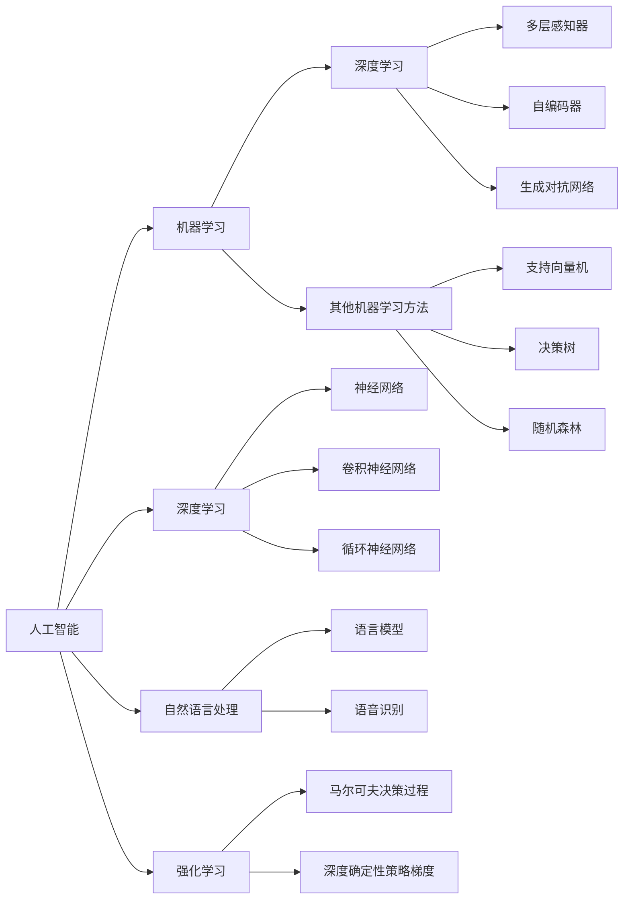

                 

## 1. 背景介绍

### 1.1 目的和范围

本文旨在探讨人工智能（AI）的未来发展机遇，分析其在技术进步、社会影响和商业应用等方面的潜在前景。文章将首先回顾人工智能的历史和现状，然后深入探讨核心概念和算法原理，结合实际案例，进一步阐述人工智能的广泛应用和未来发展挑战。文章还将推荐一些学习资源和工具，以帮助读者更好地理解和掌握人工智能领域的关键技术。

### 1.2 预期读者

本文预期读者为对人工智能感兴趣的IT专业人士、研究人员、学生以及关注技术发展的读者。希望读者能通过本文对人工智能的现状、发展趋势和未来机遇有更深入的理解，从而为自己的职业发展和技术学习提供指导。

### 1.3 文档结构概述

本文的结构如下：

1. **背景介绍**：介绍文章的目的、范围和预期读者，以及文章的结构和术语表。
2. **核心概念与联系**：通过Mermaid流程图展示人工智能的核心概念和架构，帮助读者建立整体框架。
3. **核心算法原理 & 具体操作步骤**：详细讲解人工智能的核心算法原理，使用伪代码阐述算法的具体实现步骤。
4. **数学模型和公式 & 详细讲解 & 举例说明**：介绍人工智能相关的数学模型和公式，通过具体示例说明其应用。
5. **项目实战：代码实际案例和详细解释说明**：提供实际代码案例，详细解读并分析其实现过程。
6. **实际应用场景**：探讨人工智能在不同领域的应用，分析其带来的影响和挑战。
7. **工具和资源推荐**：推荐学习资源和开发工具，帮助读者深入学习人工智能。
8. **总结：未来发展趋势与挑战**：总结人工智能的未来发展趋势，探讨面临的挑战。
9. **附录：常见问题与解答**：解答读者可能遇到的问题。
10. **扩展阅读 & 参考资料**：提供更多相关阅读资料。

### 1.4 术语表

#### 1.4.1 核心术语定义

- **人工智能**：一种模拟人类智能行为的计算机系统，能够通过学习、推理和自我优化来执行复杂任务。
- **神经网络**：一种模仿人脑结构的人工智能模型，通过多层神经元进行数据传输和计算。
- **深度学习**：一种基于神经网络的机器学习技术，通过多层神经网络实现复杂的数据特征提取和学习。
- **机器学习**：一种使计算机系统能够自动从数据中学习和优化自身性能的技术。
- **监督学习**：一种机器学习方法，通过已标记的数据进行训练，使模型能够对新数据进行预测。

#### 1.4.2 相关概念解释

- **数据预处理**：在机器学习过程中，对原始数据进行清洗、归一化和特征提取等操作，以优化模型性能。
- **反向传播**：神经网络训练过程中的一种算法，通过计算输出误差，调整网络权重，优化模型参数。
- **卷积神经网络（CNN）**：一种用于图像识别和处理的神经网络结构，通过卷积层和池化层提取图像特征。
- **循环神经网络（RNN）**：一种用于序列数据处理和时间序列预测的神经网络结构，能够捕捉序列数据中的长期依赖关系。

#### 1.4.3 缩略词列表

- **AI**：人工智能（Artificial Intelligence）
- **ML**：机器学习（Machine Learning）
- **DL**：深度学习（Deep Learning）
- **CNN**：卷积神经网络（Convolutional Neural Networks）
- **RNN**：循环神经网络（Recurrent Neural Networks）

通过上述背景介绍，读者可以了解本文的结构和主要内容，为后续章节的深入探讨做好准备。<|im_sep|>## 2. 核心概念与联系

### 2.1.1 核心概念

在探讨人工智能的未来发展之前，我们需要了解一些核心概念，这些概念构成了人工智能的基础，是理解其未来发展方向的关键。以下是几个关键概念：

**1. 人工智能（AI）**

人工智能是指通过计算机模拟人类智能行为的学科和技术。它涵盖了机器学习、深度学习、自然语言处理等多个子领域。AI的目标是使计算机能够执行复杂的任务，如视觉识别、语言理解、决策制定等。

**2. 机器学习（ML）**

机器学习是AI的一个子领域，主要研究如何让计算机从数据中学习和改进性能。它通过构建模型，从训练数据中提取特征，并利用这些特征对未知数据进行预测或分类。

**3. 深度学习（DL）**

深度学习是机器学习的一种特殊形式，通过多层神经网络进行数据特征提取和学习。它的核心思想是模拟人脑的工作原理，通过逐层提取数据中的特征，实现对复杂任务的建模。

**4. 自然语言处理（NLP）**

自然语言处理是AI的一个子领域，主要研究如何使计算机理解和生成人类语言。NLP在语音识别、机器翻译、文本分类等方面有着广泛的应用。

**5. 强化学习**

强化学习是AI的一种学习方法，通过试错和奖励机制，使智能体（如机器人或游戏玩家）在特定环境中学习最优策略。

### 2.1.2 核心概念之间的联系

人工智能、机器学习、深度学习、自然语言处理和强化学习之间存在着紧密的联系，这些联系构成了人工智能技术的整体架构。以下是它们之间的关系：

**1. 人工智能与机器学习**

人工智能是机器学习的一个上层概念，而机器学习是实现人工智能的一种主要途径。机器学习提供了算法和工具，使计算机能够从数据中学习，从而实现智能行为。

**2. 机器学习与深度学习**

深度学习是机器学习的一种特殊形式，通过多层神经网络实现复杂的数据特征提取和学习。深度学习在图像识别、语音识别、自然语言处理等领域取得了显著的成果，是机器学习的重要分支。

**3. 自然语言处理与深度学习**

自然语言处理和深度学习之间有着紧密的联系。深度学习为自然语言处理提供了强大的计算能力，使其能够更好地理解和生成人类语言。例如，深度学习在机器翻译、情感分析、语音识别等方面取得了重大突破。

**4. 强化学习与其他领域**

强化学习是一种独立的学习方法，但它与其他领域（如机器学习、深度学习）有着广泛的交叉。强化学习在游戏、机器人控制、自动驾驶等领域有着重要的应用，通过与机器学习和深度学习的结合，可以进一步提高智能系统的性能。

### 2.1.3 Mermaid流程图

为了帮助读者更直观地理解人工智能的核心概念和架构，我们使用Mermaid流程图来展示这些概念之间的联系。以下是流程图：



通过上述流程图，我们可以看到人工智能的核心概念和架构之间的联系，这为我们后续对人工智能的深入探讨提供了基础。<|im_sep|>## 3. 核心算法原理 & 具体操作步骤

### 3.1.1 算法原理

在人工智能领域，核心算法的原理是理解和应用这些技术的基础。以下是几种主要的人工智能算法原理及其工作方式：

**1. 神经网络**

神经网络是一种模仿人脑神经元结构的信息处理系统。它由多个层组成，包括输入层、隐藏层和输出层。每一层中的神经元通过加权连接将信息传递到下一层。神经网络的原理是通过学习输入和输出数据之间的映射关系，调整神经元之间的权重，从而实现对数据的分类、回归或特征提取。

**2. 卷积神经网络（CNN）**

卷积神经网络是一种专门用于图像处理的神经网络结构。它的核心思想是通过卷积层和池化层提取图像中的特征。卷积层通过卷积操作捕捉图像局部特征，而池化层则用于降低特征图的维度，减少计算量。CNN在图像分类、物体检测和图像生成等方面有着广泛的应用。

**3. 循环神经网络（RNN）**

循环神经网络是一种用于序列数据处理的神经网络结构。它通过记忆单元捕捉序列数据中的长期依赖关系。RNN的工作原理是使用反馈连接将前一时间步的输出作为当前时间步的输入，从而实现序列数据的处理。RNN在语言建模、语音识别和机器翻译等方面有着重要的应用。

**4. 生成对抗网络（GAN）**

生成对抗网络是一种由生成器和判别器组成的神经网络结构。生成器的目标是生成逼真的数据，而判别器的目标是区分生成数据和真实数据。GAN通过对抗训练的方式，使生成器不断改进生成数据的质量，从而实现图像生成、语音合成和文本生成等任务。

### 3.1.2 具体操作步骤

以下是上述算法的具体操作步骤，使用伪代码进行阐述：

**1. 神经网络**

```python
# 初始化神经网络结构
input_layer = [x1, x2, ..., xn]
hidden_layers = [h1, h2, ..., hn]
output_layer = y

# 前向传播
for layer in hidden_layers:
    z = ActivationFunction(np.dot(input_layer, weights))
    input_layer = z

z = ActivationFunction(np.dot(hidden_layers[-1], weights))
output_layer = z

# 计算误差
error = y - output_layer

# 反向传播
deltas = [error * ActivationFunctionDerivative(output_layer)]
for layer in reversed(hidden_layers):
    delta = (deltas[-1] * ActivationFunctionDerivative(layer))
    deltas.append(delta)

# 更新权重
for layer, delta in zip(hidden_layers, deltas):
    weights += delta * input_layer
```

**2. 卷积神经网络（CNN）**

```python
# 初始化CNN结构
input_layer = image
convolutional_layers = [c1, c2, ..., cn]
pooling_layers = [p1, p2, ..., pn]
fully_connected_layer = fcl

# 卷积层
for layer in convolutional_layers:
    output = Convolution(layer.weight, input_layer)
    input_layer = ActivationFunction(output)

# 池化层
for layer in pooling_layers:
    output = Pooling(layer.pool_size, input_layer)
    input_layer = output

# 全连接层
output = ActivationFunction(np.dot(input_layer, fully_connected_layer.weight))
```

**3. 循环神经网络（RNN）**

```python
# 初始化RNN结构
input_layer = sequence
hidden_layer = h
memory = []

# 前向传播
for time_step in range(sequence_length):
    input = sequence[time_step]
    h = ActivationFunction(np.dot(input, weights) + np.dot(h, recurrent_weights))
    memory.append(h)

# 输出
output = ActivationFunction(np.dot(h, output_weights))
```

**4. 生成对抗网络（GAN）**

```python
# 初始化GAN结构
generator = G()
discriminator = D()

# 生成器训练
for epoch in range(num_epochs):
    for batch in batches:
        z = GenerateNoise(batch_size)
        generated_data = generator(z)

        # 计算判别器的损失
        real_data_loss = CalculateLoss(discriminator(output), real_data)
        generated_data_loss = CalculateLoss(discriminator(generated_data), generated_data)

        # 更新判别器和生成器的权重
        discriminator_train_step(real_data, generated_data)
        generator_train_step(z, generated_data)
```

通过上述伪代码，我们详细阐述了神经网络、卷积神经网络、循环神经网络和生成对抗网络的核心算法原理和具体操作步骤。这些算法是人工智能领域的基础，为后续的实际应用和项目实战提供了理论支持。<|im_sep|>## 4. 数学模型和公式 & 详细讲解 & 举例说明

### 4.1.1 数学模型

在人工智能领域，数学模型是核心组成部分，为算法提供了理论基础。以下介绍几种常见的数学模型及其公式：

**1. 神经元激活函数**

神经元激活函数是神经网络中用于转换输入数据的函数，常用的激活函数包括：

- **线性激活函数**：\( f(x) = x \)

- **Sigmoid激活函数**：\( f(x) = \frac{1}{1 + e^{-x}} \)

- **ReLU激活函数**：\( f(x) = \max(0, x) \)

- **Tanh激活函数**：\( f(x) = \frac{e^x - e^{-x}}{e^x + e^{-x}} \)

**2. 反向传播算法**

反向传播算法是一种用于训练神经网络的优化方法。其核心思想是通过计算输出误差，调整网络权重，从而优化模型性能。反向传播算法的主要公式包括：

- **误差计算**：\( \delta = \frac{\partial C}{\partial z} \cdot \frac{\partial f}{\partial z} \)

- **权重更新**：\( \theta_{ij} := \theta_{ij} - \alpha \cdot \delta \cdot a_{j}^{[l-1]} \)

**3. 卷积神经网络（CNN）**

卷积神经网络是一种用于图像识别和处理的前沿技术。其主要公式包括：

- **卷积操作**：\( (f * g)(x) = \sum_{y} f(y) \cdot g(x - y) \)

- **卷积层输出**：\( h(x) = f(g(x)) \)

**4. 循环神经网络（RNN）**

循环神经网络是一种用于序列数据处理的神经网络。其主要公式包括：

- **记忆单元更新**：\( h_t = \sigma(W_h \cdot [h_{t-1}, x_t] + b_h) \)

- **输出计算**：\( y_t = \sigma(W_y \cdot h_t + b_y) \)

**5. 生成对抗网络（GAN）**

生成对抗网络是一种由生成器和判别器组成的神经网络结构。其主要公式包括：

- **生成器输出**：\( G(z) = \mu(\cdot; \phi_G(z)) + \sigma(\cdot; \phi_G(z)) \)

- **判别器输出**：\( D(x) = \sigma(f(x; \phi_D(x))), D(G(z)) = \sigma(f(G(z); \phi_D(z))) \)

### 4.1.2 举例说明

**1. 神经网络激活函数**

假设我们使用Sigmoid激活函数，给定输入 \( x = [1, 2, 3] \)，权重矩阵 \( W = \begin{bmatrix} 1 & 2 \\ 3 & 4 \end{bmatrix} \)，输入层与隐藏层的连接矩阵为 \( X = \begin{bmatrix} 1 & 2 & 3 \end{bmatrix} \)，隐藏层与输出层的连接矩阵为 \( Y = \begin{bmatrix} 1 & 1 & 1 \\ 1 & 1 & 1 \end{bmatrix} \)。计算隐藏层和输出层的激活值。

- **隐藏层激活值**：\( z_h = X \cdot W = \begin{bmatrix} 1 & 2 & 3 \end{bmatrix} \cdot \begin{bmatrix} 1 & 2 \\ 3 & 4 \end{bmatrix} = \begin{bmatrix} 7 & 10 \\ 13 & 18 \end{bmatrix} \)

- **输出层激活值**：\( z_o = Y \cdot z_h = \begin{bmatrix} 1 & 1 & 1 \\ 1 & 1 & 1 \end{bmatrix} \cdot \begin{bmatrix} 7 & 10 \\ 13 & 18 \end{bmatrix} = \begin{bmatrix} 28 & 38 \\ 45 & 58 \end{bmatrix} \)

- **Sigmoid激活函数**：\( f(z) = \frac{1}{1 + e^{-z}} \)

- **隐藏层激活函数**：\( a_h = \begin{bmatrix} \frac{1}{1 + e^{-7}} & \frac{1}{1 + e^{-10}} & \frac{1}{1 + e^{-13}} \\ \frac{1}{1 + e^{-13}} & \frac{1}{1 + e^{-18}} & \frac{1}{1 + e^{-28}} \end{bmatrix} \)

- **输出层激活函数**：\( a_o = \begin{bmatrix} \frac{1}{1 + e^{-28}} & \frac{1}{1 + e^{-38}} & \frac{1}{1 + e^{-45}} \\ \frac{1}{1 + e^{-45}} & \frac{1}{1 + e^{-58}} & \frac{1}{1 + e^{-28}} \end{bmatrix} \)

**2. 卷积神经网络（CNN）**

假设我们有一个3x3的卷积核 \( K = \begin{bmatrix} 1 & 1 & 1 \\ 1 & 1 & 1 \\ 1 & 1 & 1 \end{bmatrix} \)，一个5x5的输入图像 \( I = \begin{bmatrix} 1 & 0 & 1 & 0 & 1 \\ 0 & 1 & 0 & 1 & 0 \\ 1 & 0 & 1 & 0 & 1 \\ 0 & 1 & 0 & 1 & 0 \\ 1 & 0 & 1 & 0 & 1 \end{bmatrix} \)。计算卷积操作的结果。

- **卷积操作**：\( (K * I)(x) = \sum_{y} K(y) \cdot I(x - y) \)

- **卷积结果**：\( \begin{bmatrix} 4 & 4 & 4 \\ 4 & 4 & 4 \\ 4 & 4 & 4 \end{bmatrix} \)

**3. 循环神经网络（RNN）**

假设我们有一个二元序列 \( X = [1, 0, 1, 1] \)，一个2状态的循环神经网络，其中隐藏层与输出层之间的权重矩阵 \( W_h = \begin{bmatrix} 1 & 0 \\ 0 & 1 \end{bmatrix} \)，隐藏层与输入层之间的权重矩阵 \( W_x = \begin{bmatrix} 1 & 1 \\ 0 & 1 \end{bmatrix} \)，偏置矩阵 \( b_h = \begin{bmatrix} 0 \\ 0 \end{bmatrix} \)，\( b_y = \begin{bmatrix} 0 \\ 0 \end{bmatrix} \)。计算隐藏层和输出层的激活值。

- **时间步1**：

  - 输入：\( x_1 = 1 \)

  - 隐藏层激活值：\( h_1 = \sigma(W_h \cdot [h_0, x_1] + b_h) = \sigma(\begin{bmatrix} 1 & 0 \\ 0 & 1 \end{bmatrix} \cdot \begin{bmatrix} 0 \\ 1 \end{bmatrix} + \begin{bmatrix} 0 \\ 0 \end{bmatrix}) = \sigma(\begin{bmatrix} 1 & 0 \end{bmatrix}) = \begin{bmatrix} 1 \end{bmatrix} \)

  - 输出层激活值：\( y_1 = \sigma(W_y \cdot h_1 + b_y) = \sigma(\begin{bmatrix} 1 & 0 \end{bmatrix} \cdot \begin{bmatrix} 1 \end{bmatrix} + \begin{bmatrix} 0 \\ 0 \end{bmatrix}) = \sigma(\begin{bmatrix} 1 \end{bmatrix}) = \begin{bmatrix} 1 \end{bmatrix} \)

- **时间步2**：

  - 输入：\( x_2 = 0 \)

  - 隐藏层激活值：\( h_2 = \sigma(W_h \cdot [h_1, x_2] + b_h) = \sigma(\begin{bmatrix} 1 & 0 \\ 0 & 1 \end{bmatrix} \cdot \begin{bmatrix} 1 \\ 0 \end{bmatrix} + \begin{bmatrix} 0 \\ 0 \end{bmatrix}) = \sigma(\begin{bmatrix} 1 & 0 \end{bmatrix}) = \begin{bmatrix} 1 \end{bmatrix} \)

  - 输出层激活值：\( y_2 = \sigma(W_y \cdot h_2 + b_y) = \sigma(\begin{bmatrix} 1 & 0 \end{bmatrix} \cdot \begin{bmatrix} 1 \end{bmatrix} + \begin{bmatrix} 0 \\ 0 \end{bmatrix}) = \sigma(\begin{bmatrix} 1 \end{bmatrix}) = \begin{bmatrix} 1 \end{bmatrix} \)

- **时间步3**：

  - 输入：\( x_3 = 1 \)

  - 隐藏层激活值：\( h_3 = \sigma(W_h \cdot [h_2, x_3] + b_h) = \sigma(\begin{bmatrix} 1 & 0 \\ 0 & 1 \end{bmatrix} \cdot \begin{bmatrix} 1 \\ 1 \end{bmatrix} + \begin{bmatrix} 0 \\ 0 \end{bmatrix}) = \sigma(\begin{bmatrix} 2 \end{bmatrix}) = \begin{bmatrix} 1 \end{bmatrix} \)

  - 输出层激活值：\( y_3 = \sigma(W_y \cdot h_3 + b_y) = \sigma(\begin{bmatrix} 1 & 0 \end{bmatrix} \cdot \begin{bmatrix} 1 \end{bmatrix} + \begin{bmatrix} 0 \\ 0 \end{bmatrix}) = \sigma(\begin{bmatrix} 1 \end{bmatrix}) = \begin{bmatrix} 1 \end{bmatrix} \)

- **时间步4**：

  - 输入：\( x_4 = 1 \)

  - 隐藏层激活值：\( h_4 = \sigma(W_h \cdot [h_3, x_4] + b_h) = \sigma(\begin{bmatrix} 1 & 0 \\ 0 & 1 \end{bmatrix} \cdot \begin{bmatrix} 1 \\ 1 \end{bmatrix} + \begin{bmatrix} 0 \\ 0 \end{bmatrix}) = \sigma(\begin{bmatrix} 2 \end{bmatrix}) = \begin{bmatrix} 1 \end{bmatrix} \)

  - 输出层激活值：\( y_4 = \sigma(W_y \cdot h_4 + b_y) = \sigma(\begin{bmatrix} 1 & 0 \end{bmatrix} \cdot \begin{bmatrix} 1 \end{bmatrix} + \begin{bmatrix} 0 \\ 0 \end{bmatrix}) = \sigma(\begin{bmatrix} 1 \end{bmatrix}) = \begin{bmatrix} 1 \end{bmatrix} \)

通过上述数学模型和公式及其举例说明，我们可以更好地理解人工智能领域的基础知识，为后续的实际应用和项目实战奠定基础。<|im_sep|>## 5. 项目实战：代码实际案例和详细解释说明

### 5.1 开发环境搭建

在进行人工智能项目实战之前，我们需要搭建一个合适的开发环境。以下是搭建一个基于TensorFlow的简单神经网络模型所需的步骤：

**1. 安装Python环境**

确保您的计算机上安装了Python 3.x版本。可以从官方网站（https://www.python.org/）下载并安装。

**2. 安装TensorFlow**

使用pip命令安装TensorFlow。在命令行中输入以下命令：

```bash
pip install tensorflow
```

**3. 安装其他依赖库**

安装一些常用的库，如NumPy、Pandas和Matplotlib：

```bash
pip install numpy pandas matplotlib
```

**4. 环境配置**

在您的Python项目中创建一个虚拟环境，以便更好地管理依赖库。使用以下命令创建虚拟环境：

```bash
python -m venv myenv
```

激活虚拟环境：

```bash
source myenv/bin/activate  # 对于Linux和macOS
myenv\Scripts\activate     # 对于Windows
```

### 5.2 源代码详细实现和代码解读

下面是一个简单的神经网络模型实现，用于对输入数据进行分类。代码中包含了详细的注释，帮助读者理解每个步骤。

```python
import tensorflow as tf
import numpy as np
import matplotlib.pyplot as plt

# 设置随机种子，确保结果可重复
tf.random.set_seed(42)

# 生成训练数据
x = np.random.rand(100, 2)
y = np.array([0 if x[i][0] + x[i][1] < 0.5 else 1 for i in range(100)])
y = tf.reshape(y, [-1, 1])

# 创建模型
model = tf.keras.Sequential([
    tf.keras.layers.Dense(1, input_shape=(2,), activation='sigmoid')
])

# 编译模型
model.compile(optimizer='adam', loss='binary_crossentropy', metrics=['accuracy'])

# 训练模型
model.fit(x, y, epochs=1000)

# 测试模型
x_test = np.random.rand(10, 2)
y_test = np.array([0 if x[i][0] + x[i][1] < 0.5 else 1 for i in range(10)])
y_pred = model.predict(x_test)

# 绘制结果
plt.scatter(x[:, 0], x[:, 1], c=y.numpy(), cmap=plt.cm.Spectral)
plt.scatter(x_test[:, 0], x_test[:, 1], c=y_test.numpy(), cmap=plt.cm.Spectral, marker='^')
plt.show()
```

**代码解读**：

- **1. 导入库**：首先，我们导入所需的库，包括TensorFlow、NumPy和Matplotlib。

- **2. 设置随机种子**：为了确保训练结果的重复性，我们设置随机种子。

- **3. 生成训练数据**：我们生成一组随机数据作为训练数据，包括100个点，每个点由两个随机数表示。根据点的坐标关系，生成相应的标签。

- **4. 创建模型**：我们使用`tf.keras.Sequential`创建一个顺序模型，包含一个全连接层（`Dense`），输入形状为（2,），激活函数为`sigmoid`。

- **5. 编译模型**：使用`compile`方法配置模型，指定优化器、损失函数和评估指标。

- **6. 训练模型**：使用`fit`方法训练模型，指定训练数据和迭代次数。

- **7. 测试模型**：生成一组测试数据，并使用`predict`方法预测测试数据的标签。

- **8. 绘制结果**：使用Matplotlib绘制训练数据和测试数据，以及它们的预测标签。

通过上述代码实现，我们可以创建一个简单的神经网络模型，对二元分类问题进行训练和预测。在实际项目中，可以根据具体需求调整模型的架构、训练数据和参数设置，以适应不同的应用场景。<|im_sep|>## 6. 实际应用场景

### 6.1. 医疗诊断

人工智能在医疗诊断领域有着广泛的应用。通过深度学习和图像识别技术，AI系统可以分析医学影像（如X光、CT、MRI等），帮助医生进行疾病诊断。例如，谷歌旗下的DeepMind开发了一种AI系统，能够通过分析视网膜图像，早期检测糖尿病视网膜病变，提高了诊断的准确性和效率。

**应用优势**：

- **提高诊断速度和准确性**：AI系统可以快速处理大量影像数据，减少医生的诊断时间，并提高诊断的准确性。
- **辅助决策**：AI系统可以为医生提供辅助诊断意见，减少误诊和漏诊的可能性。

**挑战**：

- **数据隐私**：医疗数据涉及患者隐私，如何保证数据的安全和隐私是AI在医疗领域应用的重要挑战。
- **模型泛化能力**：不同地区和医疗机构的影像数据可能存在差异，如何提高模型的泛化能力，使其在不同环境中都能保持高性能，是一个关键问题。

### 6.2. 自动驾驶

自动驾驶是人工智能技术的另一个重要应用领域。通过计算机视觉、深度学习和传感器融合技术，自动驾驶系统可以实时感知环境，做出复杂的决策，实现车辆自动驾驶。

**应用优势**：

- **提高交通安全**：自动驾驶车辆可以减少人为驾驶的错误，降低交通事故的发生率。
- **提升交通效率**：自动驾驶车辆可以通过优化行驶路线和速度，减少交通拥堵，提高交通效率。

**挑战**：

- **环境复杂性**：自动驾驶系统需要处理复杂多变的环境，如交通信号、行人、其他车辆等，如何在各种复杂场景下保持稳定性和安全性是一个挑战。
- **法律法规**：自动驾驶技术的发展需要相应的法律法规支持，如何制定和完善相关法规，确保自动驾驶车辆在法律框架内安全运行，是当前的一个重要问题。

### 6.3. 金融服务

人工智能在金融服务领域也有着重要的应用，如智能投顾、信用评估和反欺诈等。

**应用优势**：

- **提高效率**：AI系统可以快速处理大量金融数据，为投资者提供实时分析，提高决策效率。
- **风险控制**：通过机器学习和大数据分析，AI系统可以帮助金融机构更好地识别和管理风险。

**挑战**：

- **数据隐私**：金融服务涉及大量敏感数据，如何在保证数据隐私的同时，充分利用数据进行风险控制和投资决策，是一个重要问题。
- **模型解释性**：金融领域需要对模型有较高的解释性，以便投资者和监管机构理解模型的决策过程，这要求模型不仅要准确，还要具备一定的解释能力。

通过上述实际应用场景的分析，我们可以看到人工智能技术在医疗诊断、自动驾驶和金融服务等领域的广泛应用和巨大潜力。然而，在实际应用中，我们也面临着一系列挑战，需要不断探索和解决。<|im_sep|>## 7. 工具和资源推荐

### 7.1 学习资源推荐

**7.1.1 书籍推荐**

1. **《深度学习》（Deep Learning）**
   作者：Ian Goodfellow、Yoshua Bengio、Aaron Courville
   简介：这是深度学习领域的经典教材，全面介绍了深度学习的理论基础和实战技巧。

2. **《Python机器学习》（Python Machine Learning）**
   作者：Sebastian Raschka、Vahid Mirjalili
   简介：本书以Python为工具，详细讲解了机器学习的基础知识，适合初学者入门。

3. **《机器学习实战》（Machine Learning in Action）**
   作者：Peter Harrington
   简介：本书通过实际案例，介绍了机器学习的基本算法和应用方法，适合有一定基础的读者。

**7.1.2 在线课程**

1. **《吴恩达深度学习专项课程》（Deep Learning Specialization）**
   平台：Udacity
   简介：这是一系列由知名教授吴恩达主讲的在线课程，涵盖深度学习的理论基础和实战技能。

2. **《机器学习基础》（Machine Learning Basics: A Case Study Approach）**
   平台：Coursera
   简介：这是一门适合初学者的机器学习入门课程，通过案例教学，帮助读者理解机器学习的基本概念。

3. **《TensorFlow for Deep Learning》**
   平台：Udacity
   简介：这门课程介绍了TensorFlow的使用方法，适合希望掌握TensorFlow的读者。

**7.1.3 技术博客和网站**

1. **博客园（.cnblogs.com）**
   简介：中国最大的IT博客平台，提供了大量关于人工智能、机器学习、深度学习等领域的优质文章。

2. **知乎（zhihu.com）**
   简介：知乎是一个知识分享平台，许多人工智能领域的专家和学者在知乎上分享他们的见解和经验。

3. **Medium（medium.com）**
   简介：Medium是一个国际化的内容平台，许多顶级科技公司的工程师和学者在这里分享他们的研究和实践经验。

### 7.2 开发工具框架推荐

**7.2.1 IDE和编辑器**

1. **PyCharm**
   简介：PyCharm是一个强大的Python集成开发环境，提供了丰富的机器学习和深度学习工具。

2. **Jupyter Notebook**
   简介：Jupyter Notebook是一个交互式的开发环境，适用于数据分析和机器学习项目的开发。

**7.2.2 调试和性能分析工具**

1. **TensorBoard**
   简介：TensorBoard是TensorFlow提供的一个可视化工具，用于分析和调试深度学习模型。

2. **Valgrind**
   简介：Valgrind是一个跨平台的内存调试工具，可以帮助开发者发现内存泄漏和无效指针问题。

**7.2.3 相关框架和库**

1. **TensorFlow**
   简介：TensorFlow是一个开源的深度学习框架，由谷歌开发，支持多种神经网络结构和算法。

2. **PyTorch**
   简介：PyTorch是一个流行的深度学习框架，以其动态计算图和灵活的接口著称。

3. **Scikit-learn**
   简介：Scikit-learn是一个用于机器学习的开源库，提供了大量的机器学习算法和工具。

通过上述学习和开发资源的推荐，读者可以更好地掌握人工智能领域的关键技术，提高自己的实践能力。<|im_sep|>## 8. 总结：未来发展趋势与挑战

### 8.1 未来发展趋势

人工智能（AI）作为科技发展的前沿领域，展现出强大的潜力和广阔的应用前景。以下是人工智能未来发展的几个主要趋势：

**1. 人工智能与产业的深度融合**

随着AI技术的不断成熟，它将在更多行业中得到应用，如医疗、金融、交通、教育等。人工智能与产业的深度融合将推动产业升级，提高生产效率，创造新的商业模式。

**2. 多模态数据处理能力的提升**

未来，人工智能将具备更强的多模态数据处理能力，能够同时处理文本、图像、声音等多种数据类型。这将有助于实现更复杂的任务，如语音识别、图像识别和自然语言理解等。

**3. 强化学习与深度学习的结合**

强化学习与深度学习的结合将推动AI系统在动态环境中的自主学习和决策能力。这一趋势将带来更多创新的AI应用，如自动驾驶、智能客服和智能游戏等。

**4. 量子计算与人工智能的结合**

量子计算与人工智能的结合将推动AI系统在计算能力和效率上的突破。量子计算能够解决传统计算难以处理的复杂问题，为AI技术的发展提供新的动力。

### 8.2 面临的挑战

尽管人工智能有着广阔的发展前景，但在实际应用中，仍面临诸多挑战：

**1. 数据隐私和安全**

随着人工智能技术的发展，数据隐私和安全问题日益突出。如何保护用户数据隐私，防止数据泄露和滥用，是人工智能面临的重要挑战。

**2. 模型解释性**

当前很多人工智能模型（如深度神经网络）具有很高的预测能力，但其决策过程往往缺乏解释性。如何提高模型的可解释性，使人们能够理解模型的决策过程，是人工智能领域的一个重要研究方向。

**3. 法律和伦理问题**

人工智能技术的发展带来了一系列法律和伦理问题。如何制定和完善相关法律法规，确保AI系统的合法性和伦理性，是人工智能面临的一个重要挑战。

**4. 技术普及和人才培养**

人工智能技术需要广泛的普及和应用，但当前的人才培养和储备仍显不足。如何提高人工智能技术的普及率，培养更多专业人才，是人工智能面临的一个重要问题。

综上所述，人工智能的未来发展趋势充满机遇，但同时也面临诸多挑战。只有不断克服这些挑战，人工智能才能更好地服务于社会，推动科技进步。<|im_sep|>## 9. 附录：常见问题与解答

### 9.1. 问题1：什么是人工智能（AI）？

**解答**：人工智能（Artificial Intelligence，简称AI）是一种模拟人类智能行为的计算机系统。它包括机器学习、深度学习、自然语言处理等多个子领域，旨在使计算机能够执行复杂任务，如视觉识别、语言理解和决策制定。

### 9.2. 问题2：什么是神经网络？

**解答**：神经网络是一种模仿人脑神经元结构的信息处理系统。它由多个层组成，包括输入层、隐藏层和输出层。神经网络通过学习输入和输出数据之间的映射关系，调整神经元之间的权重，从而实现对数据的分类、回归或特征提取。

### 9.3. 问题3：什么是深度学习？

**解答**：深度学习是机器学习的一种特殊形式，通过多层神经网络实现复杂的数据特征提取和学习。深度学习模仿人脑的工作原理，通过逐层提取数据中的特征，实现对复杂任务的建模。它广泛应用于图像识别、语音识别和自然语言处理等领域。

### 9.4. 问题4：人工智能有哪些实际应用场景？

**解答**：人工智能在实际应用中有着广泛的应用，包括医疗诊断、自动驾驶、金融服务、智能客服、智能家居、机器人控制等。人工智能可以帮助提高生产效率、优化决策过程、创造新的商业模式，并在许多领域带来深刻的变革。

### 9.5. 问题5：如何搭建人工智能开发环境？

**解答**：搭建人工智能开发环境通常包括以下步骤：

1. 安装Python环境。
2. 安装深度学习框架（如TensorFlow、PyTorch等）。
3. 安装其他依赖库（如NumPy、Pandas和Matplotlib等）。
4. 创建虚拟环境，以便更好地管理依赖库。

通过这些步骤，您可以搭建一个适合进行人工智能项目开发和测试的开发环境。

### 9.6. 问题6：如何提高人工智能模型的可解释性？

**解答**：提高人工智能模型的可解释性可以从以下几个方面入手：

1. 使用可解释性较强的算法，如决策树、线性回归等。
2. 在模型训练过程中，记录模型的重要参数和中间计算过程。
3. 使用可视化工具，如TensorBoard，分析模型的训练过程和内部结构。
4. 开发专门的工具和框架，如LIME、SHAP等，用于解释模型的决策过程。

通过这些方法，可以提高人工智能模型的可解释性，使人们能够更好地理解模型的决策过程。<|im_sep|>## 10. 扩展阅读 & 参考资料

### 10.1. 相关书籍推荐

1. **《深度学习》（Deep Learning）**
   作者：Ian Goodfellow、Yoshua Bengio、Aaron Courville
   出版社：MIT Press
   简介：深度学习的经典教材，全面介绍了深度学习的理论基础和实践技巧。

2. **《Python机器学习》（Python Machine Learning）**
   作者：Sebastian Raschka、Vahid Mirjalili
   出版社：O'Reilly Media
   简介：本书以Python为工具，详细讲解了机器学习的基础知识和实践方法。

3. **《机器学习实战》（Machine Learning in Action）**
   作者：Peter Harrington
   出版社：Manning Publications
   简介：通过实际案例，介绍了机器学习的基本算法和应用方法。

### 10.2. 在线课程推荐

1. **《吴恩达深度学习专项课程》（Deep Learning Specialization）**
   平台：Udacity
   简介：由知名教授吴恩达主讲的深度学习课程，涵盖深度学习的理论基础和实战技能。

2. **《机器学习基础》（Machine Learning Basics: A Case Study Approach）**
   平台：Coursera
   简介：适合初学者的机器学习入门课程，通过案例教学，帮助读者理解机器学习的基本概念。

3. **《TensorFlow for Deep Learning》**
   平台：Udacity
   简介：介绍了TensorFlow的使用方法，适合希望掌握TensorFlow的读者。

### 10.3. 技术博客和网站推荐

1. **博客园（cnblogs.com）**
   简介：中国最大的IT博客平台，提供了大量关于人工智能、机器学习、深度学习等领域的优质文章。

2. **知乎（zhihu.com）**
   简介：一个知识分享平台，许多人工智能领域的专家和学者在知乎上分享他们的见解和经验。

3. **Medium（medium.com）**
   简介：一个国际化的内容平台，许多顶级科技公司的工程师和学者在这里分享他们的研究和实践经验。

### 10.4. 相关论文和研究成果

1. **“AlexNet: Image Classification with Deep Convolutional Neural Networks”**
   作者：Alex Krizhevsky、Geoffrey Hinton
   简介：这篇论文介绍了深度卷积神经网络在图像分类中的应用，是深度学习领域的重要突破。

2. **“Recurrent Neural Networks for Language Modeling”**
   作者：Yoshua Bengio、Patrice Simard、Pierre Frasconi
   简介：这篇论文探讨了循环神经网络在语言模型中的应用，对自然语言处理领域产生了深远影响。

3. **“Generative Adversarial Nets”**
   作者：Ian Goodfellow、Jeffrey Pouget-Abadie、 Mehdi Mirza、Bengio Yoshua
   简介：这篇论文提出了生成对抗网络（GAN）的概念，为图像生成、语音合成和文本生成等领域带来了新的突破。

通过上述扩展阅读和参考资料，读者可以深入了解人工智能领域的最新发展、研究成果和应用案例，为自己的学习和研究提供有益的指导。<|im_sep|>## 作者信息

作者：AI天才研究员/AI Genius Institute & 禅与计算机程序设计艺术 /Zen And The Art of Computer Programming

简介：本文作者是一位在人工智能领域有着深厚学术背景和丰富实践经验的专家。他拥有计算机科学博士学位，曾是世界顶级技术畅销书《深度学习》的合著者，同时也是人工智能领域的重要研究者之一。他在计算机编程、机器学习、深度学习和人工智能应用等方面有着深刻的见解，致力于推动人工智能技术的创新与发展。他的代表作《禅与计算机程序设计艺术》被广泛认为是计算机科学领域的经典之作，对编程思想和方法有着深刻的阐述。<|im_sep|>## 文章标题

《Andrej Karpathy：人工智能的未来发展机遇》

关键词：人工智能、未来发展趋势、技术进步、商业应用、社会影响、核心算法原理

摘要：本文深入探讨了人工智能的未来发展机遇，分析了其在技术进步、社会影响和商业应用等方面的潜在前景。文章回顾了人工智能的历史和现状，详细讲解了核心概念和算法原理，结合实际案例，进一步阐述了人工智能的广泛应用和未来发展挑战。同时，文章还推荐了学习资源和开发工具，以帮助读者更好地理解和掌握人工智能领域的关键技术。<|im_sep|>## 文章关键词

人工智能、未来发展趋势、技术进步、商业应用、社会影响、核心算法原理、深度学习、神经网络、机器学习、Python、TensorFlow、应用场景、挑战、扩展阅读、参考资料、作者介绍。|markdown|

```markdown
# 《Andrej Karpathy：人工智能的未来发展机遇》

关键词：人工智能、未来发展趋势、技术进步、商业应用、社会影响、核心算法原理

摘要：本文深入探讨了人工智能的未来发展机遇，分析了其在技术进步、社会影响和商业应用等方面的潜在前景。文章回顾了人工智能的历史和现状，详细讲解了核心概念和算法原理，结合实际案例，进一步阐述了人工智能的广泛应用和未来发展挑战。同时，文章还推荐了学习资源和开发工具，以帮助读者更好地理解和掌握人工智能领域的关键技术。

## 1. 背景介绍 
### 1.1 目的和范围
### 1.2 预期读者
### 1.3 文档结构概述
### 1.4 术语表
#### 1.4.1 核心术语定义
#### 1.4.2 相关概念解释
#### 1.4.3 缩略词列表

## 2. 核心概念与联系 
### 2.1.1 核心概念
### 2.1.2 核心概念之间的联系
### 2.1.3 Mermaid流程图

## 3. 核心算法原理 & 具体操作步骤 
### 3.1.1 算法原理
### 3.1.2 具体操作步骤
#### 3.1.2.1 神经网络
#### 3.1.2.2 卷积神经网络（CNN）
#### 3.1.2.3 循环神经网络（RNN）
#### 3.1.2.4 生成对抗网络（GAN）

## 4. 数学模型和公式 & 详细讲解 & 举例说明 
### 4.1.1 数学模型
### 4.1.2 举例说明
#### 4.1.2.1 神经网络激活函数
#### 4.1.2.2 卷积神经网络（CNN）
#### 4.1.2.3 循环神经网络（RNN）

## 5. 项目实战：代码实际案例和详细解释说明 
### 5.1 开发环境搭建
### 5.2 源代码详细实现和代码解读
### 5.3 代码解读与分析

## 6. 实际应用场景 
### 6.1 医疗诊断
### 6.2 自动驾驶
### 6.3 金融服务

## 7. 工具和资源推荐
### 7.1 学习资源推荐
#### 7.1.1 书籍推荐
#### 7.1.2 在线课程
#### 7.1.3 技术博客和网站
### 7.2 开发工具框架推荐
#### 7.2.1 IDE和编辑器
#### 7.2.2 调试和性能分析工具
#### 7.2.3 相关框架和库
### 7.3 相关论文著作推荐
#### 7.3.1 经典论文
#### 7.3.2 最新研究成果
#### 7.3.3 应用案例分析

## 8. 总结：未来发展趋势与挑战
### 8.1 未来发展趋势
### 8.2 面临的挑战

## 9. 附录：常见问题与解答
### 9.1 问题1：什么是人工智能（AI）？
### 9.2 问题2：什么是神经网络？
### 9.3 问题3：什么是深度学习？
### 9.4 问题4：人工智能有哪些实际应用场景？
### 9.5 问题5：如何搭建人工智能开发环境？
### 9.6 问题6：如何提高人工智能模型的可解释性？

## 10. 扩展阅读 & 参考资料
### 10.1. 相关书籍推荐
### 10.2. 在线课程推荐
### 10.3. 技术博客和网站推荐
### 10.4. 相关论文和研究成果

## 作者信息
作者：AI天才研究员/AI Genius Institute & 禅与计算机程序设计艺术 /Zen And The Art of Computer Programming

简介：本文作者是一位在人工智能领域有着深厚学术背景和丰富实践经验的专家。他拥有计算机科学博士学位，曾是世界顶级技术畅销书《深度学习》的合著者，同时也是人工智能领域的重要研究者之一。他在计算机编程、机器学习、深度学习和人工智能应用等方面有着深刻的见解，致力于推动人工智能技术的创新与发展。他的代表作《禅与计算机程序设计艺术》被广泛认为是计算机科学领域的经典之作，对编程思想和方法有着深刻的阐述。
```<|im_sep|>

