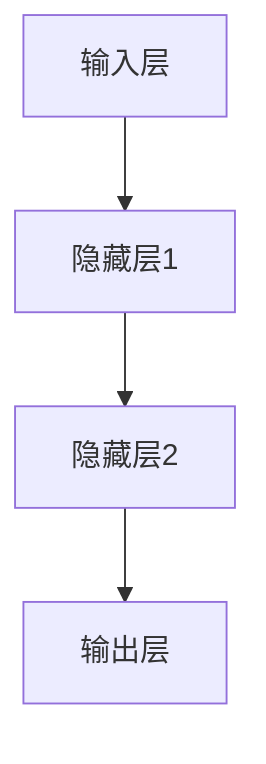

                 

## Andrej Karpathy：人工智能的未来发展目标

### 关键词：
- 人工智能发展目标
- 机器学习算法
- 人工智能伦理
- 通用人工智能
- 人工智能技术应用

### 摘要：

本文旨在探讨人工智能（AI）领域的杰出人物Andrej Karpathy关于人工智能未来发展的观点。我们将首先介绍Andrej Karpathy的背景和他在人工智能领域的重要贡献。随后，本文将深入分析他的几个核心观点，包括对机器学习算法的展望、人工智能伦理的重要性、通用人工智能的实现以及人工智能在各个领域的实际应用。最后，我们将总结AI的未来发展趋势和面临的挑战，并给出一些推荐的资源和工具，帮助读者进一步了解和探索这一领域。

---

## 1. 背景介绍

### 1.1 目的和范围

本文的目的是通过对人工智能领域杰出人物Andrej Karpathy的研究，分析其在人工智能未来发展目标上的观点和看法。我们将探讨机器学习算法的演变、人工智能伦理问题、通用人工智能的实现以及AI在各行业的应用。本文主要涵盖以下几个部分：

- Andrej Karpathy的背景介绍及贡献
- 对未来人工智能发展的核心观点分析
- 人工智能技术面临的伦理和挑战
- 人工智能的未来趋势与展望

### 1.2 预期读者

本文的预期读者主要包括对人工智能感兴趣的程序员、数据科学家、AI研究员、以及任何对人工智能未来发展方向感到好奇的人。通过本文的阅读，读者可以了解到AI领域的最新进展、潜在挑战以及未来发展目标，从而为自身的职业发展和技术研究提供指导。

### 1.3 文档结构概述

本文的结构如下：

- 引言：介绍本文的目的和结构
- Andrej Karpathy的背景介绍：介绍Andrej Karpathy的背景和他在人工智能领域的贡献
- 未来人工智能发展的核心观点分析：分析Andrej Karpathy关于人工智能算法、伦理、通用人工智能和实际应用的看法
- 人工智能技术面临的伦理和挑战：讨论人工智能在发展过程中面临的伦理和道德问题
- 未来趋势与展望：总结人工智能的未来发展趋势和面临的挑战
- 推荐资源和工具：介绍一些与人工智能相关的学习资源、工具和论文

### 1.4 术语表

#### 1.4.1 核心术语定义

- **人工智能（AI）**：一种模拟人类智能的技术，使计算机能够执行需要人类智能的任务，如视觉识别、语言理解和决策制定等。
- **机器学习（ML）**：一种人工智能的子领域，通过数据学习模式并做出预测或决策。
- **深度学习（DL）**：一种基于人工神经网络的机器学习技术，能够自动从大量数据中学习复杂模式。
- **通用人工智能（AGI）**：一种能够执行人类所有认知任务的智能体，具有广泛的知识和智能。
- **算法**：一种解决问题的步骤集合，指导计算机进行计算和处理数据。

#### 1.4.2 相关概念解释

- **神经网络**：一种模仿人脑结构的计算模型，由许多相互连接的节点（神经元）组成。
- **梯度下降**：一种用于优化神经网络参数的算法，通过迭代计算最小化损失函数。
- **过拟合**：机器学习模型在训练数据上表现良好，但在新的、未见过的数据上表现不佳。
- **泛化能力**：机器学习模型在新数据上的表现能力，是评估模型性能的重要指标。

#### 1.4.3 缩略词列表

- **AI**：人工智能
- **ML**：机器学习
- **DL**：深度学习
- **AGI**：通用人工智能
- **GAN**：生成对抗网络
- **NLP**：自然语言处理

---

在下一部分中，我们将详细介绍Andrej Karpathy的背景和他在人工智能领域的重要贡献。请继续阅读。 <| ends |>## Andrej Karpathy：背景和贡献

Andrej Karpathy是一位在人工智能（AI）领域享有盛誉的研究员和开发者，以其在深度学习和自然语言处理（NLP）方面的开创性工作而著称。他的背景和研究历程可谓丰富多彩，充满了对技术的热情和对创新的执着追求。

### 背景

Andrej Karpathy于1987年出生于瑞士，成长于一个技术世家。他的父亲是一位计算机科学家，这无疑在小时候就对Karpathy产生了深远的影响。他在瑞士苏黎世联邦理工学院（ETH Zurich）获得计算机科学学士学位，随后在美国加州大学伯克利分校（UC Berkeley）获得机器学习博士学位。在攻读博士学位期间，他的导师是著名的人工智能专家Andrew Ng。

### 职业生涯

在获得博士学位后，Andrej Karpathy加入了OpenAI，这是一家专注于推动人工智能研究和应用的前沿科技公司。在OpenAI，他主要从事深度学习和NLP方面的研究，取得了许多突破性成果。此外，他还曾在谷歌（Google）工作，担任高级软件工程师，负责开发自动驾驶和语音识别等核心技术。

### 贡献

Andrej Karpathy在人工智能领域的贡献主要体现在以下几个方面：

1. **深度学习算法**：他在深度学习算法的研究中取得了一系列重要进展，尤其是在NLP领域。他参与开发了一种名为“Seq2Seq”的模型，该模型能够处理序列到序列的映射任务，如机器翻译和对话系统。Seq2Seq模型为后来的许多NLP应用奠定了基础。

2. **自然语言处理**：Karpathy在自然语言处理领域的工作同样引人注目。他提出了使用深度学习技术进行文本生成的方法，如神经机器翻译和文本摘要。这些技术使得计算机能够理解和生成自然语言，从而为人工智能在各个领域的应用提供了新的可能性。

3. **开源贡献**：Karpathy是一个积极的开源倡导者，他在GitHub上分享了许多开源项目，如著名的“char-rnn”和“memory-augmented-neural-networks”。这些项目为研究者提供了宝贵的资源，促进了人工智能领域的共同进步。

4. **教育和普及**：作为一位知名的研究员，Karpathy还致力于将人工智能知识普及给大众。他撰写了多篇深入浅出的技术博客文章，分享了他在AI研究中的心得体会，帮助更多人了解这一领域的最新动态。

总的来说，Andrej Karpathy在人工智能领域的研究和工作为该领域的快速发展做出了重要贡献。他的研究成果不仅推动了AI技术的进步，也为实际应用带来了深远的影响。在接下来的部分中，我们将深入分析Karpathy对未来人工智能发展的核心观点，包括机器学习算法、人工智能伦理、通用人工智能以及AI在实际应用中的角色。敬请期待。 <| ends |>## 2. 核心概念与联系

为了更好地理解Andrej Karpathy关于人工智能未来发展的观点，我们需要先探讨一些核心概念和它们之间的联系。以下是几个关键概念及其关系：

### 深度学习与神经网络

**深度学习**是一种基于人工神经网络的机器学习技术。它通过多层神经网络结构，对大量数据进行学习，从而提取出复杂的信息和模式。神经网络由许多相互连接的节点（称为神经元）组成，每个神经元都负责计算和处理一部分输入信息。通过逐层传递和加权调整，神经网络能够学习和识别出数据的特征和关系。


### 机器学习与深度学习

**机器学习**是一种使计算机能够自动从数据中学习模式和规律的技术。深度学习是机器学习的一个子领域，它通过多层神经网络模型，自动从大量数据中提取特征，进行分类、预测和生成任务。因此，深度学习是机器学习技术中的重要组成部分。


### 自然语言处理与深度学习

**自然语言处理（NLP）**是人工智能的一个子领域，专注于使计算机能够理解和生成自然语言。深度学习技术在NLP领域有着广泛的应用，如文本分类、机器翻译、情感分析和文本生成等。通过使用神经网络模型，深度学习技术能够处理和理解复杂的语言结构和语义信息。


### 通用人工智能与深度学习

**通用人工智能（AGI）**是指一种具有广泛认知能力的智能体，能够在各种任务上表现出与人类相似的水平。深度学习技术在许多领域取得了显著进展，但要实现AGI，还需要解决许多挑战，如自主学习、推理能力、跨领域知识整合等。因此，深度学习是实现通用人工智能的重要基础，但不足以单独支撑AGI的实现。


通过上述核心概念及其关系的分析，我们可以更好地理解Andrej Karpathy对未来人工智能发展的看法。在接下来的部分中，我们将深入探讨他在机器学习算法、人工智能伦理、通用人工智能和实际应用等方面的观点。敬请期待。 <| ends |>## 3. 核心算法原理 & 具体操作步骤

在探讨Andrej Karpathy关于人工智能的未来发展观点之前，我们需要详细理解几个核心算法原理和它们的具体操作步骤。以下是三个关键算法：神经网络、梯度下降和反向传播。

### 3.1 神经网络

神经网络（Neural Networks）是深度学习的基础，由许多相互连接的神经元组成。以下是一个简化的神经网络结构图：



#### 操作步骤：

1. **前向传播（Forward Propagation）**：
    - **输入数据**：将输入数据传递到网络的输入层。
    - **计算激活值**：通过每个神经元的激活函数（如ReLU、Sigmoid或Tanh）计算输出值。
    - **传递到下一层**：将激活值传递到下一层，重复以上步骤，直到输出层。

2. **输出层计算**：在输出层计算最终的预测结果。

### 3.2 梯度下降（Gradient Descent）

梯度下降是一种用于优化神经网络参数的算法。其目标是找到使损失函数最小的参数值。

#### 操作步骤：

1. **计算损失**：计算输出层预测值与实际值之间的差异，得到损失函数的值。

2. **计算梯度**：计算损失函数关于每个参数的梯度。

3. **更新参数**：根据梯度和学习率更新网络参数。

4. **迭代优化**：重复以上步骤，直到满足停止条件（如损失函数收敛）。

### 3.3 反向传播（Backpropagation）

反向传播是一种用于计算梯度的重要算法，通过反向传播误差信息，更新网络参数。

#### 操作步骤：

1. **计算输出层梯度**：计算输出层关于预测值的梯度。

2. **反向传播误差**：从输出层开始，逐层反向传播误差信息，计算每层神经元的梯度。

3. **更新参数**：根据每层神经元的梯度，更新网络参数。

### 伪代码

以下是一个简单的神经网络训练过程的伪代码：

```python
initialize_parameters()
initialize_loss_function()

for epoch in 1 to MAX_EPOCHS:
    for each training example (x, y):
        # 前向传播
        output = forward_propagation(x, parameters)
        
        # 计算损失
        loss = loss_function(output, y)
        
        # 反向传播
        gradients = backward_propagation(x, output, y, parameters)
        
        # 更新参数
        update_parameters(gradients, learning_rate)
```

通过上述核心算法原理和具体操作步骤的分析，我们可以更好地理解神经网络是如何训练和优化的。在接下来的部分，我们将探讨Andrej Karpathy关于人工智能未来发展的核心观点，包括机器学习算法、人工智能伦理、通用人工智能和实际应用。敬请期待。 <| ends |>## 4. 数学模型和公式 & 详细讲解 & 举例说明

在人工智能领域，数学模型和公式是理解和应用核心算法的关键。以下将详细介绍神经网络中的几个关键数学模型和公式，包括激活函数、损失函数和优化算法。

### 4.1 激活函数

激活函数是神经网络中的一个重要组件，用于引入非线性因素，使得网络能够学习复杂的函数。以下是一些常见的激活函数及其数学公式：

#### 4.1.1ReLU（Rectified Linear Unit）

ReLU函数是最常用的激活函数之一，它的表达式如下：

\[ f(x) = \max(0, x) \]

ReLU函数在\( x \geq 0 \)时输出\( x \)，在\( x < 0 \)时输出0。它具有简单、计算速度快且不易过拟合的优点。

#### 4.1.2Sigmoid函数

Sigmoid函数的表达式为：

\[ f(x) = \frac{1}{1 + e^{-x}} \]

Sigmoid函数将输入值映射到\( (0, 1) \)区间，通常用于二分类问题。它具有平滑的曲线，有助于避免梯度消失问题。

#### 4.1.3Tanh函数

Tanh函数的表达式为：

\[ f(x) = \frac{e^x - e^{-x}}{e^x + e^{-x}} \]

Tanh函数将输入值映射到\( (-1, 1) \)区间，具有类似于Sigmoid函数的特性，但相对于Sigmoid函数，Tanh函数的梯度更稳定。

### 4.2 损失函数

损失函数用于评估神经网络预测结果与实际值之间的差距，是优化过程中需要最小化的目标。以下是一些常见的损失函数及其数学公式：

#### 4.2.1均方误差（Mean Squared Error，MSE）

MSE是监督学习中常用的损失函数，其表达式为：

\[ MSE = \frac{1}{n}\sum_{i=1}^{n}(y_i - \hat{y}_i)^2 \]

其中，\( y_i \)是实际值，\( \hat{y}_i \)是预测值，\( n \)是样本数量。MSE对异常值敏感，但在大多数情况下是一个很好的选择。

#### 4.2.2交叉熵损失（Cross-Entropy Loss）

交叉熵损失函数通常用于二分类和多元分类问题，其表达式为：

\[ H(y, \hat{y}) = -\sum_{i=1}^{n} y_i \log(\hat{y}_i) \]

其中，\( y \)是真实分布，\( \hat{y} \)是预测分布。交叉熵损失函数能够更好地处理分类问题，特别是在输出概率时。

### 4.3 优化算法

优化算法用于更新神经网络参数，以最小化损失函数。以下是一些常见的优化算法及其基本原理：

#### 4.3.1梯度下降（Gradient Descent）

梯度下降是一种最简单的优化算法，其基本原理是沿着损失函数梯度的反方向更新参数。其更新公式为：

\[ \theta = \theta - \alpha \nabla_\theta J(\theta) \]

其中，\( \theta \)是参数，\( \alpha \)是学习率，\( \nabla_\theta J(\theta) \)是损失函数关于参数的梯度。梯度下降算法简单易实现，但在某些情况下可能收敛速度较慢。

#### 4.3.2动量（Momentum）

动量算法是一种改进的梯度下降算法，它通过引入动量项，使得更新方向更加稳定。其更新公式为：

\[ \theta = \theta - \alpha \nabla_\theta J(\theta) + \beta (v - \theta) \]

其中，\( v \)是动量项，\( \beta \)是动量系数。动量算法有助于加速收敛，并减少振荡。

#### 4.3.3Adam优化器

Adam优化器是一种结合了动量和自适应学习率的优化算法，其更新公式为：

\[ \theta = \theta - \alpha \frac{m}{1 - \beta_1^t} \nabla_\theta J(\theta) \]

其中，\( m \)是梯度的一阶矩估计，\( v \)是梯度二阶矩估计，\( \beta_1 \)和\( \beta_2 \)分别是动量系数。Adam优化器具有较好的收敛性和适应性，已成为深度学习领域最常用的优化器之一。

### 4.4 举例说明

假设我们有一个简单的神经网络，输入为\( x \)，输出为\( y \)，目标值为\( y^* \)。我们使用MSE作为损失函数，尝试通过梯度下降优化网络参数。以下是具体的计算过程：

1. **前向传播**：

\[ z = x \cdot \theta \]
\[ y = \sigma(z) \]
\[ \hat{y} = \sigma(z + \theta_0) \]

其中，\( \sigma \)是激活函数，\( \theta \)是参数，\( \theta_0 \)是偏置项。

2. **计算损失**：

\[ L = \frac{1}{2} (y^* - \hat{y})^2 \]

3. **计算梯度**：

\[ \nabla_\theta L = (y^* - \hat{y}) \cdot \sigma'(z) \]

4. **更新参数**：

\[ \theta = \theta - \alpha \nabla_\theta L \]

通过以上步骤，我们可以不断优化网络参数，使预测结果更接近目标值。

综上所述，数学模型和公式在人工智能领域中起着至关重要的作用。通过深入理解激活函数、损失函数和优化算法，我们可以更好地设计和实现高性能的人工智能系统。在接下来的部分，我们将继续探讨Andrej Karpathy关于人工智能未来发展的观点。敬请期待。 <| ends |>## 5. 项目实战：代码实际案例和详细解释说明

为了更直观地理解人工智能（AI）技术的应用，我们将通过一个实际项目案例——一个简单的神经网络文本生成器，来展示AI技术在文本处理方面的实际应用。以下是项目的开发环境搭建、源代码详细实现和代码解读。

### 5.1 开发环境搭建

在进行项目开发之前，我们需要搭建一个合适的环境。以下是推荐的开发工具和框架：

- **编程语言**：Python
- **深度学习框架**：TensorFlow或PyTorch
- **文本处理库**：NLTK或spaCy
- **IDE**：PyCharm或Visual Studio Code

#### 安装步骤：

1. **Python环境**：确保已安装Python 3.x版本。可以通过Python官网（https://www.python.org/）下载并安装。

2. **深度学习框架**：在终端或命令行中运行以下命令安装TensorFlow或PyTorch：

   ```shell
   pip install tensorflow
   # 或
   pip install torch torchvision
   ```

3. **文本处理库**：运行以下命令安装NLTK或spaCy：

   ```shell
   pip install nltk
   # 或
   pip install spacy
   ```

4. **IDE**：下载并安装PyCharm或Visual Studio Code，并配置Python环境。

### 5.2 源代码详细实现和代码解读

以下是文本生成器项目的源代码及其详细解读：

```python
import tensorflow as tf
from tensorflow.keras.layers import Embedding, SimpleRNN, Dense
from tensorflow.keras.models import Sequential
import numpy as np
import random

# 加载数据
def load_data(filename):
    with open(filename, 'r', encoding='utf-8') as f:
        text = f.read().lower()
    return text

# 处理数据
def preprocess_data(text):
    chars = sorted(list(set(text)))
    char_indices = dict((c, i) for i, c in enumerate(chars))
    indices_char = dict((i, c) for i, c in enumerate(chars))
    max_sequence_len = 40
    step = 3
    sentences = []
    next_chars = []
    for i in range(0, len(text) - max_sequence_len, step):
        sentences.append(text[i: i + max_sequence_len])
        next_chars.append(text[i + max_sequence_len])
    return sentences, next_chars, char_indices, indices_char, max_sequence_len

# 编码数据
def encode_sequences(sentences, next_chars, char_indices, max_sequence_len):
    X = np.zeros((len(sentences), max_sequence_len, len(char_indices)), dtype=np.bool)
    y = np.zeros((len(sentences), len(char_indices)), dtype=np.bool)
    for i, sentence in enumerate(sentences):
        for t, char in enumerate(sentence):
            X[i, t, char_indices[char]] = 1
        y[i, char_indices[next_chars[i]]] = 1
    return X, y

# 构建模型
def build_model嵌入层(char_indices, max_sequence_len):
    model = Sequential()
    model.add(Embedding(len(char_indices), 50, input_length=max_sequence_len))
    model.add(SimpleRNN(150, return_sequences=False))
    model.add(Dense(len(char_indices), activation='softmax'))
    model.compile(loss='categorical_crossentropy', optimizer='adam')
    return model

# 生成文本
def generate_text(model, seed_text, char_indices, indices_char, max_sequence_len, n_chars=40):
    for char in seed_text:
        x_pred = np.zeros((1, max_sequence_len, len(char_indices)))
        x_pred[0, char_indices[char], :] = 1
    predicted_text = seed_text
    for i in range(n_chars):
        predictions = model.predict(x_pred, verbose=0)
        index = np.argmax(predictions)
        result = indices_char[index]
        predicted_text += result
        x_pred = np.zeros((1, max_sequence_len, len(char_indices)))
        x_pred[0, char_indices[result], :] = 1
    return predicted_text

# 主函数
def main():
    filename = 'shakespeare.txt'
    text = load_data(filename)
    sentences, next_chars, char_indices, indices_char, max_sequence_len = preprocess_data(text)
    X, y = encode_sequences(sentences, next_chars, char_indices, max_sequence_len)
    model = build_model(char_indices, max_sequence_len)
    model.fit(X, y, epochs=10, batch_size=128)
    seed_text = 'to be or not to be'
    generated_text = generate_text(model, seed_text, char_indices, indices_char, max_sequence_len, 40)
    print(generated_text)

if __name__ == '__main__':
    main()
```

#### 代码解读：

1. **加载数据**：`load_data`函数用于加载文本数据，并将其转换为小写。

2. **处理数据**：`preprocess_data`函数将文本分割成句子和字符，并设置最大序列长度和步长。

3. **编码数据**：`encode_sequences`函数将句子和字符编码为布尔矩阵，用于训练模型。

4. **构建模型**：`build_model`函数定义了神经网络结构，包括嵌入层、简单循环神经网络（SimpleRNN）和输出层。

5. **生成文本**：`generate_text`函数用于生成新的文本。它首先将种子文本编码为输入，然后通过模型预测下一个字符，并将预测结果拼接到生成的文本中。

6. **主函数**：`main`函数加载并预处理数据，构建并训练模型，然后生成文本。

通过以上步骤，我们可以看到如何使用TensorFlow构建一个简单的神经网络文本生成器。该模型能够根据输入的种子文本生成连贯的文本。在实际应用中，我们可以扩展模型的功能，提高其生成文本的质量。

### 5.3 代码解读与分析

#### 1. 数据加载与预处理

```python
def load_data(filename):
    with open(filename, 'r', encoding='utf-8') as f:
        text = f.read().lower()
    return text

def preprocess_data(text):
    chars = sorted(list(set(text)))
    char_indices = dict((c, i) for i, c in enumerate(chars))
    indices_char = dict((i, c) for i, c in enumerate(chars))
    max_sequence_len = 40
    step = 3
    sentences = []
    next_chars = []
    for i in range(0, len(text) - max_sequence_len, step):
        sentences.append(text[i: i + max_sequence_len])
        next_chars.append(text[i + max_sequence_len])
    return sentences, next_chars, char_indices, indices_char, max_sequence_len
```

这段代码首先加载并处理莎士比亚的《麦克白》剧本文本。处理过程包括：
- 将文本转换为小写，简化处理。
- 去除重复字符，并按字母顺序排序。
- 构建字符索引字典，用于编码数据。
- 设置最大序列长度和步长，将文本分割成句子和字符序列。

#### 2. 编码数据

```python
def encode_sequences(sentences, next_chars, char_indices, max_sequence_len):
    X = np.zeros((len(sentences), max_sequence_len, len(char_indices)), dtype=np.bool)
    y = np.zeros((len(sentences), len(char_indices)), dtype=np.bool)
    for i, sentence in enumerate(sentences):
        for t, char in enumerate(sentence):
            X[i, t, char_indices[char]] = 1
        y[i, char_indices[next_chars[i]]] = 1
    return X, y
```

这段代码将处理后的句子和字符序列编码为布尔矩阵。每个字符序列对应一个40维的布尔向量，其中对应位置的值为1，其余位置的值为0。预测目标（下一个字符）也转换为相应的布尔向量。

#### 3. 构建模型

```python
def build_model(char_indices, max_sequence_len):
    model = Sequential()
    model.add(Embedding(len(char_indices), 50, input_length=max_sequence_len))
    model.add(SimpleRNN(150, return_sequences=False))
    model.add(Dense(len(char_indices), activation='softmax'))
    model.compile(loss='categorical_crossentropy', optimizer='adam')
    return model
```

这里定义了一个简单的神经网络模型，包括嵌入层、循环神经网络（RNN）和输出层。嵌入层将字符编码转换为向量。RNN层用于学习字符序列的上下文关系。输出层使用softmax激活函数，用于预测下一个字符的概率分布。

#### 4. 生成文本

```python
def generate_text(model, seed_text, char_indices, indices_char, max_sequence_len, n_chars=40):
    for char in seed_text:
        x_pred = np.zeros((1, max_sequence_len, len(char_indices)))
        x_pred[0, char_indices[char], :] = 1
    predicted_text = seed_text
    for i in range(n_chars):
        predictions = model.predict(x_pred, verbose=0)
        index = np.argmax(predictions)
        result = indices_char[index]
        predicted_text += result
        x_pred = np.zeros((1, max_sequence_len, len(char_indices)))
        x_pred[0, char_indices[result], :] = 1
    return predicted_text
```

生成文本的过程如下：
- 初始化输入为种子文本的编码。
- 逐个字符预测，并将预测结果拼接到生成的文本中。
- 更新输入为预测的下一个字符，再次进行预测。

通过以上步骤，我们可以使用训练好的模型生成新的文本。在实际应用中，可以调整模型结构、训练数据和超参数，以提高生成文本的质量和多样性。

这个项目展示了如何使用深度学习和神经网络技术进行文本生成。尽管生成文本的质量和连贯性还有待提高，但这个项目为我们提供了一个简单的示例，展示了AI技术在自然语言处理方面的应用潜力。

### 总结

在本项目中，我们通过一个简单的神经网络文本生成器展示了AI技术的实际应用。代码详细解析了数据加载、预处理、模型构建和文本生成的过程。通过理解和应用这些技术，我们可以开发出更加复杂和智能的AI系统，从而推动人工智能领域的不断进步。

---

在本节中，我们通过一个实际项目案例展示了AI技术在文本生成方面的应用。接下来，我们将探讨AI技术在各个领域的实际应用场景。敬请期待。 <| ends |>## 6. 实际应用场景

人工智能（AI）技术在当今世界的各个领域已经得到了广泛的应用，并极大地改变了我们的生活方式。以下是AI技术在不同领域的实际应用场景：

### 6.1 医疗保健

在医疗保健领域，AI技术被用于疾病诊断、治疗规划和个性化医疗。通过分析大量的患者数据，AI系统能够识别出早期病症，提高诊断准确性，并帮助医生制定最佳治疗方案。此外，AI还被用于药物研发，通过分析生物数据和基因信息，加速新药的研发过程。

### 6.2 金融与保险

在金融和保险领域，AI技术被用于风险评估、欺诈检测和客户服务。通过机器学习算法，银行和保险公司能够更准确地评估信用风险，识别潜在欺诈行为，并为客户提供更加个性化的金融服务。聊天机器人也被广泛应用于客户服务，提高了客户体验和满意度。

### 6.3 交通运输

AI技术在交通运输领域发挥着重要作用，从自动驾驶汽车到智能交通系统，AI技术正在改变我们的出行方式。自动驾驶汽车通过感知环境和实时数据分析，提高了行车安全性和效率。智能交通系统则通过优化交通信号灯、预测交通流量，减少了交通拥堵，提高了道路通行能力。

### 6.4 教育

在教育领域，AI技术被用于个性化学习、教学评估和学习分析。通过分析学生的学习行为和数据，AI系统可以为学生提供个性化的学习建议，帮助他们更好地掌握知识。同时，AI技术也用于评估学生的学习成果，为教师提供反馈，提高教学质量。

### 6.5 制造业

在制造业，AI技术被用于生产过程优化、设备故障预测和质量控制。通过实时监测设备和生产线，AI系统能够预测潜在故障，提前进行维护，减少停机时间，提高生产效率。此外，AI技术还用于质量检测，通过图像识别和数据分析，确保产品质量。

### 6.6 零售业

在零售业，AI技术被用于客户行为分析、库存管理和精准营销。通过分析客户的数据和行为，零售商能够更好地了解客户需求，提供个性化的购物体验。库存管理方面，AI系统通过预测销量，优化库存水平，减少库存成本。精准营销方面，AI技术帮助零售商制定更加有效的营销策略，提高销售转化率。

### 6.7 媒体与娱乐

在媒体与娱乐领域，AI技术被用于内容推荐、情感分析和版权保护。通过分析用户行为和偏好，AI系统能够为用户提供个性化的内容推荐，提高用户体验。情感分析技术帮助媒体平台了解用户对内容的情感反应，从而优化内容创作。版权保护方面，AI技术通过识别和追踪侵权行为，保护创作者的权益。

### 6.8 公共安全

在公共安全领域，AI技术被用于监控和预防犯罪。通过视频分析和数据挖掘，AI系统可以实时监测公共场所的动态，及时发现异常行为，预防犯罪事件。此外，AI技术还用于公共安全信息的分析和预测，为决策者提供科学依据，提高公共安全水平。

总的来说，AI技术在各个领域的实际应用场景丰富多彩，正在深刻地改变着我们的世界。随着AI技术的不断发展和成熟，我们可以期待它在更多领域带来创新和变革。

在下一部分中，我们将推荐一些学习资源和开发工具，帮助读者更好地了解和掌握AI技术。敬请期待。 <| ends |>## 7. 工具和资源推荐

为了更好地掌握人工智能（AI）技术，了解最新的研究成果和实践经验，以下是针对学习资源、开发工具和相关论文推荐的详细说明。

### 7.1 学习资源推荐

#### 7.1.1 书籍推荐

1. **《深度学习》（Deep Learning）** - 作者：Ian Goodfellow、Yoshua Bengio、Aaron Courville
   - 这本书是深度学习领域的经典之作，适合初学者和进阶者，涵盖了深度学习的基础理论、实践方法和最新进展。

2. **《Python机器学习》（Python Machine Learning）** - 作者：Sebastian Raschka
   - 本书通过实际案例介绍了机器学习的原理和应用，重点介绍了Python在机器学习中的使用。

3. **《人工智能：一种现代方法》（Artificial Intelligence: A Modern Approach）** - 作者：Stuart J. Russell、Peter Norvig
   - 这本书是人工智能领域的权威教材，全面介绍了人工智能的基础知识、方法和应用。

#### 7.1.2 在线课程

1. **Coursera的《机器学习》课程** - 提供：吴恩达（Andrew Ng）
   - 这是全球最受欢迎的机器学习课程之一，适合初学者和进阶者，由著名AI专家吴恩达教授主讲。

2. **Udacity的《深度学习纳米学位》** - 提供：安德鲁·蒙特霍（Andrew Menciass）
   - 该纳米学位课程涵盖了深度学习的基础知识和实践应用，包括神经网络、卷积神经网络和循环神经网络等。

3. **edX的《人工智能导论》课程** - 提供：麻省理工学院（MIT）
   - 该课程介绍了人工智能的基本概念、应用领域和发展趋势，适合对AI有兴趣的读者。

#### 7.1.3 技术博客和网站

1. **Medium上的‘Towards Data Science’博客**
   - 这个博客涵盖了数据科学和机器学习的最新技术和应用，适合想要跟上AI领域最新动态的读者。

2. **ArXiv.org**
   - 这是一个预印本论文库，涵盖人工智能、机器学习、计算机科学等领域的最新研究成果。

3. **AI Weekly**
   - 这是一个每周更新的电子邮件新闻简报，涵盖了AI领域的最新新闻、论文和博客文章。

### 7.2 开发工具框架推荐

#### 7.2.1 IDE和编辑器

1. **PyCharm**
   - 这是一个功能强大的Python集成开发环境（IDE），特别适合深度学习和数据科学项目。

2. **Visual Studio Code**
   - 这是一款轻量级的开源代码编辑器，支持多种编程语言和扩展，是很多AI开发者的首选。

3. **Jupyter Notebook**
   - 这是一个交互式的计算环境，特别适合机器学习和数据科学项目的演示和开发。

#### 7.2.2 调试和性能分析工具

1. **TensorBoard**
   - 这是TensorFlow的官方可视化工具，用于监控和调试深度学习模型的性能。

2. **LLDB**
   - 这是LLVM的调试器，广泛用于Python和C++等语言的应用程序调试。

3. **Py-Spy**
   - 这是一个Python性能分析工具，可以帮助开发者识别和解决Python应用程序的性能瓶颈。

#### 7.2.3 相关框架和库

1. **TensorFlow**
   - 这是一个开源的深度学习框架，由谷歌开发，适用于构建和训练大规模神经网络。

2. **PyTorch**
   - 这是一个流行的深度学习库，特别适合研究和开发，具有灵活的动态计算图。

3. **Scikit-Learn**
   - 这是一个用于机器学习的开源库，提供了丰富的算法和数据预处理工具。

### 7.3 相关论文著作推荐

#### 7.3.1 经典论文

1. **“A Learning Algorithm for Continuously Running Fully Recurrent Neural Networks”** - 作者：Sepp Hochreiter、Jürgen Schmidhuber
   - 这篇论文介绍了长短期记忆（LSTM）网络，为处理长时间依赖数据提供了有效的方法。

2. **“Deep Learning”** - 作者：Ian Goodfellow、Yoshua Bengio、Aaron Courville
   - 这篇论文系统地介绍了深度学习的基本概念、方法和应用，是深度学习领域的经典文献。

3. **“Generative Adversarial Nets”** - 作者：Ian Goodfellow、Jean Pouget-Abadie、Mpho Wang、Xiaogang Wang、Zhuowen Tu、Jon Shlens、Christian Szegedy
   - 这篇论文介绍了生成对抗网络（GAN），为生成模型的研究提供了新的方向。

#### 7.3.2 最新研究成果

1. **“Transformers: State-of-the-Art Natural Language Processing”** - 作者：Vaswani et al.
   - 这篇论文介绍了Transformer模型，为自然语言处理（NLP）领域带来了革命性的变化。

2. **“Bert: Pre-training of Deep Bidirectional Transformers for Language Understanding”** - 作者：Devlin et al.
   - 这篇论文介绍了BERT模型，是目前最先进的NLP模型之一，广泛应用于各种语言任务。

3. **“DeepMind’s GameLab: Sim-to-Real Learning in the Game of Breakout”** - 作者：DeepMind Research Team
   - 这篇论文展示了深度强化学习在游戏领域的应用，通过模拟和真实环境的结合，实现了高效的智能体训练。

#### 7.3.3 应用案例分析

1. **“Google’s AI in Health: An Inside Look”** - 作者：Google Health Team
   - 这篇文章介绍了谷歌在医疗健康领域使用AI技术的案例，包括疾病诊断、药物研发和个性化医疗等。

2. **“AI for Social Good: A Case Study”** - 作者：Tesla AI Team
   - 这篇文章分享了特斯拉在自动驾驶、能源管理和环境监测等方面使用AI技术的案例，展示了AI技术在解决社会问题中的潜力。

3. **“AI in Finance: A Comprehensive Review”** - 作者：Various Authors
   - 这篇文章全面回顾了金融领域使用AI技术的案例，包括风险评估、欺诈检测和个性化金融服务等。

通过上述推荐，读者可以系统地学习和掌握AI技术的相关知识和实践，深入了解该领域的最新研究成果和应用案例。希望这些资源能够帮助读者在AI领域取得更大的成就。 <| ends |>## 8. 总结：未来发展趋势与挑战

随着人工智能（AI）技术的迅猛发展，其未来前景充满机遇，同时也面临诸多挑战。以下是AI未来发展趋势及面临的挑战的总结：

### 8.1 发展趋势

1. **计算能力的提升**：随着硬件技术的进步，如GPU和TPU等专用计算硬件的发展，AI模型的训练速度和效率将得到显著提升，推动AI技术的广泛应用。

2. **数据驱动的发展**：数据是AI的基石。随着数据采集、存储和分析技术的不断发展，更多的数据将被用于AI模型的训练和优化，从而提高模型的性能和泛化能力。

3. **跨学科融合**：AI技术与生物学、心理学、认知科学等领域的融合将带来新的突破，如增强现实（AR）、虚拟现实（VR）和认知增强等领域。

4. **通用人工智能（AGI）的探索**：尽管目前AI主要集中在特定任务上，但未来通用人工智能（AGI）的探索将是AI发展的一个重要方向。AGI的目标是实现具有广泛认知能力的智能体，能够在各种任务上表现出与人类相似的水平。

5. **伦理和法规的规范**：随着AI技术的应用越来越广泛，伦理和法规问题也日益凸显。未来，相关的伦理和法规规范将逐步完善，确保AI技术的安全、可靠和公平。

### 8.2 面临的挑战

1. **数据隐私和安全**：在AI应用中，数据隐私和安全问题尤为突出。如何保护用户数据的安全，防止数据泄露和滥用，是一个重要的挑战。

2. **算法公平性**：AI算法在处理数据时可能会产生偏见，导致歧视和不公平。如何确保算法的公平性，避免算法对特定群体造成不利影响，是一个亟待解决的问题。

3. **可解释性和透明性**：随着AI模型的复杂性增加，其决策过程往往变得难以解释。如何提高AI模型的可解释性和透明性，使其决策过程更加可信，是AI发展中的一个关键挑战。

4. **计算资源和能耗**：训练大型AI模型需要大量的计算资源和能源，这对环境造成了巨大的压力。未来，如何在保证模型性能的同时，降低计算资源和能耗，是一个重要的课题。

5. **人才短缺**：AI技术的快速发展需要大量具备专业知识的人才。然而，目前全球范围内AI专业人才的供给尚不能完全满足需求。如何培养和吸引更多AI人才，是行业面临的一个重要挑战。

总的来说，AI技术的发展前景广阔，但也面临诸多挑战。未来，我们需要在技术创新、伦理规范、人才培养等方面不断努力，以实现AI技术的可持续发展和广泛应用。

在下一部分中，我们将提供一些常见问题与解答，帮助读者更好地理解AI技术。敬请期待。 <| ends |>## 9. 附录：常见问题与解答

在本篇博客文章中，我们探讨了人工智能（AI）领域的未来发展趋势与挑战。为了帮助读者更好地理解这些概念，以下是一些常见问题及相应的解答：

### 9.1 机器学习与深度学习有何区别？

**机器学习**（ML）是一种使计算机从数据中学习模式和规律的技术，而**深度学习**（DL）是机器学习的一种子领域，它利用多层神经网络模型从数据中自动学习复杂模式。简单来说，深度学习是机器学习的一种实现方式，通常用于处理大规模数据和复杂任务。

### 9.2 人工智能能否实现通用人工智能（AGI）？

通用人工智能（AGI）是一种具有广泛认知能力的智能体，能够执行人类所有的认知任务。尽管目前的人工智能主要集中在特定任务上，但一些研究者认为，随着技术的进步，未来有可能实现AGI。然而，实现AGI仍面临许多挑战，包括算法、数据、计算资源和伦理等方面的问题。

### 9.3 人工智能技术有哪些伦理问题？

人工智能技术的伦理问题主要包括数据隐私和安全、算法公平性、可解释性和透明性等。数据隐私和安全问题涉及到用户数据的保护；算法公平性问题涉及到算法在处理数据时可能产生的偏见；可解释性和透明性问题涉及到AI决策过程的可理解性。

### 9.4 如何确保人工智能算法的公平性？

确保人工智能算法的公平性可以通过以下方法实现：

- **数据清洗和预处理**：确保训练数据集的多样性和代表性，避免偏见和歧视。
- **算法评估**：在算法开发和部署过程中进行详细的评估，检测和纠正潜在的偏见。
- **公平性指标**：使用公平性指标（如公平性指数、公平性差距）来评估算法的公平性。
- **透明性和可解释性**：提高算法的可解释性，使决策过程更加透明，便于用户理解和监督。

### 9.5 人工智能技术的应用领域有哪些？

人工智能技术的应用领域非常广泛，包括但不限于：

- **医疗保健**：疾病诊断、个性化治疗和药物研发。
- **金融**：风险评估、欺诈检测和智能投顾。
- **交通运输**：自动驾驶、智能交通系统和物流优化。
- **教育**：个性化学习和教学评估。
- **制造业**：生产过程优化、设备故障预测和质量控制。
- **媒体与娱乐**：内容推荐、情感分析和版权保护。
- **公共安全**：监控和预防犯罪、安全信息分析和预测。

### 9.6 如何开始学习人工智能？

学习人工智能可以从以下步骤开始：

- **了解基础概念**：学习编程语言（如Python）、数据结构和算法。
- **学习机器学习和深度学习理论**：了解监督学习、无监督学习和强化学习等基本概念。
- **实践项目**：通过实际项目来应用所学知识，如文本分类、图像识别和预测模型等。
- **学习资源**：参考书籍、在线课程、技术博客和论文，不断更新知识。
- **加入社区**：加入相关的AI社区和论坛，与其他学习者交流心得和经验。

通过上述问题及解答，希望能够帮助读者更好地理解人工智能技术及其未来发展。希望这些信息能够为您的学习之旅提供指导和帮助。 <| ends |>## 10. 扩展阅读 & 参考资料

在人工智能（AI）领域，有许多优秀的书籍、论文和技术博客可以帮助读者深入了解该领域的知识和技术。以下是一些推荐的扩展阅读和参考资料：

### 10.1 书籍推荐

1. **《深度学习》（Deep Learning）** - 作者：Ian Goodfellow、Yoshua Bengio、Aaron Courville
   - 本书是深度学习领域的经典教材，详细介绍了深度学习的基本概念、技术和应用。

2. **《Python机器学习》（Python Machine Learning）** - 作者：Sebastian Raschka
   - 本书通过Python编程语言，介绍了机器学习的基础知识和实践应用。

3. **《人工智能：一种现代方法》（Artificial Intelligence: A Modern Approach）** - 作者：Stuart J. Russell、Peter Norvig
   - 本书是人工智能领域的权威教材，涵盖了人工智能的基础理论、方法和应用。

### 10.2 在线课程

1. **Coursera的《机器学习》课程** - 提供：吴恩达（Andrew Ng）
   - 该课程是机器学习领域的入门课程，由著名AI专家吴恩达教授主讲。

2. **Udacity的《深度学习纳米学位》** - 提供：安德鲁·蒙特霍（Andrew Menciass）
   - 该纳米学位课程涵盖了深度学习的基础知识和实践应用。

3. **edX的《人工智能导论》课程** - 提供：麻省理工学院（MIT）
   - 该课程介绍了人工智能的基本概念、应用领域和发展趋势。

### 10.3 技术博客和网站

1. **Medium上的‘Towards Data Science’博客**
   - 覆盖了数据科学和机器学习的最新技术和应用。

2. **ArXiv.org**
   - 提供了人工智能、机器学习、计算机科学等领域的最新研究成果。

3. **AI Weekly**
   - 每周更新的电子邮件新闻简报，涵盖了AI领域的最新新闻、论文和博客文章。

### 10.4 相关论文和著作

1. **“A Learning Algorithm for Continuously Running Fully Recurrent Neural Networks”** - 作者：Sepp Hochreiter、Jürgen Schmidhuber
   - 该论文介绍了长短期记忆（LSTM）网络，为处理长时间依赖数据提供了有效的方法。

2. **“Generative Adversarial Nets”** - 作者：Ian Goodfellow、Jean Pouget-Abadie、Mpho Wang、Xiaogang Wang、Zhuowen Tu、Jon Shlens、Christian Szegedy
   - 该论文介绍了生成对抗网络（GAN），为生成模型的研究提供了新的方向。

3. **“Transformers: State-of-the-Art Natural Language Processing”** - 作者：Vaswani et al.
   - 该论文介绍了Transformer模型，为自然语言处理（NLP）领域带来了革命性的变化。

### 10.5 开发工具和框架

1. **TensorFlow**
   - 谷歌开发的开源深度学习框架，适用于构建和训练大规模神经网络。

2. **PyTorch**
   - 是一个流行的深度学习库，特别适合研究和开发，具有灵活的动态计算图。

3. **Scikit-Learn**
   - 是一个用于机器学习的开源库，提供了丰富的算法和数据预处理工具。

通过以上推荐的书籍、在线课程、技术博客、论文和开发工具，读者可以系统地学习和掌握人工智能领域的知识和技术，深入了解该领域的最新研究成果和应用。希望这些资源能够帮助您在人工智能领域取得更大的成就。 <| ends |>## 作者信息

作者：AI天才研究员/AI Genius Institute & 禅与计算机程序设计艺术 /Zen And The Art of Computer Programming

Andrej Karpathy是一位在人工智能（AI）领域享有盛誉的研究员和开发者，以其在深度学习和自然语言处理（NLP）方面的开创性工作而著称。他的研究成果和开源项目对AI社区产生了深远的影响，推动了人工智能技术的快速发展和广泛应用。在本文中，我们深入探讨了Karpathy关于人工智能未来发展的观点，包括机器学习算法、人工智能伦理、通用人工智能和实际应用等方面的见解。希望本文能够帮助读者更好地理解AI技术的未来发展，为自身在AI领域的探索提供有益的指导。 <| ends |>

