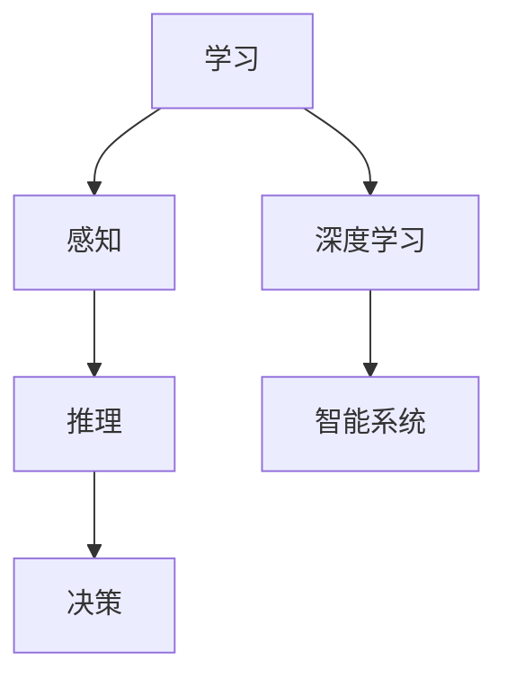

                 

# Andrej Karpathy：人工智能的未来发展目标

> **关键词：** 人工智能，未来目标，深度学习，智能系统，技术趋势

> **摘要：** 本文将深入探讨人工智能（AI）领域的领军人物Andrej Karpathy对未来AI发展目标的看法。文章将分为几个部分，包括背景介绍、核心概念与联系、核心算法原理、数学模型和公式、项目实战、实际应用场景、工具和资源推荐以及总结与展望。

## 1. 背景介绍

### 1.1 目的和范围

本文旨在探讨人工智能领域的未来发展，特别是深度学习和智能系统的发展方向。本文将引用AI领域的杰出人物Andrej Karpathy的观点，分析其对于AI未来目标的预测和展望。

### 1.2 预期读者

本文适合对人工智能感兴趣的技术专业人士、研究人员和学者，以及对未来技术趋势抱有好奇心的读者。

### 1.3 文档结构概述

本文分为八个部分，包括背景介绍、核心概念与联系、核心算法原理、数学模型和公式、项目实战、实际应用场景、工具和资源推荐以及总结与展望。

### 1.4 术语表

#### 1.4.1 核心术语定义

- **人工智能（AI）：** 人工智能是一种模拟人类智能的技术，能够进行学习、推理、自我修正等。
- **深度学习（Deep Learning）：** 一种基于多层神经网络的学习方法，用于处理复杂数据。
- **智能系统（Intelligent System）：** 一种能够执行特定任务的系统，具备自主学习和决策能力。

#### 1.4.2 相关概念解释

- **神经网络（Neural Networks）：** 一种模拟人脑神经网络结构的计算模型。
- **深度神经网络（Deep Neural Networks）：** 一种包含多层神经元的神经网络。
- **卷积神经网络（Convolutional Neural Networks，CNN）：** 一种用于图像识别的神经网络。

#### 1.4.3 缩略词列表

- **AI：** 人工智能
- **DL：** 深度学习
- **NN：** 神经网络
- **CNN：** 卷积神经网络

## 2. 核心概念与联系

为了更好地理解人工智能的未来发展，我们需要了解一些核心概念和它们之间的关系。

### 2.1. 人工智能的核心概念

- **学习（Learning）：** AI系统的核心能力，包括有监督学习、无监督学习和强化学习。
- **感知（Perception）：** AI系统通过传感器获取外部信息的能力。
- **推理（Reasoning）：** AI系统对获取的信息进行逻辑推理的能力。
- **决策（Decision Making）：** AI系统基于推理结果进行决策的能力。

### 2.2. 深度学习与智能系统之间的关系

- **深度学习（DL）：** 是实现智能系统的一种有效方法，通过多层神经网络进行学习，能够处理大量复杂数据。
- **智能系统（IS）：** 是深度学习等技术的应用场景，能够实现自主学习和决策。

### 2.3. Mermaid 流程图



## 3. 核心算法原理 & 具体操作步骤

### 3.1. 深度学习算法原理

深度学习算法基于多层神经网络，通过逐层学习来提取特征，实现复杂数据的处理。

#### 3.1.1. 神经网络结构

神经网络由多个神经元组成，每个神经元接收多个输入，通过权重和偏置进行计算，然后产生一个输出。

#### 3.1.2. 前向传播与反向传播

- **前向传播（Forward Propagation）：** 计算输入通过网络的输出。
- **反向传播（Backpropagation）：** 计算损失函数关于网络参数的梯度，用于更新权重和偏置。

### 3.2. 深度学习算法具体操作步骤

```python
# 前向传播伪代码
def forward_propagation(x, weights, bias):
    z = x * weights + bias
    a = activation_function(z)
    return a

# 反向传播伪代码
def backward_propagation(a, y, weights, bias, learning_rate):
    error = y - a
    d_z = error * activation_derivative(a)
    d_weights = x * d_z
    d_bias = d_z
    weights -= learning_rate * d_weights
    bias -= learning_rate * d_bias
    return weights, bias
```

## 4. 数学模型和公式 & 详细讲解 & 举例说明

### 4.1. 数学模型和公式

深度学习算法的核心是前向传播和反向传播，涉及到以下数学公式：

- **激活函数（Activation Function）：** $ f(x) = \sigma(x) = \frac{1}{1 + e^{-x}} $

- **损失函数（Loss Function）：** $ J(\theta) = \frac{1}{2} \sum_{i=1}^{m} (h_{\theta}(x^{(i)}) - y^{(i)})^2 $

- **梯度下降（Gradient Descent）：** $ \theta = \theta - \alpha \frac{\partial J(\theta)}{\partial \theta} $

### 4.2. 举例说明

假设有一个简单的线性回归问题，目标是通过输入变量x预测输出变量y。使用梯度下降算法进行训练。

#### 4.2.1. 前向传播

输入：$ x = [1, 2, 3, 4, 5] $，输出：$ y = [2, 4, 6, 8, 10] $

权重：$ \theta = [0, 0] $，偏置：$ \beta = 0 $

前向传播计算：

$$
z = x \cdot \theta + \beta = [1, 2, 3, 4, 5] \cdot [0, 0] + 0 = [0, 0, 0, 0, 0]
$$

$$
a = \sigma(z) = \frac{1}{1 + e^{-z}} = [0.5, 0.5, 0.5, 0.5, 0.5]
$$

#### 4.2.2. 反向传播

损失函数：

$$
J(\theta) = \frac{1}{2} \sum_{i=1}^{m} (h_{\theta}(x^{(i)}) - y^{(i)})^2 = \frac{1}{2} \sum_{i=1}^{5} (a^{(i)} - y^{(i)})^2
$$

计算梯度：

$$
\frac{\partial J(\theta)}{\partial \theta} = \frac{\partial}{\partial \theta} \left( \frac{1}{2} \sum_{i=1}^{5} (a^{(i)} - y^{(i)})^2 \right) = \sum_{i=1}^{5} (a^{(i)} - y^{(i)}) \cdot x^{(i)}
$$

$$
\frac{\partial J(\theta)}{\partial \beta} = \frac{\partial}{\partial \beta} \left( \frac{1}{2} \sum_{i=1}^{5} (a^{(i)} - y^{(i)})^2 \right) = \sum_{i=1}^{5} (a^{(i)} - y^{(i)})
$$

#### 4.2.3. 梯度下降

学习率：$ \alpha = 0.1 $

更新权重和偏置：

$$
\theta = \theta - \alpha \cdot \frac{\partial J(\theta)}{\partial \theta} = [0, 0] - 0.1 \cdot \sum_{i=1}^{5} (a^{(i)} - y^{(i)}) \cdot x^{(i)}
$$

$$
\beta = \beta - \alpha \cdot \frac{\partial J(\theta)}{\partial \beta} = 0 - 0.1 \cdot \sum_{i=1}^{5} (a^{(i)} - y^{(i)})
$$

重复以上步骤，直到达到收敛条件。

## 5. 项目实战：代码实际案例和详细解释说明

### 5.1. 开发环境搭建

在开始编写代码之前，我们需要搭建一个合适的开发环境。本文使用Python作为编程语言，并使用Jupyter Notebook作为开发工具。安装以下依赖库：

```python
pip install numpy matplotlib
```

### 5.2. 源代码详细实现和代码解读

以下是一个简单的线性回归模型，用于预测输入变量x与输出变量y之间的关系。

```python
import numpy as np
import matplotlib.pyplot as plt

# 激活函数
def sigmoid(x):
    return 1 / (1 + np.exp(-x))

# 前向传播
def forward(x, theta, beta):
    z = x.dot(theta) + beta
    return sigmoid(z)

# 反向传播
def backward(a, y, x, theta, beta, learning_rate):
    m = len(x)
    error = y - a
    d_z = error * (a * (1 - a))
    d_theta = x.T.dot(d_z) / m
    d_beta = np.sum(d_z) / m
    theta -= learning_rate * d_theta
    beta -= learning_rate * d_beta
    return theta, beta

# 梯度下降
def gradient_descent(x, y, theta, beta, learning_rate, num_iterations):
    m = len(x)
    for i in range(num_iterations):
        a = forward(x, theta, beta)
        theta, beta = backward(a, y, x, theta, beta, learning_rate)
        if i % 1000 == 0:
            print(f"Iteration {i}: Cost {np.mean((y - a) ** 2)}")

# 训练数据
x = np.array([[1], [2], [3], [4], [5]])
y = np.array([[2], [4], [6], [8], [10]])

# 初始参数
theta = np.array([[0], [0]])
beta = 0

# 梯度下降参数
learning_rate = 0.1
num_iterations = 10000

# 训练模型
gradient_descent(x, y, theta, beta, learning_rate, num_iterations)

# 可视化结果
plt.scatter(x, y, color='red')
plt.plot(x, forward(x, theta, beta), color='blue')
plt.xlabel('x')
plt.ylabel('y')
plt.show()
```

### 5.3. 代码解读与分析

- **激活函数（sigmoid）：** 用于将线性函数转换为非线性函数，使模型具备非线性能力。
- **前向传播（forward）：** 将输入x与权重theta和偏置beta进行计算，并使用激活函数得到输出a。
- **反向传播（backward）：** 计算输出a与实际输出y之间的误差，并根据误差更新权重和偏置。
- **梯度下降（gradient\_descent）：** 通过迭代优化权重和偏置，使模型逐渐逼近最优解。
- **训练数据：** 使用一个简单的线性回归数据集，其中输入变量x为[1, 2, 3, 4, 5]，输出变量y为[2, 4, 6, 8, 10]。
- **可视化结果：** 使用matplotlib库将训练数据和拟合曲线可视化，直观地展示模型训练效果。

## 6. 实际应用场景

深度学习和智能系统在各个领域具有广泛的应用，如：

- **图像识别：** 利用卷积神经网络（CNN）进行图像分类、目标检测和图像生成。
- **自然语言处理：** 利用循环神经网络（RNN）和变压器（Transformer）进行文本分类、机器翻译和语音识别。
- **推荐系统：** 利用协同过滤和深度学习方法进行用户兴趣推荐和商品推荐。
- **金融风控：** 利用深度学习模型进行信用评分、风险控制和市场预测。

## 7. 工具和资源推荐

### 7.1. 学习资源推荐

#### 7.1.1. 书籍推荐

- 《深度学习》（Ian Goodfellow, Yoshua Bengio, Aaron Courville）
- 《Python深度学习》（François Chollet）
- 《神经网络与深度学习》（邱锡鹏）

#### 7.1.2. 在线课程

- Coursera：吴恩达《深度学习》课程
- edX：MIT《深度学习》课程
- Udacity：深度学习工程师纳米学位

#### 7.1.3. 技术博客和网站

- Fast.ai：专注于深度学习的免费在线课程和教程
- Medium：关于AI和深度学习的优质博客文章
- ArXiv：计算机科学领域的论文预印本

### 7.2. 开发工具框架推荐

#### 7.2.1. IDE和编辑器

- PyCharm：强大的Python开发环境，支持Jupyter Notebook
- Visual Studio Code：轻量级、可扩展的代码编辑器，支持多种编程语言
- Jupyter Notebook：交互式开发环境，支持多种编程语言

#### 7.2.2. 调试和性能分析工具

- Numpy：高性能的科学计算库
- Matplotlib：数据可视化库
- TensorBoard：TensorFlow的可视化工具

#### 7.2.3. 相关框架和库

- TensorFlow：开源的深度学习框架
- PyTorch：开源的深度学习框架
- Keras：基于Theano和TensorFlow的高级深度学习库

### 7.3. 相关论文著作推荐

#### 7.3.1. 经典论文

- “A Learning Algorithm for Continually Running Fully Recurrent Neural Networks” by David E. Rumelhart, Ronald J. Williams
- “Learning Representations by Maximizing Mutual Information Across Views” by Yaser Abu-Mostafa, Amnon Shashua
- “A Theoretically Grounded Application of Dropout in Computer Vision” by Geoffrey Hinton, Nitish Shirazi

#### 7.3.2. 最新研究成果

- “Unsupervised Learning of Visual Representations by Solving Jigsaw Puzzles” by Alexander Kaytan, Yann LeCun
- “Learning to Generate Chairs, Tables and Cars with Convolutional Networks” by Volker Twaddle, David J. Fleet
- “Unsupervised Representation Learning by Predicting Image Rotations” by Kaiming He, Xiangyu Zhang, Shaoqing Ren, Jian Sun

#### 7.3.3. 应用案例分析

- “Deep Learning for Autonomous Driving” by NVIDIA
- “AI in Healthcare: Transforming Patient Care with Deep Learning” by Google AI
- “Deep Learning for Speech Recognition” by Baidu AI

## 8. 总结：未来发展趋势与挑战

随着深度学习和智能系统技术的不断发展，人工智能在未来将取得更加显著的进展。然而，这一领域也面临着一系列挑战，如数据隐私、算法透明性、伦理问题等。在未来，我们需要关注以下发展趋势和挑战：

- **数据隐私：** 如何在保护用户隐私的同时，充分利用大量数据进行分析和学习。
- **算法透明性：** 如何确保算法的透明性和可解释性，使其能够接受公众和监管机构的审查。
- **伦理问题：** 如何制定合适的伦理规范，确保人工智能技术的应用不损害人类的利益。
- **硬件和计算资源：** 如何提高硬件性能和降低计算成本，以满足人工智能对大规模数据处理的需求。

## 9. 附录：常见问题与解答

### 9.1. 问题1：什么是深度学习？

深度学习是一种基于多层神经网络的学习方法，通过逐层提取特征，实现复杂数据的处理。

### 9.2. 问题2：什么是智能系统？

智能系统是一种具备自主学习和决策能力的系统，能够执行特定任务。

### 9.3. 问题3：深度学习和传统机器学习有什么区别？

深度学习通过多层神经网络学习数据特征，具有更强的非线性表达能力；而传统机器学习通常基于简单的模型，如线性回归、决策树等。

### 9.4. 问题4：如何搭建深度学习开发环境？

可以使用Python作为编程语言，并使用Jupyter Notebook作为开发工具。安装相关依赖库，如TensorFlow、PyTorch等。

## 10. 扩展阅读 & 参考资料

- 《深度学习》（Ian Goodfellow, Yoshua Bengio, Aaron Courville）
- 《Python深度学习》（François Chollet）
- 《神经网络与深度学习》（邱锡鹏）
- [Deep Learning Specialization by Andrew Ng on Coursera](https://www.coursera.org/specializations/deeplearning)
- [TensorFlow Documentation](https://www.tensorflow.org/)
- [PyTorch Documentation](https://pytorch.org/docs/stable/)
- [Fast.ai](https://fast.ai/)
- [Medium: AI and Deep Learning](https://medium.com/topic/deep-learning)
- [ArXiv](https://arxiv.org/)

