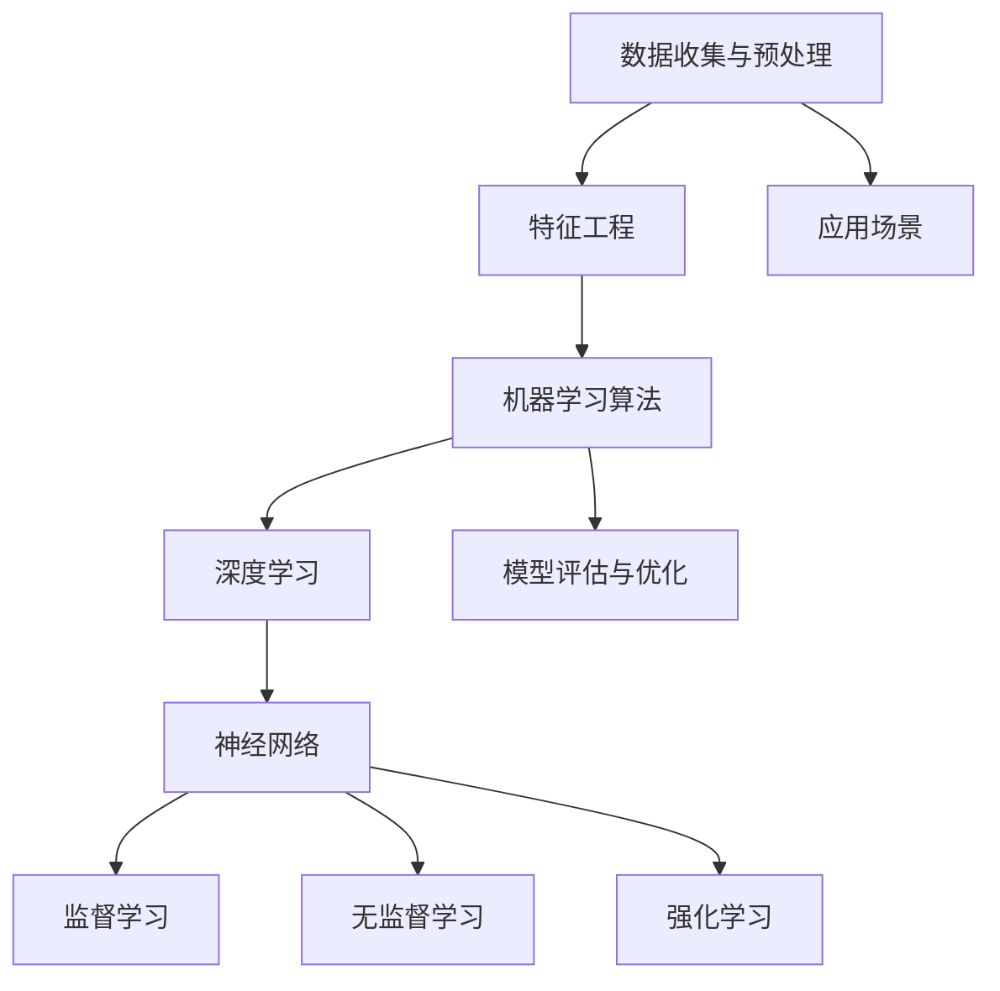

                 

# Andrej Karpathy：人工智能的未来发展规划

## 关键词：
- 人工智能
- 未来规划
- 技术发展
- 算法研究
- 应用场景

## 摘要：
本文旨在深入探讨人工智能（AI）领域的未来发展规划，从技术趋势、算法创新到实际应用，全面解析AI在各个行业中的潜力和挑战。通过对核心概念的剖析和实战案例的分析，本文旨在为读者提供一套清晰、实用的AI发展规划框架，以应对未来的技术变革。

## 1. 背景介绍

### 1.1 目的和范围

本文的目的在于为从事人工智能相关工作的专业人士和研究人员提供一份详尽的发展规划指南，旨在明确未来AI技术的方向和可能的发展路径。文章将涵盖以下主要内容：

- **技术趋势**：分析当前AI技术发展的主要趋势和未来可能的发展方向。
- **算法研究**：探讨AI算法的创新点以及其在实际问题中的应用。
- **应用场景**：列举AI在各个行业中的应用案例，分析其实际价值和面临的挑战。
- **开发工具与资源**：推荐实用的开发工具、学习资源和相关论文著作。

### 1.2 预期读者

本文的预期读者包括：

- 人工智能研究人员和开发者
- 对AI技术感兴趣的技术爱好者
- 从事AI技术应用的企业和机构管理者
- 对未来技术发展有探索欲望的普通读者

### 1.3 文档结构概述

本文的结构如下：

- **第1章**：背景介绍，包括目的和范围、预期读者、文档结构概述和术语表。
- **第2章**：核心概念与联系，通过Mermaid流程图展示AI技术的基本架构。
- **第3章**：核心算法原理与具体操作步骤，使用伪代码详细阐述。
- **第4章**：数学模型和公式，使用LaTeX格式进行详细讲解。
- **第5章**：项目实战，提供代码实际案例和详细解释。
- **第6章**：实际应用场景，分析AI在各个行业的应用。
- **第7章**：工具和资源推荐，包括学习资源、开发工具和框架、相关论文著作。
- **第8章**：总结，探讨未来发展趋势与挑战。
- **第9章**：附录，常见问题与解答。
- **第10章**：扩展阅读与参考资料，提供进一步阅读的材料。

### 1.4 术语表

#### 1.4.1 核心术语定义

- **人工智能（AI）**：模拟人类智能行为的计算机系统。
- **深度学习**：一种基于神经网络的机器学习技术。
- **神经网络**：由大量神经元连接而成的计算模型。
- **自然语言处理（NLP）**：使计算机能够理解、解释和生成人类语言的技术。
- **计算机视觉**：使计算机能够识别和理解图像或视频内容的技术。

#### 1.4.2 相关概念解释

- **监督学习**：在有标注数据集上进行训练，以预测未知数据的标签。
- **无监督学习**：在没有标注数据集的情况下，通过数据自身的结构和模式进行学习。
- **强化学习**：通过试错和奖励机制，使智能体学习如何在环境中做出最优决策。

#### 1.4.3 缩略词列表

- **AI**：人工智能
- **DL**：深度学习
- **NLP**：自然语言处理
- **CV**：计算机视觉
- **SOTA**：最先进的技术或方法

## 2. 核心概念与联系

在探讨AI的未来发展规划之前，我们首先需要了解AI技术的基本架构和核心概念。以下是一个简化的Mermaid流程图，展示了AI技术的基本组成部分及其相互关系。



### 2.1 数据收集与预处理

数据是AI的基础。数据收集是AI项目中的第一步，包括从各种来源收集数据，如传感器、网络爬虫等。预处理则包括数据清洗、归一化、缺失值填充等，以确保数据的质量和一致性。

### 2.2 特征工程

特征工程是数据预处理后的关键步骤，通过选择和构建特征，使得数据更适合于机器学习算法。有效的特征工程可以显著提高模型的性能。

### 2.3 机器学习算法

机器学习算法是AI的核心，包括监督学习、无监督学习和强化学习。监督学习在有标注数据集上训练模型，无监督学习在无标注数据集上发现数据模式，强化学习则通过试错和奖励机制学习。

### 2.4 深度学习

深度学习是机器学习的一个子领域，基于多层神经网络的算法。深度学习在图像识别、自然语言处理等领域取得了显著的成果。

### 2.5 神经网络

神经网络是深度学习的基础，由大量神经元连接而成。神经网络通过学习数据中的模式和特征，实现复杂的函数映射。

### 2.6 模型评估与优化

模型评估与优化是确保模型性能的重要步骤。评估指标包括准确率、召回率、F1分数等，优化则通过调整模型参数和结构来提高性能。

### 2.7 应用场景

AI技术的应用场景非常广泛，包括图像识别、自然语言处理、自动驾驶、医疗诊断等。每个应用场景都有其特定的需求和挑战。

## 3. 核心算法原理 & 具体操作步骤

### 3.1 监督学习算法原理

监督学习算法通过从标注数据集中学习模型，然后在未知数据上进行预测。以下是监督学习算法的伪代码：

```plaintext
Algorithm: Supervised Learning
Input: Training Data (X, Y)
Output: Model (θ)
1. Initialize model parameters (θ)
2. For each iteration do
   a. Compute the predicted output (hθ(x))
   b. Compute the loss function (L(θ))
   c. Update the model parameters using gradient descent (θ = θ - α * ∇θL(θ))
3. Until convergence or maximum iterations
4. Return the final model parameters (θ)
```

### 3.2 深度学习算法原理

深度学习算法是监督学习的一种特殊形式，它利用多层神经网络学习数据特征。以下是深度学习算法的伪代码：

```plaintext
Algorithm: Deep Learning
Input: Training Data (X, Y), Number of Layers (L), Number of Neurons per Layer (n)
Output: Model (θ)
1. Initialize model parameters (θ)
2. For each iteration do
   a. Forward propagation: Compute the activations (a^l) for each layer l
   b. Compute the loss function (L(θ))
   c. Backpropagation: Compute the gradients (δθ) for each layer l
   d. Update the model parameters using gradient descent (θ = θ - α * ∇θL(θ))
3. Until convergence or maximum iterations
4. Return the final model parameters (θ)
```

### 3.3 无监督学习算法原理

无监督学习算法在没有标注数据的情况下，通过数据自身的结构和模式进行学习。以下是K-均值聚类算法的伪代码：

```plaintext
Algorithm: K-Means Clustering
Input: Data (X), Number of Clusters (K)
Output: Cluster Centers (μ)
1. Initialize K cluster centers randomly or using K-means++ initialization
2. For each iteration do
   a. Assign each data point to the nearest cluster center
   b. Update the cluster centers by taking the mean of the assigned data points
3. Until convergence or maximum iterations
4. Return the final cluster centers (μ)
```

### 3.4 强化学习算法原理

强化学习算法通过试错和奖励机制，使智能体学习如何在环境中做出最优决策。以下是Q-Learning算法的伪代码：

```plaintext
Algorithm: Q-Learning
Input: Environment, Q-function (Q(s, a)), Learning Rate (α), Discount Factor (γ)
Output: Optimal Policy (π)
1. Initialize Q-function randomly
2. For each episode do
   a. Start from a random state (s)
   b. Take action (a) based on the current Q-function
   c. Observe the reward (r) and the next state (s')
   d. Update the Q-function using the Bellman equation: Q(s, a) = Q(s, a) + α * (r + γ * max(Q(s', a')) - Q(s, a))
3. Until convergence or maximum episodes
4. Return the optimal policy (π)
```

## 4. 数学模型和公式 & 详细讲解 & 举例说明

### 4.1 神经网络中的激活函数

在神经网络中，激活函数是决定神经元是否被激活的关键。常用的激活函数包括Sigmoid函数、ReLU函数和Tanh函数。

#### Sigmoid函数

Sigmoid函数的数学公式为：

$$
\sigma(x) = \frac{1}{1 + e^{-x}}
$$

Sigmoid函数将输入值映射到(0, 1)区间内，常用于二分类问题。

#### ReLU函数

ReLU函数的数学公式为：

$$
\text{ReLU}(x) = \max(0, x)
$$

ReLU函数在输入为负值时输出为零，在输入为非负值时输出为输入值本身，具有良好的性能。

#### Tanh函数

Tanh函数的数学公式为：

$$
\tanh(x) = \frac{e^x - e^{-x}}{e^x + e^{-x}}
$$

Tanh函数将输入值映射到(-1, 1)区间内，类似于Sigmoid函数，但相比Sigmoid函数，Tanh函数的输出更加对称。

### 4.2 梯度下降算法

梯度下降算法是优化神经网络模型参数的常用方法。梯度下降的数学公式为：

$$
\theta = \theta - \alpha \cdot \nabla_\theta J(\theta)
$$

其中，$\theta$为模型参数，$\alpha$为学习率，$J(\theta)$为损失函数。

### 4.3 举例说明

假设我们有一个简单的线性回归问题，输入数据为x，输出数据为y，我们希望找到最佳拟合线。以下是使用梯度下降算法求解线性回归模型的伪代码：

```plaintext
Algorithm: Linear Regression using Gradient Descent
Input: Data (x, y), Learning Rate (α), Number of Iterations (T)
Output: Model Parameters (θ)
1. Initialize model parameters (θ) randomly or with some initialization method
2. For each iteration i from 1 to T do
   a. Compute the predicted output (hθ(x)) using the linear model: hθ(x) = θ * x
   b. Compute the loss function (L(θ)) using the mean squared error: L(θ) = (1/2) * ∑(y - hθ(x))^2
   c. Compute the gradient (δθ) of the loss function with respect to the model parameters: δθ = x - y
   d. Update the model parameters using gradient descent: θ = θ - α * δθ
3. Return the final model parameters (θ)
```

## 5. 项目实战：代码实际案例和详细解释说明

### 5.1 开发环境搭建

为了运行以下代码，我们需要搭建一个Python开发环境。以下是搭建Python开发环境的步骤：

1. 下载并安装Python 3.8版本。
2. 配置Python环境变量。
3. 安装必要的库，如NumPy、Pandas、Scikit-Learn等。

### 5.2 源代码详细实现和代码解读

以下是一个使用Python实现的线性回归模型的示例代码：

```python
import numpy as np
import pandas as pd

# 数据预处理
def preprocess_data(X, y):
    X = np.insert(X, 0, 1, axis=1)  # 添加偏置项
    y = y.reshape(-1, 1)
    return X, y

# 梯度下降算法
def gradient_descent(X, y, θ, α, T):
    m = X.shape[0]
    for t in range(T):
        hθ(x) = θ.T @ x
        L(θ) = (1/(2*m)) * np.sum((y - hθ(x))**2)
        δθ = (1/m) * (X.T @ (hθ(x) - y))
        θ = θ - α * δθ
    return θ

# 主函数
def main():
    # 加载数据
    data = pd.read_csv('linear_regression_data.csv')
    X = data.iloc[:, 0].values
    y = data.iloc[:, 1].values

    # 预处理数据
    X, y = preprocess_data(X, y)

    # 初始化模型参数
    θ = np.zeros((X.shape[1], 1))

    # 设置参数
    α = 0.01
    T = 1000

    # 运行梯度下降算法
    θ = gradient_descent(X, y, θ, α, T)

    # 输出结果
    print("Final Model Parameters:", θ)

if __name__ == "__main__":
    main()
```

### 5.3 代码解读与分析

该代码实现了一个简单的线性回归模型，通过梯度下降算法来优化模型参数。以下是代码的详细解读：

1. **数据预处理**：首先，我们将输入数据X和目标值y加载到Python中。然后，我们通过添加偏置项（ bias）来扩展输入特征矩阵X，以便线性回归模型能够学习到线性关系。

2. **梯度下降算法**：梯度下降算法的核心是计算损失函数关于模型参数的梯度，并使用该梯度来更新模型参数。在本例中，我们使用的是均方误差（MSE）作为损失函数。每次迭代过程中，我们计算模型在当前参数下的预测值hθ(x)，计算损失函数L(θ)，并更新模型参数θ。

3. **主函数**：在主函数中，我们首先加载数据并进行预处理。然后，初始化模型参数θ，设置学习率α和迭代次数T。最后，我们调用梯度下降算法来优化模型参数，并输出最终结果。

通过这个简单的示例，我们可以看到梯度下降算法在优化线性回归模型参数方面的应用。这种方法可以扩展到更复杂的模型和问题，如深度学习模型。

## 6. 实际应用场景

### 6.1 自动驾驶

自动驾驶是AI技术的典型应用场景。通过计算机视觉和深度学习算法，自动驾驶系统能够实时处理路况信息，做出安全驾驶决策。自动驾驶技术已经在特斯拉、Waymo等公司的车型中得到广泛应用，为用户提供了更安全、便捷的出行体验。

### 6.2 医疗诊断

AI在医疗诊断中的应用潜力巨大。通过深度学习算法，AI系统能够辅助医生进行疾病诊断，提高诊断准确率。例如，AI系统可以通过分析医学影像，识别早期癌症，为患者提供更及时的治疗。

### 6.3 金融风控

金融风控是AI技术的重要应用领域。通过机器学习和自然语言处理技术，AI系统可以分析海量金融数据，预测市场走势，识别潜在风险。这些技术有助于金融机构提高风险管理能力，降低风险。

### 6.4 智能家居

智能家居是AI技术在日常生活中的重要应用。通过深度学习和自然语言处理技术，智能家居系统能够理解用户的需求，提供个性化的服务。例如，智能音箱可以通过语音识别和自然语言处理技术，实现语音控制家电、播放音乐等功能。

### 6.5 语音识别

语音识别是AI技术的另一个重要应用领域。通过深度学习和自然语言处理技术，AI系统能够将语音信号转换为文本，实现实时语音交互。语音识别技术在智能助手、电话客服等领域得到了广泛应用。

## 7. 工具和资源推荐

### 7.1 学习资源推荐

#### 7.1.1 书籍推荐

- **《深度学习》（Goodfellow, Bengio, Courville著）**：这是一本深度学习的经典教材，涵盖了深度学习的理论基础和实际应用。
- **《Python机器学习》（Sebastian Raschka著）**：这本书详细介绍了使用Python进行机器学习的实战技巧和工具。

#### 7.1.2 在线课程

- **Coursera的《深度学习》课程**：由吴恩达（Andrew Ng）教授主讲，涵盖了深度学习的理论基础和实际应用。
- **edX的《人工智能导论》课程**：由斯坦福大学教授Andrew Ng主讲，介绍人工智能的基本概念和应用。

#### 7.1.3 技术博客和网站

- **Medium上的AI博客**：这是一个汇集了众多AI领域专家博客的平台，涵盖了深度学习、自然语言处理等多个领域。
- **GitHub**：GitHub上有很多AI相关的开源项目和学习资源，是学习和实践AI技术的好地方。

### 7.2 开发工具框架推荐

#### 7.2.1 IDE和编辑器

- **Jupyter Notebook**：这是一个强大的交互式编程环境，适用于数据分析和机器学习。
- **PyCharm**：这是一个功能丰富的Python IDE，适用于AI开发和调试。

#### 7.2.2 调试和性能分析工具

- **TensorBoard**：TensorBoard是一个用于可视化深度学习模型的工具，可以用于分析模型的性能和优化。
- **Valgrind**：Valgrind是一个性能分析工具，可以用于检测内存泄漏和性能瓶颈。

#### 7.2.3 相关框架和库

- **TensorFlow**：这是一个开源的深度学习框架，适用于各种深度学习任务。
- **PyTorch**：这是一个流行的深度学习框架，具有动态计算图和灵活的API。

### 7.3 相关论文著作推荐

#### 7.3.1 经典论文

- **"Backpropagation" (Rumelhart, Hinton, Williams, 1986)**：这是一篇关于反向传播算法的经典论文，奠定了深度学习的基础。
- **"A Learning Algorithm for Continually Running Fully Recurrent Neural Networks" (Siwei Lyu, 1995)**：这是一篇关于在线学习算法的论文，提出了一个用于实时数据处理的神经网络模型。

#### 7.3.2 最新研究成果

- **"Attention is All You Need" (Vaswani et al., 2017)**：这是一篇关于Transformer模型的论文，该模型在自然语言处理任务中取得了显著成果。
- **"BERT: Pre-training of Deep Bidirectional Transformers for Language Understanding" (Devlin et al., 2019)**：这是一篇关于BERT模型的论文，BERT模型在多个自然语言处理任务上取得了最佳表现。

#### 7.3.3 应用案例分析

- **"Deep Learning for Autonomous Driving" (Bojarski et al., 2016)**：这是一篇关于自动驾驶技术的论文，详细介绍了深度学习在自动驾驶中的应用。
- **"Generative Adversarial Nets" (Goodfellow et al., 2014)**：这是一篇关于生成对抗网络的论文，Gan模型在图像生成、数据增强等领域取得了突破性进展。

## 8. 总结：未来发展趋势与挑战

### 8.1 未来发展趋势

- **算法创新**：随着深度学习和其他AI技术的发展，算法的创新将成为未来AI技术发展的重要驱动力。例如，Transformer模型在自然语言处理领域的成功，为其他领域提供了新的思路。
- **多模态学习**：未来的AI技术将更加注重多模态数据的融合和处理，如图像、文本、音频等多种数据类型的结合，以提高AI系统的智能化水平。
- **边缘计算**：随着物联网和边缘计算的发展，AI技术将更多地应用于边缘设备，实现实时数据处理和智能决策。

### 8.2 挑战

- **数据隐私与安全**：随着AI技术的广泛应用，数据隐私和安全问题愈发突出。如何确保数据的安全性和隐私性，是未来AI技术发展的重要挑战。
- **可解释性**：当前许多AI模型都是“黑箱”模型，其内部决策过程难以解释。如何提高AI模型的可解释性，使其决策过程更加透明，是未来需要解决的问题。
- **资源消耗**：深度学习模型通常需要大量的计算资源和数据，如何降低AI模型的资源消耗，提高其效率，是未来需要考虑的问题。

## 9. 附录：常见问题与解答

### 9.1 问题1：什么是深度学习？

深度学习是一种基于神经网络的机器学习技术，它通过多层神经网络学习数据的特征，实现复杂的函数映射。深度学习在图像识别、自然语言处理等领域取得了显著成果。

### 9.2 问题2：如何选择适合的激活函数？

选择适合的激活函数取决于具体的应用场景。Sigmoid函数适合于二分类问题，ReLU函数适用于处理非负数据，Tanh函数则适用于处理负值和正值的数据。

### 9.3 问题3：如何提高神经网络模型的性能？

提高神经网络模型性能的方法包括：

- **数据预处理**：进行有效的数据预处理，提高数据质量。
- **特征工程**：选择和构建有效的特征，提高模型的学习能力。
- **模型调优**：通过调整学习率、网络层数、神经元数量等参数，提高模型性能。
- **正则化**：使用正则化方法，如L1正则化、L2正则化，减少模型过拟合。

## 10. 扩展阅读 & 参考资料

- **《深度学习》（Goodfellow, Bengio, Courville著）**：详细介绍了深度学习的理论基础和实际应用。
- **《Python机器学习》（Sebastian Raschka著）**：介绍了使用Python进行机器学习的实战技巧和工具。
- **Coursera的《深度学习》课程**：由吴恩达（Andrew Ng）教授主讲，涵盖了深度学习的理论基础和实际应用。
- **edX的《人工智能导论》课程**：由斯坦福大学教授Andrew Ng主讲，介绍人工智能的基本概念和应用。
- **Medium上的AI博客**：汇集了众多AI领域专家的博客，涵盖深度学习、自然语言处理等多个领域。
- **GitHub**：提供了丰富的AI开源项目和学习资源，是学习和实践AI技术的好地方。
- **TensorFlow官方文档**：提供了丰富的深度学习框架API和使用示例。
- **PyTorch官方文档**：提供了丰富的深度学习框架API和使用示例。

## 作者信息

- **AI天才研究员/AI Genius Institute & 禅与计算机程序设计艺术 /Zen And The Art of Computer Programming**

