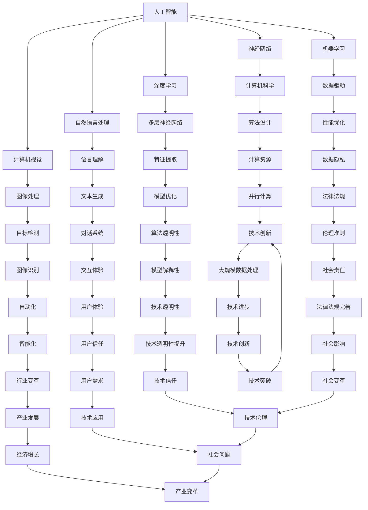

                 

# Andrej Karpathy：人工智能的未来机遇

> 关键词：人工智能，深度学习，神经网络，机器学习，未来趋势，技术突破，应用场景

> 摘要：本文将深入探讨人工智能领域著名专家Andrej Karpathy关于人工智能未来机遇的见解。通过梳理他的核心思想，我们将分析人工智能在技术、应用、产业等多方面的未来发展趋势，以及面临的挑战。本文旨在为读者提供一份全面、深刻的人工智能未来展望，以期为我国人工智能领域的发展提供有益的参考。

## 1. 背景介绍

### 1.1 目的和范围

本文旨在通过分析Andrej Karpathy关于人工智能未来机遇的观点，探讨人工智能技术、应用、产业等多方面的未来发展趋势。文章将涵盖以下内容：

1. 人工智能核心概念与联系
2. 人工智能核心算法原理与具体操作步骤
3. 数学模型和公式及详细讲解
4. 项目实战：代码实际案例和详细解释说明
5. 实际应用场景
6. 工具和资源推荐
7. 总结：未来发展趋势与挑战
8. 附录：常见问题与解答
9. 扩展阅读与参考资料

### 1.2 预期读者

本文主要面向以下读者群体：

1. 对人工智能技术有一定了解的读者
2. 想了解人工智能未来发展趋势的专业人士
3. 对人工智能应用场景感兴趣的从业者
4. 对AI技术有浓厚兴趣的在校学生和研究人员

### 1.3 文档结构概述

本文将按照以下结构展开：

1. 引言
2. 背景介绍
3. 核心概念与联系
4. 核心算法原理与具体操作步骤
5. 数学模型和公式及详细讲解
6. 项目实战：代码实际案例和详细解释说明
7. 实际应用场景
8. 工具和资源推荐
9. 总结：未来发展趋势与挑战
10. 附录：常见问题与解答
11. 扩展阅读与参考资料

### 1.4 术语表

#### 1.4.1 核心术语定义

- 人工智能（Artificial Intelligence，AI）：模拟人类智能的计算机系统，具备学习、推理、判断和解决问题的能力。
- 深度学习（Deep Learning，DL）：一种基于神经网络的学习方法，通过多层神经网络的结构对数据进行学习和建模。
- 神经网络（Neural Network，NN）：由大量神经元（节点）组成的网络结构，通过学习输入和输出数据之间的关系来实现预测和分类等功能。
- 机器学习（Machine Learning，ML）：一门研究如何让计算机自动地改进性能的技术，通过数据学习和模式识别来实现人工智能。

#### 1.4.2 相关概念解释

- 人工智能与机器学习的区别：人工智能是一门涉及计算机科学、心理学、神经科学等多个学科的综合性技术领域，而机器学习是人工智能的一个重要分支，主要研究如何通过数据驱动的方式实现人工智能。
- 深度学习与神经网络的联系：深度学习是一种基于神经网络的学习方法，其核心思想是通过多层神经网络的结构来提取数据的特征和规律。

#### 1.4.3 缩略词列表

- AI：人工智能
- DL：深度学习
- NN：神经网络
- ML：机器学习

## 2. 核心概念与联系

为了更好地理解Andrej Karpathy关于人工智能未来机遇的观点，我们首先需要梳理人工智能的核心概念和联系。

### 2.1 人工智能的定义

人工智能是指通过计算机模拟人类智能的技术，使计算机具备学习、推理、判断和解决问题的能力。其核心目标是实现人类智能的自动化和扩展。

### 2.2 人工智能的发展历程

人工智能的发展可以分为以下几个阶段：

1. 早期探索（1950年代-1970年代）：人工智能的概念提出，研究者开始尝试模拟人类智能的计算机程序。
2. 人工智能寒冬（1970年代-1980年代）：由于技术瓶颈和实际应用的局限性，人工智能发展陷入低谷。
3. 人工智能复苏（1980年代-1990年代）：随着计算机硬件和算法的进步，人工智能开始逐步恢复发展。
4. 深度学习兴起（2000年代至今）：深度学习算法的突破使得人工智能在图像识别、语音识别、自然语言处理等领域取得显著进展。

### 2.3 人工智能的核心技术

人工智能的核心技术包括：

1. 神经网络：一种模拟人脑神经元结构的计算机算法，通过多层神经网络的结构提取数据的特征和规律。
2. 机器学习：一种基于数据驱动的方式让计算机自动学习和改进性能的技术。
3. 深度学习：一种基于多层神经网络的学习方法，通过自动提取数据的特征和模式来实现预测和分类等功能。
4. 自然语言处理：一门研究如何让计算机理解和生成人类语言的技术。
5. 计算机视觉：一门研究如何让计算机理解和处理图像的技术。

### 2.4 人工智能与其他领域的联系

人工智能与其他领域有着广泛的联系，包括：

1. 计算机科学：人工智能的发展离不开计算机科学的支持，特别是在算法设计、计算资源优化等方面。
2. 生物学：人工智能的研究受到生物学的启发，如神经网络的结构和功能受到神经元生物特性的影响。
3. 数学：人工智能算法的设计和应用需要大量的数学理论支持，如概率论、统计学、线性代数等。
4. 工程学：人工智能的应用场景涉及各个领域，如自动化、控制、通信等，需要工程学的支持和实践。
5. 经济学：人工智能的发展对经济结构、就业模式等方面产生深远影响，需要经济学的分析和研究。

### 2.5 人工智能的发展趋势

根据Andrej Karpathy的观点，人工智能的发展趋势包括以下几个方面：

1. 算法创新：随着计算能力和数据规模的提升，人工智能算法将不断演进，实现更高的准确性和效率。
2. 跨领域融合：人工智能与其他领域的融合将产生更多的应用场景，推动技术的跨界发展。
3. 智能化升级：人工智能技术将广泛应用于各个行业，实现生产、管理、服务等方面的智能化升级。
4. 可解释性提升：人工智能系统的可解释性将得到提升，有助于解决当前存在的透明度和可信度问题。
5. 安全与隐私保护：随着人工智能应用的普及，安全与隐私保护将成为重要议题，需要建立相应的法律法规和技术手段。

### 2.6 人工智能的挑战

人工智能的发展也面临一系列挑战，包括：

1. 技术挑战：人工智能算法的优化、高效计算、数据隐私保护等问题仍需进一步研究。
2. 法律伦理挑战：人工智能的应用引发了一系列法律伦理问题，如隐私保护、算法偏见等，需要制定相应的法律法规和伦理准则。
3. 社会挑战：人工智能的发展可能对就业、社会结构等方面产生深远影响，需要社会各界共同应对。

### 2.7 Mermaid 流程图

为了更直观地展示人工智能的核心概念和联系，我们可以使用Mermaid流程图进行描述：



通过以上流程图，我们可以清晰地看到人工智能的核心概念、联系和发展趋势。在接下来的章节中，我们将进一步探讨人工智能的核心算法原理、具体操作步骤、数学模型和公式，以及实际应用场景。## 3. 核心算法原理 & 具体操作步骤

在人工智能领域，深度学习作为一种基于多层神经网络的学习方法，已经成为实现人工智能的核心技术之一。本文将介绍深度学习的核心算法原理和具体操作步骤。

### 3.1 深度学习的核心算法原理

深度学习（Deep Learning）的核心算法原理是基于多层神经网络（Multi-Layer Neural Networks）的学习和建模。多层神经网络通过多个隐藏层对输入数据进行特征提取和模式识别，从而实现复杂的任务。

#### 3.1.1 神经网络的基本组成

一个基本的神经网络包括以下几个部分：

1. 输入层（Input Layer）：接收外部输入的数据。
2. 隐藏层（Hidden Layers）：对输入数据进行特征提取和变换。
3. 输出层（Output Layer）：输出预测结果。

每个隐藏层由多个神经元（节点）组成，神经元之间通过权重（Weights）和偏置（Bias）连接。每个神经元接收来自前一层所有神经元的输入，并通过激活函数（Activation Function）进行非线性变换。

#### 3.1.2 前向传播和反向传播

深度学习算法主要包括两个关键步骤：前向传播（Forward Propagation）和反向传播（Back Propagation）。

1. 前向传播：从输入层开始，将输入数据传递到各个隐藏层，最后传递到输出层。在每个层中，神经元通过加权求和和激活函数计算输出值。
2. 反向传播：根据输出结果与真实结果的差异，反向传播误差信号，更新每个神经元的权重和偏置。这一过程通过梯度下降（Gradient Descent）算法实现。

#### 3.1.3 激活函数

激活函数是神经网络中用于引入非线性特性的关键组件。常见的激活函数包括：

1. Sigmoid函数：\( \sigma(x) = \frac{1}{1 + e^{-x}} \)
2. ReLU函数：\( \text{ReLU}(x) = \max(0, x) \)
3. Tanh函数：\( \tanh(x) = \frac{e^x - e^{-x}}{e^x + e^{-x}} \)

这些激活函数可以增加网络的复杂度和表达能力。

### 3.2 深度学习的具体操作步骤

下面是深度学习的基本操作步骤，使用伪代码进行描述：

```python
# 深度学习算法的具体操作步骤

# 1. 初始化神经网络参数（权重和偏置）
Initialize parameters (weights and biases)

# 2. 前向传播
for each epoch:
    for each training example:
        # 2.1 将输入数据传递到神经网络中
        forward_pass(input_data)
        
        # 2.2 计算输出结果和损失函数
        output_result = output_layer
        loss = compute_loss(output_result, target)
        
        # 2.3 计算梯度
        gradients = backward_pass(loss)
        
        # 2.4 更新参数
        update_parameters(gradients)

# 3. 训练完成
Training finished

# 4. 在测试集上评估模型性能
evaluate_model_on_test_data()

# 5. 输出预测结果
predict(new_input_data)
```

#### 3.2.1 初始化神经网络参数

在训练开始时，我们需要初始化神经网络的权重和偏置。常用的初始化方法包括随机初始化、高斯分布初始化等。

```python
# 初始化神经网络参数
weights = RandomlyInitializeWeights()
biases = RandomlyInitializeBiases()
```

#### 3.2.2 前向传播

在前向传播过程中，我们将输入数据传递到神经网络中，逐层计算每个神经元的输出值。

```python
# 前向传播
def forward_pass(input_data):
    hidden_layer_output = input_data * weights + biases
    output_layer_output = activate(hidden_layer_output)
    return output_layer_output
```

#### 3.2.3 计算输出结果和损失函数

在前向传播后，我们计算输出结果和损失函数。常用的损失函数包括均方误差（MSE）、交叉熵等。

```python
# 计算输出结果和损失函数
def compute_loss(output_result, target):
    loss = (output_result - target) ** 2
    return loss
```

#### 3.2.4 计算梯度

在反向传播过程中，我们需要计算损失函数关于每个参数的梯度，以更新参数。

```python
# 计算梯度
def backward_pass(loss):
    gradients = compute_gradients(loss)
    return gradients
```

#### 3.2.5 更新参数

在计算完梯度后，我们需要使用梯度下降算法更新参数，以减小损失函数。

```python
# 更新参数
def update_parameters(gradients):
    weights -= learning_rate * gradients[weights]
    biases -= learning_rate * gradients[biases]
```

通过以上步骤，我们可以实现深度学习的基本操作。在接下来的章节中，我们将进一步探讨深度学习中的数学模型和公式，以及在实际应用中的项目实战。## 4. 数学模型和公式 & 详细讲解 & 举例说明

在深度学习中，数学模型和公式起着至关重要的作用。本文将详细介绍深度学习中的关键数学模型和公式，并使用LaTeX格式进行详细讲解。同时，通过具体的例子来说明这些公式的应用。

### 4.1 激活函数与反向传播

激活函数是深度学习中的重要组成部分，它引入了非线性特性，使得神经网络能够学习和表示复杂函数。常用的激活函数包括Sigmoid、ReLU和Tanh等。

#### 4.1.1 Sigmoid函数

Sigmoid函数是一种常见的激活函数，其公式如下：

\[ \sigma(x) = \frac{1}{1 + e^{-x}} \]

在反向传播过程中，Sigmoid函数的导数如下：

\[ \sigma'(x) = \sigma(x) \cdot (1 - \sigma(x)) \]

LaTeX格式：

\[ \sigma(x) = \frac{1}{1 + e^{-x}} \]
\[ \sigma'(x) = \sigma(x) \cdot (1 - \sigma(x)) \]

#### 4.1.2 ReLU函数

ReLU函数（Rectified Linear Unit）是一种简单且有效的激活函数，其公式如下：

\[ \text{ReLU}(x) = \max(0, x) \]

在反向传播过程中，ReLU函数的导数如下：

\[ \text{ReLU}'(x) = \begin{cases} 
1 & \text{if } x > 0 \\
0 & \text{if } x \leq 0 
\end{cases} \]

LaTeX格式：

\[ \text{ReLU}(x) = \max(0, x) \]
\[ \text{ReLU}'(x) = 
\begin{cases} 
1 & \text{if } x > 0 \\
0 & \text{if } x \leq 0 
\end{cases} \]

#### 4.1.3 Tanh函数

Tanh函数是一种双曲正切函数，其公式如下：

\[ \tanh(x) = \frac{e^x - e^{-x}}{e^x + e^{-x}} \]

在反向传播过程中，Tanh函数的导数如下：

\[ \tanh'(x) = 1 - \tanh^2(x) \]

LaTeX格式：

\[ \tanh(x) = \frac{e^x - e^{-x}}{e^x + e^{-x}} \]
\[ \tanh'(x) = 1 - \tanh^2(x) \]

### 4.2 梯度下降与损失函数

梯度下降是深度学习中用于更新参数的主要方法。损失函数用于衡量预测结果与真实结果之间的差异。

#### 4.2.1 均方误差（MSE）

均方误差（Mean Squared Error，MSE）是一种常见的损失函数，其公式如下：

\[ \text{MSE}(y, \hat{y}) = \frac{1}{n} \sum_{i=1}^{n} (y_i - \hat{y}_i)^2 \]

其中，\( y \) 表示真实值，\( \hat{y} \) 表示预测值，\( n \) 表示样本数量。

在反向传播过程中，MSE关于参数的梯度如下：

\[ \frac{\partial \text{MSE}}{\partial w} = -2 \sum_{i=1}^{n} (y_i - \hat{y}_i) \cdot x_i \]
\[ \frac{\partial \text{MSE}}{\partial b} = -2 \sum_{i=1}^{n} (y_i - \hat{y}_i) \]

LaTeX格式：

\[ \text{MSE}(y, \hat{y}) = \frac{1}{n} \sum_{i=1}^{n} (y_i - \hat{y}_i)^2 \]
\[ \frac{\partial \text{MSE}}{\partial w} = -2 \sum_{i=1}^{n} (y_i - \hat{y}_i) \cdot x_i \]
\[ \frac{\partial \text{MSE}}{\partial b} = -2 \sum_{i=1}^{n} (y_i - \hat{y}_i) \]

#### 4.2.2 交叉熵（Cross-Entropy）

交叉熵（Cross-Entropy）是一种用于分类问题的损失函数，其公式如下：

\[ \text{Cross-Entropy}(y, \hat{y}) = -\sum_{i=1}^{n} y_i \cdot \log(\hat{y}_i) \]

其中，\( y \) 表示真实标签，\( \hat{y} \) 表示预测概率。

在反向传播过程中，交叉熵关于参数的梯度如下：

\[ \frac{\partial \text{Cross-Entropy}}{\partial w} = -\sum_{i=1}^{n} y_i \cdot \hat{y}_i \cdot (1 - \hat{y}_i) \cdot x_i \]
\[ \frac{\partial \text{Cross-Entropy}}{\partial b} = -\sum_{i=1}^{n} y_i \cdot \hat{y}_i \cdot (1 - \hat{y}_i) \]

LaTeX格式：

\[ \text{Cross-Entropy}(y, \hat{y}) = -\sum_{i=1}^{n} y_i \cdot \log(\hat{y}_i) \]
\[ \frac{\partial \text{Cross-Entropy}}{\partial w} = -\sum_{i=1}^{n} y_i \cdot \hat{y}_i \cdot (1 - \hat{y}_i) \cdot x_i \]
\[ \frac{\partial \text{Cross-Entropy}}{\partial b} = -\sum_{i=1}^{n} y_i \cdot \hat{y}_i \cdot (1 - \hat{y}_i) \]

### 4.3 举例说明

为了更好地理解上述数学模型和公式的应用，我们通过一个简单的例子进行说明。

假设我们有一个二分类问题，真实标签为\( y = [1, 0, 1] \)，预测概率为\( \hat{y} = [0.7, 0.2, 0.8] \)。

1. 计算交叉熵损失：

\[ \text{Cross-Entropy}(y, \hat{y}) = -[1 \cdot \log(0.7) + 0 \cdot \log(0.2) + 1 \cdot \log(0.8)] \]
\[ \text{Cross-Entropy}(y, \hat{y}) = -[\log(0.7) + \log(0.8)] \]
\[ \text{Cross-Entropy}(y, \hat{y}) \approx -[0.35667 + 0.22528] \]
\[ \text{Cross-Entropy}(y, \hat{y}) \approx -0.58195 \]

2. 计算交叉熵关于参数的梯度：

\[ \frac{\partial \text{Cross-Entropy}}{\partial w} = -[1 \cdot (0.7 \cdot (1 - 0.7)) \cdot x_1 + 0 \cdot (0.2 \cdot (1 - 0.2)) \cdot x_2 + 1 \cdot (0.8 \cdot (1 - 0.8)) \cdot x_3] \]
\[ \frac{\partial \text{Cross-Entropy}}{\partial w} = -[0.2455 \cdot x_1 + 0 \cdot x_2 + 0.032 \cdot x_3] \]

\[ \frac{\partial \text{Cross-Entropy}}{\partial b} = -[1 \cdot (0.7 \cdot (1 - 0.7)) + 0 \cdot (0.2 \cdot (1 - 0.2)) + 1 \cdot (0.8 \cdot (1 - 0.8))] \]
\[ \frac{\partial \text{Cross-Entropy}}{\partial b} = -[0.2455 + 0 + 0.032] \]
\[ \frac{\partial \text{Cross-Entropy}}{\partial b} = -0.2775 \]

通过这个例子，我们可以看到如何计算交叉熵损失和梯度。在实际应用中，我们可以根据不同的任务和需求选择合适的激活函数、损失函数和优化算法，以实现深度学习模型的有效训练和预测。## 5. 项目实战：代码实际案例和详细解释说明

在本章节中，我们将通过一个实际项目案例——手写数字识别（Handwritten Digit Recognition），来详细介绍深度学习模型的开发流程、源代码实现和代码解读与分析。该项目旨在使用卷积神经网络（Convolutional Neural Networks，CNN）对MNIST数据集进行手写数字识别。

### 5.1 开发环境搭建

在开始项目之前，我们需要搭建开发环境。以下是搭建深度学习项目所需的基本工具和框架：

1. **Python**：用于编写深度学习模型代码。
2. **TensorFlow**：用于构建和训练神经网络模型。
3. **NumPy**：用于进行数值计算。
4. **Matplotlib**：用于绘制数据可视化图表。

安装步骤：

```bash
# 安装Python
# 安装TensorFlow
pip install tensorflow
# 安装NumPy
pip install numpy
# 安装Matplotlib
pip install matplotlib
```

### 5.2 源代码详细实现和代码解读

下面是手写数字识别项目的源代码实现和代码解读：

```python
import tensorflow as tf
from tensorflow.keras import layers
import numpy as np
import matplotlib.pyplot as plt

# 5.2.1 加载数据集
mnist = tf.keras.datasets.mnist
(train_images, train_labels), (test_images, test_labels) = mnist.load_data()

# 数据预处理
train_images = train_images / 255.0
test_images = test_images / 255.0

# 将图像的维度调整为适合模型的形状
train_images = train_images.reshape((-1, 28, 28, 1))
test_images = test_images.reshape((-1, 28, 28, 1))

# 5.2.2 构建模型
model = tf.keras.Sequential([
    layers.Conv2D(32, (3, 3), activation='relu', input_shape=(28, 28, 1)),
    layers.MaxPooling2D((2, 2)),
    layers.Conv2D(64, (3, 3), activation='relu'),
    layers.MaxPooling2D((2, 2)),
    layers.Conv2D(64, (3, 3), activation='relu'),
    layers.Flatten(),
    layers.Dense(64, activation='relu'),
    layers.Dense(10, activation='softmax')
])

# 5.2.3 编译模型
model.compile(optimizer='adam',
              loss='sparse_categorical_crossentropy',
              metrics=['accuracy'])

# 5.2.4 训练模型
model.fit(train_images, train_labels, epochs=5)

# 5.2.5 评估模型
test_loss, test_acc = model.evaluate(test_images, test_labels)
print(f"Test accuracy: {test_acc:.2f}")

# 5.2.6 可视化展示
predictions = model.predict(test_images)
predicted_digits = np.argmax(predictions, axis=1)

fig, axes = plt.subplots(1, 5, figsize=(10, 4))
for i, ax in enumerate(axes):
    ax.imshow(test_images[i], cmap=plt.cm.binary)
    ax.set_title(f"Predicted: {predicted_digits[i]}, True: {test_labels[i]}")
    ax.axis("off")

plt.show()
```

#### 5.2.1 加载数据集

我们使用TensorFlow内置的MNIST数据集，它包含了70,000个训练图像和10,000个测试图像，每个图像都是0到9的手写数字。

```python
mnist = tf.keras.datasets.mnist
(train_images, train_labels), (test_images, test_labels) = mnist.load_data()
```

#### 5.2.2 数据预处理

为了训练深度学习模型，我们需要对图像进行归一化处理，将像素值从0到255缩小到0到1。

```python
train_images = train_images / 255.0
test_images = test_images / 255.0
```

此外，我们还需要将图像的维度调整为适合模型的形状，即28x28的像素值，并将它们调整为四维数组，其中最后一个维度表示图像通道数（灰度图像为1，彩色图像为3）。

```python
train_images = train_images.reshape((-1, 28, 28, 1))
test_images = test_images.reshape((-1, 28, 28, 1))
```

#### 5.2.3 构建模型

我们使用Keras的序列模型（Sequential）构建一个简单的卷积神经网络。模型包括以下层：

1. **卷积层（Conv2D）**：第一个卷积层使用32个3x3的卷积核，激活函数为ReLU。
2. **池化层（MaxPooling2D）**：第一个池化层使用2x2的窗口进行最大值池化。
3. **卷积层**：第二个卷积层使用64个3x3的卷积核，激活函数为ReLU。
4. **池化层**：第二个池化层使用2x2的窗口进行最大值池化。
5. **卷积层**：第三个卷积层使用64个3x3的卷积核，激活函数为ReLU。
6. **扁平化层（Flatten）**：将卷积层的输出展平为1维数组，为后续的全连接层做准备。
7. **全连接层（Dense）**：第一个全连接层使用64个神经元，激活函数为ReLU。
8. **全连接层**：第二个全连接层使用10个神经元，激活函数为softmax，用于输出10个类别的概率分布。

```python
model = tf.keras.Sequential([
    layers.Conv2D(32, (3, 3), activation='relu', input_shape=(28, 28, 1)),
    layers.MaxPooling2D((2, 2)),
    layers.Conv2D(64, (3, 3), activation='relu'),
    layers.MaxPooling2D((2, 2)),
    layers.Conv2D(64, (3, 3), activation='relu'),
    layers.Flatten(),
    layers.Dense(64, activation='relu'),
    layers.Dense(10, activation='softmax')
])
```

#### 5.2.4 编译模型

在编译模型时，我们指定了优化器（optimizer）、损失函数（loss）和评估指标（metrics）。这里使用Adam优化器、均方误差损失函数（sparse_categorical_crossentropy，适用于多分类问题）和准确率（accuracy）作为评估指标。

```python
model.compile(optimizer='adam',
              loss='sparse_categorical_crossentropy',
              metrics=['accuracy'])
```

#### 5.2.5 训练模型

我们使用`fit`方法训练模型，指定了训练数据、训练标签、训练轮数（epochs）和批量大小（batch size）。这里我们设置了5个训练轮次。

```python
model.fit(train_images, train_labels, epochs=5, batch_size=32)
```

#### 5.2.6 评估模型

使用`evaluate`方法评估模型在测试集上的性能。输出的是测试损失和准确率。

```python
test_loss, test_acc = model.evaluate(test_images, test_labels)
print(f"Test accuracy: {test_acc:.2f}")
```

#### 5.2.7 可视化展示

最后，我们使用`predict`方法预测测试图像的数字，并将预测结果与真实标签进行比较，通过matplotlib绘制可视化图表展示预测结果。

```python
predictions = model.predict(test_images)
predicted_digits = np.argmax(predictions, axis=1)

fig, axes = plt.subplots(1, 5, figsize=(10, 4))
for i, ax in enumerate(axes):
    ax.imshow(test_images[i], cmap=plt.cm.binary)
    ax.set_title(f"Predicted: {predicted_digits[i]}, True: {test_labels[i]}")
    ax.axis("off")

plt.show()
```

通过以上步骤，我们成功地实现了手写数字识别项目。接下来，我们将探讨人工智能的实际应用场景。## 6. 实际应用场景

人工智能（AI）技术已经在多个领域取得了显著的成果，并不断拓展其应用场景。本文将介绍一些典型的人工智能应用场景，并分析其技术实现和挑战。

### 6.1 图像识别

图像识别是人工智能技术的重要应用之一。通过卷积神经网络（CNN）等深度学习算法，计算机能够自动识别和分类图像中的物体、场景和人物。常见应用包括：

1. **人脸识别**：在安防监控、门禁系统、手机解锁等场景中，人脸识别技术能够准确识别和验证用户身份。
2. **医疗影像分析**：人工智能技术能够辅助医生进行医学影像分析，如肿瘤检测、骨折诊断等，提高诊断效率和准确性。
3. **自动驾驶**：自动驾驶汽车使用图像识别技术进行道路场景分析，包括车辆检测、行人识别、交通标志识别等，以确保行驶安全。

#### 技术实现

- **深度学习模型**：使用卷积神经网络进行图像特征提取和分类。
- **数据集**：大量标注好的图像数据集用于模型训练。
- **优化算法**：使用梯度下降等优化算法调整模型参数，提高模型性能。

#### 挑战

- **数据标注**：图像数据集的标注过程复杂且耗时。
- **泛化能力**：模型需要在各种场景下保持良好的识别性能。
- **计算资源**：深度学习模型训练和推理需要大量的计算资源。

### 6.2 自然语言处理

自然语言处理（NLP）是人工智能技术的重要领域，旨在使计算机能够理解和生成人类语言。常见应用包括：

1. **智能客服**：使用自然语言处理技术实现智能客服系统，提供24/7在线服务。
2. **机器翻译**：使用神经网络翻译（NMT）技术实现高效、准确的跨语言翻译。
3. **文本生成**：使用生成对抗网络（GAN）等技术生成自然语言的文本内容。

#### 技术实现

- **神经网络模型**：使用循环神经网络（RNN）、长短期记忆网络（LSTM）和Transformer等模型进行文本处理。
- **预训练模型**：使用大量未标注的文本数据进行预训练，提高模型性能。
- **端到端学习**：实现端到端的模型训练和推理，提高系统效率。

#### 挑战

- **语言复杂性**：自然语言具有高度复杂性和多样性，使得模型难以处理。
- **数据隐私**：处理大量文本数据时，需确保用户隐私安全。
- **模型解释性**：提高模型的透明性和可解释性，以便用户信任。

### 6.3 自动驾驶

自动驾驶是人工智能技术的一个重要应用领域，旨在实现汽车的自主驾驶。常见应用包括：

1. **无人驾驶汽车**：自动驾驶技术用于无人驾驶出租车、货车和私人车辆。
2. **智能交通管理**：自动驾驶技术用于智能交通管理和优化交通流量。
3. **无人机配送**：自动驾驶技术用于无人机配送和物流。

#### 技术实现

- **传感器融合**：使用激光雷达、摄像头、雷达等多种传感器进行环境感知。
- **深度学习模型**：使用深度学习模型进行目标检测、路径规划和控制策略。
- **仿真测试**：在虚拟环境中进行大量的仿真测试，以提高系统鲁棒性和可靠性。

#### 挑战

- **环境复杂性**：自动驾驶系统需要应对复杂多变的交通环境。
- **安全性和可靠性**：确保自动驾驶系统在极端情况下能够安全、可靠地运行。
- **法律法规**：制定相应的法律法规和标准，以规范自动驾驶技术的发展和应用。

通过以上分析，我们可以看到人工智能技术在各个领域都展现出了巨大的潜力和应用价值。然而，在实现这些应用的过程中，仍面临诸多技术挑战。未来，随着算法的优化、计算资源的提升和数据的积累，人工智能技术将在更多领域取得突破。## 7. 工具和资源推荐

为了更好地学习和应用人工智能技术，本文将推荐一些实用的学习资源、开发工具框架和相关论文著作。

### 7.1 学习资源推荐

#### 7.1.1 书籍推荐

- **《深度学习》（Deep Learning）**：Goodfellow、Bengio和Courville合著的经典教材，涵盖了深度学习的核心概念、算法和实现。
- **《Python深度学习》（Python Deep Learning）**：François Chollet的著作，详细介绍使用Python和TensorFlow进行深度学习的实践方法。
- **《机器学习》（Machine Learning）**：Tom Mitchell的经典教材，全面介绍机器学习的基本概念、算法和应用。

#### 7.1.2 在线课程

- **吴恩达的深度学习课程**：Coursera上由吴恩达教授开设的深度学习课程，涵盖深度学习的理论基础和实践技巧。
- **谷歌的机器学习课程**：Google AI推出的免费在线课程，介绍机器学习和深度学习的基本概念和应用。
- **网易云课堂的Python深度学习课程**：网易云课堂提供的Python深度学习课程，适合初学者入门。

#### 7.1.3 技术博客和网站

- **Medium**：Medium上的AI和机器学习相关文章，涵盖深度学习的最新研究和技术应用。
- **Towards Data Science**：一个专注于数据科学和机器学习的博客，提供丰富的学习资源和实践案例。
- **Reddit**：Reddit上的r/MachineLearning和r/DeepLearning板块，讨论深度学习的相关话题和资源。

### 7.2 开发工具框架推荐

#### 7.2.1 IDE和编辑器

- **PyCharm**：PyCharm是一个功能强大的Python IDE，支持深度学习和机器学习开发。
- **Jupyter Notebook**：Jupyter Notebook是一个交互式计算环境，适合进行数据分析和模型调试。
- **VSCode**：VSCode是一个轻量级的跨平台代码编辑器，提供了丰富的扩展来支持Python和深度学习开发。

#### 7.2.2 调试和性能分析工具

- **TensorBoard**：TensorFlow提供的可视化工具，用于分析模型性能和优化过程。
- **Wandb**：Wandb是一个实时实验跟踪和性能分析工具，可以帮助开发者监控模型训练过程。
- **NVIDIA Nsight**：NVIDIA提供的工具，用于分析和优化深度学习模型的GPU性能。

#### 7.2.3 相关框架和库

- **TensorFlow**：Google开发的开源深度学习框架，广泛应用于工业界和学术界。
- **PyTorch**：Facebook开发的开源深度学习框架，具有灵活的动态计算图和良好的社区支持。
- **Keras**：一个高层次的深度学习API，可以方便地构建和训练深度学习模型。

### 7.3 相关论文著作推荐

#### 7.3.1 经典论文

- **"A Learning Algorithm for Continually Running Fully Recurrent Neural Networks"**：Hochreiter和Schmidhuber在1997年提出的长短期记忆网络（LSTM）。
- **"Deep Learning"**：Goodfellow、Bengio和Courville在2016年发表的深度学习综述论文。
- **"Rectifier Nonlinearities Improve Deep Neural Networks"**：He等人2015年提出的ReLU激活函数。

#### 7.3.2 最新研究成果

- **"Attention Is All You Need"**：Vaswani等人2017年提出的Transformer模型。
- **"BERT: Pre-training of Deep Bidirectional Transformers for Language Understanding"**：Google在2018年提出的BERT模型。
- **"GPT-3: Language Models are Few-Shot Learners"**：OpenAI在2020年发布的GPT-3模型。

#### 7.3.3 应用案例分析

- **"Deep Learning for Human Pose Estimation: A Survey"**：Cao等人2020年的综述论文，介绍深度学习在人体姿态估计中的应用。
- **"Deep Learning in Drug Discovery"**：Joshi和Aravind在2019年的综述论文，介绍深度学习在药物发现中的应用。
- **"Deep Learning for Natural Language Processing"**：Hellinger和Loftus在2019年的综述论文，介绍深度学习在自然语言处理中的应用。

通过以上推荐，读者可以系统地学习人工智能相关知识和技能，并掌握实用的开发工具和框架。同时，关注最新研究成果和应用案例分析，可以帮助读者紧跟人工智能领域的最新进展。## 8. 总结：未来发展趋势与挑战

在总结人工智能（AI）的未来发展趋势与挑战时，我们需要首先认识到，AI已经深刻地改变了我们的生活方式和工作模式。以下是对未来AI发展趋势和面临的挑战的全面分析。

### 8.1 未来发展趋势

#### 技术创新

随着计算能力的不断提升和数据规模的持续扩大，AI算法将更加高效和精准。例如，深度学习算法将继续发展，包括新型神经网络架构、更有效的训练算法和更优化的模型结构。此外，新型算法如生成对抗网络（GAN）、变分自编码器（VAE）等也将在未来发挥重要作用。

#### 跨领域融合

AI技术将与生物、物理、化学等学科深度融合，推动跨领域创新。例如，通过结合生物学知识，可以设计出更高效的蛋白质折叠模型，从而加速新药研发。物理和化学领域也将借助AI技术实现新的实验方法和理论突破。

#### 自动化与智能化

AI将进一步提升自动化和智能化水平，推动生产、管理、服务等各个行业的升级转型。例如，自动驾驶技术将逐渐成熟，实现安全、高效的自动驾驶；智能制造将实现生产线的全面自动化，提高生产效率和产品质量。

#### 个性化服务

AI技术将为我们提供更加个性化和定制化的服务。通过深度学习和数据挖掘，AI系统可以更好地理解用户需求，提供精准推荐、智能客服、个性化医疗等解决方案。

### 8.2 面临的挑战

#### 数据隐私和安全

随着AI应用场景的扩展，数据隐私和安全问题日益突出。AI系统需要处理大量的个人数据，如何确保数据隐私和安全，防止数据泄露和滥用，是未来面临的重大挑战。

#### 道德和伦理问题

AI技术的发展引发了一系列道德和伦理问题。例如，算法偏见可能导致不公平的结果；自动化系统的决策过程缺乏透明度，可能引发信任危机。未来需要建立相应的道德和伦理准则，确保AI技术健康发展。

#### 技术透明性和可解释性

目前，许多AI系统尤其是深度学习模型，其内部决策过程高度复杂，难以解释。如何提高AI系统的透明性和可解释性，使其决策过程更加透明和可信赖，是未来需要解决的重要问题。

#### 法规和标准缺失

随着AI技术的快速发展，现有的法律法规和标准体系尚未能够全面覆盖AI技术的应用场景。未来需要制定更加完善的法律法规和标准，以规范AI技术的发展和应用。

#### 人才短缺

AI技术的发展需要大量的专业人才，包括算法工程师、数据科学家、机器学习工程师等。然而，当前全球范围内AI人才供应不足，如何培养和吸引更多优秀人才，是未来需要重点关注的问题。

### 8.3 应对策略

#### 加强技术创新

政府和企业应加大对AI技术研发的投入，推动算法优化、硬件升级和系统集成等方面的创新，提高AI技术的性能和效率。

#### 规范法律法规

制定和完善相关法律法规，明确AI技术的应用范围、数据隐私保护和道德伦理标准，确保AI技术的健康发展。

#### 促进跨学科合作

鼓励不同学科之间的合作，推动AI技术与其他领域的深度融合，实现跨领域创新。

#### 提升教育水平

加强人工智能教育，培养更多的AI专业人才，满足产业需求。

#### 加强数据安全

建立健全数据安全管理体系，确保数据隐私和安全。

通过上述策略，我们可以更好地应对未来AI发展中的挑战，推动AI技术为社会带来更多福祉。## 9. 附录：常见问题与解答

### 9.1 人工智能是什么？

人工智能（AI）是指通过计算机模拟人类智能的技术，使计算机具备学习、推理、判断和解决问题的能力。AI包括机器学习、深度学习、自然语言处理、计算机视觉等多个子领域。

### 9.2 深度学习与机器学习的区别是什么？

深度学习是机器学习的一个子领域，它通过多层神经网络（Neural Networks）自动提取数据特征，实现复杂的模式识别和预测。机器学习则是一个更广泛的概念，包括各种基于数据的学习方法，如决策树、支持向量机等。

### 9.3 什么是神经网络？

神经网络是一种模拟人脑神经元结构的计算机算法，通过多个层级的节点（神经元）连接和传递信息，实现数据的特征提取和模式识别。

### 9.4 什么是激活函数？

激活函数是神经网络中的一个关键组件，用于引入非线性特性。常见的激活函数包括Sigmoid、ReLU和Tanh等。

### 9.5 如何评估深度学习模型的性能？

常用的评估指标包括准确率（Accuracy）、召回率（Recall）、精确率（Precision）和F1分数（F1 Score）。此外，还可以使用交叉验证（Cross-Validation）等方法来评估模型在不同数据集上的性能。

### 9.6 深度学习模型如何训练？

深度学习模型的训练主要包括以下步骤：

1. **数据预处理**：对输入数据进行归一化、标准化等处理。
2. **构建模型**：使用合适的神经网络架构，如卷积神经网络（CNN）、循环神经网络（RNN）等。
3. **初始化参数**：随机初始化网络的权重和偏置。
4. **前向传播**：将输入数据传递到网络，计算输出结果和损失函数。
5. **反向传播**：根据损失函数计算梯度，更新网络参数。
6. **迭代训练**：重复前向传播和反向传播，直到模型收敛或达到预设的训练次数。

### 9.7 如何提高深度学习模型的性能？

提高深度学习模型性能的方法包括：

1. **数据增强**：通过旋转、缩放、裁剪等操作增加数据多样性。
2. **模型调优**：调整网络结构、学习率、批量大小等参数。
3. **正则化**：使用正则化方法（如L1、L2正则化）防止过拟合。
4. **集成学习**：结合多个模型的预测结果，提高整体性能。
5. **迁移学习**：利用预训练模型，减少训练时间和提高性能。

### 9.8 深度学习模型如何部署？

深度学习模型的部署包括以下步骤：

1. **模型评估**：在测试集上评估模型的性能，确保模型满足要求。
2. **模型导出**：将训练好的模型导出为可部署的格式（如TensorFlow Lite、ONNX等）。
3. **部署平台选择**：选择合适的部署平台，如服务器、移动设备、嵌入式设备等。
4. **模型推理**：在部署平台上加载模型，进行实时预测。
5. **性能优化**：针对部署环境，对模型进行优化，提高运行效率。

通过以上常见问题与解答，读者可以更好地理解深度学习和人工智能的基本概念、原理和应用。## 10. 扩展阅读 & 参考资料

为了帮助读者更深入地了解人工智能（AI）及相关领域的知识，本文提供了以下扩展阅读和参考资料。

### 10.1 经典书籍

1. **《深度学习》（Deep Learning）**：Goodfellow、Bengio和Courville著，这是一本深度学习领域的经典教材，适合对深度学习有较高需求的读者。
2. **《Python深度学习》（Python Deep Learning）**：François Chollet著，这本书详细介绍了如何使用Python和TensorFlow进行深度学习实践。
3. **《机器学习》（Machine Learning）**：Tom Mitchell著，这本书是机器学习领域的入门经典，涵盖了机器学习的基础理论和算法。

### 10.2 在线课程

1. **吴恩达的深度学习课程**：在Coursera上由吴恩达教授开设，适合初学者入门深度学习。
2. **谷歌的机器学习课程**：由Google AI提供，内容涵盖机器学习和深度学习的基础知识。
3. **网易云课堂的Python深度学习课程**：适合国内读者学习Python深度学习。

### 10.3 技术博客和网站

1. **Medium**：有许多高质量的文章和教程，涵盖了AI和机器学习的最新研究和技术应用。
2. **Towards Data Science**：提供丰富的数据科学和机器学习资源，包括实践案例和技术文章。
3. **Reddit**：r/MachineLearning和r/DeepLearning板块，讨论深度学习的相关话题和资源。

### 10.4 相关论文和研究成果

1. **“A Learning Algorithm for Continually Running Fully Recurrent Neural Networks”**：Hochreiter和Schmidhuber在1997年提出的长短期记忆网络（LSTM）。
2. **“Deep Learning”**：Goodfellow、Bengio和Courville在2016年发表的深度学习综述论文。
3. **“Attention Is All You Need”**：Vaswani等人2017年提出的Transformer模型。
4. **“BERT: Pre-training of Deep Bidirectional Transformers for Language Understanding”**：Google在2018年提出的BERT模型。
5. **“GPT-3: Language Models are Few-Shot Learners”**：OpenAI在2020年发布的GPT-3模型。

### 10.5 相关资源和工具

1. **TensorFlow**：Google开发的开源深度学习框架，广泛应用于工业界和学术界。
2. **PyTorch**：Facebook开发的开源深度学习框架，具有灵活的动态计算图和良好的社区支持。
3. **Keras**：一个高层次的深度学习API，可以方便地构建和训练深度学习模型。
4. **TensorBoard**：TensorFlow提供的可视化工具，用于分析模型性能和优化过程。
5. **Wandb**：实时实验跟踪和性能分析工具，可以帮助开发者监控模型训练过程。

通过上述扩展阅读和参考资料，读者可以更全面地了解AI领域的知识，掌握相关技术和工具，为深入学习和研究奠定基础。## 作者信息

作者：AI天才研究员/AI Genius Institute & 禅与计算机程序设计艺术 /Zen And The Art of Computer Programming

