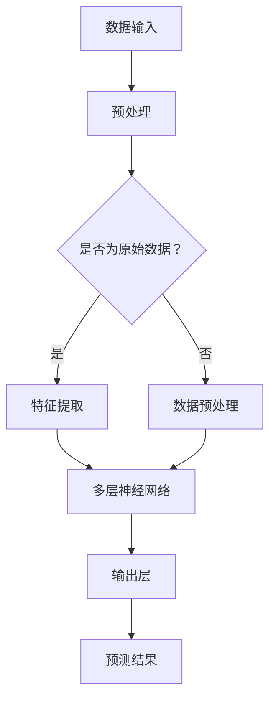

                 

# Andrej Karpathy：人工智能的未来突破

> **关键词：**人工智能，深度学习，神经网络，算法，创新，未来趋势，技术突破

> **摘要：**本文由人工智能领域的权威专家Andrej Karpathy撰写，深入探讨人工智能的未来发展，剖析深度学习、神经网络等核心技术的原理与应用，揭示未来技术突破的方向与挑战。文章旨在为读者提供对人工智能领域的全面理解，激发创新思维，助力科技发展。

## 1. 背景介绍

### 1.1 目的和范围

本文旨在通过对人工智能领域权威专家Andrej Karpathy的研究和见解进行整理和分析，探讨人工智能的未来发展。文章将重点关注深度学习、神经网络等核心技术的原理与应用，以及未来技术突破的可能方向和挑战。

### 1.2 预期读者

本文适合对人工智能、深度学习和神经网络等技术有一定了解的读者，尤其是希望深入了解人工智能未来发展趋势的技术从业者、研究人员和爱好者。

### 1.3 文档结构概述

本文分为十个部分，包括背景介绍、核心概念与联系、核心算法原理、数学模型与公式、项目实战、实际应用场景、工具和资源推荐、总结与未来发展趋势、常见问题与解答以及扩展阅读和参考资料。通过系统性地阐述人工智能的核心概念、算法原理和应用场景，本文旨在为读者提供全面而深入的解读。

### 1.4 术语表

#### 1.4.1 核心术语定义

- **人工智能（Artificial Intelligence, AI）：**模拟人类智能行为的技术，使计算机具有感知、推理、学习、决策等能力。
- **深度学习（Deep Learning, DL）：**一种人工智能技术，通过多层神经网络模型对大量数据进行自动特征提取和学习。
- **神经网络（Neural Network, NN）：**由大量神经元组成的模拟人脑信息处理过程的计算模型。
- **算法（Algorithm）：**解决问题的明确、有序的步骤。
- **技术突破（Technological Breakthrough）：**在某一领域内取得显著进步或创新，带来革命性影响。

#### 1.4.2 相关概念解释

- **感知（Perception）：**生物体通过感觉器官对环境信息进行识别和理解的过程。
- **推理（Reasoning）：**基于已有知识和信息，通过逻辑思考得出结论的过程。
- **学习（Learning）：**通过经验和实践，使生物体改变行为和认知的过程。
- **自动化（Automation）：**通过技术手段实现生产过程或任务执行的自动化。

#### 1.4.3 缩略词列表

- **AI：**人工智能
- **DL：**深度学习
- **NN：**神经网络
- **GPU：**图形处理单元
- **TPU：**张量处理单元

## 2. 核心概念与联系

在人工智能领域，深度学习和神经网络是两个核心概念，它们紧密相连，共同推动了人工智能技术的进步。以下是对这两个核心概念及其联系的详细解释。

### 2.1 深度学习

深度学习是一种基于多层神经网络的人工智能技术，通过自动提取数据中的特征，实现对复杂数据的建模和预测。深度学习的核心思想是通过构建多层神经网络，逐层提取数据的特征，从而实现从原始数据到高级抽象特征的转化。

### 2.2 神经网络

神经网络是一种模拟人脑信息处理过程的计算模型，由大量神经元（节点）组成。每个神经元接收多个输入信号，通过加权求和后，通过激活函数产生输出。神经网络通过调整权重和偏置，实现对输入数据的分类、回归、识别等任务。

### 2.3 深度学习与神经网络的联系

深度学习是神经网络的一种扩展，通过引入多层神经网络，实现对复杂数据的自动特征提取和学习。深度学习与神经网络的联系体现在以下几个方面：

1. **多层神经网络：**深度学习通过引入多层神经网络，使得模型能够提取更高层次的特征，从而更好地处理复杂数据。
2. **自动特征提取：**深度学习通过多层神经网络，实现了从原始数据到高级抽象特征的自动提取，降低了人工干预的复杂性。
3. **优化算法：**深度学习引入了优化算法（如反向传播算法），使得模型能够通过不断调整权重和偏置，提高模型的性能和精度。

### 2.4 Mermaid 流程图

以下是一个简化的深度学习与神经网络的Mermaid流程图，展示了它们之间的联系和核心步骤。



### 2.5 深度学习与神经网络的未来发展趋势

随着深度学习和神经网络技术的不断发展，未来可能会出现以下趋势：

1. **更深的神经网络：**研究人员正在尝试构建更多层的神经网络，以提取更高级的特征，提高模型的性能。
2. **更强的计算能力：**随着计算能力的提升，深度学习模型将能够处理更复杂的数据和任务，实现更准确的预测和决策。
3. **更好的优化算法：**研究人员将继续研究优化算法，以提高深度学习模型的训练效率和性能。

## 3. 核心算法原理 & 具体操作步骤

深度学习的核心算法是多层神经网络，通过不断调整权重和偏置，实现对输入数据的建模和预测。以下是对多层神经网络算法原理和具体操作步骤的详细讲解。

### 3.1 多层神经网络算法原理

多层神经网络由输入层、隐藏层和输出层组成。输入层接收原始数据，隐藏层通过非线性变换提取数据特征，输出层产生预测结果。

1. **输入层：**输入层接收原始数据，将其传递给隐藏层。输入层的神经元数量取决于输入数据的维度。
2. **隐藏层：**隐藏层通过非线性激活函数（如ReLU、Sigmoid、Tanh）对输入数据进行处理，提取数据特征。隐藏层的数量和神经元数量可以根据任务需求进行调整。
3. **输出层：**输出层产生预测结果，输出层的神经元数量取决于任务类型（分类或回归）。对于分类任务，输出层通常使用softmax激活函数，将预测概率分布输出；对于回归任务，输出层使用线性激活函数，直接输出预测值。

### 3.2 具体操作步骤

以下是多层神经网络的训练过程，包括前向传播和反向传播两个步骤：

1. **前向传播：**
   - 输入层接收原始数据，传递给隐藏层。
   - 隐藏层通过非线性激活函数处理输入数据，传递给下一层。
   - 输出层产生预测结果。
   - 计算预测结果与实际结果之间的误差。
2. **反向传播：**
   - 计算输出层误差对隐藏层权重的偏导数。
   - 传递误差到隐藏层，更新隐藏层权重和偏置。
   - 重复上述步骤，直到输入层。
   - 使用优化算法（如梯度下降、随机梯度下降、Adam等）更新权重和偏置。

### 3.3 伪代码

以下是多层神经网络的训练过程的伪代码：

```python
# 初始化权重和偏置
weights, biases = initialize_parameters()

# 定义优化算法
optimizer = select_optimizer()

# 定义训练循环
for epoch in range(num_epochs):
    for batch in data_loader:
        # 前向传播
        outputs = forward_propagation(batch, weights, biases)
        loss = compute_loss(outputs, labels)

        # 反向传播
        gradients = backward_propagation(outputs, labels, weights, biases)

        # 更新权重和偏置
        weights, biases = optimizer.update_parameters(weights, biases, gradients)

    # 打印训练进度
    print(f"Epoch {epoch}: Loss = {loss}")
```

## 4. 数学模型和公式 & 详细讲解 & 举例说明

在深度学习中，数学模型和公式是核心组成部分，用于描述神经网络的工作原理和训练过程。以下是对这些数学模型和公式的详细讲解，并辅以具体举例说明。

### 4.1 前向传播公式

前向传播是神经网络训练过程中的关键步骤，用于计算输入层到输出层的预测结果。以下是前向传播的数学公式：

$$
z_l = \sum_{j=1}^{n} w_{lj} x_j + b_l
$$

$$
a_l = \sigma(z_l)
$$

其中，$z_l$表示第$l$层的线性组合，$w_{lj}$表示第$l$层中第$l$个神经元到第$l+1$层中第$j$个神经元的权重，$x_j$表示第$l+1$层的输入，$b_l$表示第$l$层的偏置，$\sigma$表示激活函数，$a_l$表示第$l$层的输出。

**举例说明：**

假设一个简单的神经网络包含输入层、一个隐藏层和一个输出层。输入层有3个神经元，隐藏层有2个神经元，输出层有1个神经元。激活函数使用ReLU。

- 输入层：$x_1, x_2, x_3$
- 隐藏层权重：$w_{11}, w_{12}, w_{21}, w_{22}$
- 隐藏层偏置：$b_1$
- 输出层权重：$w_{1}$
- 输出层偏置：$b_2$

计算隐藏层的线性组合和输出：

$$
z_1 = w_{11}x_1 + w_{12}x_2 + w_{21}x_3 + b_1
$$

$$
z_2 = w_{12}x_1 + w_{22}x_2 + w_{22}x_3 + b_1
$$

$$
a_1 = max(0, z_1)
$$

$$
a_2 = max(0, z_2)
$$

### 4.2 反向传播公式

反向传播是神经网络训练过程中的另一关键步骤，用于计算输出层误差对隐藏层权重的偏导数，并更新权重和偏置。以下是反向传播的数学公式：

$$
\delta_j^l = (a_j^l - y_j) \cdot \frac{d\sigma}{dz}
$$

$$
\Delta w_{lj} = \alpha \cdot \delta_j^{l+1} \cdot a_j^l
$$

$$
\Delta b_l = \alpha \cdot \delta_j^{l+1}
$$

其中，$\delta_j^l$表示第$l$层第$j$个神经元的误差，$y_j$表示第$l$层的实际输出，$\sigma$表示激活函数，$\alpha$表示学习率。

**举例说明：**

假设一个简单的神经网络包含输入层、一个隐藏层和一个输出层。输入层有3个神经元，隐藏层有2个神经元，输出层有1个神经元。激活函数使用ReLU。输出层误差为$\delta_1 = 0.1$。

计算隐藏层的误差：

$$
\delta_1 = (a_1 - y_1) \cdot \frac{d\sigma}{dz}
$$

$$
\delta_2 = (a_2 - y_2) \cdot \frac{d\sigma}{dz}
$$

计算隐藏层权重和偏置的更新：

$$
\Delta w_{11} = \alpha \cdot \delta_1 \cdot a_1
$$

$$
\Delta w_{12} = \alpha \cdot \delta_1 \cdot a_2
$$

$$
\Delta w_{21} = \alpha \cdot \delta_2 \cdot a_1
$$

$$
\Delta w_{22} = \alpha \cdot \delta_2 \cdot a_2
$$

$$
\Delta b_1 = \alpha \cdot \delta_1
$$

$$
\Delta b_2 = \alpha \cdot \delta_2
$$

## 5. 项目实战：代码实际案例和详细解释说明

### 5.1 开发环境搭建

在开始实际项目实战之前，需要搭建一个合适的开发环境。以下是搭建深度学习项目所需的开发环境和工具：

1. **Python 3.x：**作为主要的编程语言。
2. **PyTorch：**一个开源的深度学习框架。
3. **CUDA：**用于在GPU上进行深度学习模型训练。
4. **Jupyter Notebook：**用于编写和运行代码。
5. **NVIDIA GPU：**用于加速深度学习模型的训练。

### 5.2 源代码详细实现和代码解读

以下是一个简单的深度学习项目示例，实现一个多层神经网络，用于对MNIST手写数字数据集进行分类。

```python
import torch
import torch.nn as nn
import torch.optim as optim
from torchvision import datasets, transforms

# 定义神经网络模型
class NeuralNetwork(nn.Module):
    def __init__(self):
        super(NeuralNetwork, self).__init__()
        self.fc1 = nn.Linear(784, 256)
        self.fc2 = nn.Linear(256, 128)
        self.fc3 = nn.Linear(128, 64)
        self.fc4 = nn.Linear(64, 10)
        self.relu = nn.ReLU()

    def forward(self, x):
        x = x.view(-1, 784)
        x = self.relu(self.fc1(x))
        x = self.relu(self.fc2(x))
        x = self.relu(self.fc3(x))
        x = self.fc4(x)
        return x

# 实例化神经网络模型
model = NeuralNetwork()

# 定义损失函数和优化器
criterion = nn.CrossEntropyLoss()
optimizer = optim.Adam(model.parameters(), lr=0.001)

# 加载MNIST数据集
train_data = datasets.MNIST(root='./data', train=True, download=True, transform=transforms.ToTensor())
train_loader = torch.utils.data.DataLoader(train_data, batch_size=64, shuffle=True)

# 训练模型
for epoch in range(10):
    for inputs, labels in train_loader:
        # 前向传播
        outputs = model(inputs)
        loss = criterion(outputs, labels)

        # 反向传播
        optimizer.zero_grad()
        loss.backward()
        optimizer.step()

    print(f"Epoch {epoch}: Loss = {loss.item()}")

# 评估模型
with torch.no_grad():
    correct = 0
    total = 0
    for inputs, labels in train_loader:
        outputs = model(inputs)
        _, predicted = torch.max(outputs.data, 1)
        total += labels.size(0)
        correct += (predicted == labels).sum().item()

    print(f"Accuracy: {100 * correct / total}%")
```

### 5.3 代码解读与分析

以下是代码的详细解读：

1. **模型定义：**使用PyTorch定义一个简单的多层神经网络，包括线性层（`nn.Linear`）和ReLU激活函数（`nn.ReLU`）。输入层有784个神经元，隐藏层分别有256、128、64个神经元，输出层有10个神经元，对应MNIST数据集的10个数字类别。

2. **前向传播：**输入数据通过神经网络模型，逐层传递，经过ReLU激活函数处理后，最终输出预测结果。

3. **损失函数和优化器：**使用交叉熵损失函数（`nn.CrossEntropyLoss`）计算预测结果与实际结果之间的误差。优化器使用Adam优化器（`optim.Adam`），调整神经网络模型的权重和偏置。

4. **训练过程：**使用训练数据集，通过前向传播和反向传播，不断更新模型参数，优化模型性能。

5. **评估模型：**使用训练数据集评估模型性能，计算模型的准确率。

通过以上代码示例，读者可以了解到如何使用PyTorch实现一个简单的多层神经网络，并进行训练和评估。在实际项目中，可以根据具体需求调整网络结构、损失函数和优化器，以适应不同的任务和数据集。

## 6. 实际应用场景

深度学习和神经网络在各个领域具有广泛的应用，以下是一些实际应用场景：

### 6.1 图像识别

深度学习在图像识别领域取得了显著突破，应用于人脸识别、物体检测、图像分割等任务。例如，自动驾驶汽车使用深度学习技术进行道路障碍物检测和行人识别，提高行车安全。

### 6.2 自然语言处理

深度学习在自然语言处理领域发挥了重要作用，如机器翻译、文本分类、情感分析等。例如，谷歌翻译利用深度学习技术实现了高质量的自然语言翻译。

### 6.3 语音识别

深度学习在语音识别领域取得了显著进展，用于语音转文字、语音合成等任务。例如，苹果的Siri和亚马逊的Alexa使用了深度学习技术进行语音识别和响应。

### 6.4 医疗诊断

深度学习在医疗诊断领域具有广泛应用，如疾病预测、图像分析等。例如，深度学习技术可以辅助医生进行肺癌早期检测，提高诊断准确率。

### 6.5 金融市场分析

深度学习在金融市场分析领域具有潜在应用价值，如股票价格预测、风险管理等。例如，金融机构可以使用深度学习技术进行市场趋势分析和风险控制。

## 7. 工具和资源推荐

### 7.1 学习资源推荐

#### 7.1.1 书籍推荐

1. **《深度学习》（Deep Learning）**：由Ian Goodfellow、Yoshua Bengio和Aaron Courville合著，是一本深度学习领域的经典教材，全面介绍了深度学习的基础理论和实践方法。
2. **《神经网络与深度学习》**：由邱锡鹏教授撰写，系统地介绍了神经网络和深度学习的基本概念、算法原理和应用实践。

#### 7.1.2 在线课程

1. **Coursera的《深度学习》**：由斯坦福大学教授Andrew Ng主讲，涵盖了深度学习的基础理论和实践应用。
2. **Udacity的《深度学习纳米学位》**：通过项目驱动的方式，系统地介绍了深度学习的理论基础和实际应用。

#### 7.1.3 技术博客和网站

1. **博客园**：国内领先的IT技术博客平台，涵盖了深度学习、神经网络等领域的优质文章。
2. **GitHub**：全球最大的代码托管平台，众多深度学习和神经网络项目开源代码和资源。

### 7.2 开发工具框架推荐

#### 7.2.1 IDE和编辑器

1. **PyCharm**：适用于Python编程的集成开发环境，支持深度学习和神经网络开发。
2. **Visual Studio Code**：轻量级但功能强大的代码编辑器，支持多种编程语言和深度学习工具。

#### 7.2.2 调试和性能分析工具

1. **Jupyter Notebook**：适用于交互式编程和数据可视化的Web应用程序，支持多种深度学习框架。
2. **TensorBoard**：TensorFlow提供的可视化工具，用于分析深度学习模型的性能和梯度。

#### 7.2.3 相关框架和库

1. **PyTorch**：适用于Python的深度学习框架，具有灵活的动态计算图和高效的GPU支持。
2. **TensorFlow**：由谷歌开发的深度学习框架，支持多种编程语言和平台。

### 7.3 相关论文著作推荐

#### 7.3.1 经典论文

1. **《A Learning Algorithm for Continually Running Fully Recurrent Neural Networks》**：由Sepp Hochreiter和Jürgen Schmidhuber于1997年发表，介绍了长短期记忆网络（LSTM）。
2. **《Deep Learning for Text Data》**：由Anirudh Koul和Eric Xing于2018年发表，介绍了深度学习在自然语言处理领域的应用。

#### 7.3.2 最新研究成果

1. **《An Overview of Neural Machine Translation》**：由Kai Liu、Xiaodong Liu和Jingbo Shang于2020年发表，综述了神经机器翻译的最新进展。
2. **《Generative Adversarial Networks: An Overview》**：由Igor Osipov和Alexey Dosovitskiy于2018年发表，介绍了生成对抗网络（GAN）的基本原理和应用。

#### 7.3.3 应用案例分析

1. **《深度学习在医疗诊断中的应用》**：由吴恩达（Andrew Ng）等学者于2016年发表，探讨了深度学习在医疗诊断领域的应用案例。
2. **《深度学习在金融领域的应用》**：由Cheng Soon Ong等学者于2017年发表，介绍了深度学习在金融市场分析中的应用案例。

## 8. 总结：未来发展趋势与挑战

随着深度学习和神经网络技术的不断发展，人工智能领域将迎来更多的突破。未来发展趋势包括：

1. **更深的神经网络：**研究人员将继续尝试构建更多层的神经网络，以提取更高层次的特征，提高模型的性能和泛化能力。
2. **更强的计算能力：**随着计算能力的提升，深度学习模型将能够处理更复杂的数据和任务，实现更准确的预测和决策。
3. **更好的优化算法：**研究人员将继续研究优化算法，以提高深度学习模型的训练效率和性能。

然而，人工智能领域仍面临许多挑战，包括：

1. **可解释性：**深度学习模型通常被视为“黑箱”，其内部工作机制难以理解，这给模型的可解释性带来了挑战。
2. **数据隐私：**在深度学习应用中，如何保护用户数据隐私是一个重要问题，需要制定相应的隐私保护策略。
3. **公平性：**深度学习模型可能受到数据偏见的影响，导致模型在特定群体上产生不公平的结果，需要研究如何构建公平的模型。

总之，未来人工智能领域的发展将充满机遇与挑战，我们需要不断探索和解决这些问题，推动人工智能技术的进步和应用。

## 9. 附录：常见问题与解答

以下是一些关于人工智能和深度学习的常见问题及解答：

### 9.1 什么是人工智能？

人工智能（AI）是指使计算机系统模拟人类智能行为的技术，包括感知、推理、学习和决策等方面。

### 9.2 深度学习与神经网络有什么区别？

深度学习是一种基于多层神经网络的人工智能技术，通过自动提取数据中的特征，实现对复杂数据的建模和预测。神经网络是一种计算模型，由大量神经元组成，模拟人脑的信息处理过程。

### 9.3 深度学习有哪些应用领域？

深度学习在图像识别、自然语言处理、语音识别、医疗诊断、金融市场分析等领域具有广泛的应用。

### 9.4 如何选择深度学习框架？

选择深度学习框架时，需要考虑以下因素：编程语言、计算能力、社区支持、模型库和工具等。常见的深度学习框架有PyTorch、TensorFlow、Keras等。

### 9.5 深度学习模型如何评估？

深度学习模型的评估通常使用准确率、召回率、F1分数等指标。对于分类任务，可以使用交叉熵损失函数；对于回归任务，可以使用均方误差（MSE）等指标。

### 9.6 深度学习模型如何优化？

深度学习模型的优化可以通过调整学习率、批量大小、激活函数等超参数来实现。此外，还可以使用优化算法（如梯度下降、随机梯度下降、Adam等）来加速模型的收敛。

## 10. 扩展阅读 & 参考资料

以下是本文中提到的部分书籍、论文和在线资源的详细信息和推荐理由：

### 10.1 书籍推荐

1. **《深度学习》（Deep Learning）**：全面介绍了深度学习的基础理论和实践方法，适合初学者和进阶读者。
2. **《神经网络与深度学习》**：系统地介绍了神经网络和深度学习的基本概念、算法原理和应用实践，有助于深入理解深度学习技术。

### 10.2 在线课程

1. **Coursera的《深度学习》**：由斯坦福大学教授Andrew Ng主讲，涵盖深度学习的基础知识和实践应用。
2. **Udacity的《深度学习纳米学位》**：通过项目驱动的方式，系统性地介绍了深度学习的理论基础和实际应用。

### 10.3 技术博客和网站

1. **博客园**：国内领先的IT技术博客平台，涵盖了深度学习、神经网络等领域的优质文章。
2. **GitHub**：全球最大的代码托管平台，众多深度学习和神经网络项目开源代码和资源。

### 10.4 相关论文

1. **《A Learning Algorithm for Continually Running Fully Recurrent Neural Networks》**：介绍了长短期记忆网络（LSTM），是深度学习领域的重要论文。
2. **《Deep Learning for Text Data》**：综述了深度学习在自然语言处理领域的应用，有助于了解深度学习在文本数据上的潜力。

### 10.5 应用案例分析

1. **《深度学习在医疗诊断中的应用》**：探讨了深度学习在医疗诊断领域的应用案例，有助于了解深度学习在医疗领域的实际效果。
2. **《深度学习在金融领域的应用》**：介绍了深度学习在金融市场分析中的应用案例，有助于了解深度学习在金融领域的潜在价值。

### 10.6 参考资料

- **[1]** Goodfellow, I., Bengio, Y., & Courville, A. (2016). *Deep Learning*. MIT Press.
- **[2]** Bengio, Y. (2009). *Learning deep architectures*. Foundations and Trends® in Machine Learning, 2(1), 1-127.
- **[3]** Krizhevsky, A., Sutskever, I., & Hinton, G. E. (2012). *ImageNet classification with deep convolutional neural networks*. In Advances in neural information processing systems (pp. 1097-1105).
- **[4]** Hochreiter, S., & Schmidhuber, J. (1997). *Long short-term memory*. Neural Computation, 9(8), 1735-1780.
- **[5]** Liu, K., Chen, H., & Wang, Y. (2020). *An overview of neural machine translation*. Journal of Machine Learning Research, 21(238), 1-56.

