                 

# App电商业务系统核心架构设计

> 关键词：App电商、业务系统架构、微服务、高并发、分布式系统、容器化、负载均衡、数据库分库分表、缓存机制、安全性与性能优化

> 摘要：本文将深入探讨App电商业务系统的核心架构设计。通过详细的分析和讲解，我们将了解如何构建一个高效、可靠、可扩展的电商业务系统，以满足不断增长的用户需求。本文将涵盖从系统设计原则到具体技术实现，以及如何在实际项目中应用这些技术。

## 1. 背景介绍

### 1.1 目的和范围

本文旨在为开发者提供一份详细的技术指南，帮助理解App电商业务系统的核心架构设计。我们将讨论系统设计的原则、核心概念以及具体的实现技术。通过本文的学习，读者应能够：

- 理解App电商业务系统的基本架构和设计原则。
- 掌握微服务架构、分布式系统、高并发处理等关键技术的应用。
- 学习如何优化系统性能和确保系统安全性。

### 1.2 预期读者

本文适合以下读者群体：

- 有志于从事App电商业务系统开发的程序员和架构师。
- 拥有一定编程基础，希望深入理解系统架构的设计者。
- 对微服务、分布式系统等新技术有浓厚兴趣的技术爱好者。

### 1.3 文档结构概述

本文将按照以下结构展开：

- **第1章** 背景介绍：简要介绍文章的目的、范围和读者预期。
- **第2章** 核心概念与联系：讲解App电商业务系统的核心概念，并使用Mermaid流程图展示系统架构。
- **第3章** 核心算法原理 & 具体操作步骤：详细阐述核心算法原理和具体实现步骤。
- **第4章** 数学模型和公式 & 详细讲解 & 举例说明：讲解相关数学模型和公式的应用。
- **第5章** 项目实战：代码实际案例和详细解释说明：通过实际代码案例，展示系统实现细节。
- **第6章** 实际应用场景：分析App电商业务系统在实际中的应用。
- **第7章** 工具和资源推荐：推荐学习资源、开发工具和框架。
- **第8章** 总结：未来发展趋势与挑战：总结本文内容，展望未来趋势。
- **第9章** 附录：常见问题与解答：解答读者可能遇到的问题。
- **第10章** 扩展阅读 & 参考资料：提供进一步学习资源。

### 1.4 术语表

#### 1.4.1 核心术语定义

- **微服务**：一种将应用程序作为一组小型、独立服务的分布式系统架构。
- **分布式系统**：由多个计算机节点组成，通过通信网络互联，协同完成任务的系统。
- **高并发**：指系统在短时间内同时处理大量请求的能力。
- **容器化**：一种轻量级虚拟化技术，可以将应用程序及其依赖环境打包到容器中独立运行。
- **负载均衡**：将请求分配到多个服务器或节点，以均衡系统负载。
- **数据库分库分表**：将大数据量数据库拆分为多个小数据库或小表，以提高系统性能。
- **缓存机制**：将频繁访问的数据存储在内存中，以减少数据库访问次数，提高系统响应速度。

#### 1.4.2 相关概念解释

- **API网关**：作为系统的统一入口，负责处理外部请求，进行路由、认证等操作。
- **服务注册与发现**：服务启动时向注册中心注册，服务消费者从注册中心发现可用服务地址。
- **熔断与降级**：在服务不可用时，通过断开调用链路，保护系统稳定性。
- **分布式事务**：跨多个节点或服务的事务管理。

#### 1.4.3 缩略词列表

- **API**：应用程序编程接口（Application Programming Interface）
- **Docker**：一款开源的应用容器引擎，用于容器化应用部署
- **Kubernetes**：一款开源的容器编排与管理工具
- **MySQL**：一款开源的关系型数据库管理系统
- **Redis**：一款开源的内存数据存储系统，提供高速缓存和消息队列功能
- **Spring Boot**：一款基于Spring框架的快速开发工具
- **Dubbo**：一款开源的服务框架，用于构建分布式服务架构

## 2. 核心概念与联系

在App电商业务系统中，核心概念和架构设计是系统成功的关键。以下我们将通过Mermaid流程图展示系统架构，并逐一解释各个组件及其关系。

### 2.1. 系统架构图

```mermaid
graph TD
    Subsystem1[电商后台管理系统] --> Component1[用户管理]
    Subsystem1 --> Component2[商品管理]
    Subsystem1 --> Component3[订单管理]
    Subsystem1 --> Component4[库存管理]
    Subsystem1 --> Component5[支付系统]
    Subsystem2[电商移动端App] --> Component6[用户登录]
    Subsystem2 --> Component7[商品浏览]
    Subsystem2 --> Component8[购物车]
    Subsystem2 --> Component9[订单确认]
    Subsystem2 --> Component10[支付页面]
    Subsystem2 --> Component11[用户反馈]
    Subsystem3[数据存储层] --> Database1[用户数据库]
    Database1 --> Table1[用户表]
    Database1 --> Table2[商品表]
    Database1 --> Table3[订单表]
    Database1 --> Table4[库存表]
    Subsystem3 --> Database2[支付数据库]
    Database2 --> Table1[交易表]
    Database2 --> Table2[退款表]
    Subsystem4[消息队列] --> Message1[订单消息]
    Message1 --> Queue1[订单队列]
    Message1 --> Queue2[支付队列]
    Subsystem5[缓存层] --> Cache1[商品缓存]
    Cache1 --> Key1[商品ID]
    Cache2[用户缓存] --> Key2[用户ID]
    Subsystem6[API网关] --> Gateway1[用户登录接口]
    Gateway1 --> Service1[用户服务]
    Gateway1 --> Service2[商品服务]
    Gateway1 --> Service3[订单服务]
    Gateway1 --> Service4[支付服务]
    Subsystem7[服务注册与发现] --> Registry1[服务注册]
    Registry1 --> ServiceRegistry[服务注册中心]
    Subsystem8[负载均衡器] --> LoadBalancer1[请求负载均衡]
    LoadBalancer1 --> Service1
    LoadBalancer1 --> Service2
    LoadBalancer1 --> Service3
    LoadBalancer1 --> Service4
```



### 2.2. 系统架构解释

- **电商后台管理系统**：负责管理用户、商品、订单、库存和支付等核心业务。
- **电商移动端App**：为用户提供商品浏览、购物车、订单确认、支付和反馈等交互功能。
- **数据存储层**：包括用户数据库、支付数据库等，负责存储用户、商品、订单和交易等数据。
- **消息队列**：用于异步处理订单和支付消息，确保系统高并发下的稳定性。
- **缓存层**：缓存商品和用户信息，减少数据库访问次数，提高系统响应速度。
- **API网关**：统一处理外部请求，进行路由、认证和权限控制。
- **服务注册与发现**：服务启动时注册，消费者通过注册中心发现服务。
- **负载均衡器**：将请求分配到多个服务器或节点，确保系统的高可用性。

通过上述架构设计，App电商业务系统实现了模块化、分布式和高可用性，可以满足不断增长的用户需求和业务扩展。

## 3. 核心算法原理 & 具体操作步骤

在App电商业务系统中，核心算法和数据处理流程是实现系统高效运行的关键。以下我们将详细讲解核心算法原理，并通过伪代码展示具体操作步骤。

### 3.1. 用户管理算法

用户管理是电商系统的核心功能之一，负责用户的注册、登录、权限验证等操作。以下是一个简单的用户管理算法：

```python
# 用户注册
def register(username, password):
    # 检查用户名是否已存在
    if check_username_exists(username):
        return "用户名已存在"
    # 存储用户信息到数据库
    store_user_info_to_db(username, password)
    return "注册成功"

# 用户登录
def login(username, password):
    # 验证用户名和密码
    if verify_username_password(username, password):
        # 登录成功，生成令牌
        token = generate_token(username)
        return token
    return "登录失败"

# 权限验证
def check_permission(username, permission):
    # 从数据库中获取用户权限
    user_permissions = get_user_permissions_from_db(username)
    # 检查用户是否有指定权限
    if permission in user_permissions:
        return "权限验证通过"
    return "权限验证失败"
```

### 3.2. 商品管理算法

商品管理包括商品的添加、查询、修改和删除等操作。以下是一个简单的商品管理算法：

```python
# 添加商品
def add_product(product_info):
    # 存储商品信息到数据库
    store_product_info_to_db(product_info)
    return "商品添加成功"

# 查询商品
def search_product(product_id):
    # 从数据库中查询商品信息
    product_info = get_product_info_from_db(product_id)
    return product_info

# 修改商品
def update_product(product_id, new_info):
    # 更新数据库中的商品信息
    update_product_info_in_db(product_id, new_info)
    return "商品更新成功"

# 删除商品
def delete_product(product_id):
    # 从数据库中删除商品信息
    delete_product_info_from_db(product_id)
    return "商品删除成功"
```

### 3.3. 订单管理算法

订单管理负责处理用户的订单创建、查询、取消和支付等操作。以下是一个简单的订单管理算法：

```python
# 创建订单
def create_order(order_info):
    # 生成订单编号
    order_id = generate_order_id()
    # 存储订单信息到数据库
    store_order_info_to_db(order_id, order_info)
    return order_id

# 查询订单
def search_order(order_id):
    # 从数据库中查询订单信息
    order_info = get_order_info_from_db(order_id)
    return order_info

# 取消订单
def cancel_order(order_id):
    # 从数据库中取消订单信息
    cancel_order_info_in_db(order_id)
    return "订单取消成功"

# 支付订单
def pay_order(order_id, payment_info):
    # 验证支付信息
    if verify_payment_info(payment_info):
        # 支付成功，更新订单状态
        update_order_status_in_db(order_id, "已支付")
        return "支付成功"
    return "支付失败"
```

通过上述算法，我们可以实现App电商业务系统中的用户管理、商品管理和订单管理功能。实际应用中，这些算法需要与数据库、缓存、消息队列等其他组件协同工作，以确保系统的整体性能和稳定性。

## 4. 数学模型和公式 & 详细讲解 & 举例说明

在App电商业务系统中，数学模型和公式是用于描述系统性能、算法效率和资源分配的重要工具。以下我们将介绍几个关键数学模型和公式，并进行详细讲解和举例说明。

### 4.1. 并发性能模型

并发性能模型用于衡量系统在处理大量请求时的性能。以下是一个简单的并发性能模型公式：

$$
P = \frac{C \cdot T}{N}
$$

其中，\(P\) 表示系统并发性能，\(C\) 表示服务器能力（如CPU核心数），\(T\) 表示服务处理时间，\(N\) 表示请求量。

**详细讲解：**
- \(C\)：服务器的硬件性能，如CPU核心数。
- \(T\)：单个请求处理所需时间，包括网络延迟、处理逻辑和存储访问等。
- \(N\)：系统需要处理的请求总量。

**举例说明：**
假设我们有一个4核CPU的服务器，处理单个请求的平均时间为2秒，总请求量为1000次。代入公式计算，得到系统的并发性能为：

$$
P = \frac{4 \cdot 2}{1000} = 0.008
$$

这意味着系统在处理1000个请求时，每个请求的平均延迟为0.008秒。

### 4.2. 负载均衡公式

负载均衡用于将请求分配到多个服务器或节点，以均衡系统负载。以下是一个简单的负载均衡公式：

$$
R_i = \frac{N_i}{\sum_{j=1}^{m} N_j}
$$

其中，\(R_i\) 表示第\(i\)个节点的负载率，\(N_i\) 表示第\(i\)个节点的请求量，\(m\) 表示总节点数。

**详细讲解：**
- \(R_i\)：节点的负载率，表示节点处理请求的能力利用率。
- \(N_i\)：节点的请求量。
- \(m\)：总节点数。

**举例说明：**
假设我们有一个3个节点的负载均衡系统，节点1的请求量为1000次，节点2的请求量为2000次，节点3的请求量为3000次。代入公式计算，得到各个节点的负载率为：

$$
R_1 = \frac{1000}{1000 + 2000 + 3000} = 0.2
$$

$$
R_2 = \frac{2000}{1000 + 2000 + 3000} = 0.4
$$

$$
R_3 = \frac{3000}{1000 + 2000 + 3000} = 0.6
$$

这意味着节点1的负载率为20%，节点2的负载率为40%，节点3的负载率为60%。

### 4.3. 缓存命中率公式

缓存命中率用于衡量缓存的利用效率。以下是一个简单的缓存命中率公式：

$$
Hit_Rate = \frac{Hit_Count}{Request_Count}
$$

其中，\(Hit_Rate\) 表示缓存命中率，\(Hit_Count\) 表示命中缓存次数，\(Request_Count\) 表示总请求次数。

**详细讲解：**
- \(Hit_Rate\)：缓存命中率，表示缓存命中的比例。
- \(Hit_Count\)：命中缓存次数。
- \(Request_Count\)：总请求次数。

**举例说明：**
假设我们有一个缓存系统，总请求次数为1000次，命中缓存次数为800次。代入公式计算，得到缓存命中率为：

$$
Hit_Rate = \frac{800}{1000} = 0.8
$$

这意味着缓存命中率达到了80%，系统性能得到了显著提升。

通过上述数学模型和公式，我们可以更好地理解和优化App电商业务系统的性能和效率。在实际应用中，这些模型和公式需要根据具体情况进行调整和优化，以达到最佳效果。

## 5. 项目实战：代码实际案例和详细解释说明

为了更好地理解App电商业务系统的实现，我们将通过一个实际的项目案例来展示系统的关键组件和代码实现。以下是一个简单的电商系统项目，包括用户管理、商品管理和订单管理模块。

### 5.1. 开发环境搭建

在开始编写代码之前，我们需要搭建开发环境。以下是一个基本的开发环境搭建步骤：

1. 安装Java开发工具包（JDK）。
2. 安装Git版本控制系统。
3. 安装MySQL数据库。
4. 安装Docker和Kubernetes。
5. 配置Maven构建工具。

### 5.2. 源代码详细实现和代码解读

#### 5.2.1. 用户管理模块

用户管理模块包括用户注册、登录和权限验证功能。以下是一个简单的用户管理模块实现：

```java
// 用户注册
public String register(String username, String password) {
    if (checkUsernameExists(username)) {
        return "用户名已存在";
    }
    storeUserInfoToDb(username, password);
    return "注册成功";
}

// 用户登录
public String login(String username, String password) {
    if (verifyUsernamePassword(username, password)) {
        String token = generateToken(username);
        return token;
    }
    return "登录失败";
}

// 权限验证
public String checkPermission(String username, String permission) {
    List<String> userPermissions = getUserPermissionsFromDb(username);
    if (userPermissions.contains(permission)) {
        return "权限验证通过";
    }
    return "权限验证失败";
}
```

**详细解释：**
- `register` 方法用于用户注册，检查用户名是否已存在，若不存在则将用户信息存储到数据库。
- `login` 方法用于用户登录，验证用户名和密码，若验证通过则生成令牌。
- `checkPermission` 方法用于权限验证，从数据库中获取用户权限，并检查是否具有指定权限。

#### 5.2.2. 商品管理模块

商品管理模块包括商品添加、查询、修改和删除功能。以下是一个简单的商品管理模块实现：

```java
// 添加商品
public String addProduct(Product product) {
    storeProductInfoToDb(product);
    return "商品添加成功";
}

// 查询商品
public Product searchProduct(String productId) {
    return getProductInfoFromDb(productId);
}

// 修改商品
public String updateProduct(String productId, Product newProduct) {
    updateProductInfoInDb(productId, newProduct);
    return "商品更新成功";
}

// 删除商品
public String deleteProduct(String productId) {
    deleteProductInfoFromDb(productId);
    return "商品删除成功";
}
```

**详细解释：**
- `addProduct` 方法用于添加商品，将商品信息存储到数据库。
- `searchProduct` 方法用于查询商品，从数据库中获取商品信息。
- `updateProduct` 方法用于修改商品，更新数据库中的商品信息。
- `deleteProduct` 方法用于删除商品，从数据库中删除商品信息。

#### 5.2.3. 订单管理模块

订单管理模块包括订单创建、查询、取消和支付功能。以下是一个简单的订单管理模块实现：

```java
// 创建订单
public String createOrder(Order order) {
    String orderId = generateOrderId();
    storeOrderInfoToDb(orderId, order);
    return orderId;
}

// 查询订单
public Order searchOrder(String orderId) {
    return getOrderInfoFromDb(orderId);
}

// 取消订单
public String cancelOrder(String orderId) {
    cancelOrderInfoInDb(orderId);
    return "订单取消成功";
}

// 支付订单
public String payOrder(String orderId, Payment payment) {
    if (verifyPaymentInfo(payment)) {
        updateOrderStatusInDb(orderId, "已支付");
        return "支付成功";
    }
    return "支付失败";
}
```

**详细解释：**
- `createOrder` 方法用于创建订单，生成订单编号，并将订单信息存储到数据库。
- `searchOrder` 方法用于查询订单，从数据库中获取订单信息。
- `cancelOrder` 方法用于取消订单，从数据库中取消订单信息。
- `payOrder` 方法用于支付订单，验证支付信息，并更新订单状态。

### 5.3. 代码解读与分析

通过上述代码实现，我们可以看到用户管理、商品管理和订单管理模块的基本结构。每个模块都包含了常用的增删改查操作，并实现了核心业务功能。

- **用户管理模块**：主要实现了用户注册、登录和权限验证功能，是系统的入口模块。
- **商品管理模块**：主要实现了商品添加、查询、修改和删除功能，是电商系统的核心模块之一。
- **订单管理模块**：主要实现了订单创建、查询、取消和支付功能，是电商系统的重要模块。

在实际应用中，这些模块需要与数据库、缓存、消息队列等其他组件进行协同工作，以确保系统的整体性能和稳定性。通过模块化设计和分布式架构，我们可以实现高效、可靠和可扩展的App电商业务系统。

## 6. 实际应用场景

在实际应用中，App电商业务系统面临各种复杂的业务场景和挑战。以下我们列举几个常见的应用场景，并探讨如何应对这些场景。

### 6.1. 高并发场景

在高并发场景下，系统需要同时处理大量用户请求，这可能导致系统性能下降，甚至出现服务不可用的情况。为了应对高并发场景，可以采用以下策略：

- **负载均衡**：使用负载均衡器将请求分配到多个服务器或节点，确保系统的高可用性。
- **缓存机制**：使用缓存机制减少数据库访问次数，提高系统响应速度。
- **数据库分库分表**：将大数据量数据库拆分为多个小数据库或小表，提高数据库查询效率。
- **分布式存储**：使用分布式存储系统，确保数据的高可用性和可靠性。

### 6.2. 安全性问题

在App电商业务系统中，安全性是一个至关重要的议题。以下是一些常见的安全问题和应对策略：

- **用户认证与授权**：使用强密码策略、双因素认证等措施，确保用户身份的合法性和安全性。
- **数据加密**：对敏感数据如用户密码、支付信息等进行加密处理，防止数据泄露。
- **防SQL注入**：对用户输入的数据进行过滤和验证，防止恶意SQL注入攻击。
- **防XSS攻击**：对用户输入的数据进行编码处理，防止跨站脚本攻击。

### 6.3. 数据一致性问题

在分布式系统中，数据一致性问题是一个常见且棘手的问题。以下是一些常见的数据一致性问题及应对策略：

- **最终一致性**：在分布式系统中，允许不同节点之间的数据存在一定的延迟，最终达到一致性。
- **两阶段提交协议**：用于确保分布式事务的一致性，通过协调事务参与者，实现原子性操作。
- **分布式锁**：用于保证分布式系统中对共享资源的互斥访问，防止数据竞争。

### 6.4. 性能优化问题

性能优化是App电商业务系统中的重要一环。以下是一些常见的性能优化问题和应对策略：

- **缓存机制**：使用缓存机制减少数据库访问次数，提高系统响应速度。
- **数据库优化**：通过索引、查询优化、分库分表等措施，提高数据库查询效率。
- **代码优化**：通过优化算法、减少冗余代码、避免不必要的对象创建等措施，提高系统性能。
- **负载均衡**：通过负载均衡将请求分配到多个服务器或节点，确保系统的高可用性。

通过上述策略和措施，我们可以有效地应对App电商业务系统在实际应用中面临的各类问题和挑战，确保系统的稳定运行和良好性能。

## 7. 工具和资源推荐

在开发App电商业务系统时，选择合适的工具和资源对于提高开发效率和系统性能至关重要。以下我们将推荐一些学习资源、开发工具和框架，以及相关的论文著作。

### 7.1. 学习资源推荐

#### 7.1.1. 书籍推荐

- 《微服务设计》：介绍了微服务架构的基本概念和实践方法，适合初学者和有经验开发者。
- 《分布式系统设计》：详细讲解了分布式系统架构、数据一致性和容错机制，对构建高可用性系统有很大帮助。
- 《高性能MySQL》：深入讲解了MySQL数据库的优化技巧和性能调优策略，适合数据库开发者。

#### 7.1.2. 在线课程

- 《微服务架构实战》：慕课网上的实战课程，通过案例教学，帮助开发者掌握微服务架构的核心概念和技术。
- 《分布式系统原理与实战》：网易云课堂上的课程，讲解了分布式系统设计、数据一致性和容错机制等关键知识点。
- 《Java并发编程实战》：极客时间的课程，深入讲解了Java并发编程的核心原理和实战技巧。

#### 7.1.3. 技术博客和网站

- 《阿里巴巴技术博客》：阿里巴巴官方技术博客，分享了大量技术文章和实践经验，对开发App电商业务系统有很大帮助。
- 《芋道源码》：作者芋道分享了自己在开发App电商业务系统中的经验和心得，内容深入浅出，适合开发者学习。
- 《掘金》：一个IT技术社区，汇集了大量的技术文章和讨论，可以随时了解业界动态和技术趋势。

### 7.2. 开发工具框架推荐

#### 7.2.1. IDE和编辑器

- IntelliJ IDEA：一款功能强大的Java集成开发环境，支持代码补全、调试、性能分析等特性。
- Visual Studio Code：一款轻量级但功能丰富的代码编辑器，支持多种编程语言和插件，适用于各类开发需求。

#### 7.2.2. 调试和性能分析工具

- Java VisualVM：一款Java虚拟机监控和分析工具，可以实时查看系统性能指标、线程状态等。
- Prometheus：一款开源的监控报警工具，可以监控系统性能和资源利用率，实现自动报警和自动化运维。
- JMeter：一款开源的性能测试工具，可以模拟大量用户请求，评估系统的性能和并发能力。

#### 7.2.3. 相关框架和库

- Spring Boot：一款基于Spring框架的快速开发工具，简化了Spring应用的配置和部署过程。
- Spring Cloud：一款基于Spring Boot的微服务开发框架，提供了服务注册与发现、负载均衡、分布式配置等微服务特性。
- Dubbo：一款开源的服务框架，用于构建分布式服务架构，实现了服务注册与发现、负载均衡、服务降级等功能。
- Redis：一款开源的内存数据存储系统，提供高速缓存和消息队列功能，适用于高并发场景。

### 7.3. 相关论文著作推荐

#### 7.3.1. 经典论文

- 《大规模分布式存储系统设计》：详细讲解了Google的分布式文件系统GFS的设计和实现。
- 《CAP定理》：证明了分布式系统中一致性、可用性和分区容错性三者之间不可同时满足，为分布式系统设计提供了理论基础。
- 《一致性模型与分布式事务处理》：介绍了分布式事务处理的各种一致性模型和算法。

#### 7.3.2. 最新研究成果

- 《基于微服务架构的电商平台设计与实现》：介绍了基于微服务架构的电商平台设计方法和实现细节，对当前电商平台的发展趋势有很大启示。
- 《云计算环境下大数据处理技术》：探讨了云计算环境下大数据处理的新技术、新方法和新应用场景。
- 《区块链技术在电商领域的应用研究》：分析了区块链技术在电商领域的应用潜力，探讨了区块链技术在数据安全、交易透明等方面的优势。

#### 7.3.3. 应用案例分析

- 《阿里巴巴电商业务架构演进史》：详细介绍了阿里巴巴电商业务架构的演进过程，分析了电商平台在不同阶段面临的技术挑战和解决方案。
- 《亚马逊电商业务架构分析》：对亚马逊电商业务架构进行了深入分析，探讨了亚马逊如何通过技术创新实现业务增长。
- 《京东电商业务系统架构设计》：介绍了京东电商业务系统架构的设计原则和技术实现，对电商系统架构设计提供了有益的借鉴。

通过上述工具和资源推荐，开发者可以更好地掌握App电商业务系统的设计和实现，提升系统性能和可靠性，为用户带来更好的购物体验。

## 8. 总结：未来发展趋势与挑战

随着互联网技术的不断发展，App电商业务系统正面临着巨大的机遇与挑战。未来，以下几个趋势和挑战将影响电商业务系统的设计和实现：

### 8.1. 发展趋势

1. **云计算与大数据技术的融合**：云计算和大数据技术的快速发展，为电商业务系统提供了更强大的计算能力和数据存储能力。通过云计算，企业可以更加灵活地扩展系统资源，实现按需伸缩。大数据技术则可以帮助企业深入挖掘用户行为数据，实现个性化推荐和精准营销。

2. **人工智能与机器学习的应用**：人工智能和机器学习技术在电商业务系统中的应用越来越广泛。通过图像识别、自然语言处理等技术，电商系统可以实现更智能的搜索和推荐，提升用户体验。此外，人工智能还可以应用于库存管理、订单处理等环节，提高系统效率。

3. **区块链技术的探索**：区块链技术具有去中心化、不可篡改等特点，在电商业务系统中具有潜在的应用价值。例如，区块链可以用于实现安全的支付和交易，防止欺诈行为。未来，随着区块链技术的成熟，电商业务系统有望进一步整合区块链技术，提升业务安全性和透明度。

4. **移动端和智能设备的普及**：随着移动互联网和智能设备的普及，越来越多的用户通过移动端和智能设备进行购物。电商业务系统需要针对移动端和智能设备进行优化，提供更加便捷和流畅的购物体验。

### 8.2. 挑战

1. **数据安全和隐私保护**：电商业务系统涉及大量用户数据和交易数据，数据安全和隐私保护是系统设计的重要挑战。未来，需要加强数据加密、访问控制等技术手段，确保用户数据的安全性和隐私性。

2. **高并发和性能优化**：随着用户规模的不断扩大，电商业务系统需要应对高并发访问和性能优化挑战。通过负载均衡、缓存机制、数据库分库分表等技术手段，可以提升系统性能和稳定性。

3. **分布式系统的可靠性**：分布式系统在实现高可用性和可扩展性的同时，也带来了可靠性挑战。如何确保分布式系统的稳定性、数据一致性和容错性，是未来需要重点解决的问题。

4. **法律法规和合规要求**：电商业务系统需要遵守相关的法律法规和合规要求，如数据保护法、反欺诈法等。未来，企业需要密切关注法律法规的变化，确保业务系统的合规性。

综上所述，App电商业务系统在未来的发展中，将面临一系列机遇与挑战。通过不断探索新技术、优化系统架构和提升用户体验，企业可以更好地应对这些挑战，实现业务的持续发展和增长。

## 9. 附录：常见问题与解答

### 9.1. 高并发场景下如何优化系统性能？

**解答**：在高并发场景下，优化系统性能可以从以下几个方面入手：

1. **负载均衡**：使用负载均衡器将请求分配到多个服务器或节点，确保系统的高可用性。
2. **缓存机制**：使用缓存机制减少数据库访问次数，提高系统响应速度。
3. **数据库优化**：通过索引、查询优化、分库分表等措施，提高数据库查询效率。
4. **代码优化**：优化算法、减少冗余代码、避免不必要的对象创建等措施，提高系统性能。
5. **异步处理**：使用消息队列等技术，实现异步处理，降低系统同步调用压力。

### 9.2. 如何保证数据的一致性？

**解答**：保证数据一致性可以从以下几个方面入手：

1. **最终一致性**：在分布式系统中，允许不同节点之间的数据存在一定的延迟，最终达到一致性。
2. **两阶段提交协议**：通过协调事务参与者，实现原子性操作，确保数据的一致性。
3. **分布式锁**：用于保证分布式系统中对共享资源的互斥访问，防止数据竞争。
4. **消息队列**：使用消息队列实现数据的异步传递，确保数据的一致性。

### 9.3. 如何提高系统的安全性？

**解答**：提高系统的安全性可以从以下几个方面入手：

1. **用户认证与授权**：使用强密码策略、双因素认证等措施，确保用户身份的合法性。
2. **数据加密**：对敏感数据如用户密码、支付信息等进行加密处理，防止数据泄露。
3. **防SQL注入**：对用户输入的数据进行过滤和验证，防止恶意SQL注入攻击。
4. **防XSS攻击**：对用户输入的数据进行编码处理，防止跨站脚本攻击。

### 9.4. 如何优化数据库性能？

**解答**：优化数据库性能可以从以下几个方面入手：

1. **索引优化**：合理使用索引，提高查询效率。
2. **查询优化**：优化SQL查询语句，避免使用子查询、联结等复杂查询。
3. **分库分表**：将大数据量数据库拆分为多个小数据库或小表，提高查询效率。
4. **读写分离**：通过读写分离，减轻数据库负载，提高系统性能。
5. **缓存机制**：使用缓存机制，减少数据库访问次数，提高系统响应速度。

## 10. 扩展阅读 & 参考资料

### 10.1. 扩展阅读

- 《微服务设计》： Martin Fowler 著，详细介绍了微服务架构的基本概念和实践方法。
- 《分布式系统设计》： 刘铁岩 著，讲解了分布式系统架构、数据一致性和容错机制等关键知识点。
- 《云计算与大数据技术》： 张洋 著，探讨了云计算和大数据技术在电商业务系统中的应用。

### 10.2. 参考资料

- [《阿里巴巴技术博客》](https://tech.alibabacloud.com/)
- [《芋道源码》](https://www.iocoder.cn/)
- [《掘金》](https://juejin.cn/)
- [《Apache Kafka》官方文档](https://kafka.apache.org/documentation/)
- [《Apache Dubbo》官方文档](https://dubbo.apache.org/)
- [《Spring Cloud》官方文档](https://springcloud.cn/)

通过上述扩展阅读和参考资料，开发者可以进一步了解App电商业务系统的设计和实现细节，提升系统性能和可靠性。作者：AI天才研究员/AI Genius Institute & 禅与计算机程序设计艺术 /Zen And The Art of Computer Programming

（注：本文为示例文章，部分内容仅供参考。实际应用中，请结合具体业务需求和场景进行设计和优化。）

