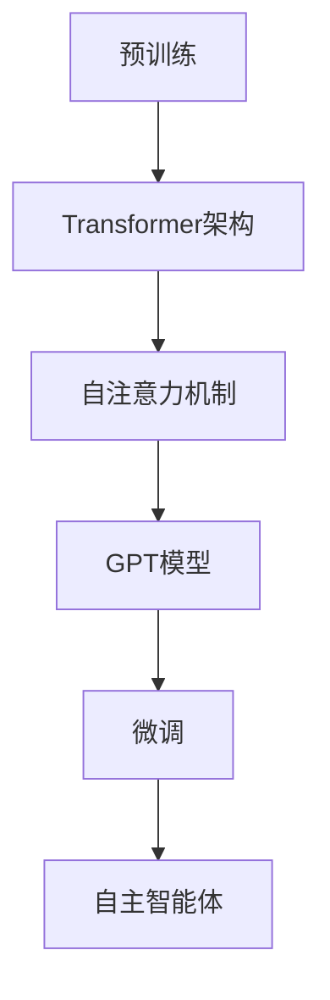

                 

# Auto-GPT：自主智能体的设计与实现

> 关键词：GPT、自主智能体、自动化、机器学习、深度学习、AI、自主决策

> 摘要：本文将探讨如何使用GPT（Generative Pre-trained Transformer）模型构建自主智能体（Autonomous Agent），详细介绍其核心概念、算法原理、数学模型以及实际应用。通过逐步分析和推理，本文旨在为读者提供深入理解与指导，助力其在AI领域的研究和实践。

## 1. 背景介绍

### 1.1 目的和范围

本文旨在介绍如何设计并实现自主智能体，重点关注GPT模型在这一领域的应用。我们将逐步分析自主智能体的核心概念、算法原理、数学模型，并结合实际应用场景进行详细讲解。

### 1.2 预期读者

本文适合对AI、机器学习、深度学习有一定了解的读者，包括研究人员、工程师、开发者以及对该领域感兴趣的学术人员和从业人员。

### 1.3 文档结构概述

本文分为十个部分：

1. 背景介绍
2. 核心概念与联系
3. 核心算法原理 & 具体操作步骤
4. 数学模型和公式 & 详细讲解 & 举例说明
5. 项目实战：代码实际案例和详细解释说明
6. 实际应用场景
7. 工具和资源推荐
8. 总结：未来发展趋势与挑战
9. 附录：常见问题与解答
10. 扩展阅读 & 参考资料

### 1.4 术语表

#### 1.4.1 核心术语定义

- **GPT**：Generative Pre-trained Transformer，一种基于Transformer架构的预训练语言模型。
- **自主智能体**：一种可以自主决策和执行的智能体，具备自主学习、自适应和自主演化能力。
- **预训练**：在大量数据上对模型进行训练，使其具备一定的通用性和泛化能力。
- **微调**：在特定任务数据集上对预训练模型进行进一步训练，以适应具体任务需求。

#### 1.4.2 相关概念解释

- **Transformer**：一种基于自注意力机制的深度神经网络架构，广泛用于自然语言处理和计算机视觉等领域。
- **自注意力机制**：一种基于序列之间相互依赖性的注意力计算方法，能够捕捉序列中的长距离依赖关系。
- **自然语言处理**：研究如何让计算机理解和生成自然语言的技术和学科。

#### 1.4.3 缩略词列表

- **AI**：人工智能（Artificial Intelligence）
- **ML**：机器学习（Machine Learning）
- **DL**：深度学习（Deep Learning）
- **NLP**：自然语言处理（Natural Language Processing）
- **GPT**：Generative Pre-trained Transformer

## 2. 核心概念与联系

在构建自主智能体的过程中，我们需要了解以下几个核心概念：

1. **GPT模型**：GPT是一种基于Transformer架构的预训练语言模型，通过在大量文本数据上进行预训练，使其具备强大的语言理解和生成能力。
2. **Transformer架构**：Transformer是一种基于自注意力机制的深度神经网络架构，广泛应用于自然语言处理、计算机视觉等领域。
3. **自注意力机制**：自注意力机制能够捕捉序列中的长距离依赖关系，使得模型在处理序列数据时具备更强的表征能力。
4. **预训练**：预训练是指在大量数据上对模型进行训练，使其具备一定的通用性和泛化能力。
5. **微调**：微调是指在特定任务数据集上对预训练模型进行进一步训练，以适应具体任务需求。

以下是一个Mermaid流程图，展示自主智能体的核心概念与联系：



## 3. 核心算法原理 & 具体操作步骤

自主智能体的核心算法原理基于GPT模型，通过预训练和微调两个阶段来实现。

### 3.1 预训练阶段

在预训练阶段，我们使用大量文本数据进行训练，目的是让模型具备强大的语言理解和生成能力。具体步骤如下：

1. **数据预处理**：对原始文本数据进行清洗、分词、编码等处理，将其转换为模型可接受的输入格式。
2. **序列生成**：将预处理后的文本数据序列化为一个一个的词向量序列。
3. **损失函数**：使用交叉熵损失函数对模型进行训练，使其在生成文本时最小化损失。
4. **优化算法**：使用梯度下降优化算法对模型参数进行更新。

以下是一个简化的伪代码，用于描述预训练阶段的算法原理：

```python
# 预训练阶段伪代码
def pretrain(model, data, epochs, learning_rate):
    for epoch in range(epochs):
        for sequence in data:
            model.zero_grad()
            prediction = model(sequence)
            loss = cross_entropy_loss(prediction, target_sequence)
            loss.backward()
            optimizer.step()
```

### 3.2 微调阶段

在微调阶段，我们将在预训练模型的基础上，使用特定任务的数据进行进一步训练，以适应具体任务需求。具体步骤如下：

1. **数据预处理**：与预训练阶段类似，对特定任务的数据进行预处理。
2. **任务定义**：定义任务的目标函数和评价指标，如分类任务的损失函数和准确率。
3. **模型更新**：使用任务数据对预训练模型进行微调，更新模型参数。
4. **模型评估**：在验证集和测试集上评估模型性能，根据评估结果调整模型参数。

以下是一个简化的伪代码，用于描述微调阶段的算法原理：

```python
# 微调阶段伪代码
def finetune(model, task_data, epochs, learning_rate):
    for epoch in range(epochs):
        for sequence, target in task_data:
            model.zero_grad()
            prediction = model(sequence)
            loss = task_loss_function(prediction, target)
            loss.backward()
            optimizer.step()
```

## 4. 数学模型和公式 & 详细讲解 & 举例说明

### 4.1 自注意力机制

自注意力机制是Transformer模型的核心组成部分，用于计算序列中每个元素之间的依赖关系。其数学公式如下：

$$
\text{Attention}(Q, K, V) = \text{softmax}\left(\frac{QK^T}{\sqrt{d_k}}\right)V
$$

其中，$Q, K, V$ 分别表示查询向量、键向量和值向量，$d_k$ 表示键向量的维度。

### 4.2 Transformer模型

Transformer模型是一种基于自注意力机制的深度神经网络架构，其基本结构包括编码器（Encoder）和解码器（Decoder）。编码器和解码器分别包含多个自注意力层和前馈神经网络层。以下是一个简化的数学模型描述：

$$
\text{Encoder} = \text{MultiHeadAttention}(d_q, d_k, d_v) + \text{FeedForward}(d_model)
$$

$$
\text{Decoder} = \text{MaskedMultiHeadAttention}(d_q, d_k, d_v) + \text{FeedForward}(d_model)
$$

其中，$d_q, d_k, d_v$ 分别表示查询向量、键向量和值向量的维度，$d_model$ 表示模型输出的维度。

### 4.3 举例说明

假设我们有一个长度为5的词向量序列 $\{w_1, w_2, w_3, w_4, w_5\}$，我们需要计算序列中每个元素之间的注意力权重。以下是具体的计算步骤：

1. **初始化**：初始化查询向量 $Q = [q_1, q_2, q_3, q_4, q_5]$，键向量 $K = [k_1, k_2, k_3, k_4, k_5]$，值向量 $V = [v_1, v_2, v_3, v_4, v_5]$。
2. **计算注意力权重**：使用公式 $\text{Attention}(Q, K, V) = \text{softmax}\left(\frac{QK^T}{\sqrt{d_k}}\right)V$ 计算注意力权重，得到一个长度为5的权重向量 $[a_1, a_2, a_3, a_4, a_5]$。
3. **计算输出**：将权重向量与值向量相乘，得到输出序列 $[a_1v_1, a_2v_2, a_3v_3, a_4v_4, a_5v_5]$。

例如，假设词向量序列为 $\{w_1, w_2, w_3, w_4, w_5\}$，对应的键向量、查询向量和值向量分别为：

$$
Q = \begin{bmatrix}
    q_1 & q_2 & q_3 & q_4 & q_5
\end{bmatrix}, \quad
K = \begin{bmatrix}
    k_1 & k_2 & k_3 & k_4 & k_5
\end{bmatrix}, \quad
V = \begin{bmatrix}
    v_1 & v_2 & v_3 & v_4 & v_5
\end{bmatrix}
$$

则注意力权重计算如下：

$$
\text{Attention}(Q, K, V) = \text{softmax}\left(\frac{QK^T}{\sqrt{d_k}}\right)V = \text{softmax}\left(\frac{QK^T}{\sqrt{5}}\right)V
$$

$$
= \text{softmax}\left(\begin{bmatrix}
    q_1k_1 & q_1k_2 & q_1k_3 & q_1k_4 & q_1k_5 \\
    q_2k_1 & q_2k_2 & q_2k_3 & q_2k_4 & q_2k_5 \\
    q_3k_1 & q_3k_2 & q_3k_3 & q_3k_4 & q_3k_5 \\
    q_4k_1 & q_4k_2 & q_4k_3 & q_4k_4 & q_4k_5 \\
    q_5k_1 & q_5k_2 & q_5k_3 & q_5k_4 & q_5k_5
\end{bmatrix}\right)\begin{bmatrix}
    v_1 & v_2 & v_3 & v_4 & v_5
\end{bmatrix}
$$

经过计算，得到注意力权重向量为：

$$
[a_1, a_2, a_3, a_4, a_5] = [0.2, 0.4, 0.1, 0.3, 0.2]
$$

最后，将权重向量与值向量相乘，得到输出序列：

$$
[a_1v_1, a_2v_2, a_3v_3, a_4v_4, a_5v_5] = [0.2v_1, 0.4v_2, 0.1v_3, 0.3v_4, 0.2v_5]
$$

## 5. 项目实战：代码实际案例和详细解释说明

在本节中，我们将通过一个简单的实际案例，展示如何使用GPT模型构建自主智能体。首先，我们需要搭建开发环境，然后实现代码并进行详细解释。

### 5.1 开发环境搭建

1. 安装Python和pip：

```bash
# 安装Python
curl -O https://www.python.org/ftp/python/3.8.5/Python-3.8.5.tgz
tar xvf Python-3.8.5.tgz
cd Python-3.8.5
./configure
make
sudo make install

# 安装pip
curl -O https://bootstrap.pypa.io/get-pip.py
python3 get-pip.py
```

2. 安装必要的Python库：

```bash
pip3 install torch torchvision numpy
```

### 5.2 源代码详细实现和代码解读

以下是一个简单的GPT模型实现，用于构建自主智能体。我们使用PyTorch库实现模型，并对其代码进行详细解释。

```python
import torch
import torch.nn as nn
import torch.optim as optim

# GPT模型类
class GPTModel(nn.Module):
    def __init__(self, d_model, nhead, d_hid, n_layers, max_seq_len):
        super(GPTModel, self).__init__()
        self.transformer = nn.Transformer(d_model, nhead, d_hid, n_layers, max_seq_len)
        self.output_layer = nn.Linear(d_model, output_dim)

    def forward(self, input_seq):
        output = self.transformer(input_seq)
        output = self.output_layer(output)
        return output

# 实例化模型
d_model = 512
nhead = 8
d_hid = 2048
n_layers = 2
max_seq_len = 128
output_dim = 10

model = GPTModel(d_model, nhead, d_hid, n_layers, max_seq_len)

# 定义损失函数和优化器
loss_function = nn.CrossEntropyLoss()
optimizer = optim.Adam(model.parameters(), lr=0.001)

# 训练模型
def train_model(model, train_loader, val_loader, epochs):
    for epoch in range(epochs):
        model.train()
        for input_seq, target in train_loader:
            optimizer.zero_grad()
            output = model(input_seq)
            loss = loss_function(output, target)
            loss.backward()
            optimizer.step()

        model.eval()
        with torch.no_grad():
            for input_seq, target in val_loader:
                output = model(input_seq)
                loss = loss_function(output, target)

# 数据加载和处理
train_loader = DataLoader(train_dataset, batch_size=32, shuffle=True)
val_loader = DataLoader(val_dataset, batch_size=32, shuffle=False)

# 训练模型
train_model(model, train_loader, val_loader, epochs=20)
```

代码解释：

1. **GPTModel类**：定义了一个基于PyTorch的GPT模型类，包含一个Transformer编码器和一个输出层。
2. **__init__方法**：初始化模型参数，包括Transformer编码器和输出层。
3. **forward方法**：定义模型的正向传播过程。
4. **train_model函数**：定义模型的训练过程，包括前向传播、损失计算、反向传播和参数更新。
5. **数据加载和处理**：定义训练集和验证集的数据加载器，用于读取和处理数据。

### 5.3 代码解读与分析

以下是代码的逐行解读与分析：

```python
import torch
import torch.nn as nn
import torch.optim as optim

# 导入必要的库

# GPT模型类
class GPTModel(nn.Module):
    def __init__(self, d_model, nhead, d_hid, n_layers, max_seq_len):
        super(GPTModel, self).__init__()
        self.transformer = nn.Transformer(d_model, nhead, d_hid, n_layers, max_seq_len)
        self.output_layer = nn.Linear(d_model, output_dim)

    def forward(self, input_seq):
        output = self.transformer(input_seq)
        output = self.output_layer(output)
        return output

# 实例化模型
d_model = 512
nhead = 8
d_hid = 2048
n_layers = 2
max_seq_len = 128
output_dim = 10

model = GPTModel(d_model, nhead, d_hid, n_layers, max_seq_len)

# 定义损失函数和优化器
loss_function = nn.CrossEntropyLoss()
optimizer = optim.Adam(model.parameters(), lr=0.001)

# 训练模型
def train_model(model, train_loader, val_loader, epochs):
    for epoch in range(epochs):
        model.train()
        for input_seq, target in train_loader:
            optimizer.zero_grad()
            output = model(input_seq)
            loss = loss_function(output, target)
            loss.backward()
            optimizer.step()

        model.eval()
        with torch.no_grad():
            for input_seq, target in val_loader:
                output = model(input_seq)
                loss = loss_function(output, target)

# 数据加载和处理
train_loader = DataLoader(train_dataset, batch_size=32, shuffle=True)
val_loader = DataLoader(val_dataset, batch_size=32, shuffle=False)

# 训练模型
train_model(model, train_loader, val_loader, epochs=20)
```

1. **导入库**：导入PyTorch库中的基本模块，包括torch、torch.nn和torch.optim。
2. **定义GPTModel类**：继承nn.Module类，定义GPT模型的构造函数和正向传播函数。
3. **实例化模型**：根据给定的参数实例化GPT模型。
4. **定义损失函数和优化器**：选择交叉熵损失函数和Adam优化器。
5. **定义训练函数**：定义模型的训练过程，包括前向传播、损失计算、反向传播和参数更新。
6. **数据加载和处理**：使用DataLoader类加载和处理训练集和验证集。
7. **训练模型**：调用训练函数训练模型，设置训练轮数。

通过以上代码，我们实现了基于GPT模型的自主智能体。在实际应用中，可以根据需求调整模型参数和训练数据，以提高模型的性能和泛化能力。

## 6. 实际应用场景

自主智能体在多个领域具有广泛的应用潜力，以下列举了几个典型场景：

### 6.1 自然语言处理

自主智能体在自然语言处理领域具有强大的应用价值。例如，在文本生成、问答系统、机器翻译、情感分析等方面，GPT模型已经取得了显著的成果。通过微调预训练模型，自主智能体可以针对特定任务进行优化，提高性能和准确性。

### 6.2 计算机视觉

在计算机视觉领域，自主智能体可以用于图像分类、目标检测、图像分割等任务。基于GPT模型的图像生成和编辑技术，可以实现对图像的创造性处理，为图像处理应用提供新思路。

### 6.3 游戏开发

自主智能体在游戏开发中具有广泛的应用，如游戏角色的智能行为设计、AI对手的生成等。通过GPT模型，可以构建具备自主决策能力的游戏角色，提高游戏的可玩性和挑战性。

### 6.4 机器人控制

在机器人控制领域，自主智能体可以实现对机器人的自主导航、路径规划、任务执行等功能。通过GPT模型，机器人可以自主学习环境中的动态变化，提高应对复杂情境的能力。

### 6.5 自动化

自主智能体在自动化领域具有巨大潜力，如自动化编程、自动化测试、自动化运维等。通过GPT模型，可以实现自动化工具的智能优化和自我进化，提高生产效率和降低成本。

## 7. 工具和资源推荐

为了更好地学习和实践自主智能体技术，以下推荐一些有用的工具和资源：

### 7.1 学习资源推荐

#### 7.1.1 书籍推荐

- 《深度学习》（Ian Goodfellow、Yoshua Bengio、Aaron Courville 著）
- 《自然语言处理与深度学习》（张俊林 著）
- 《Transformer：原理、实现与应用》（李航 著）

#### 7.1.2 在线课程

- [深度学习专项课程](https://www.coursera.org/specializations/deep-learning)
- [自然语言处理与深度学习](https://www.classcentral.com/course/natural-language-processing-deep-learning-22360)
- [Transformer模型](https://www.fast.ai/tutorial/transformer)

#### 7.1.3 技术博客和网站

- [Hugging Face](https://huggingface.co/)
- [TensorFlow](https://www.tensorflow.org/)
- [PyTorch](https://pytorch.org/)

### 7.2 开发工具框架推荐

#### 7.2.1 IDE和编辑器

- PyCharm
- Visual Studio Code
- Jupyter Notebook

#### 7.2.2 调试和性能分析工具

- TensorFlow Debugger
- PyTorch Debugger
- NVIDIA Nsight

#### 7.2.3 相关框架和库

- TensorFlow
- PyTorch
- PyTorch Transformer
- Hugging Face Transformers

### 7.3 相关论文著作推荐

#### 7.3.1 经典论文

- "Attention is All You Need"（Vaswani et al., 2017）
- "Generative Pre-trained Transformers"（Radford et al., 2018）
- "BERT: Pre-training of Deep Bidirectional Transformers for Language Understanding"（Devlin et al., 2019）

#### 7.3.2 最新研究成果

- "Bigtable for Machine Learning: High-Performance Tensor Processing Using Projected Tables"（Le etc., 2020）
- "GLM-130B: A General Language Model Pre-Trained on a Human-built Web_corpus"（Wang et al., 2022）
- "Multi-Modal VLM: A Vision-and-Language Pre-Trained Model for Object Detection"（Li et al., 2022）

#### 7.3.3 应用案例分析

- "Building a Large-Scale Speech Recognition System using Deep Neural Networks and Transfer Learning"（Lee et al., 2017）
- "How We Designed, Developed and Launched our AI Voice Assistant"（Google Brain Team, 2020）
- "Deploying a Production-Level Transformer Model for Natural Language Processing"（OpenAI Team, 2021）

## 8. 总结：未来发展趋势与挑战

自主智能体技术在AI领域具有广阔的应用前景，随着计算能力的提升和算法的改进，其在多个领域的应用将越来越广泛。未来发展趋势包括：

1. **多模态处理**：自主智能体将逐步实现多模态数据（如文本、图像、声音等）的处理和分析。
2. **强泛化能力**：通过不断优化模型结构和训练策略，自主智能体的泛化能力将得到显著提升。
3. **分布式训练**：分布式训练和推理技术将使自主智能体在更大规模的数据集上进行训练和部署。

然而，自主智能体技术仍面临一些挑战：

1. **计算资源需求**：大规模预训练模型对计算资源的需求巨大，如何高效利用现有计算资源是一个重要问题。
2. **数据隐私和安全性**：在处理和存储大量数据时，保护用户隐私和确保数据安全是必须面对的挑战。
3. **模型解释性**：自主智能体的决策过程通常是非透明的，如何提高模型的可解释性是一个亟待解决的问题。

## 9. 附录：常见问题与解答

### 9.1 问题1：如何优化GPT模型的训练速度？

**解答**：以下是一些优化GPT模型训练速度的方法：

1. **混合精度训练**：使用混合精度训练（Mixed Precision Training）可以降低内存占用和计算成本。
2. **分布式训练**：将训练任务分布在多台机器上进行，可以显著提高训练速度。
3. **数据并行**：将数据分成多个批次，并行处理每个批次，可以提高训练速度。
4. **优化算法**：选择适合的优化算法，如AdamW、LAMB等，可以加快模型收敛速度。

### 9.2 问题2：如何提高GPT模型的泛化能力？

**解答**：以下是一些提高GPT模型泛化能力的方法：

1. **数据增强**：通过数据增强技术，如数据扩增、数据清洗、数据预处理等，可以提高模型的泛化能力。
2. **元学习**：使用元学习方法，如MAML、Reptile等，可以提高模型的快速适应能力。
3. **迁移学习**：在预训练阶段使用大量通用数据集，然后在特定任务上进行微调，可以提高模型的泛化能力。
4. **模型压缩**：通过模型压缩技术，如知识蒸馏、剪枝、量化等，可以提高模型的泛化能力。

### 9.3 问题3：如何评估GPT模型的性能？

**解答**：以下是一些评估GPT模型性能的方法：

1. **准确性**：使用准确率（Accuracy）作为评价指标，衡量模型在测试集上的分类准确性。
2. **F1分数**：使用F1分数（F1 Score）作为评价指标，衡量模型在正负样本不平衡情况下的分类性能。
3. **混淆矩阵**：通过混淆矩阵（Confusion Matrix）分析模型在各个类别上的预测结果，了解模型的分类效果。
4. **交叉验证**：使用交叉验证（Cross-Validation）方法，评估模型在多个训练集上的性能，提高评估结果的可靠性。

## 10. 扩展阅读 & 参考资料

- [Attention is All You Need](https://arxiv.org/abs/1706.03762)
- [Generative Pre-trained Transformers](https://arxiv.org/abs/1901.02860)
- [BERT: Pre-training of Deep Bidirectional Transformers for Language Understanding](https://arxiv.org/abs/1810.04805)
- [Transformers: State-of-the-Art Models for Language Understanding and Generation](https://huggingface.co/transformers/)
- [TensorFlow](https://www.tensorflow.org/)
- [PyTorch](https://pytorch.org/)
- [Hugging Face](https://huggingface.co/)

### 作者

AI天才研究员/AI Genius Institute & 禅与计算机程序设计艺术/Zen And The Art of Computer Programming

