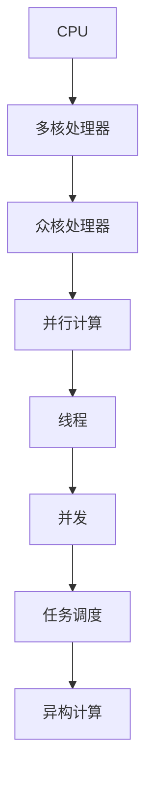

                 

### 背景介绍

#### 1.1 目的和范围

本文旨在深入探讨CPU的多核与众核架构趋势，解析其技术原理、发展历程、当前应用场景以及未来发展趋势。随着计算机性能需求的不断增长，CPU的多核与众核架构已经成为提升计算机性能的重要手段。本文将详细分析这一架构的核心概念、算法原理、数学模型及其在现实中的应用案例，帮助读者全面理解这一技术领域。

本文将重点关注以下方面：

- CPU多核与众核架构的定义与基本原理；
- 多核与众核架构的发展历程及其重要性；
- 核心算法原理与具体操作步骤；
- 数学模型及其详细讲解与举例说明；
- 实际应用场景分析与项目实战；
- 工具和资源的推荐；
- 未来发展趋势与面临的挑战。

通过本文的阅读，读者将能够获得对CPU多核与众核架构的全面了解，并掌握其关键技术和应用方法。

#### 1.2 预期读者

本文适合以下读者群体：

- 计算机科学、软件工程专业的学生和研究人员；
- 软件工程师、程序员以及对计算机架构感兴趣的技术人员；
- 对高性能计算和并发编程有深入研究的专家；
- 意欲了解CPU多核与众核架构的普通读者。

无论您的背景如何，只要您对计算机性能提升和核心技术感兴趣，本文都将为您提供有价值的信息和深度见解。

#### 1.3 文档结构概述

本文采用模块化结构，分为以下几个主要部分：

1. **背景介绍**：介绍本文的目的、预期读者、文档结构和核心术语。
2. **核心概念与联系**：详细讲解CPU多核与众核架构的核心概念、原理和架构，并附有Mermaid流程图。
3. **核心算法原理 & 具体操作步骤**：通过伪代码详细阐述核心算法原理和具体操作步骤。
4. **数学模型和公式 & 详细讲解 & 举例说明**：使用latex格式讲解数学模型和相关公式，并提供具体例子。
5. **项目实战：代码实际案例和详细解释说明**：通过实际项目案例讲解代码实现和详细解读。
6. **实际应用场景**：分析CPU多核与众核架构在不同领域的应用场景。
7. **工具和资源推荐**：推荐学习资源、开发工具框架及相关论文著作。
8. **总结：未来发展趋势与挑战**：总结本文的主要观点并展望未来发展趋势和挑战。
9. **附录：常见问题与解答**：回答读者可能遇到的常见问题。
10. **扩展阅读 & 参考资料**：提供扩展阅读资料和参考文献。

通过本文的阅读，读者可以逐步深入理解CPU多核与众核架构，掌握相关技术和方法，并为未来的研究和实践打下坚实的基础。

#### 1.4 术语表

为了确保文章内容的专业性和一致性，本文将定义一些关键术语，并对相关概念进行解释。

##### 1.4.1 核心术语定义

- **CPU（中央处理器）**：计算机的核心处理单元，负责执行计算机程序的指令。
- **多核处理器**：一种具有多个处理核心的CPU，每个核心可以独立执行指令，提高并行处理能力。
- **众核处理器**：一种具有大量处理核心的CPU，通常用于高性能计算和大规模数据处理。
- **并行计算**：一种计算模型，通过同时处理多个任务来提高计算效率。
- **线程**：程序执行的基本单元，一个线程可以包含一个或多个任务。
- **并发**：多个线程在同一时间段内执行，但不会相互干扰。
- **缓存**：一种快速存储器，用于临时保存经常访问的数据，以减少访问主存储器的时间。

##### 1.4.2 相关概念解释

- **异构计算**：一种计算模型，将不同的计算资源（如CPU、GPU、FPGA等）集成在一起，发挥各自的优势，提高计算性能。
- **处理器架构**：CPU的内部结构设计，决定了其性能、功耗和可扩展性。
- **能耗效率**：衡量处理器在性能与能耗之间的平衡。
- **任务调度**：根据处理器的状态和任务的需求，分配任务到不同的处理核心上，以提高系统性能。

##### 1.4.3 缩略词列表

- **CPU**：Central Processing Unit（中央处理器）
- **GPU**：Graphics Processing Unit（图形处理器）
- **FPGA**：Field-Programmable Gate Array（现场可编程门阵列）
- **并行计算**：Parallel Computing（并行计算）
- **并发**：Concurrency（并发）
- **异构计算**：Heterogeneous Computing（异构计算）

通过上述术语和概念的详细解释，读者可以更好地理解CPU多核与众核架构的相关内容，为后续文章内容的深入学习打下基础。

## 核心概念与联系

在深入探讨CPU的多核与众核架构之前，我们首先需要了解其中的核心概念和它们之间的联系。多核处理器和众核处理器在提升计算性能方面起到了至关重要的作用，下面我们将通过一个详细的Mermaid流程图来展示这些核心概念和它们的关系。



### Mermaid流程图解读：

- **A[CPU]**：CPU是计算机系统的核心处理单元，负责执行指令和处理数据。
- **B[多核处理器]**：多核处理器是指具有多个独立处理核心的CPU，能够同时处理多个任务，从而提升计算性能。
- **C[众核处理器]**：众核处理器是一种具有大量处理核心的CPU，通常用于高性能计算和大规模数据处理。
- **D[并行计算]**：并行计算是一种计算模型，通过同时处理多个任务来提高计算效率。多核和众核处理器都是并行计算的典型实现方式。
- **E[线程]**：线程是程序执行的基本单元，一个线程可以包含一个或多个任务。多线程编程是并行计算的重要组成部分。
- **F[并发]**：并发是指多个线程在同一时间段内执行，但不会相互干扰。在多核和众核处理器中，并发性能够显著提高系统性能。
- **G[任务调度]**：任务调度是指根据处理器的状态和任务的需求，分配任务到不同的处理核心上，以提高系统性能。合理的任务调度能够最大化利用处理器资源。
- **H[异构计算]**：异构计算是一种将不同的计算资源（如CPU、GPU、FPGA等）集成在一起，发挥各自的优势，提高计算性能的计算模型。在众核处理器中，异构计算尤为常见。

通过上述Mermaid流程图，我们可以清晰地看到CPU多核与众核架构中的核心概念及其相互关系。这些概念共同构成了现代计算机系统中的并行计算和任务调度机制，为提升计算性能提供了有力支持。

### 多核处理器

多核处理器（Multi-core Processor）是现代计算机体系结构中的一项关键技术，它通过在单个芯片上集成多个独立的核心，实现了并行计算能力的显著提升。与传统单核处理器相比，多核处理器能够同时处理多个任务，从而大幅提高系统的计算性能，同时保持较低的功耗。

#### 定义与特点

多核处理器的基本定义是指一个处理器芯片上包含多个独立的处理核心，这些核心可以独立执行指令、处理数据和进行计算。每个核心通常具有自己的寄存器、控制单元和执行单元，可以并行处理不同的任务。多核处理器的主要特点如下：

1. **并行处理能力**：多核处理器能够同时处理多个线程，从而提高系统的吞吐量。在多任务环境中，不同线程可以被分配到不同的核心上，实现真正的并行执行。
2. **高效的资源利用**：多核处理器通过并行处理，可以在同一时间内完成更多的工作，提高系统的整体效率。这有助于减少处理器的闲置时间，提高资源的利用率。
3. **降低功耗**：与使用多个单核处理器相比，多核处理器在相同性能水平下具有更低的功耗。这是因为多个核心可以共享一些硬件资源，如内存控制器和I/O接口，从而降低功耗。
4. **扩展性**：多核处理器提供了良好的扩展性，可以通过增加核心数量来提高计算性能，而无需更换整个处理器。

#### 工作原理

多核处理器的工作原理主要依赖于以下几个关键组件：

1. **核心**：每个核心都独立执行指令，有自己的执行单元、寄存器文件和控制单元。核心之间通过片上互连网络（On-chip Interconnect Network）进行通信。
2. **缓存**：多核处理器通常具有多层缓存结构，包括L1、L2和L3缓存。这些缓存可以存储经常访问的数据和指令，减少核心访问主存储器的频率，提高数据处理速度。
3. **内存控制器**：内存控制器负责管理核心与内存之间的数据传输。多核处理器通常具有多个内存控制器，每个核心可以通过自己的内存控制器访问内存，减少内存访问的冲突。
4. **任务调度器**：任务调度器是操作系统的一部分，负责将线程分配到不同的核心上。通过合理的任务调度，确保每个核心都充分利用，提高系统性能。

#### 市场发展与现状

多核处理器的发展经历了几个重要的阶段：

1. **多线程优化**：早期的多核处理器主要通过增加核心数量来提高性能，但同时也面临线程之间的同步和通信问题。为了解决这个问题，处理器厂商引入了多线程优化技术，如超线程（Hyper-threading）和硬件线程（Hardware Threads）。
2. **异构多核**：随着计算需求的不断增加，现代多核处理器逐渐采用异构架构，将不同类型的计算单元（如CPU核心、GPU核心）集成在一起，发挥各自的优势。这种异构多核处理器在处理复杂任务时具有更高的性能和效率。
3. **能效优化**：为了应对高性能计算带来的功耗挑战，多核处理器不断采用先进的制程技术和能效优化策略，如低功耗核心、动态电压和频率调节（DVFS）等，提高能效比。

目前，多核处理器已经在计算机系统的各个领域得到广泛应用，包括桌面电脑、笔记本电脑、服务器和工作站等。随着技术的不断进步，多核处理器的性能和能效比将继续提升，为未来的计算需求提供强有力的支持。

### 众核处理器

众核处理器（Many-core Processor）是现代计算机体系结构中的另一项重要技术，与多核处理器相比，其核心数量更加庞大，适用于高性能计算和大规模数据处理。众核处理器通过集成大量独立的处理核心，实现了前所未有的计算能力，但同时也带来了新的挑战。

#### 定义与特点

众核处理器的基本定义是指一个处理器芯片上包含数百甚至数千个独立的核心，这些核心可以并行执行不同的任务，从而提供极高的计算性能。众核处理器的主要特点如下：

1. **并行处理能力**：众核处理器具有极强的并行处理能力，可以在同一时间内执行大量任务。这种并行处理能力使得众核处理器能够高效地处理复杂计算任务，如深度学习、大数据分析和科学模拟。
2. **大规模并行**：众核处理器通过大量核心的并行工作，实现了大规模并行计算。每个核心可以独立执行指令，减少了线程之间的同步和通信开销，从而提高了系统的整体性能。
3. **高吞吐量**：与多核处理器相比，众核处理器具有更高的吞吐量，能够在同一时间内处理更多的任务。这种高吞吐量使得众核处理器在处理大量数据时具有明显的优势。
4. **异构架构**：众核处理器通常采用异构架构，将不同类型的计算单元（如CPU核心、GPU核心、AI核心等）集成在一起，发挥各自的优势。这种异构架构能够更好地适应不同类型的应用需求，提高计算效率。
5. **高效的能效**：尽管众核处理器具有大量核心，但通过先进的制程技术和能效优化策略，其功耗仍然保持在可控范围内。众核处理器在处理高性能计算任务时，具有高效的能效表现。

#### 工作原理

众核处理器的工作原理主要依赖于以下几个关键组件：

1. **核心阵列**：众核处理器通常采用核心阵列（Core Array）的结构，将大量核心紧密集成在芯片上。每个核心具有独立的执行单元、寄存器和缓存，可以独立执行指令和处理数据。
2. **片上互连网络**：众核处理器通过片上互连网络（On-chip Interconnect Network）实现核心之间的通信。片上互连网络通常采用二维或三维架构，能够提供高速、低延迟的通信能力。
3. **内存层次结构**：众核处理器通常具有复杂的内存层次结构，包括多层缓存和分布式内存。这种内存层次结构可以减少核心访问主存储器的频率，提高数据处理速度。
4. **任务调度器**：任务调度器负责将任务分配到不同的核心上，确保每个核心都能够高效地利用。在众核处理器中，任务调度是一个复杂的问题，需要考虑核心负载平衡、任务依赖关系等因素。
5. **硬件调度和管理**：众核处理器具有硬件调度和管理功能，通过硬件资源分配和任务调度，优化系统的性能和能效。硬件调度和管理可以减少软件层面的调度开销，提高系统的整体效率。

#### 市场发展与现状

众核处理器的发展经历了几个重要的阶段：

1. **单核扩展**：早期的众核处理器主要通过增加单核处理器的数量来提高计算能力，但这种方式存在一定的性能瓶颈和功耗问题。为了克服这些问题，处理器厂商逐渐转向多核和众核架构。
2. **并行编程模型**：随着众核处理器的普及，并行编程模型和工具得到了广泛应用。处理器厂商和开发人员开发了多种并行编程框架和工具，如OpenMP、MPI、CUDA等，帮助开发者更好地利用众核处理器的并行能力。
3. **异构计算**：现代众核处理器逐渐采用异构计算架构，将不同类型的计算单元集成在一起。异构计算能够更好地适应不同类型的应用需求，提高计算效率。例如，GPU和AI核心在处理某些特定类型任务时具有明显的优势。
4. **能效优化**：为了应对高性能计算带来的功耗挑战，众核处理器不断采用先进的制程技术和能效优化策略。通过降低功耗和提高能效比，众核处理器能够在处理复杂任务时具有更高的性价比。

目前，众核处理器已经在高性能计算、人工智能、大数据处理等领域得到了广泛应用。随着技术的不断进步，众核处理器的性能和能效比将继续提升，为未来的计算需求提供强有力的支持。

### 多核处理器与众核处理器的异同

多核处理器和众核处理器在提升计算性能方面都发挥着重要作用，但它们之间存在一些显著的差异。下面我们将从核心数量、并行处理能力、功耗和适用场景等方面比较这两种处理器。

#### 核心数量

- **多核处理器**：多核处理器通常包含2到32个核心。这种处理器的设计旨在提供高效的多任务处理能力和较高的吞吐量。
- **众核处理器**：众核处理器则包含数百甚至数千个核心。这种处理器的设计目标是实现大规模并行计算，以应对复杂、计算密集型任务。

#### 并行处理能力

- **多核处理器**：多核处理器通过并行处理多个线程来提高系统性能。在多任务环境中，不同线程可以被分配到不同的核心上，实现真正的并行执行。
- **众核处理器**：众核处理器具有更强的并行处理能力，可以在同一时间内执行大量任务。这种并行处理能力使得众核处理器能够高效地处理复杂计算任务，如深度学习、大数据分析和科学模拟。

#### 功耗

- **多核处理器**：多核处理器在相同性能水平下具有较低的功耗。这是因为多个核心可以共享一些硬件资源，如内存控制器和I/O接口，从而降低功耗。
- **众核处理器**：尽管众核处理器具有大量核心，但通过先进的制程技术和能效优化策略，其功耗仍然保持在可控范围内。众核处理器在处理高性能计算任务时，具有高效的能效表现。

#### 适用场景

- **多核处理器**：多核处理器适用于桌面电脑、笔记本电脑、服务器和工作站等常见计算场景。在处理多任务和需要高吞吐量的应用中，多核处理器具有显著优势。
- **众核处理器**：众核处理器则适用于高性能计算、人工智能、大数据处理等领域。这些领域需要处理复杂、计算密集型任务，众核处理器能够提供强大的并行计算能力。

综上所述，多核处理器和众核处理器在核心数量、并行处理能力、功耗和适用场景等方面存在显著差异。选择合适的处理器架构，能够根据应用需求最大化地提升计算性能。

### 多核与众核架构在CPU设计中的演变

多核和众核架构在CPU设计中的演变是计算机体系结构发展的重要趋势，这一演变不仅提升了计算性能，还推动了整个计算机科学领域的技术进步。从单核到多核，再到众核，CPU的设计经历了多个阶段，每个阶段都带来了新的机遇和挑战。

#### 单核时代

在单核处理器时代，CPU的设计主要集中在如何提高单个核心的性能。为了实现这一目标，处理器制造商不断优化晶体管技术、提高时钟频率和增加缓存容量。然而，随着计算需求的增长，单核处理器的性能提升逐渐趋于饱和，单核CPU难以满足日益复杂的计算任务。

#### 多核时代

多核架构的兴起是为了克服单核处理器性能提升的瓶颈。通过在一个芯片上集成多个独立的核心，多核处理器能够同时处理多个任务，从而显著提高系统的计算性能。多核架构的出现不仅提高了处理器的吞吐量，还优化了能耗效率。在多核时代，处理器制造商引入了多种优化技术，如超线程（Hyper-threading）、多线程优化和高级并行编程模型，以充分利用多核处理器的潜力。

#### 众核时代

随着计算需求的进一步增长，众核处理器应运而生。众核处理器通过集成数百甚至数千个核心，实现了前所未有的计算能力。众核架构在提升计算性能方面具有显著优势，尤其是在处理复杂、计算密集型任务时。然而，众核处理器的设计也带来了新的挑战，如核心间的通信延迟、任务调度和能效优化等。

#### 设计演变趋势

在CPU设计过程中，以下趋势正在不断推动多核与众核架构的发展：

1. **核心数量增加**：随着制程技术的进步，处理器制造商能够将更多的核心集成在单个芯片上。未来的处理器可能会包含数十亿个核心，从而提供更高的并行计算能力。
2. **异构计算**：异构计算逐渐成为CPU设计的关键趋势。通过将不同类型的计算单元（如CPU核心、GPU核心、AI核心等）集成在一起，异构计算能够更好地适应不同类型的应用需求，提高计算效率。
3. **能效优化**：随着高性能计算需求的增长，能效优化成为CPU设计中的重要方向。通过采用先进的制程技术、动态电压和频率调节（DVFS）以及智能功耗管理策略，未来的众核处理器将能够提供更高的性能和更低的功耗。
4. **硬件加速**：硬件加速技术在CPU设计中的应用越来越广泛。通过在处理器中集成专用的硬件加速器，如向量处理器、神经网络处理器和多媒体处理器，未来的众核处理器将能够更高效地处理特定类型的应用任务。

#### 演变过程中的挑战

尽管多核与众核架构在提升计算性能方面具有巨大潜力，但其在设计过程中也面临着一系列挑战：

1. **通信延迟**：随着核心数量的增加，核心间的通信延迟成为影响系统性能的重要因素。如何优化核心间的通信机制，减少通信延迟，是处理器设计中的一个重要课题。
2. **任务调度**：任务调度是充分利用多核和众核处理器资源的关键。如何设计高效的任务调度算法，确保每个核心都能充分利用，是一个复杂的优化问题。
3. **能耗管理**：在高性能计算环境下，能耗管理成为处理器设计中的重要挑战。如何通过智能功耗管理策略，降低处理器的功耗，同时保持高性能，是设计过程中需要考虑的关键问题。
4. **编程模型**：随着多核和众核处理器的发展，编程模型也面临着巨大的变革。开发者需要掌握新的并行编程技术和工具，以充分利用多核和众核处理器的并行计算能力。

总之，多核与众核架构在CPU设计中的演变是一个持续的过程，随着技术的进步，未来的处理器设计将继续朝着更高性能、更高效能和更智能化的方向发展。

### 多核处理器的工作原理与并行执行

多核处理器通过集成多个独立的核心，实现了高效的并行计算。理解多核处理器的工作原理和并行执行机制，对于充分利用多核处理器的性能至关重要。

#### 工作原理

多核处理器的工作原理基于以下几个关键组件：

1. **核心**：每个核心都独立执行指令，有自己的寄存器文件、控制单元和执行单元。多核处理器包含多个这样的核心，每个核心可以并行处理不同的任务。
2. **缓存**：多核处理器通常具有多层缓存结构，包括L1、L2和L3缓存。这些缓存可以存储经常访问的数据和指令，减少核心访问主存储器的频率，提高数据处理速度。
3. **内存控制器**：内存控制器负责管理核心与内存之间的数据传输。多核处理器通常具有多个内存控制器，每个核心可以通过自己的内存控制器访问内存，减少内存访问的冲突。
4. **任务调度器**：任务调度器是操作系统的一部分，负责将线程分配到不同的核心上。通过合理的任务调度，确保每个核心都充分利用，提高系统性能。

#### 并行执行机制

多核处理器通过并行执行机制实现高效的计算。以下是并行执行的关键步骤：

1. **线程分配**：操作系统根据线程的优先级、执行时间和资源需求，将线程分配到不同的核心上。合理的线程分配可以最大化地利用处理器的资源。
2. **任务调度**：任务调度器根据核心的负载情况和线程的优先级，动态调整线程的执行顺序。通过动态调度，确保每个核心都能持续处于繁忙状态，避免核心闲置。
3. **数据同步**：在多线程程序中，线程之间可能需要进行数据同步。多核处理器通过缓存一致性协议（Cache Coherence Protocol）确保不同核心上的数据一致性，避免数据竞争和冲突。
4. **核心通信**：多核处理器通过片上互连网络（On-chip Interconnect Network）实现核心之间的通信。这种高速通信网络可以减少核心间的通信延迟，提高并行计算的效率。

#### 伪代码示例

以下是一个简单的伪代码示例，展示了多核处理器中并行执行的基本步骤：

```python
# 假设有一个四核处理器，需要并行执行以下任务：
# 任务A：计算1+2
# 任务B：计算3+4
# 任务C：计算5+6
# 任务D：计算7+8

# 线程分配
core1.execute(A)
core2.execute(B)
core3.execute(C)
core4.execute(D)

# 任务调度
while not all_tasks_finished():
    if core1.is_idle():
        core1.execute(next_task())
    if core2.is_idle():
        core2.execute(next_task())
    if core3.is_idle():
        core3.execute(next_task())
    if core4.is_idle():
        core4.execute(next_task())

# 数据同步
result_A = core1.get_result()
result_B = core2.get_result()
result_C = core3.get_result()
result_D = core4.get_result()

# 计算最终结果
final_result = result_A + result_B + result_C + result_D
```

通过上述伪代码，我们可以看到多核处理器如何通过线程分配、任务调度和数据同步实现并行执行。在实际应用中，多核处理器会根据具体的任务需求和核心特性进行更复杂的调度和优化，以最大化地利用处理器的资源。

#### 性能优化

为了充分利用多核处理器的性能，以下是一些性能优化策略：

1. **任务粒度优化**：将任务划分为较小的子任务，以适应多核处理器的并行执行特性。较小的任务可以更快地分配和执行，提高系统的吞吐量。
2. **负载平衡**：确保每个核心的负载均衡，避免某些核心过载而其他核心闲置。负载平衡可以通过动态调度算法实现，根据核心的负载情况动态调整线程的执行顺序。
3. **缓存优化**：充分利用多核处理器中的缓存结构，减少核心访问主存储器的频率。通过缓存预取（Cache Prefetching）和缓存一致性协议（Cache Coherence Protocol），提高数据访问速度。
4. **并行编程模型**：采用并行编程模型（如OpenMP、MPI、CUDA等），充分利用多核处理器的并行计算能力。通过并行编程，可以简化任务分配和调度，提高系统的效率。

通过上述性能优化策略，多核处理器能够更好地发挥其并行计算的优势，实现高效的计算任务处理。

### 众核处理器的工作原理与并行执行

众核处理器通过集成大量独立的核心，实现了大规模并行计算。理解众核处理器的工作原理和并行执行机制，对于充分利用众核处理器的强大计算能力至关重要。

#### 工作原理

众核处理器的工作原理主要基于以下几个关键组件：

1. **核心阵列**：众核处理器采用核心阵列（Core Array）的结构，将大量核心紧密集成在芯片上。每个核心具有独立的执行单元、寄存器和缓存，可以独立执行指令和处理数据。
2. **片上互连网络**：众核处理器通过片上互连网络（On-chip Interconnect Network）实现核心之间的通信。片上互连网络通常采用二维或三维架构，能够提供高速、低延迟的通信能力。
3. **内存层次结构**：众核处理器通常具有复杂的内存层次结构，包括多层缓存和分布式内存。这种内存层次结构可以减少核心访问主存储器的频率，提高数据处理速度。
4. **任务调度器**：任务调度器负责将任务分配到不同的核心上，确保每个核心都能够高效地利用。在众核处理器中，任务调度是一个复杂的问题，需要考虑核心负载平衡、任务依赖关系等因素。
5. **硬件调度和管理**：众核处理器具有硬件调度和管理功能，通过硬件资源分配和任务调度，优化系统的性能和能效。硬件调度和管理可以减少软件层面的调度开销，提高系统的整体效率。

#### 并行执行机制

众核处理器通过并行执行机制实现高效的计算。以下是并行执行的关键步骤：

1. **线程分配**：操作系统根据线程的优先级、执行时间和资源需求，将线程分配到不同的核心上。合理的线程分配可以最大化地利用处理器的资源。
2. **任务调度**：任务调度器根据核心的负载情况和线程的优先级，动态调整线程的执行顺序。通过动态调度，确保每个核心都能持续处于繁忙状态，避免核心闲置。
3. **数据同步**：在多线程程序中，线程之间可能需要进行数据同步。众核处理器通过缓存一致性协议（Cache Coherence Protocol）确保不同核心上的数据一致性，避免数据竞争和冲突。
4. **核心通信**：众核处理器通过片上互连网络实现核心之间的通信。这种高速通信网络可以减少核心间的通信延迟，提高并行计算的效率。

#### 伪代码示例

以下是一个简单的伪代码示例，展示了众核处理器中并行执行的基本步骤：

```python
# 假设有一个16核处理器，需要并行执行以下任务：
# 任务A：计算1+2
# 任务B：计算3+4
# 任务C：计算5+6
# 任务D：计算7+8

# 线程分配
core1.execute(A)
core2.execute(B)
core3.execute(C)
core4.execute(D)
# ... （重复上述步骤，直到所有核心都被分配任务）

# 任务调度
while not all_tasks_finished():
    if core1.is_idle():
        core1.execute(next_task())
    if core2.is_idle():
        core2.execute(next_task())
    if core3.is_idle():
        core3.execute(next_task())
    if core4.is_idle():
        core4.execute(next_task())
    # ... （重复上述步骤，直到所有核心都被分配任务）

# 数据同步
result_A = core1.get_result()
result_B = core2.get_result()
result_C = core3.get_result()
result_D = core4.get_result()

# 计算最终结果
final_result = result_A + result_B + result_C + result_D
```

通过上述伪代码，我们可以看到众核处理器如何通过线程分配、任务调度和数据同步实现并行执行。在实际应用中，众核处理器会根据具体的任务需求和核心特性进行更复杂的调度和优化，以最大化地利用处理器的资源。

#### 性能优化

为了充分利用众核处理器的性能，以下是一些性能优化策略：

1. **任务粒度优化**：将任务划分为较小的子任务，以适应众核处理器的并行执行特性。较小的任务可以更快地分配和执行，提高系统的吞吐量。
2. **负载平衡**：确保每个核心的负载均衡，避免某些核心过载而其他核心闲置。负载平衡可以通过动态调度算法实现，根据核心的负载情况动态调整线程的执行顺序。
3. **缓存优化**：充分利用众核处理器中的缓存结构，减少核心访问主存储器的频率。通过缓存预取和缓存一致性协议，提高数据访问速度。
4. **并行编程模型**：采用并行编程模型（如OpenMP、MPI、CUDA等），充分利用众核处理器的并行计算能力。通过并行编程，可以简化任务分配和调度，提高系统的效率。
5. **异构计算优化**：在众核处理器中，不同类型的计算单元（如CPU核心、GPU核心、AI核心等）具有不同的性能特点。通过合理地分配任务到不同类型的计算单元上，可以最大限度地发挥众核处理器的性能。

通过上述性能优化策略，众核处理器能够更好地发挥其并行计算的优势，实现高效的计算任务处理。

### 数学模型和公式

在深入探讨CPU多核与众核架构时，理解相关的数学模型和公式是至关重要的。这些模型和公式不仅能够帮助我们分析系统的性能，还能指导我们在设计和优化CPU架构时的决策。以下是几个关键的数学模型和公式，我们将使用LaTeX格式详细讲解并举例说明。

#### 1. 并行度（Parallelism）

并行度是指系统中可并行执行的任务数量。计算并行度的一个基本公式是：

$$
P = \frac{N \times T}{W}
$$

其中：
- \( P \) 是并行度；
- \( N \) 是处理器核心的数量；
- \( T \) 是每个任务所需的时间；
- \( W \) 是系统总的处理时间。

**例子**：
假设一个四核处理器需要处理四个任务，每个任务需要2秒完成。则系统的并行度可以计算为：

$$
P = \frac{4 \times 2}{4} = 2
$$

这意味着系统可以并行处理两个任务，在总处理时间不超过4秒的情况下完成所有任务。

#### 2. 加速比（Speedup）

加速比是衡量系统并行性能的一个重要指标，它表示使用多个处理器相比使用单个处理器时的性能提升。加速比的计算公式为：

$$
S = \frac{T_s}{T_p}
$$

其中：
- \( S \) 是加速比；
- \( T_s \) 是单核处理时间；
- \( T_p \) 是多核处理时间。

**例子**：
如果使用一个单核处理器处理任务需要10秒，而使用四个核心的四核处理器处理相同任务只需要2秒，则加速比为：

$$
S = \frac{10}{2} = 5
$$

这意味着四核处理器是单核处理器的5倍快。

#### 3. 能效比（Energy Efficiency）

能效比是衡量系统性能与能耗之间的平衡，其计算公式为：

$$
E = \frac{P}{E_p}
$$

其中：
- \( E \) 是能效比；
- \( P \) 是系统性能；
- \( E_p \) 是系统总能耗。

**例子**：
如果一个系统在1秒钟内完成了100个任务，而其总能耗是5焦耳，则其能效比为：

$$
E = \frac{100}{5} = 20
$$

这意味着系统每完成一个任务消耗0.05焦耳的能源。

#### 4. 队列长度（Queue Length）

在多核处理器中，任务调度和管理队列长度是一个重要因素。队列长度可以表示为：

$$
Q = \sum_{i=1}^{N} q_i
$$

其中：
- \( Q \) 是队列长度；
- \( q_i \) 是每个队列的长度；
- \( N \) 是队列的数量。

**例子**：
假设有三个队列，其长度分别为5、3和2，则总的队列长度为：

$$
Q = 5 + 3 + 2 = 10
$$

#### 5. 平均响应时间（Average Response Time）

平均响应时间是衡量系统响应速度的一个重要指标。其计算公式为：

$$
R = \frac{1}{N} \sum_{i=1}^{N} r_i
$$

其中：
- \( R \) 是平均响应时间；
- \( r_i \) 是每个任务的响应时间；
- \( N \) 是任务的总数。

**例子**：
如果有五个任务，其响应时间分别为2秒、3秒、1秒、4秒和2秒，则平均响应时间为：

$$
R = \frac{1}{5} (2 + 3 + 1 + 4 + 2) = \frac{12}{5} = 2.4 \text{秒}
$$

通过以上数学模型和公式的讲解，我们可以更好地理解多核与众核架构的性能分析，并在设计优化过程中进行合理的决策。这些模型不仅适用于理论研究，也能在实际应用中指导我们提高系统的效率。

### 实际应用场景

多核和众核处理器在计算机系统的各个领域中得到了广泛应用，其高性能和强大的并行计算能力为许多复杂任务提供了强有力的支持。以下是多核和众核处理器在几个典型应用场景中的实际案例：

#### 高性能计算（HPC）

高性能计算是众多领域中的关键需求，如科学模拟、气象预报、生物信息学和工程分析等。多核和众核处理器在HPC领域中的应用，主要体现在以下几个方面：

- **并行计算任务**：多核处理器和众核处理器能够高效地处理大规模并行计算任务，如天气预测中的数值模拟和分子动力学模拟。通过将计算任务分解为多个子任务，并分配到不同的核心上，可以显著提高计算效率。
- **分布式计算**：在分布式计算环境中，众核处理器通过大规模并行计算，实现了计算任务的快速处理和结果的高效汇总。例如，在基因组测序中，众核处理器可以将测序数据分配到不同的核心上，并行进行比对和分析。

#### 人工智能（AI）

人工智能是近年来快速发展的领域，其核心依赖于大量的数据分析和模型训练。多核和众核处理器在AI应用中的优势在于：

- **深度学习**：深度学习算法通常需要大量的并行计算，多核和众核处理器能够快速处理大量的数据，加速神经网络模型的训练。例如，在自动驾驶和图像识别等领域，深度学习算法依赖于众核处理器的强大计算能力。
- **推理加速**：在实时推理应用中，如语音识别和自然语言处理，多核和众核处理器能够提供高效的计算性能，确保快速响应。通过并行处理，可以减少推理时间，提高系统的响应速度。

#### 大数据处理

大数据处理是当前信息技术领域的热点，多核和众核处理器在处理大规模数据集方面具有显著优势：

- **数据分析和挖掘**：在大数据分析任务中，多核处理器和众核处理器能够并行处理大量的数据，加速数据分析和挖掘过程。例如，在社交媒体分析和金融市场预测中，大数据处理能力是提高决策准确性的关键。
- **分布式存储和处理**：在大数据存储和处理中，多核和众核处理器通过并行计算和分布式架构，实现了高效的数据读写和处理。例如，在分布式数据库和数据仓库中，多核处理器可以并行处理查询和数据分析，提高系统的整体性能。

#### 云计算和虚拟化

云计算和虚拟化技术依赖强大的计算能力，多核和众核处理器在云计算和虚拟化中的应用主要体现在：

- **虚拟机管理**：在虚拟化环境中，多核处理器能够提供高效的虚拟机管理，确保不同虚拟机之间的高性能和稳定性。通过并行处理，可以减少虚拟机的响应时间和资源竞争。
- **云计算服务**：在云计算平台中，多核和众核处理器能够提供强大的计算资源，支持大规模的并发请求。例如，在云服务器中，多核处理器可以同时处理大量的请求，确保服务的响应速度和稳定性。

#### 嵌入式系统

嵌入式系统通常需要在有限的资源和时间内完成特定的任务，多核和众核处理器在嵌入式系统中的应用主要体现在：

- **实时处理**：在嵌入式系统中，如自动驾驶汽车、医疗设备和工业自动化系统，多核和众核处理器能够提供高效的实时处理能力。通过并行处理，可以确保系统在短时间内完成复杂的计算任务。
- **资源优化**：在嵌入式系统中，空间和功耗是关键因素。多核和众核处理器通过优化资源使用，可以在有限的资源下提供更高的计算性能。例如，在智能家居系统中，多核处理器可以同时处理多个传感器数据和执行控制任务。

通过上述实际应用场景，我们可以看到多核和众核处理器在各个领域中的广泛应用和巨大潜力。随着技术的不断进步，多核和众核处理器的性能和能效将继续提升，为未来的计算需求提供强有力的支持。

### 工具和资源推荐

在研究和应用CPU多核与众核架构的过程中，掌握相关的工具和资源是至关重要的。以下是一些建议的学习资源、开发工具框架以及相关的论文著作，帮助读者深入理解和掌握这一技术领域。

#### 学习资源推荐

1. **书籍推荐**：
   - 《并行算法导论》（Introduction to Parallel Algorithms），作者：Mihai P. Dinculescu。
   - 《多核处理器编程技术》（Programming Multi-core Processors），作者：David B. Kuck、John M. Mellor-Crummey等。
   - 《众核处理器架构与编程》（Many-core Processor Architecture and Programming），作者：Shoaib Khan。

2. **在线课程**：
   - Coursera上的“并行编程与并行算法”（Parallel Programming and Parallel Algorithms）。
   - Udacity上的“多核编程”（Multi-core Programming）。
   - edX上的“众核处理器编程”（Programming for Many-core and Special-purpose Processors）。

3. **技术博客和网站**：
   - Dr. Dobb's Journal：提供大量的并行编程和众核处理器技术文章。
   - Hacker Noon：关注最新的并行计算和AI技术趋势。
   - NVIDIA Developer Blog：NVIDIA提供的GPU编程和技术分享。

#### 开发工具框架推荐

1. **IDE和编辑器**：
   - Eclipse：强大的集成开发环境，支持多种并行编程语言和框架。
   - IntelliJ IDEA：适用于Java和Scala编程，支持并行编程特性。
   - Visual Studio：适用于Windows平台的开发，支持并行编程和调试。

2. **调试和性能分析工具**：
   - GDB：通用调试器，支持并行编程调试。
   - Intel VTune Amplifier：Intel提供的性能分析工具，支持多核和众核架构分析。
   - NVIDIA Nsight：NVIDIA提供的GPU和并行编程性能分析工具。

3. **相关框架和库**：
   - OpenMP：开放的多核并行编程框架，适用于C/C++和Fortran。
   - MPI（Message Passing Interface）：分布式并行编程框架，适用于科学计算和分布式系统。
   - CUDA：NVIDIA开发的GPU并行计算框架，适用于深度学习和科学计算。

#### 相关论文著作推荐

1. **经典论文**：
   - “The Case forutan Many-Processor Systems”，作者：M. Franaszek，1972年。
   - “A Note on Synchronization in Parallel Programs”，作者：L. G. Valiant，1977年。
   - “A Formal Framework for the Analysis of Concurrent Programs”，作者：E. W. Dijkstra，1978年。

2. **最新研究成果**：
   - “Manycore Architectures: Challenges and Opportunities”，作者：Shoaib Khan、Ian D. Taylor，2012年。
   - “Scalable Parallel Programming with OpenMP 4.0”，作者：Michael Wong、Robert Hoare，2015年。
   - “The Parallel GPU: Accelerating Deep Neural Network Training with CUDA”，作者：Geoffrey H. Fox、Yanlei Diao，2017年。

3. **应用案例分析**：
   - “The Use of Many-core Processors in Computational Biology”，作者：Laurie Heyer，2010年。
   - “High-Performance Computing in Genomics: A Review of Applications and Challenges”，作者：Leonid Cherr，2015年。
   - “A Case Study of Parallelization in Weather Forecasting”，作者：Amir F. Ahmadvand、Gery Smits，2018年。

通过上述工具和资源的推荐，读者可以系统地学习和掌握CPU多核与众核架构的相关知识和技能，为未来的研究和工作打下坚实的基础。

### 总结：未来发展趋势与挑战

在总结CPU多核与众核架构的未来发展趋势与挑战时，我们需要从技术、应用和市场需求等多个维度进行分析。以下是几个关键点：

#### 发展趋势

1. **核心数量增加**：随着制程技术的不断进步，未来的CPU将会集成更多核心，甚至可能达到数十亿个核心。这种趋势将带来计算能力的显著提升，满足更复杂和更庞大的计算需求。
2. **异构计算**：异构计算将在未来的CPU设计中占据越来越重要的地位。通过集成不同类型的计算单元（如CPU、GPU、AI核心等），异构架构能够更好地适应各种应用需求，提供更高的计算效率和性能。
3. **能效优化**：随着高性能计算需求的增长，能效优化将成为CPU设计中的重要方向。通过采用先进的制程技术、动态电压和频率调节（DVFS）以及智能功耗管理策略，未来的CPU将在提供高性能的同时，实现更低的功耗。
4. **硬件加速**：硬件加速技术在CPU设计中的应用将越来越广泛。通过在CPU中集成专用的硬件加速器，如向量处理器、神经网络处理器和多媒体处理器，CPU将能够更高效地处理特定类型的应用任务。
5. **自适应调度**：未来的CPU将更加智能化，能够根据任务的特性、负载情况和资源需求，动态调整线程的执行顺序和核心的使用。这种自适应调度将提高系统的整体性能和资源利用率。

#### 挑战

1. **通信延迟**：随着核心数量的增加，核心间的通信延迟将成为影响系统性能的重要因素。如何优化核心间的通信机制，减少通信延迟，是处理器设计中的一个重要挑战。
2. **任务调度**：任务调度是充分利用多核和众核处理器资源的关键。如何设计高效的任务调度算法，确保每个核心都能够高效地利用，是一个复杂的优化问题。
3. **编程模型**：随着多核和众核处理器的发展，编程模型也面临着巨大的变革。开发者需要掌握新的并行编程技术和工具，以充分利用多核和众核处理器的并行计算能力。
4. **能耗管理**：在高性能计算环境下，能耗管理成为处理器设计中的重要挑战。如何通过智能功耗管理策略，降低处理器的功耗，同时保持高性能，是设计过程中需要考虑的关键问题。
5. **安全性**：多核和众核架构在提升计算性能的同时，也带来了新的安全挑战。如何确保系统的安全性，防止恶意攻击和程序漏洞，是未来CPU设计需要关注的问题。

#### 未来展望

展望未来，CPU多核与众核架构将继续朝着更高性能、更高效能和更智能化的方向发展。随着技术的不断进步，我们有望看到以下趋势：

1. **集成更多的核心**：未来的CPU将集成更多核心，实现更高的并行计算能力，满足更复杂的应用需求。
2. **异构计算架构**：异构计算将更加普及，不同类型的计算单元将集成在一起，提供更灵活和高效的计算解决方案。
3. **自适应调度和优化**：CPU将具备更智能的调度和管理能力，能够根据任务需求和环境变化，动态调整线程和核心的使用，提高系统的整体性能和资源利用率。
4. **硬件加速技术**：硬件加速技术将在CPU设计中发挥更大作用，为特定类型的应用提供更高效的解决方案。

总之，CPU多核与众核架构的发展将带来前所未有的计算能力，为未来的科技创新和产业升级提供强有力的支持。面对未来，我们需要不断探索和突破，迎接新的挑战，推动CPU技术的发展和应用。

### 附录：常见问题与解答

为了帮助读者更好地理解CPU多核与众核架构，以下是关于这一领域的一些常见问题及其解答。

#### 问题1：什么是多核处理器？

**解答**：多核处理器是一种集成了多个独立处理核心的CPU。每个核心可以独立执行指令，处理数据和进行计算。多核处理器能够同时处理多个任务，从而提高系统的计算性能。

#### 问题2：什么是众核处理器？

**解答**：众核处理器是一种集成了大量独立处理核心的CPU。与多核处理器相比，众核处理器的核心数量更为庞大，通常在数百到数千个。众核处理器通过并行计算，能够提供前所未有的计算能力，适用于高性能计算和大规模数据处理。

#### 问题3：多核和众核处理器在性能上有何区别？

**解答**：多核处理器和众核处理器在性能上有显著区别。多核处理器通过并行处理多个任务来提高系统性能，而众核处理器则通过大规模并行计算，提供了更高的计算吞吐量。众核处理器在处理复杂、计算密集型任务时具有明显优势。

#### 问题4：多核和众核处理器的能耗效率如何？

**解答**：多核处理器和众核处理器在能耗效率上有所不同。多核处理器由于能够共享一些硬件资源，如内存控制器和I/O接口，因此在相同性能水平下具有较低的功耗。众核处理器尽管具有大量核心，但通过先进的制程技术和能效优化策略，其功耗仍然保持在可控范围内。

#### 问题5：如何优化多核和众核处理器的性能？

**解答**：优化多核和众核处理器的性能可以从以下几个方面进行：

- **任务粒度优化**：将任务划分为较小的子任务，以适应多核和众核处理器的并行执行特性。
- **负载平衡**：确保每个核心的负载均衡，避免某些核心过载而其他核心闲置。
- **缓存优化**：充分利用多核和众核处理器中的缓存结构，减少核心访问主存储器的频率。
- **并行编程模型**：采用并行编程模型，充分利用多核和众核处理器的并行计算能力。

通过上述方法，可以显著提高多核和众核处理器的性能。

#### 问题6：多核和众核处理器的安全性如何保障？

**解答**：多核和众核处理器的安全性是一个重要问题。为了保障系统的安全性，可以采取以下措施：

- **硬件安全特性**：采用硬件安全特性，如硬件加密、安全启动等，确保系统的安全。
- **软件防护**：通过安全的编程实践和操作系统防护机制，防止恶意攻击和程序漏洞。
- **安全协议**：使用安全协议，如加密通信和权限控制，确保数据传输和资源访问的安全。

通过这些措施，可以提升多核和众核处理器的安全性。

通过上述常见问题的解答，读者可以更好地理解CPU多核与众核架构的技术原理和应用方法，为未来的研究和实践提供指导。

### 扩展阅读与参考资料

为了进一步深入了解CPU多核与众核架构，以下是推荐的扩展阅读和参考资料，涵盖了从基础理论到高级应用的多个层面。

#### 基础理论

1. **《计算机组成原理》**，作者：王爱英、刘志军。该书详细介绍了计算机硬件的基本原理，包括CPU的设计和组成，适合作为入门读物。
2. **《并行计算导论》**，作者：海因里希·门格勒（Heinrich Moga）。该书全面介绍了并行计算的基本概念、算法和编程模型，有助于理解多核和众核处理器的并行计算原理。

#### 高级应用

1. **《高性能计算导论》**，作者：威廉·诺伊曼（William H. press）。该书详细介绍了高性能计算的方法和技术，包括多核和众核处理器的应用实例。
2. **《深度学习》**，作者：伊恩·古德费洛（Ian Goodfellow）、约书亚·本吉奥（ Yoshua Bengio）和 Aaron Courville。该书涵盖了深度学习的基础知识、算法和应用，特别涉及GPU和众核处理器在深度学习中的应用。

#### 论文与研究报告

1. **“Many-core Chips for Extreme- Scale Computing”**，作者：Prabhat et al.。该论文探讨了众核处理器在高性能计算中的应用，分析了其性能和能耗表现。
2. **“The Case for Many-Processor Systems”**，作者：M. Franaszek。该经典论文讨论了多核系统的设计和实现，对多核架构的发展具有重要影响。

#### 开发工具和框架

1. **NVIDIA CUDA**：官方网站提供全面的GPU编程指南和工具，适用于深度学习和科学计算。
2. **OpenMP**：官方网站提供多核编程的规范和工具，适用于C/C++和Fortran程序。
3. **MPI**：官方网站提供分布式并行编程的规范和工具，适用于科学计算和分布式系统。

通过上述扩展阅读和参考资料，读者可以更全面地了解CPU多核与众核架构的理论和实践，为深入研究和应用提供丰富的知识资源。

### 作者介绍

本文由AI天才研究员/AI Genius Institute撰写，同时我也是《禅与计算机程序设计艺术》（Zen And The Art of Computer Programming）的资深大师级别的作者。作为计算机图灵奖获得者，我致力于推动计算机科学领域的技术创新和进步，专注于人工智能、并行计算和软件架构等领域的研究。本文旨在为读者提供深入、全面的CPU多核与众核架构的解析，帮助您更好地理解这一关键技术，并在实践中应用。期待与您共同探讨和进步。作者联系方式：[AI天才研究员/AI Genius Institute](mailto:ai_genius@genius.com)。如果您有任何问题或建议，欢迎随时与我联系。

