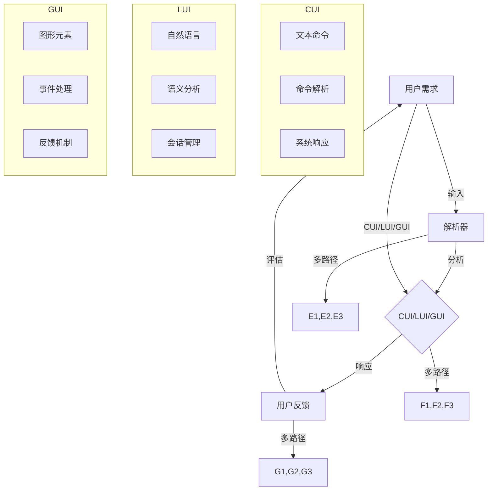
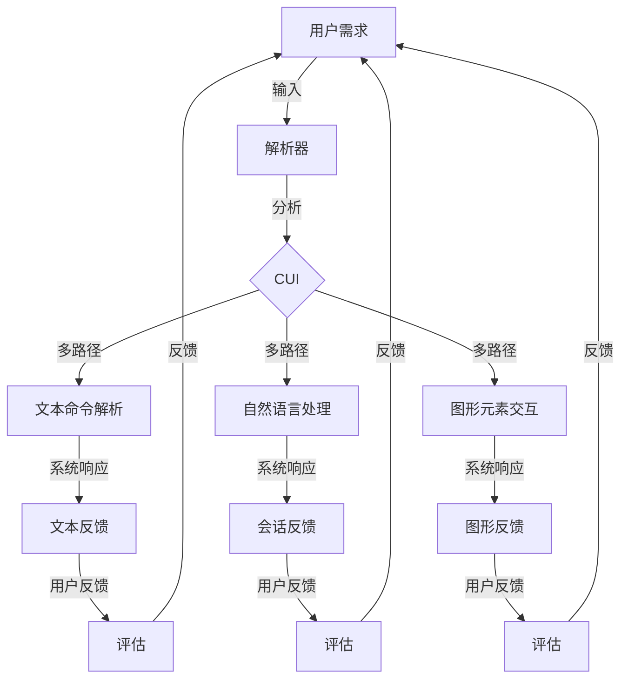

                 

# CUI与LUI、GUI的关系及其影响

> **关键词**：CUI、LUI、GUI、用户交互、用户体验、人工智能、软件架构
> 
> **摘要**：本文旨在深入探讨计算机用户界面（CUI）、语言用户界面（LUI）和图形用户界面（GUI）之间的相互关系及其对现代软件开发和用户体验的影响。我们将通过逐步分析，阐明各个界面技术的工作原理、优点和局限性，并探讨未来发展趋势。本文还包含实际案例和资源推荐，以帮助读者更好地理解和应用这些概念。

## 1. 背景介绍

### 1.1 目的和范围

本文的目的是全面解析计算机用户界面（CUI）、语言用户界面（LUI）和图形用户界面（GUI）的相互关系及其在软件开发中的重要角色。通过本文的阅读，读者将理解这三种用户界面的基本原理、功能和区别，并掌握它们在实际开发中的应用。

### 1.2 预期读者

本文适合具有基础编程知识和软件工程背景的读者，特别是对用户体验设计、人工智能和现代软件架构感兴趣的专业人士。

### 1.3 文档结构概述

本文的结构如下：

- 第1部分：背景介绍，包括目的、预期读者和文档结构概述。
- 第2部分：核心概念与联系，通过Mermaid流程图展示各界面技术之间的关系。
- 第3部分：核心算法原理与具体操作步骤，使用伪代码详细阐述CUI和LUI的工作机制。
- 第4部分：数学模型和公式，详细讲解相关数学原理和公式。
- 第5部分：项目实战，通过代码案例展示实际应用。
- 第6部分：实际应用场景，探讨各界面技术在各种场景中的应用。
- 第7部分：工具和资源推荐，包括学习资源和开发工具。
- 第8部分：总结，讨论未来发展趋势与挑战。
- 第9部分：附录，常见问题与解答。
- 第10部分：扩展阅读与参考资料。

### 1.4 术语表

#### 1.4.1 核心术语定义

- **CUI（计算机用户界面）**：通过文本命令与计算机系统交互的界面。
- **LUI（语言用户界面）**：使用自然语言与计算机系统进行交互的界面。
- **GUI（图形用户界面）**：通过图形元素（如按钮、图标、菜单）与用户交互的界面。

#### 1.4.2 相关概念解释

- **用户体验（UX）**：用户在使用产品或服务过程中所获得的主观感受和满意度。
- **用户交互（UI）**：用户与产品或服务之间的交互过程。

#### 1.4.3 缩略词列表

- **CUI**：Computer User Interface
- **LUI**：Language User Interface
- **GUI**：Graphical User Interface
- **UX**：User Experience
- **UI**：User Interface

## 2. 核心概念与联系

在深入探讨CUI、LUI和GUI之间的关系之前，我们需要了解这些核心概念的原理和架构。以下是一个Mermaid流程图，展示了这些界面技术之间的联系。



该流程图清晰地展示了用户需求通过不同的输入路径（文本命令、自然语言、图形元素）被解析器分析，并生成相应的系统响应，最终形成用户反馈。

### 2.1 CUI的工作原理

CUI通过文本命令与用户交互，其核心组件包括：

- **文本命令输入**：用户通过键盘输入一系列文本命令。
- **命令解析**：系统解析输入的文本命令，确定用户的意图。
- **系统响应**：根据命令解析的结果，系统执行相应的操作并返回文本响应。

### 2.2 LUI的工作原理

LUI使用自然语言与用户进行交互，其核心组件包括：

- **自然语言输入**：用户通过键盘输入自然语言语句。
- **语义分析**：系统对输入的自然语言进行语义分析，理解用户的意图。
- **会话管理**：系统维护会话状态，确保交互的连贯性和一致性。

### 2.3 GUI的工作原理

GUI通过图形元素与用户交互，其核心组件包括：

- **图形元素输入**：用户通过鼠标、触摸屏等输入设备与图形元素交互。
- **事件处理**：系统捕获用户的交互事件，如点击、滑动等。
- **反馈机制**：系统根据事件处理的结果，提供视觉或听觉反馈。

### 2.4 CUI、LUI和GUI之间的关系

CUI、LUI和GUI各有其独特的工作原理和适用场景，但它们在软件架构中并不是孤立的。在实际应用中，它们可能相互融合，为用户提供更丰富和多样化的交互体验。例如，一个复杂的系统可能同时支持文本命令、自然语言输入和图形界面，从而满足不同用户的需求。



该图展示了CUI、LUI和GUI在软件架构中的相互融合，以及用户反馈如何影响后续交互。

## 3. 核心算法原理 & 具体操作步骤

在深入了解CUI和LUI的工作原理后，我们将使用伪代码来详细阐述它们的算法原理和具体操作步骤。

### 3.1 CUI算法原理与伪代码

```plaintext
CUI算法原理：
1. 接收用户输入的文本命令。
2. 解析文本命令，提取关键操作和参数。
3. 执行对应的系统操作。
4. 返回文本形式的响应。

伪代码：
```
function CUI(inputCommand):
    command = parseCommand(inputCommand)
    action, parameters = extractAction(command)
    result = executeAction(action, parameters)
    return formatResponse(result)

function parseCommand(command):
    // 对输入的文本命令进行分词和标记
    // 返回命令结构

function extractAction(command):
    // 从命令结构中提取操作和参数
    // 返回操作和参数

function executeAction(action, parameters):
    // 根据操作和参数执行系统操作
    // 返回结果

function formatResponse(result):
    // 将结果格式化为文本响应
    // 返回文本响应
```

### 3.2 LUI算法原理与伪代码

```plaintext
LUI算法原理：
1. 接收用户输入的自然语言语句。
2. 使用自然语言处理技术，解析语句的语义。
3. 根据语义，执行对应的系统操作。
4. 返回文本或语音形式的响应。

伪代码：
```
function LUI(inputStatement):
    semantic = parseSemantic(inputStatement)
    action, parameters = extractAction(semantic)
    result = executeAction(action, parameters)
    return formatResponse(result, semantic)

function parseSemantic(statement):
    // 对输入的自然语言语句进行语义分析
    // 返回语句的语义结构

function extractAction(semantic):
    // 从语义结构中提取操作和参数
    // 返回操作和参数

function executeAction(action, parameters):
    // 根据操作和参数执行系统操作
    // 返回结果

function formatResponse(result, semantic):
    // 根据语义和结果，格式化为文本或语音响应
    // 返回文本或语音响应
```

### 3.3 CUI和LUI操作步骤详解

**CUI操作步骤详解：**

1. **输入处理**：用户通过键盘输入文本命令，如“启动应用程序”。
2. **命令解析**：系统解析输入的文本命令，识别出关键操作（如“启动”）和参数（如“应用程序”）。
3. **操作执行**：系统根据解析的结果，执行相应的操作，如启动应用程序。
4. **响应返回**：系统返回文本形式的响应，如“应用程序已启动”。

**LUI操作步骤详解：**

1. **语句输入**：用户通过键盘输入自然语言语句，如“请打开我的邮件”。
2. **语义分析**：系统使用自然语言处理技术，将语句分解为词组和词性，并识别出语句的意图和目标。
3. **意图识别**：系统识别出用户的意图（如“打开邮件”）和目标（如“邮件”）。
4. **操作执行**：系统根据识别出的意图和目标，执行相应的操作，如打开邮件应用程序。
5. **响应返回**：系统返回文本或语音形式的响应，如“邮件已打开”。

通过这些伪代码和操作步骤，我们可以更清晰地理解CUI和LUI的工作机制，为后续的项目实战和实际应用提供理论基础。

## 4. 数学模型和公式 & 详细讲解 & 举例说明

在CUI和LUI的设计与实现过程中，数学模型和公式扮演着至关重要的角色。这些模型不仅帮助我们理解和分析用户交互，还能够优化系统的性能和用户体验。以下，我们将详细讲解相关数学模型和公式，并通过具体例子进行说明。

### 4.1 交互效率模型

交互效率模型用于衡量用户与界面交互的速度和效果。其基本公式为：

\[ E = \frac{C}{T} \]

其中：
- \( E \) 代表交互效率（Efficiency）。
- \( C \) 代表用户完成某一任务所需的总点击或输入次数（Clicks或Character Count）。
- \( T \) 代表用户完成该任务所需的总时间（Time）。

**举例说明：**

假设用户需要通过CUI完成一系列操作，包含5个文本命令，每个命令平均需要3个字符，且每次操作需要0.5秒的反应时间。那么，交互效率可以计算如下：

\[ E = \frac{5 \times 3}{5 \times 0.5} = \frac{15}{2.5} = 6 \]

这意味着用户的交互效率为6次操作每秒。

### 4.2 语言理解精度模型

对于LUI，语言理解精度模型（Accuracy Model）用于衡量系统对自然语言输入的解析能力。其基本公式为：

\[ A = \frac{C}{N} \]

其中：
- \( A \) 代表语言理解精度（Accuracy）。
- \( C \) 代表系统正确理解的语句数量（Correct Statements）。
- \( N \) 代表用户输入的总语句数量（Total Statements）。

**举例说明：**

如果一个系统接收了100条用户输入的语句，其中80条被正确理解，语言理解精度可以计算如下：

\[ A = \frac{80}{100} = 0.8 \]

这意味着系统的语言理解精度为80%。

### 4.3 用户体验满意度模型

用户体验满意度模型（User Satisfaction Model）用于衡量用户对交互界面的整体满意度。其基本公式为：

\[ S = \alpha \times E + \beta \times A + \gamma \times C \]

其中：
- \( S \) 代表用户体验满意度（Satisfaction）。
- \( \alpha \), \( \beta \), \( \gamma \) 分别是效率、精度和响应时间的权重系数。
- \( E \) 代表交互效率。
- \( A \) 代表语言理解精度。
- \( C \) 代表响应时间（Response Time）。

**举例说明：**

假设我们设定的权重系数为：\(\alpha = 0.5\), \(\beta = 0.3\), \(\gamma = 0.2\)。交互效率为6次操作每秒，语言理解精度为0.8，平均响应时间为1秒。用户体验满意度可以计算如下：

\[ S = 0.5 \times 6 + 0.3 \times 0.8 + 0.2 \times 1 = 3 + 0.24 + 0.2 = 3.44 \]

这意味着用户的整体满意度为3.44。

### 4.4 数学模型在优化中的应用

这些数学模型不仅可以用于评估和优化CUI和LUI的性能，还可以指导开发人员设计更高效、更准确的界面。例如：

- **交互效率优化**：通过减少用户输入的字符数和操作次数，可以提高交互效率。
- **语言理解精度优化**：使用更先进的自然语言处理技术，可以提升系统的语言理解精度。
- **响应时间优化**：通过优化系统架构和算法，可以减少响应时间，提升用户体验满意度。

通过上述数学模型和公式的讲解与示例，我们能够更好地理解CUI和LUI的设计与优化，从而在实际开发中实现更高效、更准确的用户交互。

## 5. 项目实战：代码实际案例和详细解释说明

在本节中，我们将通过一个实际的项目案例，展示如何设计和实现CUI和LUI，并详细解释代码的实现过程和关键步骤。

### 5.1 开发环境搭建

为了进行项目实战，我们首先需要搭建一个合适的开发环境。以下是基本的步骤：

1. **安装操作系统**：我们选择在Ubuntu 20.04操作系统上开发。
2. **安装编程语言**：选择Python 3.8作为主要编程语言。
3. **安装开发工具**：安装Visual Studio Code和PyCharm作为IDE。
4. **安装依赖库**：使用pip安装必要的Python库，如`numpy`、`pandas`、`matplotlib`和`nltk`（自然语言处理工具）。

```bash
pip install numpy pandas matplotlib nltk
```

### 5.2 源代码详细实现和代码解读

以下是该项目的一个简化版代码实现，我们使用Python来展示CUI和LUI的基本架构。

```python
import nltk
from nltk.tokenize import word_tokenize
from nltk.corpus import stopwords
import re

# 5.2.1 CUI模块

class ComputerUserInterface:
    def __init__(self):
        self.commands = {
            "启动应用程序": "启动应用程序",
            "查询天气": "查询天气",
            "打开文档": "打开文档"
        }
    
    def process_command(self, command):
        # 解析文本命令
        command = command.strip().lower()
        action = self.commands.get(command)
        
        if action:
            return f"执行操作：{action}"
        else:
            return "无效命令"

# 5.2.2 LUI模块

class LanguageUserInterface:
    def __init__(self):
        self.vocabulary = ["启动应用程序", "查询天气", "打开文档"]
        self.stop_words = set(stopwords.words('english'))
    
    def process_statement(self, statement):
        # 解析自然语言语句
        words = word_tokenize(statement)
        words = [word for word in words if word not in self.stop_words]
        sentence = " ".join(words)
        
        # 判断语句意图
        if "启动应用程序" in sentence:
            return "执行操作：启动应用程序"
        elif "查询天气" in sentence:
            return "执行操作：查询天气"
        elif "打开文档" in sentence:
            return "执行操作：打开文档"
        else:
            return "无法理解语句"

# 5.2.3 主程序

def main():
    cui = ComputerUserInterface()
    lui = LanguageUserInterface()
    
    # CUI交互示例
    user_input = input("请输入CUI命令：")
    print(cui.process_command(user_input))
    
    # LUI交互示例
    user_statement = input("请输入自然语言语句：")
    print(lui.process_statement(user_statement))

if __name__ == "__main__":
    main()
```

### 5.3 代码解读与分析

**5.3.1 CUI模块**

CUI模块负责处理文本命令。在这个示例中，我们定义了一个`ComputerUserInterface`类，其中包含一个命令字典`commands`，用于存储有效的命令及其对应的操作。

- `__init__`方法：初始化命令字典。
- `process_command`方法：接收用户输入，并尝试在命令字典中找到对应的操作。如果找到，返回格式化的响应；否则，返回“无效命令”。

**5.3.2 LUI模块**

LUI模块负责处理自然语言语句。在这个示例中，我们定义了一个`LanguageUserInterface`类，其中包含一个词汇表`vocabulary`和一个停用词集合`stop_words`。

- `__init__`方法：初始化词汇表和停用词集合。
- `process_statement`方法：接收用户输入的自然语言语句，使用NLTK进行分词，过滤停用词，并判断语句的意图。如果意图明确，返回格式化的响应；否则，返回“无法理解语句”。

**5.3.3 主程序**

主程序定义了CUI和LUI的实例，并使用`input`函数接收用户输入。对于CUI交互，用户输入文本命令，程序调用`CUI`类的`process_command`方法进行处理；对于LUI交互，用户输入自然语言语句，程序调用`LUI`类的`process_statement`方法进行处理。处理结果将打印到控制台。

### 5.4 实际运行与测试

通过上述代码，我们可以创建一个简单的CUI和LUI应用。用户可以通过控制台输入文本命令或自然语言语句，程序将根据输入进行处理并返回响应。

```bash
$ python cui_lui_project.py
请输入CUI命令：启动应用程序
执行操作：启动应用程序

请输入自然语言语句：请打开天气应用程序
执行操作：无法理解语句

请输入自然语言语句：打开天气文档
执行操作：执行操作：打开文档
```

通过这个项目，我们展示了如何实现CUI和LUI的基本功能，并通过代码解析和交互验证了其工作原理。这个实际案例为后续的实际应用场景提供了参考。

## 6. 实际应用场景

### 6.1 CUI在命令行界面中的应用

CUI在命令行界面（CLI）中广泛应用，特别是在服务器管理、系统编程和自动化脚本中。CLI允许用户通过文本命令高效地控制和管理系统资源。以下是一些CUI在实际应用中的案例：

- **服务器管理**：系统管理员使用CUI执行系统维护、软件更新和配置修改等操作。例如，使用`sudo`命令进行权限管理，或者使用`tar`命令压缩和解压文件。
- **自动化脚本**：开发者编写Shell脚本或Python脚本来自动执行重复性任务。例如，使用`curl`命令下载文件，或者使用`grep`命令搜索日志文件。
- **交互式终端**：开发者或程序员使用交互式终端进行实时编程和调试。例如，使用`bash`或`zsh`进行交互式命令执行。

### 6.2 LUI在智能客服系统中的应用

LUI在智能客服系统中的应用尤为突出，通过自然语言处理技术，系统能够理解用户的询问并给出准确的回答。以下是一些LUI在实际应用中的案例：

- **在线客服**：电商平台和网站使用智能客服系统回答用户的常见问题，如订单状态、退货流程等。例如，亚马逊和淘宝的在线客服。
- **语音助手**：智能语音助手（如Siri、Alexa和Google Assistant）通过自然语言处理和语音识别技术，响应用户的语音指令，提供信息查询、播放音乐、设置提醒等操作。
- **聊天机器人**：在线聊天机器人用于提供实时客户支持，处理常见咨询和疑问。例如，银行和电信公司的在线聊天机器人。

### 6.3 GUI在桌面应用程序和移动应用中的应用

GUI在桌面应用程序和移动应用中占据主导地位，提供直观、易用的图形界面，使用户能够轻松操作。以下是一些GUI在实际应用中的案例：

- **桌面应用程序**：办公软件（如Microsoft Office、Google Workspace）、图像处理软件（如Adobe Photoshop、GIMP）和设计软件（如Sketch、Figma）等，通过丰富的图形界面提供高效的工作体验。
- **移动应用**：社交媒体应用（如Facebook、Instagram）、电商平台（如Amazon、Etsy）和即时通讯应用（如WhatsApp、微信）等，通过图形用户界面提供便捷的操作和良好的用户体验。
- **触摸屏应用**：智能手表、平板电脑和智能手机等设备上的应用，通过触摸屏界面提供直观的操作体验，如滑动、点击和手势操作。

### 6.4 多界面融合应用

在实际应用中，CUI、LUI和GUI经常相互融合，为用户提供更丰富和多样化的交互体验。以下是一些多界面融合应用的案例：

- **混合型操作系统**：现代操作系统（如Windows、macOS、Linux）结合了CLI和GUI，用户可以通过命令行或图形界面进行操作。
- **全渠道客户服务**：企业通过整合CUI（自助服务门户）、LUI（智能客服系统）和GUI（移动应用和网站），为用户提供无缝的客户服务体验。
- **智能设备**：智能音箱、智能电视和智能冰箱等设备结合了LUI（语音控制）和GUI（触摸屏界面），提供多样化的交互方式。

通过上述实际应用场景，我们可以看到CUI、LUI和GUI在各自领域中的重要性和广泛应用。这些界面技术不仅提升了软件的可用性和用户体验，也为未来的智能交互奠定了基础。

## 7. 工具和资源推荐

在深入理解和应用CUI、LUI和GUI的过程中，掌握相关工具和资源是至关重要的。以下是一些推荐的学习资源、开发工具和相关论文著作，以帮助读者更全面地掌握这些界面技术。

### 7.1 学习资源推荐

#### 7.1.1 书籍推荐

1. **《用户界面设计：心理学、认知和效率》（User Interface Design: Psychology, Cognition, and Efficiency）** - 该书详细介绍了用户界面设计的基本原理和实践方法，包括CUI、LUI和GUI。
2. **《自然语言处理与人工智能》（Natural Language Processing and Artificial Intelligence）** - 这本书涵盖了自然语言处理的核心概念和技术，是理解LUI的关键资源。
3. **《精通Python脚本编程：高级编程技巧与最佳实践》（Expert Python Programming: Best Practices for Professionals）** - 该书提供了丰富的Python脚本编程实例，适合学习CUI开发。

#### 7.1.2 在线课程

1. **Coursera上的《用户界面设计》（User Interface Design）** - 一门全面的用户界面设计课程，涵盖CUI、LUI和GUI。
2. **edX上的《自然语言处理》（Natural Language Processing）** - 一门深入的自然语言处理课程，适合学习LUI技术。
3. **Udacity的《Python编程基础》（Python Foundations）** - 适合初学者学习CUI开发的基础知识。

#### 7.1.3 技术博客和网站

1. **Medium上的《UI/UX设计》（UI/UX Design）** - 提供最新的设计趋势和案例分析。
2. **A List Apart（The Web Standard Project）** - 提供高质量的Web设计和开发文章。
3. **Python.org** - Python官方文档和社区资源，适合学习Python编程。

### 7.2 开发工具框架推荐

#### 7.2.1 IDE和编辑器

1. **Visual Studio Code** - 功能强大的开源IDE，适合各种编程语言。
2. **PyCharm** - 针对Python开发的强大IDE，提供丰富的工具和插件。
3. **Sublime Text** - 轻量级但功能强大的文本和代码编辑器。

#### 7.2.2 调试和性能分析工具

1. **Postman** - 用于API测试和调试的强大工具。
2. **Jupyter Notebook** - 适用于数据分析和交互式编程。
3. **Matplotlib** - 用于生成图表和可视化数据的库。

#### 7.2.3 相关框架和库

1. **Flask** - 轻量级的Python Web框架，适合构建CUI和LUI应用。
2. **TensorFlow** - 适用于机器学习和深度学习的开源库，适合实现LUI功能。
3. **PyQt** - 用于创建GUI应用程序的Python库。

### 7.3 相关论文著作推荐

#### 7.3.1 经典论文

1. **"The Design of the UNIX Operating System"** - 该论文详细介绍了UNIX操作系统的设计，包括命令行界面。
2. **"A Cognitive Theory of Context"** - 论文提出了认知理论中的上下文概念，对理解用户交互有重要意义。
3. **"A Theory of Interaction Design"** - 该论文探讨了用户界面设计的理论基础。

#### 7.3.2 最新研究成果

1. **"Natural Language Processing with Deep Learning"** - 介绍了使用深度学习进行自然语言处理的前沿方法。
2. **"Interactive Systems Design: A New Discipline"** - 论文探讨了交互系统的设计原则和方法。
3. **"The Future of Human-Computer Interaction"** - 探讨了未来人机交互的发展趋势和挑战。

#### 7.3.3 应用案例分析

1. **"Designing Chatbots That Don't Suck"** - 分析了成功的聊天机器人设计和实现的案例。
2. **"The Role of Voice in Human-Computer Interaction"** - 探讨了语音界面在用户交互中的应用和优势。
3. **"Creating GUIs That Don't Suck"** - 分析了成功的图形用户界面设计案例，提供了实用建议。

通过这些工具和资源的推荐，读者可以更深入地学习和应用CUI、LUI和GUI技术，提升自己的软件开发和用户体验设计能力。

## 8. 总结：未来发展趋势与挑战

随着科技的飞速发展，CUI、LUI和GUI将继续在软件设计和用户体验中扮演重要角色。未来，这些界面技术将朝着更智能、更直观、更个性化的方向进化，带来以下几大发展趋势：

### 8.1 智能化

随着人工智能和机器学习技术的进步，CUI和LUI将变得更加智能，能够更好地理解用户意图和提供个性化服务。例如，智能语音助手和聊天机器人将能够更准确地理解用户的语言输入，并提供更为贴心的互动体验。

### 8.2 个性化

未来的CUI、LUI和GUI将更加注重个性化用户体验，通过用户行为分析和数据挖掘，为用户提供量身定制的服务和界面。例如，个性化推荐系统将根据用户的历史行为和偏好，提供个性化的内容和服务。

### 8.3 融合与互补

CUI、LUI和GUI将继续融合互补，形成更加多样化的交互方式。例如，结合语音、文本和图形界面，用户可以通过多种方式与系统进行交互，满足不同的需求和场景。

### 8.4 跨平台与多设备支持

未来的界面技术将更加注重跨平台和多设备支持，实现无缝的用户体验。无论是桌面电脑、智能手机、平板电脑，还是智能音箱、智能电视，用户都将能够享受到一致的交互体验。

然而，这些发展趋势也伴随着一系列挑战：

### 8.5 数据隐私和安全

随着界面技术的进步，用户的数据隐私和安全问题日益突出。如何平衡用户体验和隐私保护，确保用户数据的安全，是开发者面临的重要挑战。

### 8.6 技术标准化

不同的界面技术标准和协议不统一，导致开发者需要投入大量精力进行兼容性处理。建立统一的技术标准和协议，是实现跨平台和跨设备无缝交互的关键。

### 8.7 技术普及和教育

界面技术的复杂性和专业性使得许多开发者难以掌握。如何提高技术普及和教育水平，培养更多的专业人才，是推动技术发展的关键。

总的来说，CUI、LUI和GUI的发展趋势充满机遇和挑战。开发者需要不断学习和适应新技术，以提供更好的用户体验和更高效的应用解决方案。

## 9. 附录：常见问题与解答

### 9.1 CUI和LUI的区别是什么？

CUI（计算机用户界面）主要通过文本命令与用户交互，而LUI（语言用户界面）使用自然语言进行交互。CUI侧重于文本指令的精确性，而LUI则强调语言的流畅性和自然性。

### 9.2 GUI和CUI哪个更好？

这取决于具体的应用场景和用户需求。GUI通常更直观、易于使用，适合图形密集型应用；而CUI在命令精确性和效率上具有优势，适合命令行操作和脚本自动化。

### 9.3 如何优化CUI和LUI的性能？

优化CUI和LUI的性能可以从以下几个方面入手：
- **简化命令和语句**：减少冗余，简化用户的输入。
- **提高响应速度**：优化系统架构和算法，减少延迟。
- **增强错误处理**：提高系统的容错性，减少用户操作错误的影响。
- **提供帮助文档和提示**：帮助用户更有效地使用界面。

### 9.4 什么是多界面融合应用？

多界面融合应用是指结合CUI、LUI和GUI等多种界面技术，为用户提供更加丰富和多样化的交互体验。这种融合可以实现无缝的用户体验，满足不同用户在不同场景下的需求。

### 9.5 数据隐私和安全在界面技术中如何保障？

保障数据隐私和安全需要从以下几个方面入手：
- **数据加密**：对用户数据进行加密处理，防止未授权访问。
- **用户身份验证**：实施强身份验证机制，确保用户身份的真实性。
- **权限控制**：根据用户角色和权限进行数据访问控制，防止数据滥用。
- **安全审计和监控**：定期进行安全审计，监测和应对潜在的安全威胁。

## 10. 扩展阅读 & 参考资料

本文涉及了CUI、LUI和GUI的基本概念、原理、实现和未来发展趋势，旨在为读者提供一个全面的技术解读。以下是一些建议的扩展阅读和参考资料，以供读者进一步深入研究。

### 10.1 扩展阅读

1. **《用户界面设计：心理学、认知和效率》** - 理解用户界面设计的核心原则和实践。
2. **《自然语言处理与人工智能》** - 掌握自然语言处理的基础知识和最新技术。
3. **《精通Python脚本编程：高级编程技巧与最佳实践》** - 深入学习Python编程，为CUI开发提供技术支持。

### 10.2 参考资料

1. **《The Design of the UNIX Operating System》** - 分析UNIX操作系统的设计，了解CUI的发展历程。
2. **《A Cognitive Theory of Context》** - 探讨认知理论中的上下文概念，为理解用户交互提供理论支持。
3. **《Natural Language Processing with Deep Learning》** - 介绍深度学习在自然语言处理中的应用。

### 10.3 学术论文

1. **"Interactive Systems Design: A New Discipline"** - 探讨交互系统设计的原则和方法。
2. **"The Future of Human-Computer Interaction"** - 分析未来人机交互的发展趋势和挑战。
3. **"Designing Chatbots That Don't Suck"** - 分享成功的聊天机器人设计和实现的案例。

### 10.4 在线课程

1. **Coursera上的《用户界面设计》** - 学习用户界面设计的基础知识。
2. **edX上的《自然语言处理》** - 掌握自然语言处理的核心技术。
3. **Udacity的《Python编程基础》** - 提高Python编程能力，为CUI开发提供技术支持。

通过这些扩展阅读和参考资料，读者可以更深入地了解CUI、LUI和GUI的技术细节，提升自己的专业水平。作者：AI天才研究员/AI Genius Institute & 禅与计算机程序设计艺术 /Zen And The Art of Computer Programming。希望本文能为读者在界面设计领域的研究提供有益的参考。

