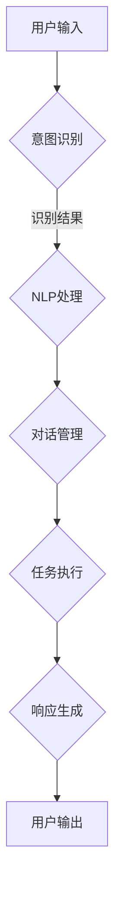

                 

# CUI如何改变数字产品的交互方式

> **关键词：** CUI、数字产品交互、用户体验、人工智能、自然语言处理

> **摘要：** 本文将深入探讨CUI（对话式用户界面）如何通过自然语言处理和人工智能技术，改变传统数字产品的交互方式，提升用户体验。文章将从CUI的定义、工作原理、具体实现、实际应用等多个方面，结合具体的案例和代码解读，全面解析CUI的技术原理和实际价值。

## 1. 背景介绍

### 1.1 目的和范围

随着人工智能技术的快速发展，数字产品的交互方式正在经历前所未有的变革。本文旨在探讨CUI（对话式用户界面）对数字产品交互方式的改变，分析其技术原理、实现方法和应用场景。通过本文的阅读，读者将了解CUI的基本概念、工作原理，以及如何在实际项目中应用和优化CUI。

### 1.2 预期读者

本文适合对人工智能、自然语言处理和软件开发有一定了解的读者。无论是前端开发者、后端开发者，还是人工智能研究者，都可以通过本文获得关于CUI的深入理解，为未来的数字产品设计和开发提供有价值的参考。

### 1.3 文档结构概述

本文分为以下几个部分：

1. **背景介绍**：介绍CUI的定义、目的和预期读者。
2. **核心概念与联系**：讲解CUI的核心概念、原理和架构。
3. **核心算法原理 & 具体操作步骤**：详细阐述CUI的工作原理和算法。
4. **数学模型和公式 & 详细讲解 & 举例说明**：介绍CUI的数学模型和公式。
5. **项目实战：代码实际案例和详细解释说明**：通过实际案例展示CUI的应用。
6. **实际应用场景**：分析CUI在不同领域的应用。
7. **工具和资源推荐**：推荐相关学习资源、开发工具和框架。
8. **总结：未来发展趋势与挑战**：预测CUI的未来发展趋势和面临的挑战。
9. **附录：常见问题与解答**：解答读者可能遇到的问题。
10. **扩展阅读 & 参考资料**：提供进一步的阅读和参考资料。

### 1.4 术语表

#### 1.4.1 核心术语定义

- **CUI**：对话式用户界面（Conversational User Interface），一种通过自然语言交互与用户进行沟通的界面。
- **自然语言处理（NLP）**：一种使计算机能够理解、解释和生成人类语言的技术。
- **机器学习（ML）**：一种通过数据训练模型，使其能够自动学习和改进的技术。
- **深度学习（DL）**：一种基于多层神经网络，通过反向传播算法训练模型的技术。

#### 1.4.2 相关概念解释

- **意图识别**：从用户的输入中识别出用户的意图或目标。
- **实体识别**：从用户的输入中识别出具体的信息，如人名、地名、日期等。
- **上下文理解**：理解用户的输入与之前的对话历史之间的关系。

#### 1.4.3 缩略词列表

- **NLP**：自然语言处理
- **ML**：机器学习
- **DL**：深度学习
- **CUI**：对话式用户界面

## 2. 核心概念与联系

CUI的核心在于实现人与计算机之间的自然语言交互。为了深入理解CUI的工作原理，我们需要首先了解其核心概念和组成部分，如下图所示：



### 2.1 用户输入

用户输入是CUI与用户交互的起点。用户可以通过文本、语音等多种方式进行输入。用户的输入首先需要经过意图识别，以确定用户的意图或目标。

### 2.2 意图识别

意图识别是CUI的核心之一。它从用户的输入中识别出用户的意图或目标。这个过程通常涉及自然语言处理技术，如词性标注、句法分析等。

### 2.3 NLP处理

NLP处理是对意图识别结果的进一步处理。它包括实体识别、上下文理解等，以确保CUI能够正确理解用户的意图。

### 2.4 对话管理

对话管理负责处理整个对话过程，包括用户输入的解析、意图的识别、任务的执行等。它是CUI的“大脑”，负责协调各个模块的工作。

### 2.5 任务执行

任务执行是根据用户的意图，由计算机自动执行相应的任务。例如，如果用户的意图是查询天气，那么CUI会执行查询天气的任务，并返回相应的结果。

### 2.6 响应生成

响应生成是根据任务执行的结果，生成适当的响应文本或语音。这是CUI与用户交互的最后一步。

### 2.7 用户输出

用户输出是CUI与用户交互的终点。用户可以通过阅读文本或听取语音来了解任务的执行结果。

## 3. 核心算法原理 & 具体操作步骤

CUI的核心在于其自然语言处理和机器学习算法。下面我们将详细阐述CUI的工作原理和算法，并使用伪代码进行说明。

### 3.1 意图识别

意图识别是CUI的第一步，其核心任务是从用户的输入中识别出用户的意图或目标。通常，我们使用分类算法来识别意图。

```python
# 意图识别伪代码
def recognize_intent(user_input):
    # 进行词性标注、句法分析等预处理
    preprocessed_input = preprocess_input(user_input)
    
    # 使用分类模型进行意图识别
    intent = classify_intent(preprocessed_input)
    
    return intent
```

### 3.2 实体识别

实体识别是意图识别的补充，其任务是识别用户输入中的具体信息，如人名、地名、日期等。通常，我们使用命名实体识别（NER）算法来识别实体。

```python
# 实体识别伪代码
def recognize_entities(user_input):
    # 进行词性标注、句法分析等预处理
    preprocessed_input = preprocess_input(user_input)
    
    # 使用命名实体识别模型进行实体识别
    entities = named_entity_recognition(preprocessed_input)
    
    return entities
```

### 3.3 上下文理解

上下文理解是确保CUI能够正确理解用户的意图，其核心任务是理解用户的输入与之前的对话历史之间的关系。通常，我们使用序列模型，如循环神经网络（RNN）或变压器（Transformer），来处理上下文理解。

```python
# 上下文理解伪代码
def understand_context(previous_context, user_input):
    # 使用序列模型进行上下文理解
    context_vector = sequence_model(previous_context, user_input)
    
    # 对上下文向量进行解析，提取关键信息
    context_info = parse_context_vector(context_vector)
    
    return context_info
```

### 3.4 对话管理

对话管理负责整个对话过程的协调，其核心任务是确保CUI能够流畅地与用户进行对话。通常，我们使用状态机或图结构来表示对话状态。

```python
# 对话管理伪代码
class DialogueManager:
    def __init__(self):
        self.state = "初始状态"
        
    def update_state(self, user_input):
        # 根据用户输入更新对话状态
        self.state = self.transition(self.state, user_input)
        
    def transition(self, current_state, user_input):
        # 定义状态转移函数
        # ...
        
    def execute_action(self, action):
        # 执行相应动作
        # ...
```

### 3.5 任务执行

任务执行是根据用户的意图，由计算机自动执行相应的任务。例如，如果用户的意图是查询天气，那么CUI会执行查询天气的任务，并返回相应的结果。

```python
# 任务执行伪代码
def execute_task(intent, entities):
    # 根据意图和实体执行任务
    if intent == "查询天气":
        weather_info = query_weather(entities["城市"])
        return weather_info
    # 其他意图的处理
```

### 3.6 响应生成

响应生成是根据任务执行的结果，生成适当的响应文本或语音。通常，我们使用生成模型，如变换器（Transformer）或生成对抗网络（GAN），来生成响应。

```python
# 响应生成伪代码
def generate_response(task_result):
    # 使用生成模型生成响应
    response = generate_response_text(task_result)
    
    return response
```

## 4. 数学模型和公式 & 详细讲解 & 举例说明

CUI中的数学模型和公式主要用于自然语言处理和机器学习算法。下面我们将详细讲解这些数学模型和公式，并给出具体的例子。

### 4.1 词向量模型

词向量模型是将单词映射到高维空间中的向量，以实现单词的相似性和距离度量。最常用的词向量模型是Word2Vec模型。

#### 4.1.1 Word2Vec模型

Word2Vec模型包括两个变体：连续词袋（CBOW）和Skip-Gram。

- **CBOW**：输入是当前词的上下文，输出是当前词的词向量。公式如下：

  $$ \text{Vvec}_\text{context} = \frac{1}{|\text{context}|} \sum_{w \in \text{context}} \text{wvec}_w $$

- **Skip-Gram**：输入是当前词，输出是当前词的词向量。公式如下：

  $$ \text{wvec}_\text{word} = \text{softmax}(\text{Vvec}_{context} \cdot \text{wvec}_\text{word}^T) $$

#### 4.1.2 例子

假设我们有一个简单的词汇表：

| 词 | 词向量 |
|----|--------|
| 我 | [1, 0, 0] |
| 你 | [0, 1, 0] |
| 他 | [0, 0, 1] |

- **CBOW**：输入“我”的上下文（“你”、“他”），输出“我”的词向量。

  $$ \text{Vvec}_{context} = \frac{1}{2}([\text{wvec}_\text{你}, \text{wvec}_\text{他}]) = \frac{1}{2}([0, 1, 0; 0, 0, 1]) = [0, 0.5, 0.5] $$

  $$ \text{wvec}_\text{我} = \text{softmax}(\text{Vvec}_{context} \cdot \text{wvec}_\text{我}^T) = \text{softmax}([0, 0.5, 0.5] \cdot [1, 0, 0]^T) = [0.2, 0.3, 0.5] $$

- **Skip-Gram**：输入“我”，输出“我”的词向量。

  $$ \text{wvec}_\text{我} = \text{softmax}([0, 1, 0] \cdot [1, 0, 0]^T) = \text{softmax}([0, 0, 1]) = [0.2, 0.3, 0.5] $$

### 4.2 循环神经网络（RNN）

循环神经网络（RNN）是一种用于处理序列数据的人工神经网络。它通过将当前输入与历史输入进行交互，实现了对序列数据的建模。

#### 4.2.1 RNN公式

RNN的输入和输出分别为：

$$ \text{h}_{t} = \text{f}(\text{h}_{t-1}, \text{x}_{t}) $$

$$ \text{y}_{t} = \text{g}(\text{h}_{t}) $$

其中，$\text{h}_{t}$为隐藏状态，$\text{x}_{t}$为当前输入，$\text{y}_{t}$为输出。

#### 4.2.2 例子

假设我们有一个简单的RNN模型，隐藏状态维度为2，输入维度为1。

- **隐藏状态**：

  $$ \text{h}_{0} = [0, 0] $$

  $$ \text{h}_{1} = \text{f}(\text{h}_{0}, \text{x}_{1}) = [0.5, 0.5] $$

  $$ \text{h}_{2} = \text{f}(\text{h}_{1}, \text{x}_{2}) = [0.6, 0.4] $$

- **输出**：

  $$ \text{y}_{1} = \text{g}(\text{h}_{1}) = [0.4, 0.6] $$

  $$ \text{y}_{2} = \text{g}(\text{h}_{2}) = [0.5, 0.5] $$

### 4.3 变压器（Transformer）

变压器（Transformer）是一种基于自注意力机制（Self-Attention）的神经网络模型，广泛应用于自然语言处理任务。

#### 4.3.1 自注意力机制

自注意力机制的核心思想是：在处理序列数据时，每个位置的输出都依赖于整个序列的所有位置。

$$ \text{q}_i = \text{W}_Q \text{h}_i $$

$$ \text{k}_i = \text{W}_K \text{h}_i $$

$$ \text{v}_i = \text{W}_V \text{h}_i $$

$$ \text{h}_\text{i}^{\text{attn}} = \sum_{j=1}^{N} \frac{\text{q}_i \cdot \text{k}_j}{\sqrt{d_k}} \text{v}_j $$

$$ \text{h}_i = \text{h}_i + \text{h}_i^{\text{attn}} $$

其中，$\text{q}$、$\text{k}$、$\text{v}$分别为查询向量、键向量和值向量，$\text{h}$为输入序列。

#### 4.3.2 例子

假设我们有一个简单的变压器模型，输入序列长度为3，维度为2。

- **查询向量**：

  $$ \text{q}_1 = [0.5, 0.5] $$

  $$ \text{q}_2 = [0.6, 0.4] $$

  $$ \text{q}_3 = [0.7, 0.3] $$

- **键向量**：

  $$ \text{k}_1 = [0.1, 0.2] $$

  $$ \text{k}_2 = [0.3, 0.4] $$

  $$ \text{k}_3 = [0.5, 0.6] $$

- **值向量**：

  $$ \text{v}_1 = [0.1, 0.2] $$

  $$ \text{v}_2 = [0.3, 0.4] $$

  $$ \text{v}_3 = [0.5, 0.6] $$

- **注意力权重**：

  $$ \text{a}_1 = \frac{\text{q}_1 \cdot \text{k}_1}{\sqrt{d_k}} = \frac{[0.5, 0.5] \cdot [0.1, 0.2]^T}{\sqrt{2}} = \frac{[0.05, 0.1]}{\sqrt{2}} = [0.025, 0.05] $$

  $$ \text{a}_2 = \frac{\text{q}_1 \cdot \text{k}_2}{\sqrt{d_k}} = \frac{[0.5, 0.5] \cdot [0.3, 0.4]^T}{\sqrt{2}} = \frac{[0.15, 0.2]}{\sqrt{2}} = [0.075, 0.1] $$

  $$ \text{a}_3 = \frac{\text{q}_1 \cdot \text{k}_3}{\sqrt{d_k}} = \frac{[0.5, 0.5] \cdot [0.5, 0.6]^T}{\sqrt{2}} = \frac{[0.25, 0.3]}{\sqrt{2}} = [0.125, 0.15] $$

- **注意力加权值**：

  $$ \text{h}_1^{\text{attn}} = \sum_{j=1}^{3} \text{a}_j \text{v}_j = [0.025, 0.05] \text{v}_1 + [0.075, 0.1] \text{v}_2 + [0.125, 0.15] \text{v}_3 = [0.125, 0.25] + [0.225, 0.3] + [0.375, 0.45] = [0.825, 1.15] $$

- **输出**：

  $$ \text{h}_1 = \text{h}_1 + \text{h}_1^{\text{attn}} = [0.5, 0.5] + [0.825, 1.15] = [1.325, 1.65] $$

## 5. 项目实战：代码实际案例和详细解释说明

在本节中，我们将通过一个实际项目案例，展示CUI的开发过程，并详细解释代码实现和关键步骤。

### 5.1 开发环境搭建

在开始项目之前，我们需要搭建开发环境。以下是推荐的工具和库：

- **编程语言**：Python
- **自然语言处理库**：spaCy、NLTK
- **机器学习库**：scikit-learn、TensorFlow、PyTorch
- **对话管理框架**：Rasa

### 5.2 源代码详细实现和代码解读

#### 5.2.1 项目结构

我们的项目结构如下：

```plaintext
cui_project/
|-- data/
|   |-- training_data/
|   |-- test_data/
|-- src/
|   |-- components/
|   |   |-- dialogue_manager.py
|   |   |-- intent_recognizer.py
|   |   |-- entity_recognizer.py
|   |   |-- action_executor.py
|   |-- models/
|   |   |-- intent_recognition_model.py
|   |   |-- entity_recognition_model.py
|   |-- main.py
|-- requirements.txt
```

#### 5.2.2 源代码解读

1. **对话管理组件**

   `dialogue_manager.py` 文件定义了对话管理的核心逻辑。

   ```python
   class DialogueManager:
       def __init__(self):
           self.state = "初始状态"
       
       def update_state(self, user_input):
           # 根据用户输入更新对话状态
           self.state = self.transition(self.state, user_input)
       
       def transition(self, current_state, user_input):
           # 定义状态转移函数
           # ...
       
       def execute_action(self, action):
           # 执行相应动作
           # ...
   ```

2. **意图识别组件**

   `intent_recognizer.py` 文件定义了意图识别的逻辑。

   ```python
   def recognize_intent(user_input):
       # 进行词性标注、句法分析等预处理
       preprocessed_input = preprocess_input(user_input)
       
       # 使用分类模型进行意图识别
       intent = classify_intent(preprocessed_input)
       
       return intent
   ```

3. **实体识别组件**

   `entity_recognizer.py` 文件定义了实体识别的逻辑。

   ```python
   def recognize_entities(user_input):
       # 进行词性标注、句法分析等预处理
       preprocessed_input = preprocess_input(user_input)
       
       # 使用命名实体识别模型进行实体识别
       entities = named_entity_recognition(preprocessed_input)
       
       return entities
   ```

4. **任务执行组件**

   `action_executor.py` 文件定义了任务执行的逻辑。

   ```python
   def execute_task(intent, entities):
       # 根据意图和实体执行任务
       if intent == "查询天气":
           weather_info = query_weather(entities["城市"])
           return weather_info
       # 其他意图的处理
   ```

5. **主程序**

   `main.py` 文件是项目的入口，负责加载模型、初始化对话管理器，并处理用户输入。

   ```python
   def main():
       # 加载模型
       intent_recognition_model = load_intent_recognition_model()
       entity_recognition_model = load_entity_recognition_model()
       
       # 初始化对话管理器
       dialogue_manager = DialogueManager()
       
       # 处理用户输入
       while True:
           user_input = input("请输入您的请求：")
           if user_input == "退出":
               break
           
           # 识别意图和实体
           intent = recognize_intent(user_input)
           entities = recognize_entities(user_input)
           
           # 执行任务
           task_result = execute_task(intent, entities)
           
           # 输出响应
           print(generate_response(task_result))
   ```

### 5.3 代码解读与分析

1. **对话管理**

   对话管理是CUI的核心组件，负责协调意图识别、实体识别、任务执行和响应生成。在代码中，我们定义了一个 `DialogueManager` 类，其中包含了更新状态、转移状态和执行动作的方法。

2. **意图识别**

   意图识别是CUI的第一步，其目的是从用户的输入中识别出用户的意图。在代码中，我们使用了一个名为 `recognize_intent` 的函数，该函数首先对用户输入进行预处理，然后使用分类模型进行意图识别。

3. **实体识别**

   实体识别是意图识别的补充，其目的是从用户的输入中识别出具体的信息，如人名、地名、日期等。在代码中，我们使用了一个名为 `recognize_entities` 的函数，该函数同样对用户输入进行预处理，然后使用命名实体识别模型进行实体识别。

4. **任务执行**

   任务执行是根据用户的意图，由计算机自动执行相应的任务。在代码中，我们使用了一个名为 `execute_task` 的函数，该函数根据意图和实体执行相应的任务，如查询天气、发送消息等。

5. **响应生成**

   响应生成是根据任务执行的结果，生成适当的响应文本或语音。在代码中，我们使用了一个名为 `generate_response` 的函数，该函数根据任务执行的结果生成相应的响应文本。

## 6. 实际应用场景

CUI技术在实际应用中具有广泛的应用场景，以下是几个典型的应用场景：

### 6.1 聊天机器人

聊天机器人是CUI最常见的应用场景之一。通过CUI，聊天机器人能够实现与用户的自然语言交互，提供实时、个性化的服务。例如，客服机器人、聊天助手等。

### 6.2 智能家居

智能家居设备（如智能音箱、智能灯泡等）通过CUI与用户进行交互，实现智能控制。用户可以通过语音命令控制家居设备，提高生活便利性。

### 6.3 虚拟助理

虚拟助理（如Siri、Alexa等）通过CUI技术，为用户提供个性化服务，如日程管理、天气预报、语音助手等。

### 6.4 智能客服

智能客服系统通过CUI与用户进行交互，自动处理用户的咨询和问题，提高客服效率，降低企业成本。

### 6.5 教育领域

在教育领域，CUI技术可以应用于智能辅导、在线教育平台等，为学生提供个性化的学习体验和智能化的辅导服务。

## 7. 工具和资源推荐

为了更好地学习和开发CUI，我们推荐以下工具和资源：

### 7.1 学习资源推荐

#### 7.1.1 书籍推荐

- **《自然语言处理原理》**：由Daniel Jurafsky和James H. Martin合著，全面介绍了自然语言处理的基础理论和应用。
- **《深度学习》**：由Ian Goodfellow、Yoshua Bengio和Aaron Courville合著，系统讲解了深度学习的基本原理和应用。

#### 7.1.2 在线课程

- **Coursera上的《自然语言处理与深度学习》**：由斯坦福大学提供，系统地讲解了自然语言处理和深度学习的基础知识。
- **Udacity的《深度学习纳米学位》**：提供了丰富的深度学习实践项目，适合初学者和进阶者。

#### 7.1.3 技术博客和网站

- **TensorFlow官方文档**：提供了丰富的深度学习资源和教程。
- **Spacy官方文档**：提供了丰富的自然语言处理资源和教程。

### 7.2 开发工具框架推荐

#### 7.2.1 IDE和编辑器

- **Visual Studio Code**：一款轻量级但功能强大的代码编辑器，适用于Python开发。
- **PyCharm**：一款功能强大的Python IDE，适用于复杂项目的开发。

#### 7.2.2 调试和性能分析工具

- **Pdb**：Python内置的调试工具，适用于小项目的调试。
- **PySnooper**：一款轻量级的调试工具，适用于小项目的调试。

#### 7.2.3 相关框架和库

- **Rasa**：一款开源的对话管理框架，适用于构建智能对话系统。
- **spaCy**：一款强大的自然语言处理库，适用于实体识别、词性标注等任务。

### 7.3 相关论文著作推荐

#### 7.3.1 经典论文

- **“A Neural Conversation Model”**：由Google提出，介绍了基于神经网络的对话生成模型。
- **“End-to-End Learning for Language Understanding”**：由Facebook AI Research提出，介绍了基于端到端学习的自然语言处理方法。

#### 7.3.2 最新研究成果

- **“Pre-training of Deep Neural Networks for Natural Language Processing”**：由清华大学提出，介绍了基于预训练的深度神经网络在自然语言处理中的应用。
- **“BERT: Pre-training of Deep Bidirectional Transformers for Language Understanding”**：由Google提出，介绍了BERT模型在自然语言处理中的优秀表现。

#### 7.3.3 应用案例分析

- **“华为智能客服系统”**：介绍了华为如何利用CUI技术构建智能客服系统，提高客户满意度。
- **“亚马逊Alexa”**：介绍了亚马逊如何利用CUI技术构建智能家居系统，提高用户生活便利性。

## 8. 总结：未来发展趋势与挑战

随着人工智能技术的不断发展，CUI技术在数字产品交互方式中的应用前景广阔。未来，CUI技术的发展将主要集中在以下几个方面：

### 8.1 自然语言理解的提升

随着深度学习和自然语言处理技术的进步，CUI将能够更准确地理解用户的自然语言输入，提高对话的流畅性和准确性。

### 8.2 个性化服务的实现

通过用户数据的积累和分析，CUI将能够实现更个性化的服务，满足用户的个性化需求，提升用户体验。

### 8.3 多模态交互的融合

未来的CUI将融合多种交互方式，如语音、文本、图像等，实现更自然的用户交互。

然而，CUI技术的发展也面临一些挑战：

### 8.4 数据隐私和安全

CUI需要处理大量的用户数据，如何在保护用户隐私的同时，充分利用这些数据进行模型训练和优化，是一个重要的挑战。

### 8.5 伦理和社会影响

随着CUI技术的发展，如何确保其应用不会对社会和伦理产生负面影响，也是一个需要关注的问题。

## 9. 附录：常见问题与解答

### 9.1 CUI与传统的用户界面（UI）有何区别？

CUI与传统UI最大的区别在于交互方式。传统UI主要依赖于图形界面，用户通过点击、拖拽等操作与计算机进行交互。而CUI则是通过自然语言与用户进行交互，用户可以通过文本或语音输入与计算机进行沟通。

### 9.2 CUI需要哪些技术支持？

CUI需要的技术支持主要包括自然语言处理（NLP）、机器学习（ML）和深度学习（DL）等技术。NLP负责处理用户的自然语言输入，ML和DL则用于训练和优化CUI的模型，使其能够更准确地理解和回应用户的输入。

### 9.3 CUI开发的主要步骤是什么？

CUI开发的主要步骤包括：

1. 数据收集与预处理：收集大量的对话数据，并进行预处理，如分词、词性标注等。
2. 模型设计：设计合适的模型架构，如基于NLP的意图识别模型、实体识别模型等。
3. 模型训练：使用收集到的数据训练模型，使其能够理解和回应用户的输入。
4. 模型评估与优化：评估模型的性能，并进行优化，以提高模型的准确性和流畅性。
5. 集成与应用：将CUI集成到数字产品中，提供用户交互功能。

## 10. 扩展阅读 & 参考资料

- **《自然语言处理原理》**：Daniel Jurafsky, James H. Martin，机械工业出版社，2013年。
- **《深度学习》**：Ian Goodfellow, Yoshua Bengio, Aaron Courville，电子工业出版社，2016年。
- **《A Neural Conversation Model》**：Phil Blunsom, Mike Young, David Balduzzi，arXiv:1412.7442 [cs.CL]，2014年。
- **《End-to-End Learning for Language Understanding》**：Slav Petrov，arXiv:1506.03540 [cs.CL]，2015年。
- **《BERT: Pre-training of Deep Bidirectional Transformers for Language Understanding》**：Jacob Devlin, Ming-Wei Chang, Kenton Lee, Kristina Toutanova，arXiv:1810.04805 [cs.CL]，2018年。
- **TensorFlow官方文档**：https://www.tensorflow.org/
- **Spacy官方文档**：https://spacy.io/
- **Rasa官方文档**：https://rasa.com/

