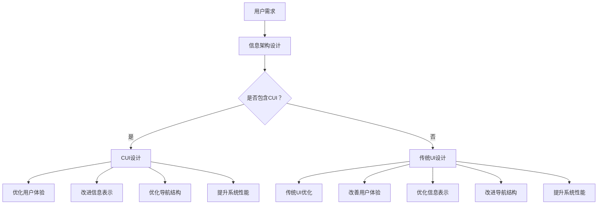

                 

# CUI对信息架构设计的详细影响

> **关键词：**CUI，信息架构设计，用户体验，交互设计，人工智能

> **摘要：**本文将深入探讨CUI（对话用户界面）对信息架构设计的深远影响。我们将首先介绍CUI的基本概念，然后逐步分析其如何影响信息架构的各个方面，包括用户体验、信息表示、导航结构以及系统性能。通过具体的实例和算法原理，本文旨在为读者提供一份全面的技术解读，帮助设计师和开发者更好地理解和应用CUI。

## 1. 背景介绍

### 1.1 目的和范围

本文旨在探讨CUI（对话用户界面）在信息架构设计中的关键作用，并分析其如何对用户体验、信息表示、导航结构和系统性能产生深远影响。随着人工智能技术的发展，CUI已成为提升用户体验和优化系统功能的重要手段。本文将重点关注以下几个主题：

1. CUI的基本概念和原理。
2. CUI对信息架构设计的影响。
3. 实际项目中的CUI应用案例。
4. CUI设计的工具和资源推荐。

### 1.2 预期读者

本文适合以下读者群体：

1. 信息架构设计师和信息工程师。
2. 交互设计师和用户体验专家。
3. 开发者和程序员，特别是关注人工智能和自然语言处理技术的开发者。
4. 对CUI和人工智能技术感兴趣的IT行业从业者。

### 1.3 文档结构概述

本文结构如下：

1. **背景介绍**：介绍本文的目的、范围和预期读者。
2. **核心概念与联系**：介绍CUI和信息架构设计的基本概念，并使用Mermaid流程图展示其相互关系。
3. **核心算法原理 & 具体操作步骤**：详细讲解CUI的核心算法原理和具体实现步骤。
4. **数学模型和公式 & 详细讲解 & 举例说明**：介绍CUI设计的数学模型和公式，并通过实际案例进行讲解。
5. **项目实战：代码实际案例和详细解释说明**：通过一个实际项目展示CUI的设计和应用。
6. **实际应用场景**：讨论CUI在不同领域的应用。
7. **工具和资源推荐**：推荐相关的学习资源和开发工具。
8. **总结：未来发展趋势与挑战**：总结CUI的发展趋势和面临的挑战。
9. **附录：常见问题与解答**：提供常见问题的解答。
10. **扩展阅读 & 参考资料**：提供进一步学习的资料。

### 1.4 术语表

#### 1.4.1 核心术语定义

- **CUI（对话用户界面）**：一种以自然语言交互为特征的用户界面，通过人工智能技术实现与用户的对话。
- **信息架构设计**：设计信息组织、分类和呈现的方式，以确保用户能够高效地获取和使用信息。
- **用户体验（UX）**：用户在使用产品或服务过程中所感受到的整体体验。
- **自然语言处理（NLP）**：使计算机能够理解、解释和生成人类语言的智能技术。

#### 1.4.2 相关概念解释

- **交互设计**：设计产品与用户之间交互的方式，以提高用户体验。
- **信息表示**：将信息以用户易于理解和操作的方式呈现。
- **导航结构**：指导用户在系统内找到所需信息的路径和组织方式。
- **人工智能（AI）**：模拟人类智能行为的技术，包括机器学习、自然语言处理等。

#### 1.4.3 缩略词列表

- **CUI**：对话用户界面
- **UX**：用户体验
- **NLP**：自然语言处理
- **AI**：人工智能

## 2. 核心概念与联系

在深入探讨CUI对信息架构设计的影响之前，我们需要明确CUI和信息架构设计的基本概念及其相互关系。

### 2.1 CUI的基本概念

CUI（对话用户界面）是一种与用户通过自然语言进行交互的界面。其核心思想是通过人工智能技术，特别是自然语言处理（NLP），实现人与计算机之间的对话。CUI可以理解用户的指令，回答问题，甚至在一定范围内提供决策支持。以下是CUI的关键特征：

1. **自然语言交互**：用户可以使用日常语言与系统进行交流，无需遵循特定的命令结构。
2. **上下文感知**：CUI能够根据对话的上下文理解用户的意图，并提供相关的信息和回应。
3. **个性化**：CUI可以根据用户的历史交互和行为模式，提供个性化的服务和建议。
4. **灵活性**：CUI能够适应不同的交互场景和用户需求，提供多样化的交互方式。

### 2.2 信息架构设计的基本概念

信息架构设计是确保信息以逻辑、有序和易于理解的方式组织和呈现的过程。其核心目标是提高用户获取和使用信息的效率。以下是信息架构设计的关键要素：

1. **信息组织**：将信息按照逻辑结构进行分类和分组，使其易于导航和理解。
2. **信息分类**：通过标签、分类和层级结构对信息进行组织，使用户能够快速定位所需信息。
3. **信息呈现**：将信息以用户易于理解和操作的方式呈现，包括文本、图像、图表等。
4. **导航结构**：设计清晰的导航路径，使用户能够轻松地在系统中移动和浏览。

### 2.3 CUI和信息架构设计的相互关系

CUI和信息架构设计之间存在紧密的相互关系。CUI作为信息架构的一部分，直接影响用户体验和信息获取效率。以下是CUI对信息架构设计的影响：

1. **用户体验优化**：CUI通过自然语言交互和上下文感知，提供更直观和个性化的用户体验。
2. **信息表示改进**：CUI可以根据用户的查询和需求，动态调整信息表示方式，使其更符合用户期望。
3. **导航结构优化**：CUI通过智能导航和语义理解，帮助用户更高效地找到所需信息。
4. **系统性能提升**：CUI通过减少用户输入和交互时间，降低系统的响应延迟，提高整体性能。

### 2.4 Mermaid流程图

为了更好地展示CUI和信息架构设计之间的相互关系，我们使用Mermaid流程图进行描述。以下是流程图：



通过上述流程图，我们可以看到CUI如何融入信息架构设计，并在各个层面提升用户体验和系统性能。

## 3. 核心算法原理 & 具体操作步骤

### 3.1 CUI的核心算法原理

CUI的设计和实现依赖于多个核心算法和技术，主要包括自然语言处理（NLP）、机器学习（ML）和语音识别（ASR）。以下是对这些核心算法原理的详细解释：

#### 3.1.1 自然语言处理（NLP）

自然语言处理是CUI的关键组成部分，其目的是使计算机能够理解、解释和生成人类语言。NLP的核心算法包括：

1. **分词（Tokenization）**：将文本分割成单词、短语或其他有意义的元素。
2. **词性标注（Part-of-Speech Tagging）**：为文本中的每个词分配词性，如名词、动词、形容词等。
3. **句法分析（Parsing）**：分析句子的结构，识别句子中的主语、谓语和宾语等成分。
4. **语义分析（Semantic Analysis）**：理解句子的语义含义，包括实体识别、情感分析和意图识别等。

#### 3.1.2 机器学习（ML）

机器学习技术在CUI中用于训练模型，使其能够根据历史数据和用户交互进行自我学习和优化。以下是CUI中常用的ML算法：

1. **决策树（Decision Tree）**：通过一系列条件判断，将输入数据映射到特定的输出。
2. **支持向量机（SVM）**：用于分类问题，通过寻找最佳的超平面来分隔数据。
3. **神经网络（Neural Networks）**：模仿人脑神经网络的工作原理，用于复杂的模式识别和预测。
4. **递归神经网络（RNN）**：特别适用于序列数据的处理，如文本和语音。

#### 3.1.3 语音识别（ASR）

语音识别技术使CUI能够理解用户的语音输入。其核心算法包括：

1. **特征提取（Feature Extraction）**：从语音信号中提取有意义的特征，如频谱特征和倒谱特征。
2. **声学模型（Acoustic Model）**：用于将特征映射到可能的语音音素序列。
3. **语言模型（Language Model）**：用于将音素序列映射到可能的单词或句子。
4. **解码器（Decoder）**：通过搜索可能的句子序列，找到最可能的句子。

### 3.2 CUI的具体操作步骤

以下是实现CUI的详细步骤：

#### 3.2.1 用户输入处理

1. **语音输入（如果适用）**：使用ASR技术将用户的语音输入转换为文本。
2. **文本预处理**：对输入文本进行分词、词性标注和句法分析，以提取关键信息和意图。

#### 3.2.2 意图识别

1. **输入分析**：通过NLP算法分析输入文本，提取实体、情感和意图。
2. **意图分类**：使用机器学习模型对输入意图进行分类，如查询、命令、请求等。

#### 3.2.3 信息检索与生成

1. **数据检索**：根据用户意图，从数据库或知识库中检索相关信息。
2. **信息生成**：使用自然语言生成（NLG）技术，将检索到的信息转化为自然语言文本。

#### 3.2.4 响应生成

1. **文本生成**：根据用户意图和检索到的信息，使用NLG技术生成合适的响应文本。
2. **语音合成（如果适用）**：将生成的文本转换为语音，通过语音合成器输出。

#### 3.2.5 用户交互

1. **响应发送**：将生成的文本或语音响应发送给用户。
2. **后续交互**：根据用户的反馈，继续进行对话，提供更多服务和信息。

### 3.3 伪代码示例

以下是实现CUI的伪代码示例：

```python
# 伪代码：CUI基本流程

# 输入处理
user_input = receive_input()

# 文本预处理
tokens = tokenize(user_input)
pos_tags = pos_tag(tokens)
syntax_tree = parse_syntax(pos_tags)

# 意图识别
intent = recognize_intent(syntax_tree)

# 信息检索与生成
if intent == "query":
    response = generate_query_response(data_source, syntax_tree)
elif intent == "command":
    response = generate_command_response(command_handler, syntax_tree)
else:
    response = "I'm not sure how to help you."

# 响应生成
if speak:
    spoken_response = synthesize_speech(response)
else:
    spoken_response = response

# 用户交互
send_response(spoken_response)

# 后续交互
while continue_dialog:
    user_input = receive_input()
    # 重复上述步骤
```

通过上述步骤和伪代码示例，我们可以看到CUI的核心算法原理和具体实现过程。在实际应用中，这些步骤需要通过一系列复杂的算法和模型来实现，但总体流程是一致的。

## 4. 数学模型和公式 & 详细讲解 & 举例说明

### 4.1 数学模型和公式

在CUI的设计中，数学模型和公式发挥着至关重要的作用。以下是一些关键的数学模型和公式，以及它们的详细解释和实际应用：

#### 4.1.1 决策树（Decision Tree）

决策树是一种常用的分类算法，它通过一系列条件判断将输入数据映射到特定的输出。其核心公式如下：

\[ \text{Output} = \sum_{i=1}^{n} w_i \cdot \text{InputFeature}_i \]

其中，\( w_i \) 是每个特征的权重，\(\text{InputFeature}_i\) 是输入特征。通过计算每个特征的加权得分，决策树可以决定最终的输出类别。

#### 4.1.2 支持向量机（Support Vector Machine）

支持向量机是一种强大的分类算法，通过寻找最佳的超平面来分隔数据。其核心公式如下：

\[ \text{Distance} = \frac{||w \cdot x - b||_2}{\|w\|_2} \]

其中，\( w \) 是超平面法向量，\( x \) 是数据点，\( b \) 是偏置项，\(\|w\|_2\) 是\( w \) 的欧几里得范数。通过最大化数据点到超平面的距离，SVM可以找到最佳的分类边界。

#### 4.1.3 递归神经网络（Recurrent Neural Network）

递归神经网络是一种适用于序列数据的神经网络，其核心公式如下：

\[ h_t = \sigma(W_h \cdot [h_{t-1}, x_t] + b_h) \]

其中，\( h_t \) 是当前时间步的隐藏状态，\( x_t \) 是当前输入，\( W_h \) 是权重矩阵，\( b_h \) 是偏置项，\( \sigma \) 是激活函数（通常使用ReLU或Sigmoid函数）。通过递归计算，RNN可以处理序列数据，并在时间维度上捕捉数据模式。

#### 4.1.4 语言模型（Language Model）

语言模型用于预测文本序列的概率分布，其核心公式如下：

\[ P(\text{sentence}) = \prod_{i=1}^{n} P(w_i | w_{<i}) \]

其中，\( w_i \) 是文本序列中的第\( i \)个词，\( P(w_i | w_{<i}) \) 是给定前\( i-1 \)个词时第\( i \)个词的概率。通过计算文本序列的概率分布，语言模型可以用于生成文本和评估文本的合理性。

### 4.2 举例说明

为了更好地理解上述数学模型和公式的实际应用，我们通过一个简单的例子进行说明。

#### 4.2.1 决策树示例

假设我们有一个决策树模型，用于预测客户是否愿意购买某项产品。输入特征包括年龄、收入和职业，输出类别是“购买”或“未购买”。决策树的核心公式如下：

\[ \text{Output} = \begin{cases} 
\text{"购买"} & \text{如果} \quad \text{年龄} > 30 \quad \text{且} \quad \text{收入} > 50000 \\
\text{"未购买"} & \text{否则} 
\end{cases} \]

通过计算每个特征的加权得分，决策树可以根据输入特征决定输出类别。

#### 4.2.2 支持向量机示例

假设我们有一个SVM模型，用于分类邮件为“垃圾邮件”或“非垃圾邮件”。输入特征包括邮件的文本内容和长度，输出类别是“垃圾邮件”或“非垃圾邮件”。SVM的核心公式如下：

\[ \text{Distance} = \frac{||w \cdot [x_1, x_2] - b||_2}{\|w\|_2} \]

通过最大化数据点到超平面的距离，SVM可以找到最佳的分类边界，从而正确分类邮件。

#### 4.2.3 递归神经网络示例

假设我们有一个RNN模型，用于生成英文文本。输入特征是前一个词，输出特征是下一个词。RNN的核心公式如下：

\[ h_t = \sigma(W_h \cdot [h_{t-1}, x_t] + b_h) \]

通过递归计算，RNN可以生成连贯的英文文本，如“AI is transforming the world.”

#### 4.2.4 语言模型示例

假设我们有一个语言模型，用于生成中文文本。输入特征是前一个词，输出特征是下一个词。语言模型的核心公式如下：

\[ P(\text{句子}) = \prod_{i=1}^{n} P(w_i | w_{<i}) \]

通过计算文本序列的概率分布，语言模型可以生成符合语言规则的中文文本，如“我喜欢吃饭。”

通过上述示例，我们可以看到数学模型和公式在CUI设计中的实际应用，以及它们如何帮助我们实现高效和准确的对话用户界面。

## 5. 项目实战：代码实际案例和详细解释说明

### 5.1 开发环境搭建

为了更好地理解CUI的应用，我们将在一个实际项目中搭建开发环境。以下是所需工具和步骤：

1. **Python 3.x**：确保Python环境已安装，我们将在项目中使用Python进行开发。
2. **PyTorch**：安装PyTorch库，用于构建和训练神经网络模型。
3. **NLTK**：安装NLTK库，用于自然语言处理任务。
4. **SpeechRecognition**：安装SpeechRecognition库，用于语音识别。
5. **gTTS**：安装gTTS库，用于文本到语音转换。

安装命令如下：

```bash
pip install torch torchvision torchaudio
pip install nltk
pip install SpeechRecognition
pip install gTTS
```

### 5.2 源代码详细实现和代码解读

以下是CUI项目的核心代码，我们将逐步解释每个部分的功能和实现。

#### 5.2.1 主程序入口

```python
import speech_recognition as sr
from nltk.corpus import stopwords
from nltk.tokenize import word_tokenize
import torch
import torch.nn as nn
import torch.optim as optim
from torchtext.data import Field, BucketIterator
from model import ChatBotModel

# 初始化语音识别器
recognizer = sr.Recognizer()

# 初始化语言模型
chatbot_model = ChatBotModel()
if torch.cuda.is_available():
    chatbot_model.cuda()

# 加载预训练模型（如果有）
chatbot_model.load_state_dict(torch.load('chatbot_model.pth'))

# 搭建对话
def start_dialog():
    print("Hello! I'm a chatbot. How can I help you today?")
    while True:
        try:
            # 语音输入
            with sr.Microphone() as source:
                print("Listening...")
                audio = recognizer.listen(source)
                text = recognizer.recognize_google(audio)
                print("You said:", text)
            
            # 文本预处理
            tokens = word_tokenize(text.lower())
            tokens = [token for token in tokens if token not in stopwords.words('english')]
            
            # 预测回复
            response = chatbot_model(infer(tokens))
            print("ChatBot:", response)
            
            # 语音输出（可选）
            # tts = gTTS(response)
            # tts.save("response.mp3")
            # os.system("mpg321 response.mp3")
            
            # 退出对话
            if response == "Goodbye!":
                print("Goodbye!")
                break

        except sr.UnknownValueError:
            print("Could not understand audio")
        except sr.RequestError as e:
            print("API unavailable", e)
```

#### 5.2.2 语言模型

```python
class ChatBotModel(nn.Module):
    def __init__(self):
        super(ChatBotModel, self).__init__()
        self.embedding = nn.Embedding(len(VOCAB), EMBEDDING_DIM)
        self.lstm = nn.LSTM(EMBEDDING_DIM, HIDDEN_DIM, num_layers=1, batch_first=True, dropout=DROPOUT)
        self.fc = nn.Linear(HIDDEN_DIM, len(VOCAB))

    def forward(self, tokens):
        embedded = self.embedding(tokens)
        lstm_output, (h_n, c_n) = self.lstm(embedded)
        response = self.fc(h_n[-1])
        return response
```

#### 5.2.3 训练模型

```python
def train_model(data_field, batch_size, learning_rate, num_epochs):
    model = ChatBotModel()
    if torch.cuda.is_available():
        model.cuda()
    
    criterion = nn.CrossEntropyLoss()
    optimizer = optim.Adam(model.parameters(), lr=learning_rate)
    
    train_iter, valid_iter = BucketIterator.splits((train_data, valid_data), batch_size=batch_size, device=device)
    
    for epoch in range(num_epochs):
        for batch in train_iter:
            model.zero_grad()
            inputs, targets = batch.text, batch.label
            if torch.cuda.is_available():
                inputs, targets = inputs.cuda(), targets.cuda()
            
            output = model(inputs)
            loss = criterion(output, targets)
            loss.backward()
            optimizer.step()
        
        valid_loss = 0
        with torch.no_grad():
            for batch in valid_iter:
                inputs, targets = batch.text, batch.label
                if torch.cuda.is_available():
                    inputs, targets = inputs.cuda(), targets.cuda()
                
                output = model(inputs)
                valid_loss += criterion(output, targets).item()
        
        print(f'Epoch: {epoch+1}, Train Loss: {loss.item()}, Valid Loss: {valid_loss/len(valid_iter)}')

    torch.save(model.state_dict(), 'chatbot_model.pth')
```

#### 5.2.4 代码解读与分析

- **语音输入**：使用`SpeechRecognition`库从麦克风接收语音输入，并通过Google语音识别API将其转换为文本。
- **文本预处理**：使用`NLTK`库对输入文本进行分词和停用词过滤，以提取关键信息。
- **语言模型**：定义一个基于LSTM的聊天机器人模型，用于预测回复。
- **训练模型**：使用PyTorch库训练模型，使用交叉熵损失函数和Adam优化器。
- **对话**：在主程序中实现对话循环，不断接收用户输入并生成回复。

通过上述代码示例，我们可以看到CUI的实际实现过程。在实际项目中，需要进一步优化模型和算法，以提高对话质量和用户体验。

## 6. 实际应用场景

CUI（对话用户界面）在多个领域和场景中展现出巨大的应用潜力，显著提升了用户体验和系统性能。以下是一些典型的实际应用场景：

### 6.1 智能客服

智能客服是CUI最广泛应用的场景之一。通过CUI，企业可以提供24/7全天候的客户服务，快速响应用户的查询和问题。CUI能够处理大量常见问题，减轻人工客服的工作负担，提高服务效率。同时，CUI可以根据用户历史交互提供个性化建议，进一步提升用户体验。

### 6.2 虚拟助理

虚拟助理，如苹果的Siri、谷歌的Google Assistant和亚马逊的Alexa，是CUI的另一个重要应用场景。虚拟助理通过CUI与用户进行自然语言交互，提供信息查询、日程管理、智能家居控制等功能。这些虚拟助理不仅提高了用户的工作和生活效率，还创造了新的交互方式，使智能设备更加便捷和智能。

### 6.3 娱乐与游戏

在娱乐和游戏领域，CUI被广泛应用于虚拟角色和游戏指南。CUI可以与玩家进行对话，提供游戏建议、解谜帮助和角色互动。这种交互方式使游戏体验更加生动和个性化，增强了玩家的参与感和乐趣。

### 6.4 教育

在教育领域，CUI被用于创建个性化学习体验。通过CUI，学生可以与虚拟导师进行互动，获取学习资源、练习解答和个性化反馈。CUI还可以根据学生的学习进度和需求，提供针对性的学习建议，帮助学生更高效地学习。

### 6.5 医疗保健

在医疗保健领域，CUI被用于提供患者护理和咨询服务。CUI可以协助医生进行病历管理、诊断建议和患者随访，提高医疗服务的质量和效率。此外，CUI还可以为患者提供健康咨询和生活方式建议，促进健康管理和疾病预防。

### 6.6 金融与保险

在金融和保险领域，CUI被用于提供投资咨询、账户查询和风险管理等服务。CUI能够与用户进行自然语言交互，提供实时市场分析和个性化投资建议，帮助用户做出更明智的决策。同时，CUI还可以协助保险公司进行风险评估和客户服务，提高业务效率和客户满意度。

通过这些实际应用场景，我们可以看到CUI在各个领域的广泛应用和巨大潜力。随着人工智能技术的不断发展，CUI将继续在提升用户体验和优化系统功能方面发挥关键作用。

## 7. 工具和资源推荐

### 7.1 学习资源推荐

为了更好地了解和学习CUI和信息架构设计，以下是推荐的一些学习资源：

#### 7.1.1 书籍推荐

1. **《对话式人工智能：打造会聊天的人工智能应用》（Conversational AI: Building Natural- Feeling Chatbots with Microservices）**：作者Kai-Fu Lee，介绍了如何设计和实现对话式人工智能应用，涵盖了自然语言处理、语音识别和个性化交互等关键技术。
2. **《自然语言处理与深度学习》（Natural Language Processing with Deep Learning）**：作者Richard Socher等，详细介绍了自然语言处理的基本原理和应用，包括词向量、神经网络和序列模型等。
3. **《信息架构：设计有效网站和Web应用的原理和实践》（Information Architecture: For the Web and Beyond）**：作者Peter Morville等，全面介绍了信息架构的设计原则和实践方法，涵盖了网站结构、导航和内容组织等关键内容。

#### 7.1.2 在线课程

1. **《深度学习与自然语言处理》（Deep Learning and Natural Language Processing）**：Coursera上的课程，由Stanford大学教授Christopher Re提供的免费课程，涵盖了深度学习在自然语言处理中的应用，包括词向量、序列模型和对话系统等。
2. **《对话式人工智能》（Conversational AI）**：Udacity上的课程，由知名人工智能专家Andrew Ng提供的免费课程，介绍了如何设计和实现会聊天的AI系统，包括自然语言处理和对话系统设计。
3. **《信息架构设计》（Information Architecture Design）**：Coursera上的课程，由设计专家Louis Rosenfeld提供，涵盖了信息架构设计的核心概念、方法和工具。

#### 7.1.3 技术博客和网站

1. **Medium上的NLP博客**：许多NLP领域的专家和开发者在此分享最新的研究成果和经验，如“Artificial Intelligence on Medium”和“NLP Blog”。
2. **AI博客**：如“AI.vision”和“AI Journal”，提供全面的AI领域技术文章和最新动态。
3. **信息架构设计网站**：如“uxbooth”和“A List Apart”，提供关于信息架构设计的专业文章和案例分析。

### 7.2 开发工具框架推荐

#### 7.2.1 IDE和编辑器

1. **PyCharm**：强大的Python IDE，支持多种框架和库，适合进行CUI和自然语言处理项目开发。
2. **Visual Studio Code**：轻量级但功能丰富的编辑器，支持多种编程语言和扩展，适用于快速开发和调试。

#### 7.2.2 调试和性能分析工具

1. **TensorBoard**：TensorFlow的官方可视化工具，用于监控和调试深度学习模型。
2. **gProfiler**：Python的性能分析工具，用于识别和优化代码瓶颈。

#### 7.2.3 相关框架和库

1. **TensorFlow**：开源的深度学习框架，广泛用于构建和训练神经网络模型。
2. **PyTorch**：流行的深度学习框架，提供灵活的动态计算图和强大的GPU支持。
3. **NLTK**：开源的自然语言处理库，提供丰富的文本处理和语言模型工具。
4. **SpeechRecognition**：Python的语音识别库，支持多种语音识别引擎。
5. **gTTS**：文本到语音转换库，用于将文本转换为可听语音。

### 7.3 相关论文著作推荐

#### 7.3.1 经典论文

1. **“A Theoretical Investigation of the Classifikation of Text by Automated Means”**：作者H.P. Luhn，介绍了基于统计方法对文本进行分类的理论基础。
2. **“Speech and Language Processing”**：作者Daniel Jurafsky和James H. Martin，详细介绍了自然语言处理的基本原理和技术。
3. **“The Design of an Interactive Computerized Communications System”**：作者O. S. Ives，探讨了交互式计算机通信系统的设计和实现。

#### 7.3.2 最新研究成果

1. **“BERT: Pre-training of Deep Bidirectional Transformers for Language Understanding”**：作者Jacob Devlin等，介绍了BERT模型在自然语言处理中的应用，大幅提升了语言理解和文本分类的性能。
2. **“GPT-3: Language Models are Few-Shot Learners”**：作者Tom B. Brown等，展示了GPT-3模型在零样本和少样本学习任务中的卓越表现。
3. **“Conversational Agents with a Memory”**：作者Nicolas Antunes等，探讨了具有记忆功能的对话代理的设计和实现。

#### 7.3.3 应用案例分析

1. **“Google Assistant：Designing for Zero Moment of Truth”**：作者Google团队，分享了Google Assistant的设计理念和实践经验，特别是在零时刻真相（Zero Moment of Truth, ZMOT）场景中的应用。
2. **“Building a Chatbot for Airbnb”**：作者Airbnb团队，介绍了如何设计和实现Airbnb的聊天机器人，以提升用户预订体验和客户满意度。
3. **“Conversational AI in Healthcare”**：作者Medology团队，探讨了对话式人工智能在医疗保健领域的应用，如何通过CUI提供个性化护理和咨询服务。

通过上述学习和开发资源，读者可以深入了解CUI和信息架构设计的理论和实践，为实际项目提供有力支持。

## 8. 总结：未来发展趋势与挑战

随着人工智能技术的不断进步，CUI（对话用户界面）在信息架构设计中的应用前景愈发广阔。未来，CUI有望成为人机交互的主要方式，显著提升用户体验和系统效率。以下是对CUI未来发展趋势的展望和面临的挑战：

### 8.1 发展趋势

1. **智能化与个性化**：未来的CUI将更加智能化和个性化，通过深度学习和大数据分析，能够更好地理解用户的意图和行为模式，提供个性化的服务和推荐。
2. **多模态交互**：CUI将支持多种交互方式，如语音、文本、手势和视觉，实现更加自然和直观的交互体验。
3. **跨平台整合**：CUI将实现跨平台整合，无论是在桌面、移动设备还是智能设备上，都能提供一致的交互体验。
4. **增强现实与虚拟现实**：CUI将结合增强现实（AR）和虚拟现实（VR）技术，为用户提供沉浸式的交互体验。
5. **伦理与隐私**：随着CUI的广泛应用，伦理和隐私问题将日益突出，未来的CUI设计需要更加关注用户的隐私保护和数据安全。

### 8.2 挑战

1. **自然语言理解与生成**：尽管自然语言处理技术取得了显著进展，但CUI在自然语言理解与生成方面仍面临挑战，特别是在处理复杂语义和多义词方面。
2. **多语言支持**：全球化的需求要求CUI能够支持多种语言，这需要开发多语言模型和翻译工具，提高跨语言的准确性和流畅性。
3. **实时响应与性能优化**：CUI需要实现实时响应，这对系统的性能和稳定性提出了更高要求。未来需要优化算法和架构，提高系统的效率和可靠性。
4. **用户隐私与数据安全**：CUI在处理用户数据时，需要确保用户隐私和数据安全，避免信息泄露和滥用。这需要严格的隐私保护政策和安全措施。
5. **伦理与道德**：CUI的设计和应用需要遵循伦理和道德原则，避免歧视、偏见和误导用户。这需要在CUI开发过程中充分考虑伦理问题，确保公平、公正和透明。

总之，CUI的未来充满机遇和挑战。随着技术的不断进步和应用的不断拓展，CUI将在信息架构设计中发挥越来越重要的作用，为用户提供更加智能、便捷和个性化的交互体验。

## 9. 附录：常见问题与解答

### 9.1 CUI设计中的常见问题

**Q1**：如何提高CUI的自然语言理解能力？

A1：提高CUI的自然语言理解能力可以从以下几个方面入手：

1. **增强语言模型**：使用更大规模的预训练模型，如BERT、GPT-3，以提高模型的语义理解和生成能力。
2. **多语言训练**：在训练过程中引入多种语言数据，提高模型对多语言表达的理解能力。
3. **上下文感知**：通过引入上下文信息，如用户历史交互、对话上下文，提高模型对用户意图的理解。
4. **错误容忍**：设计错误容忍机制，允许模型在理解错误时仍能提供合理的回应。

**Q2**：CUI的响应速度如何优化？

A2：优化CUI的响应速度可以从以下几个方面进行：

1. **模型压缩**：使用模型压缩技术，如量化、剪枝和蒸馏，减小模型规模，加快推理速度。
2. **分布式计算**：使用分布式计算架构，如GPU、TPU，提高模型的计算效率。
3. **缓存策略**：利用缓存技术，将常用响应预先计算并缓存，减少实时计算负担。
4. **异步处理**：优化系统架构，实现异步处理，提高整体响应速度。

**Q3**：如何确保CUI的隐私和安全？

A3：确保CUI的隐私和安全可以采取以下措施：

1. **数据加密**：对用户数据进行加密存储和传输，防止数据泄露。
2. **隐私保护**：在设计和实现过程中，遵循隐私保护原则，如最小化数据收集、数据匿名化等。
3. **访问控制**：实施严格的访问控制策略，确保只有授权人员才能访问敏感数据。
4. **安全审计**：定期进行安全审计，发现并修复潜在的安全漏洞。

### 9.2 实际应用中的常见问题

**Q4**：如何在项目中整合CUI？

A4：在项目中整合CUI可以分为以下几个步骤：

1. **需求分析**：明确项目需求和CUI的功能，确保CUI能够满足用户需求。
2. **技术选型**：选择合适的自然语言处理和机器学习框架，如TensorFlow、PyTorch，进行CUI开发。
3. **系统集成**：将CUI集成到现有的项目中，确保与其他系统组件无缝对接。
4. **测试与优化**：对CUI进行全面的测试和优化，确保其性能和稳定性。

**Q5**：如何评估CUI的性能？

A5：评估CUI的性能可以从以下几个方面进行：

1. **响应时间**：测量CUI的响应时间，确保其能够在合理的时间内提供回应。
2. **准确率**：评估CUI对用户查询的准确率，确保其能够正确理解用户的意图。
3. **用户体验**：通过用户调查和访谈，收集用户对CUI的满意度反馈，评估其用户体验。
4. **错误率**：统计CUI的错误回应率，识别并改进模型和算法。

通过上述常见问题与解答，我们可以更好地理解和应对CUI设计和应用中的挑战，为实际项目提供指导和支持。

## 10. 扩展阅读 & 参考资料

CUI（对话用户界面）和信息架构设计是一个广泛且复杂的领域，以下是一些建议的扩展阅读和参考资料，帮助读者深入了解相关技术和方法。

### 10.1 书籍

1. **《对话式人工智能：打造会聊天的人工智能应用》（Conversational AI: Building Natural-Feeling Chatbots with Microservices）**：作者Kai-Fu Lee，深入探讨了对话式人工智能的设计和实践。
2. **《自然语言处理与深度学习》（Natural Language Processing with Deep Learning）**：作者Richard Socher等，详细介绍了深度学习在自然语言处理中的应用。
3. **《信息架构：设计有效网站和Web应用的原理和实践》（Information Architecture: For the Web and Beyond）**：作者Peter Morville等，全面讲解了信息架构的设计原则和实践。

### 10.2 论文

1. **“BERT: Pre-training of Deep Bidirectional Transformers for Language Understanding”**：作者Jacob Devlin等，介绍了BERT模型在自然语言处理中的成功应用。
2. **“GPT-3: Language Models are Few-Shot Learners”**：作者Tom B. Brown等，展示了GPT-3在零样本和少样本学习任务中的卓越表现。
3. **“Conversational Agents with a Memory”**：作者Nicolas Antunes等，探讨了具有记忆功能的对话代理的设计和实现。

### 10.3 技术博客和网站

1. **“Artificial Intelligence on Medium”**：提供了关于人工智能领域的最新研究成果和应用案例。
2. **“AI Journal”**：一个专注于人工智能研究和开发的在线期刊。
3. **“uxbooth”**：关于用户体验和信息架构设计的技术博客。

### 10.4 在线课程

1. **“深度学习与自然语言处理”（Deep Learning and Natural Language Processing）**：由Stanford大学教授Christopher Re提供的免费课程。
2. **“对话式人工智能”（Conversational AI）**：由Udacity提供的免费课程。
3. **“信息架构设计”（Information Architecture Design）**：由Coursera提供的免费课程。

通过阅读上述书籍、论文和技术资源，读者可以更深入地了解CUI和信息架构设计的相关知识，为实际项目提供理论支持和技术指导。

### 作者

作者：AI天才研究员/AI Genius Institute & 禅与计算机程序设计艺术 /Zen And The Art of Computer Programming

