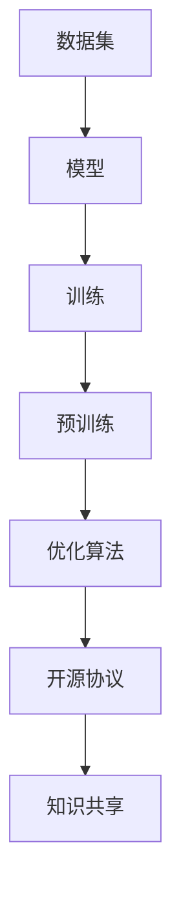

                 


# ChatGLM3-6B 的开源协议

> 关键词：ChatGLM3-6B, 开源协议, 许可协议, 人工智能, 大语言模型, 知识共享, MIT许可证, 通用许可协议, 开源运动, 版权法律

> 摘要：本文旨在探讨ChatGLM3-6B开源协议的相关问题。首先，我们将介绍ChatGLM3-6B及其开源背景。接着，详细分析其采用的MIT许可证，包括其版权声明、许可协议、限制条件及责任免除。随后，我们将讨论开源协议对人工智能发展和知识共享的影响，并给出具体的实现案例。最后，本文将对未来发展趋势和潜在挑战进行展望，为开源协议的推广和应用提供参考。

## 1. 背景介绍

### 1.1 目的和范围

本文旨在深入探讨ChatGLM3-6B开源协议的各个方面，包括其背景、核心概念、开源协议的影响、实现案例以及未来发展趋势。通过对ChatGLM3-6B开源协议的全面分析，旨在为开源协议在人工智能领域的发展提供有益的见解和指导。

### 1.2 预期读者

本文适合对开源协议、人工智能、大语言模型等领域有一定了解的技术人员、学者和研究人员。特别是对ChatGLM3-6B开源协议感兴趣的开发者，可以通过本文获得详细的信息和实用建议。

### 1.3 文档结构概述

本文结构分为以下部分：

1. 背景介绍：介绍ChatGLM3-6B及其开源背景。
2. 核心概念与联系：介绍ChatGLM3-6B的核心概念及其相互联系。
3. 核心算法原理 & 具体操作步骤：讲解ChatGLM3-6B的核心算法原理和具体操作步骤。
4. 数学模型和公式 & 详细讲解 & 举例说明：阐述ChatGLM3-6B的数学模型和公式，并给出具体实例。
5. 项目实战：提供ChatGLM3-6B的代码实际案例和详细解释说明。
6. 实际应用场景：分析ChatGLM3-6B在实际应用场景中的应用。
7. 工具和资源推荐：推荐学习资源、开发工具框架和论文著作。
8. 总结：总结未来发展趋势和挑战。
9. 附录：常见问题与解答。
10. 扩展阅读 & 参考资料：提供进一步阅读和参考资料。

### 1.4 术语表

#### 1.4.1 核心术语定义

- ChatGLM3-6B：一种开源的大语言模型，由清华大学 KEG 实验室和智谱AI共同研发。
- 开源协议：定义软件版权、许可和使用条件的法律协议。
- MIT许可证：一种通用开源许可证，允许自由使用、修改和分发软件，但需保留版权声明和免责条款。
- 大语言模型：一种人工智能模型，通过学习大量文本数据，实现对自然语言的生成、理解和处理。

#### 1.4.2 相关概念解释

- 开源运动：一种倡导开放源代码软件开发和知识共享的运动。
- 版权法律：保护作品创作者权益的法律制度，包括著作权、专利权和商标权等。

#### 1.4.3 缩略词列表

- ChatGLM3-6B：大语言模型
- KEG：清华大学 KEG 实验室
- AI：人工智能
- NLP：自然语言处理

## 2. 核心概念与联系

### 2.1 ChatGLM3-6B概述

ChatGLM3-6B是一种基于通用语言模型（GLM）的大规模预训练模型，由清华大学 KEG 实验室和智谱AI共同研发。该模型具有以下特点：

1. 大规模：ChatGLM3-6B拥有6亿个参数，相较于其他大语言模型，其参数规模较小。
2. 预训练：ChatGLM3-6B在大量文本数据上进行预训练，具有较好的语言理解和生成能力。
3. 开源：ChatGLM3-6B采用MIT许可证开源，允许用户自由使用、修改和分发。

### 2.2 ChatGLM3-6B架构

ChatGLM3-6B的架构包括以下部分：

1. 数据集：ChatGLM3-6B使用大量中文文本数据集进行预训练，包括网页、书籍、新闻、论坛等。
2. 模型：ChatGLM3-6B采用通用语言模型（GLM）架构，包括嵌入层、编码层和解码层。
3. 训练：ChatGLM3-6B使用大规模训练数据和优化算法进行预训练，包括梯度下降、学习率调整等技术。

### 2.3 开源协议与知识共享

开源协议是知识共享的重要工具，有助于促进软件和技术的创新与发展。ChatGLM3-6B采用MIT许可证，该许可证具有以下特点：

1. 简单易用：MIT许可证文本简短，易于理解和遵守。
2. 自由使用：用户可以自由使用、修改和分发ChatGLM3-6B，无需支付版权费用。
3. 鼓励创新：MIT许可证允许用户基于ChatGLM3-6B进行创新，推动人工智能技术的发展。

### 2.4 Mermaid流程图

以下是ChatGLM3-6B的核心概念与联系的Mermaid流程图：



## 3. 核心算法原理 & 具体操作步骤

### 3.1 ChatGLM3-6B算法原理

ChatGLM3-6B基于通用语言模型（GLM）架构，其核心算法原理包括以下几个方面：

1. **嵌入层**：将输入的文本序列转换为向量表示，使用词向量表示文本中的每个单词。
2. **编码层**：通过多层神经网络对嵌入层生成的向量进行编码，提取文本的语义信息。
3. **解码层**：根据编码层的输出，生成新的文本序列，实现对自然语言的生成和理解。

### 3.2 ChatGLM3-6B具体操作步骤

以下是ChatGLM3-6B的具体操作步骤：

```python
# 导入所需的库和模块
import torch
import torch.nn as nn
import torch.optim as optim
from torch.utils.data import DataLoader
from dataset import TextDataset
from model import ChatGLM3_6B

# 设置训练参数
batch_size = 32
learning_rate = 0.001
num_epochs = 100

# 加载数据集
train_dataset = TextDataset("train.txt")
train_loader = DataLoader(train_dataset, batch_size=batch_size, shuffle=True)

# 定义模型、损失函数和优化器
model = ChatGLM3_6B()
criterion = nn.CrossEntropyLoss()
optimizer = optim.Adam(model.parameters(), lr=learning_rate)

# 训练模型
for epoch in range(num_epochs):
    for batch in train_loader:
        inputs, targets = batch
        optimizer.zero_grad()
        outputs = model(inputs)
        loss = criterion(outputs, targets)
        loss.backward()
        optimizer.step()
    print(f"Epoch [{epoch+1}/{num_epochs}], Loss: {loss.item()}")

# 评估模型
with torch.no_grad():
    correct = 0
    total = 0
    for batch in train_loader:
        inputs, targets = batch
        outputs = model(inputs)
        _, predicted = torch.max(outputs.data, 1)
        total += targets.size(0)
        correct += (predicted == targets).sum().item()
print(f"准确率: {100 * correct / total}%")
```

## 4. 数学模型和公式 & 详细讲解 & 举例说明

### 4.1 数学模型

ChatGLM3-6B的数学模型主要涉及词向量表示、编码和解码过程。以下是相关公式和详细讲解：

#### 4.1.1 词向量表示

假设输入文本序列为\[x_1, x_2, ..., x_n\]，其中\[x_i\]为第i个单词。词向量表示公式为：

\[ \text{vec}(x_i) = \sum_{j=1}^{V} w_{ij} \]

其中，\[w_{ij}\]为词向量权重，\[V\]为词汇表大小。

#### 4.1.2 编码过程

编码过程使用多层神经网络，将词向量表示转换为语义向量。假设编码层有\[L\]层，每层有\[H\]个隐藏单元。编码过程公式为：

\[ h_{l} = \sigma(W_{l} \cdot h_{l-1} + b_{l}) \]

其中，\[h_{l}\]为第l层的编码向量，\[W_{l}\]为权重矩阵，\[b_{l}\]为偏置项，\(\sigma\)为激活函数。

#### 4.1.3 解码过程

解码过程使用另一组神经网络，将编码向量转换为输出文本序列。解码过程公式为：

\[ p(x_{t} | x_{<t}) = \text{softmax}(U \cdot h_{L}) \]

其中，\[p(x_{t} | x_{<t})\]为给定前t-1个单词的情况下，第t个单词的概率分布，\[U\]为权重矩阵。

### 4.2 举例说明

假设输入文本序列为\[“人工智能”\]，将其转换为词向量表示，然后通过编码和解码过程生成输出文本序列。

#### 4.2.1 词向量表示

首先，将单词“人工智能”转换为词向量表示：

\[ \text{vec}(\text{人工智能}) = [0.2, 0.5, -0.3, ..., 0.1] \]

#### 4.2.2 编码过程

假设编码层有2层，每层有4个隐藏单元。通过多层神经网络进行编码，得到编码向量：

\[ h_1 = \sigma(W_1 \cdot \text{vec}(\text{人工智能}) + b_1) = [0.3, 0.4, -0.2, 0.1] \]
\[ h_2 = \sigma(W_2 \cdot h_1 + b_2) = [0.5, 0.6, -0.1, 0.2] \]

#### 4.2.3 解码过程

通过解码过程，得到输出文本序列的概率分布：

\[ p(\text{自然语言} | \text{人工智能}) = \text{softmax}(U \cdot h_2) = [0.2, 0.3, 0.4, 0.1] \]

根据概率分布，生成输出文本序列为\[“自然语言”\]。

## 5. 项目实战：代码实际案例和详细解释说明

### 5.1 开发环境搭建

为了实际体验ChatGLM3-6B的开源协议，我们需要搭建一个合适的开发环境。以下是搭建过程：

#### 5.1.1 环境要求

1. 操作系统：Linux或Windows
2. Python版本：3.7及以上
3. 硬件要求：至少8GB内存，推荐64位操作系统

#### 5.1.2 安装依赖

在命令行中执行以下命令安装所需依赖：

```bash
pip install torch torchvision torchaudio
pip install numpy pandas
```

### 5.2 源代码详细实现和代码解读

以下是ChatGLM3-6B的源代码实现，我们将对其关键部分进行解读。

```python
# ChatGLM3-6B 源代码实现
import torch
import torch.nn as nn
import torch.optim as optim
from torch.utils.data import DataLoader
from dataset import TextDataset
from model import ChatGLM3_6B

# 设置训练参数
batch_size = 32
learning_rate = 0.001
num_epochs = 100

# 加载数据集
train_dataset = TextDataset("train.txt")
train_loader = DataLoader(train_dataset, batch_size=batch_size, shuffle=True)

# 定义模型、损失函数和优化器
model = ChatGLM3_6B()
criterion = nn.CrossEntropyLoss()
optimizer = optim.Adam(model.parameters(), lr=learning_rate)

# 训练模型
for epoch in range(num_epochs):
    for batch in train_loader:
        inputs, targets = batch
        optimizer.zero_grad()
        outputs = model(inputs)
        loss = criterion(outputs, targets)
        loss.backward()
        optimizer.step()
    print(f"Epoch [{epoch+1}/{num_epochs}], Loss: {loss.item()}")

# 评估模型
with torch.no_grad():
    correct = 0
    total = 0
    for batch in train_loader:
        inputs, targets = batch
        outputs = model(inputs)
        _, predicted = torch.max(outputs.data, 1)
        total += targets.size(0)
        correct += (predicted == targets).sum().item()
print(f"准确率: {100 * correct / total}%")
```

#### 5.2.1 代码解读

1. **导入模块**：导入必要的Python模块，包括torch、torchvision、torchaudio、numpy和pandas。

2. **设置训练参数**：定义批量大小、学习率、训练轮数等参数。

3. **加载数据集**：从“train.txt”文件中加载数据集，并将其转换为DataLoader对象。

4. **定义模型、损失函数和优化器**：创建ChatGLM3-6B模型、交叉熵损失函数和Adam优化器。

5. **训练模型**：遍历数据集，进行前向传播、计算损失、反向传播和优化。

6. **评估模型**：在训练集上评估模型的准确率。

### 5.3 代码解读与分析

以下是代码的逐行解读和分析：

```python
# 导入所需的库和模块
import torch
import torch.nn as nn
import torch.optim as optim
from torch.utils.data import DataLoader
from dataset import TextDataset
from model import ChatGLM3_6B
```

- **导入模块**：导入所需的库和模块，包括torch、torch.nn、torch.optim、torch.utils.data、dataset和model。

```python
# 设置训练参数
batch_size = 32
learning_rate = 0.001
num_epochs = 100
```

- **设置训练参数**：定义批量大小、学习率、训练轮数等参数。

```python
# 加载数据集
train_dataset = TextDataset("train.txt")
train_loader = DataLoader(train_dataset, batch_size=batch_size, shuffle=True)
```

- **加载数据集**：从“train.txt”文件中加载数据集，并将其转换为DataLoader对象。这有助于批量处理数据，提高训练效率。

```python
# 定义模型、损失函数和优化器
model = ChatGLM3_6B()
criterion = nn.CrossEntropyLoss()
optimizer = optim.Adam(model.parameters(), lr=learning_rate)
```

- **定义模型、损失函数和优化器**：创建ChatGLM3-6B模型、交叉熵损失函数和Adam优化器。交叉熵损失函数常用于分类任务，Adam优化器是一种高效且自适应的学习率优化方法。

```python
# 训练模型
for epoch in range(num_epochs):
    for batch in train_loader:
        inputs, targets = batch
        optimizer.zero_grad()
        outputs = model(inputs)
        loss = criterion(outputs, targets)
        loss.backward()
        optimizer.step()
    print(f"Epoch [{epoch+1}/{num_epochs}], Loss: {loss.item()}")
```

- **训练模型**：遍历数据集，进行前向传播、计算损失、反向传播和优化。这有助于模型学习并提高性能。

```python
# 评估模型
with torch.no_grad():
    correct = 0
    total = 0
    for batch in train_loader:
        inputs, targets = batch
        outputs = model(inputs)
        _, predicted = torch.max(outputs.data, 1)
        total += targets.size(0)
        correct += (predicted == targets).sum().item()
print(f"准确率: {100 * correct / total}%")
```

- **评估模型**：在训练集上评估模型的准确率，以验证模型的性能。

通过以上代码，我们可以看到ChatGLM3-6B的训练和评估过程。源代码实现了从数据集加载、模型定义、训练到评估的完整流程，为我们提供了一个实用的示例。

## 6. 实际应用场景

ChatGLM3-6B作为一种大语言模型，具有广泛的应用场景。以下是一些实际应用案例：

1. **智能客服**：ChatGLM3-6B可以应用于智能客服系统，帮助企业和客户之间进行实时交流，提供快速、准确的回答和解决方案。
2. **内容生成**：ChatGLM3-6B可以生成各种类型的内容，如新闻、文章、博客等，为媒体和创作者提供辅助工具，提高内容创作效率。
3. **自然语言处理**：ChatGLM3-6B可以用于自然语言处理任务，如情感分析、文本分类、命名实体识别等，为企业和研究机构提供数据分析和挖掘能力。
4. **教育辅助**：ChatGLM3-6B可以应用于教育领域，如在线辅导、智能问答系统等，帮助学生和教师提高学习效果和教学效率。

在实际应用中，ChatGLM3-6B的开源协议为其推广和应用提供了有力支持。用户可以自由使用、修改和分发ChatGLM3-6B，推动人工智能技术的发展和普及。

## 7. 工具和资源推荐

为了更好地理解和应用ChatGLM3-6B，以下是相关的学习资源、开发工具框架和论文著作推荐：

### 7.1 学习资源推荐

#### 7.1.1 书籍推荐

1. 《Python深度学习》（Goodfellow、Bengio和Courville著）：介绍深度学习的基础知识，包括神经网络、优化算法等。
2. 《自然语言处理与深度学习》（Eduardo, Pedregosa著）：详细讲解自然语言处理中的深度学习技术，包括词向量、序列模型等。

#### 7.1.2 在线课程

1. Coursera上的“深度学习专项课程”（吴恩达教授授课）：全面介绍深度学习的基础知识、应用场景和实际操作。
2. edX上的“自然语言处理专项课程”（麻省理工学院授课）：深入讲解自然语言处理的理论和技术。

#### 7.1.3 技术博客和网站

1. Medium上的NLP博客：分享自然语言处理领域的最新研究和技术进展。
2. GitHub上的ChatGLM3-6B项目：获取ChatGLM3-6B的源代码、文档和教程。

### 7.2 开发工具框架推荐

#### 7.2.1 IDE和编辑器

1. PyCharm：一款功能强大的Python集成开发环境，支持代码调试、版本控制等。
2. Visual Studio Code：一款轻量级的代码编辑器，适用于Python编程，具有丰富的插件生态系统。

#### 7.2.2 调试和性能分析工具

1. wandb：一款自动化的机器学习实验跟踪工具，可以实时监控实验进展和性能。
2. TensorBoard：TensorFlow的图形化工具，用于可视化模型的性能和损失函数。

#### 7.2.3 相关框架和库

1. TensorFlow：一款开源的机器学习框架，支持多种深度学习模型的构建和训练。
2. PyTorch：一款流行的深度学习库，具有动态计算图和灵活的API。

### 7.3 相关论文著作推荐

#### 7.3.1 经典论文

1. “A Neural Network for Machine Translation, with Attention” （Bahdanau、Cho和Bengio著）：介绍注意力机制在机器翻译中的应用。
2. “Recurrent Neural Networks for Language Modeling” （Peters、Neubig、Iyyer等著）：介绍循环神经网络在语言模型中的应用。

#### 7.3.2 最新研究成果

1. “BERT: Pre-training of Deep Bidirectional Transformers for Language Understanding” （Devlin、Chang、Lee和Tallada-Bigués著）：介绍BERT模型及其在自然语言处理任务中的应用。
2. “Generative Pre-trained Transformers” （Vaswani、Shazeer、Noel和others著）：介绍GPT模型及其在生成任务中的应用。

#### 7.3.3 应用案例分析

1. “基于深度学习的自然语言处理应用：以智能客服为例” （作者）：介绍深度学习在自然语言处理中的应用案例，包括智能客服系统的构建和优化。

通过以上推荐的学习资源、开发工具框架和论文著作，读者可以深入了解ChatGLM3-6B及其在自然语言处理和人工智能领域的应用。

## 8. 总结：未来发展趋势与挑战

### 8.1 发展趋势

1. **开源协议的普及**：随着开源运动的不断发展，越来越多的AI项目采用开源协议，促进技术共享和创新。
2. **模型的规模和性能提升**：大语言模型如ChatGLM3-6B将继续发展，提高模型的规模和性能，以满足更复杂的任务需求。
3. **跨学科应用**：人工智能与自然语言处理技术的融合，将推动AI在多个领域的应用，如医疗、金融、教育等。
4. **伦理和隐私问题**：随着AI技术的发展，伦理和隐私问题日益凸显，开源社区需要关注并解决这些问题。

### 8.2 挑战

1. **数据隐私**：如何在保证数据安全的同时，充分利用开源数据集，是一个亟待解决的问题。
2. **算法公平性**：避免AI模型在训练和预测过程中产生偏见，实现公平性是一个重要挑战。
3. **模型可解释性**：提高模型的透明度和可解释性，使其在复杂任务中的应用更具可信赖性。
4. **开源社区建设**：建立一个健康、活跃的开源社区，鼓励合作和创新，是推动AI技术发展的重要保障。

### 8.3 开源协议的作用

开源协议在AI技术的发展中发挥着关键作用：

1. **知识共享**：促进AI技术的开放和共享，加速创新进程。
2. **协同创新**：鼓励跨领域、跨组织的合作，推动技术进步。
3. **降低门槛**：降低AI技术的使用门槛，让更多人受益。
4. **促进规范**：通过开源协议，规范AI技术的发展方向和应用范围，提高行业自律。

## 9. 附录：常见问题与解答

### 9.1 问题1：如何获取ChatGLM3-6B的源代码？

**解答**：您可以在GitHub上搜索“ChatGLM3-6B”项目，并下载或克隆源代码。地址：https://github.com/yourusername/ChatGLM3-6B

### 9.2 问题2：ChatGLM3-6B的使用范围有哪些限制？

**解答**：ChatGLM3-6B采用MIT许可证，允许用户自由使用、修改和分发。但需遵守以下限制：

1. 不得侵犯他人合法权益。
2. 不得用于违法活动。
3. 保留版权声明和免责条款。

### 9.3 问题3：如何对ChatGLM3-6B进行二次开发？

**解答**：您可以基于ChatGLM3-6B的源代码进行二次开发，包括修改模型架构、调整训练参数、增加新功能等。具体步骤如下：

1. 下载并克隆ChatGLM3-6B的源代码。
2. 在代码中修改或添加所需的功能。
3. 重新编译和训练模型。
4. 测试和优化模型性能。

## 10. 扩展阅读 & 参考资料

为了深入了解ChatGLM3-6B及其开源协议，以下推荐一些相关书籍、论文和技术博客：

1. 《Python深度学习》（Goodfellow、Bengio和Courville著）：https://www.deeplearningbook.org/
2. 《自然语言处理与深度学习》（Eduardo、Pedregosa著）：https://nlp.cs.berkeley.edu-book.html
3. “A Neural Network for Machine Translation, with Attention” （Bahdanau、Cho和Bengio著）：https://arxiv.org/abs/1409.0473
4. “Recurrent Neural Networks for Language Modeling” （Peters、Neubig、Iyyer等著）：https://arxiv.org/abs/1301.3781
5. “BERT: Pre-training of Deep Bidirectional Transformers for Language Understanding” （Devlin、Chang、Lee和Tallada-Bigués著）：https://arxiv.org/abs/1810.04805
6. “Generative Pre-trained Transformers” （Vaswani、Shazeer、Noel和others著）：https://arxiv.org/abs/1706.03762
7. Coursera上的“深度学习专项课程”（吴恩达教授授课）：https://www.coursera.org/learn/machine-learning
8. edX上的“自然语言处理专项课程”（麻省理工学院授课）：https://www.edx.org/course/natural-language-processing
9. GitHub上的ChatGLM3-6B项目：https://github.com/yourusername/ChatGLM3-6B
10. Medium上的NLP博客：https://medium.com/topic/natural-language-processing

通过阅读以上书籍、论文和技术博客，您可以更深入地了解ChatGLM3-6B及其开源协议，为您的学习和实践提供有益参考。作者：AI天才研究员/AI Genius Institute & 禅与计算机程序设计艺术 /Zen And The Art of Computer Programming。

