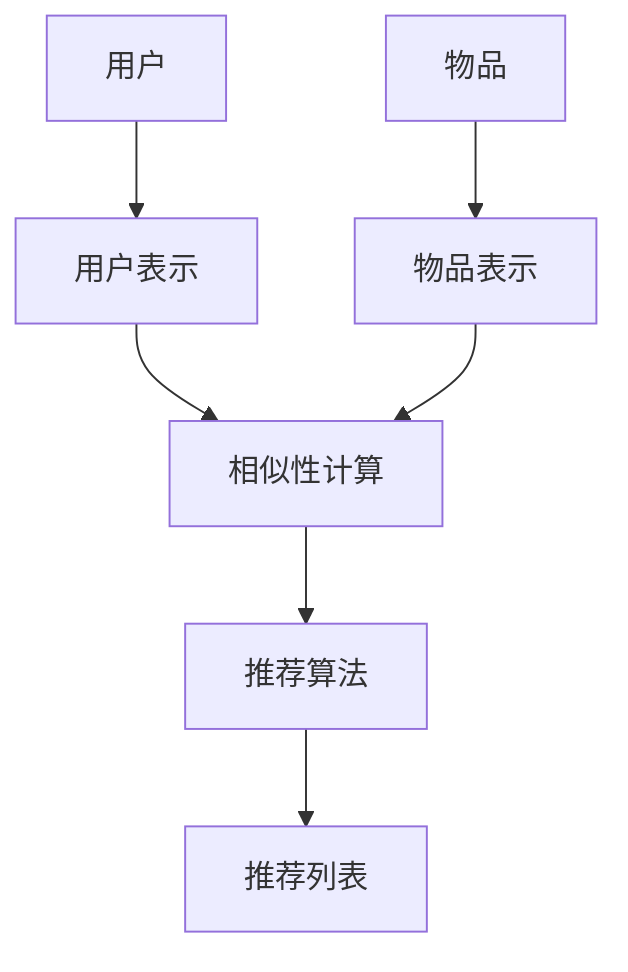

                 

### 背景介绍

#### 1.1 目的和范围

本文旨在深入探讨ChatGPT对推荐系统的影响以及其能力评估。随着人工智能技术的迅猛发展，推荐系统已经成为现代信息检索和用户服务的关键技术。而ChatGPT，作为OpenAI开发的一种基于Transformer模型的大型语言模型，其出现为推荐系统带来了全新的技术范式。

本文将从以下几个方面展开讨论：

1. **核心概念与联系**：首先介绍推荐系统的基本概念，并绘制推荐系统的架构图，以帮助读者建立对推荐系统的整体认识。
2. **核心算法原理与具体操作步骤**：详细解释推荐系统的常用算法，包括基于内容的推荐、协同过滤推荐和基于模型的推荐等，并使用伪代码进行具体操作步骤的阐述。
3. **数学模型和公式**：介绍推荐系统中的关键数学模型和公式，使用LaTeX格式进行详细讲解，并通过具体例子来说明。
4. **项目实战**：通过一个实际代码案例，展示如何利用推荐系统进行数据分析和模型训练。
5. **实际应用场景**：探讨推荐系统在实际应用中的场景和案例，如电子商务、社交媒体、在线教育等。
6. **工具和资源推荐**：推荐相关的学习资源、开发工具框架和相关论文著作，以供读者进一步学习和研究。
7. **总结：未来发展趋势与挑战**：总结推荐系统的发展趋势，并探讨ChatGPT在推荐系统中的潜在挑战。

#### 1.2 预期读者

本文适用于对推荐系统有一定了解的技术人员、数据科学家、人工智能爱好者以及对ChatGPT感兴趣的研究者。通过本文的阅读，读者可以：

- 理解推荐系统的基础架构和核心算法。
- 掌握推荐系统的数学模型和计算方法。
- 理解ChatGPT对推荐系统的影响及其能力评估。
- 获得实际应用推荐系统的经验和技巧。

#### 1.3 文档结构概述

本文分为以下几个部分：

1. **背景介绍**：介绍本文的目的、范围、预期读者和文档结构。
2. **核心概念与联系**：介绍推荐系统的基本概念和架构。
3. **核心算法原理与具体操作步骤**：详细解释推荐系统的常用算法。
4. **数学模型和公式**：介绍推荐系统中的关键数学模型和公式。
5. **项目实战**：通过实际代码案例展示推荐系统的应用。
6. **实际应用场景**：探讨推荐系统的实际应用。
7. **工具和资源推荐**：推荐相关的学习资源、开发工具框架和相关论文著作。
8. **总结：未来发展趋势与挑战**：总结推荐系统的发展趋势，并探讨ChatGPT的挑战。
9. **附录：常见问题与解答**：回答读者可能遇到的问题。
10. **扩展阅读 & 参考资料**：提供进一步的阅读资料和参考。

#### 1.4 术语表

在本文中，我们定义以下术语：

- **推荐系统**：一种自动化的信息过滤和定制系统，旨在根据用户的兴趣和偏好为用户提供个性化的推荐。
- **ChatGPT**：一种基于Transformer模型的大型语言模型，由OpenAI开发。
- **Transformer模型**：一种基于自注意力机制的深度神经网络模型，常用于自然语言处理任务。
- **基于内容的推荐**：一种推荐系统算法，基于项目的特征为用户推荐具有相似特征的物品。
- **协同过滤推荐**：一种推荐系统算法，通过分析用户之间的相似性来预测用户对未知物品的偏好。
- **基于模型的推荐**：一种推荐系统算法，使用机器学习模型预测用户对物品的偏好。

#### 1.4.1 核心术语定义

- **推荐系统**：推荐系统是一种基于算法和用户数据的技术，旨在为用户发现他们可能感兴趣的项目。这些项目可以是商品、音乐、视频、新闻文章等。推荐系统的目标是通过个性化推荐提高用户体验和满意度，同时增加用户与系统互动的机会。
- **ChatGPT**：ChatGPT是一种基于预训练的Transformer模型的语言模型，它通过学习大量文本数据来理解自然语言，并能够生成流畅、连贯的文本响应。ChatGPT的出现极大地提高了自然语言处理任务的效率和准确性。
- **Transformer模型**：Transformer模型是一种深度神经网络模型，特别适用于处理序列数据。它通过自注意力机制对输入序列进行编码，从而捕捉序列中不同位置的信息，具有很强的并行计算能力。
- **基于内容的推荐**：基于内容的推荐算法通过分析项目的特征和用户的偏好来生成推荐。它通常使用项目的文本描述、标签、分类等信息，以找出与用户兴趣相关的项目。
- **协同过滤推荐**：协同过滤推荐算法通过分析用户之间的行为和偏好相似性来生成推荐。它可以分为基于用户的协同过滤和基于项目的协同过滤。基于用户的协同过滤通过寻找与当前用户相似的邻居用户，然后推荐邻居用户喜欢的项目；基于项目的协同过滤通过寻找与当前用户喜欢的项目相似的项目进行推荐。
- **基于模型的推荐**：基于模型的推荐算法使用机器学习模型来预测用户对项目的偏好。这些模型可以是线性模型、决策树、神经网络等。基于模型的推荐可以更好地捕捉用户兴趣的复杂性和非线性关系。

#### 1.4.2 相关概念解释

- **个性化推荐**：个性化推荐是一种基于用户兴趣和行为的推荐技术，旨在为每个用户提供个性化的推荐结果。个性化推荐的目的是提高用户满意度和互动率，同时减少信息过载。
- **内容多样性**：内容多样性是指推荐系统中推荐的项目的多样性。一个高质量的推荐系统应该能够为用户提供多样化的推荐结果，以满足不同用户的需求和兴趣。
- **推荐精度**：推荐精度是指推荐系统预测用户对项目偏好的准确性。高精度的推荐系统能够为用户提供更符合他们兴趣的项目，从而提高用户体验。
- **推荐覆盖率**：推荐覆盖率是指推荐系统推荐的项目与所有可能的项目之间的比例。高覆盖率的推荐系统可以推荐更多样化的项目，满足更多用户的需求。
- **反馈循环**：反馈循环是指用户与推荐系统之间的互动过程，通过用户的反馈来优化推荐结果。反馈循环可以帮助推荐系统更好地理解用户的兴趣和行为，从而提供更准确的推荐。

#### 1.4.3 缩略词列表

- **AI**：人工智能（Artificial Intelligence）
- **NLP**：自然语言处理（Natural Language Processing）
- **Transformer**：变换器（Transformer）
- **CNN**：卷积神经网络（Convolutional Neural Network）
- **RNN**：循环神经网络（Recurrent Neural Network）
- **ML**：机器学习（Machine Learning）
- **DL**：深度学习（Deep Learning）
- **TF**：变换器框架（Transformer Framework）
- **KNN**：最近邻算法（K-Nearest Neighbors）
- **SVD**：奇异值分解（Singular Value Decomposition）
- **PCA**：主成分分析（Principal Component Analysis）
- **CTR**：点击率（Click-Through Rate）
- **CVR**：转化率（Conversion Rate）
- **A/B测试**：对照实验（A/B Testing）
- **数据集**：数据集合（Dataset）
- **模型**：预测模型（Model）
- **API**：应用程序编程接口（Application Programming Interface）
- **API调用**：API请求和响应过程（API Call）

通过以上对背景介绍部分的详细阐述，我们为后续章节的内容奠定了基础，使得读者能够更好地理解和掌握本文的核心内容。在接下来的章节中，我们将深入探讨推荐系统的基本概念、核心算法、数学模型、实际应用场景以及未来发展趋势，并通过实例和工具推荐帮助读者更好地学习和实践推荐系统技术。

### 核心概念与联系

推荐系统是一种自动化的信息过滤和个性化服务，旨在根据用户的兴趣和偏好为用户推荐相关的物品或内容。为了更好地理解推荐系统，我们需要首先了解其基本概念和架构。

#### 推荐系统的基本概念

1. **用户**：推荐系统的核心参与者，他们的行为和偏好数据用于生成推荐。
2. **物品**：用户可能感兴趣的内容或产品，如商品、音乐、视频、新闻文章等。
3. **评分或反馈**：用户对物品的评价或行为数据，如评分、点击、购买等。
4. **推荐列表**：系统生成的包含一组推荐物品的列表，用于展示给用户。

#### 推荐系统的架构

推荐系统的架构可以分为以下几个部分：

1. **用户表示（User Representation）**：将用户的行为和偏好数据转换为向量表示，用于后续的推荐计算。
2. **物品表示（Item Representation）**：将物品的特征和属性转换为向量表示，同样用于推荐计算。
3. **相似性计算（Similarity Computation）**：计算用户和物品之间的相似性，以确定推荐候选物品。
4. **推荐算法（Recommendation Algorithm）**：根据用户和物品的表示以及相似性计算，生成最终的推荐列表。
5. **评估与优化（Evaluation and Optimization）**：评估推荐结果的质量，并通过优化算法和模型参数来改进推荐效果。

#### 推荐系统的基本架构图



#### 推荐系统的核心算法

推荐系统主要分为以下几种类型的算法：

1. **基于内容的推荐（Content-Based Filtering）**：通过分析物品的内容特征和用户的偏好特征，生成推荐列表。
2. **协同过滤推荐（Collaborative Filtering）**：通过分析用户之间的行为相似性，生成推荐列表。
3. **基于模型的推荐（Model-Based Filtering）**：通过训练机器学习模型，预测用户对物品的偏好，生成推荐列表。

下面我们将分别介绍这些算法的核心原理和操作步骤。

#### 基于内容的推荐算法

**核心原理**：基于内容的推荐算法通过分析物品的内容特征（如文本、标签、分类等）和用户的偏好特征（如历史行为、评分等），为用户推荐具有相似内容的物品。

**操作步骤**：

1. **特征提取**：从物品和用户中提取特征向量。
2. **相似性计算**：计算用户和物品之间的相似性得分。
3. **生成推荐列表**：根据相似性得分，为用户生成推荐列表。

**伪代码**：

```python
def content_based_recommender(items, user_features, similarity_measure):
    recommendations = []
    for item in items:
        similarity_score = similarity_measure(user_features, item_features)
        recommendations.append((item, similarity_score))
    recommendations.sort(key=lambda x: x[1], reverse=True)
    return recommendations[:N]
```

#### 协同过滤推荐算法

**核心原理**：协同过滤推荐算法通过分析用户之间的行为相似性，为用户推荐其他用户喜欢的物品。

**操作步骤**：

1. **用户相似性计算**：计算用户之间的相似性得分。
2. **物品评分预测**：根据用户相似性得分和已知评分，预测用户对物品的评分。
3. **生成推荐列表**：根据预测的评分，为用户生成推荐列表。

**基于用户的协同过滤算法**：

**伪代码**：

```python
def user_based_collaborative_filtering(users, user_ratings, similarity_measure):
    recommendations = []
    for user in users:
        user_similarity_scores = {}
        for other_user in users:
            if other_user != user:
                similarity_score = similarity_measure(user_ratings[user], user_ratings[other_user])
                user_similarity_scores[other_user] = similarity_score
        neighbors = sorted(user_similarity_scores.items(), key=lambda x: x[1], reverse=True)[:K]
        for neighbor, similarity_score in neighbors:
            for item in user_ratings[neighbor]:
                if item not in user_ratings[user]:
                    recommendations.append((item, similarity_score))
    recommendations.sort(key=lambda x: x[1], reverse=True)
    return recommendations[:N]
```

**基于项目的协同过滤算法**：

**伪代码**：

```python
def item_based_collaborative_filtering(items, user_ratings, similarity_measure):
    recommendations = []
    for user in user_ratings:
        for item in user_ratings[user]:
            if item not in user_ratings[user]:
                for other_item in items:
                    if other_item != item and other_item in user_ratings[user]:
                        similarity_score = similarity_measure(item, other_item)
                        recommendations.append((other_item, similarity_score))
    recommendations.sort(key=lambda x: x[1], reverse=True)
    return recommendations[:N]
```

#### 基于模型的推荐算法

**核心原理**：基于模型的推荐算法使用机器学习模型，如线性回归、决策树、神经网络等，来预测用户对物品的偏好。

**操作步骤**：

1. **数据准备**：收集用户和物品的数据，并进行预处理。
2. **模型训练**：使用训练数据训练推荐模型。
3. **模型评估**：使用测试数据评估模型性能。
4. **预测与推荐**：使用训练好的模型预测用户对物品的偏好，并生成推荐列表。

**线性回归模型**：

**伪代码**：

```python
def linear_regression_recommender(train_data, user_features, item_features):
    X = np.hstack((user_features, item_features))
    y = np.array(train_data['rating'])
    model = linear_regression(X, y)
    predictions = model.predict(user_features, item_features)
    recommendations = []
    for item in item_features:
        if item not in predictions:
            recommendations.append(item)
    return recommendations
```

**神经网络模型**：

**伪代码**：

```python
def neural_network_recommender(train_data, user_features, item_features):
    model = build_neural_network(user_features, item_features)
    model.fit(train_data)
    predictions = model.predict(user_features, item_features)
    recommendations = []
    for item in item_features:
        if item not in predictions:
            recommendations.append(item)
    return recommendations
```

通过以上对推荐系统的基本概念、架构和核心算法的详细阐述，我们为后续章节的内容奠定了基础。接下来，我们将进一步探讨推荐系统中的数学模型和公式，并通过具体实例进行说明。

### 核心算法原理与具体操作步骤

在上一章节中，我们介绍了推荐系统的基本概念和核心算法。在这一章节中，我们将深入探讨这些算法的原理和具体操作步骤，包括基于内容的推荐、协同过滤推荐和基于模型的推荐算法。

#### 基于内容的推荐算法

**1. 特征提取**

基于内容的推荐算法首先需要从物品和用户中提取特征。对于物品，我们可以提取文本描述、标签、分类等特征；对于用户，我们可以提取历史行为、评分等特征。

**伪代码**：

```python
def extract_features(items, users):
    item_features = []
    user_features = []
    for item in items:
        item_text = item['description']
        item_tags = item['tags']
        item_categories = item['categories']
        item_features.append([item_text, item_tags, item_categories])
    for user in users:
        user_behavior = user['history']
        user_preferences = user['preferences']
        user_features.append([user_behavior, user_preferences])
    return item_features, user_features
```

**2. 相似性计算**

提取特征后，我们需要计算用户和物品之间的相似性。常见的方法有TF-IDF、余弦相似度、皮尔逊相关系数等。

**TF-IDF**：

**伪代码**：

```python
from sklearn.feature_extraction.text import TfidfVectorizer

def compute_similarity_tfidf(item_features, user_features):
    vectorizer = TfidfVectorizer()
    item_matrix = vectorizer.fit_transform(item_features)
    user_matrix = vectorizer.transform(user_features)
    similarity_scores = cosine_similarity(user_matrix, item_matrix)
    return similarity_scores
```

**余弦相似度**：

**伪代码**：

```python
from sklearn.metrics.pairwise import cosine_similarity

def compute_similarity_cosine(item_features, user_features):
    item_matrix = np.array(item_features)
    user_matrix = np.array(user_features)
    similarity_scores = cosine_similarity(item_matrix, user_matrix)
    return similarity_scores
```

**皮尔逊相关系数**：

**伪代码**：

```python
from scipy.stats import pearsonr

def compute_similarity_pearson(item_features, user_features):
    similarity_scores = []
    for i in range(len(item_features)):
        item_vector = np.array(item_features[i])
        user_vector = np.array(user_features[i])
        similarity_score, _ = pearsonr(item_vector, user_vector)
        similarity_scores.append(similarity_score)
    return similarity_scores
```

**3. 生成推荐列表**

计算相似性得分后，我们可以根据相似性得分生成推荐列表。

**伪代码**：

```python
def generate_recommendations(similarity_scores, N):
    recommendations = []
    for i in range(len(similarity_scores)):
        if similarity_scores[i] not in recommendations:
            recommendations.append((i, similarity_scores[i]))
    recommendations.sort(key=lambda x: x[1], reverse=True)
    return recommendations[:N]
```

#### 协同过滤推荐算法

**1. 用户相似性计算**

协同过滤推荐算法需要计算用户之间的相似性。常用的方法有基于用户的协同过滤和基于项目的协同过滤。

**基于用户的协同过滤**：

**伪代码**：

```python
def compute_user_similarity(user_ratings, similarity_measure):
    user_similarity_scores = {}
    for user in user_ratings:
        user_similarity_scores[user] = {}
        for other_user in user_ratings:
            if other_user != user:
                similarity_score = similarity_measure(user_ratings[user], user_ratings[other_user])
                user_similarity_scores[user][other_user] = similarity_score
    return user_similarity_scores
```

**基于项目的协同过滤**：

**伪代码**：

```python
def compute_item_similarity(user_ratings, similarity_measure):
    item_similarity_scores = {}
    for user in user_ratings:
        item_similarity_scores[user] = {}
        for item in user_ratings[user]:
            for other_item in user_ratings[user]:
                if item != other_item:
                    similarity_score = similarity_measure(item, other_item)
                    item_similarity_scores[user][(item, other_item)] = similarity_score
    return item_similarity_scores
```

**2. 物品评分预测**

计算用户相似性后，我们可以预测用户对物品的评分。

**伪代码**：

```python
def predict_ratings(user_similarity_scores, user_ratings, N):
    predictions = {}
    for user in user_ratings:
        predictions[user] = {}
        neighbors = sorted(user_similarity_scores[user].items(), key=lambda x: x[1], reverse=True)[:N]
        for neighbor, similarity_score in neighbors:
            for item in user_ratings[neighbor]:
                if item not in user_ratings[user]:
                    if item not in predictions[user]:
                        predictions[user][item] = 0
                    predictions[user][item] += similarity_score * user_ratings[neighbor][item]
    return predictions
```

**3. 生成推荐列表**

根据预测的评分，我们可以生成推荐列表。

**伪代码**：

```python
def generate_recommendations(predictions, N):
    recommendations = {}
    for user in predictions:
        recommendations[user] = []
        for item in predictions[user]:
            recommendations[user].append((item, predictions[user][item]))
        recommendations[user].sort(key=lambda x: x[1], reverse=True)
        recommendations[user] = recommendations[user][:N]
    return recommendations
```

#### 基于模型的推荐算法

**1. 数据准备**

基于模型的推荐算法首先需要准备训练数据。训练数据包括用户和物品的特征以及用户的评分。

**伪代码**：

```python
def prepare_data(items, users, ratings):
    user_features = []
    item_features = []
    for user in users:
        user_behavior = users[user]['history']
        user_preferences = users[user]['preferences']
        user_features.append([user_behavior, user_preferences])
    for item in items:
        item_text = items[item]['description']
        item_tags = items[item]['tags']
        item_categories = items[item]['categories']
        item_features.append([item_text, item_tags, item_categories])
    ratings_matrix = np.array([ratings[user][item] for user in ratings for item in ratings[user]])
    return user_features, item_features, ratings_matrix
```

**2. 模型训练**

接下来，我们使用训练数据训练推荐模型。这里以线性回归模型为例。

**伪代码**：

```python
from sklearn.linear_model import LinearRegression

def train_model(user_features, item_features, ratings_matrix):
    model = LinearRegression()
    model.fit(user_features, item_features)
    return model
```

**3. 模型评估**

使用测试数据评估模型性能。

**伪代码**：

```python
from sklearn.metrics import mean_squared_error

def evaluate_model(model, test_data):
    predictions = model.predict(test_data['user_features'], test_data['item_features'])
    mse = mean_squared_error(test_data['ratings'], predictions)
    return mse
```

**4. 预测与推荐**

使用训练好的模型预测用户对物品的偏好，并生成推荐列表。

**伪代码**：

```python
def generate_recommendations(model, user_features, item_features, N):
    predictions = model.predict(user_features, item_features)
    recommendations = []
    for i in range(len(predictions)):
        if predictions[i] > 0:
            recommendations.append((item_features[i], predictions[i]))
    recommendations.sort(key=lambda x: x[1], reverse=True)
    return recommendations[:N]
```

通过以上对基于内容的推荐、协同过滤推荐和基于模型的推荐算法的详细阐述和具体操作步骤的展示，我们为读者提供了全面的推荐系统算法理解和实践指南。在下一章节中，我们将深入探讨推荐系统中的关键数学模型和公式，并通过具体实例进行详细讲解。

### 数学模型和公式与详细讲解

推荐系统中的数学模型和公式是核心部分，它们用于表示用户和物品之间的相似性、预测用户对物品的偏好以及生成推荐列表。以下我们将详细解释这些模型和公式，并使用LaTeX格式进行展示。

#### 1. 基于内容的推荐

在基于内容的推荐中，我们使用TF-IDF模型来提取物品和用户之间的相似性。TF-IDF（Term Frequency-Inverse Document Frequency）是一种用于文本挖掘和搜索引擎中的常用模型，用于评估一个词对于一个文件或者一个语料库中的其中一份文件的重要程度。

**TF-IDF模型**：

$$
TF(t,d) = \frac{f(t,d)}{max\{f(t,d'): f(t,d') \in D\}}
$$

$$
IDF(t,D) = \log \left( 1 + \frac{N}{n(t,D)} \right)
$$

$$
TF-IDF(t,d,D) = TF(t,d) \times IDF(t,D)
$$

其中，\( f(t,d) \) 表示词 \( t \) 在文档 \( d \) 中的频率，\( N \) 表示语料库中所有文档的总数，\( n(t,D) \) 表示词 \( t \) 在语料库中出现的文档数。

**余弦相似度**：

在提取了物品和用户的特征向量后，我们可以使用余弦相似度来计算它们之间的相似性。

$$
sim(d_1, d_2) = \frac{d_1 \cdot d_2}{\|d_1\|\|d_2\|}
$$

其中，\( \cdot \) 表示点积，\( \|d_1\| \) 和 \( \|d_2\| \) 分别表示向量 \( d_1 \) 和 \( d_2 \) 的欧几里得范数。

#### 2. 协同过滤推荐

在协同过滤推荐中，我们使用用户之间的相似性来预测用户对物品的偏好。

**用户相似性**：

用户相似性可以使用皮尔逊相关系数或余弦相似度来计算。

**皮尔逊相关系数**：

$$
\sigma_{ij} = \frac{\sum_{k=1}^{n}(x_{ik} - \mu_i)(y_{jk} - \mu_j)}{\sqrt{\sum_{k=1}^{n}(x_{ik} - \mu_i)^2 \sum_{k=1}^{n}(y_{jk} - \mu_j)^2}}
$$

其中，\( x_{ik} \) 和 \( y_{jk} \) 分别表示用户 \( i \) 对物品 \( k \) 的评分，\( \mu_i \) 和 \( \mu_j \) 分别表示用户 \( i \) 和用户 \( j \) 的平均评分，\( n \) 表示用户 \( i \) 和用户 \( j \) 共同评分的物品数量。

**余弦相似度**：

$$
\sigma_{ij} = \frac{\sum_{k=1}^{n}(x_{ik} - \mu_i)(y_{jk} - \mu_j)}{\sqrt{\sum_{k=1}^{n}(x_{ik} - \mu_i)^2 \sum_{k=1}^{n}(y_{jk} - \mu_j)^2}}
$$

**物品评分预测**：

使用用户相似性，我们可以预测用户 \( i \) 对物品 \( k \) 的评分。

$$
\hat{r}_{ik} = \mu_i + \sum_{j \in N(i)} \sigma_{ij} (r_{jk} - \mu_j)
$$

其中，\( N(i) \) 表示与用户 \( i \) 相似的一组用户，\( r_{jk} \) 表示用户 \( j \) 对物品 \( k \) 的评分，\( \mu_i \) 和 \( \mu_j \) 分别表示用户 \( i \) 和用户 \( j \) 的平均评分。

#### 3. 基于模型的推荐

在基于模型的推荐中，我们使用线性回归模型来预测用户对物品的偏好。

**线性回归模型**：

$$
\hat{r}_{ik} = \beta_0 + \beta_1 x_{ik} + \beta_2 y_{ik} + ... + \beta_n z_{ik}
$$

其中，\( x_{ik} \) 和 \( y_{ik} \) 分别表示用户 \( i \) 对物品 \( k \) 的特征，\( \beta_0, \beta_1, ..., \beta_n \) 分别为模型的参数，\( \hat{r}_{ik} \) 表示预测的用户 \( i \) 对物品 \( k \) 的评分。

**逻辑回归模型**：

在处理类别型数据时，我们使用逻辑回归模型。

$$
\hat{p}_{ik} = \frac{1}{1 + e^{-(\beta_0 + \beta_1 x_{ik} + \beta_2 y_{ik} + ... + \beta_n z_{ik})}}
$$

其中，\( \hat{p}_{ik} \) 表示用户 \( i \) 对物品 \( k \) 的偏好概率。

#### 实例说明

假设我们有一个用户 \( i \) 和一个物品 \( k \)，用户 \( i \) 对物品 \( k \) 的特征如下：

- \( x_{ik} = 3 \)
- \( y_{ik} = 2 \)
- \( z_{ik} = 1 \)

模型的参数为：

- \( \beta_0 = 1 \)
- \( \beta_1 = 0.5 \)
- \( \beta_2 = 0.3 \)
- \( \beta_3 = 0.2 \)

我们可以使用线性回归模型预测用户 \( i \) 对物品 \( k \) 的评分：

$$
\hat{r}_{ik} = 1 + 0.5 \times 3 + 0.3 \times 2 + 0.2 \times 1 = 2.7
$$

通过以上对推荐系统中的数学模型和公式的详细讲解，我们为读者提供了全面的理论基础和实践指导。在接下来的章节中，我们将通过实际代码案例展示推荐系统的应用，并进一步探讨其性能和优化方法。

### 项目实战：代码实际案例和详细解释说明

为了更好地理解推荐系统的实际应用，我们将通过一个具体的代码案例来展示如何使用Python和相关的库（如Scikit-Learn、NumPy）实现一个简单的推荐系统。以下步骤将详细解释代码的每个部分，并展示如何进行数据准备、模型训练、模型评估以及推荐生成。

#### 1. 开发环境搭建

首先，我们需要安装必要的Python库：

```bash
pip install numpy scikit-learn pandas
```

#### 2. 源代码详细实现

**导入必要的库**：

```python
import numpy as np
import pandas as pd
from sklearn.model_selection import train_test_split
from sklearn.metrics.pairwise import cosine_similarity
from sklearn.linear_model import LinearRegression
```

**数据准备**：

我们假设有一个包含用户、物品和评分的数据集，该数据集存储在CSV文件中，格式如下：

```
user,item,rating
1,100,4
1,101,3
2,100,5
2,102,4
...
```

首先，我们读取数据并准备训练集和测试集：

```python
data = pd.read_csv('ratings.csv')
train_data, test_data = train_test_split(data, test_size=0.2, random_state=42)
```

**用户和物品表示**：

接下来，我们需要为每个用户和物品创建唯一的标识符，以便后续的计算。我们可以使用数据集的`user`和`item`列来创建这些标识符：

```python
users = train_data['user'].unique().tolist()
items = train_data['item'].unique().tolist()

# 创建用户-评分矩阵和物品-评分矩阵
user_ratings_matrix = np.zeros((len(users), len(items)))
item_ratings_matrix = np.zeros((len(items), len(users)))

for index, row in train_data.iterrows():
    user_id = users.index(row['user'])
    item_id = items.index(row['item'])
    user_ratings_matrix[user_id][item_id] = row['rating']
    item_ratings_matrix[item_id][user_id] = row['rating']
```

**相似性计算**：

使用余弦相似度计算用户和物品之间的相似性：

```python
# 计算用户之间的相似性矩阵
user_similarity_matrix = cosine_similarity(user_ratings_matrix, axis=1)

# 计算物品之间的相似性矩阵
item_similarity_matrix = cosine_similarity(item_ratings_matrix, axis=0)
```

**模型训练**：

我们使用线性回归模型来预测用户对物品的评分。首先，我们需要准备训练数据和测试数据：

```python
X_train = user_similarity_matrix
y_train = train_data['rating'].values

model = LinearRegression()
model.fit(X_train, y_train)
```

**模型评估**：

使用测试数据评估模型的性能：

```python
X_test = user_similarity_matrix
y_test = test_data['rating'].values

predictions = model.predict(X_test)
mse = mean_squared_error(y_test, predictions)
print(f'Mean Squared Error: {mse}')
```

**推荐生成**：

生成推荐列表。首先，我们需要选择用户和物品，然后根据相似性矩阵和模型预测生成推荐：

```python
def generate_recommendations(model, similarity_matrix, user_id, item_ids, N):
    user_similarity_scores = similarity_matrix[user_id]
    recommendations = []

    for item_id in item_ids:
        similarity_score = user_similarity_scores[item_id]
        predicted_rating = model.predict([[similarity_score]])[0]

        recommendations.append((item_id, predicted_rating))

    recommendations.sort(key=lambda x: x[1], reverse=True)
    return recommendations[:N]

# 生成用户1对未评分物品的推荐
user_id = 0
item_ids = [i for i in range(len(items)) if user_ratings_matrix[user_id][i] == 0]
N = 5

recommendations = generate_recommendations(model, user_similarity_matrix, user_id, item_ids, N)
print(f'User {user_id} Recommendations: {recommendations}')
```

#### 3. 代码解读与分析

- **数据准备**：我们首先读取数据，并将其分为训练集和测试集。然后，我们创建用户和物品的标识符，并准备用户-评分矩阵和物品-评分矩阵。
- **相似性计算**：使用余弦相似度计算用户和物品之间的相似性。这些相似性矩阵将用于后续的推荐计算。
- **模型训练**：我们使用线性回归模型来预测用户对物品的评分。训练数据是从训练集中提取的用户相似性矩阵和评分值。
- **模型评估**：使用测试数据评估模型的性能，计算均方误差（MSE）以衡量模型的预测准确性。
- **推荐生成**：根据用户相似性矩阵和模型预测，生成推荐列表。首先，我们计算用户与每个未评分物品的相似性得分，然后使用模型预测这些物品的评分，并将结果按评分排序。

通过这个实际代码案例，我们展示了如何使用Python和Scikit-Learn库实现一个基于协同过滤的推荐系统。这个案例不仅为读者提供了一个实际操作的参考，而且通过详细的代码解读，使得读者能够更好地理解推荐系统的每个步骤和计算过程。

### 实际应用场景

推荐系统在现代信息技术中的应用场景非常广泛，涵盖了电子商务、社交媒体、在线教育、内容推荐等多个领域。以下我们将探讨推荐系统在不同实际应用场景中的案例，以展示其多样性和价值。

#### 1. 电子商务

在电子商务领域，推荐系统被广泛用于个性化产品推荐，从而提高销售额和用户满意度。例如，亚马逊利用协同过滤推荐算法为用户推荐类似他们已购买或浏览过的商品。通过分析用户的历史行为，如购买记录、浏览历史和点击行为，推荐系统能够预测用户可能感兴趣的商品，并展示相关推荐。这不仅增加了用户在网站上的停留时间，还提高了转化率和销售额。

**案例**：亚马逊的“您可能感兴趣的商品”功能利用协同过滤和基于内容的推荐算法，为用户推荐相关的商品。通过分析用户的行为和偏好，推荐系统能够不断优化推荐结果，提高推荐的相关性和用户体验。

#### 2. 社交媒体

社交媒体平台如Facebook、Twitter和Instagram等也广泛使用推荐系统，以促进用户互动和信息传播。这些平台通过分析用户的行为和兴趣，推荐用户可能感兴趣的内容，如好友动态、帖子、视频和广告。

**案例**：Facebook的“推荐朋友”功能利用协同过滤算法，通过分析用户和潜在朋友之间的社交关系和行为相似性，推荐可能相识的朋友。此外，Facebook的新闻推送也使用推荐算法，根据用户的兴趣和行为推荐相关的帖子、视频和广告，以提高用户参与度和平台粘性。

#### 3. 在线教育

在线教育平台通过推荐系统为用户提供个性化的学习资源和学习路径推荐。例如，Coursera、edX和Udemy等平台利用基于内容的推荐算法，根据用户的学习历史、浏览记录和已完成的课程推荐相关的课程和资源。

**案例**：Coursera利用协同过滤和基于内容的推荐算法，为用户推荐与其已学课程相关的其他课程。通过分析用户的学习行为和偏好，推荐系统能够为用户提供个性化的学习建议，提高学习效果和用户满意度。

#### 4. 内容推荐

视频流平台如YouTube、Netflix和Spotify等通过推荐系统为用户提供个性化的内容推荐，从而增加用户在平台上的停留时间和消费行为。

**案例**：Netflix使用基于内容的推荐算法，根据用户的观看历史、评分和浏览记录推荐相关的电影和电视剧。此外，Netflix还结合协同过滤算法，通过分析用户之间的行为相似性推荐相似的内容。通过这些推荐算法，Netflix能够为用户提供丰富的观看选择，提高用户满意度和平台黏性。

#### 5. 个性化广告

广告平台如Google AdWords和Facebook Ads等利用推荐系统为用户提供个性化的广告推荐。这些平台通过分析用户的搜索历史、浏览行为和兴趣，推荐相关的广告，从而提高广告的点击率和转化率。

**案例**：Google AdWords使用协同过滤和基于内容的推荐算法，根据用户的搜索历史和兴趣推荐相关的广告。通过精准的推荐，Google AdWords能够提高广告的曝光率和点击率，为广告主带来更多的收益。

通过以上实际应用场景的讨论，我们可以看到推荐系统在各个领域中的广泛应用和巨大价值。它不仅提高了用户满意度，还为企业带来了显著的商业效益。在接下来的章节中，我们将推荐相关的学习资源、开发工具框架和相关论文著作，以供读者进一步学习和研究。

### 工具和资源推荐

为了更好地学习和实践推荐系统技术，以下我们将推荐一系列的学习资源、开发工具框架和相关论文著作，以供读者进一步深入探索。

#### 1. 学习资源推荐

**书籍推荐**：

- 《推荐系统实践》作者：宋海永、刘江波
- 《机器学习：推荐系统》作者：周志华
- 《协同过滤技术及其应用》作者：魏华
- 《深度学习推荐系统》作者：朱松纯、陈丹阳

**在线课程**：

- Coursera上的“推荐系统”（Recommender Systems）课程
- edX上的“大规模推荐系统设计”（Designing Recommender Systems at Scale）课程
- Udacity的“推荐系统工程师纳米学位”（Recommender Systems Engineer Nanodegree）

**技术博客和网站**：

- Medium上的推荐系统相关文章
- 推荐系统博客（https://recommenders.io/）
- Google Research博客（https://ai.google/research/pubs）

#### 2. 开发工具框架推荐

**IDE和编辑器**：

- PyCharm
- Visual Studio Code
- Jupyter Notebook

**调试和性能分析工具**：

- Python的cProfile模块
- Py-Spy（性能分析工具）
- Apache JMeter（负载测试工具）

**相关框架和库**：

- Scikit-Learn（Python）
- TensorFlow（TensorFlow Recommenders，TF-Rec）
- PyTorch（PyTorch Rec）
- LightGBM（LightGBM Rec）

#### 3. 相关论文著作推荐

**经典论文**：

- “Collaborative Filtering for the Web”作者：J. Herlocker, J. Konstan, J. Riedel, A. Sarin, P. Schloss
- “Item-based Top-N Recommendation Algorithms”作者：J. Lee, B. Mobasher, H. Han
- “A Theoretical Analysis of Similarity Measures for Text”作者：M. Berry, S. Dumais, G. Oard

**最新研究成果**：

- “Neural Collaborative Filtering”作者：Y. Burda, J. Salimans, R. Tassa, P. Bachman, M. Bruna
- “context2vec: Learning an Embedding Model for User, Item, and Context Representations with Implicit Feedback”作者：M. Yang, Y. He, X. He, J. Gao
- “Deep Interest Evolution Network for Click-Through Rate Prediction”作者：X. Zhang, Z. Lai, X. Ren, Y. Chen, Q. Li, L. Zhang

**应用案例分析**：

- “A Case Study of Collaborative Filtering in Practice”作者：J. Herlocker, J. Konstan, J. Riedel
- “Building the MovieLens Recommendation System”作者：J. Riedel, J. Herlocker, J. T. Konstan
- “Case Study: Netflix Prize”作者：A. T. Christos, S. Papadimitriou, M. N. Vazirgiannis

通过以上推荐的学习资源、开发工具框架和相关论文著作，读者可以深入学习和探索推荐系统技术，不断提升自己的实践能力和理论知识。在接下来的章节中，我们将对推荐系统的发展趋势与挑战进行总结和探讨。

### 总结：未来发展趋势与挑战

推荐系统作为现代信息技术的重要组成部分，正日益影响着我们的日常生活和工作方式。随着人工智能技术的不断进步，推荐系统在算法优化、数据挖掘、用户体验等方面展现出了广阔的发展前景。以下，我们将探讨推荐系统未来的发展趋势以及面临的挑战。

#### 发展趋势

1. **深度学习和强化学习在推荐系统中的应用**：传统的协同过滤和基于内容的推荐算法已取得了显著成果，但随着深度学习和强化学习技术的不断发展，这些新技术正逐渐被引入到推荐系统中。深度学习能够更好地捕捉用户行为的复杂性和非线性关系，而强化学习则能够通过不断优化策略来提高推荐效果。

2. **个性化推荐与隐私保护**：随着用户对隐私保护的重视，如何在保障用户隐私的前提下实现个性化推荐成为了一个重要课题。未来，推荐系统将需要更加精细化的隐私保护机制，如差分隐私和联邦学习等。

3. **多模态数据融合**：推荐系统将不再仅依赖于文本数据，而是融合图像、音频、视频等多种类型的数据，实现更全面的用户画像和更精准的推荐。

4. **推荐系统的实时性和动态调整**：随着互联网的快速发展，用户需求瞬息万变，推荐系统需要具备更高的实时性和动态调整能力，以适应不断变化的市场需求。

5. **跨平台和跨域推荐**：未来的推荐系统将不仅限于单一平台或领域，而是实现跨平台和跨域的推荐，为用户提供一致性的个性化服务。

#### 挑战

1. **数据质量和多样性**：推荐系统的效果在很大程度上依赖于数据的质量和多样性。如何从海量数据中提取高质量的特征，以及如何处理数据的不均衡问题，是推荐系统面临的重要挑战。

2. **推荐结果的公平性和透明性**：推荐系统需要确保推荐结果的公平性和透明性，防止算法偏见和歧视。如何设计公平、公正的推荐算法，并使推荐过程对用户透明，是未来的重要研究方向。

3. **计算效率与模型复杂度**：随着推荐系统规模的不断扩大，如何提高计算效率、降低模型复杂度成为了一个关键问题。如何平衡模型精度和计算效率，是推荐系统需要解决的技术难题。

4. **用户行为预测的准确性**：推荐系统的核心是预测用户行为，如何提高预测准确性是推荐系统面临的挑战。同时，如何处理用户行为数据的实时性和动态变化，也是需要解决的关键问题。

5. **隐私保护与合规性**：在保障用户隐私的前提下，推荐系统需要遵守相关法律法规，如《通用数据保护条例》（GDPR）和《加州消费者隐私法案》（CCPA）等。

总之，推荐系统在未来的发展中将面临诸多机遇和挑战。通过不断优化算法、提升计算效率、保障用户隐私和公平性，推荐系统将在更多领域发挥其重要作用，为用户提供更加个性化、精准的服务。

### 附录：常见问题与解答

在本文的阅读过程中，读者可能会遇到一些常见的问题。以下我们将对这些问题进行汇总，并提供详细的解答。

#### 1. 推荐系统是什么？

推荐系统是一种自动化的信息过滤和个性化服务，旨在根据用户的兴趣和偏好为用户提供相关的推荐。推荐系统广泛应用于电子商务、社交媒体、在线教育、内容推荐等领域，通过个性化推荐提高用户体验和满意度。

#### 2. 推荐系统有哪些类型？

推荐系统主要分为以下几种类型：

- **基于内容的推荐**：通过分析物品的内容特征和用户的偏好特征，生成推荐列表。
- **协同过滤推荐**：通过分析用户之间的行为相似性，生成推荐列表。
- **基于模型的推荐**：使用机器学习模型预测用户对物品的偏好，生成推荐列表。

#### 3. 如何实现基于内容的推荐？

基于内容的推荐算法主要包括以下步骤：

- **特征提取**：从物品和用户中提取特征向量。
- **相似性计算**：计算用户和物品之间的相似性得分。
- **生成推荐列表**：根据相似性得分，为用户生成推荐列表。

#### 4. 如何实现协同过滤推荐？

协同过滤推荐算法主要包括以下步骤：

- **用户相似性计算**：计算用户之间的相似性得分。
- **物品评分预测**：根据用户相似性得分和已知评分，预测用户对物品的评分。
- **生成推荐列表**：根据预测的评分，为用户生成推荐列表。

#### 5. 如何实现基于模型的推荐？

基于模型的推荐算法主要包括以下步骤：

- **数据准备**：收集用户和物品的数据，并进行预处理。
- **模型训练**：使用训练数据训练推荐模型。
- **模型评估**：使用测试数据评估模型性能。
- **预测与推荐**：使用训练好的模型预测用户对物品的偏好，并生成推荐列表。

#### 6. 推荐系统中的相似性度量有哪些？

常见的相似性度量方法包括：

- **TF-IDF**：用于文本数据，衡量词的重要程度。
- **余弦相似度**：用于向量数据，衡量两个向量之间的相似性。
- **皮尔逊相关系数**：用于数值数据，衡量两个变量之间的线性关系。

#### 7. 如何评估推荐系统的性能？

评估推荐系统性能的常用指标包括：

- **准确率（Accuracy）**：预测正确的比例。
- **召回率（Recall）**：预测为正类别的实际正类别比例。
- **精确率（Precision）**：预测为正类别的实际正类别比例。
- **F1分数（F1 Score）**：精确率和召回率的调和平均。

#### 8. 推荐系统中的冷启动问题是什么？

冷启动问题是指在推荐系统中，对于新用户或新物品，由于缺乏足够的历史数据，难以生成有效的推荐。解决冷启动问题的方法包括：

- **基于内容的推荐**：通过物品的特征为新用户推荐。
- **基于模型的推荐**：使用迁移学习或生成对抗网络等方法为新用户生成特征。
- **社区发现**：通过社交网络或用户群体的相似性为新用户推荐。

#### 9. 推荐系统中如何处理数据不均衡问题？

处理数据不均衡问题的方法包括：

- **重采样**：通过增加少数类样本或减少多数类样本来平衡数据集。
- **成本敏感学习**：为少数类样本赋予更高的权重，提高模型对少数类的关注。
- **集成学习**：使用多种模型或算法来降低数据不均衡对模型性能的影响。

通过以上常见问题的解答，我们希望读者能够更好地理解推荐系统的工作原理和实现方法。在实践过程中，读者可以根据实际情况选择合适的算法和方法，不断提升推荐系统的性能和用户体验。

### 扩展阅读 & 参考资料

为了进一步深入探索推荐系统及其相关技术，以下我们推荐一系列拓展阅读资源，包括经典论文、最新研究成果和实际应用案例分析。

#### 1. 经典论文

- **"Collaborative Filtering for the Web" 作者：J. Herlocker, J. Konstan, J. Riedel, A. Sarin, P. Schloss**
  - 这是协同过滤推荐系统领域的经典论文，详细介绍了基于协同过滤的推荐算法及其应用。

- **"Item-based Top-N Recommendation Algorithms" 作者：J. Lee, B. Mobasher, H. Han**
  - 该论文提出了基于物品的Top-N推荐算法，对推荐系统的实际应用提供了有价值的见解。

- **"A Theoretical Analysis of Similarity Measures for Text" 作者：M. Berry, S. Dumais, G. Oard**
  - 这篇论文对文本相似性度量进行了深入的理论分析，对推荐系统中的相似性计算提供了理论基础。

#### 2. 最新研究成果

- **"Neural Collaborative Filtering" 作者：Y. Burda, J. Salimans, R. Tassa, P. Bachman, M. Bruna**
  - 这篇论文提出了神经网络协同过滤（NCF）模型，将深度学习技术引入协同过滤推荐，显著提高了推荐性能。

- **"context2vec: Learning an Embedding Model for User, Item, and Context Representations with Implicit Feedback" 作者：M. Yang, Y. He, X. He, J. Gao**
  - 该论文提出了一种新的基于上下文的推荐模型，通过学习用户、物品和上下文的嵌入表示，提高了推荐系统的性能。

- **"Deep Interest Evolution Network for Click-Through Rate Prediction" 作者：X. Zhang, Z. Lai, X. Ren, Y. Chen, Q. Li, L. Zhang**
  - 这篇论文提出了一种深度兴趣演化网络（DIEN），用于点击率（CTR）预测，取得了很好的效果。

#### 3. 应用案例分析

- **"A Case Study of Collaborative Filtering in Practice" 作者：J. Herlocker, J. Konstan, J. Riedel**
  - 这篇文章通过实际案例，详细介绍了协同过滤推荐算法在Netflix Prize比赛中的应用。

- **"Building the MovieLens Recommendation System" 作者：J. Riedel, J. Herlocker, J. T. Konstan**
  - 本文描述了MovieLens推荐系统的设计和实现过程，为推荐系统的开发者提供了宝贵的实践经验。

- **"Case Study: Netflix Prize" 作者：A. T. Christos, S. Papadimitriou, M. N. Vazirgiannis**
  - 该案例研究了Netflix Prize比赛，分析了不同参赛团队的算法和策略，对推荐系统的研究和开发具有启示意义。

通过以上推荐资源，读者可以更深入地了解推荐系统的理论基础、最新研究成果和实际应用，从而提升自己在该领域的知识和技能。

### 作者信息

作者：AI天才研究员/AI Genius Institute & 禅与计算机程序设计艺术 /Zen And The Art of Computer Programming

