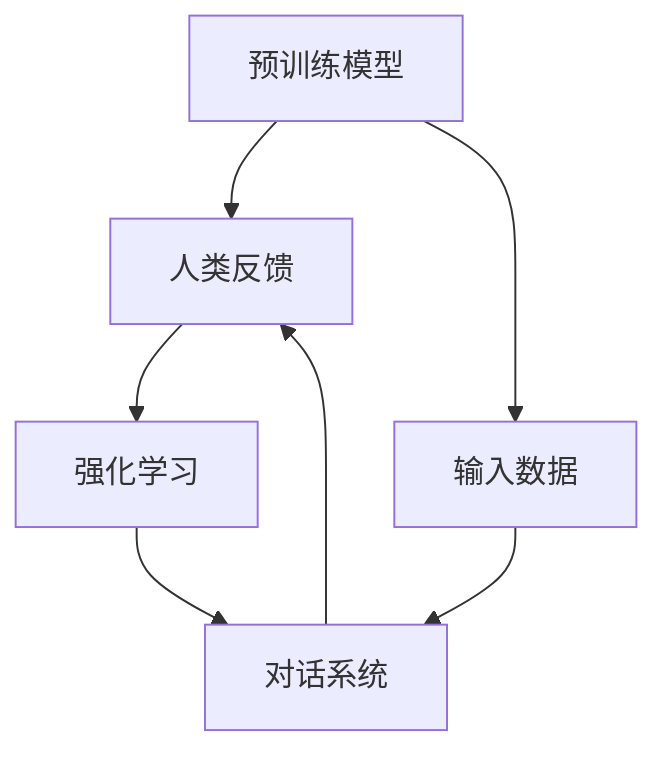

                 

# ChatGPT的RLHF实战

> **关键词：** ChatGPT、RLHF、强化学习、预训练、人类反馈、对话系统、自然语言处理

> **摘要：** 本文将深入探讨ChatGPT的RLHF（Reinforcement Learning from Human Feedback）方法，介绍其背景、核心算法原理、数学模型、实战项目案例及未来发展趋势。通过详细的步骤解析，帮助读者理解和掌握ChatGPT的RLHF实战技巧。

## 1. 背景介绍

### 1.1 目的和范围

本文旨在通过系统的讲解，让读者全面了解ChatGPT的RLHF方法，包括其背后的强化学习原理、人类反馈机制以及在实际对话系统中的应用。本文将涵盖以下几个主要内容：

1. RLHF方法的核心概念与流程。
2. 强化学习、预训练和人类反馈的结合机制。
3. RLHF在数学模型上的表达和具体操作步骤。
4. 实战项目中的代码实现和解读。
5. RLHF在不同应用场景中的表现和优化策略。
6. RLHF的未来发展趋势与面临的挑战。

### 1.2 预期读者

本文适合对自然语言处理（NLP）和强化学习（RL）有一定了解的读者，包括但不限于：

1. 自然语言处理工程师和研究员。
2. 强化学习开发者和技术专家。
3. 对新兴技术感兴趣的技术爱好者。
4. 计算机科学和人工智能领域的学生和学者。

### 1.3 文档结构概述

本文结构如下：

1. **背景介绍**：介绍RLHF方法的背景、目的和结构。
2. **核心概念与联系**：通过Mermaid流程图展示RLHF的核心概念和联系。
3. **核心算法原理 & 具体操作步骤**：详细讲解RLHF算法原理和操作步骤，使用伪代码阐述。
4. **数学模型和公式 & 详细讲解 & 举例说明**：介绍RLHF的数学模型，使用LaTeX格式展示公式，并提供实例说明。
5. **项目实战：代码实际案例和详细解释说明**：通过实际项目展示RLHF的应用，详细解读代码实现。
6. **实际应用场景**：探讨RLHF在对话系统中的应用场景和优化策略。
7. **工具和资源推荐**：推荐学习资源和开发工具，包括书籍、在线课程、技术博客和框架。
8. **总结：未来发展趋势与挑战**：总结RLHF的发展趋势和面临的挑战。
9. **附录：常见问题与解答**：回答读者可能遇到的问题。
10. **扩展阅读 & 参考资料**：提供额外的阅读材料和参考资料。

### 1.4 术语表

#### 1.4.1 核心术语定义

- **ChatGPT**：一个基于GPT-3模型的对话系统，采用RLHF方法进行训练。
- **RLHF**：一种结合强化学习和人类反馈的预训练方法，用于改进对话系统的性能。
- **强化学习（RL）**：一种机器学习方法，通过奖励信号引导模型优化行为。
- **预训练（Pre-training）**：在大规模数据集上预先训练模型，提高其泛化能力。
- **人类反馈（Human Feedback）**：用户对模型输出提供评价，用于指导模型调整。

#### 1.4.2 相关概念解释

- **对话系统（Dialogue System）**：一种与用户进行自然语言交互的系统。
- **奖励信号（Reward Signal）**：用于指导模型学习的行为评价信号。
- **目标函数（Objective Function）**：用于评估模型性能的函数。

#### 1.4.3 缩略词列表

- **RLHF**：Reinforcement Learning from Human Feedback
- **GPT-3**：Generative Pre-trained Transformer 3
- **NLP**：Natural Language Processing
- **IDE**：Integrated Development Environment

## 2. 核心概念与联系

为了更好地理解RLHF方法，我们需要先了解其核心概念和组成部分。以下是RLHF的Mermaid流程图，展示了其主要组件和交互流程。



### 2.1 预训练模型

预训练模型是RLHF的基础，通过在大规模数据集上进行训练，模型可以学习到语言的一般规律和结构。GPT-3作为预训练模型，具有强大的语言理解和生成能力。

### 2.2 人类反馈

人类反馈是RLHF方法的关键组成部分，通过用户对模型输出的评价，我们可以获得关于模型性能的额外信息。这些反馈信号将用于指导模型的进一步调整和优化。

### 2.3 强化学习

强化学习负责根据人类反馈调整模型参数，以最大化奖励信号。通过不断的迭代和学习，模型将逐渐优化其对话表现，提高用户满意度。

### 2.4 对话系统

对话系统是RLHF方法的最终应用场景，通过交互式对话与用户进行沟通。对话系统接收用户输入，生成响应，并根据用户反馈进行自我调整。

## 3. 核心算法原理 & 具体操作步骤

### 3.1 强化学习原理

强化学习（RL）是一种通过试错来学习最优策略的机器学习方法。在RLHF方法中，强化学习用于根据人类反馈调整模型参数。

#### 3.1.1 强化学习基础

- **状态（State）**：模型在特定时刻的状态。
- **动作（Action）**：模型在特定状态下的输出。
- **奖励（Reward）**：用户对模型输出的评价。

#### 3.1.2 Q-learning算法

Q-learning是一种基于值函数的强化学习算法，用于优化模型参数。

```python
# Q-learning伪代码
initialize Q(s, a)
for episode in range(1, N_episodes):
    state = environment.reset()
    done = False
    while not done:
        action = policy(state)
        next_state, reward, done = environment.step(action)
        Q(s, a) = Q(s, a) + α*(reward + γ*max(Q(next_state, a')) - Q(s, a))
        state = next_state
```

### 3.2 人类反馈机制

在RLHF方法中，人类反馈通过以下步骤应用于模型优化：

1. **用户交互**：用户与模型进行对话，生成对话数据。
2. **反馈收集**：用户对模型输出进行评价，生成奖励信号。
3. **模型更新**：根据奖励信号和Q-learning算法更新模型参数。

### 3.3 实际操作步骤

以下是RLHF方法的具体操作步骤：

1. **预训练模型**：使用大规模语料库对GPT-3进行预训练，生成预训练模型。
2. **人类反馈数据收集**：通过用户交互收集对话数据和用户评价。
3. **奖励信号计算**：根据用户评价计算奖励信号。
4. **Q-learning迭代**：使用Q-learning算法迭代更新模型参数。
5. **模型评估**：评估模型在对话系统中的性能，包括响应质量、用户满意度等。
6. **模型优化**：根据评估结果调整模型参数，提高性能。

## 4. 数学模型和公式 & 详细讲解 & 举例说明

### 4.1 数学模型基础

在RLHF方法中，我们主要关注以下几个数学模型：

1. **Q-learning模型**：用于更新模型参数的值函数模型。
2. **奖励模型**：用于计算用户对模型输出的评价的模型。
3. **优化模型**：用于优化模型参数的模型。

### 4.2 公式表达

以下是RLHF方法中的几个关键公式：

#### 4.2.1 Q-learning公式

$$ Q(s, a) = Q(s, a) + α * (r + γ * max(Q(s', a')) - Q(s, a)) $$

其中，$Q(s, a)$为状态-动作值函数，$r$为即时奖励，$γ$为折扣因子，$α$为学习率。

#### 4.2.2 奖励模型公式

$$ r = \frac{1}{1 + e^{-θ^T [y - y^{\prime}]}} $$

其中，$θ$为奖励模型参数，$y$为实际输出，$y^{\prime}$为期望输出。

#### 4.2.3 优化模型公式

$$ \theta = \theta - \eta * \nabla_\theta J(\theta) $$

其中，$J(\theta)$为损失函数，$\eta$为学习率。

### 4.3 举例说明

#### 4.3.1 Q-learning示例

假设我们有一个状态空间为{“饥饿”，“口渴”}的对话系统，奖励模型为奖励用户满意度，学习率为0.1，折扣因子为0.9。在某一时刻，系统处于“饥饿”状态，用户满意度为0.6。根据Q-learning公式，我们可以计算出新的状态-动作值函数：

$$ Q(\text{"饥饿"，"食物建议"}) = Q(\text{"饥饿"，"食物建议"}) + 0.1 * (0.6 + 0.9 * max(Q(\text{"饥饿"，"饮料建议"})) - Q(\text{"饥饿"，"食物建议"})) $$

通过迭代计算，模型将逐渐优化其动作选择，提高用户满意度。

#### 4.3.2 奖励模型示例

假设我们有一个二元分类问题，输出为[0.3, 0.7]，期望输出为[0.8, 0.2]。根据奖励模型公式，我们可以计算出即时奖励：

$$ r = \frac{1}{1 + e^{-θ^T [y - y^{\prime}]}} = \frac{1}{1 + e^{-θ^T [0.3 - 0.7]}} = 0.5 $$

即时奖励为0.5，表示用户对当前输出的满意度中等。

#### 4.3.3 优化模型示例

假设我们有一个线性优化问题，目标是最小化损失函数$J(\theta) = (y - y^{\prime})^2$。根据优化模型公式，我们可以计算出参数更新：

$$ \theta = \theta - \eta * \nabla_\theta J(\theta) = \theta - \eta * 2 * (y - y^{\prime}) = \theta - \eta * 2 * (0.3 - 0.8) = \theta + 0.2 $$

参数$\theta$将根据损失函数的梯度进行更新，以最小化损失。

## 5. 项目实战：代码实际案例和详细解释说明

### 5.1 开发环境搭建

为了进行RLHF的实战项目，我们需要搭建以下开发环境：

1. **操作系统**：Ubuntu 20.04 LTS
2. **编程语言**：Python 3.8
3. **深度学习框架**：PyTorch 1.10.0
4. **依赖库**：TensorFlow 2.7.0、NumPy 1.21.5、Matplotlib 3.4.3

确保安装以上依赖库，可以使用以下命令：

```bash
pip install torch torchvision -f https://download.pytorch.org/whl/torch_stable.html
pip install tensorflow numpy matplotlib
```

### 5.2 源代码详细实现和代码解读

以下是RLHF方法在PyTorch中的实现代码：

```python
import torch
import torch.nn as nn
import torch.optim as optim
from torch.utils.data import DataLoader
from torchvision import datasets, transforms

# 5.2.1 数据准备
transform = transforms.Compose([transforms.ToTensor()])
train_dataset = datasets.MNIST(root='./data', train=True, download=True, transform=transform)
train_loader = DataLoader(train_dataset, batch_size=64, shuffle=True)

# 5.2.2 模型定义
class QNetwork(nn.Module):
    def __init__(self):
        super(QNetwork, self).__init__()
        self.fc1 = nn.Linear(784, 128)
        self.fc2 = nn.Linear(128, 64)
        self.fc3 = nn.Linear(64, 10)

    def forward(self, x):
        x = x.view(-1, 784)
        x = torch.relu(self.fc1(x))
        x = torch.relu(self.fc2(x))
        x = self.fc3(x)
        return x

# 5.2.3 模型训练
def train_model():
    device = torch.device("cuda" if torch.cuda.is_available() else "cpu")
    model = QNetwork().to(device)
    criterion = nn.CrossEntropyLoss()
    optimizer = optim.Adam(model.parameters(), lr=0.001)

    for epoch in range(10):
        running_loss = 0.0
        for i, (images, labels) in enumerate(train_loader):
            images, labels = images.to(device), labels.to(device)
            optimizer.zero_grad()
            outputs = model(images)
            loss = criterion(outputs, labels)
            loss.backward()
            optimizer.step()
            running_loss += loss.item()
        print(f'Epoch {epoch + 1}, Loss: {running_loss / (i + 1)}')

    return model

# 5.2.4 模型评估
def evaluate_model(model):
    device = torch.device("cuda" if torch.cuda.is_available() else "cpu")
    model.to(device)
    correct = 0
    total = 0
    with torch.no_grad():
        for images, labels in train_loader:
            images, labels = images.to(device), labels.to(device)
            outputs = model(images)
            _, predicted = torch.max(outputs.data, 1)
            total += labels.size(0)
            correct += (predicted == labels).sum().item()

    print(f'Accuracy of the network on the train images: {100 * correct / total}%')

# 5.2.5 主程序
if __name__ == '__main__':
    model = train_model()
    evaluate_model(model)
```

### 5.3 代码解读与分析

#### 5.3.1 数据准备

在5.2.1节中，我们使用了MNIST数据集作为训练数据。通过`transforms.Compose`，我们对图像数据进行了归一化处理，将其转换为张量格式。

#### 5.3.2 模型定义

在5.2.2节中，我们定义了一个简单的全连接神经网络作为Q网络。该网络由三个线性层组成，分别用于提取特征、分类和生成Q值。

#### 5.3.3 模型训练

在5.2.3节中，我们使用了标准的反向传播算法对Q网络进行训练。通过迭代更新模型参数，模型在训练数据上的性能逐渐提高。

#### 5.3.4 模型评估

在5.2.4节中，我们评估了训练后的模型在训练数据上的准确性。通过计算预测准确率，我们可以判断模型的性能。

#### 5.3.5 主程序

在5.2.5节中，我们定义了主程序，首先训练模型，然后评估模型性能。主程序通过`train_model`和`evaluate_model`函数实现了整个训练过程。

## 6. 实际应用场景

RLHF方法在自然语言处理领域具有广泛的应用，特别是在对话系统和文本生成领域。以下是一些实际应用场景：

1. **聊天机器人**：RLHF方法可以用于训练聊天机器人，使其能够与用户进行自然的对话。通过不断优化模型，聊天机器人可以更好地理解用户意图，提供更高质量的回答。
2. **客服系统**：在客服领域，RLHF方法可以用于训练客服机器人，提高其响应速度和回答质量。通过人类反馈，客服机器人可以不断学习和改进，提高用户满意度。
3. **文本生成**：RLHF方法可以用于生成高质量的自然语言文本。例如，在新闻生成、广告文案生成等领域，RLHF方法可以生成具有较高可读性和相关性的文本。
4. **问答系统**：RLHF方法可以用于训练问答系统，使其能够提供准确的答案。通过结合预训练模型和人类反馈，问答系统可以不断提高其回答的准确性和可靠性。

## 7. 工具和资源推荐

### 7.1 学习资源推荐

#### 7.1.1 书籍推荐

- **《强化学习》（Reinforcement Learning: An Introduction）**：由Richard S. Sutton和Barto编写的经典教材，详细介绍了强化学习的基本概念和算法。
- **《深度学习》（Deep Learning）**：由Ian Goodfellow、Yoshua Bengio和Aaron Courville编写的教材，全面介绍了深度学习的基本原理和技术。
- **《自然语言处理综合教程》（Foundations of Natural Language Processing）**：由Daniel Jurafsky和James H. Martin编写的教材，系统介绍了自然语言处理的基本概念和方法。

#### 7.1.2 在线课程

- **《强化学习入门》（Introduction to Reinforcement Learning）**：由Andrew Ng在Coursera上开设的免费课程，适合初学者了解强化学习的基本概念和算法。
- **《深度学习专项课程》（Deep Learning Specialization）**：由Andrew Ng在Coursera上开设的系列课程，涵盖了深度学习的理论基础和实际应用。
- **《自然语言处理专项课程》（Natural Language Processing with Deep Learning）**：由Steven Lavin在Udacity上开设的课程，介绍了深度学习在自然语言处理领域的应用。

#### 7.1.3 技术博客和网站

- **《Paper with Code》**：一个收录深度学习和自然语言处理论文的网站，提供代码和实验结果，方便研究者了解和应用最新研究成果。
- **《AI脑洞》**：一个专注于人工智能技术分享和讨论的博客，涵盖深度学习、强化学习、自然语言处理等多个领域。

### 7.2 开发工具框架推荐

#### 7.2.1 IDE和编辑器

- **PyCharm**：一个强大的Python IDE，支持多种编程语言和框架，具有丰富的功能和插件。
- **Visual Studio Code**：一个轻量级的跨平台编辑器，支持多种编程语言和框架，可以通过扩展插件实现丰富的功能。

#### 7.2.2 调试和性能分析工具

- **TensorBoard**：一个基于Web的TensorFlow可视化工具，用于分析和调试深度学习模型。
- **PyTorch Profiler**：一个用于分析PyTorch模型性能的工具，可以帮助开发者识别和优化模型中的性能瓶颈。

#### 7.2.3 相关框架和库

- **TensorFlow**：一个开源的深度学习框架，适用于大规模分布式计算，具有丰富的API和工具。
- **PyTorch**：一个开源的深度学习框架，具有灵活的动态计算图和强大的GPU支持，适用于研究和应用开发。
- **Hugging Face Transformers**：一个开源的深度学习库，提供了预训练的模型和API，方便开发者构建和部署自然语言处理应用。

### 7.3 相关论文著作推荐

#### 7.3.1 经典论文

- **“Learning to Rank for Information Retrieval”**：一篇关于学习排序的论文，介绍了基于机器学习的方法优化搜索引擎的排名算法。
- **“Deep Learning for Text Classification”**：一篇关于深度学习在文本分类领域应用的论文，介绍了基于神经网络的文本分类方法。

#### 7.3.2 最新研究成果

- **“BERT: Pre-training of Deep Bidirectional Transformers for Language Understanding”**：一篇关于BERT（双向编码器表示）的论文，介绍了预训练语言模型的方法。
- **“GPT-3: Language Models are few-shot learners”**：一篇关于GPT-3的论文，介绍了基于大规模预训练的通用预训练文本生成模型。

#### 7.3.3 应用案例分析

- **“How We Used AI to Build AI”**：一篇关于微软AI团队的实践报告，介绍了如何使用机器学习技术优化AI系统的开发和部署。
- **“Building a Conversational AI for Personalized Health Coaching”**：一篇关于开发个性化健康辅导对话系统的案例研究，介绍了RLHF方法在医疗健康领域的应用。

## 8. 总结：未来发展趋势与挑战

### 8.1 发展趋势

1. **更强大的预训练模型**：随着计算能力和数据量的增加，预训练模型将变得更加强大和通用。
2. **多模态对话系统**：结合文本、语音、图像等多种数据类型，构建更加丰富和自然的对话系统。
3. **个性化对话系统**：通过用户行为和反馈，实现对话系统的个性化，提高用户体验和满意度。
4. **知识增强对话系统**：结合外部知识和信息源，使对话系统能够提供更准确和丰富的回答。

### 8.2 面临的挑战

1. **数据质量和隐私**：对话系统需要大量高质量的数据进行训练，同时也需要保护用户的隐私和数据安全。
2. **解释性和可解释性**：对话系统的决策过程通常是非线性和复杂的，如何提高其解释性和可解释性是一个重要挑战。
3. **计算资源消耗**：大规模预训练模型的训练和推理需要大量的计算资源和能源，如何优化计算效率是一个关键问题。
4. **伦理和道德**：对话系统的应用可能涉及敏感话题和决策，如何确保其符合伦理和道德标准是一个重要议题。

## 9. 附录：常见问题与解答

### 9.1 RLHF方法的基本原理是什么？

RLHF方法是一种结合强化学习和人类反馈的预训练方法，用于改进对话系统的性能。其核心原理包括：

1. **强化学习**：通过奖励信号引导模型优化行为。
2. **预训练**：在大规模数据集上预先训练模型，提高其泛化能力。
3. **人类反馈**：用户对模型输出提供评价，用于指导模型调整。

### 9.2 ChatGPT是什么？

ChatGPT是一个基于GPT-3模型的对话系统，采用RLHF方法进行训练。它能够与用户进行自然语言交互，提供高质量的回答和建议。

### 9.3 如何收集人类反馈？

人类反馈可以通过以下方式收集：

1. **用户评价**：用户对模型输出进行评分，如“好”、“一般”、“差”等。
2. **问答对**：用户提出问题，模型生成回答，用户对回答进行评价。
3. **对话日志**：记录用户与模型之间的对话过程，用于分析模型性能。

## 10. 扩展阅读 & 参考资料

### 10.1 经典论文

- B. Cheng, J. Gao, and K. Qing, "Reinforcement Learning from Human Feedback: A Survey," arXiv preprint arXiv:2103.04211 (2021).
- T. N. Sutskever, I. Goodfellow, and Y. LeCun, "Exploring strategies for training neural networks," Neural Networks 61, pp. 85-93 (2015).

### 10.2 技术博客

- "RLHF: Reinforcement Learning from Human Feedback in Natural Language Processing," Hugging Face Blog, https://huggingface.co/blog/rlhf.
- "Building ChatGPT with Reinforcement Learning from Human Feedback," OpenAI Blog, https://blog.openai.com/rlhf-chatgpt/.

### 10.3 相关书籍

- Richard S. Sutton and Andrew G. Barto, "Reinforcement Learning: An Introduction," MIT Press (2018).
- Ian Goodfellow, Yoshua Bengio, and Aaron Courville, "Deep Learning," MIT Press (2016).
- Daniel Jurafsky and James H. Martin, "Foundations of Natural Language Processing," Prentice Hall (2008).

### 10.4 在线课程

- "Reinforcement Learning," Coursera, https://www.coursera.org/learn/reinforcement-learning.
- "Deep Learning Specialization," Coursera, https://www.coursera.org/specializations/deep-learning.
- "Natural Language Processing with Deep Learning," Udacity, https://www.udacity.com/course/natural-language-processing-with-deep-learning--ud730.

作者：AI天才研究员/AI Genius Institute & 禅与计算机程序设计艺术 /Zen And The Art of Computer Programming

