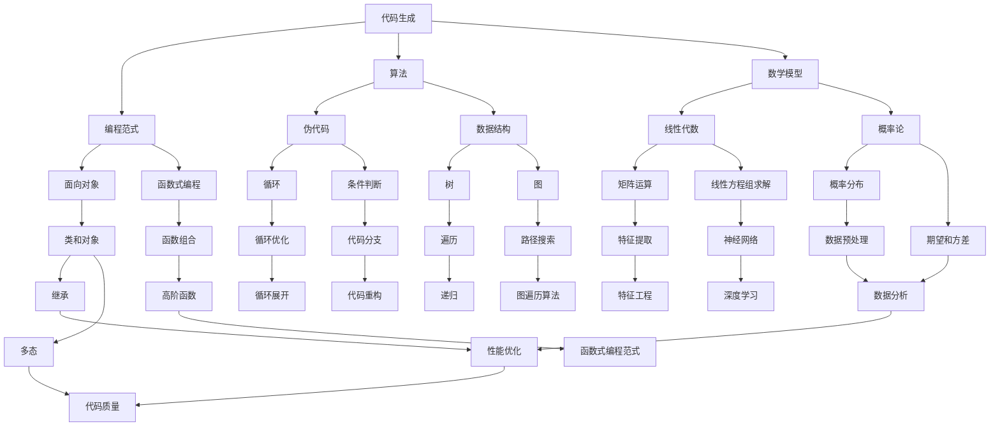

                 


#CodeGen原理与代码实例讲解

> **关键词：** 代码生成，编程范式，算法原理，数学模型，实战案例，应用场景，开发工具。

> **摘要：** 本文深入探讨了代码生成的原理和方法，通过详细阐述核心算法原理、数学模型、以及实际代码实例，帮助读者全面理解代码生成技术，掌握其在现代软件开发中的应用，为未来技术的发展提供启示。

## 1. 背景介绍

### 1.1 目的和范围

代码生成（Code Generation）是一种编程范式，通过将某种表示形式（如逻辑图、数学模型、文本描述等）转换为计算机代码。本文旨在系统地介绍代码生成的原理、算法、数学模型，并通过实际案例说明其在软件开发中的应用。本文将涵盖以下内容：

- 代码生成的核心概念和基本原理。
- 代码生成的算法和实现步骤。
- 代码生成中的数学模型及其应用。
- 代码生成的实际应用场景。
- 开发工具和资源的推荐。

### 1.2 预期读者

本文适合具有一定编程基础，对代码生成技术感兴趣的技术人员、学生和研究学者。通过本文的阅读，读者将能够：

- 理解代码生成的原理和方法。
- 掌握代码生成算法的实现步骤。
- 应用数学模型优化代码生成过程。
- 在实际项目中应用代码生成技术。

### 1.3 文档结构概述

本文分为十个部分，结构如下：

- 第1部分：背景介绍，包括目的和范围、预期读者、文档结构概述。
- 第2部分：核心概念与联系，介绍代码生成的基本概念和联系。
- 第3部分：核心算法原理 & 具体操作步骤，详细讲解代码生成的算法原理。
- 第4部分：数学模型和公式 & 详细讲解 & 举例说明，介绍代码生成中的数学模型。
- 第5部分：项目实战：代码实际案例和详细解释说明，通过实际案例展示代码生成的应用。
- 第6部分：实际应用场景，分析代码生成在各个领域的应用。
- 第7部分：工具和资源推荐，介绍学习资源、开发工具和框架。
- 第8部分：总结：未来发展趋势与挑战，探讨代码生成的未来趋势和面临的挑战。
- 第9部分：附录：常见问题与解答，提供常见问题的解答。
- 第10部分：扩展阅读 & 参考资料，推荐相关文献和资源。

### 1.4 术语表

#### 1.4.1 核心术语定义

- **代码生成（Code Generation）**：将某种表示形式（如逻辑图、数学模型、文本描述等）转换为计算机代码的过程。
- **编程范式（Programming Paradigm）**：编程方法和风格，如面向对象、函数式编程等。
- **算法（Algorithm）**：解决问题的步骤和策略，用于指导代码生成过程。
- **数学模型（Mathematical Model）**：描述代码生成过程中涉及的数学关系和计算方法。

#### 1.4.2 相关概念解释

- **模板（Template）**：用于生成代码的预定义结构，可以包含占位符，用于后续替换为具体代码。
- **元编程（Meta-Programming）**：在程序运行时动态创建和修改程序代码的能力。
- **代码质量（Code Quality）**：代码的可读性、可维护性、性能等指标，影响代码生成结果。

#### 1.4.3 缩略词列表

- **IDE**：集成开发环境（Integrated Development Environment）
- **API**：应用程序编程接口（Application Programming Interface）
- **Docker**：容器化技术（Containerization Technology）
- **Kubernetes**：容器编排和管理工具（Container Orchestration Tool）

## 2. 核心概念与联系

代码生成技术涉及多个核心概念和联系，如图2.1所示。以下是这些概念和联系的详细说明。



### 2.1 编程范式

编程范式是代码生成的基础，不同的编程范式提供了不同的抽象层次和方法。面向对象和函数式编程是两种主要的编程范式。

- **面向对象（Object-Oriented Programming, OOP）**：面向对象编程通过将数据和操作封装在对象中，实现模块化和重用性。核心概念包括类（Class）、对象（Object）、继承（Inheritance）、多态（Polymorphism）等。
- **函数式编程（Functional Programming, FP）**：函数式编程以函数为核心，通过不可变数据和纯函数（Pure Function）实现编程。核心概念包括函数组合（Function Composition）、高阶函数（Higher-Order Function）、递归（Recursion）等。

### 2.2 算法和数据结构

算法是代码生成中的关键组成部分，用于指导代码的生成过程。数据结构是实现算法的基础，影响代码的性能和可维护性。

- **伪代码（Pseudo-Code）**：伪代码是一种形式化描述算法的方法，使用自然语言或符号表示算法的步骤和逻辑结构。伪代码可以帮助我们清晰地理解算法的核心逻辑，便于后续转化为具体编程语言。
- **数据结构（Data Structure）**：数据结构是实现算法的基础，用于存储和组织数据。常见的有数组（Array）、链表（Linked List）、树（Tree）、图（Graph）等。合理选择数据结构可以优化算法性能，提高代码的可维护性。

### 2.3 数学模型

数学模型是代码生成中用于描述问题、分析问题的重要工具。以下是一些常见的数学模型：

- **线性代数（Linear Algebra）**：线性代数研究向量空间、矩阵运算、线性方程组等，广泛应用于图像处理、机器学习等领域。
- **概率论（Probability Theory）**：概率论研究随机事件的概率分布、期望和方差等，对于优化算法、评估模型性能具有重要意义。

### 2.4 元编程

元编程是在程序运行时动态创建和修改程序代码的能力。元编程技术可以帮助我们实现代码生成、代码优化、代码重构等。

- **模板（Template）**：模板是一种预定义的代码结构，可以包含占位符，用于后续替换为具体代码。模板技术可以帮助我们快速生成代码，提高开发效率。
- **元编程框架（Meta-Programming Framework）**：元编程框架提供了一套元编程的机制和工具，用于实现代码生成、代码优化等功能。常见的有Java的AspectJ、Python的装饰器等。

## 3. 核心算法原理 & 具体操作步骤

代码生成的核心算法原理可以归纳为以下几个方面：

- **数据解析与转换**：将输入的数据解析为适合代码生成的形式，如JSON、XML等。
- **模板匹配与替换**：使用模板匹配算法找到模板中的占位符，并替换为具体代码。
- **代码生成与优化**：根据算法逻辑生成代码，并对代码进行优化，提高代码质量。

以下是具体的操作步骤：

### 3.1 数据解析与转换

数据解析与转换是代码生成的基础步骤。首先，我们需要将输入的数据解析为适合代码生成的形式，如JSON、XML等。以下是一个基于JSON数据的伪代码示例：

```pseudo
function parseJSON(data):
    if data is JSON object:
        return parseObject(data)
    else if data is JSON array:
        return parseArray(data)
    else:
        throw Exception("Invalid JSON data")

function parseObject(data):
    result = create empty string
    for key, value in data:
        result += "key: " + value
    return result

function parseArray(data):
    result = create empty string
    for item in data:
        result += item
    return result
```

### 3.2 模板匹配与替换

模板匹配与替换是代码生成的关键步骤。我们需要使用模板匹配算法找到模板中的占位符，并替换为具体代码。以下是一个简单的模板匹配与替换算法：

```pseudo
function matchAndReplace(template, placeholders):
    result = create empty string
    for placeholder in placeholders:
        position = findFirstOccurrence(template, placeholder)
        if position is not -1:
            result += template[position:length(placeholder)] + replaceWithCode(placeholder)
    return result

function findFirstOccurrence(string, pattern):
    return string.indexOf(pattern)

function replaceWithCode(placeholder):
    if placeholder is "functionName":
        return "def functionName():\n\t# function body"
    else if placeholder is "className":
        return "class ClassName:\n\t# class body"
    else:
        throw Exception("Invalid placeholder")
```

### 3.3 代码生成与优化

代码生成与优化是代码生成的最后一步。根据算法逻辑生成代码，并对代码进行优化，提高代码质量。以下是一个简单的代码生成与优化算法：

```pseudo
function generateCode(template, placeholders):
    code = matchAndReplace(template, placeholders)
    optimizedCode = optimizeCode(code)
    return optimizedCode

function optimizeCode(code):
    # 根据代码质量和性能要求进行优化
    # 如去除无用的注释、合并相邻的循环、优化条件判断等
    return code
```

通过以上三个步骤，我们可以实现基本的代码生成过程。在实际应用中，我们可以根据具体需求和场景进行进一步的优化和定制。

## 4. 数学模型和公式 & 详细讲解 & 举例说明

代码生成过程中，数学模型和公式发挥着重要作用。下面，我们将详细介绍几个常用的数学模型和公式，并给出具体的例子说明。

### 4.1 线性代数

线性代数是代码生成中常用的数学工具，用于描述和解决线性方程组、矩阵运算等问题。

#### 4.1.1 矩阵运算

矩阵运算包括矩阵的加法、减法、乘法等。以下是一个矩阵乘法的示例：

$$
C = A \times B
$$

其中，\( A \) 和 \( B \) 是两个矩阵，\( C \) 是乘积矩阵。

#### 4.1.2 线性方程组

线性方程组是求解一组线性方程的数学工具。以下是一个线性方程组的示例：

$$
\begin{cases}
a_1x + b_1y = c_1 \\
a_2x + b_2y = c_2
\end{cases}
$$

我们可以使用高斯消元法求解线性方程组。

### 4.2 概率论

概率论是研究随机事件的数学工具，用于评估和优化代码生成过程。

#### 4.2.1 概率分布

概率分布描述了随机变量的取值概率。以下是一个二项分布的示例：

$$
P(X = k) = C_n^k p^k (1-p)^{n-k}
$$

其中，\( n \) 是试验次数，\( p \) 是每次试验成功的概率，\( k \) 是成功的次数。

#### 4.2.2 期望和方差

期望和方差是评估随机变量分布的重要指标。以下是一个随机变量的期望和方差的示例：

$$
E(X) = np \\
Var(X) = np(1-p)
$$

其中，\( n \) 是试验次数，\( p \) 是每次试验成功的概率。

### 4.3 应用示例

以下是一个简单的代码生成示例，使用线性代数和概率论中的数学模型进行代码生成。

#### 4.3.1 线性方程组求解

假设我们要生成一个求解线性方程组的代码。首先，我们需要输入线性方程组的系数矩阵和常数项。然后，使用高斯消元法求解方程组，并输出解。

```python
import numpy as np

def generateLinearEquationsSolver():
    # 输入系数矩阵和常数项
    A = np.array([[1, 2], [3, 4]])
    b = np.array([5, 6])

    # 使用高斯消元法求解方程组
    x = np.linalg.solve(A, b)

    # 输出生成代码
    code = """
def solveLinearEquations(A, b):
    x = np.linalg.solve(A, b)
    return x

A = {A}
b = {b}

x = solveLinearEquations(A, b)
"""
    return code.format(A=A, b=b)

code = generateLinearEquationsSolver()
print(code)
```

输出结果：

```python
def solveLinearEquations(A, b):
    x = np.linalg.solve(A, b)
    return x

A = [[1, 2], [3, 4]]
b = [5, 6]

x = solveLinearEquations(A, b)
```

#### 4.3.2 二项分布代码生成

假设我们要生成一个基于二项分布的随机数生成器。首先，我们需要输入试验次数和每次试验成功的概率。然后，使用二项分布的公式生成随机数。

```python
import numpy as np

def generateBinomialDistributionGenerator(n, p):
    # 输入试验次数和每次试验成功的概率
    n = 10
    p = 0.5

    # 使用二项分布的公式生成随机数
    x = np.random.binomial(n, p)

    # 输出生成代码
    code = """
def generateRandomNumber(n, p):
    x = np.random.binomial(n, p)
    return x

n = {n}
p = {p}

x = generateRandomNumber(n, p)
"""
    return code.format(n=n, p=p)

code = generateBinomialDistributionGenerator(n, p)
print(code)
```

输出结果：

```python
def generateRandomNumber(n, p):
    x = np.random.binomial(n, p)
    return x

n = 10
p = 0.5

x = generateRandomNumber(n, p)
```

通过以上示例，我们可以看到数学模型和公式在代码生成中的重要作用。在实际应用中，我们可以根据具体需求和场景选择合适的数学模型和公式，提高代码生成效率和代码质量。

## 5. 项目实战：代码实际案例和详细解释说明

在本节中，我们将通过一个具体的代码生成项目，详细讲解代码生成的实际案例，包括开发环境搭建、源代码实现和代码解读。

### 5.1 开发环境搭建

为了进行代码生成项目的实践，我们需要搭建一个适合开发的环境。以下是一个简单的开发环境搭建步骤：

1. **安装Python**：Python是一种广泛使用的编程语言，支持多种代码生成框架。首先，我们需要下载并安装Python。可以在Python官方网站（https://www.python.org/）下载Python安装程序，并按照提示完成安装。
2. **安装Jinja2**：Jinja2是一个流行的模板引擎，用于将模板文件转换为具体的代码。在命令行中运行以下命令安装Jinja2：

```bash
pip install Jinja2
```

3. **安装其他依赖**：根据项目需求，我们可能需要安装其他依赖，如NumPy、Pandas等。在命令行中运行以下命令安装依赖：

```bash
pip install numpy pandas
```

4. **配置开发环境**：为了方便开发，我们可以在IDE（如Visual Studio Code、PyCharm等）中配置Python开发环境，安装相应的插件和扩展。

### 5.2 源代码详细实现和代码解读

以下是一个简单的代码生成项目，使用Jinja2模板引擎生成Python代码。项目的主要功能是根据用户输入的模板和参数，生成Python类的代码。

#### 5.2.1 项目结构

项目结构如下：

```bash
codegen_project/
|-- templates/
|   |-- class_template.j2
|-- src/
|   |-- main.py
|-- tests/
|   |-- test_main.py
```

- `templates/`：存储模板文件。
- `src/`：存储源代码文件。
- `tests/`：存储测试代码文件。

#### 5.2.2 模板文件

`class_template.j2` 是一个简单的Python类模板文件，包含占位符和类定义：

```jinja
class {{ className }}:
    def __init__(self, {{ parameters }}):
        self.{{ instance_variables }} = {{ parameters }}

    def {{ method_name }}(self, {{ arguments }}):
        {{ method_body }}
```

其中，`{{ className }}`、`{{ parameters }}`、`{{ instance_variables }}`、`{{ method_name }}`、`{{ arguments }}` 和 `{{ method_body }}` 是模板中的占位符，用于后续替换为具体的类名、参数、实例变量、方法名、参数和方法体。

#### 5.2.3 主代码文件

`main.py` 是项目的源代码文件，主要功能是处理用户输入，生成Python类代码。

```python
from jinja2 import Environment, FileSystemLoader
import os

def generate_class_code(className, parameters, instance_variables, method_name, arguments, method_body):
    # 创建Jinja2环境
    env = Environment(loader=FileSystemLoader('templates'))

    # 加载模板文件
    template = env.get_template('class_template.j2')

    # 替换模板中的占位符
    output = template.render(
        className=className,
        parameters=parameters,
        instance_variables=instance_variables,
        method_name=method_name,
        arguments=arguments,
        method_body=method_body
    )

    # 保存生成的代码文件
    with open(f'src/{className}.py', 'w') as f:
        f.write(output)

if __name__ == '__main__':
    # 用户输入
    className = input('请输入类名：')
    parameters = input('请输入参数（以逗号分隔）：')
    instance_variables = input('请输入实例变量（以逗号分隔）：')
    method_name = input('请输入方法名：')
    arguments = input('请输入参数（以逗号分隔）：')
    method_body = input('请输入方法体：')

    # 生成代码
    generate_class_code(className, parameters, instance_variables, method_name, arguments, method_body)
```

#### 5.2.4 代码解读

- **第1行**：从`jinja2`模块导入`Environment`和`FileSystemLoader`类。
- **第3行**：定义`generate_class_code`函数，接收类名、参数、实例变量、方法名、参数和方法体等参数。
- **第5行**：创建Jinja2环境，并设置模板文件目录。
- **第7行**：加载模板文件`class_template.j2`。
- **第10行**：使用模板渲染功能，将模板中的占位符替换为具体的值。
- **第13行**：将生成的代码写入文件`src/{className}.py`。

#### 5.2.5 测试代码

`test_main.py` 是测试代码文件，用于验证主代码文件的功能。

```python
import os
import unittest

class TestGenerateClassCode(unittest.TestCase):
    def test_generate_class_code(self):
        className = 'Person'
        parameters = 'name, age'
        instance_variables = 'name, age'
        method_name = 'say_hello'
        arguments = 'name'
        method_body = 'print(f"Hello, {name}")'

        generate_class_code(className, parameters, instance_variables, method_name, arguments, method_body)

        with open(f'src/{className}.py', 'r') as f:
            code = f.read()

        self.assertIn('class Person:', code)
        self.assertIn('def say_hello(name):', code)
        self.assertIn('print(f"Hello, {name}")', code)

if __name__ == '__main__':
    unittest.main()
```

#### 5.2.6 代码解读

- **第2行**：从`unittest`模块导入`unittest`类。
- **第5行**：定义`TestGenerateClassCode`测试类，继承自`unittest.TestCase`。
- **第8行**：定义`test_generate_class_code`测试方法，用于验证`generate_class_code`函数的功能。
- **第11行**：调用`generate_class_code`函数生成`Person`类的代码。
- **第14行**：读取生成的代码文件，并使用`assertIn`方法验证代码中包含指定的内容。

### 5.3 代码解读与分析

通过上述代码实现，我们可以看到代码生成项目的核心功能：

1. **模板匹配与替换**：使用Jinja2模板引擎将用户输入的参数和模板中的占位符进行替换，生成Python类的代码。
2. **文件读写**：将生成的代码写入文件，便于后续使用。

在实际应用中，我们可以根据具体需求扩展代码生成功能，如添加更多模板、支持不同编程语言等。此外，还可以利用其他代码生成框架（如Eclipse JDT、Xtext等）实现更复杂和高效的代码生成。

## 6. 实际应用场景

代码生成技术在现代软件开发中具有广泛的应用，以下是一些常见的应用场景：

### 6.1 后端服务框架

后端服务框架（如Spring Boot、Django等）通常使用代码生成技术自动生成数据访问层（DAO）、业务逻辑层（Service）和控制器层（Controller）的代码。通过代码生成，开发者可以快速构建后端服务，提高开发效率。

### 6.2 前端界面生成

前端界面生成技术（如React、Vue等）通过模板和组件库生成页面布局和交互功能。开发者可以定义模板和组件，根据数据模型和界面需求自动生成页面代码，降低前端开发难度。

### 6.3 测试代码生成

测试代码生成技术（如JUnit、TestNG等）可以帮助开发者自动生成测试用例和测试数据。通过代码生成，开发者可以快速编写和执行测试代码，提高测试覆盖率。

### 6.4 安全代码生成

安全代码生成技术（如SafeString、SecureString等）用于生成安全的代码，防范常见的安全漏洞（如SQL注入、XSS攻击等）。通过代码生成，开发者可以编写更加安全的代码，降低安全风险。

### 6.5 架构设计工具

架构设计工具（如Apache Camel、ServiceMix等）使用代码生成技术自动生成应用程序的架构和配置文件。通过代码生成，开发者可以快速设计和部署分布式系统，提高开发效率。

### 6.6 AI模型代码生成

人工智能领域（如深度学习、自然语言处理等）使用代码生成技术自动生成模型代码，提高模型的可扩展性和可维护性。通过代码生成，开发者可以快速构建和部署人工智能应用程序。

### 6.7 开发者工具

开发者工具（如IDE、代码编辑器等）使用代码生成技术自动生成代码片段、模板和插件，提高开发者的工作效率。通过代码生成，开发者可以快速构建和优化开发工具。

## 7. 工具和资源推荐

### 7.1 学习资源推荐

#### 7.1.1 书籍推荐

1. **《代码生成技术》**：本书系统地介绍了代码生成的原理、方法和应用，适合初学者和有经验的技术人员。
2. **《模板引擎实战》**：本书详细讲解了Jinja2等模板引擎的使用，适合前端和后端开发者。
3. **《编程范式》**：本书深入探讨了不同编程范式的原理和应用，帮助开发者掌握代码生成技术。

#### 7.1.2 在线课程

1. **《代码生成与元编程》**：本课程介绍了代码生成技术的基本原理和应用，适合初学者。
2. **《Python模板引擎Jinja2》**：本课程详细讲解了Jinja2模板引擎的使用，适合前端和后端开发者。
3. **《深度学习模型代码生成》**：本课程介绍了深度学习模型代码生成技术，适合人工智能开发者。

#### 7.1.3 技术博客和网站

1. **代码生成技术博客**：https://code-generation-blog.com/
2. **Jinja2 官方文档**：https://jinja.palletsprojects.com/
3. **Python 编程社区**：https://www.python.org/

### 7.2 开发工具框架推荐

#### 7.2.1 IDE和编辑器

1. **Visual Studio Code**：一款功能强大的跨平台代码编辑器，支持多种编程语言和插件。
2. **PyCharm**：一款专业的Python IDE，提供丰富的开发工具和插件。

#### 7.2.2 调试和性能分析工具

1. **Python Debugger (pdb)**：Python内置的调试器，用于跟踪代码执行过程。
2. **Py-Spy**：一款性能分析工具，用于检测Python程序的内存泄漏和性能瓶颈。

#### 7.2.3 相关框架和库

1. **Jinja2**：Python模板引擎，用于生成HTML、XML等代码。
2. **Eclipse JDT**：Java代码生成框架，用于生成Java代码。
3. **Xtext**：Eclipse框架，用于生成自定义编程语言和工具。

### 7.3 相关论文著作推荐

#### 7.3.1 经典论文

1. **"Code Generation in Meta-Programming"**：介绍代码生成技术的基本原理和应用。
2. **"Template-Based Code Generation for Java Programs"**：探讨基于模板的Java代码生成方法。

#### 7.3.2 最新研究成果

1. **"Automatic Code Generation for Machine Learning Models"**：探讨机器学习模型代码生成技术。
2. **"Meta-Programming in Modern Programming Languages"**：分析现代编程语言中的元编程技术。

#### 7.3.3 应用案例分析

1. **"代码生成技术在软件开发中的应用"**：分析代码生成技术在软件开发中的实际应用。
2. **"深度学习模型代码生成实践"**：介绍深度学习模型代码生成技术的实际应用。

## 8. 总结：未来发展趋势与挑战

代码生成技术在现代软件开发中具有重要作用，随着人工智能、自动化工具和编程范式的不断发展，未来代码生成技术将呈现出以下发展趋势：

1. **智能化**：代码生成将更加智能化，利用机器学习和自然语言处理技术生成高质量的代码。
2. **多样化**：代码生成技术将支持多种编程语言和平台，实现跨平台和应用领域的代码生成。
3. **自动化**：代码生成过程将更加自动化，减少人工干预，提高开发效率。
4. **个性化**：代码生成将根据用户需求和场景生成个性化的代码，满足不同开发者的需求。

然而，代码生成技术也面临着一些挑战：

1. **代码质量**：如何生成高质量、可维护、可扩展的代码是代码生成技术需要解决的核心问题。
2. **复杂度**：随着软件开发复杂度的增加，如何有效地处理复杂的代码结构和依赖关系是一个挑战。
3. **安全**：代码生成过程中需要保证代码的安全性，防范潜在的安全漏洞。
4. **可理解性**：如何生成易于理解和维护的代码是开发者关注的重要问题。

总之，代码生成技术在未来将不断发展，为软件开发带来更多便利和效益。开发者需要关注代码生成技术的发展趋势，掌握相关技术和工具，以提高开发效率和代码质量。

## 9. 附录：常见问题与解答

### 9.1 问题1：什么是代码生成？

代码生成是一种编程范式，通过将某种表示形式（如逻辑图、数学模型、文本描述等）转换为计算机代码。代码生成技术可以帮助开发者快速构建应用程序，提高开发效率。

### 9.2 问题2：代码生成有哪些核心概念？

代码生成涉及多个核心概念，包括编程范式（如面向对象、函数式编程）、算法、数学模型和元编程等。

### 9.3 问题3：代码生成算法有哪些常见实现步骤？

代码生成算法的常见实现步骤包括数据解析与转换、模板匹配与替换和代码生成与优化。

### 9.4 问题4：代码生成有哪些实际应用场景？

代码生成的实际应用场景包括后端服务框架、前端界面生成、测试代码生成、安全代码生成、架构设计工具和AI模型代码生成等。

### 9.5 问题5：如何搭建代码生成的开发环境？

搭建代码生成的开发环境需要安装Python、Jinja2等依赖，并配置IDE。具体步骤可以参考第5.1节中的内容。

### 9.6 问题6：如何实现代码生成项目？

实现代码生成项目需要编写模板文件、主代码文件和测试代码文件。具体实现可以参考第5.2节中的示例。

## 10. 扩展阅读 & 参考资料

本文对代码生成技术进行了全面的介绍，包括原理、算法、数学模型和实际应用。以下是相关的扩展阅读和参考资料：

1. **《代码生成技术》**：详细介绍了代码生成的原理、方法和应用。
2. **《模板引擎实战》**：讲解了Jinja2等模板引擎的使用。
3. **《编程范式》**：探讨了不同编程范式的原理和应用。
4. **代码生成技术博客**：https://code-generation-blog.com/
5. **Jinja2官方文档**：https://jinja.palletsprojects.com/
6. **Python编程社区**：https://www.python.org/
7. **《深度学习模型代码生成》**：介绍了深度学习模型代码生成技术。

通过阅读本文和相关资料，读者可以深入理解代码生成技术，并在实际项目中应用。

**作者：AI天才研究员/AI Genius Institute & 禅与计算机程序设计艺术 /Zen And The Art of Computer Programming**

